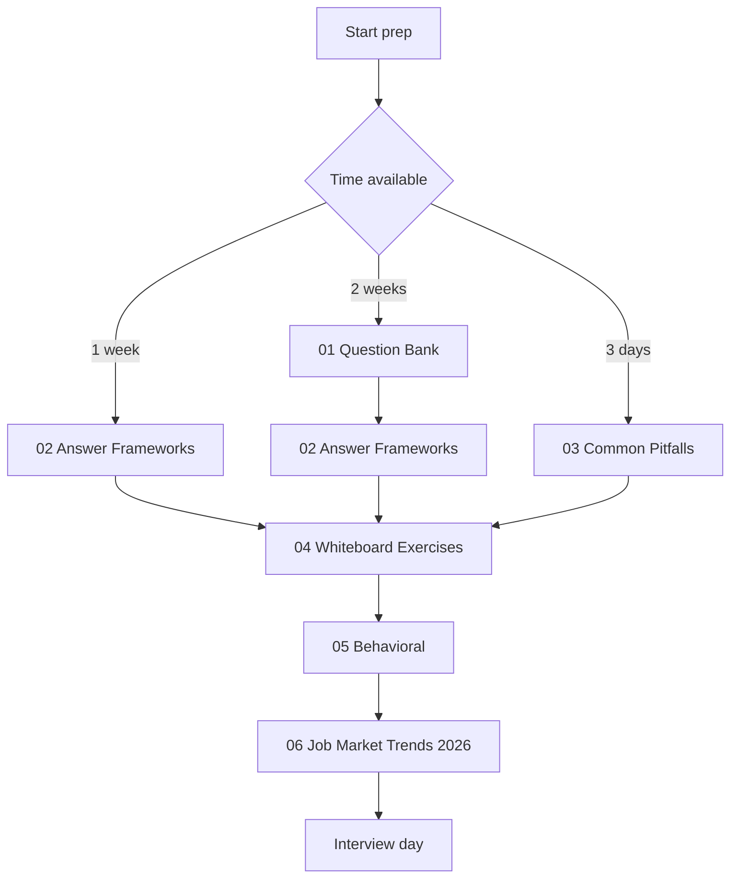
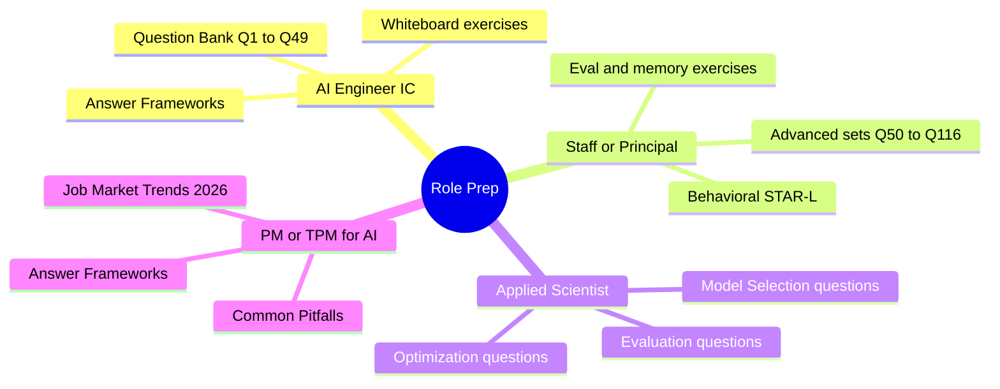

# AI System Design Interview Preparation

Interview prep for senior and staff AI engineering roles: 116 system design questions, answer frameworks with a worked mock-interview transcript, common pitfalls, nine whiteboard exercises, behavioral prep, a quick-answer FAQ, and June 2026 hiring trends.

> **What's new (June 2026):** the question bank gained a Tooling and Lifecycle section plus six June-2026 questions (Fable 5 tier routing, agentic context engineering, computer-use reliability, Agent Skills, eval gaming, cost-aware multi-provider routing) and now runs continuously Q1-Q116. The whiteboard set gained two exercises (evaluation pipeline design, agent memory and state). Frameworks gained a worked 45-minute SPIDER transcript. Behavioral gained two harder STAR-L examples, a compensation question set, and an out-loud practice guide.

## Before You Start

This folder assumes you already write production code and know LLM basics (tokens, context windows, embeddings, what RAG is). If those are shaky, spend a week in [01-foundations](../01-foundations/) and the [Courses guide](../COURSES.md) first; interview prep on top of missing fundamentals produces fluent-sounding wrong answers, which is the worst possible outcome in a senior loop.

The files in this folder are designed to be read in order. Each builds on the last: questions teach the surface area, frameworks teach how to structure answers, pitfalls teach what kills offers, exercises rehearse the motion, behavioral covers the staff-level signal, and job-market trends cover the current hiring landscape.

## Read in Order

## Role-Specific Prep Paths

## Files in This Folder

| File | Purpose |
|------|---------|
| [01-question-bank.md](01-question-bank.md) | 116 real interview questions (Q1-Q116, continuously numbered) grouped by topic, with model answers and follow-ups (through June 2026). |
| [02-answer-frameworks.md](02-answer-frameworks.md) | Five structured answer frameworks (SPIDER, ETA, tradeoff, debugging, STAR-L) plus a worked 45-minute SPIDER mock-interview transcript. |
| [03-common-pitfalls.md](03-common-pitfalls.md) | Patterns that kill staff-level offers: hand-waving on tradeoffs, missing observability, ignoring failure modes. |
| [04-whiteboard-exercises.md](04-whiteboard-exercises.md) | Nine system design exercises with worked solutions, including evaluation pipeline design and agent memory. The closest simulation of a real loop. |
| [05-behavioral-for-ai-roles.md](05-behavioral-for-ai-roles.md) | Behavioral prep for AI-specific scenarios with six worked STAR-L examples, compensation and leveling questions, and an out-loud practice guide. |
| [06-job-market-trends-2026.md](06-job-market-trends-2026.md) | Role taxonomy, comp ranges, interview process patterns, and emerging titles (FDE, AI Eval Engineer, AI Reliability Engineer, MCP Engineer). |
| [07-faq.md](07-faq.md) | Short, direct answers to the most-asked questions about AI engineering, RAG, agents, models, eval, inference, memory, and security. Useful for quick reference and for newcomers to the field. |

## Companion Resources

- [Role Transition Guide](../TRANSITION_GUIDE.md) for prepping from backend, frontend, QA, PM, or EM into AI.
- [Recommended Courses](../COURSES.md) for foundational learning before interview prep.
- [Glossary](../GLOSSARY.md) for quick term definitions during prep.
- [Case Studies](../16-case-studies/) for production architectures that map directly to whiteboard prompts.

## Key Takeaways

- The files are designed to be read in order; jumping straight to questions without absorbing answer frameworks leaves answers unstructured.
- Whiteboard exercises (file 04) are the closest simulation to real interviews; do at least three before any loop.
- Behavioral prep (file 05) is what separates staff candidates from senior candidates; do not skip it.
- The June 2026 job market chapter (file 06) is a moat: candidates who know the hiring landscape can ask better questions and tailor stories.
- Recheck this folder monthly; new question batches are added as hiring trends shift.
