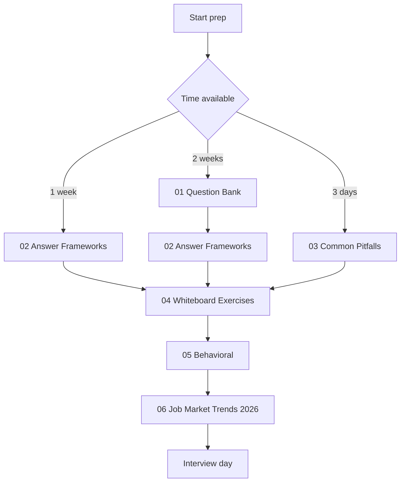
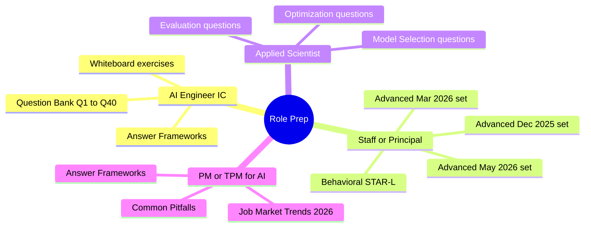

# AI System Design Interview Preparation

Interview prep for senior and staff AI engineering roles: 110+ system design questions, answer frameworks, common pitfalls, whiteboard exercises, and 2026 hiring trends.

The six files in this folder are designed to be read in order. Each builds on the last: questions teach the surface area, frameworks teach how to structure answers, pitfalls teach what kills offers, exercises rehearse the motion, behavioral covers the staff-level signal, and job-market trends cover the current hiring landscape.

## Read in Order

## Role-Specific Prep Paths

## Files in This Folder

| File | Purpose |
|------|---------|
| [01-question-bank.md](01-question-bank.md) | 110+ real interview questions grouped by topic, with model answers and follow-ups (through May 2026). |
| [02-answer-frameworks.md](02-answer-frameworks.md) | Five structured answer frameworks: SPIDER for design, ETA for concepts, tradeoff analysis, debugging, STAR-L for behavioral. |
| [03-common-pitfalls.md](03-common-pitfalls.md) | Patterns that kill staff-level offers: hand-waving on tradeoffs, missing observability, ignoring failure modes. |
| [04-whiteboard-exercises.md](04-whiteboard-exercises.md) | System design exercises with full worked solutions. The closest simulation of a real loop. |
| [05-behavioral-for-ai-roles.md](05-behavioral-for-ai-roles.md) | Behavioral interview prep for AI-specific scenarios: model deprecations, production hallucinations, eval culture. |
| [06-job-market-trends-2026.md](06-job-market-trends-2026.md) | Role taxonomy, comp ranges, interview process patterns, and emerging titles (FDE, AI Eval Engineer, AI Reliability Engineer, MCP Engineer). |

## Companion Resources

- [Role Transition Guide](../TRANSITION_GUIDE.md) for prepping from backend, frontend, QA, PM, or EM into AI.
- [Recommended Courses](../COURSES.md) for foundational learning before interview prep.
- [Glossary](../GLOSSARY.md) for quick term definitions during prep.
- [Case Studies](../16-case-studies/) for production architectures that map directly to whiteboard prompts.

## Key Takeaways

- The six files are designed to be read in order; jumping straight to questions without absorbing answer frameworks leaves answers unstructured.
- Whiteboard exercises (file 04) are the closest simulation to real interviews; do at least three before any loop.
- Behavioral prep (file 05) is what separates staff candidates from senior candidates; do not skip it.
- The May 2026 job market chapter (file 06) is a moat: candidates who know the hiring landscape can ask better questions and tailor stories.
- Recheck this folder monthly; new question batches are added as hiring trends shift.
