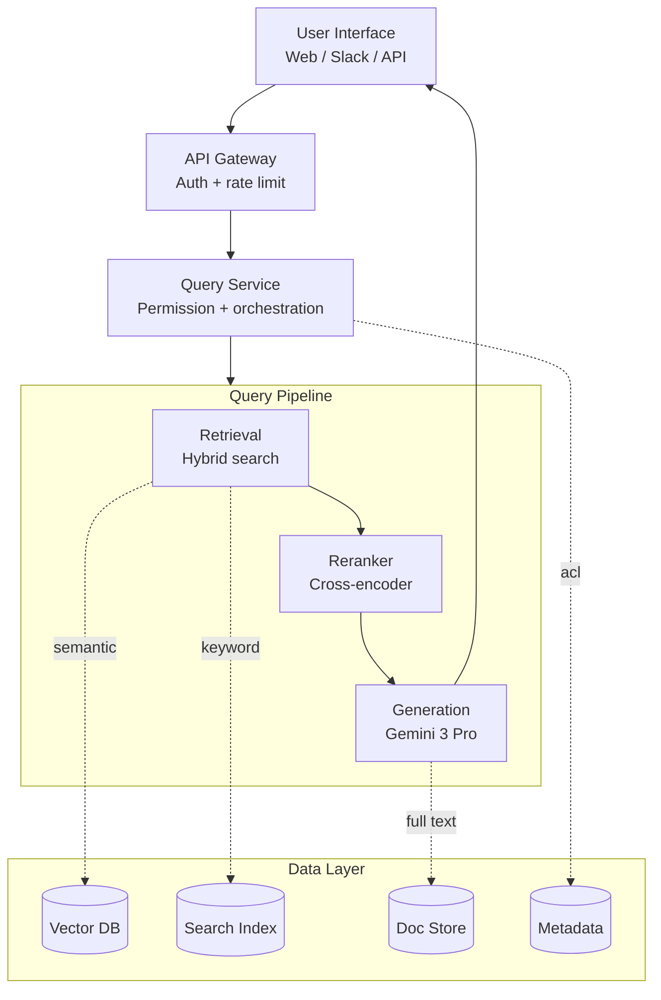
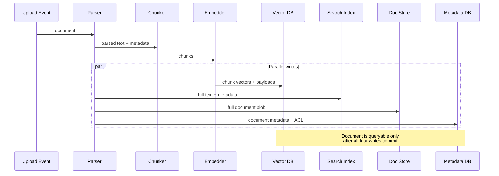
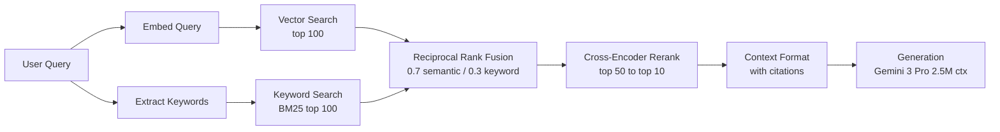

# Case Study: Enterprise RAG System

This case study walks through designing a production RAG system for enterprise document search. It covers requirements gathering, architecture decisions, and implementation details.

## Table of Contents

- [Problem Statement](#problem-statement)
- [Requirements Analysis](#requirements-analysis)
- [System Architecture](#system-architecture)
- [Component Deep Dives](#component-deep-dives)
- [Scaling Considerations](#scaling-considerations)
- [Cost Analysis](#cost-analysis)
- [Lessons Learned](#lessons-learned)
- [Interview Walkthrough](#interview-walkthrough)

---

## Problem Statement

### Scenario

A financial services company wants to build an AI-powered search system for their internal documentation:
- 500,000 documents (policies, procedures, research reports)
- 5,000 employees across multiple departments
- Documents updated daily
- Strict compliance and audit requirements
- Need to answer questions with cited sources

### Current Pain Points

- Employees spend 2+ hours/day searching for information
- Keyword search returns too many irrelevant results
- Knowledge is siloed across departments
- New employees take months to become productive

---

## Requirements Analysis

### Functional Requirements

| Requirement | Priority | Notes |
|-------------|----------|-------|
| Natural language Q&A | P0 | Core feature |
| Source citations | P0 | Compliance requirement |
| Multi-document reasoning | P1 | Connect information across docs |
| Follow-up questions | P1 | Conversational context |
| Document summarization | P2 | Quick overview of long docs |

### Non-Functional Requirements

| Requirement | Target | Rationale |
|-------------|--------|-----------|
| Latency (P95) | < 5 seconds | User experience |
| Accuracy | > 90% | Trust and adoption |
| Availability | 99.9% | Business critical |
| Concurrent users | 500 | Peak usage |
| Document freshness | < 1 hour | Policy updates |

### Security Requirements

- Role-based access control (RBAC)
- Audit logging of all queries
- No data leaves company network
- PII detection and handling

---

## System Architecture

### High-Level Architecture

```
┌─────────────────────────────────────────────────────────────────────────┐
│                           User Interface                                │
│  (Web App, Slack Bot, API)                                             │
└─────────────────────────────┬───────────────────────────────────────────┘
                              │
                              ▼
┌─────────────────────────────────────────────────────────────────────────┐
│                          API Gateway                                    │
│  • Authentication    • Rate Limiting    • Request Routing              │
└─────────────────────────────┬───────────────────────────────────────────┘
                              │
                              ▼
┌─────────────────────────────────────────────────────────────────────────┐
│                        Query Service                                    │
│  • Query understanding   • Permission check   • Orchestration          │
└─────────────────────────────┬───────────────────────────────────────────┘
                              │
        ┌─────────────────────┼─────────────────────┐
        │                     │                     │
        ▼                     ▼                     ▼
┌───────────────┐   ┌───────────────┐   ┌───────────────┐
│   Retrieval   │   │   Reranking   │   │  Generation   │
│   Service     │   │   Service     │   │   Service     │
│               │   │               │   │               │
│ • Hybrid      │   │ • Cross-      │   │ • LLM         │
│   search      │   │   encoder     │   │ • Prompt      │
│ • Filtering   │   │ • Scoring     │   │   building    │
└───────┬───────┘   └───────────────┘   └───────────────┘
        │
        ▼
┌─────────────────────────────────────────────────────────────────────────┐
│                        Data Layer                                       │
│                                                                         │
│  ┌─────────────┐  ┌─────────────┐  ┌─────────────┐  ┌─────────────┐   │
│  │  Vector DB  │  │ Search Index│  │  Doc Store  │  │  Metadata   │   │
│  │  (Qdrant)   │  │ (Elastic)   │  │   (S3)      │  │  (Postgres) │   │
│  └─────────────┘  └─────────────┘  └─────────────┘  └─────────────┘   │
│                                                                         │
└─────────────────────────────────────────────────────────────────────────┘

┌─────────────────────────────────────────────────────────────────────────┐
│                      Ingestion Pipeline                                 │
│  Document Upload → Parse → Chunk → Embed → Index → Store Metadata      │
└─────────────────────────────────────────────────────────────────────────┘
```

Rendered as a flow diagram (the layered system fans out through the query pipeline and converges through the data layer):



### Technology Choices (Dec 2025 Update)

| Component | Choice | Rationale |
|-----------|--------|-----------|
| **Primary LLM** | Gemini 3.0 Pro | **2.5M context** natively handles 100+ documents without fragmentation |
| **Agentic LLM** | GPT-5.2 | Industry-leading tool-use accuracy for complex cross-doc analysis |
| **Retriever** | Gemini 3 Flash | Low-cost retrieval over massive context windows |
| **Embeddings** | text-embedding-3-large | Proven quality and cost-efficient |
| **Vector DB** | Qdrant (Self-hosted) | Performance, filtering, and on-prem compliance |
| **Reranker** | BGE-Reranker-v2-X | Open-source SoTA for on-prem isolation |

> [!NOTE]
> **Shift in 2025:** We've moved from "Small Chunk RAG" to **"Balanced Context RAG"**. With 2.5M contexts, we no longer need to find the "perfect 512-token chunk." We retrieve entire document segments (10k-50k tokens) and let the model's native attention handle the needle.

---

## Component Deep Dives

### Document Ingestion Pipeline

```python
class IngestionPipeline:
    def __init__(self):
        self.parser = DocumentParser()
        self.chunker = SemanticChunker(
            chunk_size=512,
            chunk_overlap=50
        )
        self.embedder = OpenAIEmbedder(model="text-embedding-3-large")
        self.vector_db = QdrantClient()
        self.metadata_db = PostgresClient()
    
    async def ingest(self, document: Document, user_context: UserContext):
        # 1. Parse document
        parsed = self.parser.parse(document)
        
        # 2. Extract metadata
        metadata = self.extract_metadata(parsed, document)
        
        # 3. Chunk
        chunks = self.chunker.chunk(parsed.text)
        
        # 4. Generate embeddings (batch)
        embeddings = await self.embedder.embed_batch([c.text for c in chunks])
        
        # 5. Store in vector DB with metadata
        points = [
            {
                "id": f"{document.id}_{i}",
                "vector": embedding,
                "payload": {
                    "document_id": document.id,
                    "chunk_index": i,
                    "text": chunk.text,
                    "department": metadata.department,
                    "access_level": metadata.access_level,
                    "created_at": metadata.created_at.isoformat()
                }
            }
            for i, (chunk, embedding) in enumerate(zip(chunks, embeddings))
        ]
        
        await self.vector_db.upsert(collection="documents", points=points)
        
        # 6. Store full document
        await self.doc_store.put(document.id, parsed.text)
        
        # 7. Store metadata
        await self.metadata_db.insert_document(document.id, metadata)
        
        # 8. Index in Elasticsearch for keyword search
        await self.es_client.index(
            index="documents",
            id=document.id,
            body={"text": parsed.text, **metadata.to_dict()}
        )
```

The code reads as a linear sequence, but four of the writes happen in parallel. A sequence diagram makes the fanout explicit, which matters for understanding partial-failure modes:



### Query Processing

```python
class QueryService:
    def __init__(self):
        self.retriever = HybridRetriever()
        self.reranker = CohereReranker()
        self.generator = LLMGenerator()
        self.guardrails = GuardrailPipeline()
    
    async def process_query(
        self,
        query: str,
        user_context: UserContext,
        conversation_history: list[Message] = None
    ) -> QueryResponse:
        
        # 1. Input guardrails
        guardrail_result = self.guardrails.check_input(query)
        if not guardrail_result.passed:
            return QueryResponse(
                answer="I cannot help with that request.",
                blocked=True,
                reason=guardrail_result.reason
            )
        
        # 2. Query understanding (optional: rewrite query)
        processed_query = await self.understand_query(query, conversation_history)
        
        # 3. Retrieve candidates with permission filtering
        candidates = await self.retriever.search(
            query=processed_query,
            filters=self.build_permission_filter(user_context),
            top_k=50
        )
        
        # 4. Rerank
        reranked = await self.reranker.rerank(
            query=processed_query,
            documents=candidates,
            top_k=10
        )
        
        # 5. Build context
        context = self.build_context(reranked)
        
        # 6. Generate answer
        answer = await self.generator.generate(
            query=query,
            context=context,
            conversation_history=conversation_history
        )
        
        # 7. Output guardrails
        guardrail_result = self.guardrails.check_output(answer, context)
        if not guardrail_result.passed:
            answer = self.fallback_response()
        
        # 8. Build response with citations
        return QueryResponse(
            answer=answer,
            sources=[self.format_source(doc) for doc in reranked[:5]],
            confidence=self.calculate_confidence(reranked)
        )
    
    def build_permission_filter(self, user_context: UserContext) -> dict:
        return {
            "should": [
                {"key": "access_level", "match": {"value": "public"}},
                {"key": "department", "match": {"value": user_context.department}},
                {"key": "access_list", "match": {"any": [user_context.user_id]}}
            ]
        }
```

### Hybrid Retrieval

```python
class HybridRetriever:
    def __init__(self, vector_weight: float = 0.7, keyword_weight: float = 0.3):
        self.vector_db = QdrantClient()
        self.es_client = ElasticsearchClient()
        self.embedder = OpenAIEmbedder()
        self.vector_weight = vector_weight
        self.keyword_weight = keyword_weight
    
    async def search(
        self,
        query: str,
        filters: dict,
        top_k: int = 50
    ) -> list[Document]:
        
        # Parallel retrieval
        vector_results, keyword_results = await asyncio.gather(
            self.vector_search(query, filters, top_k * 2),
            self.keyword_search(query, filters, top_k * 2)
        )
        
        # Reciprocal Rank Fusion
        fused = self.rrf_fusion(
            [vector_results, keyword_results],
            weights=[self.vector_weight, self.keyword_weight],
            k=60
        )
        
        return fused[:top_k]
    
    async def vector_search(self, query: str, filters: dict, top_k: int):
        query_embedding = await self.embedder.embed(query)
        
        results = await self.vector_db.search(
            collection="documents",
            query_vector=query_embedding,
            query_filter=filters,
            limit=top_k
        )
        
        return [
            Document(
                id=r.payload["document_id"],
                chunk_id=r.id,
                text=r.payload["text"],
                score=r.score,
                metadata=r.payload
            )
            for r in results
        ]
    
    def rrf_fusion(self, result_lists: list, weights: list, k: int = 60) -> list:
        scores = defaultdict(float)
        docs = {}
        
        for results, weight in zip(result_lists, weights):
            for rank, doc in enumerate(results):
                rrf_score = weight / (k + rank + 1)
                scores[doc.chunk_id] += rrf_score
                docs[doc.chunk_id] = doc
        
        sorted_ids = sorted(scores.keys(), key=lambda x: scores[x], reverse=True)
        return [docs[id] for id in sorted_ids]
```

The hybrid retrieval flow at a glance. Two parallel retrievers, then RRF fuses them with weighted ranks, then a cross-encoder reranks the top candidates before context formatting:



### Generation with Massive Context (Dec 2025)

```python
class GeminiGenerator:
    def __init__(self):
        self.client = genai.GenerativeModel("gemini-3.0-pro")
    
    async def generate(
        self,
        query: str,
        context_docs: list[Document],
        conversation_history: list[Message] = None
    ) -> str:
        # 2.5M context allows passing ENTIRE documents, not just snippets
        system_instruction = """
        You are an enterprise knowledge assistant. 
        Analyze the provided documents to answer the query accurately.
        Cite every claim using [[DocName:PageNumber]] format.
        """
        
        contents = [{"text": doc.text} for doc in context_docs]
        contents.append({"text": f"User Query: {query}"})
        
        response = await self.client.generate_content_async(
            contents,
            generation_config=genai.types.GenerationConfig(temperature=0.0)
        )
        return response.text
```

> [!TIP]
> **Production Choice vs. Bleeding Edge**
> While Gemini 3.0 Pro offers 2.5M context, many production systems as of late 2025 still use **Claude 3.5 Sonnet** or **GPT-4o** as their primary generators. 
> 
> **Why?**
> - **Maturity**: 12+ months of production track record.
> - **Predictability**: Known latency patterns and fewer "hallucination spikes" on long-tail requests.
> - **SDK Stability**: Deep integration with frameworks like LangGraph and LlamaIndex.
> - **Cost**: Optimized pricing for high-volume standard RAG.

---

## Scaling Considerations

### Handling 500K Documents

```python
# Sharding strategy for Qdrant
qdrant_config = {
    "collection": "documents",
    "vectors": {
        "size": 3072,  # text-embedding-3-large
        "distance": "Cosine"
    },
    "optimizers": {
        "indexing_threshold": 20000  # Build index after 20K points
    },
    "replication_factor": 2,  # High availability
    "shard_number": 4  # Distribute across nodes
}
```

### Handling 500 Concurrent Users

```
Load Balancer
     │
     ├──► Query Service (replica 1)
     ├──► Query Service (replica 2)
     ├──► Query Service (replica 3)
     └──► Query Service (replica 4)
            │
            ├──► Vector DB (3-node cluster)
            ├──► LLM API (with retry/fallback)
            └──► Elasticsearch (3-node cluster)
```

### Caching Strategy

```python
class QueryCache:
    def __init__(self):
        self.exact_cache = Redis(ttl=3600)  # 1 hour
        self.semantic_cache = SemanticCache(threshold=0.95, ttl=1800)
    
    async def get_or_compute(self, query: str, user_context: UserContext) -> QueryResponse:
        # Check exact cache
        cache_key = self.make_key(query, user_context.permissions)
        cached = await self.exact_cache.get(cache_key)
        if cached:
            return cached
        
        # Check semantic cache
        similar = await self.semantic_cache.find_similar(query, user_context.permissions)
        if similar:
            return similar
        
        # Compute
        response = await self.query_service.process_query(query, user_context)
        
        # Cache result
        await self.exact_cache.set(cache_key, response)
        await self.semantic_cache.add(query, user_context.permissions, response)
        
        return response
```

---

## Cost Analysis

### Monthly Cost Estimate (500 Users, 100 Queries/User/Day)

| Component | Calculation | Monthly Cost |
|-----------|-------------|--------------|
| LLM (Claude Sonnet) | 1.5M queries × 2K tokens × $3/1M in + 500 tokens × $15/1M out | ~$20,250 |
| Embeddings | 1.5M queries × $0.13/1M | ~$200 |
| Reranking (Cohere) | 1.5M × 50 docs × $0.001/1K | ~$75 |
| Vector DB (Qdrant Cloud) | 3-node cluster | ~$1,500 |
| Elasticsearch | 3-node cluster | ~$2,000 |
| Compute (Query Service) | 4 instances | ~$1,000 |
| **Total** | | **~$25,000/month** |

### Cost Optimization Opportunities

1. **Caching**: 30% cache hit rate → $6K savings on LLM
2. **Model routing**: Route simple queries to cheaper model → 40% savings
3. **Batch embeddings**: Use async batching → 20% savings
4. **Self-hosted reranker**: Replace Cohere with open source → Eliminate $75

---

## Lessons Learned

### What Worked Well

1. **Hybrid search**: Combined semantic + keyword significantly improved recall
2. **Reranking**: 15% improvement in top-5 precision
3. **Clear citations**: Built trust with users
4. **Permission filtering at retrieval**: No post-hoc filtering needed

### Challenges Encountered

1. **Table extraction**: PDFs with complex tables required custom parsing
2. **Acronyms**: Domain-specific acronyms needed expansion
3. **Freshness**: 1-hour freshness required streaming ingestion
4. **Long documents**: 100+ page documents needed hierarchical chunking

### What We Would Do Differently

1. Start with better document parsing earlier
2. Build evaluation pipeline before scaling
3. Implement query logging from day one
4. Create feedback loop with users sooner

---

## Interview Walkthrough

### How to Present This in an Interview

**Opening (2 min):**
"I will design an enterprise RAG system for internal document search. Let me clarify a few requirements first..."

**Requirements (3 min):**
- Ask about scale, latency, accuracy targets
- Clarify security requirements
- Understand document types and update frequency

**High-Level Design (5 min):**
- Draw the architecture diagram
- Explain key components
- Justify technology choices

**Deep Dive (10 min):**
- Retrieval strategy (hybrid search, why)
- Security (permission filtering at query time)
- Generation (prompt engineering, citations)
- Scaling (sharding, caching, replicas)

**Tradeoffs (5 min):**
- Cost vs latency (model selection)
- Accuracy vs latency (reranking adds time)
- Freshness vs cost (streaming vs batch)

**Monitoring (2 min):**
- Key metrics (latency, accuracy, user feedback)
- How to detect issues
- Continuous improvement loop

---

*Next: [Case Study: Conversational AI Agent](02-conversational-agent.md)*
