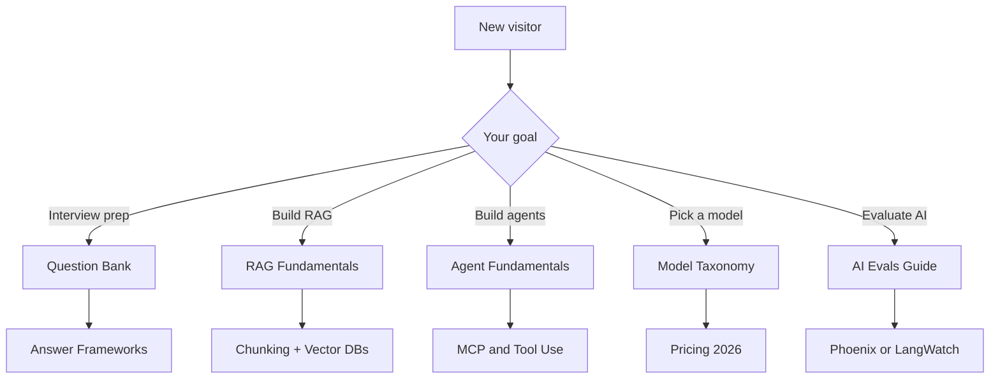
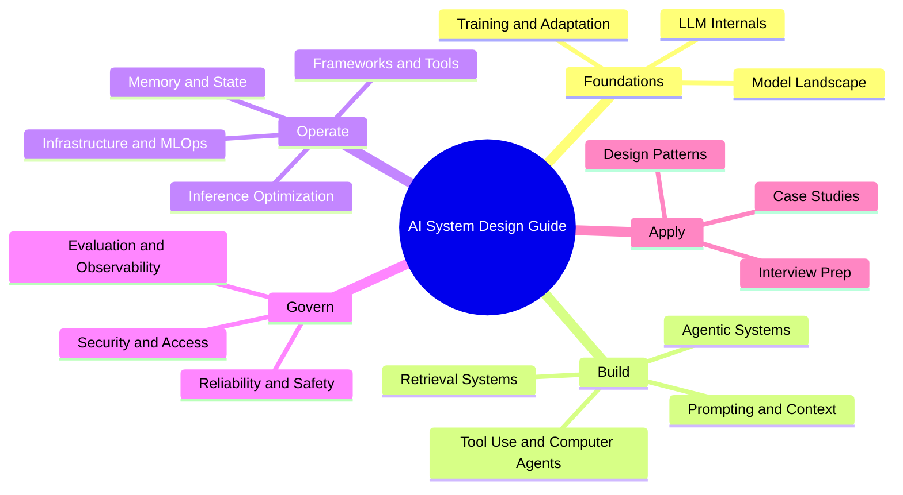

# 🧠 AI System Design Guide
### The Complete Interview & Production Reference

<p align="center">
  <a href="https://github.com/ombharatiya"></a>
  <a href="https://x.com/ombharatiya"></a>
  <a href="https://linkedin.com/in/ombharatiya"></a>
</p>

<p align="center">
  <a href="https://github.com/ombharatiya/ai-system-design-guide/commits/main"></a>
  <a href="LICENSE"></a>
  <a href="#-contributing"></a>
  <a href="https://github.com/ombharatiya/ai-system-design-guide/stargazers"></a>
  <a href="https://github.com/ombharatiya/ai-system-design-guide/graphs/contributors"></a>
  <a href="https://github.com/ombharatiya/ai-system-design-guide/issues"></a>
</p>

> **The living reference for production AI systems.** Continuously updated. Interview-ready depth.

A practical, continuously updated guide to AI system design, RAG architectures, LLM engineering, agentic AI, MCP and A2A protocols, and AI engineering interview preparation. Covers production patterns, model selection, evaluation, and real-world case studies from staff-level interviews.

**New here?** Jump to the [110-question Interview Bank](00-interview-prep/01-question-bank.md), the [RAG Fundamentals chapter](06-retrieval-systems/01-rag-fundamentals.md), or pick the [right LLM for production](02-model-landscape/01-model-taxonomy.md).

---

## 📚 Quick Navigation

| I want to... | Start here |
|--------------|------------|
| **Prepare for interviews** | [Question Bank](00-interview-prep/01-question-bank.md) → [Answer Frameworks](00-interview-prep/02-answer-frameworks.md) |
| **Learn AI systems fast** | [LLM Internals](01-foundations/01-llm-internals.md) → [RAG Fundamentals](06-retrieval-systems/01-rag-fundamentals.md) |
| **Build production RAG** | [Chunking](06-retrieval-systems/02-chunking-strategies.md) → [Vector DBs](06-retrieval-systems/04-vector-databases.md) → [Reranking](06-retrieval-systems/06-reranking-strategies.md) → [Production RAG](06-retrieval-systems/14-production-rag-at-scale.md) |
| **Advanced retrieval** | [Contextual Retrieval](06-retrieval-systems/10-contextual-retrieval.md) → [ColBERT](06-retrieval-systems/11-late-interaction-colbert.md) → [Multi-modal RAG](06-retrieval-systems/12-multimodal-rag.md) |
| **Design multi-tenant AI** | [Isolation Patterns](12-security-and-access/04-multi-tenant-rag-isolation.md) → [Case Study](16-case-studies/08-multi-tenant-saas.md) |
| **Build agents** | [Agent Fundamentals](07-agentic-systems/01-agent-fundamentals.md) → [MCP & A2A](07-agentic-systems/03-tool-use-and-mcp.md) → [LangGraph](09-frameworks-and-tools/02-langgraph-orchestration.md) |
| **Tool-use & computer agents** | [Landscape](17-tool-use-and-computer-agents/01-tool-use-landscape.md) → [OpenClaw](17-tool-use-and-computer-agents/03-openclaw-deep-dive.md) → [Safety](17-tool-use-and-computer-agents/07-safety-and-governance.md) |
| **Autonomous coding agents** | [Claude Code](09-frameworks-and-tools/09-claude-code.md) → [OpenCoder Landscape](09-frameworks-and-tools/10-opencoderguide.md) |
| **Pick the right model (2026)** | [Model Taxonomy](02-model-landscape/01-model-taxonomy.md) → [Pricing](02-model-landscape/03-pricing-and-costs.md) |
| **Evaluate AI in production** | [AI Evals Guide (Phoenix/Langfuse)](ai_evals_comprehensive_study_guide.md) → [AI Evals Guide (LangWatch/Langfuse)](ai_evals_complete_guide_langwatch_langfuse.md) |
| **Find the best courses to learn AI** | [Recommended Courses & Learning Paths](COURSES.md) |
| **Transition from my current role to AI** | [Role Transition Guide](TRANSITION_GUIDE.md) |
| **Understand the 2026 AI job market** | [Job Market Trends - May 2026](00-interview-prep/06-job-market-trends-2026.md) ⭐ *NEW* |
| **Look up a term** | [Glossary](GLOSSARY.md) (every term defined) |

### Pick a path



---

## 🎯 Why This Guide

**Traditional books are outdated before they ship.** This is a living document: when new models release, when patterns evolve, this updates.

| This Guide | Printed Books |
|------------|---------------|
| May 2026 models (Claude Opus 4.7, GPT-5.5, Gemini 3.1 Pro, DeepSeek V4 Pro, Llama 4, Kimi K2.6, Qwen 3.6, Mistral Medium 3.5, Gemma 4) | Stuck on GPT-4 |
| MCP 2.0, A2A v1.0, OpenClaw, Computer Use, Agentic RAG, ColBERT, latent reasoning, MoE serving | Does not exist |
| Real pricing with May 2026 verification dates | Already wrong |
| Staff-level interview Q&A (110 questions through May 2026) + Job Market Trends | Generic questions |

**Quick model picker (May 2026):** Claude Opus 4.7 for tool-use and long-context reasoning, GPT-5.5 for general production, Gemini 3.1 Pro for multimodal, DeepSeek V4 Pro and Llama 4 for self-hosted. Full breakdown in [Model Taxonomy](02-model-landscape/01-model-taxonomy.md).

---

## 🎯 What This Guide Is (and Is Not)

**This guide IS:**
- A staff-level reference for designing production AI systems (RAG, agents, MCP, eval pipelines, multi-tenant isolation).
- An interview-prep companion with 110+ real questions, answer frameworks, and whiteboard exercises through May 2026.
- A living document tracking new model releases, protocol changes, and emerging patterns as they ship.
- Opinionated about tradeoffs: latency vs cost, accuracy vs faithfulness, single-agent vs multi-agent.
- Free, MIT-licensed, and open to PRs from practitioners.

**This guide is NOT:**
- A tutorial on Python, PyTorch, or basic ML fundamentals (start with a course; see [COURSES.md](COURSES.md)).
- A vendor-neutral hedge; it names specific models, prices, and frameworks because real systems require real choices.
- A replacement for hands-on building; read it alongside a project, not instead of one.
- A research paper digest; it cites papers when they change practice, not for completeness.

---

## 📖 Guide Structure

```
├── 00-interview-prep/           # Questions (110), frameworks, exercises, job-market trends (May 2026)
├── 01-foundations/              # Transformers, attention, embeddings
├── 02-model-landscape/          # Claude Opus 4.7, GPT-5.5, Gemini 3.1, DeepSeek V4, Llama 4, Kimi K2.6, Qwen 3.6, Mistral Medium 3.5
├── 03-training-and-adaptation/  # Fine-tuning, LoRA, DPO, distillation
├── 04-inference-optimization/   # KV cache, PagedAttention, vLLM
├── 05-prompting-and-context/    # Prompt engineering, CoT, Extended Thinking, DSPy, prompt injection
├── 06-retrieval-systems/        # RAG, chunking, GraphRAG, Agentic RAG, ColBERT, Contextual Retrieval
├── 07-agentic-systems/          # MCP 2.0, A2A protocol, multi-agent, computer-use
├── 08-memory-and-state/         # L1-L3 memory tiers, Mem0, caching
├── 09-frameworks-and-tools/     # LangGraph, DSPy, LlamaIndex, Claude Code, OpenCoder
├── 10-document-processing/      # Vision-LLM OCR, multimodal parsing
├── 11-infrastructure-and-mlops/ # GPU clusters, LLMOps, cost management
├── 12-security-and-access/      # RBAC, ABAC, multi-tenant isolation
├── 13-reliability-and-safety/   # Guardrails, red-teaming
├── 14-evaluation-and-observability/ # RAGAS, LangSmith, drift detection
├── 15-ai-design-patterns/       # Pattern catalog, anti-patterns
├── 16-case-studies/             # Real-world architectures with diagrams
├── 17-tool-use-and-computer-agents/ # OpenClaw, Computer Use, tool agents, safety
├── GLOSSARY.md                  # Every term defined
│
├── ai_evals_comprehensive_study_guide.md      # 🔬 Deep-dive: AI Evals (Phoenix + Langfuse)
└── ai_evals_complete_guide_langwatch_langfuse.md  # 🔬 Deep-dive: AI Evals (LangWatch + Langfuse)
└── COURSES.md                   # 🎓 Recommended courses & learning paths
└── TRANSITION_GUIDE.md          # 🔄 Transition from Backend/QA/PM/EM to AI roles
```

### Chapters by AI System Lifecycle Stage



---

## 🔥 Featured Case Studies

Real interview problems with complete solutions and diagrams:

| Case Study | Problem | Key Patterns |
|------------|---------|--------------|
| [Real-Time Search](16-case-studies/06-real-time-search.md) | 5-minute data freshness at scale | Streaming + Hybrid Search |
| [Coding Agent](16-case-studies/07-autonomous-coding-agent.md) | Autonomous multi-file changes | Sandboxing + Self-Correction |
| [Multi-Tenant SaaS](16-case-studies/08-multi-tenant-saas.md) | Coca-Cola and Pepsi on same infra | Defense-in-Depth Isolation |
| [Customer Support](16-case-studies/09-customer-support-automation.md) | 60% auto-resolution rate | Tiered Routing + Escalation |
| [Document Intelligence](16-case-studies/10-document-intelligence.md) | 50K contracts/month extraction | Vision-LLM + Parallel Extractors |
| [Recommendation Engine](16-case-studies/11-recommendation-engine.md) | Personalized explanations at 50M users | ML Ranking + LLM Explanations |
| [Compliance Automation](16-case-studies/12-compliance-automation.md) | FDA regulation pre-screening | Claim Extraction + Precedent DB |
| [Voice Healthcare](16-case-studies/13-voice-ai-healthcare.md) | Real-time clinical note generation | On-Prem ASR + HIPAA |
| [Fraud Detection](16-case-studies/14-fraud-detection.md) | 100ms decision with explainability | ML + Rules Hybrid |
| [Knowledge Management](16-case-studies/15-knowledge-management.md) | 2M docs with access control | Permission-Aware RAG |
| [Computer-Use Agent](16-case-studies/16-computer-use-agent-production.md) | Expense-report automation across 3 legacy UIs | Firecracker VMs + Action Gate + IPI Defense |
| [Multi-Tenant Fine-Tuning](16-case-studies/17-multi-tenant-fine-tuning-platform.md) | 280 tenants on shared base + per-tenant LoRA | LoRA Hot-Swap + Eval-as-PRD per Tenant |
| [Eval-Gated CI/CD](16-case-studies/18-eval-gated-cicd.md) | Block PRs that regress AI quality | Golden Sets + LLM Judges + Statistical Correction |
| [Customer Distillation](16-case-studies/19-customer-distillation-pipeline.md) | Cut $50K/mo frontier spend to $6K with 3-mo payback | Trace-Based Distillation + Canary Rollout |
| [MCP Knowledge Agent](16-case-studies/20-mcp-knowledge-agent.md) | Cross-system answers from Snowflake/Confluence/Jira/Slack | MCP + OAuth Resource Server + Capability Gating |

---

## 🔬 Bonus Deep-Dive Guides

Two companion guides (3,000+ lines each) covering AI evaluation end-to-end - for Engineers, PMs, and QAs:

| Guide | Platforms Covered | What's Inside |
|-------|------------------|---------------|
| [AI Evals: Comprehensive Study Guide](ai_evals_comprehensive_study_guide.md) | Arize Phoenix + Langfuse | LLM-as-a-Judge, RAG eval, multi-turn eval, production safety, statistical correction with `judgy`, 30-day learning path |
| [AI Evals: LangWatch + Langfuse Guide](ai_evals_complete_guide_langwatch_langfuse.md) | LangWatch + Langfuse | Same syllabus with LangWatch's 40+ built-in evaluators, side-by-side platform comparisons, platform choice guidance |

**Topics covered across both guides:**
- Tracing and observability setup (Phoenix, LangWatch, Langfuse)
- Error analysis: open coding → axial coding → failure mode taxonomy
- Building LLM judges with Train/Dev/Test split and ground truth calibration
- Code-based evaluators (regex, JSON schema, format validators)
- RAG-specific evals: faithfulness, context recall, answer relevance
- Multi-step pipeline evaluation and multi-turn conversation eval
- Production guardrails, safety monitoring, real-time drift detection
- Statistical correction with `judgy` library
- Human annotation best practices and inter-rater reliability
- Cost/latency optimization for eval pipelines at scale

---

## 🎓 For Interview Prep

AI engineering and system design interviews ask questions like:

> "Design a multi-tenant RAG system where competitors cannot see each other's data."

> "Your agent takes 15 steps for a 3-step task. How do you debug it?"

This guide gives you **concrete patterns**, **real tradeoffs**, and **production failure modes**: the depth interviewers expect at senior levels.

➡️ Start with [Interview Prep](00-interview-prep/)

---

## ❓ Frequently Asked Questions

### What is AI system design?
AI system design is the discipline of architecting production-grade systems built around LLMs, retrieval, agents, and evaluation. It covers model selection, RAG pipelines, agent orchestration, memory, observability, and safety. See [LLM Internals](01-foundations/01-llm-internals.md) and [AI Design Patterns](15-ai-design-patterns/) to get oriented.

### How do I prepare for an AI engineering interview?
Start with the [Question Bank](00-interview-prep/01-question-bank.md) (110 questions through May 2026), then practice with [Answer Frameworks](00-interview-prep/02-answer-frameworks.md) and [Whiteboard Exercises](00-interview-prep/04-whiteboard-exercises.md). Most senior interviews test RAG design, agent debugging, multi-tenant isolation, and cost/latency tradeoffs, all covered in the [Case Studies](16-case-studies/).

### What is RAG (Retrieval-Augmented Generation)?
RAG is a pattern where an LLM retrieves relevant context from an external knowledge source (vector DB, search index, graph) before generating an answer, reducing hallucinations and grounding responses in your data. The full pipeline is covered in [RAG Fundamentals](06-retrieval-systems/01-rag-fundamentals.md) and scaled in [Production RAG at Scale](06-retrieval-systems/14-production-rag-at-scale.md).

### What are AI agents and how are they different from chatbots?
AI agents are LLM-driven systems that plan, call tools, and act over multiple steps to accomplish goals, whereas chatbots typically respond in a single turn. Agents introduce loops, memory, error recovery, and tool-use via protocols like MCP. Start with [Agent Fundamentals](07-agentic-systems/01-agent-fundamentals.md).

### What is MCP (Model Context Protocol) and how does it compare to A2A?
MCP is an open protocol that lets LLMs discover and call external tools and data sources in a standardized way. A2A (Agent-to-Agent) is a complementary protocol for inter-agent communication. They solve different layers: MCP is the tool boundary, A2A is the agent boundary. See [Tool Use and MCP](07-agentic-systems/03-tool-use-and-mcp.md).

### Which LLM should I use in production: Claude, GPT, Gemini, or open-source?
It depends on latency budget, context length, cost per million tokens, tool-use quality, and data residency. The [Model Taxonomy](02-model-landscape/01-model-taxonomy.md) and [Pricing](02-model-landscape/03-pricing-and-costs.md) chapters give a head-to-head for Claude Opus 4.7, GPT-5.5, Gemini 3.1 Pro, DeepSeek V4, Llama 4, and others as of May 2026.

### How do I evaluate an LLM or RAG system in production?
Combine offline evals (LLM-as-a-judge with ground-truth calibration), online metrics (faithfulness, context recall, answer relevance), and continuous tracing. The companion deep-dives [AI Evals: Phoenix + Langfuse](ai_evals_comprehensive_study_guide.md) and [AI Evals: LangWatch + Langfuse](ai_evals_complete_guide_langwatch_langfuse.md) walk through this end-to-end.

### How do I build a multi-tenant RAG system safely?
Use defense-in-depth: per-tenant indexes or namespaces, query-time access checks, and prompt-layer guards. The [Multi-Tenant RAG Isolation](12-security-and-access/04-multi-tenant-rag-isolation.md) chapter and [Multi-Tenant SaaS Case Study](16-case-studies/08-multi-tenant-saas.md) cover the patterns that hold up in interviews and production.

### What is agentic RAG?
Agentic RAG combines retrieval with an agent loop that can decide what to search, when to re-query, and when to escalate, instead of running a single fixed retrieve-then-generate pass. See [Agentic RAG](06-retrieval-systems/08-agentic-rag.md) for the architectures and tradeoffs.

### Is this guide free? Can I contribute?
Yes, MIT-licensed and free. PRs are welcome; see [Contributing Guide](CONTRIBUTING.md). If you have production failure modes, new model benchmarks, or interview questions to add, open a PR.

### How often is this guide updated?
Continuously. New model releases, protocol changes (MCP, A2A), and emerging patterns are added as they ship. Recent additions include [Tool-Use and Computer Agents](17-tool-use-and-computer-agents/01-tool-use-landscape.md) and the [May 2026 Job Market Trends](00-interview-prep/06-job-market-trends-2026.md).

### Can I use this guide if I am transitioning from backend, QA, PM, or EM into AI?
Yes. The [Role Transition Guide](TRANSITION_GUIDE.md) maps existing skills to AI engineering, MLE, and AI architect tracks, with reading paths per role. Pair it with [COURSES.md](COURSES.md) for curated learning resources.

---

## 🔄 Living Book

This guide tracks:
- New model releases and real-world performance
- Emerging patterns (MCP, Agentic RAG, Flow Engineering)
- Updated pricing and rate limits
- Deprecations and best practice changes

**⭐ Star and Watch** to get notified when updates are pushed.

---

## 🤝 Contributing

Found outdated info? Have production experience to share? PRs welcome.
See [Contributing Guide](CONTRIBUTING.md).

---

## 📄 License

MIT License. See [LICENSE](LICENSE).

---

<p align="center">
  <b>Built by <a href="https://github.com/ombharatiya">Om Bharatiya</a></b><br/>
  <a href="https://github.com/ombharatiya"></a>
  <a href="https://x.com/ombharatiya"></a>
  <a href="https://linkedin.com/in/ombharatiya"></a>
</p>
