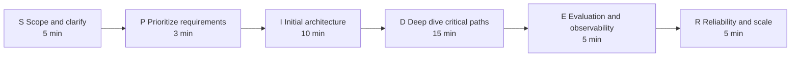
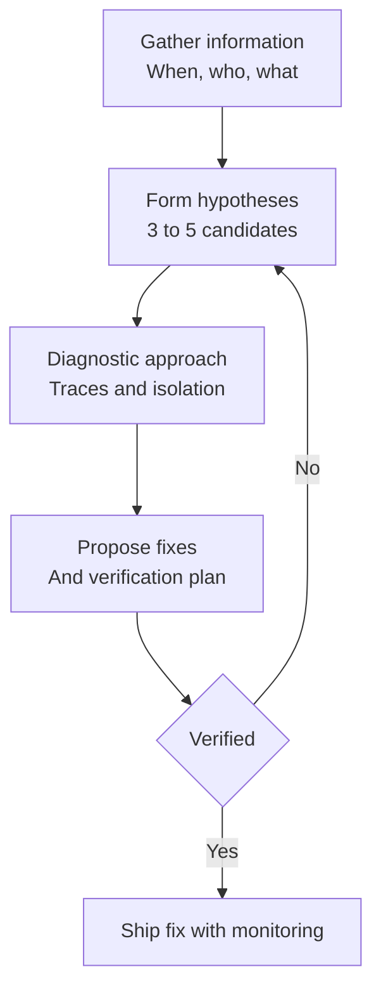

# Answer Frameworks for AI System Design Interviews

Five structured frameworks for AI system design interviews: SPIDER for design questions, ETA for concepts, tradeoff analysis, debugging, and STAR-L for behavioral.

Strong interview answers follow consistent structures. This chapter provides frameworks for different question types, with examples and anti-patterns. Pair these frameworks with worked examples from the [Question Bank](01-question-bank.md) and rehearse with [Whiteboard Exercises](04-whiteboard-exercises.md).

## Table of Contents

- [System Design Framework (SPIDER)](#system-design-framework-spider)
- [Worked Example: SPIDER in a 45-Minute Session](#worked-example-spider-in-a-45-minute-session) ⭐ *NEW*
- [Concept Explanation Framework (ETA)](#concept-explanation-framework-eta)
- [Tradeoff Analysis Framework](#tradeoff-analysis-framework)
- [Debugging and Troubleshooting Framework](#debugging-and-troubleshooting-framework)
- [Behavioral Questions Framework (STAR-L)](#behavioral-questions-framework-star-l)
- [Handling Unknown Topics](#handling-unknown-topics)
- [Common Mistakes and How to Avoid Them](#common-mistakes-and-how-to-avoid-them)

---

## System Design Framework (SPIDER)

Use this framework for any system design question involving AI components. The full motion with rough time budget per phase:



### S - Scope and Clarify

**Purpose:** Narrow the problem space and show you think before you build.

**Questions to ask:**
- What is the scale? (users, requests, data volume)
- What are the latency requirements?
- What accuracy or quality bar must we meet?
- Are there compliance or security requirements?
- What is the existing infrastructure?
- What is the budget constraint?

**Example:**
```
Interviewer: Design a customer support chatbot.

You: Before I dive in, I want to clarify a few things:
- What volume are we expecting? Thousands or millions of conversations per day?
- Is this customer-facing or internal support?
- What languages need to be supported?
- Do we need to integrate with existing ticketing systems?
- What is our accuracy target for resolved vs escalated?
```

**Anti-pattern:** Jumping straight into architecture without understanding requirements.

---

### P - Prioritize Requirements

**Purpose:** Identify what matters most and design toward it.

**Create a priority matrix:**

| Requirement | Priority | Implication |
|-------------|----------|-------------|
| Low latency | High | May limit model size |
| High accuracy | High | Need good retrieval + eval |
| Cost efficiency | Medium | Optimize with caching |
| Multi-language | Medium | Affects embedding choice |

**State your priorities explicitly:**
```
"Given these requirements, I will prioritize latency and accuracy. 
Cost optimization will be a second-order concern once we have the basic system working."
```

---

### I - Initial Architecture

**Purpose:** Draw the high-level system before diving into details.

**Standard components for AI systems:**
```
┌──────────┐     ┌──────────┐     ┌──────────┐     ┌──────────┐
│  Client  │────▶│  API GW  │────▶│ AI Layer │────▶│  LLM(s)  │
└──────────┘     └──────────┘     └──────────┘     └──────────┘
                                        │
                                        ▼
                                  ┌──────────┐
                                  │ Data/RAG │
                                  └──────────┘
```

**Explain each component briefly:**
- What it does
- Why it is needed
- What alternatives exist

---

### D - Deep Dive into Critical Paths

**Purpose:** Show depth on the most important parts.

**Choose 2-3 areas to deep dive based on:**
- What the interviewer seems most interested in
- What is novel or complex about this system
- Where the biggest risks lie

**Example deep dives:**
- RAG pipeline: chunking, embedding, retrieval, reranking
- Agent loop: tool selection, error handling, termination
- Data pipeline: ingestion, processing, indexing
- Security: isolation, permissions, audit

**Signal your intent:**
```
"I will now go deeper on the RAG pipeline since retrieval quality is critical to this system."
```

---

### E - Evaluation and Observability

**Purpose:** Show you think about production operations.

**Cover:**
1. **Metrics:** What do you measure?
2. **Evaluation:** How do you know it works?
3. **Monitoring:** How do you detect problems?
4. **Alerting:** When do humans get paged?

**Standard metrics for AI systems:**
- Latency (p50, p95, p99)
- Token usage / cost
- Quality scores (offline and sampled online)
- Error rates by type
- Cache hit rates

---

### R - Reliability and Scale

**Purpose:** Address failure modes and growth.

**Failure modes to discuss:**
- LLM provider outage
- Rate limiting
- Bad model outputs
- Data pipeline failures
- Cache invalidation

**Scaling considerations:**
- Where are the bottlenecks?
- What scales horizontally vs vertically?
- What costs scale with usage?

---

## Worked Example: SPIDER in a 45-Minute Session

A condensed transcript showing how the framework sounds in a real loop. The prompt: "Design a document Q&A system for a 10,000-employee company." Notes in brackets mark the framework step and the clock.

```
[0:00 - S: Scope]
You: "Before I draw anything, let me scope this. Roughly how many
documents, what types, and what freshness do answers need?"
Interviewer: "About 2 million documents, mostly PDFs and wikis.
Updated daily is fine."
You: "Two more: what accuracy bar are we targeting, and is this
internal-only or exposed to customers?"
Interviewer: "Internal. Wrong answers are embarrassing but not
catastrophic. p95 under 3 seconds."
You: "So: 2M mixed documents, daily freshness, internal users,
soft accuracy bar, p95 under 3s. I'll design for 10K employees
with maybe 5% daily active. That's roughly 500-2,000 queries/hour
at peak. Sound right?"
Interviewer: "Works."

[0:05 - P: Plan the architecture out loud]
You: "I'll draw the full pipeline first, then deep dive where you
want. Ingestion on the left: connectors, parsing, chunking,
embedding, vector store. Serving on the right: query, hybrid
retrieval, rerank, generation with citations, response. Eval and
monitoring underneath as a cross-cutting layer."

[0:08 - I: Identify components, draw and narrate]
You: "Ingestion: connectors pull from SharePoint and Confluence
nightly. Parsing handles PDFs with a document-AI tier first and a
vision-LLM fallback for complex layouts. Chunking is structure-
aware, 300-500 tokens with headers prepended. Embeddings go into
a vector DB with metadata: source, team, date, access tags."
Interviewer: "Why hybrid retrieval instead of pure vector?"
You: "Internal corpora are full of project codenames and
acronyms. Embeddings miss exact-match tokens; BM25 catches them.
RRF to fuse, cross-encoder rerank on the top 50. That combination
is the difference between 70% and 90%+ retrieval hit rate here."

[0:18 - D: Deep dive where the interviewer steers]
Interviewer: "Go deeper on access control."
You: "Permissions evaluated at retrieval time, not index time.
Every chunk carries ACL tags from the source system. The retrieval
query filters on the caller's groups before similarity scoring, so
a result the user can't read never enters the candidate set. Index-
time filtering breaks the moment permissions change; retrieval-time
filtering follows the source of truth. Cache keys include the
permission set so a cached answer never leaks across groups."

[0:30 - E: Evaluate your own design]
You: "Weaknesses I'd flag in my own design: nightly sync means up
to 24h staleness, fine per requirements but I'd add webhook-based
invalidation for the wikis later. The reranker adds ~150ms at p95,
worth it for quality. Failure modes: provider outage falls back to
a second model with provider-specific prompts; retrieval returning
nothing returns 'not found in our docs' rather than letting the
model improvise."

[0:38 - R: Requirements check and evaluation story]
You: "Back to the requirements: 3s p95 gives me a budget of
~400ms retrieval, ~150ms rerank, ~2s generation, with streaming so
perceived latency is under a second. For quality, I'd stand up a
200-case golden set from real employee questions, score
faithfulness and citation accuracy with an LLM judge calibrated
monthly against human review, and sample 2% of production traffic.
Anything else you'd like me to go deeper on?"
```

**What this transcript demonstrates:**
- Scope took five minutes and produced numbers the whole design referenced.
- The candidate narrated while drawing and invited steering at each phase.
- Deep-dive answers led with the decision, then the reason, then the failure mode.
- The candidate critiqued their own design before the interviewer had to.
- Evaluation was part of the design, not an afterthought.

---

## Concept Explanation Framework (ETA)

Use this for conceptual questions like "Explain RAG" or "What is speculative decoding?"

### E - Explain Simply

Start with a one-sentence definition anyone could understand.

**Example for KV Cache:**
```
"KV cache stores intermediate computations during LLM generation so we 
do not have to redo work for previous tokens when generating each new token."
```

---

### T - Technical Details

Add the technical depth appropriate for the interviewer.

**Example for KV Cache:**
```
"Specifically, for each layer in the transformer, we cache the Key and 
Value tensors for all positions. On each new token, we only compute K 
and V for the new position and concatenate with the cache. 

The memory scales as: 2 × layers × heads × head_dim × sequence_length × batch_size

For a 70B model with 8K context, that is roughly 10GB per request."
```

---

### A - Applications and Tradeoffs

Connect to practical usage and discuss tradeoffs.

**Example for KV Cache:**
```
"This is critical for production serving. Without it, generation would be 
quadratic in sequence length.

The tradeoff is memory usage. This is why techniques like PagedAttention 
and Grouped Query Attention exist: to reduce KV cache memory while 
preserving the benefits.

Context caching features from OpenAI and Anthropic are essentially 
server-side KV cache persistence for shared prefixes."
```

---

## Tradeoff Analysis Framework

When asked to compare options or justify a decision, use this structure.

### Step 1: State the Options Clearly

```
"For embedding models, we have three main options:
1. OpenAI text-embedding-3-large: Highest quality, API cost
2. Cohere embed-v3: Good quality, better pricing
3. Self-hosted BGE: Full control, operational overhead"
```

### Step 2: Define Evaluation Criteria

Pick criteria that matter for this specific decision:

| Criteria | Weight | Reasoning |
|----------|--------|-----------|
| Quality | High | Search accuracy is key feature |
| Cost at scale | High | 100M embeddings/month |
| Latency | Medium | Batch indexing, not real-time |
| Ops overhead | Medium | Small team |

### Step 3: Analyze Each Option

Create a comparison matrix:

| Option | Quality | Cost | Latency | Ops | Score |
|--------|---------|------|---------|-----|-------|
| OpenAI | ★★★★★ | ★★ | ★★★★ | ★★★★★ | 4.2 |
| Cohere | ★★★★ | ★★★★ | ★★★★ | ★★★★★ | 4.2 |
| BGE | ★★★★ | ★★★★★ | ★★★ | ★★ | 3.6 |

### Step 4: Make a Recommendation with Reasoning

```
"I would recommend Cohere for this use case because:
1. Quality is close to OpenAI based on MTEB scores
2. Better pricing at our volume (100M embeddings/month)
3. No operational overhead vs self-hosting
4. We can switch to self-hosted later if costs become prohibitive

The risk is vendor dependency, which we mitigate by 
abstracting the embedding interface."
```

---

## Debugging and Troubleshooting Framework

When asked "How would you debug X?" or "The system is doing Y, how do you fix it?" The 4-step diagnostic motion:



### Step 1: Gather Information

```
"First, I would ask:
- When did this start? What changed?
- Is it all requests or a subset?
- What does the error look like exactly?
- Are there patterns (time of day, user segment, query type)?"
```

### Step 2: Form Hypotheses

```
"Based on the symptoms, my top hypotheses are:
1. Retrieval quality degraded (recent data changes?)
2. Model output quality dropped (prompt changed? different model?)
3. Context length exceeded (longer documents?)
4. Rate limiting causing timeouts"
```

### Step 3: Describe Diagnostic Approach

```
"To isolate the cause:
1. Check traces for failing requests to see where they diverge
2. Compare retrieval results to a known-good baseline
3. Check model version and prompt version in deployment
4. Review metrics for any correlated changes"
```

### Step 4: Propose Fixes and Verification

```
"If it is retrieval quality, I would:
1. Re-index with verified chunking
2. Validate on test set before deploying
3. Roll out gradually with A/B comparison
4. Set up alerts on retrieval quality metrics to catch future issues"
```

---

## Behavioral Questions Framework (STAR-L)

For behavioral questions in AI roles, use STAR-L (STAR + Learnings).

### S - Situation

Set the context briefly.

```
"We had just launched our RAG-powered search feature and were getting 
complaints about incorrect answers for technical queries."
```

### T - Task

What was your specific responsibility?

```
"As the tech lead, I needed to diagnose the issue and ship a fix quickly 
while maintaining user trust."
```

### A - Action

What did YOU do? Use "I" not "we."

```
"I first instrumented detailed tracing to understand where failures occurred.
I found that our chunking strategy was splitting code blocks mid-function.
I designed a code-aware chunking approach that preserved semantic units.
I also added a confidence score display so users could calibrate trust."
```

### R - Result

Quantify if possible.

```
"Answer quality on technical queries improved from 65% to 89% in our 
evaluation suite. User complaints dropped 70% within two weeks."
```

### L - Learnings

What would you do differently?

```
"I learned that chunking strategies need to be content-aware from the start.
Now I always test chunking with the actual document distribution before 
launching. I also build evaluation suites earlier in the process."
```

---

## Handling Unknown Topics

It is acceptable to not know everything. Handle unknowns professionally.

### If You Do Not Know At All

```
"I am not familiar with [X]. Based on the name, I would guess it is related 
to [Y]. Can you tell me more about what it does, and I can discuss how 
I would approach the problem it solves?"
```

### If You Know Partially

```
"I have read about [X] but have not used it in production. My understanding 
is that it [description]. In practice, I would need to read the documentation 
and likely prototype before making architectural decisions."
```

### If You Know the Concept but Not Details

```
"I understand the general approach of [X] - [brief explanation]. I do not 
have the specific parameters or benchmarks memorized, but I know where to 
find them and what questions to ask when evaluating it."
```

---

## Common Mistakes and How to Avoid Them

### Mistake 1: Jumping to Solutions

**Wrong:**
```
Interviewer: "How would you design a document Q&A system?"
You: "I would use LangChain with Pinecone and GPT-5.5."
```

**Right:**
```
"Before defining the solution, I want to understand the requirements.
What types of documents? What volume? What accuracy is needed?"
```

---

### Mistake 2: Ignoring Cost

**Wrong:**
```
"I would always use the biggest frontier model for the best quality."
```

**Right:**
```
"Model selection depends on the quality bar and volume. For high-volume, 
lower-stakes queries, I might use Claude Haiku 4.5, GPT-5.5-mini, or 
DeepSeek V4 Flash and reserve Claude Sonnet 4.6 or GPT-5.5 for complex 
cases. At 1M queries/day, this could save $50K/month without meaningful 
quality loss."
```

---

### Mistake 3: Not Discussing Failure Modes

**Wrong:**
```
"The system retrieves documents, sends them to the LLM, and returns the answer."
```

**Right:**
```
"The happy path is straightforward. But let me discuss failure modes:
- What if retrieval returns no relevant documents?
- What if the LLM hallucinates despite good context?  
- What if the provider is rate-limited or down?

For each, we need detection and fallback strategies."
```

---

### Mistake 4: Overcomplicating

**Wrong:**
```
"We need a separate service for chunking, another for embedding, 
a message queue between them, a stream processor for real-time, 
three different vector databases for redundancy..."
```

**Right:**
```
"Let me start with the simplest architecture that could work, 
then add complexity only where justified by requirements.

For this scale, a single service with async processing might be sufficient.
If we need higher throughput, we can add message queues at that point."
```

---

### Mistake 5: Not Asking for Feedback

**Wrong:**
```
*Talks for 10 minutes without checking in*
```

**Right:**
```
"I have covered the high-level architecture. Would you like me to dive 
deeper into any specific component, or should I move on to evaluation?"
```

---

## Quick Reference: Signals of Strong Answers

| Signal | Example |
|--------|---------|
| Asks clarifying questions | "What is the latency requirement?" |
| Uses concrete numbers | "This adds ~50ms latency" |
| Discusses tradeoffs | "We gain X but lose Y" |
| Mentions failure modes | "If this fails, we need to..." |
| References real systems | "Similar to how Notion does..." |
| Acknowledges uncertainty | "I would need to benchmark this" |
| Checks in with interviewer | "Should I go deeper here?" |
| Connects to experience | "In my experience with X..." |

---

## Anti-Patterns to Avoid

| Anti-Pattern | Better Approach |
|--------------|-----------------|
| Buzzword dropping | Explain what you mean |
| Name dropping without depth | Only mention what you can discuss |
| "It depends" without elaboration | Explain what it depends on |
| Absolute statements | Use hedging language when appropriate |
| Dismissing valid options | Acknowledge tradeoffs |
| Not knowing when to stop | Read interviewer cues |

---

## Key Takeaways

- Frameworks are scaffolding, not scripts; interviewers can tell when a candidate is reciting vs. thinking, so internalize the structure then make it conversational.
- SPIDER works for any 45-minute system design loop; if the interviewer cuts you off, you have still hit the highest-signal phases.
- "It depends" is fine ONLY when followed by "it depends on X, Y, Z, and here is how each changes the answer"; otherwise it reads as hedging.
- Always end deep dives with one sentence on observability and one on failure modes; this is the single biggest gap between senior and staff answers.
- Behavioral answers without quantified results (STAR-L's R) get scored as anecdotal; bring numbers even if approximate.

---

*See also: [Question Bank](01-question-bank.md) | [Common Pitfalls](03-common-pitfalls.md) | [Whiteboard Exercises](04-whiteboard-exercises.md)*
