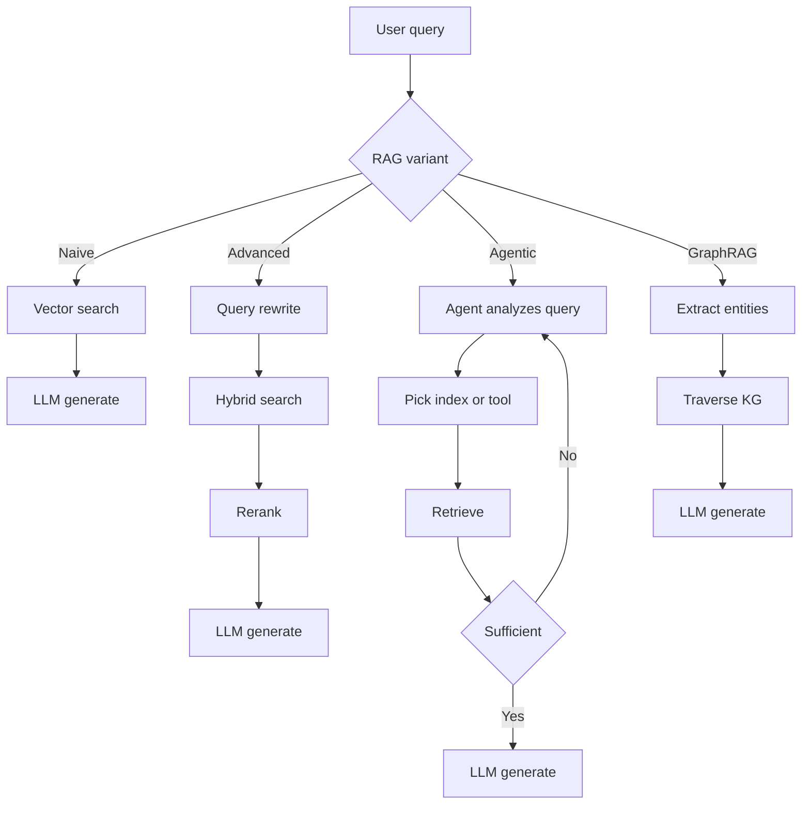
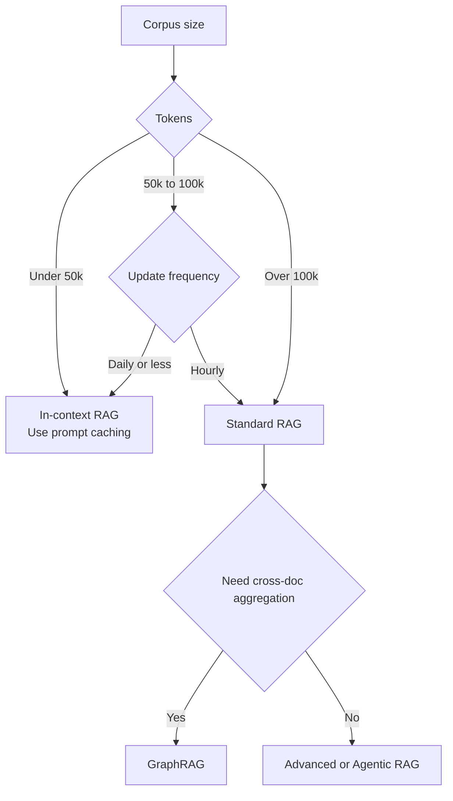

# RAG Fundamentals

How RAG evolved from naive vector search to agentic and graph-based retrieval. When to choose RAG vs. long context, and the three retrieval gaps that cause production failures.

Retrieval-Augmented Generation (RAG) is the architectural pattern of providing an LLM with external, verifiable context to ground its responses. It has evolved from "simple vector search" into a multi-stage reasoning pipeline: hybrid retrieval, reranking, contextual chunking, and agentic loops are now table stakes for production. Deeper material lives in [Chunking Strategies](02-chunking-strategies.md), [Vector Databases](04-vector-databases.md), [Reranking](06-reranking-strategies.md), [Contextual Retrieval](10-contextual-retrieval.md), [ColBERT Late Interaction](11-late-interaction-colbert.md), and the [GraphRAG reframe](07-graph-rag.md).

## Table of Contents

- [The Core Philosophy: Grounding vs. Training](#philosophy)
- [The RAG Taxonomy](#taxonomy)
- [RAG vs. 2M Context (The Hybrid Era)](#rag-vs-long-context)
- [The Retrieval Quality Gap](#quality-gap)
- [Interview Questions](#interview-questions)
- [References](#references)

---

## The Core Philosophy: Grounding vs. Training

| Aspect | Fine-Tuning | RAG |
|--------|-------------|-----|
| **Knowledge Type** | Internalized (Weights) | externalized (Context) |
| **Update Cycle** | High Cost (Retraining) | Zero Cost (Update DB) |
| **Attribution** | None (Black box) | Explicit (Citations) |
| **Privacy** | Hard to "Unlearn" | Easy to filter/delete |

**Rule of thumb**: Fine-tuning is for **Form** (style, tone, syntax); RAG is for **Fact** (knowledge, data, grounding).

---

## The RAG Taxonomy

Production RAG systems are categorized by their "Agentic Depth":

### 1. Naive RAG (Retrieve-then-Generate)
- **Flow**: User Query -> Vector Search -> Top-K -> LLM.
- **Status**: Deprecated for production due to "Retrieval Gap" and low precision.

### 2. Advanced RAG (Multi-Stage)
- **Flow**: Query Transformation -> Hybrid Search -> Reranking -> LLM.
- **Key Nuance**: Uses **RRF (Reciprocal Rank Fusion)** to combine keyword and semantic results.

### 3. Agentic RAG (Loop-based)
- **Flow**: Agent analyzes query -> Decides which tools/indices to search -> Evaluates results -> Re-retrieves if info is missing.
- **Techniques**: Self-RAG, Corrective RAG (CRAG).

### 4. GraphRAG (Structured context)
- **Flow**: Extract entities/relationships -> Build Knowledge Graph -> Traverse graph to find "connected knowledge."
- **Win**: Solves "Aggregative Questions" (e.g., "Summarize all legal risks across 50 documents").

The four variants by agentic depth:

---

## RAG vs. 2M Context (The "Hybrid Era")

With context windows like Gemini 1.5 Pro (2M+) and Claude Sonnet 4.6 (1M+), RAG is changing.

- **In-Context RAG (ICR)**: For datasets < 50k tokens, we skip the vector DB and put EVERYTHING in the prompt.
- **Prompt Caching**: Makes Long-Context RAG 90% cheaper by caching the "Background Knowledge" on the GPU.

**Architectural Decision**: 
- If your corpus is > 100k tokens and dynamic: Use **Standard RAG**.
- If your corpus is < 100k tokens: Use **In-Context RAG**.

Decision tree for picking between standard RAG and in-context RAG:

---

## The Retrieval Quality Gap

The "Retrieval Gap" is the #1 cause of RAG failure.
- **Gap 1: Semantic Mismatch**: Query says "fast cars," DB has "Porsche 911." Solved by **Embedding Rerankers**.
- **Gap 2: Missing Context**: Relevant info is in the DB, but the Retriever missed it. Solved by **Hybrid Search**.
- **Gap 3: Lost-in-the-Middle**: info is in the prompt, but LLM misses it. Solved by **Context Compression**.

---

## Interview Questions

### Q: Why would you still use RAG if frontier models ship 1M-2M token contexts?

**Strong answer:**
Three tiers of reasons:
1. **Cost and Latency**: Even with prompt caching, re-reading 2M tokens for every new user query is significantly more expensive and has higher TTFT (Time to First Token) than retrieving 5 relevant chunks (approx. 2k tokens). 
2. **Freshness**: RAG can access real-time APIs (Stock prices, News) which cannot be statically embedded in a context window.
3. **Scale**: Enterprise datasets (SharePoint, Terabyte logs) exceed even 2M tokens. RAG serves as the "Filter" to find the relevant 0.01% of data that *should* go into that high-value context window.

### Q: What is "Agentic RAG" and how does it differ from "Advanced RAG"?

**Strong answer:**
Advanced RAG is a **deterministic pipeline** (Linear: Rewrite -> Search -> Rerank). Agentic RAG is a **stochastic loop**. In Agentic RAG, the model is given tools to decide *how* to retrieve. For example, if the agent finds that the retrieved documents are irrelevant, it can decide to "Search Google" or "Query the SQL database" instead. It essentially adds a "Reasoning step" before and after retrieval to ensure the context is sufficient to answer the prompt.

---

## Key Takeaways

- Naive RAG (vector search + top-K + LLM) is deprecated for production; ship Advanced RAG (hybrid + RRF + rerank) as the new baseline.
- Long context windows do not kill RAG: cost, latency, freshness, and corpus scale all push you back to retrieval even at 2M context.
- Choose by corpus size: under 50k tokens go in-context with prompt caching; over 100k go standard RAG; aggregative questions go GraphRAG.
- Most RAG failures are retrieval failures, not generation failures; diagnose the three gaps (semantic, missing context, lost-in-the-middle) before tuning prompts.
- Agentic RAG vs. Advanced RAG is a stochastic-loop vs. deterministic-pipeline choice; only adopt agentic when query patterns are too varied for a fixed pipeline.

---

## References
- Gao et al. "Retrieval-Augmented Generation for LLMs: A Survey" (2024 update)
- Microsoft. "From RAG to GraphRAG" (2024)
- Google. "Long-context LLMs as Retrievers" (2025)
- [Anthropic. "Introducing Contextual Retrieval" (Sep 2024)](https://www.anthropic.com/news/contextual-retrieval)

---

*Next: [Chunking Strategies](02-chunking-strategies.md)*
