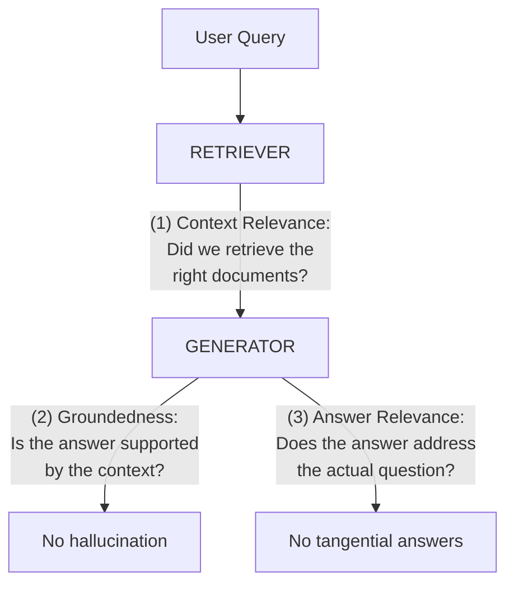
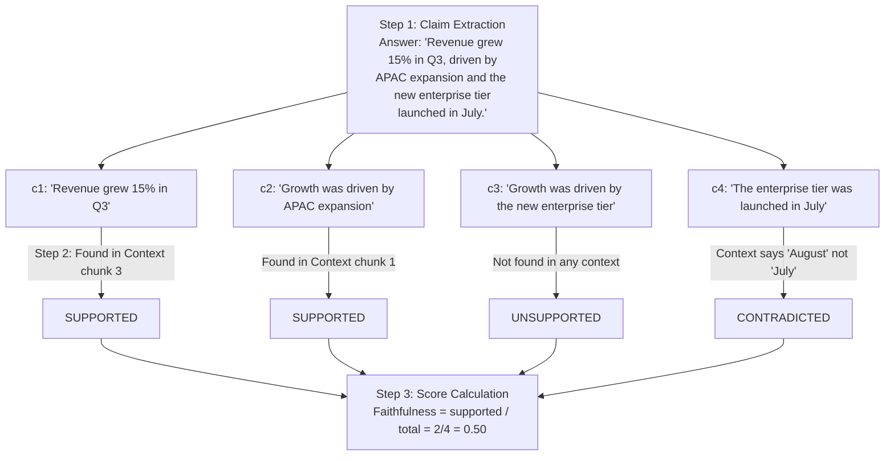
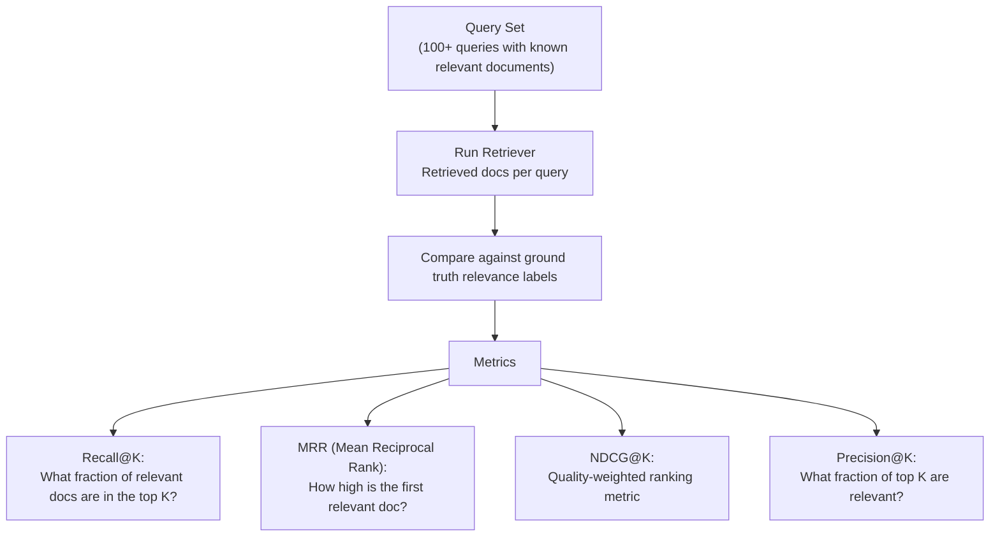
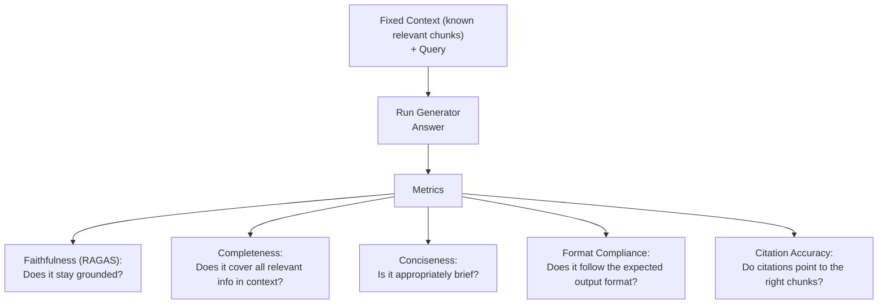
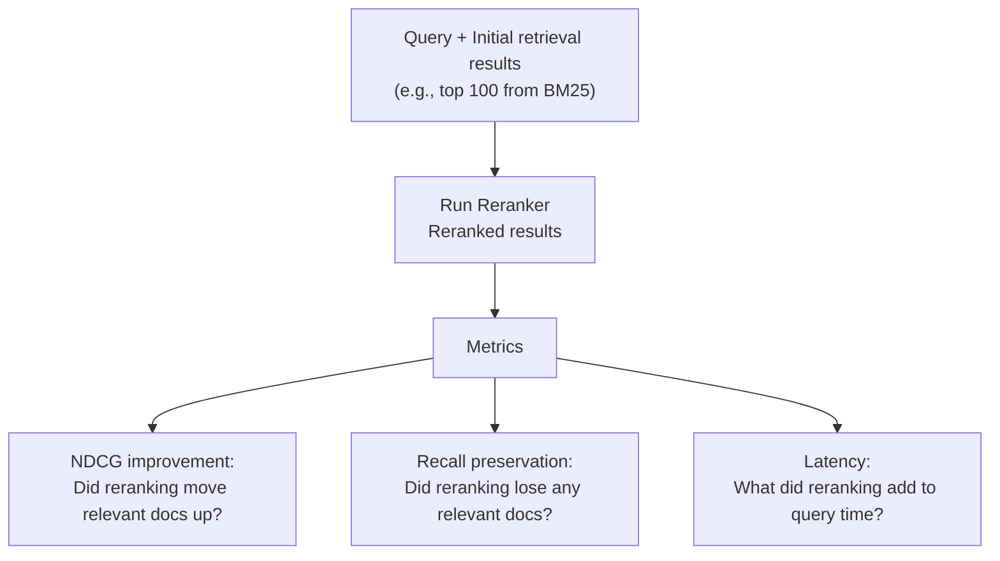
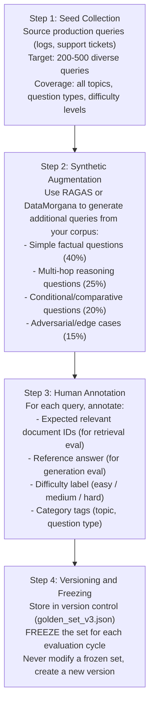
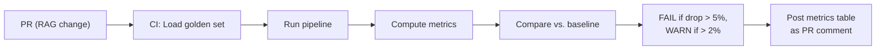
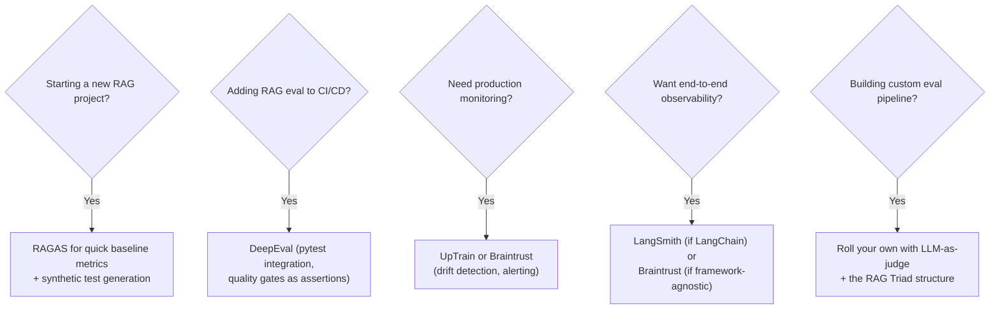

# RAG Evaluation Patterns

Evaluation is the hardest unsolved problem in RAG. You can build a retrieval pipeline in a day; knowing whether it actually works takes weeks. The industry has converged on a layered evaluation strategy: the RAG Triad for correctness, component-level metrics for debugging, and automated regression testing for production safety. Langfuse, LangWatch, Braintrust, and Arize Phoenix all ship native RAG eval recipes; pick by deployment model (self-hosted vs SaaS) and whether you need eval-gated CI/CD blocking.

## Table of Contents

- [The RAG Triad](#the-rag-triad)
- [RAGAS Framework and Metrics](#ragas-framework)
- [Component-Level Evaluation](#component-level-evaluation)
- [LLM-as-Judge for RAG](#llm-as-judge)
- [Building Golden Test Sets](#golden-test-sets)
- [Automated Regression Testing](#regression-testing)
- [Production Monitoring](#production-monitoring)
- [Cost of Evaluation at Scale](#cost-at-scale)
- [Tools Comparison](#tools-comparison)
- [System Design Interview Angle](#system-design-interview-angle)
- [References](#references)

---

## The RAG Triad

The RAG Triad is the foundational framework for evaluating RAG systems. It decomposes correctness into three independent dimensions, each catching a different failure mode.



### Dimension 1: Context Relevance

**Question**: Is each retrieved chunk actually relevant to the user query?

**What it catches**: Bad retrieval -- the vector search returned documents about the wrong topic, or the query was ambiguous and the retriever guessed wrong.

**How to measure**:
- For each retrieved chunk, ask: "Is this chunk relevant to answering the query?"
- Score: (number of relevant chunks) / (total retrieved chunks)
- A score of 0.3 means 70% of retrieved context is noise, forcing the LLM to find a needle in irrelevant hay.

**Why it matters**: Low context relevance is the root cause of most RAG failures. Even a perfect generator cannot produce a good answer from irrelevant context.

### Dimension 2: Groundedness (Faithfulness)

**Question**: Is every claim in the generated answer supported by the retrieved context?

**What it catches**: Hallucination -- the LLM generated claims that are plausible but not present in the retrieved documents.

**How to measure**:
- Decompose the answer into individual claims/statements.
- For each claim, search the retrieved context for supporting evidence.
- Score: (number of supported claims) / (total claims)
- A score of 0.7 means 30% of the answer is hallucinated.

**Why it matters**: This is the metric that enterprise customers care about most. An unfaithful RAG system is worse than no RAG at all because it produces confident-sounding wrong answers with fake citations.

### Dimension 3: Answer Relevance

**Question**: Does the final answer actually address what the user asked?

**What it catches**: Tangential answers -- the retrieval was good, the answer is grounded, but it does not answer the question. Common when the retriever finds related-but-not-matching content.

**How to measure**:
- Generate N hypothetical questions that the answer would be a good response to.
- Measure semantic similarity between these hypothetical questions and the original query.
- High similarity means the answer is on-topic.

**Why it matters**: A system can retrieve relevant context and faithfully summarize it, yet still miss the point of the question. Answer relevance catches this.

### Triad Failure Modes

| Failure Pattern | Context Relevance | Groundedness | Answer Relevance | Root Cause |
|----------------|-------------------|-------------|-----------------|------------|
| Good RAG | High | High | High | System working correctly |
| Bad Retrieval | **Low** | High | Low | Embeddings or search misconfigured |
| Hallucination | High | **Low** | High | LLM ignoring context, prompt issue |
| Tangential Answer | High | High | **Low** | Query ambiguity, wrong index |
| Total Failure | **Low** | **Low** | **Low** | Fundamental pipeline issue |

---

## RAGAS Framework and Metrics

RAGAS (Retrieval Augmented Generation Assessment) is the most widely adopted open-source evaluation framework for RAG, providing reference-free metrics that do not require ground-truth answers.

### Core RAGAS Metrics

```mermaid
flowchart TD
    S["RAGAS Metric Suite (v0.2+)"]
    S --> RM["Retrieval Metrics"]
    S --> GM["Generation Metrics"]
    S --> NR["Noise & Robustness"]
    S --> MM["Multi-Modal (2025+)"]

    RM --> RM1["Context Precision:<br/>Are relevant docs ranked higher?"]
    RM --> RM2["Context Recall:<br/>Did we find all relevant docs?"]
    RM --> RM3["Context Entities Recall:<br/>Did we capture key entities?"]
    RM --> RM4["Context Relevance:<br/>Is retrieved context pertinent?"]

    GM --> GM1["Faithfulness:<br/>Are claims supported by context?"]
    GM --> GM2["Answer Relevance:<br/>Does the answer address the query?"]
    GM --> GM3["Answer Correctness:<br/>Does the answer match ground truth?"]
    GM --> GM4["Answer Similarity:<br/>Semantic overlap with reference answer"]

    NR --> NR1["Noise Sensitivity:<br/>How much does irrelevant context hurt?"]

    MM --> MM1["Multimodal Faithfulness:<br/>Claims supported by images + text?"]
    MM --> MM2["Multimodal Relevance:<br/>Are retrieved images relevant?"]
```



### How RAGAS Faithfulness Works (Under the Hood)



### How RAGAS Context Precision Works

```
  Retrieved chunks ranked by retriever score:
    Rank 1: Chunk about Q3 revenue    --> Relevant (v_1 = 1)
    Rank 2: Chunk about company history --> Not relevant (v_2 = 0)
    Rank 3: Chunk about Q3 expenses   --> Relevant (v_3 = 1)
    Rank 4: Chunk about office locations --> Not relevant (v_4 = 0)

  Context Precision@K:
    Precision@1 = 1/1 = 1.0
    Precision@2 = 1/2 = 0.5
    Precision@3 = 2/3 = 0.67
    Precision@4 = 2/4 = 0.5

  Average Precision = (1.0*1 + 0.5*0 + 0.67*1 + 0.5*0) / 2
                    = (1.0 + 0.67) / 2 = 0.835
```

### RAGAS vs. Ground-Truth Metrics

| Metric | Needs Ground Truth? | What It Measures |
|--------|-------------------|------------------|
| Faithfulness | No | Claims supported by context |
| Context Relevance | No | Retrieved chunks relevance |
| Answer Relevance | No | Answer addresses query |
| Context Recall | **Yes** | Coverage of reference answer |
| Answer Correctness | **Yes** | Match against reference answer |
| Answer Similarity | **Yes** | Semantic overlap with reference |

**Insight**: Start with reference-free metrics (faithfulness, context relevance, answer relevance) for rapid iteration. Add ground-truth metrics once you have a golden test set for regression testing.

---

## Component-Level Evaluation

The RAG Triad evaluates the system end-to-end. Component-level evaluation isolates each stage to pinpoint failures.

### Retriever Evaluation



**Key Retriever Benchmarks**:

| Metric | Minimum Threshold | Good | Excellent |
|--------|------------------|------|-----------|
| Recall@10 | 0.70 | 0.85 | 0.95+ |
| MRR | 0.50 | 0.70 | 0.85+ |
| NDCG@10 | 0.50 | 0.70 | 0.85+ |
| Precision@5 | 0.40 | 0.60 | 0.80+ |

### Generator Evaluation

Isolate the generator by fixing the retrieval context and varying only the generation.



### Reranker Evaluation



---

## LLM-as-Judge for RAG

Using an LLM to evaluate another LLM's output is the dominant evaluation paradigm. It scales where human evaluation cannot, but has known biases.

### How It Works

```
  Evaluation Prompt Template:
You are evaluating a RAG system. Given:
- User Query: {query}
- Retrieved Context: {context}
- Generated Answer: {answer}

Rate the following on a scale of 1-5:
1. Faithfulness: Are all claims in the answer supported by
   the context? (1=hallucinated, 5=fully grounded)
2. Relevance: Does the answer address the user's question?
   (1=off-topic, 5=directly answers)
3. Completeness: Does the answer cover all relevant info?
   (1=missing key info, 5=comprehensive)

Provide scores and brief justifications in JSON.
```

### Known Biases and Mitigations

| Bias | Description | Mitigation |
|------|-------------|------------|
| **Verbosity** | LLM judges prefer longer answers | Normalize scores by answer length; add conciseness penalty |
| **Self-preference** | GPT-4 rates GPT-4 answers higher | Use a different judge model than the generator |
| **Position** | First option in A/B comparisons rated higher | Randomize presentation order |
| **Sycophancy** | Judge agrees with the system being evaluated | Use structured rubrics with specific criteria |
| **Leniency** | LLMs rarely give scores below 3/5 | Use binary (pass/fail) instead of Likert scales |

### Best Practices for LLM-as-Judge

1. **Use binary decisions over scales**: "Is this claim supported? YES/NO" is more reliable than "Rate support on 1-5."
2. **Decompose into atomic evaluations**: Evaluate one claim or one dimension at a time.
3. **Require evidence**: Force the judge to cite the specific context passage that supports/contradicts each claim.
4. **Calibrate with human agreement**: Run 100+ examples through both LLM and human judges. Measure Cohen's Kappa. Target > 0.7.
5. **Use the strongest available model**: Claude Opus or GPT-4o as judges; never use the same model that generated the answer.

---

## Building Golden Test Sets

A golden test set is a curated, versioned collection of (query, expected_context, expected_answer) triples that serves as the ground truth for regression testing.

### Building Process



### Golden Set Composition Guidelines

| Question Type | Percentage | Purpose |
|--------------|-----------|---------|
| Simple factual | 40% | Baseline: should always pass |
| Multi-hop reasoning | 25% | Tests cross-document retrieval |
| Comparative | 15% | Tests retrieval of multiple relevant docs |
| Temporal | 10% | Tests handling of versioned/dated content |
| Adversarial | 10% | Tests robustness (unanswerable, out-of-scope) |

### Synthetic Test Generation with RAGAS

```python
# Pseudocode: Generate synthetic test queries from your corpus
from ragas.testset.generator import TestsetGenerator
from ragas.testset.evolutions import simple, reasoning, multi_context

generator = TestsetGenerator.from_langchain(
    generator_llm=ChatOpenAI(model="gpt-4o"),
    critic_llm=ChatOpenAI(model="gpt-4o"),
)
testset = generator.generate_with_langchain_docs(
    documents=load_documents("./knowledge_base/"),
    test_size=200,
    distributions={simple: 0.4, reasoning: 0.35, multi_context: 0.25}
)
# CRITICAL: Always human-review synthetic data before using as ground truth
testset.to_pandas().to_csv("golden_set_draft_v4.csv")
```

**Warning**: Synthetic test sets are a starting point, not a destination. Always validate with human review to avoid testing against artifacts of the generation model.

---

## Automated Regression Testing

Every RAG pipeline change (new embeddings, chunk size, prompt edit, reranker swap) needs automated regression testing before deployment.

### CI/CD Integration



### Quality Gates

| Metric | Absolute Minimum | Regression Threshold |
|--------|-----------------|---------------------|
| Recall@10 | 0.85 | 5% drop from baseline |
| MRR | 0.70 | 5% drop |
| Faithfulness | 0.80 | 3% drop |
| Answer Relevance | 0.75 | 5% drop |
| Answer Correctness | 0.70 | 5% drop |

Any metric below its absolute minimum blocks the PR. Any regression beyond threshold triggers a warning and flags the specific queries that degraded.

---

## Production Monitoring

Offline evaluation is necessary but not sufficient. Production queries differ from test sets, and retrieval quality can degrade over time as the corpus changes.

### Key Production Signals

| Signal | What It Detects | How to Measure |
|--------|----------------|----------------|
| **Empty Retrieval Rate** | Queries with no relevant results | % of queries where top-1 similarity < threshold |
| **Similarity Score Drift** | Embedding or corpus degradation | Track avg similarity over time; alert on drop |
| **Faithfulness Sampling** | Hallucination rate in production | Run LLM-as-judge on 5-10% random sample |
| **User Feedback Correlation** | Whether metrics match real quality | Compare thumbs-up/down with automated scores |
| **Latency P99** | Performance degradation | Track retrieval + generation latency |
| **Token Usage** | Cost drift | Monitor avg context tokens per query |

### Retrieval Quality Drift

Drift happens when the corpus changes but embeddings, chunks, or prompts do not keep up. Four common scenarios: (1) new documents with different vocabulary cause embedding space mismatch -- fix by re-embedding affected collections, (2) user query patterns shift to topics with no content -- detect via empty retrieval rate monitoring, (3) stale content returns outdated answers -- add freshness metadata and prefer recent docs, (4) embedding model updates change similarity distributions -- re-calibrate all thresholds after model changes.

---

## Cost of Evaluation at Scale

LLM-as-judge evaluation is powerful but expensive. Understanding the cost structure is critical for budgeting.

### Cost per Query (Full RAG Triad)

| Metric | LLM Calls | Tokens | GPT-4o Cost | Claude Haiku Cost |
|--------|-----------|--------|-------------|-------------------|
| Faithfulness | ~3 (extract + verify) | ~3k | $0.0075 | $0.00075 |
| Context Relevance | ~5 (per chunk) | ~2.5k | $0.00625 | $0.000625 |
| Answer Relevance | ~2 (question gen) | ~1.6k | $0.004 | $0.0004 |
| **Full Triad** | **~10** | **~7k** | **~$0.018** | **~$0.002** |

### Scaling Strategy

| Evaluation Type | Frequency | Volume | Judge Model | Monthly Cost (10k queries/day) |
|----------------|-----------|--------|-------------|-------------------------------|
| **CI Regression** | Per PR | Golden set (500 queries) | GPT-4o | ~$9/run |
| **Nightly Batch** | Daily | Random 1k production queries | Claude Haiku | ~$60/month |
| **Production Sample** | Real-time | 5% of traffic | Claude Haiku | ~$300/month |
| **Deep Audit** | Weekly | Full golden set + analysis | GPT-4o | ~$36/month |

**Insight**: Use Claude Haiku 4.5 or GPT-5.5-mini for high-volume production sampling. Reserve Claude Opus 4.7 or GPT-5.5 for CI regression tests and deep audits where accuracy matters more than cost.

---

## Tools Comparison

### Framework Overview

| Tool | Best For | Open Source | Key Strength | Key Weakness |
|------|----------|------------|--------------|--------------|
| **RAGAS** | Quick RAG evaluation, synthetic data | Yes | Reference-free metrics, strong community | Metric results lack explanations |
| **DeepEval** | CI/CD integration, TDD for LLMs | Yes | pytest-compatible, self-explaining scores | Heavier setup |
| **TruLens** | RAG Triad evaluation, observability | Yes | Coined the RAG Triad, good tracing | Less active development |
| **UpTrain** | Production monitoring, drift detection | Yes | Hybrid eval (LLM + heuristic), drift alerts | Lower ranking accuracy |
| **Braintrust** | Team collaboration, experiment tracking | Commercial | Best UI/UX, experiment comparison | Paid for advanced features |
| **LangSmith** | LangChain ecosystem, tracing | Commercial | Deep LangChain integration, tracing | Locked to LangChain ecosystem |

### When to Use What



### Custom Evaluator Pattern

The core pattern for a custom evaluator is simple: for each triad dimension, use binary LLM-as-judge calls and aggregate.

```python
# Pseudocode: Core faithfulness evaluator (other dimensions follow the same pattern)

def evaluate_faithfulness(answer: str, context: str, judge) -> float:
    # Step 1: Extract atomic claims from the answer
    claims = judge.generate(f"List every factual claim as a JSON array:\n{answer}")

    # Step 2: Verify each claim against context (binary YES/NO)
    supported = sum(
        1 for claim in json.loads(claims)
        if "YES" in judge.generate(
            f"Is this claim supported by the context? YES or NO.\n"
            f"Claim: {claim}\nContext: {context}"
        ).upper()
    )
    return supported / max(len(json.loads(claims)), 1)
```

Apply the same decompose-then-judge pattern for context relevance (per-chunk: "Is this relevant to the query?") and answer relevance (generate hypothetical questions, measure similarity to original query).

---

## System Design Interview Angle

### Q: You deployed a RAG system and users report that answers are sometimes wrong. How do you systematically diagnose and fix the problem?

**Strong answer:**

I would use the RAG Triad to isolate the failure mode:

1. **Sample failing queries**: Collect 50-100 queries where users flagged bad answers. Categorize them by failure type.

2. **Run the triad**:
   - **Context Relevance low?** --> Retrieval problem. The system is fetching wrong documents. Fix: inspect embedding similarity scores, check if the query language matches document language, try hybrid search (BM25 + dense), add a reranker.
   - **Groundedness low?** --> Hallucination problem. The LLM is making things up despite having good context. Fix: strengthen the system prompt ("Only answer from the provided context"), reduce temperature, switch to a more instruction-following model, or add citation requirements.
   - **Answer Relevance low?** --> The system retrieves related content and faithfully summarizes it, but misses the actual question. Fix: improve query understanding (query rewriting, HyDE), add query classification to route to the correct index.

3. **Build a regression test**: Take the 50 failing queries, annotate the expected answers, and add them to the golden test set. Every future pipeline change must pass these cases.

4. **Set up ongoing monitoring**: Sample 5% of production traffic for automated evaluation. Alert when faithfulness drops below 0.80 or context relevance drops below 0.60.

The key insight is that "answers are wrong" is not a diagnosis -- it is a symptom. The RAG Triad turns a vague complaint into a specific, actionable root cause.

### Q: How do you evaluate a RAG system when you do not have ground-truth answers?

**Strong answer:**

This is the most common real-world scenario. I use a three-layer approach:

**Layer 1: Reference-free metrics (Day 1)**. RAGAS faithfulness and context relevance require no ground truth. They tell you whether the system is hallucinating and whether retrieval is working. You can run these immediately on any query.

**Layer 2: Synthetic golden set (Week 1)**. Use RAGAS TestsetGenerator to create synthetic (query, answer) pairs from your corpus. This gives you approximate ground truth for answer correctness and context recall. Human-review a sample to validate quality.

**Layer 3: Production-derived golden set (Month 1)**. Mine production logs for queries with high user satisfaction (thumbs-up, no follow-up questions). Have annotators label these with reference answers. This creates a golden set that reflects real usage patterns, not synthetic distributions.

The trade-off is accuracy vs. speed. Layer 1 gives you signal in hours but is approximate. Layer 3 gives you ground truth but takes weeks. Run all three in parallel, starting with Layer 1 for immediate feedback.

### Q: Your RAG evaluation pipeline costs $500/day in LLM judge calls. How do you reduce it?

**Strong answer:**

Four strategies, in order of impact:

1. **Tiered judge models**: Use Claude Haiku ($0.002/query) for production sampling (90% of volume). Reserve GPT-4o ($0.018/query) for CI regression tests and weekly deep audits. This alone cuts costs by 80%.

2. **Smart sampling**: Do not evaluate every query. Sample 5% of production traffic, stratified by query type and user segment. For CI, only run the golden set (500 queries), not the full synthetic set.

3. **Caching**: Many production queries are similar. Hash the (query, context, answer) tuple and cache evaluation results. Identical or near-identical inputs get the cached score.

4. **Heuristic pre-filters**: Before calling the LLM judge, run cheap heuristic checks. If the answer contains "I don't know" or has zero overlap with the context (ROUGE-L < 0.1), skip the expensive faithfulness evaluation and assign a score directly.

The goal is to spend evaluation budget where it provides the most signal: on ambiguous, borderline cases where the LLM judge's nuanced reasoning matters.

---

## References

- Es et al. "RAGAS: Automated Evaluation of Retrieval Augmented Generation" (2023, arXiv:2309.15217)
- TruLens. "The RAG Triad" (2024)
- DeepEval. "Using the RAG Triad for RAG Evaluation" (2025)
- Confident AI. "RAG Evaluation Metrics" (2025)
- Microsoft. "The Path to a Golden Dataset" (2025)
- Prem AI. "RAG Evaluation: Metrics, Frameworks & Testing" (2026)

---

*Previous: [Multi-Modal RAG](12-multimodal-rag.md) | Next: Coming Soon*
