# Production RAG at Scale

Production RAG is no longer a weekend project. It is a distributed system with retrieval pipelines, caching layers, routing logic, self-correction loops, multi-tenant isolation, and cost controls, all operating under strict latency SLAs. When RAG fails in production, the failure is in retrieval roughly 73% of the time, not generation, so the enterprise deployments that succeed treat the knowledge source (not the model) as the primary investment.

## Table of Contents

- [RAG vs Long Context](#rag-vs-long-context)
- [Query Routing and Classification](#query-routing)
- [Semantic Caching for RAG](#semantic-caching)
- [Multi-Index Strategies](#multi-index)
- [RAG Pipeline Optimization](#pipeline-optimization)
- [Corrective RAG: Self-Checking Retrieval](#corrective-rag)
- [Adaptive Retrieval](#adaptive-retrieval)
- [Cost Optimization Patterns](#cost-optimization)
- [Failure Modes and Debugging](#failure-modes)
- [Monitoring and Alerting](#monitoring)
- [Scaling to Millions of Documents](#scaling)
- [Multi-Tenant RAG Isolation](#multi-tenant)
- [Real-World Architecture Examples](#architectures)
- [System Design Interview Angle](#interview)
- [References](#references)

---

## RAG vs Long Context {#rag-vs-long-context}

With every major frontier family now supporting 1M+ token context windows (Claude Opus 4.7, Claude Sonnet 4.6, GPT-5.5, Gemini 3.1 Pro, Qwen 3.6 Plus, Llama 4 Maverick), the question is no longer "RAG or long context?" but "When does each win?"

### The Decision Matrix

| Data Type | Small Corpus (<100K tokens) | Large Corpus (>1M tokens) |
|-----------|-----------------------------|---------------------------|
| **Static Data** (rarely changes) | Long Context Wins: stuff it all in, simpler arch, no index needed | RAG Required: can't fit in context window, index + retrieve |
| **Dynamic Data** (updates frequently) | Hybrid Approach: cache context, invalidate on change | RAG Required: incremental indexing, real-time updates |
| **Multi-User** (per-user data) | RAG Preferred: personalized retrieval | RAG Required: tenant isolation, access control |

### Head-to-Head Comparison

| Dimension | RAG | Long Context (1M tokens) |
|-----------|-----|--------------------------|
| **Avg Query Cost** | ~$0.0001 | ~$0.10 |
| **Avg Latency (p50)** | ~1s | ~30-45s |
| **Precision on Specific Facts** | High (targeted retrieval) | Degrades in middle |
| **Cross-Document Synthesis** | Weak (limited context) | Strong (sees everything) |
| **Corpus Size Limit** | Unlimited | ~1M tokens |
| **Data Freshness** | Minutes (incremental index) | Requires full reload |
| **Cost at 1000 QPS** | ~$100/day | ~$100,000/day |

### The "Lost in the Middle" Problem

LLMs do not attend uniformly across their context window. Information positioned in the middle of a long context sees 30%+ accuracy degradation compared to information at the beginning or end. RAG sidesteps this entirely by placing only the most relevant chunks into a short, focused context.

### Best Practice: The Hybrid Pattern

The winning architecture combines both: use RAG to retrieve the top candidates from a large corpus, then load those candidates into a long context window for cross-document reasoning.

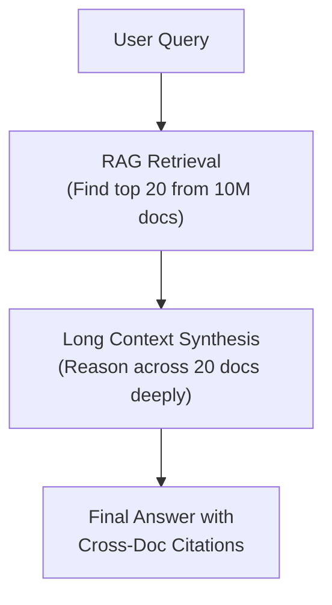

**Rule of Thumb**: If your corpus fits in context AND you can afford the latency AND you can afford the cost, use long context. Otherwise, use RAG. For most production systems with cost and latency constraints, RAG remains the correct default.

---

## Query Routing and Classification {#query-routing}

Not every query needs retrieval. A production system classifies incoming queries and routes them to the optimal handling path.

### The Four-Path Router

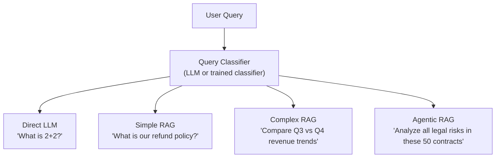

### Classification Signals

| Signal | Direct LLM | Simple RAG | Complex RAG | Agentic RAG |
|--------|-----------|------------|-------------|-------------|
| **Requires private data** | No | Yes | Yes | Yes |
| **Single-hop answer** | Yes | Yes | No | No |
| **Needs multiple sources** | No | No | Yes | Yes |
| **Requires reasoning chain** | No | No | Maybe | Yes |
| **Time-sensitive data** | No | Maybe | Maybe | Yes |

### Implementation: Lightweight Router

```python
class QueryRouter:
    """Routes queries to the optimal retrieval strategy."""

    def __init__(self, classifier_model: str = "gpt-4o-mini"):
        self.classifier = classifier_model
        self.route_counts = Counter()  # for monitoring

    async def classify(self, query: str, user_context: dict) -> str:
        # Step 1: Rule-based fast path
        if self._is_trivial(query):
            return "direct_llm"

        # Step 2: Check if query references private/org data
        if not self._needs_retrieval(query, user_context):
            return "direct_llm"

        # Step 3: LLM-based complexity classification
        complexity = await self._assess_complexity(query)

        if complexity == "simple":
            return "simple_rag"
        elif complexity == "multi_hop":
            return "complex_rag"
        else:
            return "agentic_rag"

    def _is_trivial(self, query: str) -> bool:
        """Fast regex/keyword check for trivial queries."""
        trivial_patterns = [
            r"^(what is|define|explain)\s+\w+$",
            r"^(hi|hello|thanks|bye)",
        ]
        return any(re.match(p, query.lower()) for p in trivial_patterns)

    async def _assess_complexity(self, query: str) -> str:
        """Use a small, fast model to classify complexity."""
        prompt = f"""Classify this query's retrieval complexity:
        - "simple": needs one document lookup
        - "multi_hop": needs 2-3 lookups, comparison, or synthesis
        - "agentic": needs planning, tool use, or iterative search

        Query: {query}
        Classification:"""

        result = await llm_call(self.classifier, prompt, max_tokens=10)
        return result.strip().lower()
```

### Domain-Specific Routing

For systems with multiple knowledge domains, route queries to the correct index before retrieval.

```python
# Rule-based domain routing
DOMAIN_RULES = {
    "revenue|sales|quota|ARR":     "financial_index",
    "policy|handbook|PTO|benefits": "hr_index",
    "API|endpoint|SDK|integration": "engineering_index",
    "compliance|GDPR|SOC2|audit":   "legal_index",
}

# Embedding-based domain routing (for ambiguous queries)
class DomainRouter:
    def __init__(self):
        self.domain_centroids = {}  # pre-computed per domain

    def route(self, query_embedding: list[float]) -> str:
        similarities = {
            domain: cosine_sim(query_embedding, centroid)
            for domain, centroid in self.domain_centroids.items()
        }
        return max(similarities, key=similarities.get)
```

---

## Semantic Caching for RAG {#semantic-caching}

Semantic caching recognizes when a new query has essentially the same meaning as a prior query and reuses the cached result. Production systems report up to 68% cost reduction and 65x latency improvement with well-tuned semantic caches.

### Three-Layer Caching Architecture

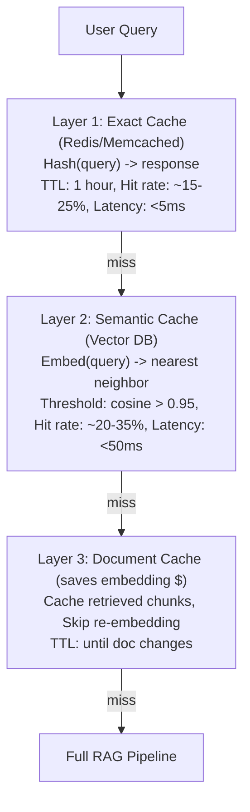

### Semantic Cache Implementation

```python
class SemanticCache:
    """Cache RAG responses by query semantic similarity."""

    def __init__(self, vector_store, similarity_threshold: float = 0.95):
        self.vector_store = vector_store
        self.threshold = similarity_threshold
        self.response_store = {}  # query_id -> cached response

    async def get(self, query: str) -> Optional[CachedResponse]:
        # Step 1: Exact match (fast path)
        exact_key = hashlib.sha256(query.encode()).hexdigest()
        if exact_key in self.response_store:
            return self.response_store[exact_key]

        # Step 2: Semantic match
        query_embedding = await embed(query)
        results = self.vector_store.search(
            query_embedding, top_k=1
        )

        if results and results[0].score >= self.threshold:
            cached_id = results[0].metadata["response_id"]
            cached = self.response_store.get(cached_id)
            if cached and not cached.is_expired():
                return cached

        return None

    async def put(
        self, query: str, response: str,
        sources: list[str], ttl_seconds: int = 3600
    ):
        query_embedding = await embed(query)
        response_id = str(uuid4())

        # Store the embedding for future similarity lookups
        self.vector_store.upsert(
            id=response_id,
            embedding=query_embedding,
            metadata={"response_id": response_id}
        )

        # Store the actual response
        self.response_store[response_id] = CachedResponse(
            response=response,
            sources=sources,
            created_at=time.time(),
            ttl=ttl_seconds,
        )
```

### Cache Invalidation Strategies

| Strategy | Trigger | Use Case |
|----------|---------|----------|
| **TTL-based** | Fixed time expiry | General queries, news |
| **Event-driven** | Document update webhook | Knowledge bases |
| **Version-tagged** | Doc version mismatch | Compliance-critical |
| **Confidence-gated** | Low retrieval score | Volatile domains |

**Critical Rule**: Always cache the source document IDs alongside the response. When any source document is updated, invalidate all cache entries that reference it.

```python
# Webhook-based cache invalidation
@app.post("/webhook/document-updated")
async def on_document_updated(doc_id: str):
    # Find all cache entries that used this document
    affected = cache_index.find_by_source(doc_id)
    for entry in affected:
        semantic_cache.invalidate(entry.response_id)
    logger.info(f"Invalidated {len(affected)} cache entries for doc {doc_id}")
```

---

## Multi-Index Strategies {#multi-index}

A single monolithic index does not scale. Production systems partition their vector indexes by domain, tenant, or document type to improve retrieval precision and operational isolation.

### Index Partitioning Patterns

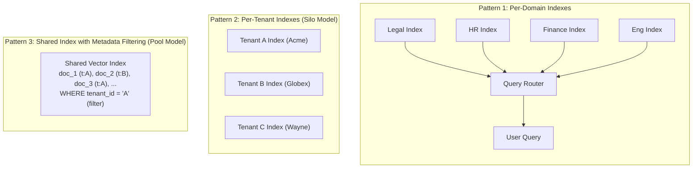

### When to Use Each Pattern

| Pattern | Isolation | Cost | Operational Complexity | Best For |
|---------|-----------|------|----------------------|----------|
| **Per-Domain** | Medium | Medium | Medium | Internal tools with distinct knowledge domains |
| **Per-Tenant Silo** | Strongest | High | High | Enterprise SaaS, regulated industries |
| **Shared Pool** | Weakest | Low | Low | SMB SaaS, cost-sensitive products |
| **Hybrid Bridge** | Configurable | Medium | High | Mixed customer base (enterprise + SMB) |

### Hierarchical Index Strategy

For very large corpora, use a two-tier index: a coarse "summary index" for routing, and fine-grained "chunk indexes" for precision.

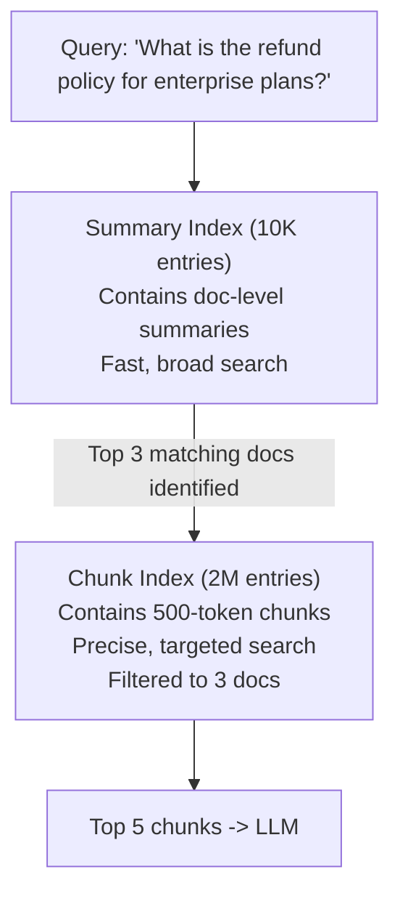

---

## RAG Pipeline Optimization {#pipeline-optimization}

A naive sequential RAG pipeline adds latency at every step. Production pipelines use parallelism, batching, and async processing to meet sub-second SLAs.

### Sequential vs Optimized Pipeline

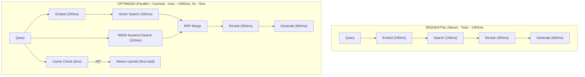

### Parallel Retrieval

```python
async def parallel_retrieve(
    query: str,
    query_embedding: list[float],
    indexes: list[str],
) -> list[Chunk]:
    """Run vector search, keyword search, and graph traversal in parallel."""

    tasks = [
        vector_search(query_embedding, index="main", top_k=20),
        bm25_search(query, index="main", top_k=20),
        # Optionally, graph-based retrieval for entity queries
        graph_search(query, max_hops=2, top_k=10),
    ]

    # All retrieval strategies execute concurrently
    results = await asyncio.gather(*tasks, return_exceptions=True)

    # Filter out failures (graceful degradation)
    valid_results = [r for r in results if not isinstance(r, Exception)]

    # Merge with Reciprocal Rank Fusion
    merged = reciprocal_rank_fusion(valid_results, k=60)

    return merged[:20]  # top 20 after fusion
```

### Batched Embedding

When processing ingestion or multiple queries simultaneously, batch embedding calls to maximize GPU utilization.

```python
class EmbeddingBatcher:
    """Batch embedding requests to reduce per-call overhead."""

    def __init__(self, model: str, batch_size: int = 64, max_wait_ms: int = 50):
        self.model = model
        self.batch_size = batch_size
        self.max_wait = max_wait_ms / 1000
        self.queue: asyncio.Queue = asyncio.Queue()
        self._running = True

    async def embed(self, text: str) -> list[float]:
        """Submit a single text and wait for its embedding."""
        future = asyncio.Future()
        await self.queue.put((text, future))
        return await future

    async def _batch_loop(self):
        """Background loop that collects and processes batches."""
        while self._running:
            batch = []
            try:
                # Wait for at least one item
                item = await asyncio.wait_for(
                    self.queue.get(), timeout=1.0
                )
                batch.append(item)

                # Collect more items up to batch_size or max_wait
                deadline = time.time() + self.max_wait
                while len(batch) < self.batch_size and time.time() < deadline:
                    try:
                        item = await asyncio.wait_for(
                            self.queue.get(),
                            timeout=max(0, deadline - time.time())
                        )
                        batch.append(item)
                    except asyncio.TimeoutError:
                        break

                # Process the batch
                texts = [t for t, _ in batch]
                embeddings = await embed_batch(self.model, texts)

                for (_, future), emb in zip(batch, embeddings):
                    future.set_result(emb)

            except asyncio.TimeoutError:
                continue
```

### Streaming Generation with Early Retrieval

Start retrieval before the user finishes typing (on pause detection) and stream generation tokens as they are produced.

With speculative retrieval:

| Time | Event |
|------|-------|
| 0ms | User starts typing... |
| 300ms | Pause detected -> trigger retrieval speculatively |
| 500ms | User submits query (retrieval already 200ms in -> finishes at 650ms) |
| 650ms | Reranking begins |
| 950ms | First generation token streams to user |
| 1800ms | Full response complete |

Without speculation:

| Time | Event |
|------|-------|
| 0ms | User submits query |
| 200ms | Embedding |
| 350ms | Retrieval |
| 650ms | Reranking |
| 1500ms | First token |
| 2300ms | Full response complete |

---

## Corrective RAG: Self-Checking Retrieval {#corrective-rag}

Corrective RAG (CRAG) adds a verification layer between retrieval and generation. The system evaluates whether retrieved documents actually answer the query before generating a response.

### The CRAG Decision Loop

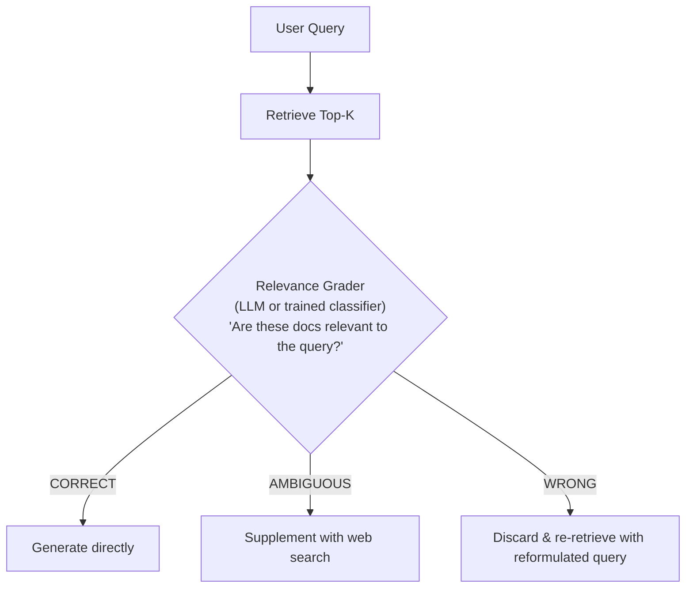

### Implementation

```python
class CorrectiveRAG:
    """Self-correcting RAG pipeline with retrieval quality checks."""

    def __init__(self, max_corrections: int = 2):
        self.max_corrections = max_corrections

    async def answer(self, query: str) -> RAGResponse:
        attempts = 0
        current_query = query
        all_sources = []

        while attempts <= self.max_corrections:
            # Step 1: Retrieve
            chunks = await retrieve(current_query, top_k=10)

            # Step 2: Grade relevance
            grade = await self._grade_relevance(query, chunks)

            if grade.verdict == "correct":
                # High-confidence retrieval, generate directly
                return await self._generate(query, chunks, all_sources)

            elif grade.verdict == "ambiguous":
                # Supplement with additional search
                web_results = await web_search(current_query)
                chunks = self._merge_and_dedupe(chunks, web_results)
                return await self._generate(query, chunks, all_sources)

            else:  # "wrong"
                # Reformulate query and retry
                current_query = await self._reformulate(
                    original_query=query,
                    failed_query=current_query,
                    reason=grade.reason,
                )
                all_sources.extend(chunks)
                attempts += 1

        # Exhausted retries: generate best-effort with disclaimer
        return await self._generate_with_caveat(query, all_sources)

    async def _grade_relevance(
        self, query: str, chunks: list[Chunk]
    ) -> RelevanceGrade:
        """Use LLM to grade whether chunks answer the query."""
        prompt = f"""Given this query and retrieved documents, assess relevance.

Query: {query}

Documents:
{self._format_chunks(chunks)}

Respond with:
- verdict: "correct" (docs clearly answer the query)
- verdict: "ambiguous" (docs partially relevant, need supplementing)
- verdict: "wrong" (docs are irrelevant to the query)
- reason: brief explanation

JSON response:"""

        result = await llm_call(prompt, response_format="json")
        return RelevanceGrade(**json.loads(result))
```

### Self-RAG: Critic Tokens

Self-RAG extends this pattern with inline critic tokens. The model evaluates its own output at each step:

1. **[Retrieve]**: Should I retrieve? (Yes/No)
2. **[Relevant]**: Is retrieved info relevant? (Yes/No)
3. **[Supported]**: Is my answer supported by the evidence? (Fully/Partially/No)
4. **[Useful]**: Is this answer actually useful? (Score 1-5)

If any critic check fails, the model loops back to an earlier step.

---

## Adaptive Retrieval {#adaptive-retrieval}

Not every query benefits from retrieval. Adaptive retrieval decides dynamically whether to retrieve, how much to retrieve, and from which sources.

### The Retrieval Decision Tree

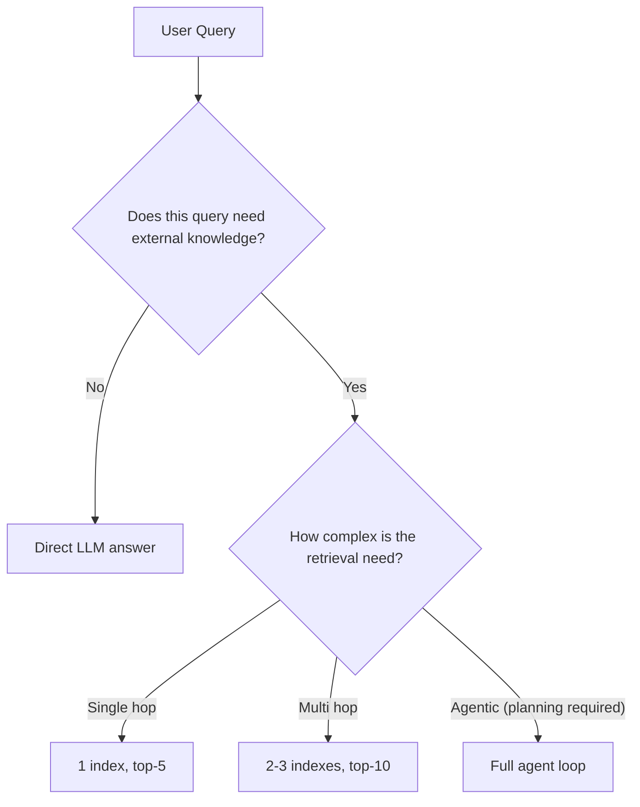

### Query Complexity Estimator

```python
class AdaptiveRetriever:
    """Decides retrieval strategy based on query characteristics."""

    async def retrieve(self, query: str) -> RetrievalPlan:
        # Fast heuristics first
        if self._is_general_knowledge(query):
            return RetrievalPlan(strategy="none", reason="general knowledge")

        if self._is_simple_lookup(query):
            return RetrievalPlan(
                strategy="single_hop",
                indexes=["primary"],
                top_k=5,
            )

        # LLM-based assessment for ambiguous cases
        plan = await self._plan_retrieval(query)
        return plan

    def _is_general_knowledge(self, query: str) -> bool:
        """Check if query is about widely known facts."""
        general_indicators = [
            "what is", "who is", "define", "explain the concept",
        ]
        has_org_refs = bool(re.search(
            r"(our|my|the company|internal|proprietary)", query.lower()
        ))
        is_general = any(
            query.lower().startswith(g) for g in general_indicators
        )
        return is_general and not has_org_refs

    def _is_simple_lookup(self, query: str) -> bool:
        """Check if query can be answered with a single document."""
        single_hop_patterns = [
            r"what is (the|our) .+ policy",
            r"how (do I|to) .+",
            r"where (can I|do I) find",
        ]
        return any(re.search(p, query.lower()) for p in single_hop_patterns)
```

### Token-Budget Aware Retrieval

Scale the retrieval effort based on available token budget and expected response complexity.

```python
def plan_retrieval_budget(query: str, max_budget_tokens: int = 4000):
    """Allocate token budget across retrieval and generation."""

    complexity = estimate_complexity(query)  # 1-5 scale

    if complexity <= 2:
        # Simple query: small context, save tokens for generation
        return {"context_tokens": 1000, "generation_tokens": 3000, "top_k": 3}
    elif complexity <= 4:
        # Medium: balanced
        return {"context_tokens": 2500, "generation_tokens": 1500, "top_k": 8}
    else:
        # Complex: heavy retrieval, concise generation
        return {"context_tokens": 3500, "generation_tokens": 500, "top_k": 15}
```

---

## Cost Optimization Patterns {#cost-optimization}

At scale, RAG costs compound across embedding, retrieval, reranking, and generation. Unoptimized systems can spend 10-50x more than necessary.

### Cost Breakdown of a Typical RAG Query

| Component | Cost per Query | % of Total | Optimization |
|-----------|----------------|------------|--------------|
| Embedding | $0.000005 | ~1% | Batch + cache |
| Vector Search | $0.00001 | ~2% | Index optimization |
| Reranking | $0.0001 | ~15% | Skip for simple queries |
| LLM Generation | $0.0005-0.005 | ~80% | Model tiering, caching |
| **Total (naive)** | ~$0.001-0.006 | | |
| **Total (optimized)** | ~$0.0001-0.001 | | (5-10x reduction) |

### Tiered Model Strategy

| Query Complexity | Low | Medium | High |
|------------------|-----|--------|------|
| **Generation Model** | Small Model (4o-mini), ~$0.0002 | Mid Model (Claude Sonnet), ~$0.002 | Large Model (Claude Opus), ~$0.02 |
| **Reranking** | Skip | Lightweight reranker | Cross-encoder |

### Progressive Detail Pattern

Answer with minimal retrieval first. Only escalate if the user asks follow-up questions or if confidence is low.

```python
class ProgressiveRAG:
    """Start cheap, escalate only when needed."""

    async def answer(self, query: str, session: Session) -> str:
        # Level 1: Try semantic cache
        cached = await self.cache.get(query)
        if cached:
            return cached.response  # Cost: ~$0

        # Level 2: Fast retrieval + small model
        chunks = await retrieve(query, top_k=3)
        response = await generate(
            query, chunks, model="gpt-4o-mini"
        )

        # Check confidence
        if response.confidence > 0.85:
            await self.cache.put(query, response)
            return response.text  # Cost: ~$0.0003

        # Level 3: Deep retrieval + reranking + larger model
        chunks = await retrieve(query, top_k=15)
        reranked = await rerank(query, chunks, top_k=5)
        response = await generate(
            query, reranked, model="claude-sonnet-4-5"
        )

        if response.confidence > 0.7:
            await self.cache.put(query, response)
            return response.text  # Cost: ~$0.003

        # Level 4: Full agentic pipeline (expensive but thorough)
        return await self.agentic_pipeline.run(query)  # Cost: ~$0.05
```

### Cost Guardrails

```python
class CostGuard:
    """Prevent runaway costs in production RAG."""

    def __init__(self):
        self.daily_budget = 500.0  # $500/day
        self.per_query_limit = 0.10  # $0.10 max per query
        self.per_user_hourly = 1.0  # $1/user/hour

    async def check(self, user_id: str, estimated_cost: float) -> bool:
        daily_spent = await self.get_daily_spend()
        if daily_spent + estimated_cost > self.daily_budget:
            raise BudgetExceededError("Daily budget exhausted")

        user_spent = await self.get_user_hourly_spend(user_id)
        if user_spent + estimated_cost > self.per_user_hourly:
            raise RateLimitError("User hourly budget exceeded")

        if estimated_cost > self.per_query_limit:
            # Downgrade to cheaper strategy
            return False  # signals caller to use cheaper path

        return True
```

---

## Failure Modes and Debugging {#failure-modes}

Production RAG systems have compounding failure probabilities. With 95% reliability at each of three stages, overall reliability drops to 0.95 x 0.95 x 0.95 = 0.86. Understanding failure modes is essential.

### The RAG Failure Taxonomy

| Category | Failure Modes |
|----------|---------------|
| **Retrieval Failures** | Missing documents (not indexed); Wrong chunks (low precision); Missed chunks (low recall); Stale embeddings (drift) |
| **Generation Failures** | Hallucination despite good context; Ignoring retrieved context; Over-reliance on one source; Citation fabrication |
| **System Failures** | Index unavailable; Embedding service timeout; Reranker OOM |
| **Quality Failures** | Chunking artifacts; Context window overflow; Answer too vague (over-hedging) |

### The 80% Rule of Chunking

An estimated 80% of RAG quality issues trace back to chunking decisions, not retrieval or generation. Common chunking failures:

- **Chunk too small**: Loses context. "It costs $200" -- what costs $200?
- **Chunk too large**: Dilutes relevance. A 2000-token chunk where only 1 sentence is relevant.
- **Boundary splits**: A table or list is split across two chunks.
- **Missing metadata**: Chunks lack headers, document titles, or section context.

### Debugging Checklist

```
When RAG quality drops, investigate in this order:

1. RETRIEVAL QUALITY (check first -- most common root cause)
   [ ] Log the query and retrieved chunks side by side
   [ ] Compute retrieval precision@K manually for 20 failing queries
   [ ] Check if relevant documents exist in the index at all
   [ ] Compare BM25 vs vector results -- if BM25 wins, embeddings are stale

2. CHUNKING QUALITY (check second)
   [ ] Sample 50 random chunks -- do they make sense in isolation?
   [ ] Check chunk boundaries for tables, lists, code blocks
   [ ] Verify metadata (title, section, doc_id) is present

3. RERANKING QUALITY (check third)
   [ ] Compare pre-rerank vs post-rerank orderings
   [ ] Check if reranker is pushing relevant results down

4. GENERATION QUALITY (check last)
   [ ] Test with perfect context (manually curated) -- does LLM still fail?
   [ ] Check for context window overflow (truncated chunks)
   [ ] Verify system prompt is not conflicting with retrieved context
```

### Agentic RAG Failure Modes

Agentic RAG introduces three additional failure patterns:

1. **Retrieval Thrash**: Agent repeatedly retrieves without converging on an answer. Traces show near-duplicate queries and oscillating search terms. Fix: limit to 3-5 retrieval iterations and track query uniqueness per session.

2. **Tool Storms**: Agent calls tools excessively in a single turn. Fix: set per-query tool call limits and cost ceilings.

3. **Context Bloat**: Agent accumulates too many retrieved chunks, overflowing the context window. Fix: implement a sliding window that drops the oldest chunks when context exceeds threshold.

---

## Monitoring and Alerting {#monitoring}

Production RAG requires dedicated monitoring beyond standard application metrics. Roughly 60% of new RAG deployments now include systematic evaluation from day one (up sharply from the "ship first, eval later" pattern of earlier RAG generations).

### The RAG Monitoring Stack

| Layer | Metrics |
|-------|---------|
| **L1: Infrastructure** | Latency (p50/p95/p99); Error rates; Throughput (QPS); Cache hit rate; Index size/growth |
| **L2: Pipeline** | Retrieval precision@K; Retrieval recall@K; Reranker effectiveness; Chunk utilization rate; Context window fill rate |
| **L3: Quality** | Faithfulness score; Answer relevancy; Hallucination rate; Citation accuracy |
| **L4: Business** | User satisfaction (thumbs); Task completion rate; Escalation to human rate; Cost per successful query |

### Key Metrics and Alerts

| Metric | Target | Alert Threshold | Action |
|--------|--------|-----------------|--------|
| **p95 Latency** | <2s | >5s | Scale retrieval infra |
| **Cache Hit Rate** | >40% | <20% | Tune similarity threshold |
| **Retrieval Precision@5** | >0.7 | <0.5 | Re-evaluate chunking |
| **Faithfulness** | >0.9 | <0.8 | Audit generation prompts |
| **Hallucination Rate** | <5% | >10% | Tighten grounding prompt |
| **Empty Retrieval Rate** | <2% | >5% | Check index coverage |
| **Cost per Query** | <$0.005 | >$0.02 | Review model tiering |

### End-to-End Trace Logging

Every query should produce a trace that links all pipeline stages with a single request ID.

```python
@dataclass
class RAGTrace:
    request_id: str
    timestamp: datetime
    query: str
    route: str                    # "simple_rag", "complex_rag", etc.
    cache_hit: bool
    retrieval_latency_ms: float
    chunks_retrieved: int
    chunks_after_rerank: int
    rerank_latency_ms: float
    generation_model: str
    generation_latency_ms: float
    total_latency_ms: float
    input_tokens: int
    output_tokens: int
    estimated_cost: float
    faithfulness_score: float     # 0-1, computed async
    user_feedback: Optional[str]  # thumbs up/down

    def to_dict(self) -> dict:
        return asdict(self)
```

### Automated Quality Sampling

Run offline evaluation on a sample of production queries to detect quality drift before users notice.

```python
async def nightly_quality_check(sample_size: int = 200):
    """Sample production queries and evaluate RAG quality."""
    traces = await get_recent_traces(limit=sample_size)

    scores = []
    for trace in traces:
        # Re-run the query with evaluation
        eval_result = await evaluate_rag_response(
            query=trace.query,
            response=trace.response,
            retrieved_chunks=trace.chunks,
            metrics=["faithfulness", "relevancy", "context_precision"],
        )
        scores.append(eval_result)

    avg_faithfulness = mean([s.faithfulness for s in scores])
    avg_relevancy = mean([s.relevancy for s in scores])

    if avg_faithfulness < 0.85:
        alert("RAG faithfulness degraded", severity="high")
    if avg_relevancy < 0.70:
        alert("RAG relevancy degraded", severity="medium")

    publish_metrics("rag.nightly.faithfulness", avg_faithfulness)
    publish_metrics("rag.nightly.relevancy", avg_relevancy)
```

---

## Scaling to Millions of Documents {#scaling}

Moving from thousands to millions of documents introduces challenges in indexing throughput, retrieval latency, and index management.

### Scaling Dimensions

| Dimension | Stage 1 | Stage 2 | Stage 3 | Stage 4 |
|-----------|---------|---------|---------|---------|
| **Documents** | 1K | 100K | 1M | 100M |
| **Chunks** | 10K | 1M | 10M | 1B |
| **Index Size** | 50MB | 5GB | 50GB | 5TB |
| **Strategy** | Single Node | Single Node + Replicas | Sharded Index | Distributed Cluster + Tiered |

### Ingestion Pipeline at Scale

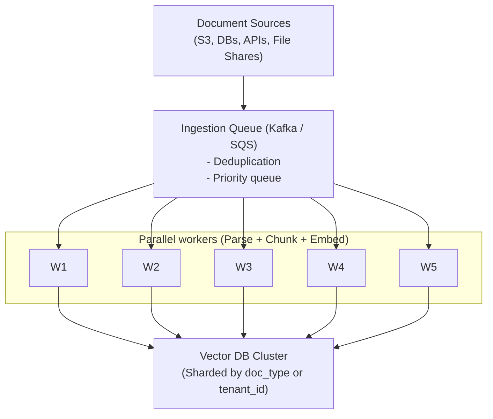

### Sharding Strategies

| Strategy | How It Works | Pros | Cons |
|----------|-------------|------|------|
| **Hash-based** | shard = hash(doc_id) % N | Even distribution | Cross-shard queries needed |
| **Range-based** | shard by date range | Time-based queries fast | Uneven shard sizes |
| **Domain-based** | shard by document type | No cross-shard queries | Unbalanced domains |
| **Tenant-based** | shard by tenant_id | Perfect isolation | Many small shards |

### Index Maintenance

At millions of documents, index maintenance becomes a critical operational concern.

```python
class IndexMaintenanceScheduler:
    """Scheduled tasks for index health at scale."""

    async def run_daily(self):
        # 1. Detect and re-embed stale documents
        stale_docs = await find_docs_with_old_embeddings(
            older_than_days=90,
            embedding_model_version="v2"  # current is v3
        )
        if stale_docs:
            await enqueue_reembedding(stale_docs)

        # 2. Remove orphaned vectors (doc deleted but vector remains)
        orphans = await find_orphaned_vectors()
        if orphans:
            await delete_vectors(orphans)

        # 3. Compact and optimize indexes
        for shard in await list_shards():
            if shard.fragmentation_pct > 20:
                await compact_shard(shard.id)

        # 4. Verify index health
        for shard in await list_shards():
            health = await check_shard_health(shard.id)
            if not health.ok:
                alert(f"Shard {shard.id} unhealthy: {health.reason}")
```

### Read Replicas for Retrieval

Separate read and write paths so that ingestion never degrades query latency.

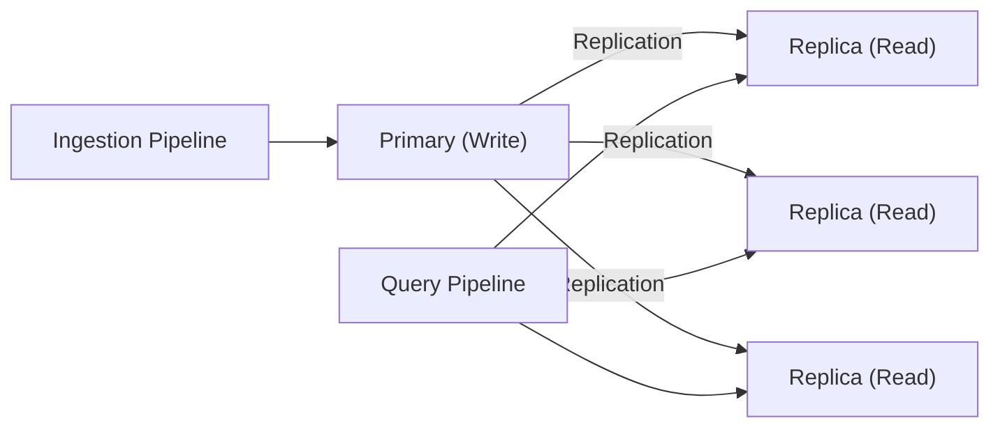

---

## Multi-Tenant RAG Isolation {#multi-tenant}

Multi-tenant RAG is the most common production pattern for SaaS products. Getting isolation wrong means data leaks between tenants, which is a critical security failure.

### Three Isolation Models

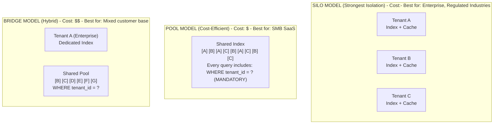

### Security: Defense in Depth

```python
class TenantIsolatedRetriever:
    """Enforces tenant isolation at every retrieval layer."""

    async def retrieve(
        self, query: str, tenant_id: str, user_id: str
    ) -> list[Chunk]:
        # Layer 1: Tenant ID is MANDATORY in every query
        if not tenant_id:
            raise SecurityError("tenant_id required for retrieval")

        # Layer 2: Validate user belongs to tenant
        if not await self.authz.user_in_tenant(user_id, tenant_id):
            raise AuthorizationError("User not in tenant")

        # Layer 3: Apply tenant filter at the database level
        chunks = await self.vector_db.search(
            query_embedding=await embed(query),
            filter={"tenant_id": {"$eq": tenant_id}},  # ALWAYS filtered
            top_k=10,
        )

        # Layer 4: Post-retrieval verification
        for chunk in chunks:
            assert chunk.metadata["tenant_id"] == tenant_id, \
                f"Cross-tenant leak detected: {chunk.id}"

        # Layer 5: Audit log
        await self.audit_log.record(
            action="retrieve",
            tenant_id=tenant_id,
            user_id=user_id,
            chunk_ids=[c.id for c in chunks],
        )

        return chunks
```

### Tenant-Aware Ingestion

Tenant context must be injected at every stage of the pipeline, from ingestion through to generation.

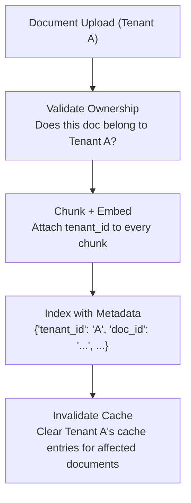

### Noisy Neighbor Prevention

In the pool model, one tenant's heavy usage can degrade performance for all tenants.

```python
class TenantRateLimiter:
    """Per-tenant rate limiting and resource quotas."""

    def __init__(self):
        self.tenant_limits = {
            "free":       {"qps": 5,   "daily_queries": 500},
            "pro":        {"qps": 50,  "daily_queries": 10_000},
            "enterprise": {"qps": 200, "daily_queries": 100_000},
        }

    async def check(self, tenant_id: str, tier: str) -> bool:
        limits = self.tenant_limits[tier]

        current_qps = await self.redis.get(f"qps:{tenant_id}")
        if current_qps and int(current_qps) >= limits["qps"]:
            raise RateLimitError(f"QPS limit ({limits['qps']}) exceeded")

        daily_count = await self.redis.get(f"daily:{tenant_id}")
        if daily_count and int(daily_count) >= limits["daily_queries"]:
            raise RateLimitError("Daily query limit exceeded")

        # Increment counters
        pipe = self.redis.pipeline()
        pipe.incr(f"qps:{tenant_id}")
        pipe.expire(f"qps:{tenant_id}", 1)  # 1-second window
        pipe.incr(f"daily:{tenant_id}")
        pipe.expire(f"daily:{tenant_id}", 86400)
        await pipe.execute()

        return True
```

---

## Real-World Architecture Examples {#architectures}

### Example 1: Customer Support RAG

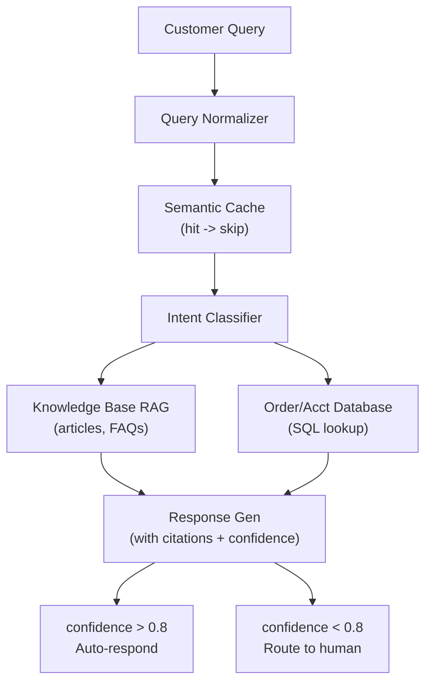

Scale: 50K articles, 2M customer interactions/month
Latency SLA: p95 < 3s
Cache hit rate: ~45%
Auto-resolution rate: ~60%

### Example 2: Enterprise Knowledge Platform

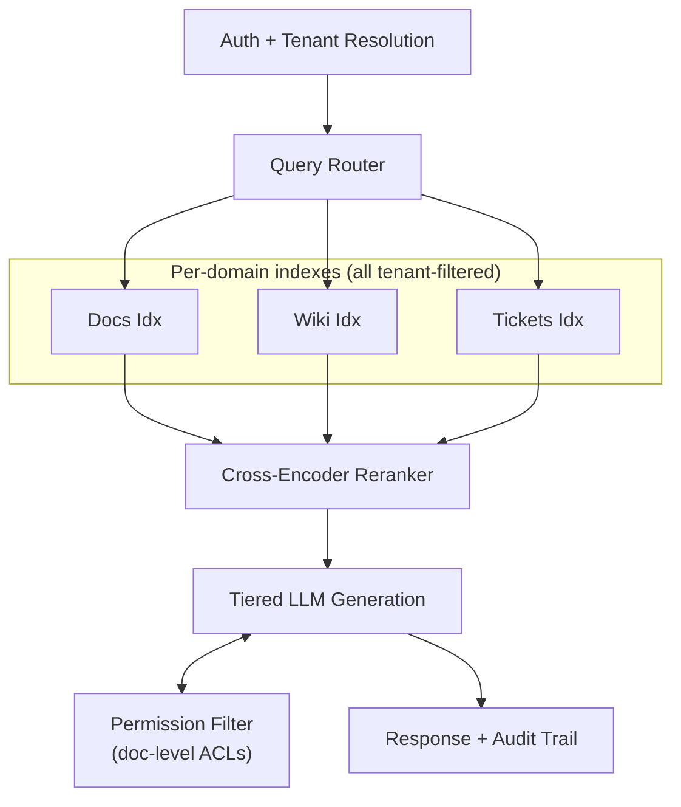

Scale: 200 tenants, 10M documents total, 500K queries/day
Isolation: Bridge model (5 enterprise silos + shared pool)
Ingestion: Async via Kafka, ~50K docs/day

### Example 3: Legal Document Analysis

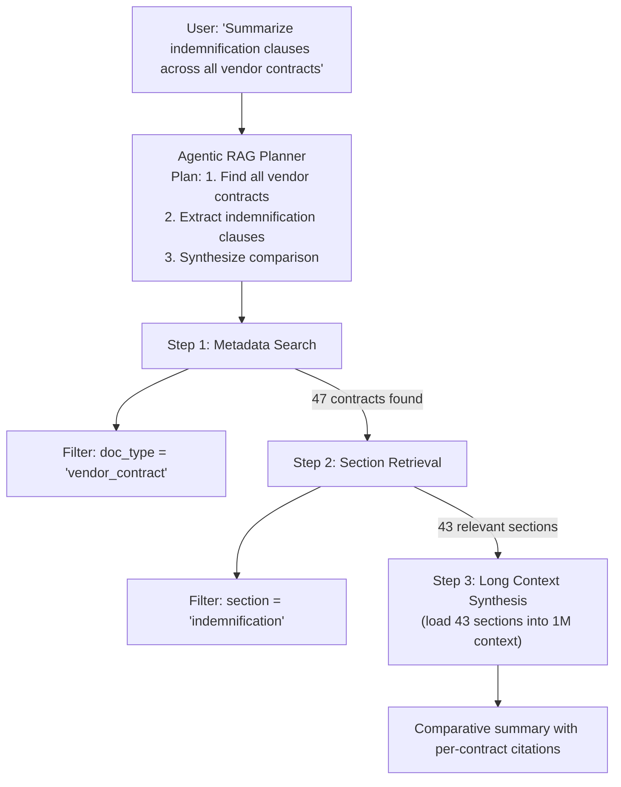

---

## System Design Interview Angle {#interview}

### Q: Design a RAG system that serves 10,000 queries per second across 500 tenants with a p99 latency of 2 seconds.

**Strong Answer:**

I would design this in four layers.

**Layer 1: Routing and Caching.** A query router classifies each incoming query (direct LLM, simple RAG, complex RAG). A three-tier cache (exact match, semantic cache, document cache) handles roughly 40-50% of traffic. This means only 5,000-6,000 QPS actually hit the retrieval pipeline.

**Layer 2: Retrieval.** I would use the bridge isolation model -- the top 20 enterprise tenants get dedicated indexes (silo), and the remaining 480 share a pooled index with mandatory tenant_id filtering. Retrieval runs hybrid search (vector + BM25) in parallel, with Reciprocal Rank Fusion to merge results. The vector database cluster is sharded by tenant tier and replicated for read throughput.

**Layer 3: Generation.** A tiered model strategy routes simple queries to a small model and complex queries to a larger model. This keeps average cost low while maintaining quality for hard queries. Per-tenant rate limiting prevents noisy neighbors.

**Layer 4: Observability.** Every query produces a trace with latency breakdowns, retrieval scores, and cost. Nightly quality checks sample 500 queries and evaluate faithfulness and relevancy. Alerts fire if p95 latency exceeds 3 seconds or faithfulness drops below 0.85.

**Cost estimate**: At 10K QPS, assuming 50% cache hits and a 70/30 split between small/large models, daily cost is roughly $2,000-5,000 for generation plus $500-1,000 for infrastructure.

### Q: How do you handle the case where a RAG system retrieves irrelevant documents but the LLM generates a plausible-sounding answer anyway?

**Strong Answer:**

This is the most dangerous RAG failure mode because it produces confident-sounding hallucinations grounded in real (but irrelevant) documents. I would address it at three points:

First, at the retrieval stage, implement a relevance grader -- a classifier (or LLM call) that scores each retrieved chunk against the query. If all chunks score below a threshold, the system should either escalate to a web search (Corrective RAG pattern) or respond with "I don't have enough information" rather than generating from weak context.

Second, at the generation stage, use constrained prompting that instructs the model to explicitly state when evidence is insufficient. Include a confidence score in the output and route low-confidence answers to human review.

Third, in monitoring, track the correlation between retrieval scores and user feedback. If users are giving thumbs-down on queries where retrieval scores were high, the reranker or the chunking strategy is likely the root cause. Log the full trace (query, retrieved chunks, generated answer, user feedback) so you can debug specific failure cases.

### Q: Your RAG system's costs have tripled over the last month with no increase in query volume. How do you diagnose and fix this?

**Strong Answer:**

I would investigate in this order:

First, check the **cache hit rate**. If it has dropped, that means more queries are hitting the full pipeline. Common causes: a semantic cache threshold change, cache invalidation running too aggressively after a data update, or a shift in query distribution that does not match the cached queries.

Second, check the **model routing distribution**. If the query classifier is routing more queries to the expensive large model, that alone can triple costs. Look at whether query complexity has shifted or if the classifier's behavior has drifted.

Third, check for **retrieval thrash** in agentic RAG paths. If the Corrective RAG loop is retrying more often (maybe because of stale embeddings or degraded retrieval quality), each query makes multiple retrieval and generation calls. The trace logs will show the average number of iterations per query.

Fourth, check the **embedding pipeline**. If documents are being re-embedded unnecessarily (duplicate ingestion, no deduplication), embedding costs can spike.

The fix depends on the root cause, but common interventions are: tune the semantic cache threshold, implement a cost ceiling per query to force cheaper fallback paths, fix embedding staleness to reduce corrective retrieval loops, and add deduplication to the ingestion pipeline.

---

## References {#references}

- Asai et al. "Self-RAG: Learning to Retrieve, Generate, and Critique" (2024)
- Yan et al. "Corrective Retrieval Augmented Generation (CRAG)" (2024)
- Shi et al. "RAGRouter: Learning to Route Queries to Multiple RAL Models" (2025)
- Redis. "RAG at Scale: How to Build Production AI Systems in 2026"
- Anthropic. "1M Token Context Window General Availability" (March 2026)
- RAGAS Framework. "Context Precision, Recall, Faithfulness, and Relevancy Metrics"
- AWS. "Multi-Tenant RAG with Amazon Bedrock Knowledge Bases" (2025)
- Microsoft. "Design a Secure Multitenant RAG Inferencing Solution" (2025)

---

*Next: [Data Engineering for AI](15-data-engineering-for-ai.md)*
