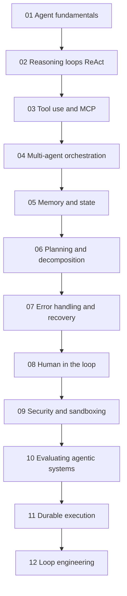
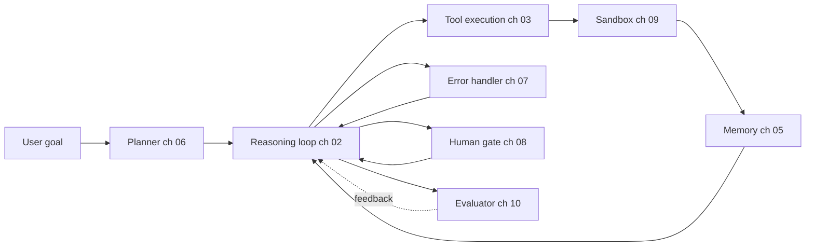

# Agentic Systems

Building production AI agents in 2026: reasoning loops, MCP tool use, multi-agent orchestration, memory, planning, error recovery, human-in-the-loop, and evaluation.

Agents are not a single technology. They are a composition of reasoning loop, tool layer, memory, planner, error handler, and evaluator. The 12 chapters in this folder cover each layer in depth, ordered so that earlier chapters establish vocabulary used in later ones.

## Chapter Order

## Reference Architecture

Each chapter's concepts map to one component of a deployed agent. The diagram below shows where each chapter's material lives in a production system:

## Files in This Folder

| File | What it covers |
|------|----------------|
| [01-agent-fundamentals.md](01-agent-fundamentals.md) | What makes a system an "agent"; the agent vs workflow distinction; when to choose each. |
| [02-reasoning-loops-react-and-beyond.md](02-reasoning-loops-react-and-beyond.md) | ReAct, Plan-and-Execute, Reflexion, Tree-of-Thought; loop design patterns. |
| [03-tool-use-and-mcp.md](03-tool-use-and-mcp.md) | Function calling, Model Context Protocol (MCP), A2A v1.0, MCP production hardening. |
| [04-multi-agent-orchestration.md](04-multi-agent-orchestration.md) | When multi-agent helps and when it hurts; orchestration vs choreography. |
| [05-agent-memory-and-state.md](05-agent-memory-and-state.md) | The L1-L4 memory hierarchy (Working, Episodic, Semantic, Procedural) with tradeoffs. |
| [06-planning-and-decomposition.md](06-planning-and-decomposition.md) | Task decomposition, plan revision, long-horizon planning. |
| [07-error-handling-and-recovery.md](07-error-handling-and-recovery.md) | Tool failures, retries, loop guards, the "100th tool call" problem. |
| [08-human-in-the-loop-patterns.md](08-human-in-the-loop-patterns.md) | Confirmation gates, escalation, supervised autonomy. |
| [09-agentic-security-and-sandboxing.md](09-agentic-security-and-sandboxing.md) | Code execution sandboxes, capability gating, prompt injection in agents. |
| [10-evaluating-agentic-systems.md](10-evaluating-agentic-systems.md) | Trajectory evals, Agent-as-judge, Process Reward Models, agent benchmarks. |
| [11-durable-execution.md](11-durable-execution.md) | Surviving crashes in long-running agents: event history, replay, exactly-once side effects, Temporal. |
| [12-loop-engineering.md](12-loop-engineering.md) | Engineering the loops around an agent: the four loop levels, termination and budget control, context rot, verification, anti-patterns like loopmaxxing, and the maturity ladder. |

## Companion Chapters

- [Tool Use and Computer Agents](../17-tool-use-and-computer-agents/) extends this section with OpenClaw, Computer Use, and the tool-agent landscape.
- [LangGraph Orchestration](../09-frameworks-and-tools/02-langgraph-orchestration.md) is the most common implementation framework for the patterns in this section.
- [Agentic RAG](../06-retrieval-systems/08-agentic-rag.md) intersects agents and retrieval.
- [Reliability and Safety](../13-reliability-and-safety/) extends agentic safety beyond chapter 09's sandboxing.

## Key Takeaways

- Agents are not a single technology; they are a composition of reasoning loop, tool layer, memory, planner, and evaluator. Read chapter 01 first.
- MCP is the standard tool-interop protocol in 2026; do not build custom tool protocols unless you have a strong reason.
- Multi-agent orchestration (ch 04) is over-applied; single-agent with good tooling beats multi-agent for most use cases.
- Memory (ch 05) and error recovery (ch 07) are where most production agent bugs live; budget evaluation effort there.
- Human-in-the-loop (ch 08) is not a fallback; design gates intentionally for high-stakes actions.
- Loop engineering (ch 12) is its own discipline now: a strong model in a weak harness loses to a decent model in a great one. Enforce termination and budgets in the harness, and keep the verifier separate from the producer.
