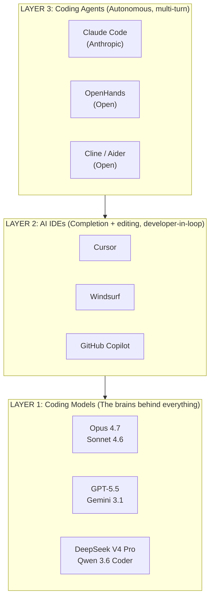
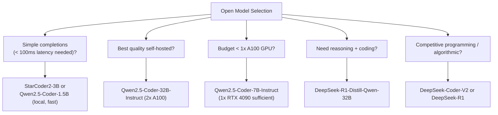
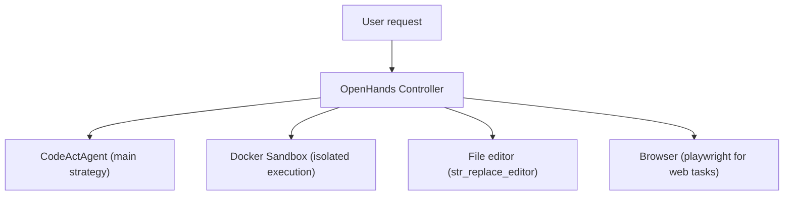
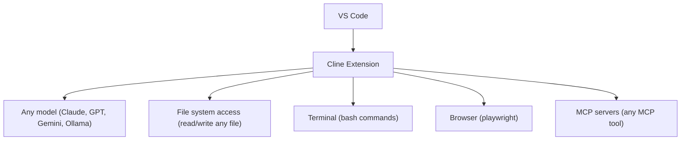
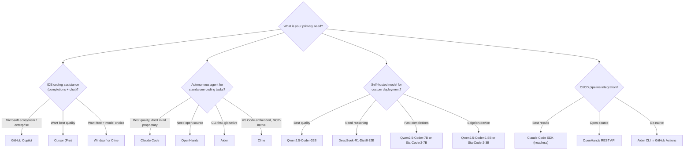
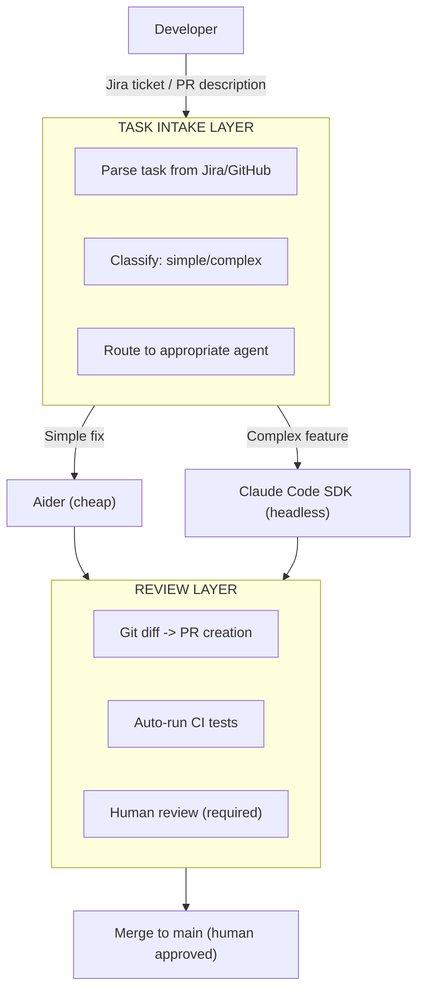
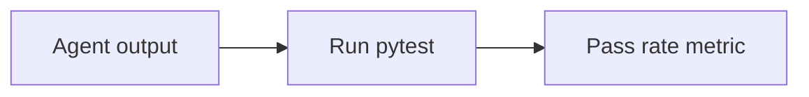
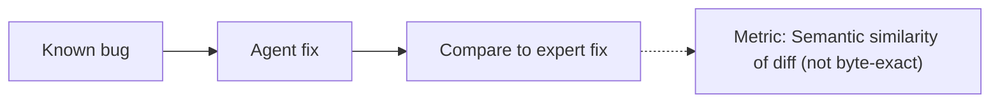

# OpenCoder: AI Coding Agents Landscape

The AI coding agent landscape has exploded. This guide covers open-weight coding models, agentic IDEs, open-source agents, and how to choose the right tool for your engineering workflow.

## Table of Contents

- [The AI Coding Landscape (2026)](#landscape)
- [Open-Weight Coding Models](#models)
- [AI-Native IDEs](#ides)
- [Open-Source Coding Agents](#agents)
- [Benchmark Deep Dive](#benchmarks)
- [Cost Comparison](#costs)
- [Selection Guide](#selection)
- [Production Architecture](#production)
- [Interview Questions](#interview-questions)
- [References](#references)

---

## The AI Coding Landscape (2026) {#landscape}

The coding AI landscape has three distinct layers:



---

## Open-Weight Coding Models {#models}

These models can be self-hosted, fine-tuned, and deployed without any API dependency.

### Qwen2.5-Coder (Alibaba)

A strong open-source coding model family. As of May 2026, the open-source coding leaders are Qwen 3.6 Coder and DeepSeek V4 Pro; Qwen 2.5 Coder remains a popular pick for self-hosted deployments on smaller hardware:

| Model | Parameters | Context | HumanEval+ | Notes |
|-------|------------|---------|------------|-------|
| Qwen2.5-Coder-32B-Instruct | 32B | 128K | 88.2% | Best open coding model |
| Qwen2.5-Coder-7B-Instruct | 7B | 128K | 79.3% | Excellent small model |
| Qwen2.5-Coder-1.5B | 1.5B | 32K | 65.8% | Edge/on-device use |

**Strengths:**
- Strong on coding benchmarks; competitive with frontier closed models on SWE-bench Verified
- 100+ programming languages
- Excellent fill-in-the-middle (FIM) for completions
- Apache 2.0 license — fully commercial

```python
# Self-hosted with vLLM
from vllm import LLM

model = LLM(
    model="Qwen/Qwen2.5-Coder-32B-Instruct",
    tensor_parallel_size=2,  # 2× A100 80GB
)
response = model.generate("def fibonacci(n: int) -> list[int]:")
```

### DeepSeek-Coder-V2 (DeepSeek)

| Model | Parameters | Architecture | HumanEval+ |
|-------|------------|-------------|------------|
| DeepSeek-Coder-V2-Instruct | 236B (MoE) | MoE | 90.2% |
| DeepSeek-Coder-V2-Lite | 16B (MoE) | MoE | 81.1% |

**Strengths:**
- MoE architecture → activates only 21B params per token (efficient)
- Strong on competitive programming (CodeForces problems)
- Open weights; strong Chinese language support

### StarCoder2 (BigCode / Hugging Face)

| Model | Parameters | Context | Notes |
|-------|------------|---------|-------|
| StarCoder2-15B | 15B | 16K | Best mid-size open coding LM |
| StarCoder2-7B | 7B | 16K | Efficient, 80+ languages |
| StarCoder2-3B | 3B | 16K | Lightweight, on-device |

**Strengths:**
- Fully open (BigCode OpenRAIL-M license)
- Excellent for IDE completions (low latency)
- Strong on Stack Overflow / GitHub data

### DeepSeek-R1-Distill (for coding)

| Model | Parameters | Math/Code | Notes |
|-------|------------|-----------|-------|
| DeepSeek-R1-Distill-Qwen-32B | 32B | Excellent | Reasoning distilled into smaller model |
| DeepSeek-R1-Distill-Llama-8B | 8B | Good | Tiny reasoning model |

**Use case**: When you need reasoning-quality code generation at self-hosted scale.

### Open Model Selection Guide



---

## AI-Native IDEs {#ides}

### Cursor

**Website:** cursor.sh | **Base:** VS Code fork | **Pricing:** $20/mo Pro

Cursor is the leading AI-native IDE. Key capabilities:

| Feature | Description |
|---------|-------------|
| **Composer** | Multi-file agentic editing (Cursor's equivalent of Claude Code) |
| **Ctrl+K** | Inline code generation |
| **Tab** | Predictive completions (smarter than Copilot) |
| **@-mentions** | Attach files, URLs, docs to context |
| **.cursorrules** | Project-level AI instructions (like CLAUDE.md) |
| **Model choice** | GPT-5.5, Claude Sonnet 4.6 / Opus 4.7, Gemini 3.1 Pro, DeepSeek V4 Pro |

**Best for**: Frontend/full-stack developers who want agentic editing within a familiar GUI.

**Limitations**: Closed-source; your code is sent to Cursor's servers (they offer a Privacy Mode).

### Windsurf (by Codeium)

**Website:** codeium.com/windsurf | **Base:** VS Code fork | **Pricing:** Free tier + $15/mo Pro

Windsurf differentiates via **Flows** (not to be confused with CrewAI Flows):

| Feature | Description |
|---------|-------------|
| **Cascade** | Windsurf's agentic editing mode |
| **Flows** | Deterministic agentic sequences (agent + user in harmony) |
| **Model choice** | Any: GPT-5.5, Claude Sonnet 4.6 / Opus 4.7, Gemini 3.1 Pro, DeepSeek V4 |
| **Free tier** | Generous free credits |

**Best for**: Teams that want Cursor-like experience with a free tier and model flexibility.

### GitHub Copilot (Microsoft/OpenAI)

| Feature | Status (May 2026) |
|---------|---------------------|
| Completions | ✅ Still the market leader by install base |
| Copilot Workspace | ✅ Multi-file agentic editing (in GA) |
| Model | GPT-5.5 (default), Claude Sonnet 4.6 / Opus 4.7 (available) |
| Enterprise features | ✅ IP protection, org policies, code referencing off |

**Best for**: Enterprise teams already on Microsoft/GitHub ecosystem.

**2026 reality**: Copilot's completion quality has been surpassed by Cursor/Windsurf for most developers, but its enterprise features and GitHub integration keep it dominant in large orgs.

### Google Antigravity

Antigravity is Google's agentic development platform, the successor to the Gemini CLI. It is less a text editor and more an **agent-first workspace** built around Gemini 3:

| Feature | Detail |
|---------|--------|
| **Agent Manager** | A dedicated view to launch, watch, and steer multiple async coding agents instead of editing files one at a time |
| **Planning + artifacts** | Agents produce a plan and reviewable artifacts (diffs, task lists, live browser sessions) before and during execution |
| **Built-in browser** | Agents can run and visually test the UI they build |
| **Model optionality** | Gemini 3 Pro by default, with support for Anthropic Claude and open models |
| **Platform** | Cross-platform (macOS, Windows, Linux); public preview, free for individuals |

**Best for**: Developers who want to operate at the "task" level (delegate a goal, review the plan and result) rather than the "edit" level. It competes with Cursor's Composer and Claude Code's agentic loop, with Google's bet being the multi-agent manager UI and tight Gemini 3 integration.

---

## Open-Source Coding Agents {#agents}

### OpenHands (formerly OpenDevin)

**GitHub:** github.com/All-Hands-AI/OpenHands | **License:** MIT

The leading open-source autonomous coding agent:

```bash
# Run with Docker
docker pull docker.all-hands.dev/all-hands-ai/openhands:latest
docker run -it --rm \
  -e SANDBOX_RUNTIME_CONTAINER_IMAGE=docker.all-hands.dev/all-hands-ai/runtime:latest \
  -e LLM_API_KEY=$ANTHROPIC_API_KEY \
  -e LLM_MODEL=claude-3-7-sonnet-20250219 \
  -v /var/run/docker.sock:/var/run/docker.sock \
  -p 3000:3000 \
  docker.all-hands.dev/all-hands-ai/openhands:latest
# Access at http://localhost:3000
```

**Architecture:**


**Key features:**
- **Any LLM**: Works with Claude Sonnet 4.6 / Opus 4.7, GPT-5.5, Gemini 3.1 Pro, DeepSeek V4, local Ollama
- **Docker sandbox**: Agent runs in isolated container
- **Web UI**: Chat-like interface; shows agent's reasoning
- **API access**: REST API for CI integration
- **SWE-bench score**: ~55-60% (depending on backend model)

### Aider

**GitHub:** github.com/paul-gauthier/aider | **License:** Apache 2.0

Terminal-first, git-native coding agent:

```bash
pip install aider-chat

# Works directly with your git repo
aider --model claude-3-7-sonnet-20250219

# Add files to context
/add src/auth.py src/models.py

# Give task
> Add JWT authentication to the User model
```

**What makes Aider different:**
- **Git-native**: Commits changes as it goes; maintains clean git history
- **Context maps**: Maintains a map of your entire codebase (even files not in context)
- **Voice mode**: Speak tasks aloud  
- **Architecture mode**: Discusses design before touching code

```bash
# SWE-bench Verified benchmarks (May 2026)
# Aider + Claude Sonnet 4.6  → ~74%
# Aider + Claude Opus 4.7    → ~87%
# Aider + GPT-5.5            → ~88%
```

### Cline (VS Code Extension)

**GitHub:** github.com/cline/cline | **License:** Apache 2.0

Open-source VS Code extension for autonomous coding:



**Key differentiators:**
- **MCP-native**: Full MCP support out of the box
- **Permission per action**: Every shell command, file edit requires user approval
- **Model flexibility**: Supports any OpenAI-compatible API endpoint (including local Ollama)
- **Free**: Open-source, no subscription

**Best for**: Developers who want Cursor-like experience for free, with full model flexibility.

---

## Benchmark Deep Dive {#benchmarks}

### SWE-bench Verified (March 2026)

The gold standard for agentic software engineering. Measures ability to resolve real GitHub issues.

| Agent / System | Score | Model Backend | Notes |
|---------------|-------|---------------|-------|
| GPT-5.5 (single-shot leader) | 88.7% | OpenAI | Holds #1 on SWE-Bench Verified (May 2026) |
| Claude Opus 4.7 (Anthropic) | 87.6% | Anthropic | Leads SWE-Bench Pro at 64.3% |
| Claude Code | ~87% | Claude Opus 4.7 / Sonnet 4.6 | Anthropic's official agent |
| OpenHands (best config) | ~75% | Claude Sonnet 4.6 | Open-source |
| Aider | ~74% | Claude Sonnet 4.6 / Opus 4.7 / GPT-5.5 | Open-source CLI |
| SWE-agent | ~55% | GPT-5.5 | Princeton research baseline |

> [!NOTE]
> SWE-bench scores are highly sensitive to backend model. The same agent with claude-3-7-sonnet typically scores 10-15% higher than with GPT-4o.

### HumanEval+ (Open Models)

| Model | HumanEval+ Score |
|-------|-----------------|
| Claude 3.7 Sonnet | 93.6% |
| GPT-4o | 90.2% |
| Qwen2.5-Coder-32B-Instruct | 88.2% |
| DeepSeek-Coder-V2-Instruct | 90.2% |
| StarCoder2-15B | 73.3% |

### LiveCodeBench (Runtime evaluation, stronger signal)

LiveCodeBench uses fresh competitive programming problems (not in training data):

| Model | LiveCodeBench Score |
|-------|---------------------|
| o3 (high) | 68.1% |
| Claude 3.7 Sonnet | 54.2% |
| GPT-4.5 | 38.7% |
| Qwen2.5-Coder-32B | 43.2% |
| DeepSeek-R1 | 57.0% |

**Insight**: LiveCodeBench scores are much lower than HumanEval because it tests novel problems. o3 and DeepSeek-R1 dominate due to their reasoning capabilities.

---

## Cost Comparison {#costs}

### Closed API vs. Open Self-Hosted

**Scenario: 1,000 coding tasks/day, avg 5K tokens each**

| Approach | Monthly Cost | Quality | Latency |
|----------|-------------|---------|---------|
| Claude 3.7 Sonnet (API) | ~$9,000 | ★★★★★ | Medium |
| GPT-4o (API) | ~$7,500 | ★★★★ | Medium |
| o3-mini (API) | ~$3,300 | ★★★★★ (reasoning) | Slow |
| Qwen2.5-Coder-32B (4×A100) | ~$4,000 (infra) | ★★★★ | Fast |
| DeepSeek-V3 (Together AI) | ~$1,350 | ★★★★ | Medium |

**Key insight**: Self-hosting Qwen2.5-Coder-32B becomes cost-competitive at ~500+ tasks/day compared to Claude API. For <200 tasks/day, API is almost always cheaper when you factor in engineering overhead.

---

## Selection Guide {#selection}

### Quick Decision Tree



### Comparison Matrix

| Dimension | Claude Code | Cursor | OpenHands | Aider | Cline |
|-----------|-------------|--------|-----------|-------|-------|
| Autonomy | Full | Medium | Full | Full | Full |
| Model lock | Claude | Any | Any | Any | Any |
| Open Source | ❌ | ❌ | ✅ | ✅ | ✅ |
| CI/Headless | ✅ | ❌ | ✅ | ✅ | ❌ |
| GUI | CLI | Full IDE | Web UI | Terminal | VS Code |
| MCP | ✅ | ✅ | Partial | ❌ | ✅ |
| Git-native | Partial | Partial | ✅ | ✅ | Partial |
| Price | API costs | $20/mo | Free + API | Free + API | Free + API |

---

## Production Architecture {#production}

### Enterprise Coding Agent Platform

Here's how to build an internal AI coding platform:



### Key Production Decisions

| Decision | Options | Recommendation |
|----------|---------|----------------|
| Model for agent | Claude 3.7, GPT-4o, open | Claude 3.7 Sonnet for best results |
| Task intake | Manual, Jira webhook, GitHub label | GitHub label triggers Actions workflow |
| Code execution | Local, Docker, E2B | Docker (reproducible, isolated) |
| Human review | PR, Slack approval, automated | Required PR review, never auto-merge |
| Cost control | Max turns, model routing | max_turns=20, Haiku for simple tasks |

---

## Interview Questions {#interview-questions}

### Q: How do you choose between Claude Code, Cursor, and OpenHands?

**Strong answer:**
It depends on three axes:

1. **Interface need**: If developers want GUI (see changes in context), use Cursor or Windsurf. If the task is scripted/headless (bug fixing, test generation in CI), use Claude Code SDK or OpenHands.

2. **Model control**: If you need to use any model (or your own fine-tuned model), use OpenHands or Aider. If you're okay with Anthropic only and want best-in-class results, use Claude Code.

3. **Open-source requirement**: Enterprise security teams often require open-source tools they can audit. OpenHands (MIT) and Aider (Apache 2.0) are the answer.

For a typical startup, I'd recommend: Cursor for daily development, Claude Code for batch tasks (PRs from GitHub issues), and OpenHands for self-hosted CI pipelines.

### Q: Why are open-weight coding models like Qwen2.5-Coder important for enterprise?

**Strong answer:**
Three reasons:

1. **Data privacy**: Code sent to closed APIs is potentially used for training or exposed to third parties. For healthcare (HIPAA), finance (SOX), and government teams, no proprietary code can leave the network. Qwen2.5-Coder-32B running on-prem solves this.

2. **Cost at scale**: At 1M+ code generation requests/month, self-hosting becomes 40-60% cheaper than API pricing, especially for completions (vs agentic tasks).

3. **Fine-tuning**: Open weights can be domain-specialized. A legal tech company can fine-tune on their internal DSL (domain-specific language). APIs don't allow this.

The quality gap between Qwen2.5-Coder-32B and Claude 3.7 Sonnet is real but shrinking. For completions and simpler tasks, the open model is often "good enough."

### Q: How would you design the testing strategy for an AI coding agent in CI?

**Strong answer:**
I'd use a three-tier evaluation:

**1. Functional tests** (automated, every run):


**2. Ground truth comparison** (weekly):


**3. Human evaluation** (sample 5% of agent PRs):
```
Senior engineer rates: Correctness, Style, Safety, 1-5 scale
```

I also track **regression rate** — if an agent fix introduces a new failing test, that's a hard failure. The agent should run the full test suite and only succeed if it improves or maintains the passing rate.

---

## References {#references}

- Qwen2.5-Coder: https://qwenlm.github.io/blog/qwen2.5-coder/
- DeepSeek-Coder-V2: https://github.com/deepseek-ai/DeepSeek-Coder-V2
- StarCoder2: https://huggingface.co/blog/starcoder2
- OpenHands: https://github.com/All-Hands-AI/OpenHands
- Aider: https://aider.chat/
- Cline: https://github.com/cline/cline
- Cursor: https://cursor.sh/
- Windsurf: https://codeium.com/windsurf
- Google Antigravity: https://developers.googleblog.com/build-with-google-antigravity-our-new-agentic-development-platform/
- SWE-bench Leaderboard: https://www.swebench.com/
- LiveCodeBench: https://livecodebench.github.io/

---

*Previous: [Claude Code](09-claude-code.md) | Next: [Framework Selection Guide](08-framework-selection-guide.md)*
