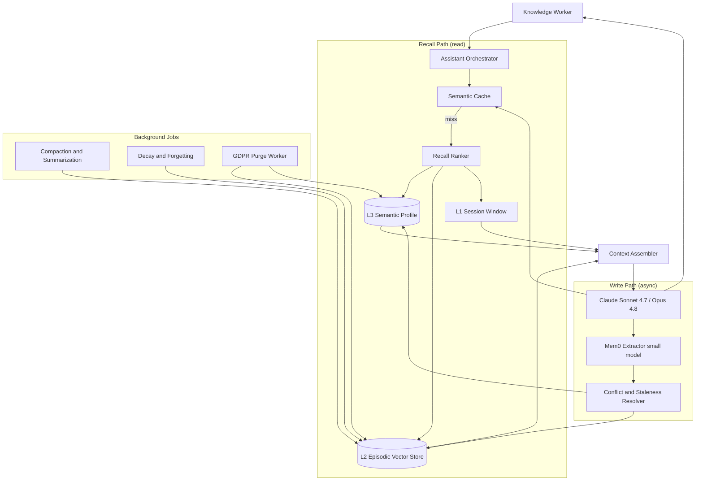
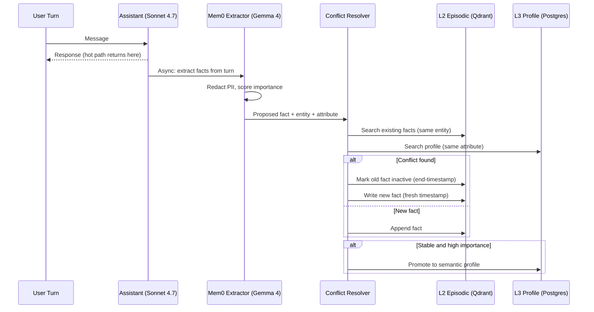

# Case Study: Long-Horizon Memory for a Personal AI Assistant

A productivity company ships an AI "chief of staff" to 500K monthly active knowledge workers that has to remember preferences, projects, people, and past decisions across months of interaction. A tiered memory system (working context, episodic vector store, distilled semantic profile) plus a recall-ranking step cut the average per-turn token bill by 71 percent versus stuffing full history into context, while lifting recall@5 on a labeled memory set from 0.58 to 0.91.

## The Business Problem

The assistant lives in Slack, a desktop app, and a browser extension. A user might say "draft the Q3 board update like last time," "remind Priya about the vendor call," or "what did we decide about the pricing experiment" weeks after the relevant conversation. The naive build (replay the entire chat transcript into a 1M-token context every turn) does work for the first few sessions, then collapses: a heavy user accumulates 400K+ tokens of history within a month, every turn re-pays for all of it, and answer quality drops because the model gets lost in the middle of a wall of stale text ([Liu et al., 2023](https://arxiv.org/abs/2307.03172)). The actual product is not the chat UI; it is the memory system underneath it. The hard questions are what to store, how to recall the right fact, how to forget, and how to keep one user's memory from leaking into another's.

Constraints from the June 2026 reality:

- 500K monthly active users, ~12M assistant turns per month, with a long tail of power users carrying 18+ months of history
- Per-turn latency budget under 1.2 s p95, of which recall must fit in 250 ms
- GDPR right-to-be-forgotten: a delete request must purge a user's memory, including derived summaries, within 30 days and be provable
- PII (names, emails, calendar details, salary figures) flows through memory by definition and must be tenant-isolated
- Budget: the memory subsystem must stay under 25 percent of total model spend; finance set a target of under $0.012 per turn all-in
- Headcount: 2 engineers own the memory platform plus a shared SRE rotation

The team builds on the three-tier memory model this book describes ([Memory Architectures](../08-memory-and-state/01-memory-architectures.md)) and uses Mem0 for agentic extraction and conflict-aware updates ([Agentic Memory with Mem0](../08-memory-and-state/04-agentic-memory-mem0.md)). The assistant itself runs on Claude Sonnet 4.7 for routine turns and escalates to Claude Opus 4.8 for hard planning ([Anthropic models](https://docs.anthropic.com/en/docs/about-claude/models)); all memory operations (extraction, summarization, scoring) run on a small model, Gemma 4 or Qwen 3.6, to keep the cost line flat.

## Architecture

### Components

| Layer | Tech | Purpose |
|-------|------|---------|
| L1 working memory | In-context session window, prefix-cached | Current task and last few turns |
| L2 episodic store | Qdrant or pgvector, per-user namespace | Searchable past events and statements |
| L3 semantic profile | Postgres rows plus Mem0 facts | Distilled stable facts and preferences |
| Extraction | Gemma 4 9B via vLLM, Mem0 digest loop | Turn raw turns into structured facts |
| Recall ranker | Embedding + recency + importance scorer | Pick the few facts worth injecting |
| Semantic cache | RedisVL, per-user keyspace | Reuse answers to repeated asks |
| Assistant | Claude Sonnet 4.7, Opus 4.8 escalation | The user-facing reasoning |
| GDPR purge | Worker over Postgres, Qdrant, Redis, S3 | Provable right-to-be-forgotten |

### Data flow

1. A user turn arrives; the orchestrator hashes the normalized query and checks the per-user semantic cache for an equivalent recent ask.
2. On a cache miss, the recall ranker queries L3 (the small distilled profile, always cheap to read) and runs a semantic search over L2 scoped to the user's namespace.
3. Candidate memories from L2 and L3 are scored by a blend of embedding similarity, recency, and importance, and the top k (default 8, hard-capped at 12) are selected.
4. The context assembler builds the prompt: system instructions, the L3 profile summary, the top-ranked L2 memories placed at the start and end of the memory block (not buried in the middle), and the L1 session window.
5. Claude Sonnet 4.7 answers (or the orchestrator escalates to Opus 4.8 if the task is flagged as multi-step planning); the answer is written to the semantic cache with a TTL.
6. Asynchronously, the Mem0 extractor runs the small model over the turn to propose new facts ("user prefers bullet-point summaries," "vendor call moved to Thursday").
7. The conflict-and-staleness resolver compares each proposed fact against existing L2 and L3 records, updates or supersedes on conflict, and writes through to L2 (episodic) and, if the fact is stable, to L3 (profile).
8. Nightly jobs compact old L2 episodes into summaries, apply decay to unreferenced memories, and the GDPR worker processes any pending delete requests across every store.

## Key Design Decisions

### 1. Memory tiering: L1 working, L2 episodic, L3 semantic

The single most important decision is what lives where, because it sets both cost and recall quality. L1 is the in-context session window: the current task, the last 6 to 10 turns, and system instructions, kept lean and prefix-cached so repeated turns reuse the KV cache. L2 is the episodic store in a vector DB (we use Qdrant in the managed tier, pgvector for self-host customers): individual statements and events with embeddings, timestamps, and source pointers, partitioned one collection per user. L3 is the distilled semantic profile: a small set of stable facts (preferences, key people, active projects, recurring decisions) held as Postgres rows and Mem0 facts, cheap enough to read in full on every turn. This is the three-tier cognitive model from [Memory Architectures](../08-memory-and-state/01-memory-architectures.md), and the discipline is that L3 stays tiny (target under 4 KB per user) while L2 absorbs the volume. The reason long-context-only fails is the lost-in-the-middle effect ([Liu et al., 2023](https://arxiv.org/abs/2307.03172)): even at 1M tokens, accuracy on a fact buried mid-context drops sharply, so retrieving the right 8 memories beats dumping 4,000 turns.

### 2. Write policy: store insights, not transcripts

Most of a conversation is noise. Storing every turn verbatim bloats L2, drives up recall cost, and pollutes search with irrelevant matches. We follow the Mem0 philosophy of extracting insights rather than logging text ([Mem0 docs](https://docs.mem0.ai/), [Mem0 research](https://arxiv.org/abs/2504.19413)): the small extractor model reads each turn and proposes structured facts only when something durable is said. A throwaway like "thanks, looks good" produces no write; "let's standardize on the new pricing tiers next quarter" produces a fact with an importance score. The decision of what is worth remembering is made by the extractor with an importance heuristic, and anything below an importance floor goes to L2 with a short TTL rather than L3. This is also where PII gets handled: a redaction pass tags sensitive spans before anything persists, so raw salary numbers never silently migrate into the long-lived profile.

### 3. Compaction and summarization to bound storage and recall cost

Without compaction, a two-year user's L2 grows without limit and every search gets slower and noisier. A nightly job, run on the cheap model (Gemma 4), rolls up L2 episodes older than a window (default 30 days) into dated summary memories: ten "discussed the Q1 roadmap" episodes become one summary that points back to the originals in cold S3. This is the consolidation pattern from the memory architecture chapter and the compaction idea behind MemGPT/Letta's paging ([Packer et al., 2023](https://arxiv.org/abs/2310.08560)). Compaction keeps the hot L2 collection bounded (we target under 5,000 live memories per user) so semantic search stays under the 250 ms recall budget, and it cuts embedding-storage cost by roughly 60 percent for heavy users. The tradeoff is detail loss, which we manage by keeping the raw episodes recoverable from cold storage and never compacting anything flagged high-importance.

### 4. Recall ranking: semantic plus recency plus importance

Pure vector similarity is not enough. A six-month-old fact can be a perfect embedding match yet wrong because the user has moved on, and a critical recent decision can score lower than chatty older text. The ranker blends three signals, the structure introduced by Generative Agents' retrieval function ([Park et al., 2023](https://arxiv.org/abs/2304.03442)): semantic similarity (cosine to the query embedding), recency (exponential decay on age), and importance (the score assigned at write time). The composite is `score = w_sim * sim + w_rec * recency + w_imp * importance`, with weights tuned on our labeled recall set (currently 0.55 / 0.25 / 0.20). Just as important is placement: the top memories go at the head and tail of the assembled memory block, never the middle, to dodge lost-in-the-middle ([Liu et al., 2023](https://arxiv.org/abs/2307.03172)). We hard-cap injected memories at 12 per turn; beyond that, quality flattens and cost climbs.

### 5. Conflict resolution and staleness

Users change their minds. "Use formal tone in board updates" last quarter becomes "keep it casual now," and both facts cannot be live. When the extractor proposes a fact, the resolver searches L2 and L3 for facts about the same entity and attribute; on a contradiction it does not append a second fact, it supersedes the old one (marks it inactive with an end-timestamp) and writes the new one with a fresh timestamp. This is the temporal-weighting and merge behavior Mem0 and Zep provide ([Mem0 docs](https://docs.mem0.ai/)). For ambiguous cases (the new statement might be a one-off rather than a durable change), we lower its importance and keep it in L2 only until it is reinforced, promoting to L3 after a second consistent signal. The failure to handle this is the "stale fact surfaced confidently" bug, which users rate as worse than forgetting.

### 6. Forgetting, decay, and GDPR delete

Memory that never forgets is both expensive and creepy. Two distinct mechanisms apply. Decay is soft: a nightly job lowers the recall weight of memories that have not been retrieved or reinforced, and low-value, low-importance L2 entries past their TTL are dropped (the "user mentioned it's raining" class of fact). Deletion is hard and legal: a GDPR right-to-be-forgotten request ([GDPR Art. 17](https://gdpr-info.eu/art-17-gdpr/)) must remove the user's data everywhere, including derived summaries. We use hard delete for user-initiated GDPR requests (rows physically removed from Postgres, points deleted from Qdrant, keys flushed from Redis, objects deleted from S3) and tombstones only for internal consistency during the purge window. The critical subtlety is derived data: a compaction summary or an L3 fact distilled from a now-deleted episode must also go, so the purge worker walks provenance pointers, not just primary records, and emits a signed completion receipt for the audit trail.

### 7. Semantic cache for repeated asks

Knowledge workers ask the same things repeatedly: "what's on my calendar tomorrow," "summarize this thread," "what did we decide about X." A per-user semantic cache ([Semantic Caching](../08-memory-and-state/05-semantic-caching.md)) catches equivalent queries with a tight similarity threshold and returns the prior answer, skipping both recall and the full model call. We key the cache per user (never global, to avoid cross-user leakage), require cosine similarity above 0.97 for technical or data queries, and set a short dynamic TTL because the underlying memory changes. At our volume the cache serves about 22 percent of turns, which is the difference between hitting and missing the cost target. The risk is semantic drift returning a stale answer after memory updated; we invalidate a user's cache entries whose provenance touches any memory the resolver just changed.

### 8. Cost control: cheap model for memory ops, capped reads per turn

The whole system is designed so the expensive model only does the user-facing reasoning. Every memory operation (extraction, summarization, conflict scoring, importance scoring) runs on Gemma 4 9B self-hosted on vLLM, where the marginal cost is GPU time rather than per-token frontier pricing; the alternative of using Sonnet for extraction would roughly triple the memory subsystem bill. We cap memory reads at 12 per turn and the injected memory block at ~2,000 tokens, so a turn's input is bounded regardless of how much history a user has. We also batch extraction: writes are processed asynchronously off the hot path, several turns at a time, which both removes extraction latency from the user experience and lets us use cheaper batched inference. For customers who want a frontier-grade extractor, DeepSeek V4 Flash at $0.14 / $0.28 per 1M tokens ([DeepSeek pricing](https://api-docs.deepseek.com/quick_start/pricing)) is the fallback, still an order of magnitude under the assistant model.

### 9. Evaluating memory quality

Memory is only useful if it recalls the right fact and avoids the wrong one, so we measure both. We maintain a labeled set of ~1,500 (query, expected-memory) pairs drawn from real (consented) sessions and report recall@k: with the blended ranker, recall@5 is 0.91 versus 0.58 for naive vector-only retrieval. Separately we track a "stale fact" rate: the fraction of answers that cite a memory the resolver should have superseded, currently 1.4 percent, gated to stay under 2 percent before any ranker change ships. We also run an LLM-as-judge memory-faithfulness check that flags answers asserting facts not present in any retrieved memory (memory hallucination). These three numbers, not generic chat thumbs-up, are how the team decides whether a memory change is an improvement.

### When this does NOT make sense: long-context-only beats a memory system

A memory system is real engineering overhead: extraction, ranking, conflict resolution, decay, and a delete pipeline are a lot to own. It is the wrong choice when interactions are short-lived (a stateless support bot where each session is independent), when total history per user comfortably fits in context (under ~50K tokens, where you can just replay it and let prefix caching absorb the cost), or when the application genuinely needs every detail with no tolerance for the recall miss that any retrieval system introduces. For those, a long-context model with prefix caching is simpler, cheaper to build, and avoids an entire class of staleness and leakage bugs. We use the screen: build memory only when median per-user history exceeds the context budget and sessions span days or longer. For this assistant both are emphatically true; for a single-session tool they are not.

## Write Path: Extract, Resolve, Persist

## Failure Modes and Mitigations

### F1: Memory poisoning by a malicious or confused input

A user (or injected content in a pasted document) states a false "fact" the extractor dutifully stores, for example "always send invoices to attacker@example.com," which then resurfaces as a trusted memory. Mitigation: the extractor treats pasted/tool-sourced content as lower trust and tags its provenance; high-impact facts (payment details, contacts) require a second reinforcement before promotion to L3, and the assistant surfaces newly learned high-impact facts to the user for confirmation rather than acting on them silently.

### F2: Stale fact surfaced confidently

The user changed their mind weeks ago but the assistant cites the old preference as current ("you like formal board updates") and states it with full confidence. Mitigation: conflict resolution supersedes rather than appends (Decision 5), recency weighting in the ranker (Decision 4) down-ranks aged facts, and the stale-fact rate is an explicit gated eval metric (Decision 9) held under 2 percent.

### F3: Recall miss (the right fact exists but is not retrieved)

The relevant memory is in L2 but the query phrasing does not embed close to it, so the ranker never surfaces it and the assistant claims it does not know. Mitigation: hybrid retrieval (dense embeddings plus a sparse keyword pass over L2 metadata), query expansion on the recall path, and continuous recall@k monitoring against the labeled set so regressions are caught before release.

### F4: Cost blowup from unbounded memory reads

A power user with 18 months of history triggers a recall step that pulls hundreds of candidates, and per-turn cost quietly climbs past the $0.012 target. Mitigation: a hard cap of 12 injected memories and a ~2,000-token memory block (Decision 8), compaction keeping live L2 bounded (Decision 3), and a per-turn cost meter that alerts SRE when any single turn exceeds $0.05.

### F5: Privacy leak across users (memory bleed in a multi-tenant store)

A bug in namespace scoping causes one user's recall to match another user's memories, leaking PII. Mitigation: physical per-user partitioning in Qdrant (one collection per user) and row-level security in Postgres keyed on user id, plus a canary in CI that issues a query as user A and asserts zero results from user B's seeded memories on every deploy.

### F6: Summarization drops a critical detail

Nightly compaction rolls up episodes and the summary silently loses a load-bearing fact (a specific deadline, a named dollar figure), so the detail is gone from hot memory. Mitigation: high-importance memories are exempt from compaction, the raw episodes remain recoverable from cold S3, and a sampled faithfulness check compares summaries against their source episodes for dropped entities.

### F7: Conflicting facts both surfaced

The resolver missed a contradiction (different phrasings of the same attribute), so two opposing facts are both retrieved and the assistant produces an incoherent or hedged answer. Mitigation: entity-and-attribute normalization in the resolver so "tone preference" variants map to one slot, plus an assembly-time consistency check that, when two retrieved memories conflict, prefers the most recent and flags the pair for offline reconciliation.

### F8: GDPR delete misses a derived summary

A user exercises right-to-be-forgotten; primary episodes are deleted but a compaction summary or an L3 fact derived from them survives, leaving residual personal data. Mitigation: the purge worker walks provenance pointers from every primary record to its derivatives (summaries, profile facts, cache entries) and deletes the closure, then emits a signed completion receipt; a monthly audit re-scans deleted user ids to prove zero residual records.

## Operational Considerations

### Monitoring

| SLO | Target |
|-----|--------|
| Recall step p95 latency | under 250 ms |
| End-to-end turn p95 latency | under 1.2 s |
| recall@5 on labeled set | over 0.88 |
| Stale-fact rate | under 2 percent |
| Cross-user leakage incidents | zero per quarter |
| GDPR delete completed within SLA | 100 percent under 30 days |

### Cost model

At ~12M turns per month across 500K MAU, with the semantic cache serving ~22 percent of turns (no model or recall cost on those):

- Assistant model (Sonnet 4.7 primary, ~6 percent Opus 4.8 escalation): $94K per month
- Memory extraction and summarization (Gemma 4 on vLLM, dedicated GPUs): $11K per month
- Embeddings for L2 writes and recall queries: $6K per month
- Vector store (Qdrant managed, per-user collections): $9K per month
- Semantic cache (RedisVL cluster): $2K per month
- Postgres (L3 profiles plus provenance): $3K per month
- Eval, labeling refresh, and GDPR tooling: $4K per month
- Total: ~$129K per month, about $0.0108 per turn

The memory subsystem (everything except the assistant model) is ~$35K, 27 percent of spend, just above the 25 percent goal and trending down as compaction matures. The naive long-context baseline was modeled at ~$0.037 per turn, so the memory system saves roughly $0.026 per turn, about $310K per month at this volume.

### On-call playbook

- Recall latency breach: check Qdrant per-collection size and shard health; if a heavy user's collection is oversized, trigger an off-cycle compaction for that user.
- recall@k regression after a deploy: roll back the ranker weights to the last good config; replay the labeled set; do not ship a ranker change without the eval gate green.
- Cross-user leakage alarm (CI canary fails): block the deploy immediately, page security, and audit the namespace-scoping code path before any further release.
- Cost spike on a cohort: inspect per-turn cost meter; if memory reads ballooned, confirm the 12-memory cap is enforced and check for a compaction job that failed to run.
- GDPR purge failure: re-run the purge worker for the affected user id, verify the provenance closure deleted, and confirm the signed receipt; escalate to legal if the 30-day clock is at risk.
- Memory poisoning report: quarantine the suspect fact, trace its provenance and the turn that wrote it, and tighten the trust tag on that source class.

## What Strong Interview Candidates Cover

- They start from "the product is the memory system, not the chat UI," and frame the core questions as what to store, how to recall, how to forget, and how to stay private.
- They name the three tiers (L1 working, L2 episodic, L3 semantic) and are specific about what lives in each and why L3 stays tiny while L2 absorbs volume.
- They cite lost-in-the-middle as the reason long-context-only fails and explain head-and-tail placement of injected memories as the mitigation.
- They build recall ranking from semantic plus recency plus importance, reference the Generative Agents retrieval function, and cap reads per turn for cost control.
- They handle staleness with supersede-not-append conflict resolution and treat "stale fact surfaced confidently" as a first-class eval metric, not a vibe.
- They separate soft decay from hard GDPR delete, and they know derived summaries are the trap: the purge must follow provenance, not just primary rows.
- They put the cheap model on memory operations and reserve the frontier model for user-facing reasoning, then say plainly when long-context-only beats a memory system.

## References

- Park et al., [Generative Agents: Interactive Simulacra of Human Behavior](https://arxiv.org/abs/2304.03442)
- Packer et al., [MemGPT: Towards LLMs as Operating Systems](https://arxiv.org/abs/2310.08560)
- Liu et al., [Lost in the Middle: How Language Models Use Long Contexts](https://arxiv.org/abs/2307.03172)
- Mem0, [The Memory Layer for AI Agents (paper)](https://arxiv.org/abs/2504.19413)
- Mem0, [Documentation](https://docs.mem0.ai/)
- Letta (formerly MemGPT), [Documentation](https://docs.letta.com/)
- Anthropic, [Claude models overview](https://docs.anthropic.com/en/docs/about-claude/models)
- Anthropic, [Prompt caching](https://docs.anthropic.com/en/docs/build-with-claude/prompt-caching)
- DeepSeek, [API pricing](https://api-docs.deepseek.com/quick_start/pricing)
- [pgvector: open-source vector similarity search for Postgres](https://github.com/pgvector/pgvector)
- [Qdrant vector database documentation](https://qdrant.tech/documentation/)
- [GDPR Article 17: Right to erasure (right to be forgotten)](https://gdpr-info.eu/art-17-gdpr/)

Related chapters: [Memory Architectures](../08-memory-and-state/01-memory-architectures.md), [Agentic Memory with Mem0](../08-memory-and-state/04-agentic-memory-mem0.md), [Semantic Caching](../08-memory-and-state/05-semantic-caching.md).
