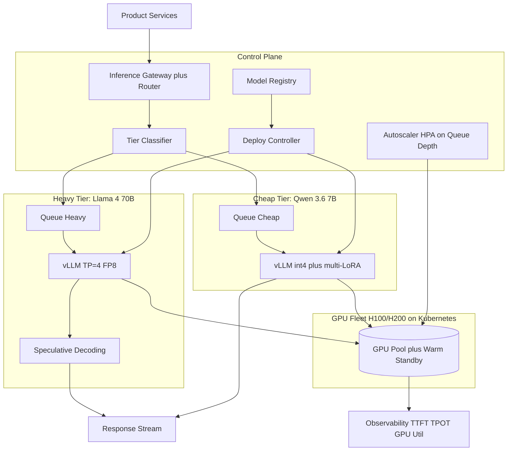
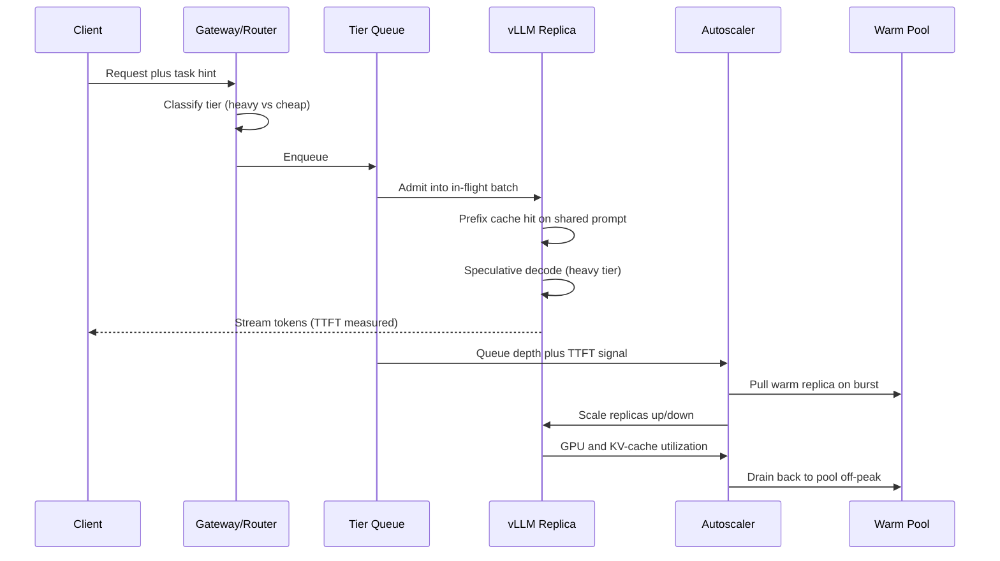

# Case Study: Self-Hosted LLM Inference Platform at Scale

A scaled company paying ~$85K per month to a frontier API vendor for high-volume, latency-sensitive product traffic builds an in-house inference platform on an H100/H200 fleet, serving Llama 4 for the heavy tier and Qwen 3.6 for the cheap tier with [vLLM](https://docs.vllm.ai/), continuous batching, and PagedAttention to cut cost-per-token 5 to 8x while holding p95 latency in budget.

## The Business Problem

A scaled product company runs ~1.4B output tokens per month of classification, structured extraction, summarization, and RAG answer synthesis against a frontier API. The bill crossed $85K per month in early 2026 and grows 12 percent quarter over quarter. The realization is the same one that drives most build decisions: these tasks do not need a frontier model. A strong open model (Llama 4 70B for the hard slice, Qwen 3.6 7B for the easy bulk) passes the golden set within tolerance, and the traffic is steady enough that a self-hosted GPU fleet amortizes. The hard parts are not "can the model do it"; they are throughput (batching), memory (KV cache), autoscaling spiky traffic without paying for idle H100s, and the operational burden of running serving infrastructure that a vendor used to run.

Constraints from the June 2026 reality:

- $85K per month vendor spend, growing 12 percent QoQ, with ~1.4B output tokens/month
- Latency budget: p95 time-to-first-token (TTFT) under 400 ms, p95 end-to-end under 2.5 s for RAG synthesis
- Traffic is spiky: 4x diurnal swing plus campaign-driven 8x bursts that arrive in under 60 seconds
- H100 80GB on-demand runs ~$2.50 to $3.50/GPU-hour on cloud; reserved/committed pricing lands near $1.80; the fleet must stay above 55 percent utilization to beat the vendor
- Quality bar: under 2 percent regression versus the frontier baseline on a per-task golden set
- Team: 2 platform/ML engineers plus shared SRE on-call, so the platform must be boring to operate

The make-or-buy benchmark is concrete. [DeepSeek V4 Flash](https://api-docs.deepseek.com/quick_start/pricing) at $0.14 input / $0.28 output per 1M tokens is the cheapest serious managed option; DeepSeek V4 Pro is $0.435 / $0.87. Self-hosting only makes sense if the blended cost-per-token lands well under the Flash line at the company's volume and the team can keep the GPUs busy. The serving stack is [vLLM](https://docs.vllm.ai/) for continuous batching and [PagedAttention](https://arxiv.org/abs/2309.06180), the technique that made high-throughput open-model serving practical.

## Architecture

### Components

| Layer | Tech | Purpose |
|-------|------|---------|
| Gateway/router | Envoy plus a small tier classifier | Route to heavy vs cheap tier, enforce budgets |
| Serving engine | [vLLM](https://docs.vllm.ai/) (continuous batching, PagedAttention) | High-throughput token generation |
| Heavy tier | Llama 4 70B, tensor parallel = 4, FP8, speculative decoding | Hard extraction and RAG synthesis |
| Cheap tier | Qwen 3.6 7B, int4 (AWQ), multi-LoRA | Classification and the high-volume bulk |
| Orchestration | Kubernetes plus [KServe](https://kserve.github.io/website/) (Ray Serve evaluated) | Rollout, scaling, traffic split |
| Autoscaler | HPA on queue depth plus warm pool, scale-to-zero off-peak | Match capacity to spiky demand |
| GPU fleet | H100 80GB and [H200 141GB](https://www.nvidia.com/en-us/data-center/h200/) | Compute, with H200 for large-batch heavy tier |
| Model registry | MLflow-style registry plus signed artifacts | Versioned checkpoints, safe deploys |
| Observability | Prometheus plus Grafana, vLLM metrics | TTFT, TPOT, tokens/sec, queue depth, GPU util |

### Data flow

1. A product service sends a request to the inference gateway with a task hint (classify, extract, summarize, rag_synth).
2. The tier classifier routes it: classification and short extraction go to the Qwen 3.6 cheap tier; long extraction and RAG synthesis go to the Llama 4 70B heavy tier.
3. The request lands in the per-tier queue. vLLM pulls it into the current in-flight batch via continuous batching, so it does not wait for a batch window to fill.
4. PagedAttention allocates KV-cache blocks on demand; if the request shares a system prompt with others in flight, prefix caching reuses the already-computed KV for the shared prefix.
5. The heavy tier runs speculative decoding: a small drafter proposes several tokens per step, the 70B verifies them in one forward pass, cutting tokens-per-output-token (TPOT) on the latency-critical path.
6. The cheap tier, if the request targets a fine-tuned variant, hot-swaps the relevant LoRA adapter onto the shared int4 base via multi-LoRA serving, so one base model serves many fine-tunes.
7. Tokens stream back through the gateway to the caller; the autoscaler watches queue depth and TTFT and adds or drains GPU replicas, drawing from a warm pool to avoid cold starts.
8. Every request emits TTFT, TPOT, tokens/sec, batch size, and GPU utilization to Prometheus; the cost model reconciles GPU-hours against tokens served nightly.

## Key Design Decisions

### 1. Two tiers: Llama 4 70B for the hard slice, Qwen 3.6 7B for the bulk

We split by difficulty, not by product. About 80 percent of requests (classification, short extraction) are easy and go to Qwen 3.6 7B in int4, which serves them at a tiny fraction of the heavy-tier cost. The remaining 20 percent (long-document extraction, RAG answer synthesis) need the reasoning headroom of [Llama 4](https://ai.meta.com/blog/llama-4/) 70B. Sizing the heavy tier matters: a 70B-class model in FP8 needs ~70GB just for weights, so it does not fit one 80GB H100 with room for a useful KV cache; we run it tensor-parallel across 4 GPUs (or 2x H200 141GB for larger batches). The cheap tier 7B fits comfortably on a single H100, leaving most of the 80GB for KV cache, which is what actually drives throughput. The split is the single biggest cost lever: putting the 80 percent easy traffic on a 7B instead of the 70B is roughly a 10x per-request saving on that slice.

### 2. Continuous batching config and the throughput-versus-latency tradeoff

The core of vLLM is continuous (in-flight) batching: instead of waiting for a fixed batch to fill, the scheduler admits new requests into the running batch every decode step and evicts finished ones ([Orca, OSDI 2022](https://www.usenix.org/conference/osdi22/presentation/yu); [Anyscale's continuous batching writeup](https://www.anyscale.com/blog/continuous-batching-llm-inference)). This is why open-model throughput jumped 10 to 20x over naive static batching. The knobs are `max_num_seqs` (concurrent sequences) and `max_num_batched_tokens` (the per-step token budget). Bigger budgets raise tokens/sec and GPU utilization but push TTFT up because new arrivals wait behind a fat batch. We tune per tier: the cheap tier runs a large token budget (high throughput, TTFT is not user-facing for async classification), the heavy tier runs a tighter budget plus chunked prefill so a long RAG prompt does not block short ones. The lesson is that TTFT, TPOT, and throughput are a three-way tradeoff; you tune the batch to the tier's SLO, not to a single global number.

### 3. KV cache management with PagedAttention plus prefix caching

KV cache, not weights, is the memory bottleneck under load. [PagedAttention](https://arxiv.org/abs/2309.06180) treats the KV cache like OS virtual memory: it stores it in fixed-size blocks instead of one contiguous slab, which cuts fragmentation waste from ~60 to 80 percent down to under 4 percent and lets us pack far more concurrent sequences per GPU. On top of that we enable [prefix caching](https://docs.vllm.ai/en/latest/features/automatic_prefix_caching.html): our RAG and classification calls share large system prompts and few-shot exemplars, so the KV for that shared prefix is computed once and reused across requests. For our workload, with a ~1,800-token shared system prompt, prefix caching cut heavy-tier prefill compute by roughly 35 percent and pulled p95 TTFT down materially. See the deeper mechanics in [PagedAttention](../04-inference-optimization/05-paged-attention.md) and [KV cache](../04-inference-optimization/02-kv-cache-and-context-caching.md).

### 4. Quantization: FP8 for the heavy tier, int4 for the cheap tier

Quantization is how we fit big models and raise throughput, but it costs accuracy, so we pick per tier. The heavy tier runs [FP8](https://docs.vllm.ai/en/latest/quantization/fp8.html) (native on H100/H200 Hopper tensor cores): it roughly halves weight memory versus FP16 and raises throughput ~1.6 to 1.8x, with an accuracy hit we measured at under 0.3 points on our golden set, which is negligible for synthesis quality. The cheap tier runs int4 via [AWQ](https://arxiv.org/abs/2306.00978) (GPTQ was close): int4 cuts the 7B weight memory ~4x and lifts throughput ~2.2x on H100 versus FP16, at a ~0.5-point accuracy cost that classification and short extraction tolerate fine. We do NOT run int4 on the 70B heavy tier; the accuracy regression on long RAG synthesis was visible (~1.4 points) and pushed us toward the golden-set limit, so FP8 is the right floor for that tier. Quantize aggressively where the task is easy, conservatively where it is hard.

### 5. Autoscaling spiky traffic: warm pools over naive scale-to-zero

The traffic has an 8x campaign burst that arrives in under a minute, and an H100 replica loading a 70B FP8 checkpoint plus warming CUDA graphs takes 90 to 180 seconds cold. Naive scale-to-zero would mean every burst eats a multi-minute cold start, which blows the TTFT SLO. We run HPA scaling on queue depth and TTFT (not CPU, which is meaningless for GPU serving) with a warm pool: N standby replicas kept loaded but lightly loaded, sized to absorb the first wave of a burst while the autoscaler spins up cold replicas behind them. Off-peak (overnight) we do scale the heavy tier toward zero because the warm-pool cost is not justified when traffic is a trickle, accepting a slower first response for the rare night request. Cold-start mitigation also includes pre-baked container images with weights on a fast local NVMe cache rather than pulling from object storage on boot, which alone cut cold start by ~40 seconds.

### 6. Speculative decoding for the latency-critical tier

RAG answer synthesis is user-facing and latency-critical, and the 70B's TPOT dominates end-to-end latency. We use [speculative decoding](https://arxiv.org/abs/2211.17192): a small, cheap drafter proposes k tokens, the 70B verifies all k in a single forward pass, and accepted tokens are emitted for free relative to running the big model per token. With a well-matched drafter we see ~1.8 to 2.4x speedup on TPOT for the synthesis path, which is the difference between a 2.5 s and a sub-1.5 s p95. The catch is that speculative decoding helps latency, not throughput; under a saturated batch the extra verification work can reduce tokens/sec, so we enable it only on the heavy latency-critical tier and disable it on the async cheap tier where throughput is king. Details in [speculative decoding](../04-inference-optimization/03-speculative-decoding.md).

### 7. Multi-LoRA hot-swap: many fine-tunes on one base

Product teams want fine-tuned variants (a support-tone extractor, a finance-flavored summarizer) without standing up a GPU per variant. We serve them with multi-LoRA: one int4 Qwen 3.6 base in memory, with LoRA adapters (tens of MB each) hot-swapped per request, the [S-LoRA](https://arxiv.org/abs/2311.03285) pattern that vLLM implements natively. This lets a single base serve dozens of fine-tunes concurrently with near-base throughput, instead of fragmenting the fleet into one-model-per-GPU silos that would each sit at low utilization. The tradeoff is a small per-request adapter-swap overhead and a cap on how many adapters stay hot in memory; cold adapters page in from the registry on first use. This decision is what keeps the cheap tier dense and the fleet utilization high.

### 8. Observability built on serving-specific signals

Generic CPU/memory dashboards are useless for GPU serving. The signals that matter are TTFT (queueing plus prefill health), TPOT (decode speed, the speculative-decoding and batch story), tokens/sec per GPU (throughput, the cost story), GPU utilization and KV-cache utilization (are we packed or wasting the fleet), and queue depth (the autoscaler's input). vLLM exports these as Prometheus metrics out of the box. We alert on KV-cache utilization above 90 percent (OOM risk), queue depth growth (capacity shortfall), and a TPOT regression (a bad batch config or a speculative-decoding acceptance-rate drop). Without per-tier TTFT/TPOT split we would be blind to which tier is hurting; with it, an on-call engineer reads the dashboard and knows whether to add replicas, retune the batch, or roll back a checkpoint.

### 9. When self-hosting does NOT make sense

Self-hosting is not free; it trades a vendor bill for an engineering and on-call bill. Signals against:

- Low volume. Under ~150 to 200M output tokens/month, the fleet cannot stay above the ~55 percent utilization that beats DeepSeek V4 Flash, and idle GPUs make the per-token cost worse than the vendor, not better.
- Spiky-only with no steady base. If traffic is pure burst with long dead zones, you either overpay for warm capacity or eat cold starts; a managed API absorbs this for you.
- Tiny team. Running vLLM, Kubernetes, an autoscaler, and a GPU on-call rotation is real work. With under ~1.5 dedicated engineers, the operational burden outweighs the savings, and an outage has no vendor SLA to fall back on.
- Frontier quality is required. If the task genuinely needs Claude Opus 4.8 or GPT-5.6 reasoning, no open 70B closes the gap, and self-hosting just gives you a cheaper worse answer.

Our quick screen: steady-state volume over 300M output tokens/month, at least 60 percent of it served acceptably by an open model on the golden set, and a team that can own GPU on-call. If any fails, we stay on the API or use a managed open-model endpoint (Together, Fireworks, DeepSeek) instead of running our own fleet.

## Request Lifecycle and Autoscaling

## Failure Modes and Mitigations

### F1: GPU OOM from KV cache under load

A burst of long-context RAG requests inflates the KV cache until vLLM cannot allocate blocks and the replica OOMs, dropping in-flight requests. Mitigation: cap `max_num_seqs` and `max_model_len` so the worst-case KV footprint fits in budget; enable vLLM preemption/recompute so the scheduler sheds the longest sequences gracefully instead of crashing; alert at 90 percent KV-cache utilization so the autoscaler adds capacity before the ceiling.

### F2: Cold-start latency spike on scale-up

A campaign burst triggers scale-up, but new replicas need 90 to 180 seconds to load the 70B checkpoint and warm CUDA graphs, so TTFT spikes for the first wave. Mitigation: a warm pool sized to the first burst wave (Key Design Decision 5), weights on local NVMe instead of object storage, and pre-warmed CUDA graphs in the container image. The autoscaler triggers on a leading indicator (queue depth growth) rather than on already-blown TTFT.

### F3: Throughput collapse from a bad batch config

Someone sets `max_num_batched_tokens` too low (small batches starve the GPU) or too high (TTFT and OOM), and tokens/sec craters while GPU utilization looks busy. Mitigation: batch configs are versioned with the deployment and load-tested in staging against a recorded production trace before rollout; a TPOT/throughput regression gate blocks the deploy; the dashboard shows tokens/sec per GPU so a regression is obvious within minutes.

### F4: Quantization regression caught late

A new int4 quantization of the cheap-tier model passes a smoke test but regresses a specific task class (e.g. numeric extraction) that only shows up in production. Mitigation: every quantized artifact runs the full per-task golden set, not a smoke set, with a hard 2-point gate; shadow traffic compares quantized versus FP16 outputs for a week; per-task quality metrics on live traffic auto-rollback the specific tier if a class regresses.

### F5: Noisy-neighbor latency in shared serving

A heavy LoRA tenant or a flood of long prompts on the shared cheap-tier base starves other tenants, spiking their TTFT. Mitigation: per-tenant token-rate limits at the gateway; fair-share scheduling so no single adapter monopolizes the batch; isolate a hot tenant onto a dedicated replica when its load justifies it; cap concurrent active LoRA adapters so the base stays responsive.

### F6: Model registry deploys a bad checkpoint

The deploy controller ships a corrupted or mislabeled checkpoint and the whole tier starts returning garbage. Mitigation: signed artifacts with checksum verification at load time; the registry pins a known-good "last good" revision; canary one replica before fleet-wide rollout with an automatic health check on output quality; one-command rollback to the pinned revision.

### F7: Cost regression from idle GPUs

Traffic dips but the fleet does not scale down (a stuck autoscaler, an over-large warm pool, or a forgotten debugging replica), and utilization falls below the break-even line so per-token cost quietly exceeds the vendor it replaced. Mitigation: a utilization SLO with a daily alarm when fleet utilization drops under 55 percent; the nightly cost reconciliation compares actual GPU-hours-per-token against the DeepSeek V4 Flash line and pages if we are losing the make-or-buy math; warm-pool size is itself autoscaled to recent peak demand.

### F8: A traffic spike exceeds capacity (load shedding)

A spike outruns even the warm pool plus scale-up, and the queue grows unbounded, so latency for everyone degrades toward timeout. Mitigation: explicit load shedding at the gateway: when queue depth crosses a threshold, shed the lowest-priority async classification traffic first (retry later), protect the user-facing RAG path, and as a last resort spill overflow to the DeepSeek V4 API so users get a degraded-but-served answer instead of a timeout. Better to shed or spill deliberately than to collapse silently.

## Operational Considerations

### Monitoring

| SLO | Target |
|-----|--------|
| Heavy-tier p95 TTFT | under 400 ms |
| RAG synthesis p95 end-to-end | under 2.5 s |
| Cheap-tier throughput | over 3,500 tokens/sec per H100 |
| Fleet GPU utilization | over 55 percent (alarm below) |
| KV-cache utilization | under 90 percent steady |
| Quality delta vs frontier baseline | within 2 points per task |

### Cost model

Steady-state fleet at reserved/committed pricing (~$1.80/H100-hour):

- Heavy tier: 12x H100 average (3 TP=4 replicas), ~$15,600/month
- Cheap tier: 8x H100 average (int4 plus multi-LoRA), ~$10,400/month
- Warm pool plus burst headroom (amortized): ~$6,000/month
- Observability, registry, control-plane nodes: ~$2,500/month
- Platform engineering and on-call (loaded, partial): ~$9,000/month
- Total: ~$43,500/month

That serves the same ~1.4B output tokens that cost $85K on the vendor, so the platform is roughly half the bill, about a 2x all-in saving and closer to 5 to 8x on raw cost-per-token before the operational overhead is added back. Blended cost lands near $0.031 per 1M output tokens of GPU compute on the cheap tier, well under the [DeepSeek V4 Flash](https://api-docs.deepseek.com/quick_start/pricing) $0.28 output line, which is what justifies running our own fleet at this volume. Drop below ~300M tokens/month and the fixed engineering and warm-pool cost erases the win.

### On-call playbook

- KV-cache/OOM alarm: confirm KV-cache utilization and queue depth; add replicas or lower `max_num_seqs`; if a single tenant is the cause, isolate it.
- Cold-start TTFT spike: confirm the warm pool drained or a deploy evicted it; refill the warm pool; check that weights are loading from local NVMe, not object storage.
- Throughput collapse: compare tokens/sec per GPU to baseline; roll back the last batch-config or quantization change; re-run the staging load test.
- Quality regression: replay the per-task golden set; auto-rollback the affected tier to the registry's last-good revision; route that task class to the heavy tier or the API until fixed.
- Utilization below break-even: check for a stuck autoscaler or forgotten replicas; resize the warm pool to recent peak; if traffic structurally dropped, shrink the reserved fleet.
- Capacity exceeded: confirm load shedding engaged and the RAG path is protected; enable API spillover; communicate degraded async SLA to dependent teams.

## What Strong Interview Candidates Cover

- They name vLLM, continuous batching, and PagedAttention and explain why KV cache (not weights) is the memory bottleneck that drives throughput under load.
- They treat TTFT, TPOT, and throughput as a three-way tradeoff and tune the batch per tier and per SLO, rather than quoting one global latency number.
- They size the heavy model honestly: a 70B in FP8 does not fit one 80GB GPU with a useful KV cache, so tensor parallelism is required, and they know FP8 versus int4 has different accuracy costs by task.
- They solve spiky autoscaling with warm pools and queue-depth-based HPA, and they can explain why naive scale-to-zero blows the TTFT SLO on bursts.
- They use speculative decoding for the latency tier and know it helps latency, not throughput, so they disable it under saturated async batches.
- They make the build-versus-buy math explicit against DeepSeek V4 Flash pricing and state the utilization floor (~55 percent) below which self-hosting loses.
- They say clearly when self-hosting does NOT make sense (low volume, spiky-only, tiny team, frontier quality required), showing judgment rather than reflexive insourcing.

## References

- [vLLM documentation](https://docs.vllm.ai/)
- Kwon et al., [Efficient Memory Management for LLM Serving with PagedAttention](https://arxiv.org/abs/2309.06180)
- Yu et al., [Orca: A Distributed Serving System for Transformer-Based Generative Models (OSDI 2022)](https://www.usenix.org/conference/osdi22/presentation/yu)
- Anyscale, [How continuous batching enables 23x throughput in LLM inference](https://www.anyscale.com/blog/continuous-batching-llm-inference)
- Leviathan et al., [Fast Inference from Transformers via Speculative Decoding](https://arxiv.org/abs/2211.17192)
- Sheng et al., [S-LoRA: Serving Thousands of Concurrent LoRA Adapters](https://arxiv.org/abs/2311.03285)
- Lin et al., [AWQ: Activation-aware Weight Quantization](https://arxiv.org/abs/2306.00978)
- [vLLM FP8 quantization](https://docs.vllm.ai/en/latest/quantization/fp8.html)
- [vLLM automatic prefix caching](https://docs.vllm.ai/en/latest/features/automatic_prefix_caching.html)
- [Ray Serve documentation](https://docs.ray.io/en/latest/serve/index.html)
- [KServe documentation](https://kserve.github.io/website/)
- [NVIDIA H200 GPU](https://www.nvidia.com/en-us/data-center/h200/)
- [DeepSeek V4 pricing](https://api-docs.deepseek.com/quick_start/pricing)
- Meta, [Llama 4](https://ai.meta.com/blog/llama-4/)

Related chapters: [Serving Infrastructure](../04-inference-optimization/06-serving-infrastructure.md), [Batching Strategies](../04-inference-optimization/04-batching-strategies.md), [Cost Optimization Playbook](../04-inference-optimization/07-cost-optimization-playbook.md).
