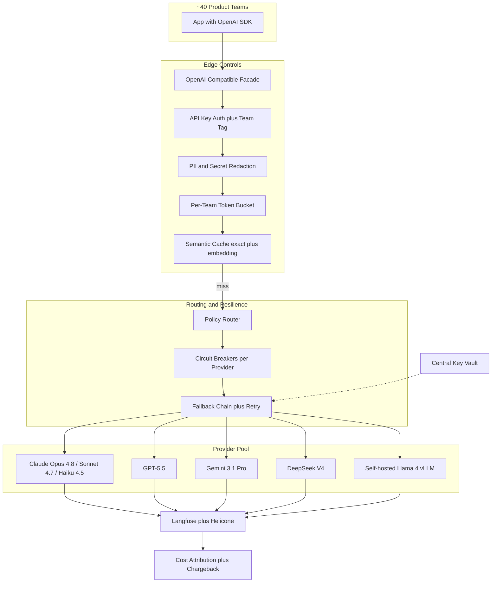
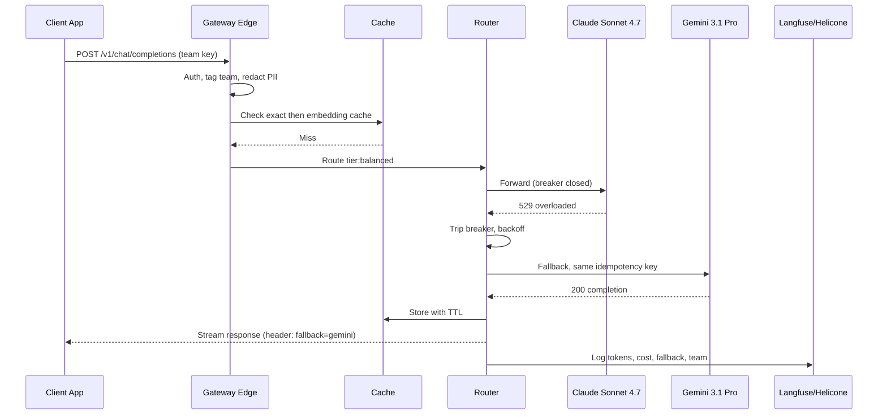

# Case Study: Multi-Model AI Gateway with Routing and Fallback

A 1,200-engineer company builds an internal AI gateway so ~40 product teams hit one OpenAI-compatible API instead of integrating Claude, GPT, Gemini, DeepSeek, and a self-hosted Llama 4 pool separately, with automatic fallback on vendor outages, semantic caching, per-team quotas, and cost attribution. The driver: a 4-hour frontier-vendor outage in early 2026 took down 9 products at once, and finance could not attribute the $300K per month AI bill to teams.

## The Business Problem

Forty product teams each integrated their own LLM SDK. When a frontier vendor had a 4-hour outage in February 2026, 9 products went dark simultaneously because every one of them had hard-coded a single provider with no fallback. In the same quarter, finance received a $300K per month consolidated AI invoice and could not say which team spent what, so cost control was impossible and nobody owned overruns. The platform team's mandate: one OpenAI-compatible endpoint that every team already knows how to call, with routing, fallback, caching, quotas, and chargeback handled centrally so 40 teams stop re-solving the same problems 40 times.

Constraints from the June 2026 reality:

- $300K per month spend across 6 providers, unattributable to teams, growing ~20 percent per quarter.
- A single-vendor outage cannot be allowed to take down more than one product; blast radius must be contained.
- Teams will not rewrite working code, so the facade must be drop-in OpenAI-compatible ([OpenAI API reference](https://platform.openai.com/docs/api-reference/chat)).
- Vendor prices span 30x: DeepSeek V4 Flash is $0.14 / $0.28 per 1M input/output tokens ([DeepSeek pricing](https://api-docs.deepseek.com/quick_start/pricing)) versus Claude Opus 4.8 at $5 / $25 ([Anthropic pricing](https://www.anthropic.com/pricing)), so routing the wrong task to the wrong tier is the single biggest waste.
- API keys for 6 vendors must never live in client code or repos; one leaked key has burned five-figure bills industry-wide.
- Per-team budgets and fairness across 40 tenants must be enforced so one noisy team cannot starve the rest or blow the shared bill.

The team builds on a self-hosted gateway (LiteLLM, [docs](https://docs.litellm.ai/docs/)) rather than per-team SDKs because it gives one OpenAI-compatible surface over every provider, native fallback chains, and budget primitives out of the box, and it keeps the routing policy in one auditable place. Observability flows to Langfuse ([docs](https://langfuse.com/docs)) and Helicone ([docs](https://docs.helicone.ai/)) for traces and cost-per-call attribution.

## Architecture

### Components

| Layer | Tech | Purpose |
|-------|------|---------|
| Facade | LiteLLM proxy, OpenAI-compatible | Drop-in `/v1/chat/completions` for all teams |
| Auth | Per-team virtual API keys | Identity and quota anchor per call |
| Redaction | Microsoft Presidio plus regex | Strip PII and secrets before egress |
| Cache | Redis exact plus pgvector embedding cache | Cut spend and latency on repeats |
| Router | Policy engine (capability, cost, latency, router model) | Pick the cheapest model that passes |
| Resilience | Circuit breakers plus retry/backoff | Contain vendor outages |
| Key vault | HashiCorp Vault | Keys never leave the gateway |
| Observability | Langfuse plus Helicone | Per-call cost, latency, attribution |

### Data flow

1. A product app calls the gateway's OpenAI-compatible `/v1/chat/completions` with a per-team virtual key and a model alias (for example `tier:fast` or `task:summarize`).
2. The edge authenticates the key, tags the request with the owning team, and rejects unknown or revoked keys.
3. The redaction pass scans messages for PII and secret patterns and masks them before anything leaves the perimeter.
4. The per-team token bucket admits or queues the request based on that team's rate limit and remaining budget.
5. The semantic cache checks an exact-match key, then an embedding-similarity lookup; a hit returns immediately with a `cache: hit` header and zero provider cost.
6. On a miss, the policy router picks a target model by capability tier, cost, and recent latency, pulling the live key from the vault.
7. If the provider's circuit breaker is open or the call errors, the fallback chain retries the next provider with exponential backoff and an idempotency key so retries never double-bill or duplicate side effects.
8. The response streams back; Langfuse and Helicone record tokens, model, latency, cache status, and cost, which roll up into per-team chargeback.

## Key Design Decisions

### 1. OpenAI-compatible facade so teams do not rewrite code

Every team already uses the OpenAI SDK shape. The gateway speaks the exact `/v1/chat/completions` and `/v1/embeddings` contract ([OpenAI API reference](https://platform.openai.com/docs/api-reference/chat)), so migrating a product is a one-line base-URL change plus swapping the key. Teams keep streaming, tool-calling, and structured outputs. LiteLLM normalizes provider quirks (Anthropic's `system` handling, Gemini's `contents` shape) behind that one surface, so a team can target Claude or DeepSeek without learning either vendor's native API. This single decision is what got 40 teams to adopt the gateway in a quarter instead of fighting it.

### 2. Routing policy: capability tiers, cost, latency, and a router model

Routing is a layered policy, not a single rule. Teams call a logical alias and the gateway resolves it:

- Capability tiers: `tier:frontier` (Claude Opus 4.8, GPT-5.5), `tier:balanced` (Claude Sonnet 4.7, Gemini 3.1 Pro), `tier:fast` (Claude Haiku 4.5, DeepSeek V4 Flash), `tier:local` (Llama 4). See the [Model Selection Guide](../02-model-landscape/04-model-selection-guide.md).
- Cost-based: within a tier, prefer the cheapest provider that meets the latency SLO. DeepSeek V4 Flash at $0.14 / $0.28 ([DeepSeek pricing](https://api-docs.deepseek.com/quick_start/pricing)) is the default high-volume workhorse; Llama 4 on our vLLM pool ([vLLM docs](https://docs.vllm.ai/en/latest/)) is cheaper still once the GPUs are paid for.
- Latency-based: an EWMA of each provider's p95 deprioritizes a temporarily slow vendor.
- Router model: for `task:auto`, a Claude Haiku 4.5 classifier reads the prompt and picks the cheapest tier predicted to pass the task's eval. This "cheapest model that passes eval" router is gated by offline evals (see decision 7), so it only escalates to a frontier model when the cheap one historically fails that task class. On our traffic it routes ~70 percent of requests to `fast` or `local` with no measurable quality loss.

### 3. Fallback chains, circuit breakers, retry/backoff, and idempotency

Each alias has an ordered fallback chain, for example `[Claude Sonnet 4.7, Gemini 3.1 Pro, GPT-5.5]`. A per-provider circuit breaker (the Nygard pattern, [Release It!](https://pragprog.com/titles/mnee2/release-it-second-edition/), summarized by [Fowler](https://martinfowler.com/bliki/CircuitBreaker.html)) trips after a rolling error threshold and stops sending traffic to a dead vendor for a cooldown window, so the February outage scenario degrades to "slightly slower on another provider" instead of "9 products down." Retries use exponential backoff with jitter and are capped (2 retries per provider) to avoid amplifying an outage. Every request carries a client-supplied idempotency key so a retried call that actually succeeded upstream is deduplicated rather than billed and executed twice.

### 4. Semantic caching: exact plus embedding, and its staleness risk

Two cache layers. An exact-match layer keys on a hash of the normalized request and serves identical prompts (common for system-prompt-heavy templated calls) for free. An embedding-based layer (the GPTCache approach, [docs](https://gptcache.readthedocs.io/)) embeds the prompt, looks up nearest neighbors in pgvector, and returns a cached answer above a cosine threshold (we use 0.97, tuned to keep false hits near zero). Combined hit rate on our mix is ~28 percent, and because the hits skew toward repeated cheap-tier calls, the cache removes roughly 22 percent of monthly provider spend and shaves p50 latency to single-digit milliseconds on hits. The risk is staleness: a cached answer can be wrong after the underlying facts change. Mitigations are short TTLs (15 minutes default), a per-route `no-cache` opt-out for anything time-sensitive (prices, inventory, anything tool-augmented), and cache-key namespacing by prompt-template version so a template change invalidates old entries.

### 5. Rate limiting and fairness across 40 teams

Each virtual key gets a token bucket sized in tokens-per-minute, not requests-per-minute, because a 200K-token Opus call and a 200-token Haiku call are not equal load ([token bucket algorithm](https://en.wikipedia.org/wiki/Token_bucket)). On top of per-key buckets, a weighted fair queue at the shared upstream prevents one team from monopolizing a provider's account-level rate limit: when a vendor's capacity is contended, requests are dequeued round-robin across teams so a batch job from one team cannot starve interactive traffic from another. Teams over budget get queued or 429'd with a clear `X-Budget-Exceeded` header rather than silently failing.

### 6. Cost attribution and chargeback

Every call is tagged with the owning team (from the virtual key), the resolved model, token counts, and cache status, then priced per-provider and written to Helicone and Langfuse ([Helicone cost tracking](https://docs.helicone.ai/features/advanced-usage/custom-properties)). A nightly job rolls spend up by team into a chargeback report finance actually uses. Each team has a monthly budget with soft alerts at 80 percent and a hard cap that switches that team to `tier:fast`-only at 100 percent so a runaway never blows the shared bill. This is the FinOps tagging discipline covered in [FinOps and Token Economics](../11-infrastructure-and-mlops/04-finops-and-token-economics.md): if a call is untagged, it is unattributable, so the gateway rejects any request whose key is not mapped to a cost center.

### 7. Model-version canary and eval gate before promotion

Vendors ship new model versions constantly, and a "drop-in" upgrade can silently regress a task. No new model or version enters a routing tier until it passes an offline eval suite (per-task golden sets scored by an LLM-as-judge plus a human sample), then runs as a canary on 5 percent of that tier's live traffic with auto-rollback wired to live quality and latency signals. The router only treats a model as "passes eval" for a task class after this gate. This is what lets the cost router aggressively downshift without trusting vendor benchmark claims.

### 8. Security: key vault, redaction, no key in client

API keys for all 6 providers live in HashiCorp Vault ([docs](https://developer.hashicorp.com/vault/docs)); the gateway fetches short-lived references and clients never see a real vendor key, only a revocable virtual key. A redaction pass at the edge (Microsoft Presidio, [docs](https://microsoft.github.io/presidio/)) masks emails, tokens, and obvious secrets before any prompt egresses to a third-party vendor, mitigating the OWASP LLM sensitive-information-disclosure risk ([OWASP LLM Top 10](https://genai.owasp.org/llm-top-10/)). Self-hosted Llama 4 is the routing target for the most sensitive workloads so they never leave our infrastructure at all.

### 9. Build vs buy (LiteLLM vs Portkey vs cloud-native)

- LiteLLM self-host (chosen): open-source, OpenAI-compatible, native fallback and budget primitives, runs in our VPC so prompts and keys never transit a third party. Cost is operational: we own the proxy's uptime and scaling.
- Portkey ([docs](https://portkey.ai/docs)): a managed gateway with the same routing/caching/observability features and less to operate, but it is another vendor in the data path and the per-request fee adds up at our volume; it is the right call for a smaller team without platform engineers.
- Cloud-native (AWS Bedrock, [docs](https://docs.aws.amazon.com/bedrock/); Google Vertex AI, [docs](https://cloud.google.com/vertex-ai/docs)): excellent if you live in one cloud, but each is weakest at the cross-cloud, cross-vendor case that is our entire point (Bedrock does not route to Gemini; Vertex does not route to Claude on equal footing), and self-hosted Llama 4 sits outside both.

We chose self-hosted LiteLLM because we already run platform infrastructure, we need keys and prompts to stay in our VPC, and the cross-vendor requirement rules out any single cloud's native gateway. The deeper tradeoff analysis lives in [AI Gateways and Model Routing](../11-infrastructure-and-mlops/03-ai-gateways-and-model-routing.md).

## Failure Modes and Mitigations

### F1: Retry storm amplifies a vendor outage

A provider degrades; aggressive client and gateway retries multiply load and turn a brownout into a full outage for everyone queued behind it. Mitigation: circuit breakers stop traffic to a failing provider fast, retries are capped at 2 with exponential backoff plus jitter, and a global concurrency limit per provider prevents the gateway itself from becoming the thundering herd ([Release It! stability patterns](https://pragprog.com/titles/mnee2/release-it-second-edition/)).

### F2: Cache serves a stale or wrong answer

An embedding hit returns a confidently wrong answer because the prompt was semantically close but the correct answer changed. Mitigation: a high similarity threshold (0.97), short TTLs (15 minutes), per-route `no-cache` for time-sensitive or tool-augmented calls, and cache-key namespacing by prompt-template version so template changes invalidate stale entries.

### F3: One team starves the others

A team launches a backfill that consumes the shared provider account's rate limit, and interactive traffic from 39 other teams stalls. Mitigation: per-key token buckets sized in tokens-per-minute plus weighted fair queueing at the upstream so capacity is shared round-robin under contention, with batch traffic marked lower priority.

### F4: A routed-to cheaper model silently regresses quality

The cost router downshifts a task to DeepSeek V4 or Llama 4 and quality quietly drops without an error. Mitigation: the eval gate (decision 7) only marks a model "passes" per task class after offline evals, a 5 percent canary monitors live quality, and per-route quality sampling with auto-rollback escalates the tier when the live thumbs-down rate rises.

### F5: Vendor changes API contract and breaks the facade

A provider renames a field or changes streaming framing, and the normalization layer breaks for that provider. Mitigation: contract tests per provider in CI that run against each vendor's sandbox nightly, version-pinned provider adapters, and a fast path to route around the broken provider via fallback while the adapter is patched.

### F6: Cost attribution drifts (untagged calls)

A new service calls the gateway with a key not mapped to a cost center, and its spend lands in an "unattributed" bucket that grows until chargeback is meaningless. Mitigation: reject any request whose key is not mapped to a team, a daily reconciliation report that flags any unattributed spend, and onboarding automation that mints a tagged key as part of provisioning.

### F7: Secret leaked through to a vendor

A prompt contains an API key or customer PII that gets sent to a third-party model and logged on their side. Mitigation: edge redaction (Presidio plus secret-pattern regex) before egress, routing the most sensitive workloads to self-hosted Llama 4, and a detector on outbound payloads that blocks and alerts on high-confidence secret matches ([OWASP LLM Top 10](https://genai.owasp.org/llm-top-10/)).

### F8: Fallback loops between two failing providers

The chain fails over from A to B, B is also down, and a misconfigured chain bounces back to A in a loop, burning latency and retries. Mitigation: fallback chains are acyclic and depth-capped, a request-level total-attempt budget hard-stops the chain, and if every provider in a chain is breaker-open the gateway fails fast with a clear 503 rather than looping.

## Operational Considerations

### Monitoring

| SLO | Target |
|-----|--------|
| Gateway added latency (p99, cache miss) | under 30 ms |
| Availability (any provider serves) | 99.95 percent |
| Successful fallback rate on provider error | over 99 percent |
| Semantic cache hit rate | 25 to 30 percent |
| Per-team budget alert accuracy | 100 percent of overruns caught |
| Unattributed spend | under 0.5 percent of total |

### Cost model

The gateway itself runs ~$4K per month (proxy compute, Redis, pgvector, Vault, observability), trivial against the $300K provider bill. It pays for itself two ways. Semantic caching removes ~22 percent of provider spend (~$66K per month) by serving repeats for free. Cost-aware routing moves ~70 percent of eligible traffic from frontier tiers to DeepSeek V4 Flash and self-hosted Llama 4, which on our task mix cut the average cost per 1K tokens by roughly 55 percent on routed traffic. Net effect after the first quarter: the consolidated bill fell from $300K to ~$190K per month while request volume grew, and every dollar is now attributable to a team, so the teams themselves started optimizing once chargeback made spend visible.

### On-call playbook

- Provider outage: confirm the circuit breaker tripped and fallback is serving; if a whole tier is down, widen the chain to a sibling tier and post status; page only if availability SLO is at risk.
- Cache poisoning suspicion: flush the affected namespace, raise the similarity threshold, and replay sampled requests against live providers to confirm before re-enabling.
- Team starvation alarm: identify the heavy key, confirm fair-queue weights, and temporarily throttle the offending batch key; if legitimate, raise its bucket with a budget check.
- Quality regression on a routed model: pin the affected route to the previous tier, pull the canary, and open a ticket to re-run the eval gate.
- Unattributed-spend spike: find the unmapped key, block it, and route the owner through key provisioning.
- Budget breach: confirm the hard cap switched the team to `tier:fast`, notify the team owner, and review whether the budget needs adjustment.

## What Strong Interview Candidates Cover

- They lead with the OpenAI-compatible facade as the adoption lever, because a gateway nobody uses solves nothing, and explain why a drop-in contract beats a "better" custom API.
- They separate routing into capability, cost, and latency layers and can describe a "cheapest model that passes eval" router plus why it must be gated by offline evals.
- They name the circuit breaker pattern (Nygard, Fowler), pair it with capped retries and idempotency, and explain how it contains an outage instead of amplifying it.
- They design semantic caching with a concrete similarity threshold and TTL, and they volunteer the staleness failure mode rather than only the cost win.
- They handle fairness across many tenants with token-per-minute buckets and fair queueing, not just per-request rate limits.
- They treat cost attribution as a hard requirement (reject untagged calls, chargeback, budgets with hard caps), not a dashboard afterthought.
- They reason through build vs buy (LiteLLM vs Portkey vs Bedrock/Vertex) on data-path control, cross-vendor reach, and operational cost rather than feature lists.

## References

- [LiteLLM documentation](https://docs.litellm.ai/docs/)
- [Portkey AI gateway](https://portkey.ai/docs)
- [Helicone documentation](https://docs.helicone.ai/)
- [Langfuse documentation](https://langfuse.com/docs)
- [OpenAI API reference (chat completions)](https://platform.openai.com/docs/api-reference/chat)
- [AWS Bedrock documentation](https://docs.aws.amazon.com/bedrock/)
- [Google Vertex AI documentation](https://cloud.google.com/vertex-ai/docs)
- Martin Fowler, [CircuitBreaker](https://martinfowler.com/bliki/CircuitBreaker.html)
- Michael Nygard, [Release It! (stability patterns)](https://pragprog.com/titles/mnee2/release-it-second-edition/)
- [GPTCache documentation](https://gptcache.readthedocs.io/)
- [Token bucket algorithm](https://en.wikipedia.org/wiki/Token_bucket)
- [DeepSeek API pricing](https://api-docs.deepseek.com/quick_start/pricing)
- [Anthropic pricing](https://www.anthropic.com/pricing)
- [Microsoft Presidio (PII redaction)](https://microsoft.github.io/presidio/)
- [OWASP LLM Top 10](https://genai.owasp.org/llm-top-10/)

Related chapters: [AI Gateways and Model Routing](../11-infrastructure-and-mlops/03-ai-gateways-and-model-routing.md), [FinOps and Token Economics](../11-infrastructure-and-mlops/04-finops-and-token-economics.md), [Model Selection Guide](../02-model-landscape/04-model-selection-guide.md).
