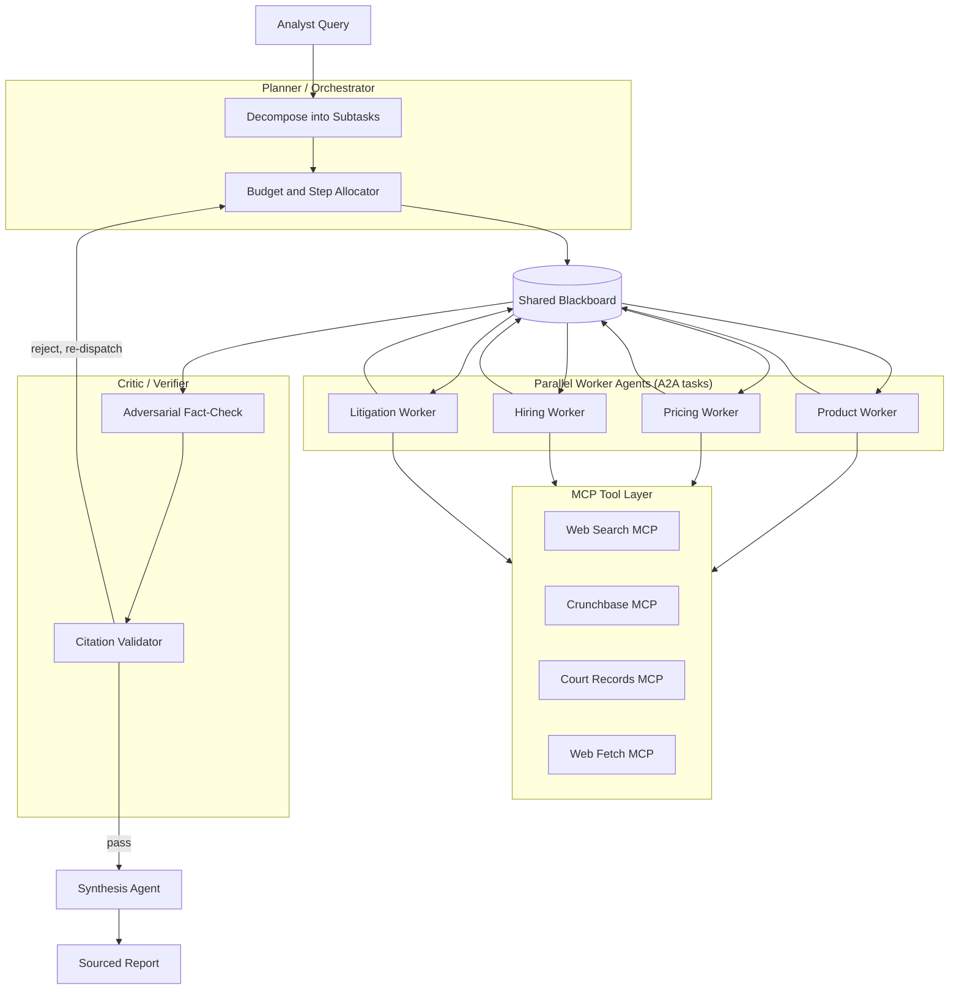
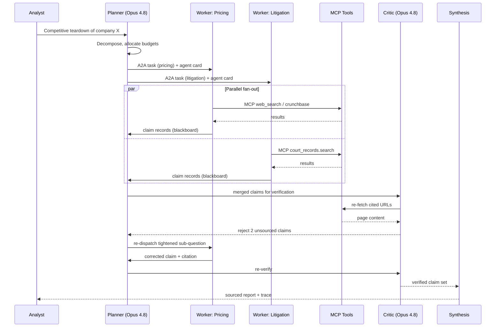

# Case Study: Multi-Agent Research and Analysis System (A2A)

A market-intelligence product answers deep due-diligence questions ("give me a competitive teardown of company X across product, pricing, hiring, and litigation") that would take an analyst 30 to 90 minutes. The system uses an orchestrator-worker-critic architecture: a planner decomposes the question, spawns parallel worker agents that each own a sub-question over A2A v1.0, and a critic verifies every claim and citation before synthesis. The hard parts are decomposition quality, parallel fan-out and merge, verification with no unsourced claims, and loop control so one query does not quietly spend $40 of tokens.

## The Business Problem

A market-intelligence startup sells "analyst-grade" reports to private-equity associates, corp-dev teams, and competitive-intelligence functions. The flagship query is the competitive teardown: pull a company apart across product surface, pricing, hiring signals, funding, and litigation, then synthesize it into a sourced brief. A human analyst does this in 30 to 90 minutes across a dozen tabs. Customers want it in under 10 minutes, every claim sourced, and they will churn the first time the report invents a lawsuit that does not exist.

A single strong agent with web search and a few tools gets you 70 percent of the way. It falls down on breadth (it runs subtopics serially and times out), on context bloat (200 search results for litigation crowd out the pricing analysis), and on verification (the same model that wrote the claim is a weak judge of it). The team moves to a multi-agent design specifically to buy parallelism, context isolation per sub-question, and an independent verification pass.

Constraints from the June 2026 reality:

- Per-query latency budget: under 10 minutes wall-clock; analysts tolerate a progress bar, not a 40-minute spinner.
- Per-query cost ceiling: $3.50 average, $8 hard cap. Multi-agent burns 4 to 15x the tokens of a single call ([Anthropic's multi-agent research write-up](https://www.anthropic.com/engineering/built-multi-agent-research-system) reports roughly 15x token usage versus chat), so cost control is the project, not an afterthought.
- Zero unsourced factual claims in the final report. Every assertion carries a citation the customer can click.
- Sources are live web plus a few licensed feeds (Crunchbase, a court-records API) reached as tools; data is never more than 24 hours stale.
- Agents must coordinate across process and vendor boundaries, so the inter-agent protocol is [A2A v1.0](https://a2a-protocol.org/) (agent cards, task delegation), while tools are reached over [MCP](https://modelcontextprotocol.io/specification/2026-03-26/).
- One ML engineer plus a part-time analyst for eval labeling; the system has to be operable, not a research project.

## Architecture

### Components

| Layer | Tech | Purpose |
|-------|------|---------|
| Planner | Claude Opus 4.8, structured output | Decompose query, allocate budget, decide when to stop |
| Workers | Claude Sonnet 4.7 (default) or DeepSeek V4 Pro (cost tier) | Own one sub-question each, drive tool calls |
| Inter-agent transport | A2A v1.0 (agent cards, task objects) | Planner delegates to workers; workers report back |
| Tool transport | MCP 2.0 (HTTP) | Agent-to-tool boundary: search, fetch, licensed feeds |
| Shared state | Redis-backed blackboard with claim records | Fan-out inputs, dedup, merge, conflict surfacing |
| Critic | Claude Opus 4.8, adversarial prompt | Reject unsourced or unsupported claims |
| Citation validator | Deterministic fetcher plus 1B NLI model | Confirm each cited URL actually supports the claim |
| Synthesis | Claude Opus 4.8 | Compose verified claims into the final brief |
| Orchestration runtime | LangGraph state machine | Step caps, retries, termination, observability |

### Data flow

1. The analyst submits a query. The planner (Opus 4.8) decomposes it into 3 to 6 typed subtasks and assigns each a token budget and a step cap drawn from a fixed total.
2. The planner writes the subtasks to the shared blackboard and dispatches each as an A2A task to a worker agent, including the agent card so the worker knows its scope and tool allowlist.
3. Each worker runs a ReAct-style loop ([Yao et al., 2022](https://arxiv.org/abs/2210.03629)) over its MCP tools, gathering evidence and writing claim records (claim text plus source URL plus snippet) back to the blackboard.
4. Workers run in parallel; the orchestrator tracks per-worker spend and kills any worker that exceeds its step cap or token budget, returning whatever it has.
5. When workers finish (or the global deadline hits), a dedup pass merges claim records and flags conflicts (two workers reporting different employee counts, for example).
6. The critic agent (Opus 4.8) reviews every claim adversarially: is it supported by the cited snippet, is the source credible, is anything asserted without a citation. Unsupported claims are rejected.
7. Rejected claims with a plausible fix are re-dispatched to a worker with a tightened sub-question and a small extra budget; claims that fail twice are dropped, not guessed.
8. The synthesis agent composes only verified claims into the final report, each sentence carrying its citation, and the full trace is logged for cost and quality auditing.

## Key Design Decisions

### 1. When a single agent beats multi-agent

Start here, because multi-agent is the wrong default for most tasks. A single Opus 4.8 agent with web search and a 1M context window handles the large majority of questions more cheaply, with lower latency, and with far less operational surface. Anthropic is explicit that their multi-agent system uses about 15x the tokens of chat and only pays off on tasks that are "breadth-first" and parallelizable ([Anthropic, 2025](https://www.anthropic.com/engineering/built-multi-agent-research-system)). Cognition makes the opposite-direction argument that naive multi-agent systems are fragile because context does not flow cleanly between agents ([Cognition, "Don't Build Multi-Agents"](https://cognition.ai/blog/dont-build-multi-agents)).

We use multi-agent here for exactly two reasons, and we can name them: parallelism (four subtopics that each need 15 to 30 tool calls finish in the time of the slowest one, not the sum) and context isolation (the litigation worker's 200 court-record snippets never pollute the pricing worker's window). A query that is deep-but-narrow ("what is company X's list price for tier 2") is routed to a single-agent fast path. The planner makes this call first: if it cannot decompose the query into genuinely independent subtasks, it does not, and we run one agent.

### 2. The A2A vs MCP boundary

These solve different problems and we keep them separate. [MCP](https://modelcontextprotocol.io/specification/2026-03-26/) is the agent-to-tool boundary: a worker calls `web_search`, `crunchbase.company`, or `court_records.search` the same standardized way regardless of who built the tool. [A2A v1.0](https://a2a-protocol.org/) is the agent-to-agent boundary: the planner delegates a task to a worker, the worker advertises its capabilities via an agent card, and results flow back as A2A task artifacts. Google's framing is that A2A complements MCP rather than replacing it ([A2A announcement](https://developers.googleblog.com/en/a2a-a-new-era-of-agent-interoperability/)).

Concretely: a worker is an A2A peer that internally speaks MCP to its tools. We do not tunnel tool calls over A2A (that would couple every tool to the agent protocol), and we do not model agents as MCP tools (that loses task lifecycle, streaming progress, and the agent card). The boundary lets us swap the litigation worker for a vendor's specialist agent over A2A without touching the tool layer.

### 3. Planner decomposition strategy and avoiding over-decomposition

The planner emits a typed plan via structured output: a list of subtasks, each with a sub-question, an assigned tool set, a token budget, and a step cap. The biggest failure is over-decomposition, splitting "pricing" into nine micro-tasks that each spin up an agent and collectively cost more than they are worth. We cap the plan at 6 subtasks and instruct the planner (Opus 4.8, which follows scope instructions closely) to prefer fewer, broader subtasks and to justify each one. Anthropic found the orchestrator under-allocating effort to be a real failure mode and fixed it by having the lead agent state explicit objectives and tool budgets per subagent ([Anthropic, 2025](https://www.anthropic.com/engineering/built-multi-agent-research-system)); we copied that pattern directly.

### 4. Parallel fan-out and result merge

Workers do not talk to each other. They read their assignment from and write claim records to a shared blackboard (Redis), the classic blackboard pattern adapted for agents. After fan-out, a merge step does three things: dedups claims by normalized claim text plus source, surfaces conflicts (two different revenue figures) instead of silently picking one, and attaches provenance to every surviving claim. Conflicts go to the critic as explicit "these disagree, adjudicate" items rather than being resolved by a coin flip. Sharing only structured claim records, not full agent transcripts, is deliberate: it keeps the merge cheap and avoids dumping one worker's 40k-token scratchpad into the next stage.

### 5. The critic/verifier loop

A separate critic is the single highest-leverage component. The model that wrote a claim is a poor judge of it, so the critic is a fresh Opus 4.8 context with an adversarial prompt: assume each claim is wrong until the cited snippet proves it. This is LLM-as-judge ([Zheng et al., 2023](https://arxiv.org/abs/2306.05685)) pointed at verification, combined with Reflexion-style iterate-on-feedback ([Shinn et al., 2023](https://arxiv.org/abs/2303.11366)). Two checks run: the LLM critic judges whether the snippet supports the claim, and a deterministic citation validator re-fetches the URL and runs a small NLI model to confirm the snippet is actually on the page and entails the claim. A claim with no citation is rejected outright, never softened. Rejected-but-fixable claims get one re-dispatch with a tighter sub-question; a second failure drops the claim. The output contract is blunt: no citation, no claim.

### 6. Loop control and budgets (loopmaxxing controls)

Without hard limits a multi-agent system will "loopmaxx", spawning workers and tool calls until it burns the cost ceiling. Controls, all enforced by the LangGraph runtime ([loop engineering](../07-agentic-systems/12-loop-engineering.md)):

- A global token budget per query (default 600k input-equivalent tokens), divided among the planner, workers, critic, and synthesis.
- A per-worker step cap (default 12 tool calls) and per-worker token budget; exceed either and the worker is terminated with partial results.
- A per-worker wall-clock timeout (default 90 seconds) so one slow worker cannot stall the task.
- Explicit termination criteria: stop when all subtasks report done, when the global deadline hits, or when marginal new claims per dollar falls below a threshold.
- A spend meter that pages if a single query crosses $8.

These are the difference between a $3.50 average query and a $40 surprise.

### 7. Model tiering to control the token multiplier

The token multiplier is the cost story, so we tier models by role. The planner and critic run Opus 4.8 ($5 / $25 per 1M, [pricing](https://www.anthropic.com/pricing)) because plan quality and verification rigor set the ceiling on the whole system. Workers run Sonnet 4.7 by default, and for high-fan-out queries the cost-sensitive subtasks (broad web sweeps) drop to DeepSeek V4 Pro ($0.435 / $0.87 per 1M, [DeepSeek API pricing](https://api-docs.deepseek.com/quick_start/pricing)) or DeepSeek V4 Flash ($0.14 / $0.28). A four-worker query with Opus everywhere costs roughly 4x a tiered query for no measurable quality gain on evidence gathering; we put the expensive model only where judgment lives.

### 8. Shared state and message-passing design

A2A messages between planner and workers carry task assignments and status, not bulk evidence. Evidence lives on the blackboard and is referenced by ID. This separation matters: A2A task payloads stay small (fast, cheap, debuggable), and the blackboard is the one place evidence accumulates, so dedup and provenance have a single source of truth. Workers stream progress events over A2A so the analyst's progress bar is real, not a fake animation. The blackboard is namespaced per query and TTL'd, so a finished query's state does not linger.

### 9. Evaluating a multi-agent system

We track three end-to-end metrics, not per-agent vanity numbers. Task success is graded by an LLM judge plus a weekly 50-case human audit against an analyst-written gold report: did the brief answer the question and is it correct. Citation precision is the fraction of claims whose citation genuinely supports them, measured by the deterministic validator on every query (target over 97 percent). Cost per task is the all-in token spend, tracked per query and alerted on drift. Anthropic's guidance that multi-agent evals need outcome-based, end-to-end grading rather than step-by-step rubrics ([Anthropic, 2025](https://www.anthropic.com/engineering/built-multi-agent-research-system)) is exactly right; the system has too many valid trajectories to score by trajectory.

## Failure Modes and Mitigations

### F1: Runaway loop and token blowup

Workers keep spawning tool calls; the planner keeps re-dispatching; spend rockets past the ceiling. Mitigation: hard per-query token budget, per-worker step caps and token budgets, a re-dispatch cap of one per claim, and a spend meter that kills the query and pages at $8. The budget is enforced by the runtime, not requested politely in a prompt.

### F2: Planner over-decomposes into nonsense subtasks

The planner splits the query into nine hyper-specific micro-tasks, each spinning up a worker, collectively expensive and incoherent. Mitigation: cap the plan at 6 subtasks, instruct the planner to prefer fewer broader subtasks and justify each, and validate the structured plan against a schema that rejects empty or duplicative sub-questions before any worker is dispatched.

### F3: Workers duplicate work

Two workers independently run the same web searches because their sub-questions overlapped. Mitigation: the planner assigns disjoint scopes with explicit "you own X, not Y" boundaries; the blackboard dedups claims by normalized text plus source so duplicate evidence collapses; a pre-dispatch overlap check flags subtasks with high lexical overlap for the planner to merge.

### F4: Agents disagree and the system stalls

Two workers report conflicting facts and there is no mechanism to resolve it, so the report either stalls or emits both. Mitigation: workers never adjudicate; conflicts are surfaced at merge as explicit items and handed to the critic, which adjudicates against the cited sources and picks the better-supported claim or reports the disagreement honestly in the brief. There is no negotiation loop between workers to deadlock on.

### F5: A worker hallucinates a citation the critic misses

A worker invents a plausible URL or attributes a real claim to the wrong page, and the LLM critic waves it through. Mitigation: the deterministic citation validator is the backstop, it re-fetches every cited URL and runs an NLI check that the snippet exists on the page and entails the claim. The LLM critic and the deterministic validator are independent layers; a fabricated citation fails the fetch even if it fools the judge.

### F6: One slow worker stalls the whole task

The litigation worker hits a slow court-records API and the entire query waits on it past the deadline. Mitigation: per-worker wall-clock timeout (90s default), parallel execution so the slow worker does not block the others, and graceful degradation, the synthesis proceeds with the workers that finished and the report notes the litigation section is incomplete rather than blocking.

### F7: Shared scratchpad becomes a context-bloat problem

The blackboard accumulates full worker transcripts and the merge and critic stages choke on 200k tokens of raw scratchpad. Mitigation: workers write only structured claim records (claim, source, snippet), never their reasoning transcripts; the blackboard stores evidence by reference; downstream stages read claim records, not transcripts. Context isolation is the whole point of going multi-agent, and we protect it.

### F8: Cascading failure when the planner picks a bad plan

A weak initial decomposition dooms every downstream worker, and the system spends the full budget producing a coherent answer to the wrong question. Mitigation: a lightweight plan-quality gate (does the plan cover the query's named dimensions) runs before dispatch; the synthesis step checks coverage against the original query and can trigger one re-plan if a whole dimension is missing; the weekly human audit catches systematic planner drift so the planner prompt gets retuned.

## Operational Considerations

### Monitoring

| SLO | Target |
|-----|--------|
| Query wall-clock p95 | under 10 minutes |
| Citation precision (validator) | over 97 percent |
| End-to-end task success (LLM judge plus human audit) | over 85 percent |
| Cost per query (mean) | under $3.50 |
| Per-query runaway-spend incidents | under 1 per week |
| Worker timeout rate | under 5 percent of workers |

### Cost model

At about 8,000 paid queries per month:

- Planner plus critic plus synthesis (Opus 4.8): $14,000 per month
- Workers (Sonnet 4.7 default, DeepSeek V4 for high-fan-out): $9,000 per month
- Licensed feeds (Crunchbase, court records) via MCP: $4,500 per month
- Citation validator (fetch plus 1B NLI): $600 per month
- Orchestration, blackboard, observability infra: $1,900 per month
- Eval and human audit: $1,500 per month
- Total: ~$31,500 per month, about $3.94 per query

The headline number to internalize: a multi-agent query burns 4 to 15x the tokens of a single LLM call. The tiering in Decision 7 is what keeps the mean under $3.50; without it the same workload runs closer to $9 per query. An analyst-hour costs far more than $3.94, so the unit economics hold as long as the multiplier stays bounded.

### On-call playbook

- Runaway spend alert ($8 query): the runtime already killed the query; confirm the kill fired, inspect the trace for which agent looped, and tighten that worker's step cap if it is systemic.
- Citation precision drop below 97 percent: freeze synthesis to a stricter "drop on any doubt" mode, check whether a source site changed layout (breaking the NLI validator), and re-run the affected queries.
- Latency spike: check the slowest worker's tool (usually a degraded MCP feed); route to backup feed if available, or let graceful degradation ship a partial report with the gap flagged.
- Planner drift (coverage misses rising): pull the last 20 plans, compare against the query dimensions, and retune the planner prompt or schema; do not patch with more worker budget.
- MCP feed outage: surface "source unavailable" in the report rather than letting a worker hallucinate around the gap; the no-citation-no-claim contract makes this safe by default.
- Conflict-rate spike: if the critic is adjudicating far more conflicts than usual, a source is likely wrong or stale; investigate the feed before trusting the adjudications.

## What Strong Interview Candidates Cover

- They lead with when NOT to use multi-agent: most tasks are better served by one strong agent with tools, and they justify this system specifically by parallelism and context isolation, citing the roughly 15x token multiplier.
- They draw the A2A vs MCP boundary cleanly: A2A for agent-to-agent delegation and agent cards, MCP for agent-to-tool calls, and they refuse to conflate the two.
- They treat the critic as the highest-leverage component and explain why a fresh adversarial context plus a deterministic citation validator beats self-review, referencing LLM-as-judge and Reflexion.
- They name concrete loop controls (per-query token budget, per-worker step caps, timeouts, termination criteria, spend kill switch) and tie them to a real dollar ceiling.
- They tier models by role (Opus for planner and critic, Sonnet or DeepSeek for workers) and can do the cost arithmetic on the multiplier.
- They evaluate end-to-end (task success, citation precision, cost per task) rather than scoring individual agent steps, and they keep a human audit in the loop.
- They design fan-out and merge around structured claim records and a blackboard, not full-transcript sharing, and they handle conflicts explicitly instead of coin-flipping.

## References

- Anthropic, [How we built our multi-agent research system](https://www.anthropic.com/engineering/built-multi-agent-research-system)
- Google, [A2A: A new era of agent interoperability](https://developers.googleblog.com/en/a2a-a-new-era-of-agent-interoperability/)
- [A2A Protocol specification](https://a2a-protocol.org/)
- [Model Context Protocol specification 2026-03-26](https://modelcontextprotocol.io/specification/2026-03-26/)
- Yao et al., [ReAct: Synergizing Reasoning and Acting in Language Models](https://arxiv.org/abs/2210.03629)
- Shinn et al., [Reflexion: Language Agents with Verbal Reinforcement Learning](https://arxiv.org/abs/2303.11366)
- Zheng et al., [Judging LLM-as-a-Judge with MT-Bench and Chatbot Arena](https://arxiv.org/abs/2306.05685)
- Cognition, [Don't Build Multi-Agents](https://cognition.ai/blog/dont-build-multi-agents)
- LangChain, [LangGraph for agent orchestration](https://langchain-ai.github.io/langgraph/)
- Microsoft, [AutoGen multi-agent framework](https://microsoft.github.io/autogen/)
- Anthropic, [Model pricing](https://www.anthropic.com/pricing)
- DeepSeek, [API pricing](https://api-docs.deepseek.com/quick_start/pricing)

Related chapters: [Multi-Agent Orchestration](../07-agentic-systems/04-multi-agent-orchestration.md), [Tool Use and MCP](../07-agentic-systems/03-tool-use-and-mcp.md), [Loop Engineering](../07-agentic-systems/12-loop-engineering.md).
