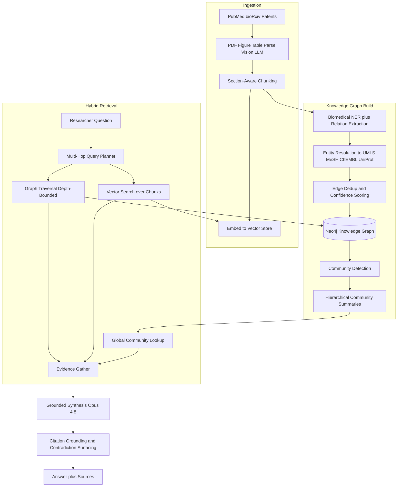
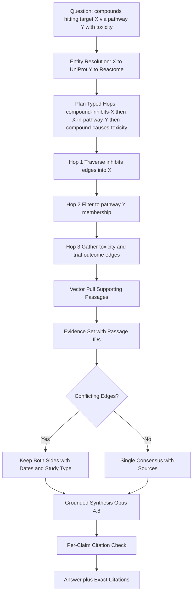

# Case Study: GraphRAG over Scientific Literature for Drug Discovery

A biotech research platform builds GraphRAG over roughly 30 million papers, patents, and preprints so researchers can ask multi-hop questions like "which compounds modulate target protein X through pathway Y, and what toxicities or failed trials are reported." Plain vector RAG fails here because the answer lives in a chain of typed relationships (compound to target to pathway to disease to trial outcome) that no single chunk contains, and because researchers will not act on a claim without an exact citation back to the source passage.

## The Business Problem

A drug-discovery team at a mid-size biotech burns months on manual literature review. A medicinal chemist investigating a kinase target needs to know: what compounds are known to hit it, through which pathways, what off-target toxicity has been reported, and which clinical trials failed and why. That answer is scattered across PubMed abstracts, bioRxiv preprints, full-text PDFs behind figures and tables, and patent filings. A single question can take a research associate two to three weeks, and the answer is stale the day after they finish because thousands of new papers publish daily.

The team builds GraphRAG: extract entities and typed relations from the corpus into a knowledge graph, normalize entities to canonical biomedical ontologies, and answer questions by traversing the graph plus vector search over the underlying passages. The goal is to turn a three-week literature review into a three-minute grounded answer with citations a chemist will trust.

Constraints from the June 2026 reality:

- Corpus is ~30M documents (PubMed abstracts, bioRxiv/medRxiv preprints, full-text PDFs, USPTO and EPO patent corpora), growing by ~4,000 documents per day
- Answers must carry exact citations to source passages; an unsourced claim is worthless to a chemist and a liability in a regulatory filing
- The same biological entity has dozens of surface forms (the gene `ERBB2` is also `HER2`, `NEU`, `CD340`, `p185`); entity resolution is the whole ballgame
- Literature openly contradicts itself; the system must surface both sides, not average them into a false consensus
- Extraction at 30M-document scale cannot run on a frontier model per document; the per-token cost would be prohibitive
- Retractions and trial failures must propagate fast; a stale graph that still asserts a retracted finding is worse than no answer

The team picks the Microsoft GraphRAG approach ([Edge et al., 2024](https://arxiv.org/abs/2404.16130), [GraphRAG repo](https://github.com/microsoft/graphrag)) for community detection and hierarchical summarization, Neo4j ([docs](https://neo4j.com/docs/)) as the graph store, and normalizes every entity to UMLS, MeSH, ChEMBL, and UniProt. Extraction runs on a cheaper model (DeepSeek V4 Flash, [docs](https://api-docs.deepseek.com/)) at corpus scale; final synthesis runs on Claude Opus 4.8 ([model card](https://www.anthropic.com/claude/opus)) where reasoning quality and citation discipline matter most.

## Architecture

### Components

| Layer | Tech | Purpose |
|-------|------|---------|
| Document parsing | Vision LLM (Gemini 3.1 Pro) plus GROBID for layout | Extract text, figures, tables from PDFs |
| Chunking and embeddings | Section-aware splitter, voyage-3 embeddings | Vector recall over passages |
| Entity and relation extraction | Fine-tuned BioBERT NER plus DeepSeek V4 Flash for relations | Cheap extraction at corpus scale |
| Entity resolution | UMLS Metathesaurus, MeSH, ChEMBL, UniProt linkers | Normalize surface forms to canonical IDs |
| Graph store | Neo4j with APOC and GDS | Typed multi-hop traversal |
| Community layer | Leiden detection plus hierarchical summaries | Global questions (Microsoft GraphRAG) |
| Query planner | Opus 4.8 with structured tool calls | Decompose multi-hop questions |
| Synthesis | Claude Opus 4.8 | Grounded answer with citations |

### Data flow

1. New documents land hourly; the parser uses a vision LLM plus GROBID to recover text, figure captions, and table cells from PDFs that text-only extraction would miss.
2. Each document is split into section-aware chunks, embedded, and written to the vector store with a stable passage ID.
3. The extraction stage runs biomedical NER (fine-tuned BioBERT) to find entities, then DeepSeek V4 Flash to extract typed relations between them (for example `inhibits`, `upregulates`, `causes_toxicity`).
4. Entity resolution maps each surface form to a canonical ID: genes/proteins to UniProt, drugs to ChEMBL, concepts to UMLS/MeSH; unresolved entities are quarantined rather than merged.
5. Edges are deduplicated, each carries a confidence score and a back-pointer to the exact source passage; the graph is written to Neo4j.
6. Leiden community detection groups densely connected entities; an LLM writes a hierarchical summary per community for global "what is the state of the field" questions.
7. At query time, the planner decomposes the question into graph hops plus vector subqueries, traverses Neo4j with a bounded depth, and gathers passages from both graph edges and vector search.
8. Opus 4.8 synthesizes the answer, grounds every claim to a passage ID, and surfaces contradictions as explicit conflicting-evidence blocks rather than collapsing them.

## Key Design Decisions

### 1. Why plain vector RAG fails here

Vector RAG retrieves the top-k chunks most similar to the query and stuffs them into the prompt. That works when the answer sits inside a chunk. It fails for this domain on three counts. First, multi-hop: "compounds that hit target X through pathway Y with reported toxicity" requires joining `compound -> target -> pathway -> disease -> trial`, and no single chunk states the whole chain. Second, relationship typing: vector similarity finds passages that mention a compound and a protein together, but it cannot tell `inhibits` from `is_inhibited_by` from `unrelated_to`, and direction is the entire clinical meaning. Third, global questions: "what is the consensus on mechanism Z across the literature" needs aggregation over thousands of documents, which top-k retrieval structurally cannot do (this is the failure the Microsoft GraphRAG paper ([Edge et al., 2024](https://arxiv.org/abs/2404.16130)) was written to address). A graph encodes the relationships explicitly so traversal can answer what similarity cannot.

### 2. The KG construction pipeline and the noise problem

Construction is extraction, then normalization, then dedup, and noise enters at every step. Scientific text is dense with hedged claims ("X may modulate Y under hypoxic conditions"), negations ("X did not inhibit Y"), and speculation. Naive extraction turns "did not inhibit" into an `inhibits` edge, which is a confident lie. We run NER first (BioBERT, fine-tuned on biomedical corpora) to anchor entities, then a relation-extraction pass on DeepSeek V4 Flash that is prompted to capture polarity and modality, emitting `{subject, relation, object, polarity, confidence, passage_id}`. Edges below a confidence floor are kept but flagged low-trust rather than discarded, because recall matters for exploratory research. We never let extraction write an edge without a passage back-pointer; an edge with no provenance is dropped.

### 3. Entity resolution to canonical ontologies

This is the make-or-break decision. `HER2`, `ERBB2`, `NEU`, `CD340`, and `p185` are the same gene; if they live as five nodes the graph is shattered and traversal misses two-thirds of the evidence. We normalize every extracted entity to a canonical ID: proteins and genes to UniProt ([uniprot.org](https://www.uniprot.org/)) and the HGNC symbol, drugs and compounds to ChEMBL ([chembl](https://www.ebi.ac.uk/chembl/)), and general biomedical concepts to UMLS ([UMLS](https://www.nlm.nih.gov/research/umls/index.html)) and MeSH ([MeSH](https://www.nlm.nih.gov/mesh/meshhome.html)). The linker uses scispaCy ([scispaCy](https://allenai.github.io/scispacy/)) candidate generation plus an embedding reranker, with an abstention threshold. Critically, when the linker is not confident, it does not guess; an ambiguous mention becomes its own provisional node flagged for review rather than being merged into the wrong canonical entity. A wrong merge is far more damaging than a missed merge.

### 4. Hybrid graph plus vector retrieval

Graph and vector solve different problems, so we run both. The graph is precise about structure: it answers "what inhibits this kinase" by following typed edges, with exact direction and provenance. Vector search is forgiving about phrasing: it recalls passages that describe a mechanism in language the extractor never turned into an edge, which catches the long tail the graph missed. The planner uses the graph to find the relevant entity neighborhood, then vector search to pull supporting passages around those entities, then merges and reranks. This is the HippoRAG intuition ([Gutierrez et al., 2024](https://arxiv.org/abs/2405.14831)) of combining graph structure with dense recall, and it consistently beats either alone on our multi-hop eval set.

### 5. Community detection and hierarchical summaries for global questions

Local traversal answers specific questions. "What is the overall state of research on a target class" is a global question that no local neighborhood covers. Following Microsoft GraphRAG, we run Leiden community detection over the graph, then have an LLM write a summary for each community and roll those up into a hierarchy. A global question routes to the top of the hierarchy and drills down, so the model reasons over pre-summarized clusters instead of trying to read thirty thousand passages. We refresh community summaries on a slower cadence (weekly) than the graph itself because they are expensive to regenerate and global structure moves slowly.

### 6. Multi-hop query planning and traversal depth control

Unbounded traversal is a combinatorial bomb: a three-hop query from a well-connected hub like `TP53` can touch hundreds of thousands of nodes. The planner (Opus 4.8) decomposes the question into a typed traversal plan with an explicit depth bound (default 3 hops) and a per-hop fan-out cap. We prune aggressively using edge confidence and relation-type filters so a query about inhibition does not wander down `co-mentioned-with` edges. If a plan would exceed a node budget, the planner narrows the relation types or asks the researcher to constrain the question rather than running a query that costs $40 and times out.

### 7. Citation grounding and provenance to source passages

A chemist will not trust an unsourced claim, and rightly so. Every edge carries a `passage_id` to the exact sentence it came from, and synthesis is constrained to ground each statement in a retrieved passage. The output renders inline citations that link to the source paper and the highlighted span. We run a post-synthesis verification pass that checks each cited passage actually supports the claim; if a sentence has no supporting passage, it is cut, not shipped. This is the discipline that separates a research tool from a plausible-sounding hallucination engine.

### 8. Surfacing contradictions instead of averaging them

The literature disagrees constantly: one 2019 paper reports a compound is safe, a 2023 paper reports hepatotoxicity. Averaging these into "possibly some toxicity" is the worst possible answer. When the graph holds conflicting edges between the same entities (opposite polarity, or contradictory outcomes), synthesis surfaces both with their evidence, dates, sample sizes, and study types, and lets the researcher judge. We explicitly weight recency and retraction status but never silently drop the minority view; the conflict itself is signal.

### 9. Incremental freshness and the KG-rebuild cost

Four thousand documents a day means a full rebuild is never acceptable; a from-scratch rebuild of the 30M-document graph runs five to six figures in compute and days of wall-clock. Instead we ingest incrementally: new documents flow through extraction and entity resolution and write new nodes and edges without touching the rest of the graph. Community summaries are recomputed only for communities whose membership changed materially. Retractions are a special fast path: a retraction notice flips affected edges to a `retracted` state within the hour so synthesis can down-weight or exclude them immediately.

## Failure Modes and Mitigations

### F1: Extraction creates a false edge

The relation extractor reads "X did not inhibit Y" and writes an `inhibits` edge, asserting the opposite of the truth. Mitigation: the extraction prompt captures polarity and modality explicitly; a negation-and-hedge classifier runs as a second pass; low-confidence edges are flagged low-trust and excluded from high-stakes synthesis; we audit a random sample of new edges weekly against source passages and track extraction precision (currently ~91 percent, target over 90).

### F2: Entity resolution merges two distinct proteins

The linker collapses two different proteins that share a surface form into one node, and now every downstream traversal mixes their evidence. Mitigation: an abstention threshold means ambiguous mentions become provisional nodes instead of forced merges; merges are reversible and logged; we keep a curated blocklist of known-ambiguous symbols that always require human confirmation before merging.

### F3: Multi-hop traversal explodes combinatorially

A query from a hub node fans out to hundreds of thousands of nodes, the query times out, and the cost spikes. Mitigation: depth bound (default 3), per-hop fan-out cap, relation-type pruning, and a node budget that aborts the plan and asks the researcher to narrow scope rather than running a runaway query. We alarm on any query touching more than 50,000 nodes.

### F4: Stale graph misses a retraction

A paper is retracted but the graph still asserts its findings, and the system confidently cites discredited science. Mitigation: a retraction fast-path ingests Retraction Watch and PubMed retraction notices hourly and flips affected edges to `retracted` within the hour; synthesis excludes retracted edges by default and flags any answer that would have depended on one.

### F5: Contradictory findings collapsed into a false consensus

The system picks one side of a genuine scientific disagreement and presents it as settled fact. Mitigation: contradiction detection on opposite-polarity and conflicting-outcome edges between the same entities (Key Design Decision 8); the synthesizer is required to surface both sides with dates, study types, and sample sizes; we eval specifically for "did we hide a known contradiction" on a labeled controversy set.

### F6: Hallucinated citation

The model invents a citation or attaches a real citation to a claim the passage does not support. Mitigation: synthesis can only cite passage IDs that were actually retrieved; a post-synthesis verifier checks each claim against its cited passage and cuts any unsupported sentence; citations render as live links to the source span so a reviewer can spot-check in one click. This is the same grounding rigor RAG faithfulness work calls for.

### F7: Figure and table data missed by text-only ingest

A key dose-response result lives only in a figure or a table, and a text-only parser never sees it, so the graph is silently incomplete. Mitigation: the ingestion pipeline uses a vision LLM to parse figures, figure captions, and table cells (the long-context limitation motivating richer ingestion is documented in Lost in the Middle, [Liu et al., 2023](https://arxiv.org/abs/2307.03172)); table cells become structured edges; we sample documents to measure figure/table extraction coverage and treat a coverage drop as a pipeline regression.

### F8: KG rebuild downtime

A schema change or a re-extraction forces a graph rebuild and the service goes dark for hours. Mitigation: incremental updates are the default so full rebuilds are rare; when a rebuild is unavoidable we build into a shadow graph and cut over atomically with a read alias, so researchers never see downtime; the shadow build is validated against the live graph on a canary query set before cutover.

## Operational Considerations

### Monitoring

| SLO | Target |
|-----|--------|
| Query p95 latency (multi-hop) | under 8 s |
| Extraction precision (sampled weekly) | over 90 percent |
| Entity resolution accuracy (sampled) | over 95 percent on linked mentions |
| Citation faithfulness (every claim grounded) | over 99 percent |
| Retraction propagation lag | under 1 hour |
| Ingestion freshness (publish to queryable) | under 6 hours |

### Cost model

Steady state on a ~30M-document graph:

- Initial KG build (one-time, extraction plus resolution plus community summaries): ~$180K compute
- Incremental ingestion (~4,000 docs/day, extraction on DeepSeek V4 Flash): ~$6,500 per month
- Neo4j hosting (graph plus GDS, large instance): ~$9,000 per month
- Vector store and embeddings refresh: ~$3,500 per month
- Community summary regeneration (weekly): ~$2,000 per month
- Synthesis (Opus 4.8 on researcher queries): ~$5,000 per month at current volume
- Total run-rate: ~$26,000 per month, roughly $0.45 to $1.20 per multi-hop query depending on traversal depth

Set against research-associate time at two to three weeks per deep literature question, a single answered question pays for weeks of platform cost.

### On-call playbook

- Extraction precision drop: pause writing new edges, sample the offending document class against source passages, roll back the bad batch, retrain or re-prompt the extractor before resuming.
- Runaway query / cost spike: kill queries over the node budget, tighten the fan-out cap, identify the hub node and add it to the high-cost watchlist.
- Retraction lag alarm: verify the retraction feed is flowing; if stalled, run the retraction sweep manually and exclude the affected edges immediately.
- Entity-resolution incident (bad merge reported): unmerge via the reversible-merge log, add the symbol to the human-confirm blocklist, re-run resolution for the affected neighborhood.
- Ingestion backlog: scale extraction workers; if the vision parser is the bottleneck, shed to text-only with a coverage flag rather than letting freshness slip past the SLO.
- Rebuild required: build into the shadow graph, validate on the canary query set, cut over the read alias atomically, keep the old graph hot for fast rollback.

## What Strong Interview Candidates Cover

- They explain precisely why plain vector RAG fails (multi-hop chains, relationship typing and direction, global aggregation) rather than just asserting "graphs are better."
- They treat entity resolution to canonical ontologies (UniProt, ChEMBL, UMLS, MeSH) as the central risk, and argue that a wrong merge is worse than a missed merge.
- They combine graph traversal with vector recall and articulate what each contributes, citing GraphRAG and HippoRAG by name.
- They control combinatorial blowup with depth bounds, fan-out caps, relation pruning, and node budgets, and they put a dollar figure on a runaway query.
- They make citation grounding non-negotiable: every claim back-pointed to a passage, with a verification pass that cuts unsupported sentences.
- They surface contradictions with dates and study types instead of averaging them, and they handle retractions on a fast path.
- They size the build versus run cost honestly and design incremental ingestion plus shadow-graph cutover so freshness never forces downtime.

## References

- Edge et al., [From Local to Global: A Graph RAG Approach to Query-Focused Summarization](https://arxiv.org/abs/2404.16130)
- Microsoft, [GraphRAG repository](https://github.com/microsoft/graphrag)
- Gutierrez et al., [HippoRAG: Neurobiologically Inspired Long-Term Memory for LLMs](https://arxiv.org/abs/2405.14831)
- Liu et al., [Lost in the Middle: How Language Models Use Long Contexts](https://arxiv.org/abs/2307.03172)
- [Neo4j documentation](https://neo4j.com/docs/)
- [UMLS Metathesaurus](https://www.nlm.nih.gov/research/umls/index.html)
- [Medical Subject Headings (MeSH)](https://www.nlm.nih.gov/mesh/meshhome.html)
- [ChEMBL database](https://www.ebi.ac.uk/chembl/)
- [UniProt](https://www.uniprot.org/)
- [scispaCy: biomedical NER and entity linking](https://allenai.github.io/scispacy/)
- Lee et al., [BioBERT: a pre-trained biomedical language representation model](https://arxiv.org/abs/1901.08746)
- [Retraction Watch database](https://retractionwatch.com/)

Related chapters: [GraphRAG](../06-retrieval-systems/07-graph-rag.md), [Agentic RAG](../06-retrieval-systems/08-agentic-rag.md), [Data Engineering for AI](../06-retrieval-systems/15-data-engineering-for-ai.md).
