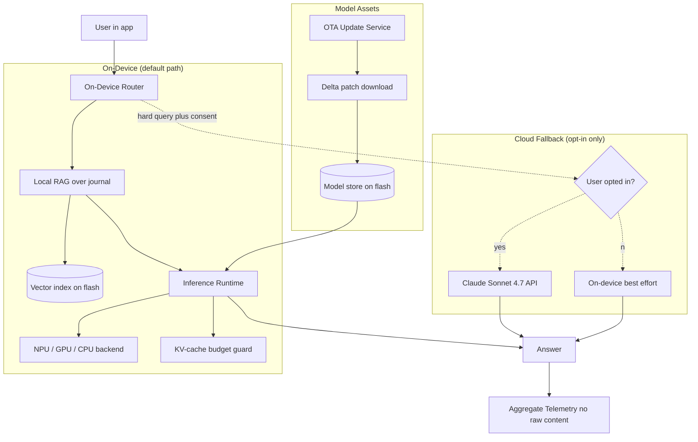
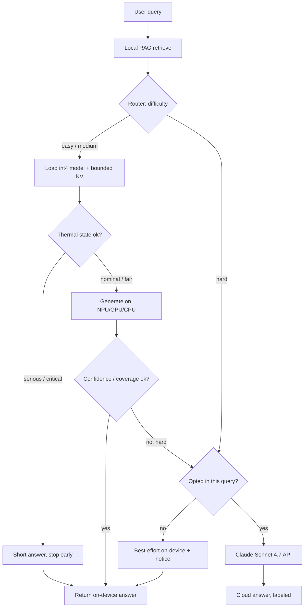

# Case Study: On-Device AI Assistant for a Privacy-First Mobile App

A consumer health-journaling app with ~5M installs ships an on-device AI assistant so that user data never leaves the phone, the feature works on a plane with no signal, and there is zero per-query cloud cost. It runs a quantized small model in GGUF int4 through llama.cpp and Core ML, with an optional cloud fallback to a frontier model only for hard queries when the user explicitly opts in.

## The Business Problem

The app lets users journal symptoms, mood, sleep, and medication notes. The product team wants an assistant that can summarize "how has my sleep trended this month", draft a doctor-visit prep note from the last 90 days, and answer "did I log a headache after the new med". The data is intimate, much of it arguably health data under GDPR Article 9 and the kind of thing users delete the app over if it leaks. The privacy team's hard line: by default, raw journal content must never leave the device. That rules out the default architecture (ship every prompt to a cloud API) and forces the assistant onto the phone, with all the constraints that implies.

Constraints from the June 2026 reality:

- ~5M installs across a long tail of devices: the median Android phone in the install base has 6 GB RAM and a 3-year-old SoC, not a flagship with an NPU
- Privacy default is on-device; cloud fallback is opt-in per query and must be unmistakable, because the whole brand promise is "your journal stays on your phone"
- The feature must work fully offline, so a server round trip cannot be on the hot path
- Per-query cloud cost must be near zero at this scale: 5M users at even a few queries a day on a frontier API would be a six-figure monthly bill the free tier cannot absorb
- App Store and Play Store reviewers punish battery drain and large app sizes; a 4 GB model cannot ride along in the binary
- iOS and Android diverge hard on the acceleration stack (Apple Neural Engine via Core ML versus Qualcomm Hexagon via QNN and Android NNAPI), so "the model runs fast" is two different engineering problems

The team picks a quantized small model running locally. The base is [Gemma 4 2B](https://ai.google.dev/gemma) for the broad device tail and a [Gemma 4 9B](https://ai.google.dev/gemma) variant gated to phones with 12 GB or more RAM, both in GGUF int4. The runtime is [llama.cpp](https://github.com/ggml-org/llama.cpp) on Android (with NNAPI/QNN offload where present) and [Core ML](https://developer.apple.com/documentation/coreml) plus [Apple Foundation Models](https://developer.apple.com/documentation/foundationmodels) on iOS. The cloud fallback, when a user opts in, goes to Claude Sonnet 4.7 via the API.

## Architecture

### Components

| Layer | Tech | Purpose |
|-------|------|---------|
| On-device model | [Gemma 4 2B / 9B](https://ai.google.dev/gemma), GGUF int4 | Local generation with no network |
| Runtime (Android) | [llama.cpp](https://github.com/ggml-org/llama.cpp), [MLC LLM](https://llm.mlc.ai/) evaluated | Portable GGUF inference plus NPU offload |
| Runtime (iOS) | [Core ML](https://developer.apple.com/documentation/coreml) plus [Foundation Models](https://developer.apple.com/documentation/foundationmodels) | ANE-accelerated inference |
| Acceleration | [Apple Neural Engine](https://developer.apple.com/documentation/coreml), [Qualcomm QNN/Hexagon](https://www.qualcomm.com/developer/software/qualcomm-ai-engine-direct-sdk), [Android NNAPI](https://developer.android.com/ndk/guides/neuralnetworks) | Offload matmuls off the CPU |
| Local RAG | small embedding model plus on-flash vector index | Ground answers in the user's own journal |
| Router | on-device heuristic classifier | Decide on-device vs opt-in cloud |
| Cloud fallback | Claude Sonnet 4.7 via [API](https://docs.anthropic.com/en/api/overview) | Hard queries, only with consent |
| OTA updates | delta/patch download service plus [staged rollout](https://developer.android.com/guide/playcore/in-app-updates) | Ship new weights without a 4 GB app update |
| Telemetry | aggregate counters, no raw text | Privacy-preserving eval and ops |

### Data flow

1. The user asks a question in the app. The router runs entirely on-device and never blocks on the network.
2. Local RAG retrieves the relevant journal entries from the on-flash vector index, embedding the query with a small on-device embedding model.
3. The router classifies difficulty. Easy and medium queries (summaries, trend lookups, retrieval-grounded answers) stay on-device.
4. The runtime loads the quantized model from the model store, allocates a bounded KV cache, and generates, offloading to the NPU or GPU backend when the device exposes one and falling back to CPU when it does not.
5. If the router flags the query as hard (multi-step reasoning, long synthesis the small model fails) it checks the per-query cloud-consent state. With no consent, it degrades to a best-effort on-device answer and tells the user.
6. With explicit per-query consent, the redacted query plus a minimal context window is sent to Claude Sonnet 4.7; the response returns and is rendered with a clear "answered in the cloud" marker.
7. The answer renders. The OTA service checks in the background for a new model revision and, if present, downloads only the delta patch against the installed weights.
8. The app emits aggregate telemetry only: latency buckets, tokens/sec, fallback rate, thumbs up/down, battery class. No journal content, no prompts, and no completions ever leave the device through telemetry.

## Key Design Decisions

### 1. Model sizing for mobile RAM, not benchmark scores

The binding constraint is not quality, it is what fits in RAM alongside the OS, the app, and a usable KV cache. On a 6 GB Android phone the OS and other apps routinely hold 3.5 to 4.5 GB, and Android's low-memory killer reaps the foreground app well before RAM hits zero. A [Gemma 4 2B](https://ai.google.dev/gemma) in int4 is roughly 1.4 to 1.6 GB of weights, which leaves headroom for a few thousand tokens of KV cache and the app itself. A 9B int4 is ~5 GB of weights, which is a non-starter on 6 GB and only safe on 12 GB-plus devices. So we ship 2B as the universal default and gate 9B to high-RAM phones detected at runtime. The lesson from [llama.cpp's mobile guidance](https://github.com/ggml-org/llama.cpp/discussions) and the broader edge community is that you size to the worst common device, not the flagship in the demo.

### 2. Quantization: int4 GGUF, and where the quality actually breaks

We quantize to 4-bit (GGUF `Q4_K_M`) because that is the knee of the curve: it cuts weight memory ~4x versus FP16 and is the difference between fitting and not fitting on the device tail. The quality cost is real but task-dependent. On our golden set, int4 Gemma 4 2B loses ~0.5 to 1.0 points versus the FP16 2B on summarization and retrieval-grounded answers, which users do not notice, but it loses noticeably more on multi-step arithmetic over many entries, which is exactly the class we route to cloud fallback. The technique behind acceptable 4-bit weights is activation-aware quantization ([AWQ, arXiv 2306.00978](https://arxiv.org/abs/2306.00978)); GGUF's k-quants implement a similar protect-the-salient-weights idea. We do not go below 4-bit on the 2B: 3-bit and 2-bit save memory but the quality cliff on this model size is steep enough that the feature stops being trustworthy.

### 3. The on-device vs cloud-fallback boundary

This is the decision the whole brand rests on. The default is on-device for everything, no exceptions, no silent network calls. The router only proposes cloud fallback when (a) the query is classified hard and (b) the on-device draft fails an internal confidence/coverage check. Even then, nothing leaves the phone without an explicit, per-query consent tap that names the destination ("Send this question to the cloud to get a better answer? Your journal entries for this query will be sent"). Consent is per query, not a global toggle, because a one-time "allow cloud" switch is exactly how users get surprised. The economic shape matters too: keeping the default on-device is what makes the per-query cloud cost near zero, because only a small opted-in slice ever hits the API.

### 4. Battery and thermal budget

A phone is not a server: sustained inference heats the SoC, the OS throttles clocks, and tokens/sec falls off a cliff after 30 to 60 seconds of load. A flagship NPU might do 20 to 40 tokens/sec on a 2B int4 at first, then settle to half that under thermal throttling; a mid-range CPU-only path might start at 6 to 10 tokens/sec and throttle lower. We budget for this explicitly: cap generation length on-device (long syntheses are a cloud-fallback candidate), prefer the NPU/GPU backend because it is far more energy-efficient per token than the CPU, and watch the OS thermal state. On iOS we read [ProcessInfo thermalState](https://developer.apple.com/documentation/foundation/processinfo/thermalstate) and on Android the [thermal API](https://developer.android.com/games/optimize/adpf/thermal); at `serious`/`critical` we stop streaming, return what we have, and surface "your phone is warm, finishing early". Draining 8 percent of battery to answer one question is a one-star review, so the energy budget is a first-class SLO, not an afterthought.

### 5. On-device RAG over the user's local data

The assistant is only useful if it is grounded in the user's own journal, and that index must also stay on the device. We run a small embedding model (a quantized ~100M-param sentence embedder, a few hundred MB) and keep an on-flash vector index of the user's entries, rebuilt incrementally as they journal. At a few thousand entries this is tiny, so we use a flat or [HNSW](https://arxiv.org/abs/1603.09320) index over the embeddings stored in the app's local database, encrypted at rest with the OS keystore. Retrieval keeps the prompt short, which directly helps the on-device path: fewer context tokens means less prefill compute, a smaller KV cache, and less battery. The embedding model is the cheap part of the budget; the discipline is keeping the index small and the retrieved context tight so the 2B is not asked to read 8K tokens it cannot afford.

### 6. OTA model updates with delta downloads

We will improve the model many times over the app's life, and we cannot ship a 1.5 GB weight blob in every app-store update. So model weights are an out-of-band asset, downloaded and updated independently of the binary via an OTA service. Updates are delta/patch downloads (binary diff against the installed weights) so a refresh that touches a fraction of the tensors is tens of MB, not the full 1.5 GB, on the user's mobile data. Rollouts are staged: 1 percent, then 10 percent, then full, with on-device aggregate metrics (fallback rate, thumbs-down rate, crash rate) gating each step, the same staged-rollout discipline as [Play in-app updates](https://developer.android.com/guide/playcore/in-app-updates). Every update keeps the previous known-good weights on disk so a bad model is a one-step local rollback, not a forced reinstall.

### 7. Privacy-preserving telemetry and eval

We still need to know if the feature works, but we cannot read the data, which is the entire point. So telemetry is aggregate and content-free by construction: latency histograms, tokens/sec by device class, fallback rate, thumbs up/down counts, crash and OOM rates, and battery-impact class. No prompt, no completion, no journal text, and no embeddings ever leave the device. For quality eval we ship a fixed, synthetic golden set inside the app and run it locally after each model update, reporting only pass/fail counts, so we measure regressions without ever touching real user content. Where we want population-level signal we lean on aggregation with privacy budgets in the spirit of [differential privacy](https://desfontain.es/blog/differential-privacy-awesomeness.html). The constraint is real: you are flying with far less observability than a cloud service, so you over-invest in pre-release device-lab testing to compensate.

### 8. Cross-platform reality: iOS and Android are two products

There is no single "mobile" target. On iOS, the win is [Core ML](https://developer.apple.com/documentation/coreml) compiling to the Apple Neural Engine, and on recent OS versions Apple's own on-device [Foundation Models](https://developer.apple.com/documentation/foundationmodels) framework gives a system model for free, but ANE support is picky about ops and you sometimes fall back to GPU or CPU. On Android the landscape is fragmented: [NNAPI](https://developer.android.com/ndk/guides/neuralnetworks) is the portable interface but its quality varies wildly by vendor, [Qualcomm's QNN/Hexagon SDK](https://www.qualcomm.com/developer/software/qualcomm-ai-engine-direct-sdk) gets the best Snapdragon performance but does not help MediaTek or older chips, and a huge slice of the tail has no usable NPU at all and runs CPU-only through llama.cpp. We treat acceleration as best-effort with a guaranteed CPU floor: detect the backend at runtime, use the fastest available, and never assume an NPU is present. Benchmarks come from [MLPerf Mobile/Client](https://mlcommons.org/benchmarks/inference-mobile/), not vendor slides.

### 9. When on-device is the wrong choice

Being honest: for many products, on-device is the wrong call and cloud wins. Signals that you should not do this:

- You need frontier quality. If the task genuinely requires Claude Opus 4.8 or GPT-5.6 reasoning, no 2B or 9B on a phone closes that gap, and shipping a weak local model is worse than an honest cloud round trip.
- You need huge context or heavy tools. A 200K-token document, multi-tool agentic workflows, or [Computer Use](https://docs.anthropic.com/en/docs/build-with-claude/computer-use) do not fit on a phone's RAM or battery; that is a server job.
- Your data is not actually private. If the content can legitimately go to a server, the cloud path is simpler, higher quality, cheaper to build, and far easier to observe and improve. On-device is justified by the privacy constraint, not by fashion.
- Your install base is old or low-end. If most devices cannot fit a 2B int4 with a usable KV cache, you will ship a feature that crashes or crawls for the majority. A managed API serves every device equally.

Our quick screen: a hard privacy or offline requirement, a useful-enough small model on the golden set, and an install base where the median device fits the 2B with headroom. If any of those fails, we use the cloud (or a hybrid where the cloud is the default, not the exception).

## On-Device Inference and Fallback Path

## Failure Modes and Mitigations

### F1: OOM crash on low-RAM devices

A 6 GB phone loads the model, the user pastes a long entry, the KV cache grows, and the OS low-memory killer reaps the app mid-answer. Mitigation: gate model size to detected RAM (2B universal, 9B only on 12 GB-plus), cap `n_ctx` and max generation length so the worst-case KV footprint is bounded, free the model from memory when the assistant is idle, and degrade to a smaller context before crashing. Track OOM rate per device class in telemetry and block any OTA model whose OOM rate rises on staged rollout.

### F2: Thermal throttling tanks tokens/sec

After 45 seconds of generation the SoC hits its thermal limit, clocks drop, and a response that started at 25 tokens/sec finishes at 8, so a long answer feels broken. Mitigation: read the OS thermal state, cap on-device generation length, prefer the energy-efficient NPU path, and at `serious`/`critical` stop streaming and return a complete-but-shorter answer with a "finished early to protect your phone" note. Route inherently long syntheses to the opt-in cloud path rather than grinding the CPU.

### F3: Quantization regression on a key task

A new int4 build summarizes fine but quietly regresses medication-name extraction, the exact thing users rely on, because 4-bit hurt a salient-weight path. Mitigation: run the full on-device golden set (not a smoke test) after every model update and gate the OTA rollout on per-task pass rates, not an aggregate score; keep the previous weights for instant rollback; and route the known-fragile task classes (multi-step arithmetic, precise extraction) to cloud fallback by default so a quantization regression there is contained.

### F4: A model update bricks the feature

An OTA delta patches incorrectly, or a new architecture revision is incompatible with an older runtime build still in the field, and the assistant fails to load for a cohort. Mitigation: verify the patched weights with a checksum and a one-shot self-test before activating them; keep the last known-good weights on disk and roll back locally and automatically on load failure; pin model-format compatibility to the runtime version; and stage every rollout 1/10/100 with crash-rate gates so a bad build hits 1 percent, not 5M, of users.

### F5: Battery drain complaints

Reviews start citing the assistant as a battery hog and the store ranking suffers, even though each answer is cheap, because users run many in a row. Mitigation: make battery a tracked SLO (median battery-per-answer by device class), prefer the NPU/GPU backend that is multiples more efficient than CPU per token, cap generation length, never run inference in the background, and expose a clear in-app indicator. If the device is on low-power mode, default to shorter answers and skip speculative work.

### F6: Old and low-end devices are unsupported

A meaningful slice of the install base cannot fit a 2B int4 with a usable KV cache, or has no NPU and a slow CPU, so the feature is unusable for them. Mitigation: detect capability at runtime and offer a graceful, honest experience: on too-weak devices, present the assistant as cloud-only with explicit opt-in, or hide the generative feature and keep the deterministic non-AI journal features, rather than shipping a crashing or 3-tokens-per-second experience. Communicate the device requirement plainly instead of failing silently.

### F7: On-device index corruption

The app is killed mid-write, the on-flash vector index is left half-written, and retrieval returns garbage or the assistant cannot find entries the user clearly logged. Mitigation: write the index transactionally (write-ahead log or atomic file swap), checksum the index on open, and rebuild it from the source journal entries (the real source of truth) on any integrity failure. Keep the index strictly derived from journal data so a rebuild is always possible and never loses user content.

### F8: The cloud fallback leaks data the user thought stayed local

The single worst failure: a query the user believed was on-device silently goes to the API, breaking the core promise and likely the law for health data. Mitigation: cloud fallback fires only behind explicit per-query consent with a clear destination notice; no global "always allow" that produces silent sends; redact and minimize the payload to just the entries needed for that query; the cloud path is a separate, audited code module that physically cannot be reached without a consent token; and there are no analytics, crash-reporter, or third-party SDKs that can siphon prompt content. We red-team the consent flow and the network egress specifically, treating an unconsented send as a sev-1 incident. See [LLM Security](../12-security-and-access/01-llm-security.md).

## Operational Considerations

### Monitoring

| SLO | Target |
|-----|--------|
| On-device p50 time-to-first-token (flagship) | under 600 ms |
| On-device tokens/sec, mid-range device | over 8 tokens/sec sustained |
| Battery per answer, mid-range device | under 1.5 percent |
| Thermal-throttle early-stop rate | under 5 percent of answers |
| OOM / crash rate, 6 GB device class | under 0.5 percent of sessions |
| Cloud-fallback rate (opted-in users) | under 8 percent of queries |

### Cost model

The headline is that the marginal cloud cost is near zero, which is the whole point, but it is not free overall:

- On-device inference: $0 per query in compute; the cost is the user's battery, which we budget as an SLO
- Cloud fallback: only the small opted-in slice hits Claude Sonnet 4.7, so at, say, 5 percent of queries from a fraction of users who opt in, the API bill is a few thousand dollars a month, not the six figures a default-cloud design would cost at 5M installs
- OTA delivery: delta downloads keep CDN egress modest; a 30 MB delta to a few million devices a few times a year is real but bounded bandwidth cost
- The big costs are engineering and support: building two acceleration stacks (iOS and Android), a device lab, the OTA pipeline, the consent and egress audit, and ongoing support for battery and old-device complaints

In other words, on-device trades a recurring per-query cloud bill for a large up-front and ongoing engineering and support bill. That trade only pays off because the privacy and offline requirements are non-negotiable and the install base is large enough to amortize the engineering.

### On-call playbook

- OOM/crash spike on a device class: confirm via aggregate crash telemetry, halt the current OTA rollout, roll affected devices back to last-known-good weights, and tighten the RAM gate.
- Battery-complaint surge: check median battery-per-answer by device class, confirm the NPU path is engaging (not silently falling to CPU), shorten default generation length, and ship a config update.
- Bad model update: pause the staged rollout immediately, trigger automatic local rollback to previous weights, and reproduce in the device lab before re-attempting.
- Quality regression report: replay the on-device golden set on the affected model build, check per-task pass rates, roll back the model, and route the failing task class to cloud fallback as a stopgap.
- Suspected unconsented cloud send: treat as sev-1, kill the cloud-fallback feature flag fleet-wide, audit the egress module and third-party SDKs, and notify privacy/legal before re-enabling.
- Index corruption reports: confirm the rebuild-on-open path fired, and if not, push a build that forces a one-time index rebuild from journal entries.

## What Strong Interview Candidates Cover

- They size the model to the worst common device's RAM (a 2B int4 with a bounded KV cache), not to a benchmark, and they know a 9B int4 does not fit a 6 GB phone alongside the OS.
- They treat int4 quantization as a per-task tradeoff: fine for summarization and retrieval, fragile for multi-step arithmetic and precise extraction, which is exactly what they route to cloud fallback.
- They make the on-device-vs-cloud boundary a privacy decision: default on-device, opt-in per query with a clear destination notice, and no silent network calls, and they tie that to the near-zero marginal cost.
- They budget battery and thermal explicitly, reading OS thermal state and capping generation, because sustained inference throttles and drains the device.
- They design OTA model updates with delta downloads, staged rollout, and one-step local rollback so improving the model does not mean a 1.5 GB app update or a bricked cohort.
- They keep telemetry aggregate and content-free and run a synthetic on-device golden set, accepting that they have far less observability than a cloud service and compensating with device-lab testing.
- They state plainly when on-device is the wrong choice (frontier quality, huge context, heavy tools, non-private data, or an old install base) rather than reaching for it reflexively.

## References

- [llama.cpp](https://github.com/ggml-org/llama.cpp)
- [GGUF file format specification](https://github.com/ggml-org/ggml/blob/master/docs/gguf.md)
- [MLC LLM](https://llm.mlc.ai/)
- Apple, [Core ML](https://developer.apple.com/documentation/coreml)
- Apple, [Foundation Models framework](https://developer.apple.com/documentation/foundationmodels)
- [ONNX Runtime Mobile](https://onnxruntime.ai/docs/tutorials/mobile/)
- [Qualcomm AI Engine Direct (QNN) SDK](https://www.qualcomm.com/developer/software/qualcomm-ai-engine-direct-sdk)
- Android, [Neural Networks API (NNAPI)](https://developer.android.com/ndk/guides/neuralnetworks)
- Google, [Gemma open models](https://ai.google.dev/gemma)
- [MLPerf Mobile / Client inference benchmarks](https://mlcommons.org/benchmarks/inference-mobile/)
- Lin et al., [AWQ: Activation-aware Weight Quantization for LLM Compression and Acceleration](https://arxiv.org/abs/2306.00978)
- Frantar et al., [GPTQ: Accurate Post-Training Quantization for Generative Pre-trained Transformers](https://arxiv.org/abs/2210.17323)
- Malkov and Yashunin, [Efficient and robust approximate nearest neighbor search using HNSW graphs](https://arxiv.org/abs/1603.09320)

Related chapters: [On-Device and Edge Deployment](../04-inference-optimization/09-on-device-and-edge-deployment.md), [Inference Fundamentals](../04-inference-optimization/01-inference-fundamentals.md), [LLM Security](../12-security-and-access/01-llm-security.md).
