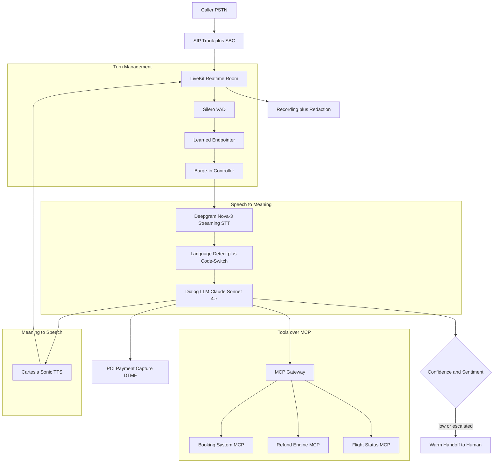
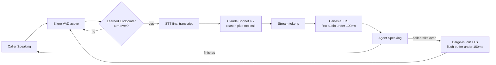

# Case Study: Multilingual Real-Time Voice Contact Center

A global airline runs an inbound phone agent across 22 languages that handles flight changes, baggage claims, refunds, and status checks in real time. It has to feel human (sub-800ms responses, barge-in, clean turn-taking), call the booking and refund systems over MCP, recognize when it is out of its depth and warm-hand-off to a live agent, and stay PCI-compliant the moment a card number enters the conversation.

## The Business Problem

The airline handles roughly 90,000 inbound calls per day across its hubs. Human agents cost about $6 per call fully loaded (wage, benefits, BPO margin, occupancy). Average handle time is 7 minutes, and 40 percent of volume is repetitive: "where is my bag," "is flight LH438 on time," "move me to the morning departure." The mandate is to resolve 55 percent of calls end-to-end without a human at a fraction of the $6 cost, while protecting the customer experience that a botched IVR can destroy in one bad call.

Constraints from the June 2026 reality:

- 22 languages with live code-switching (a Hindi caller drops into English for the booking reference, then back to Hindi), so static per-language routing is not enough.
- Phone audio is 8kHz narrowband G.711, often noisy, with strong regional accents. Word error rate (WER) drives task success directly, and bad ASR on a flight number cancels the wrong segment.
- Conversational latency must hold under 800ms response time end of caller speech to first audio, or callers talk over the agent and the illusion collapses ([Daily latency study](https://www.daily.co/blog/the-worlds-fastest-voice-bot/)).
- PCI DSS v4.0 applies the instant a payment happens: the agent must never hear or store a raw card number ([PCI DSS v4.0](https://www.pcisecuritystandards.org/document_library/)).
- Two-party-consent jurisdictions require recording disclosure at call start, and recordings must be retained and redacted per region.
- Tools are real and stateful: cancelling a flight or issuing a refund is an irreversible action, so confirmation read-backs are mandatory before any write.

## Architecture

### Components

| Layer | Tech | Purpose |
|-------|------|---------|
| Telephony | SIP trunk plus SBC, LiveKit Agents | PSTN ingress, media routing, low-jitter transport |
| Turn detection | Silero VAD plus learned endpointer | Decide when the caller has finished speaking |
| STT | Deepgram Nova-3 streaming | Partial and final transcripts across accents |
| Language ID | Streaming LID on first 1.5s plus per-utterance recheck | Pick voice and prompt locale, catch code-switching |
| Dialog | Claude Sonnet 4.7 (GPT-5.5 as fallback) | Reasoning, tool calls, confirmation read-backs |
| Tool transport | MCP 2.0 gateway over HTTP | Booking, refund, status with audience-bound tokens |
| TTS | Cartesia Sonic plus ElevenLabs Flash | Per-language voices, sub-100ms first byte |
| Handoff | Skills-based ACD plus context packet | Warm transfer with full conversation summary |
| Compliance | DTMF capture, recording vault, redaction | PCI scope isolation, consent, retention |

### Data flow

1. The PSTN call lands on the SBC, is normalized to a media stream, and joins a LiveKit room with the voice agent worker.
2. Silero VAD gates the audio; the learned endpointer decides when the caller's turn is actually over rather than waiting on a fixed silence timer.
3. Deepgram streams partial transcripts as the caller speaks; language ID runs on the first words and rechecks per utterance for code-switching.
4. On endpoint, the final transcript plus rolling conversation state goes to Claude Sonnet 4.7, which either answers, asks a clarifying question, or emits a tool call.
5. Tool calls route through the MCP gateway with an audience-bound token; reads (flight status) run immediately, writes (cancel, refund) require a spoken confirmation read-back first.
6. The LLM response streams token by token into Cartesia, which begins synthesizing audio before the full sentence exists, holding first-audio latency down.
7. If the caller starts speaking while the agent talks, the barge-in controller cuts TTS within ~150ms, flushes the queued audio, and reopens the STT stream.
8. When confidence, sentiment, or repeated-failure signals trip, the agent assembles a context packet and warm-transfers to a human; the full call is recorded and redacted per region.

## Key Design Decisions

### 1. Cascade vs speech-to-speech

The two architectures are a real fork. A speech-to-speech model (GPT-5.5 realtime, Gemini Live) ingests audio and emits audio directly, with the lowest latency and the most natural prosody because nothing round-trips through text ([OpenAI Realtime API](https://platform.openai.com/docs/guides/realtime), [Gemini Live API](https://ai.google.dev/gemini-api/docs/live)). The cascade (STT then LLM then TTS) is slower by 150 to 300ms of pipeline overhead but buys three things this product cannot live without: full debuggability (every turn has a transcript you can audit when a wrong flight gets cancelled), independent language coverage (22 languages is a STT and TTS problem solved per component, not gated on one model's audio training), and a swappable dialog brain (we run Claude Sonnet 4.7 and can fail over to GPT-5.5 without retraining the audio stack). We chose cascade. For the payment sub-flow we go even more deterministic and leave the LLM out of the loop entirely. A pure speech-to-speech design would have been faster but would have made PCI scoping and per-language QA far harder.

### 2. Turn detection and endpointing (the latency tax)

Fixed silence timers are the classic IVR failure. Set the timer at 700ms and the agent feels sluggish; set it at 300ms and it interrupts a caller who paused to think. We run Silero VAD ([Silero VAD](https://github.com/snakers4/silero-vad)) for raw voice activity, then a learned endpointer that uses acoustic and lexical cues (rising vs falling intonation, whether the transcript is a complete clause) to predict end-of-turn, the approach LiveKit ships as a turn-detection plugin ([LiveKit turn detection](https://docs.livekit.io/agents/build/turns/)). This cuts perceived response latency by 200 to 400ms over a fixed 700ms timer while reducing false interruptions. The endpointer is per-language because pause distributions differ: Japanese callers pause longer mid-sentence than German callers, and a single global threshold gets both wrong.

### 3. Barge-in (let the caller interrupt)

Real conversation is interruptible. If the agent is reading back "I have you on the 14:05 to Munich" and the caller cuts in with "no, the morning one," the agent must stop instantly. Our barge-in controller monitors VAD during TTS playback; on detected speech it cancels the TTS stream, flushes buffered audio out of the LiveKit jitter buffer (otherwise the caller hears a half-second of stale agent speech after they started talking), and reopens STT. Target stop-to-silence is under 150ms. The hard part is the race: distinguishing a genuine interruption from a backchannel ("mm-hmm," "okay") that should not stop the agent. We use a short 250ms confirmation window and a backchannel classifier so a polite "uh-huh" does not derail the read-back.

### 4. Language detection and code-switching mid-call

Callers do not stay in one language. We run streaming language ID on the first ~1.5 seconds to pick the initial locale (voice, prompts, STT model), then recheck per utterance. When a Hindi speaker says the booking reference "PNR six-X-ray-mike," the digits and NATO alphabet arrive in English; the ASR config has to accept both. We keep STT in a code-switch-tolerant mode for the high-mix language pairs (Hindi-English, Spanish-English, Arabic-French) rather than locking to one language. TTS stays in the dominant language for naturalness but pronounces embedded English tokens (airport codes, names) correctly. Mis-detection is a top-three failure mode, so locale is always confirmable: "I will continue in English, is that okay?"

### 5. ASR accuracy across accents and noisy lines

Phone audio is the enemy. 8kHz narrowband, lossy codecs, background airport noise, and a long tail of accents push WER up, and WER maps almost linearly to task failure: a 12 percent WER on flight numbers means roughly one in eight callers gets the wrong segment read back. We mitigate with a phone-tuned streaming model (Deepgram Nova-3, [Deepgram docs](https://developers.deepgram.com/docs)), keyword boosting for the domain vocabulary (airport codes, fare classes, "rebook," "voucher"), and constrained grammars for high-stakes slots: booking references and dates are captured against a checksum-validated pattern, and we read them back digit by digit. We track WER per language and per accent cluster, because a model that averages 8 percent can still be at 18 percent for one accent that is 4 percent of volume.

### 6. Tool calls over MCP with confirmation read-backs

The dialog LLM drives real systems through an MCP 2.0 gateway ([MCP specification](https://modelcontextprotocol.io/specification/2026-03-26/)): `booking.search`, `booking.rebook`, `refund.quote`, `refund.issue`, `status.lookup`. Reads execute immediately. Writes never fire on first mention. The agent must state the action and the consequence and get an explicit yes: "I will cancel your 14:05 Munich flight and rebook you on the 09:10, with a 40 euro fare difference. Shall I confirm?" Only an affirmative releases `booking.rebook`. Each tool token is audience-bound so a token minted for the status service cannot call the refund engine ([RFC 8707](https://www.rfc-editor.org/rfc/rfc8707.html)). Tool calls carry idempotency keys so a retry after a timeout does not double-issue a refund.

### 7. When to hand off to a human

The agent is built to quit while it is ahead. We trigger a warm handoff on any of: tool-call confidence below threshold on a high-stakes action, sentiment detection flagging anger or distress, two consecutive ASR clarification loops on the same slot, an explicit "agent please," or a topic outside the supported set (a medical emergency, a legal complaint). Handoff is warm, not a cold dump. The agent builds a context packet (caller identity, verified booking, what was attempted, the live transcript summary, detected language, detected sentiment) and the human agent sees it on screen before they pick up, so the caller never repeats themselves. Cold transfers are the single fastest way to make an automated front end hated; we measure repeat-rate post-transfer and treat any regression as a sev-2.

### 8. Compliance: recording consent and PCI

Two compliance gates. First, recording: in two-party-consent regions the agent discloses recording in the first utterance, and the consent state is logged with the recording. Second, payments. When a fare difference or a paid change needs a card, we never let the card number reach the LLM or the transcript. The agent pauses recording, hands the caller to a DTMF capture flow (the caller keys the card on the keypad, tones are captured by a PCI-scoped service and tokenized), and the agent only ever sees a token and an authorization result ([PCI DSS v4.0](https://www.pcisecuritystandards.org/document_library/), [Twilio PCI patterns](https://www.twilio.com/docs/voice/tutorials/pci-compliance)). The agent runtime stays out of PCI scope entirely. Recordings run through a redaction pass that strips any DTMF tones and spoken digit sequences that look like card or CVV data before storage.

### 9. Latency budget engineering (holding sub-800ms)

800ms end-of-speech to first-audio is the headline SLO, and it is a budget you spend across the pipeline. Endpointing decision: ~100ms. STT final after endpoint: ~150ms (the partials are already streamed). LLM first token: ~250ms. TTS first audio byte: ~90ms. Network and jitter buffer: ~100ms. That leaves ~110ms of slack. The levers that make it fit: streaming STT so the transcript is nearly done at endpoint, streaming the LLM so TTS starts on the first clause not the full response, speculative TTS warmup, and keeping the LLM prompt tight (no dumping the full 22-language policy book into context every turn, retrieve only the relevant policy). When p95 drifts over budget the call feels robotic and barge-in races increase, so latency is a primary alert, not a vanity metric.

## Failure Modes and Mitigations

### F1: Latency spike makes the agent feel robotic

A GPU queue backs up or the LLM provider slows, p95 first-audio jumps past 1.2s, callers start talking over the agent, barge-in races multiply, and the conversation degrades. Mitigation: per-stage latency budgets with alerts, a faster fallback model (Claude Haiku 4.5 for simple turns) when the dialog model is slow, speculative TTS warmup, and a "let me check that for you" filler phrase emitted within 300ms so the line is never dead while a slow tool call runs.

### F2: ASR error triggers a wrong action

The caller says "cancel LH438," the ASR hears "LH434," and the agent prepares to cancel the wrong segment. Mitigation: every high-stakes slot is checksum-validated where possible and always read back digit by digit before a write tool fires; the write only releases on an explicit affirmative; idempotency keys prevent a retried call from compounding the error.

### F3: Barge-in race conditions

The caller and the agent talk at the same time, the jitter buffer still holds queued agent audio, and the caller hears the agent finish a sentence after they have already interrupted, which feels broken. Mitigation: on barge-in, cancel the TTS stream and flush the LiveKit playout buffer immediately; use a 250ms backchannel window plus a classifier so "mm-hmm" does not stop the agent but "no, stop" does.

### F4: Language mis-detection answers in the wrong language

Language ID locks to Portuguese on a noisy opening, the caller is actually speaking Spanish, and the agent responds in the wrong language. Mitigation: per-utterance language recheck rather than once at call start; a confirmable locale ("I will continue in Spanish, okay?"); and a fast switch path that re-selects STT model, prompt locale, and TTS voice mid-call without dropping the turn.

### F5: Caller escalated and the agent does not hand off

A distressed caller whose bag held medication is getting angrier, and the agent keeps trying to resolve it instead of escalating. Mitigation: sentiment detection on every turn with a low threshold for distress and anger; a hard rule that two consecutive failed clarifications or any detected distress triggers warm handoff; an always-available "agent" intent that bypasses everything.

### F6: PCI leak (card number in a transcript)

A caller reads their card number aloud instead of using the keypad, and it lands in the STT transcript and the recording. Mitigation: the agent proactively routes payment to DTMF and instructs the caller not to read the card aloud; a real-time redactor scrubs digit sequences matching card or CVV patterns from transcripts and recordings; recording is paused during the payment sub-flow so the PCI-scoped service is the only thing that ever touches the tones.

### F7: Tool timeout mid-call

The refund engine takes 9 seconds during a backend incident, and the caller sits in silence wondering if the line dropped. Mitigation: tool calls have a 3-second soft deadline that triggers a spoken "this is taking a moment, please hold"; a hard deadline that fails the tool gracefully and offers a callback or human handoff; idempotency keys so the eventual completion does not double-act; circuit breakers that route to human when a backend is broadly down.

### F8: Hallucinated policy (invents a refund rule)

Asked about a fare rule the agent does not know, the LLM confidently invents a 24-hour free-cancellation policy that does not apply to this fare. Mitigation: policy answers are grounded in retrieved fare rules, not model memory; the agent is instructed to refuse and hand off rather than guess on policy it cannot ground; refund and rebook amounts always come from the `refund.quote` tool, never from the LLM's own arithmetic.

## Operational Considerations

### Monitoring

| SLO | Target |
|-----|--------|
| Response latency (end of speech to first audio) p95 | under 800 ms |
| Containment rate (resolved without human) | over 55 percent |
| ASR WER on high-stakes slots | under 5 percent |
| Barge-in stop-to-silence p95 | under 200 ms |
| Warm-handoff context-packet delivery | over 99 percent before agent answers |
| Wrong-action incidents (write on misheard slot) | under 1 per 100k calls |

### Cost model

At 90,000 calls per day (~2.7M per month) with 55 percent containment, ~1.5M calls are handled fully by the agent at an average 4 minutes of audio:

- STT (Deepgram, ~$0.0077/min): ~$46,000 per month
- TTS (Cartesia plus ElevenLabs, ~$0.015/min generated): ~$45,000 per month
- Dialog LLM (Claude Sonnet 4.7, streaming, short turns): ~$120,000 per month
- LiveKit plus SIP plus SBC media: ~$35,000 per month
- Telephony minutes (PSTN termination): ~$60,000 per month
- Recording, redaction, PCI-scoped capture, storage: ~$18,000 per month
- Total: ~$324,000 per month, about $0.22 per contained call, roughly $0.054 per minute of audio

Against a $6 human call, every contained call saves about $5.78. At 1.5M contained calls that is ~$8.4M of avoided agent cost per month versus ~$0.32M of platform cost.

### On-call playbook

- Latency breach (p95 over 800ms): check GPU queue depth and LLM provider status; shift simple turns to Claude Haiku 4.5; enable filler phrases; page the provider if it is upstream.
- Containment drop: pull the last hour of handoff reasons; if one intent spiked, check the matching tool or backend for an outage and route that intent straight to human.
- Wrong-action alert: freeze the affected write tool, replay the call transcript and audio, confirm read-back logic fired, and reverse the action through the booking system if the read-back was skipped.
- PCI redaction failure: quarantine the affected recordings, force all payments to DTMF-only, and notify the compliance owner; treat as sev-1.
- Backend (refund or booking) outage: trip the circuit breaker, switch the affected intents to human handoff with an honest "our system is having trouble" message rather than degraded automated answers.
- Language regression: if WER or mis-detection spikes for one language, pin that language's STT model to the last-good version and route its calls to human while you investigate.

## What Strong Interview Candidates Cover

- They reason through cascade vs speech-to-speech as a real tradeoff (latency and naturalness against debuggability, 22-language coverage, and a swappable dialog model) rather than defaulting to whichever is newest.
- They treat endpointing and barge-in as first-class latency problems, naming learned turn detection over fixed silence and explaining the flush-the-jitter-buffer detail on interruption.
- They connect WER to task success and design constrained grammars plus read-backs for high-stakes slots instead of trusting raw ASR.
- They keep the dialog model out of PCI scope with DTMF tokenization and explain why the agent must never hear the card number.
- They make tool writes safe: confirmation read-backs, idempotency keys, audience-bound MCP tokens, and quotes from tools rather than model arithmetic.
- They design warm handoff with a context packet and measure post-transfer repeat-rate, treating cold transfers as a product failure.
- They size the latency budget stage by stage and the cost model per contained call, justifying the build against the $6 human baseline.

## References

- OpenAI, [Realtime API guide](https://platform.openai.com/docs/guides/realtime)
- Google, [Gemini Live API](https://ai.google.dev/gemini-api/docs/live)
- Radford et al., [Robust Speech Recognition via Large-Scale Weak Supervision (Whisper)](https://arxiv.org/abs/2212.04356)
- [Silero VAD](https://github.com/snakers4/silero-vad)
- [Deepgram streaming STT documentation](https://developers.deepgram.com/docs)
- [ElevenLabs text-to-speech](https://elevenlabs.io/docs/api-reference/text-to-speech)
- [Cartesia Sonic TTS](https://docs.cartesia.ai/)
- [LiveKit Agents framework](https://docs.livekit.io/agents/)
- [LiveKit turn detection](https://docs.livekit.io/agents/build/turns/)
- [Daily: building a sub-second voice bot](https://www.daily.co/blog/the-worlds-fastest-voice-bot/)
- [PCI DSS v4.0 document library](https://www.pcisecuritystandards.org/document_library/)
- [Model Context Protocol specification 2026-03-26](https://modelcontextprotocol.io/specification/2026-03-26/)
- IETF, [RFC 8707: Resource Indicators for OAuth 2.0](https://www.rfc-editor.org/rfc/rfc8707.html)

Related chapters: [Real-Time Voice Agents](../18-voice-and-audio-agents/01-realtime-voice-agents.md), [Voice AI in Healthcare](13-voice-ai-healthcare.md), [Tool Use and MCP](../07-agentic-systems/03-tool-use-and-mcp.md).
