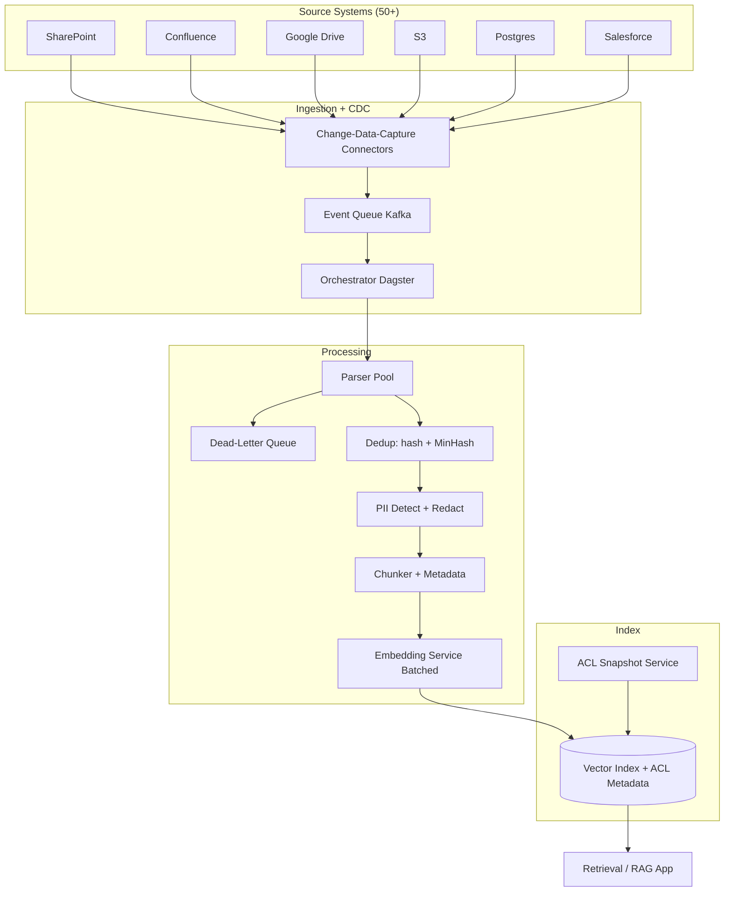
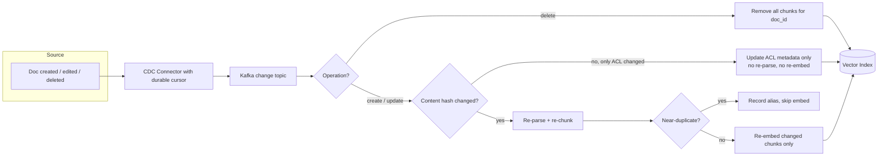

# Case Study: Enterprise Data Ingestion Pipeline for RAG

The unglamorous layer behind enterprise RAG: keeping a retrieval index fresh over 120M documents from 50-plus heterogeneous sources, with correct access control, deduplication, parsing quality, PII handling, and incremental updates so a doc edited at 9:00am is searchable by 9:15am. Most RAG systems do not die on the retrieval algorithm; they die here. This is the data-pipeline companion to the retrieval-quality work in [Enterprise RAG](01-enterprise-rag.md).

## The Business Problem

A 12,000-person company wants one search box over everything: SharePoint, Confluence, Google Drive, S3 buckets, three Postgres databases, Salesforce, the corporate email archive, and the support ticketing system. Fifty-plus connectors, roughly 120M documents, and a long tail of formats (scanned contracts as PDFs, Excel financial models, HTML knowledge-base pages, PowerPoint, embedded images). The retrieval team already shipped a strong reranking stack, and it works beautifully in the demo. In production, answers are wrong for boring reasons: a connector silently stopped three weeks ago so the index is stale, a parser flattened a pricing table into word soup, and twice a sales rep retrieved an HR document they were never allowed to see. The fix is not a better embedding model. It is an ingestion pipeline that treats data as the product.

Constraints from the June 2026 reality:

- 120M documents across 50-plus sources, growing roughly 3M net-new per month
- Freshness SLO: a document edited or deleted in a source must be reflected in the index within 15 minutes for tier-1 sources, 4 hours for the long tail
- Access control is non-negotiable: query-time results must never include a document the asking user cannot see in the source system
- Re-embedding all 120M documents from scratch costs real money (around $14K per full pass on a hosted embedding API at $0.12 per million tokens), so full re-crawls are off the table as a routine operation
- PII and regulated data (PCI, PHI, employee records) flow through the same pipes and must be detected and redacted before they land in a shared index
- One data platform engineer plus a shared platform team; the pipeline must be operable, not heroic

## Architecture

### Components

| Layer | Tech | Purpose |
|-------|------|---------|
| Connectors + CDC | Per-source connectors, Debezium for Postgres, webhooks plus delta APIs for SaaS | Detect creates, edits, deletes without full crawl |
| Event bus | Kafka | Decouple capture from processing, replayable change log |
| Orchestrator | Dagster (asset-based) | Schedule, retry, backfill, lineage per document asset |
| Parser pool | Reducto and LlamaParse for hard PDFs and tables, Docling and unstructured.io for office and HTML, Apache Tika fallback | Turn bytes into clean text plus structure |
| Dedup | xxhash content hash plus MinHash/LSH | Drop exact and near-duplicate boilerplate |
| PII | Microsoft Presidio plus a fine-tuned NER pass | Detect and redact regulated spans |
| Chunker | Structure-aware chunking with metadata | Retrieval-sized units that carry provenance |
| Embedding service | Batched calls to Voyage voyage-3 or text-embedding-3-large, or self-hosted BGE-M3 on GPU | Versioned vectors at controlled cost |
| Vector index | Postgres pgvector or a dedicated store, per-chunk ACL metadata | Filterable retrieval with permissions |
| ACL service | Periodic permission snapshots per source | Keep per-chunk ACLs in sync with sources |

### Data flow

1. A connector detects a change in a source (a new SharePoint file, an edited Confluence page, a deleted Salesforce record) via CDC: Debezium on the Postgres WAL, webhooks plus delta-token APIs for SaaS, S3 event notifications for buckets.
2. The change event lands on Kafka with a stable document id, source, operation (create, update, delete), and a content checksum. Kafka is the replayable spine: if downstream breaks, we reprocess from the offset.
3. Dagster picks up the event and materializes the document as an asset, fetching the raw bytes and the current ACL list from the source.
4. The parser pool converts bytes to structured text. Routing picks a parser per content type; tables and scanned PDFs go to the vision-capable parsers, plain HTML goes to the cheap path. Failures route to the dead-letter queue, not silently dropped.
5. Dedup runs: an exact content hash kills byte-identical re-uploads, then MinHash/LSH catches near-duplicates (the same policy doc copied into 40 team spaces).
6. PII detection and redaction runs before anything is embedded; regulated spans are masked or the whole document is quarantined depending on policy.
7. The chunker splits the clean text into retrieval units and stamps each chunk with metadata: source, document id, ACL principals, last-modified, embedding-model version.
8. The embedding service batches chunks, calls the versioned embedding model, and upserts vectors plus metadata into the index. A delete event removes all chunks for that document id.

## Key Design Decisions

### 1. Incremental sync, not full re-crawl

A nightly full crawl of 120M documents is the default mistake. It is slow (the crawl window exceeds the SLO before it even starts), expensive (you re-embed unchanged documents every night), and it hammers source-system APIs into rate-limit jail. We run change-data-capture instead. Postgres sources use Debezium on the write-ahead log ([Debezium docs](https://debezium.io/documentation/reference/stable/index.html)). SaaS sources use the right native mechanism per vendor: Microsoft Graph delta queries and webhooks for SharePoint, the Confluence content audit and CQL since-last-sync, the Google Drive Changes API with a saved page token, Salesforce CDC and the Bulk API for backfills. Each connector tracks a durable cursor (an offset, a delta token, a high-water timestamp) so a restart resumes instead of re-crawling. A full backfill exists but is an explicit, rare operation: onboarding a new source, or a reindex (decision 7). Steady state, we touch only the roughly 1 to 2 percent of documents that changed.

### 2. Parsing quality is the hidden bottleneck

The single biggest source of wrong answers is bad parsing, not bad retrieval. A pricing table flattened into a run-on sentence retrieves fine and answers wrong. Scanned contracts are images; a naive text extractor returns nothing. We ran a parser bake-off on a 2,000-document golden set spanning PDFs with tables, scanned docs, multi-column layouts, and slide decks, scoring each parser on table-structure fidelity, reading order, and OCR accuracy. Findings that shaped routing: Reducto and LlamaParse ([LlamaParse](https://docs.cloud.llamaindex.ai/llamaparse/getting_started)) won decisively on tables and complex PDFs but cost roughly $3 to $10 per 1,000 pages; Docling ([Docling](https://github.com/docling-project/docling)) and unstructured.io ([unstructured](https://docs.unstructured.io/)) are strong and cheaper for clean office and HTML; Apache Tika ([Tika](https://tika.apache.org/)) is the free fallback that handles 80 percent of formats acceptably and nothing well. So we route by content type and difficulty: cheap path for clean HTML and DOCX, vision-capable parsers for tables and scanned PDFs, and a Gemini 3.1 Pro vision pass ([Gemini docs](https://ai.google.dev/gemini-api/docs)) as the escalation for the handful of documents that defeat everything else. Parsing the long tail well is where the budget and the quality both live.

### 3. Deduplication: exact plus near-duplicate

Enterprises are full of copies. The same onboarding deck lives in 40 team spaces; an email thread quotes the previous five messages; a contract template seeds 300 contracts that differ in two fields. Without dedup, the index fills with boilerplate and retrieval returns ten near-identical chunks instead of ten distinct facts. We dedup in two stages. Exact: an xxhash over normalized content drops byte-identical re-uploads cheaply. Near-duplicate: MinHash with LSH banding ([Broder, On the resemblance and containment of documents](https://www.cs.princeton.edu/courses/archive/spr04/cos598B/bib/Broder.pdf)) clusters documents above a Jaccard similarity of about 0.85 and keeps a canonical representative, with the duplicates recorded as aliases so provenance is preserved. This cut our chunk count by 22 percent on the first pass and measurably improved retrieval diversity.

### 4. Propagating access control into the index

This is the decision that keeps the project out of an incident report. Two architectures exist. Post-filtering: retrieve top-k by similarity, then check each hit against the user's permissions and drop the ones they cannot see. It leaks, because a deleted-but-still-indexed permission, a stale ACL, or a clever top-k that returns nothing visible all degrade silently, and worse, the existence and snippet of a document can leak through ranking signals and counts before the filter runs. We do pre-filtering instead: every chunk carries the document's ACL principals (user ids, group ids, role ids) as indexed metadata, and the query is filtered by the asking user's resolved principal set before similarity ranking. An ACL snapshot service refreshes permissions per source on a schedule (and on permission-change events where the source emits them), so a revoked share propagates to the index, not just to the source. The hard part is that ACLs change independently of content: a file's permissions can change without the file changing, so the ACL service must update chunk metadata without re-parsing or re-embedding the document. We store ACLs as a separately updatable metadata field for exactly this reason. See [Access Control](../12-security-and-access/02-access-control.md).

### 5. Chunking and metadata strategy

Chunking is where parsing quality pays off or gets thrown away. We chunk structure-aware: split on headings and section boundaries from the parser, keep tables intact as single units rather than slicing rows across chunks, and target 400 to 800 tokens with a small overlap. Every chunk carries metadata that earns its keep at query time: source system, document id and version, ACL principals, last-modified timestamp, content type, and the embedding-model version that produced its vector. The metadata is not decoration; ACL principals drive pre-filtering, last-modified drives freshness-aware ranking, and the embedding-model version makes the reindex in decision 7 possible. Details and the table-handling tradeoffs live in [Chunking Strategies](../06-retrieval-systems/02-chunking-strategies.md).

### 6. The embedding service: batching, rate limits, versioning

Embedding 120M documents is a throughput and cost problem, not a model-quality problem. Three things matter. Batching: hosted embedding APIs price and rate-limit per request, so we batch up to the provider maximum (Voyage and OpenAI both accept large batches) and pipeline requests to saturate the rate limit without tripping it. Cost control: at text-embedding-3-large pricing of $0.13 per million tokens ([OpenAI embeddings](https://platform.openai.com/docs/guides/embeddings)) or Voyage voyage-3 at a similar tier ([Voyage docs](https://docs.voyageai.com/docs/embeddings)), the full corpus is roughly $13 to $16K to embed once; for steady-state incremental load it is a few hundred dollars a month. For very high volume we benchmark self-hosted BGE-M3 ([BGE-M3](https://huggingface.co/BAAI/bge-m3)) on a GPU, which trades API spend for GPU spend and ops burden. Versioning: every vector is stamped with the embedding-model id and version. You cannot mix vector spaces (decision 7 depends on this), and you cannot debug a retrieval regression six months later without knowing which model produced the vector.

### 7. Embedding-model upgrades and the reindex problem

A better embedding model ships, and now you have 120M vectors in the old space and a desire to use the new one. You cannot mix them: cosine similarity between a voyage-3 vector and a voyage-3.5 vector is meaningless, so a half-migrated index returns garbage for cross-space comparisons. The naive "just re-embed everything" is a multi-week, $14K job that you do not want to run live against the production index. We use blue/green reindexing: stand up a new green index, backfill it from the source-of-truth document store (not from the old index, so we also pick up any drift), re-embed with the new model into green while blue keeps serving, validate green against the retrieval golden set, then cut over and keep blue warm for rollback. The re-embed cost is real and is the main reason we do not chase every new embedding model; we upgrade when the retrieval-quality gain on our eval set clears a threshold worth $14K plus a week of pipeline attention.

### 8. PII detection and redaction in the pipeline

Regulated data flows through the same connectors as everything else, and a shared retrieval index is exactly the wrong place to memorize someone's social security number. We run PII detection before embedding using Microsoft Presidio ([Presidio](https://microsoft.github.io/presidio/)) plus a fine-tuned NER pass for our domain entities. Policy is per-class: low-risk PII (names, emails in normal business documents) is preserved because redacting it breaks retrieval; high-risk regulated data (PCI, PHI, government ids) is masked with category tokens, and documents from regulated sources that exceed a sensitivity threshold are quarantined out of the shared index entirely and routed to a restricted index with tighter ACLs. The redaction model is evaluated on a labeled sample at precision over 98 percent and recall over 95 percent, because a recall miss here is a compliance finding.

### 9. Observability and the dead-letter queue

Roughly 2 percent of 120M documents fail to parse: corrupt files, password-protected PDFs, unsupported formats, OCR that returns nothing. Silently dropping them is how the index quietly goes incomplete and nobody notices until an answer is missing. Every failure goes to a dead-letter queue with the document id, source, the parser that failed, and the error. The DLQ is triaged: automatic retries with an alternate parser for transient and format-routing failures, a weekly human review of the persistent residue, and a dashboard that tracks DLQ depth as a first-class metric. A spike in the DLQ is the earliest signal that a source changed its export format or a parser regressed.

## Incremental Update Path (CDC)

## Failure Modes and Mitigations

### F1: A source connector silently stops and the index goes stale

A connector's auth token expires, an API quietly changes its delta endpoint, and the connector stops emitting changes without erroring. The index keeps serving increasingly stale results and nobody notices for weeks. Mitigation: per-source freshness heartbeats. Each connector must emit a change or an explicit "no changes, still alive" beat within its SLO window; a missing heartbeat pages on-call. We also run a daily reconciliation that counts source documents against indexed documents per source and alerts on drift over 0.5 percent.

### F2: The parser mangles tables and answers go wrong

A financial table is flattened into prose; retrieval looks healthy but the answer is numerically wrong. Mitigation: the parser bake-off and content-type routing (decision 2), plus a parse-quality canary that runs the golden set through the live parser pool weekly and alerts on a table-fidelity regression. Documents that the cheap parser handles with low structure confidence are escalated to the vision-capable path automatically.

### F3: Dedup misses near-duplicates and dilutes retrieval

The MinHash threshold is too strict, near-duplicate boilerplate slips through, and top-k fills with ten copies of the same policy. Mitigation: tune the LSH banding against a labeled duplicate set, monitor retrieval diversity (distinct document ids in top-k) as a metric, and add a query-time dedup pass that collapses near-identical chunks in the result set as a backstop.

### F4: ACL not propagated and a user retrieves a document they cannot see

A share is revoked in SharePoint, the ACL snapshot has not refreshed, and the document is still retrievable by someone who lost access. This is a security incident, not a quality bug. Mitigation: pre-filtering on per-chunk ACLs (decision 4), ACL refresh on permission-change events where sources emit them plus a tight scheduled refresh otherwise, and a fail-closed default: a chunk with missing or stale ACL metadata is excluded from results rather than shown. We audit a sample of retrievals against live source permissions weekly.

### F5: Embedding-model upgrade without reindex creates a mixed vector space

Someone swaps the embedding model for new ingests without reindexing the back catalog; now the index holds two incompatible vector spaces and cross-space similarity is noise. Mitigation: the embedding-model version stamp on every vector (decision 6), a hard guard that refuses to upsert a vector whose model version does not match the active index version, and the blue/green reindex protocol (decision 7) as the only sanctioned way to change models.

### F6: CDC misses deletes and a deleted document stays retrievable

A document is deleted in the source but the delete event is dropped or the source never emits one, so the chunks linger in the index. Mitigation: treat deletes as first-class CDC events with their own handling path, and for sources with weak delete semantics run a periodic tombstone reconciliation that diffs the source document set against the index and removes orphans. Soft-delete in the index first (exclude from results) then hard-delete after a grace window, so an accidental reconciliation is recoverable.

### F7: A poison or duplicate flood overwhelms the index

A misconfigured connector or a bulk import dumps millions of junk or duplicate documents and the index quality craters. Mitigation: per-source ingest-rate limits and anomaly alarms (a 10x spike in change volume pages before it lands), dedup as a hard gate (decision 3), and a quarantine staging area for bulk imports that must pass a quality check before promotion to the live index.

### F8: A reindex of 120M documents blows the budget

An engineer kicks off a full re-embed without realizing it is a $14K, multi-week job, or a runaway backfill loop re-embeds the corpus repeatedly. Mitigation: reindex is a gated, cost-estimated operation that requires sign-off and runs against the green index, never live; a spend alarm on the embedding API fires at 1.5x the projected reindex budget; and idempotent upserts keyed on content hash plus model version mean a re-run does not re-embed unchanged chunks.

## Operational Considerations

### Monitoring

| SLO | Target |
|-----|--------|
| Freshness lag (tier-1 sources, edit to searchable) | under 15 minutes p95 |
| Freshness lag (long-tail sources) | under 4 hours p95 |
| Parse success rate | over 98 percent, alert under 97 percent |
| Dead-letter queue depth | under 0.5 percent of daily volume |
| Source-to-index reconciliation drift | under 0.5 percent per source |
| ACL refresh staleness | under 30 minutes for tier-1 sources |

### Cost model

Steady-state monthly, normalized per million documents ingested incrementally (roughly 3M net-new per month plus edits at full scale):

- Embedding (incremental, hosted API at ~$0.13 per million tokens): about $350 to $500 per month at steady-state change volume; a full reindex is a separate roughly $14K one-time event
- Parsing (vision-capable parsers for the hard tail, cheap path for the rest, blended): about $2,200 per month
- Storage (vectors plus metadata plus raw-bytes cache for reindex, roughly 120M chunks): about $1,800 per month
- Compute (Kafka, Dagster, parser pool, dedup, PII): about $3,500 per month
- PII tooling and self-hosted NER GPU: about $600 per month
- Total steady-state: roughly $8,600 per month, dominated by parsing and compute, not embedding

Per million documents ingested incrementally, the marginal cost is dominated by parsing the hard tail; clean HTML and office docs cost cents, scanned PDFs through vision parsers cost dollars. This is why parser routing (decision 2) is also a cost lever, not just a quality one.

### On-call playbook

- Freshness alarm on a source: check the connector heartbeat and cursor; if the auth token expired, rotate it; if the source changed its delta API, fail over to a bounded backfill and open a connector ticket.
- DLQ spike: sample the failures; if one source dominates, it likely changed export format, so update the parser route; retry the transient residue with the alternate parser.
- ACL incident (user saw something they should not): freeze the affected source's serving, force an ACL snapshot refresh, audit the blast radius from retrieval logs, then re-enable; treat as a security incident with writeup.
- Reconciliation drift: identify whether it is missing creates (connector behind) or missing deletes (tombstone gap); run the targeted reconciliation for that source.
- Embedding spend alarm: confirm no unsanctioned reindex is running; check for a backfill loop; if a model swap is in flight, verify it is going to green, not live.
- Parse-quality regression on the canary: pin the parser version, route affected content types to the vision path, and open a bake-off ticket before promoting any new parser version.

## What Strong Interview Candidates Cover

- They lead with CDC and incremental sync, and can explain per-source mechanisms (Debezium on the WAL, Graph delta queries, Drive change tokens) rather than hand-waving "we crawl nightly".
- They name parsing as the hidden bottleneck, describe a parser bake-off with a golden set, and route by content type and difficulty instead of picking one parser for everything.
- They get access control right by design: per-chunk ACL pre-filtering, and they explain concretely why post-filtering leaks and why ACLs must update without re-embedding.
- They treat the embedding-model upgrade as a reindex problem, cost it, and propose blue/green with a version stamp on every vector.
- They cover both halves of dedup (exact hash plus MinHash/LSH) and tie it to retrieval diversity, not just storage savings.
- They handle deletes and tombstones explicitly, knowing a missed delete is a security and correctness bug, not a minor staleness issue.
- They make observability concrete: freshness lag, parse success rate, a dead-letter queue, and source-to-index reconciliation as first-class SLOs.

## References

- [unstructured.io documentation](https://docs.unstructured.io/)
- [LlamaParse documentation](https://docs.cloud.llamaindex.ai/llamaparse/getting_started)
- [Reducto](https://reducto.ai/)
- [Docling (IBM / open source)](https://github.com/docling-project/docling)
- [Apache Tika](https://tika.apache.org/)
- [Dagster documentation](https://docs.dagster.io/)
- [Apache Airflow documentation](https://airflow.apache.org/docs/)
- [Debezium change-data-capture](https://debezium.io/documentation/reference/stable/index.html)
- Broder, [On the resemblance and containment of documents (MinHash)](https://www.cs.princeton.edu/courses/archive/spr04/cos598B/bib/Broder.pdf)
- [OpenAI text-embedding-3 guide](https://platform.openai.com/docs/guides/embeddings)
- [Voyage AI embeddings](https://docs.voyageai.com/docs/embeddings)
- [BAAI BGE-M3 embedding model](https://huggingface.co/BAAI/bge-m3)
- [Microsoft Presidio (PII detection and redaction)](https://microsoft.github.io/presidio/)
- Microsoft, [SharePoint and Graph delta query](https://learn.microsoft.com/en-us/graph/delta-query-overview)

Related chapters: [Data Engineering for AI](../06-retrieval-systems/15-data-engineering-for-ai.md), [Chunking Strategies](../06-retrieval-systems/02-chunking-strategies.md), [Production RAG at Scale](../06-retrieval-systems/14-production-rag-at-scale.md).
