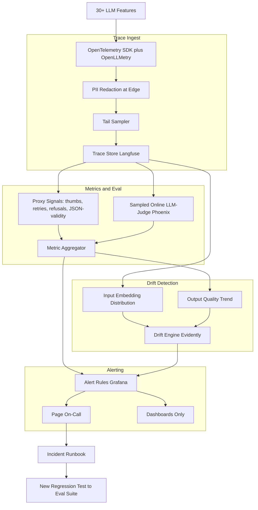
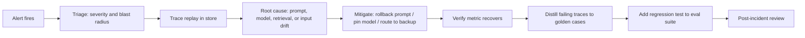

# Case Study: LLM Observability and Incident Response

A company running 30+ LLM features in production keeps learning about quality problems from customer complaints instead of dashboards. They build an LLM observability practice on OpenTelemetry GenAI conventions plus a tracing platform, layer on online quality signals and drift detection, and write an incident-response runbook so AI-specific failures are caught in minutes and root-caused by trace replay.

## The Business Problem

A mid-size SaaS company has 30+ LLM features in production: a RAG help center, three agent workflows, a fleet of classifiers (intent, sentiment, PII), and a customer-facing chatbot. Over one quarter they get burned five times. A prompt refactor silently regressed the refund-policy answers and support did not notice for 11 days. Their vendor rolled a new model build under a pinned alias and the extraction agent's JSON-validity dropped from 99.3 percent to 94 percent overnight. A prompt-templating bug appended the full conversation history on every turn and the daily model bill jumped from $1,900 to $7,400 before anyone looked. A jailbreak that leaked the system prompt showed up on social media. Every one of these was a 200 OK. Traditional APM (latency, error rate, CPU) saw nothing wrong, because a confidently wrong LLM response is, to your load balancer, a perfectly healthy 200.

Constraints from the June 2026 reality:

- 30+ LLM features, roughly 4.2M model calls per day across Claude, GPT, and Gemini endpoints
- No ground-truth labels in production; you find out an answer was wrong only if a user tells you or a downstream system rejects it
- GDPR and SOC 2 scope: prompts and responses routinely contain PII, so you cannot just log everything in plaintext
- Observability budget capped at roughly 8 percent of model spend; logging every full trace at this volume would blow past it
- Vendors ship model updates behind stable aliases ([Anthropic model deprecations](https://docs.anthropic.com/en/docs/about-claude/model-deprecations), [OpenAI model versioning](https://platform.openai.com/docs/models)), so "we pinned the model" is not the guarantee people think it is
- MTTD goal under 10 minutes for a quality regression, versus the 11-day baseline that started this project

The team standardizes on the [OpenTelemetry GenAI semantic conventions](https://opentelemetry.io/docs/specs/semconv/gen-ai/) for the trace schema so they are not locked to one vendor, and routes those traces into a platform. They evaluate [Langfuse](https://langfuse.com/docs), [LangSmith](https://docs.smith.langchain.com/), [Arize Phoenix](https://docs.arize.com/phoenix), and [Helicone](https://docs.helicone.ai/) before settling on a self-hosted Langfuse for trace storage plus Phoenix for evaluation, with [OpenLLMetry](https://github.com/traceloop/openllmetry) as the auto-instrumentation layer.

## Architecture

### Components

| Layer | Tech | Purpose |
|-------|------|---------|
| Instrumentation | OpenTelemetry SDK plus OpenLLMetry | Vendor-neutral GenAI spans |
| Redaction | Presidio-based edge scrubber | Strip PII before storage |
| Sampling | OTel tail sampler, custom rules | Keep cost bounded, never drop errors |
| Trace store | Self-hosted Langfuse | Full prompt, response, tokens, cost, model version |
| Proxy metrics | Stream processor on trace events | Thumbs, retries, refusal rate, JSON-validity |
| Online judge | Arize Phoenix, Claude Haiku 4.5 judge | Sampled quality scoring without labels |
| Drift engine | Evidently plus embedding monitor | Input shift and output quality drift |
| Alerting | Grafana plus PagerDuty | Page vs dashboard split |
| Eval feedback | Eval-gated CI repo | Every incident becomes a test |

### Data flow

1. Each LLM feature emits an OpenTelemetry span per call with GenAI attributes: `gen_ai.request.model`, `gen_ai.response.model` (the actual build the vendor served), prompt, response, tools called, `gen_ai.usage.input_tokens`, `gen_ai.usage.output_tokens`, computed cost, and latency.
2. A redaction sidecar scrubs PII (names, emails, card numbers, custom regexes) from prompt and response fields before anything is persisted; raw text never reaches the trace store.
3. The tail sampler decides retention: 100 percent of errors and refusals, 100 percent of flagged-by-judge traces, and 5 percent of healthy traffic, head-sampled deterministically so a full conversation is kept or dropped as a unit.
4. Stored traces feed two parallel paths: a stream processor computes proxy quality signals in near real time, and a sampled subset is scored by an online LLM-judge.
5. Aggregated metrics and the raw input embeddings feed the drift engine, which separately tracks input distribution shift and output quality trend.
6. Alert rules evaluate the aggregates and drift scores; a small set page on-call, the rest update dashboards.
7. When a page fires, on-call follows the runbook: triage severity, replay the offending traces, isolate root cause, mitigate (rollback prompt, pin model, route to backup).
8. Post-incident, the failing traces are distilled into golden cases and pushed to the eval suite that gates CI, so the same regression cannot ship twice.

## Key Design Decisions

### 1. What to log, and the cost of logging everything

Logging full prompt and response on every call at 4.2M calls/day is both a cost problem and a compliance problem. A full trace with prompt, response, and tool args averages 6 to 14 KB; at 4.2M/day that is 25 to 60 GB/day of hot trace storage, and self-hosted Langfuse on that volume is not free. The decision: log a structured envelope (model, tokens, cost, latency, span tree, proxy-metric flags) on 100 percent of calls, but retain full prompt and response text only on sampled and error traces. Envelopes are cheap and let you compute every metric; full text is what you need for replay, and you only need replay on the calls that matter. Retention is tiered: full traces 30 days hot, envelopes 13 months, error and incident traces frozen indefinitely in cold storage.

### 2. Tracing standard: OpenTelemetry GenAI so you are not vendor-locked

The team instruments against the [OpenTelemetry GenAI semantic conventions](https://opentelemetry.io/docs/specs/semconv/gen-ai/) rather than a vendor SDK. This is the single most important portability decision. The conventions define stable attribute names (`gen_ai.system`, `gen_ai.request.model`, `gen_ai.usage.*`) so the same instrumentation feeds Langfuse today and could feed [Datadog LLM Observability](https://docs.datadoghq.com/llm_observability/) or Grafana tomorrow with a config change, not a rewrite. [OpenLLMetry](https://github.com/traceloop/openllmetry) provides the auto-instrumentation that emits these spans for the major SDKs. When the chatbot team wanted to try Helicone's proxy-based capture in parallel, it was an OTLP exporter addition, not a re-instrumentation project.

### 3. Measuring quality online without ground truth

This is the core problem: in production there are no labels, so "quality" must be inferred from proxies. The team uses a layered signal stack, cheapest first:

- Deterministic, free: JSON-schema validity, regex/format checks, refusal-phrase detection, tool-call success rate. JSON-validity dropping is the fastest leading indicator of a model swap.
- User-behavioral, free: thumbs up/down, retry rate (user re-asks within 60 seconds), conversation abandonment, copy-button clicks as a positive signal.
- Sampled LLM-judge, paid: a [Claude Haiku 4.5](https://docs.anthropic.com/en/docs/about-claude/models) judge scores 2 percent of traffic on a reference-free rubric (faithfulness to retrieved context, instruction adherence, safety). The bias and cost tradeoff is explicit: an online judge is a biased estimator and judges drift with their own model updates, so it sets trend, not absolute truth. The judge prompt is versioned and periodically calibrated against human labels the same way the [eval-gated CI case study](18-eval-gated-cicd.md) calibrates its offline judge. The methodology and its known biases come from [Zheng et al., Judging LLM-as-a-Judge](https://arxiv.org/abs/2306.05685). Judging 2 percent of 4.2M calls with Haiku 4.5 costs roughly $40/day; judging 100 percent would cost about $2,000/day and is not worth it.

The discipline that matters: no single proxy is trusted alone. A refusal-rate spike plus a thumbs-down spike plus a judge-score dip is a real regression; any one alone is noise.

### 4. Drift detection: input distribution versus output quality

These are two different detectors and conflating them is a common mistake. Input drift means your traffic changed: a new customer segment, a product launch, a different language mix. The detector embeds incoming prompts and watches the embedding distribution against a rolling baseline using population stability index and a distance test, following the [Evidently AI drift guide](https://docs.evidentlyai.com/) and the [Arize embedding-drift methodology](https://docs.arize.com/arize/machine-learning/how-to-ml/drift-tracing). Input drift is usually not an incident by itself; it is context that explains why a quality metric moved. Output quality drift means your answers got worse for the same kind of input: judge scores, JSON-validity, or refusal rate trending down. The rule the team enforces: page on output quality drift, annotate (do not page) on input drift, and when both fire together, the input shift is the likely cause and the runbook says so.

### 5. Alerting without alert fatigue

The fastest way to kill an observability practice is to page on everything. The team splits signals hard. Pages (wake someone up): JSON-validity below 97 percent on any extraction feature, refusal rate 3x the 7-day baseline, judge score down more than 8 points week-over-week, cost per hour 2x the trailing average, any safety-classifier hit on the chatbot. Everything else (latency percentiles, token distributions, input drift, per-feature volume) is dashboard-only and reviewed in a weekly ritual. Every paging rule has a minimum-duration condition (sustained 10 minutes, not a single spike) and a clear runbook link, following the [Google SRE workbook on alerting](https://sre.google/workbook/alerting-on-slos/). They track pages-per-week as an SLI; when it climbs past 5, they treat the alert config itself as the bug.

### 6. When a vendor silently changes the model under you

This is the failure people underestimate. You pin `claude-sonnet-4-7` or a GPT alias and assume behavior is frozen, but vendors ship new builds and route stable aliases to them, and deprecation calendars move ([Anthropic deprecations](https://docs.anthropic.com/en/docs/about-claude/model-deprecations), [OpenAI versioning](https://platform.openai.com/docs/models)). Detection has three layers. First, log `gen_ai.response.model` (the served build string), not just the requested alias, and alert on any change. Second, pin to a dated snapshot id rather than a floating alias wherever the vendor offers one. Third, the canary-on-vendor pattern: a fixed set of 200 golden prompts runs against each production model alias every hour, and the outputs are diffed against a stored baseline; a behavioral shift fires before customer traffic is affected. When the extraction JSON-validity dropped overnight, this canary would have caught the swap in under an hour instead of via the support queue.

### 7. The incident-response runbook for AI-specific incidents

Generic SRE runbooks assume the failure is an outage. AI incidents are usually degradations, so the runbook is purpose-built, with severity tied to blast radius. Sev1: safety/jailbreak in a customer-facing surface, or a regression on a flagship feature affecting paying customers. Sev2: a measurable quality regression on a non-flagship feature, or a cost anomaly over $1,000/hour. Sev3: drift warnings and slow trends. Each severity has a fixed first move (Sev1 chatbot safety hit: route the feature to a stricter guardrail config immediately, then investigate). Triage always starts in the trace store: filter to the affected feature and the time window, pull the sampled failing traces, and replay. Standard mitigations are rollback the prompt (one commit), pin the model to the last-known-good snapshot, or route to a backup model on a different vendor.

### 8. Closing the loop: every incident becomes a regression test

An incident you do not encode in your eval suite is an incident you will ship again. The final step of every post-incident review is mechanical: take the failing traces from the trace store, redact and minimize them into golden cases, and push them into the eval set that gates CI in the [eval-gated CI/CD pipeline](18-eval-gated-cicd.md). The refund-policy regression that took 11 days to find became 14 golden cases tagged `incident-2026-q2-refund`; any future prompt change that regresses them now blocks the merge. This is the loop that turns observability from a dashboard into a ratchet: production teaches the offline suite, and the offline suite prevents the repeat. The pattern follows the error-analysis-to-eval flywheel in [Hamel Husain's field guide](https://hamel.dev/blog/posts/field-guide/).

### 9. The cost of observability itself

Observability is not free and at this volume it can quietly become a top-five line item. The levers: sample healthy traffic hard (5 percent) while keeping 100 percent of errors and judge-flagged traces, store cheap envelopes on everything and expensive full text only where replay is plausible, and judge a small sample rather than all traffic. The team budgets observability at under 8 percent of model spend and tracks it as a first-class cost. The sampling tradeoff is real and named: 5 percent sampling means a rare-but-severe failure occurring on 0.5 percent of traffic might be under-represented, which is why error and safety traces bypass sampling entirely and are always kept.

## Failure Modes and Mitigations

### F1: Silent quality regression behind a 200 OK

A prompt change makes answers subtly wrong; latency and error rate are perfect, so APM is silent. Mitigation: the proxy-signal stack (JSON-validity, refusal rate, thumbs, retries) plus the sampled online judge detect quality movement independent of HTTP status; the canary golden set catches behavioral shifts before traffic does.

### F2: Alert fatigue buries the real alert

Too many low-value pages train on-call to swipe them away, so the one real page gets ignored. Mitigation: the page-vs-dashboard split, minimum-duration conditions, a pages-per-week SLI capped at 5, and a monthly review that deletes or downgrades any rule that paged without an action being taken.

### F3: Vendor swaps the model build overnight

A stable alias starts routing to a new build and a feature degrades. Mitigation: alert on `gen_ai.response.model` changes, pin to dated snapshots, and run the hourly canary-on-vendor golden set so a behavioral shift is caught in under an hour.

### F4: Cost spike from a prompt-length bug

A templating bug appends history on every turn and token usage explodes. Mitigation: a cost-per-hour page at 2x trailing average, a per-feature token-budget alert, and an automated daily diff of average input-token count per feature that flags step changes.

### F5: PII logged into traces, a compliance incident from the observability system itself

The tool meant to give you safety becomes the breach: raw prompts with card numbers land in the trace store. Mitigation: redaction runs at the edge before persistence (Presidio-based), the trace store schema forbids raw-text fields outside redacted columns, and a nightly scanner samples stored traces for PII leakage and alerts on any hit.

### F6: Sampling misses a rare but severe failure

A catastrophic but low-frequency failure falls outside the 5 percent sample. Mitigation: errors, refusals, safety-classifier hits, and judge-flagged traces all bypass sampling and are retained at 100 percent; only healthy, unremarkable traffic is sampled.

### F7: Drift detector false-alarms on benign traffic shift

A product launch changes the input mix and the drift detector screams, but nothing is actually wrong. Mitigation: input drift annotates rather than pages; only output quality drift pages; correlated input-plus-output drift is labeled "likely benign cause" in the runbook so on-call does not chase a non-incident.

### F8: Trace volume balloons the observability bill

Verbose tracing on a high-QPS feature quietly triples storage cost. Mitigation: envelope-versus-full-text tiering, aggressive sampling of healthy traffic, tiered retention (30 days hot, 13 months envelope), and a monthly observability-cost review with a hard ceiling enforced against the 8 percent-of-model-spend budget.

## Operational Considerations

### Monitoring

| SLO | Target |
|-----|--------|
| MTTD for quality regression | under 10 minutes |
| Extraction JSON-validity | over 99 percent |
| Trace ingest completeness (envelopes) | over 99.9 percent |
| Pages per week | under 5 |
| PII leakage in stored traces | 0 per scan |
| Online judge calibration vs human (kappa) | over 0.7 |

### Cost model

At 4.2M calls/day:

- Trace store (self-hosted Langfuse, compute plus hot storage): $3,200/month
- Online LLM-judge (Haiku 4.5, 2 percent sample): $1,200/month
- Drift and embedding compute (Evidently plus embedding jobs): $700/month
- Redaction and stream processing: $900/month
- Cold archive of incident and error traces: $300/month
- Total: about $6,300/month, under 8 percent of model spend

The sampling tradeoff in dollars: going from 5 percent to 100 percent full-text retention would push the trace store past $20K/month and the judge past $60K/month, for a marginal gain on already-covered healthy traffic. The 5 percent floor plus 100 percent error/safety retention is the knee of the curve.

### On-call playbook

- JSON-validity drop on an extraction feature: check `gen_ai.response.model` for a vendor swap; if changed, pin to last-known-good snapshot and rerun the canary set.
- Refusal-rate spike on the chatbot: replay flagged traces; if a prompt change correlates, roll back the prompt commit; if input-driven, check for an adversarial/jailbreak campaign.
- Cost-per-hour 2x alert: pull the highest-token traces from the last hour, look for a runaway prompt template or an agent loop that is not terminating.
- Safety-classifier hit in production: route the feature to the stricter guardrail config immediately, capture the trace, then triage; this is Sev1.
- Judge-score drift with stable proxies: suspect judge drift, not product drift; recalibrate the judge against fresh human labels before declaring a product incident.
- Drift page with input shift correlated: treat as likely benign, annotate the dashboard, downgrade unless output quality is also degrading.

## What Strong Interview Candidates Cover

- They explain why traditional APM is blind to LLM failure: a 200 OK can be confidently wrong, so you need quality signals, not just latency and error rate.
- They instrument against the OpenTelemetry GenAI conventions for portability and can name the key attributes (`gen_ai.request.model`, `gen_ai.response.model`, `gen_ai.usage.*`).
- They measure quality online without labels using a layered proxy stack (deterministic checks, user behavior, sampled LLM-judge) and are honest that the judge is a biased trend signal, not truth.
- They distinguish input distribution drift from output quality drift and alert on them differently.
- They design alerting to avoid fatigue: page on a small set, dashboard the rest, and track pages-per-week as an SLI.
- They have a concrete answer for vendor model swaps: log the served build, pin dated snapshots, and run a canary golden set on the vendor hourly.
- They close the loop by turning every incident into a regression test in the eval-gated CI suite, and they bound the cost of observability itself with sampling and tiered retention.

## References

- OpenTelemetry, [GenAI semantic conventions](https://opentelemetry.io/docs/specs/semconv/gen-ai/)
- [Langfuse documentation](https://langfuse.com/docs)
- [LangSmith documentation](https://docs.smith.langchain.com/)
- [Arize Phoenix documentation](https://docs.arize.com/phoenix)
- [Helicone documentation](https://docs.helicone.ai/)
- Traceloop, [OpenLLMetry](https://github.com/traceloop/openllmetry)
- Datadog, [LLM Observability](https://docs.datadoghq.com/llm_observability/)
- [Evidently AI: data and ML drift detection](https://docs.evidentlyai.com/)
- Arize, [Embedding drift tracing](https://docs.arize.com/arize/machine-learning/how-to-ml/drift-tracing)
- Google SRE, [Alerting on SLOs](https://sre.google/workbook/alerting-on-slos/)
- Zheng et al., [Judging LLM-as-a-Judge with MT-Bench and Chatbot Arena](https://arxiv.org/abs/2306.05685)
- Anthropic, [Model deprecations](https://docs.anthropic.com/en/docs/about-claude/model-deprecations)
- Hamel Husain, [A field guide to rapidly improving AI products](https://hamel.dev/blog/posts/field-guide/)

Related chapters: [LLM Evaluation](../14-evaluation-and-observability/01-llm-evaluation.md), [AI Evals Guide (Phoenix, LangWatch & Langfuse)](../ai_evals_comprehensive_study_guide.md), [Case Study: Eval-Gated CI/CD](18-eval-gated-cicd.md).
