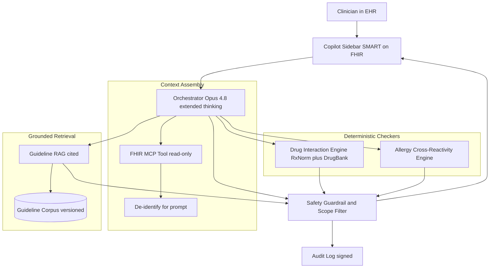
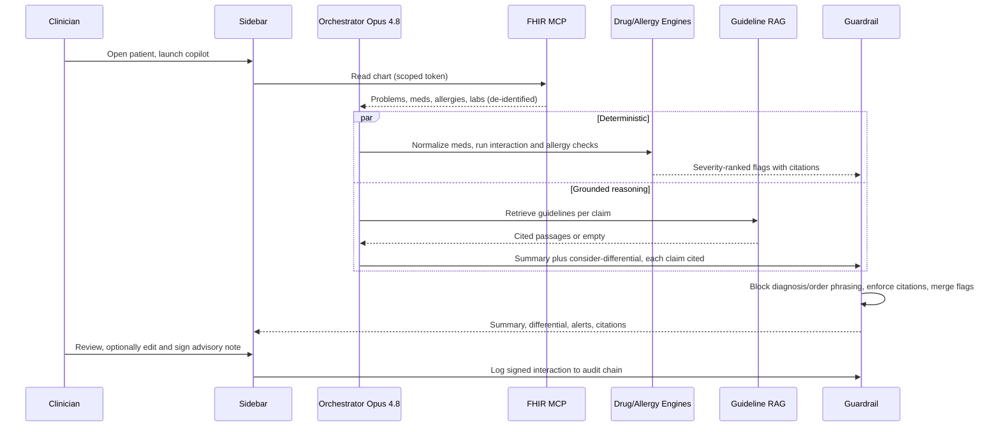

# Case Study: Clinical Decision Support Copilot

A regional health system embeds a copilot inside the EHR that summarizes a patient's chart, surfaces cited evidence-based guidelines, suggests a differential to consider, and runs deterministic drug-interaction and allergy checks. It is decision support, not autonomous diagnosis: the clinician decides, the tool informs and cites, and every clinical claim traces back to a source the clinician can independently review.

## The Business Problem

A 12-hospital health system runs Epic across 4,000 clinicians. Attendings and residents spend large fractions of a visit reconciling a fragmented chart, and missed drug interactions and stale guideline adherence drive both harm and malpractice exposure. The CMIO sponsors a copilot that does four things inside the existing EHR: summarize the patient's relevant history, pull current guidelines with citations, propose a differential to consider, and flag interactions and allergies. The explicit non-goal is diagnosing or ordering anything autonomously.

Constraints from the June 2026 reality:

- PHI never leaves the BAA boundary. Inference runs on Claude Opus 4.8 under an Anthropic Business Associate Agreement with zero data retention, or on an on-prem Llama 4 fallback for the highest-sensitivity service lines ([HHS HIPAA Security Rule](https://www.hhs.gov/hipaa/for-professionals/security/index.html)).
- The product must stay inside the FDA Clinical Decision Support exemption: clinician-facing, transparent basis, independently reviewable, not a primary device for time-critical decisions ([FDA CDS guidance, Sept 2022](https://www.fda.gov/regulatory-information/search-fda-guidance-documents/clinical-decision-support-software)).
- Clinicians abandon tools with high false-alarm rates. Existing EHR interaction alerts are overridden 49 to 96 percent of the time; alert fatigue is the dominant failure of this product class ([Ancker et al., BMC Med Inform Decis Mak 2017](https://bmcmedinformdecismak.biomedcentral.com/articles/10.1186/s12911-017-0430-8)).
- LLMs confabulate plausible drugs, doses, and citations. Studies of GPT-class models on clinical reasoning show useful recall but unsafe error rates when ungrounded ([Goh et al., JAMA Network Open 2024](https://jamanetwork.com/journals/jamanetworkopen/fullarticle/2825395)).
- Guidelines change. A copilot citing a superseded ACC/AHA or IDSA recommendation is a liability, so freshness of the retrieval corpus is a first-class SLO.
- Integration is read-mostly through FHIR R4; the copilot reads the chart and writes nothing back except an optional advisory note the clinician must sign ([HL7 FHIR R4](https://hl7.org/fhir/R4/)).

## Architecture

### Components

| Layer | Tech | Purpose |
|-------|------|---------|
| EHR surface | SMART on FHIR sidebar in Epic | Clinician-in-the-loop UI with citations |
| Orchestrator | Claude Opus 4.8, extended thinking | Reasoning, summarization, differential framing |
| EHR access | FHIR R4 MCP tool, read-only scopes | Pull chart, meds, problems, labs |
| De-identification | Presidio plus Safe Harbor pass | Minimize PHI sent to the model |
| Drug interactions | RxNorm normalization plus DrugBank rules | Deterministic, not LLM-guessed |
| Allergy checks | Cross-reactivity table plus RxNorm class map | Deterministic allergy and class alerts |
| Guideline RAG | Versioned corpus, hybrid retrieval, rerank | Grounded, cited clinical claims |
| Guardrail | Scope filter plus output classifier | Block diagnosis/order phrasing, enforce CDS line |
| Audit | Append-only store, SHA-256 chain | Regulatory and malpractice record |

### Data flow

1. The clinician opens a patient and launches the copilot sidebar; SMART on FHIR mints a context token scoped to that encounter and that clinician's permissions.
2. The FHIR MCP tool pulls the active problem list, medications, allergies, recent labs, and relevant notes, read-only.
3. A de-identification pass strips Safe Harbor identifiers before any text reaches the model; internal record IDs are tokenized so results can be re-linked locally.
4. The medication list is sent to the deterministic interaction and allergy engines in parallel with the LLM call; these do not pass through the LLM.
5. Opus 4.8 with extended thinking summarizes the chart and drafts a differential to consider; each clinical claim is grounded by a retrieval call into the versioned guideline corpus and carries a citation.
6. The guardrail inspects the draft: it blocks autonomous-diagnosis and order phrasing, verifies every clinical assertion carries a citation, and merges in the deterministic interaction and allergy alerts (which always take precedence over model text).
7. The sidebar renders the summary, the "consider" differential with evidence and counter-evidence, the cited guidelines, and any hard interaction or allergy flags, with one-tap links to source.
8. Nothing is written to the chart unless the clinician edits and signs an advisory note; the full interaction, citations, and checker outputs are written to the signed audit log.

## Key Design Decisions

### 1. Decision support, not autonomous diagnosis

This is the regulatory and ethical line, and it dictates the whole design. To stay inside the FDA's non-device CDS exemption, the software must display its basis so the clinician can independently review it rather than rely on it ([FDA CDS guidance](https://www.fda.gov/regulatory-information/search-fda-guidance-documents/clinical-decision-support-software); [21st Century Cures Act 520(o)(1)(E)](https://www.congress.gov/bill/114th-congress/house-bill/34)). Concretely: the copilot never says "the patient has X" or "order Y." It says "consider X; supporting evidence here; against here," and it surfaces guidelines rather than directives. It also defers entirely on time-critical decisions (a copilot that drives an emergency action would become a regulated device). We treat the exemption criteria as product acceptance tests, not legal afterthoughts.

### 2. Ground every clinical claim in cited guidelines, never model memory

The model's parametric knowledge is treated as untrusted for any clinical assertion. Every recommendation, dose range, or diagnostic criterion must come from a retrieval hit in the versioned corpus (UpToDate-style summaries, society guidelines such as [ACC/AHA](https://www.acc.org/guidelines) and [IDSA](https://www.idsociety.org/practice-guideline/practice-guidelines/), and primary literature). If retrieval returns nothing relevant, the copilot says so rather than filling the gap from memory. This is standard grounded RAG discipline, applied with zero tolerance because the cost of a confabulated dose is patient harm. See [RAG Fundamentals](../06-retrieval-systems/01-rag-fundamentals.md).

### 3. Deterministic drug-interaction and allergy checks, never LLM-guessed

Interaction and allergy logic does not go through the LLM at all. Medications are normalized to [RxNorm](https://www.nlm.nih.gov/research/umls/rxnorm/index.html) concept IDs, then evaluated against a curated rules database ([DrugBank interaction data](https://go.drugbank.com/)) and an allergy cross-reactivity table (for example, penicillin-to-cephalosporin class risk). The output is deterministic, reproducible, and auditable, with a severity and a citation per rule. The LLM may explain a flagged interaction in plain language, but it can neither create nor suppress a flag. This separation is what lets us defend the system: a regulator or a defense attorney can re-run the checker and get the identical result.

### 4. Alert fatigue: precision over recall on alerts, or clinicians disable it

We deliberately tune surfaced alerts for precision. The literature is unambiguous that low-specificity alerts get overridden into oblivion and the whole tool gets ignored ([Ancker et al. 2017](https://bmcmedinformdecismak.biomedcentral.com/articles/10.1186/s12911-017-0430-8); [Backman et al., 2017](https://bmjopen.bmj.com/content/7/3/e013647)). We tier alerts by severity and patient context, suppress known-benign combinations the clinician has already accepted, and only interrupt for high-severity, high-confidence findings. Lower-tier information sits passively in the sidebar. We track override rate as a product health metric; an override rate climbing toward EHR baselines means we are failing.

### 5. PHI handling: BAA inference, de-identification, and audit

PHI exposure is minimized at every hop. We send the model only what the task needs, de-identified via Microsoft Presidio plus a Safe Harbor rule pass, and run inference under an Anthropic BAA with zero retention, or fully on-prem for behavioral health and other sensitive lines ([HHS HIPAA](https://www.hhs.gov/hipaa/for-professionals/security/index.html)). Every access is logged with clinician identity, encounter, tools called, retrieval citations, and checker results, in an append-only SHA-256 chained store for breach investigation and the 6-year HIPAA retention requirement.

### 6. The differential is framed as "consider," with evidence and counter-evidence

The differential is presented as a ranked list of conditions to consider, each with supporting findings from the chart, contradicting findings, and the guideline that defines the diagnostic criteria. Showing counter-evidence is both a safety feature (it fights anchoring) and an exemption feature (it makes the basis reviewable). Opus 4.8's extended thinking is well suited here because the visible reasoning, once grounded and citation-checked, becomes the explanation the clinician audits ([Anthropic extended thinking](https://docs.anthropic.com/en/docs/build-with-claude/extended-thinking)).

### 7. Eval against clinician ground truth, not LLM-judge alone

We do not certify safety with an LLM judge. A standing panel of attending physicians scores copilot outputs against adjudicated ground truth, and we report sensitivity and specificity for interaction detection and for differential relevance, plus citation-faithfulness rates. We also benchmark on public sets (MedQA and the more realistic [HealthBench](https://openai.com/index/healthbench/)) for regression tracking, but the release gate is the clinician panel. LLM-judge scoring is used only for cheap pre-screening between panel cycles.

### 8. Handle uncertainty honestly: say "insufficient evidence"

When the chart is ambiguous or the guideline corpus does not cover the scenario, the copilot is built to say "insufficient evidence to suggest a differential" rather than produce a confident guess. We measure and reward calibrated abstention; a copilot that is right when confident and silent when unsure earns clinician trust, which is the scarce resource here.

### 9. Where the tool must defer entirely

There are zones the copilot refuses by policy: active emergencies and codes (deferral keeps us out of device regulation and away from acting in the critical path), neonatal and weight-based pediatric dosing edge cases (the error surface is too unforgiving), and any oncology chemotherapy dosing, which routes to the dedicated regulated system. In these zones the copilot shows a hard "out of scope, defer to clinical judgment and specialist systems" message instead of a suggestion.

## Failure Modes and Mitigations

### F1: Hallucinated drug, dose, or guideline

The model invents a plausible but wrong dose or cites a nonexistent guideline. Mitigation: clinical assertions must resolve to a retrieval hit (Decision 2); a citation-faithfulness classifier rejects any drafted claim whose citation does not support it; doses are surfaced from the guideline text and the RxNorm-linked reference, never free-generated. Unsupported claims are dropped before render.

### F2: Autonomous-sounding recommendation crossing the SaMD line

The copilot phrases output as a directive ("start vancomycin 1g IV q12h"), which both endangers the patient and converts the product into a regulated device. Mitigation: the guardrail output classifier blocks imperative diagnosis and order phrasing and rewrites to "consider, per [guideline]"; release tests include adversarial prompts trying to elicit directive language, and the [FDA exemption criteria](https://www.fda.gov/regulatory-information/search-fda-guidance-documents/clinical-decision-support-software) are encoded as failing tests.

### F3: Alert fatigue from false positives

Low-value interaction alerts train clinicians to dismiss everything, including the dangerous one. Mitigation: precision-first tiering, contextual suppression of accepted benign combinations, passive display for low severity, and continuous monitoring of override rate against the [published EHR baselines](https://bmcmedinformdecismak.biomedcentral.com/articles/10.1186/s12911-017-0430-8) (Decision 4).

### F4: Missed critical interaction (false negative)

A genuinely dangerous interaction is not flagged. Mitigation: the deterministic engine is tuned for high recall on the high-severity tier specifically (we accept more low-tier noise in exchange for near-complete high-severity coverage), the rules database is updated on the [DrugBank](https://go.drugbank.com/) release cadence, and the clinician panel red-teams known dangerous pairs every release. False negatives on the high-severity tier are a launch-blocking defect.

### F5: PHI leak

Identifiable data escapes the BAA boundary, into a log, a prompt sent to an unapproved endpoint, or the sidebar of the wrong patient. Mitigation: de-identification before the model (Decision 5), BAA-only or on-prem inference, encounter-scoped tokens that bind output to one patient, PHI-aware log scrubbing, and breach-response runbooks tied to the [HHS Breach Notification Rule](https://www.hhs.gov/hipaa/for-professionals/breach-notification/index.html).

### F6: Bias across demographics

Suggestions or risk framing skew by race, sex, or age, repeating known harms such as race-adjusted eGFR or pulse-oximetry bias. Mitigation: subgroup evaluation in the clinician panel (sensitivity and specificity reported per demographic stratum), removal of discredited race-based adjustments from the corpus, and tracking against frameworks like the [NIST AI Risk Management Framework](https://www.nist.gov/itl/ai-risk-management-framework). Disparities above threshold block release.

### F7: Stale guideline after an update

A society updates a guideline and the copilot keeps citing the superseded version. Mitigation: the corpus is versioned with effective dates, retrieval prefers the current version and flags superseded matches, a freshness SLO alerts when any high-traffic guideline is older than its known revision, and a curation team reconciles against society publication feeds.

### F8: Over-reliance and automation bias by a rushed clinician

A busy clinician accepts the suggestion without checking the basis, which is exactly the automation-bias trap. Mitigation: friction by design (the advisory note requires a signature, the differential leads with counter-evidence, and citations are one tap away), plus periodic in-app reminders of the support-not-decision framing. We monitor sign-without-citation-view rates as an automation-bias signal ([Goddard et al., JAMIA 2012](https://academic.oup.com/jamia/article/19/1/121/732845)).

## Operational Considerations

### Monitoring and SLOs

| SLO | Target |
|-----|--------|
| Sidebar render p95 latency | under 6 s |
| Citation faithfulness (claims with supporting source) | over 98 percent |
| High-severity interaction recall (vs panel ground truth) | over 99 percent |
| Alert override rate | under 30 percent and not rising |
| Guideline corpus freshness lag | under 14 days from publication |
| PHI leak incidents | zero |
| Calibrated abstention on out-of-corpus cases | over 90 percent abstain correctly |

### Cost model

At 4,000 clinicians, roughly 60 percent active daily, about 8 copilot invocations per active clinician per day:

- Model spend (Opus 4.8, extended thinking, long charts): $42,000 per month
- Guideline retrieval and reranking: $3,500 per month
- Deterministic checker licensing (RxNorm free, DrugBank commercial): $4,000 per month
- De-identification and audit storage: $2,500 per month
- Clinician eval panel (adjudication time): $9,000 per month
- Total: roughly $61,000 per month, about $0.13 per invocation

Extended thinking and long chart context dominate spend; we cap the chart window to relevant resources and cache the guideline corpus retrievals to keep per-invocation cost near $0.13.

### On-call playbook

- Citation faithfulness drop below 98 percent: freeze the differential and summary features (keep deterministic checkers live), page the ML on-call, and investigate corpus or classifier regression.
- High-severity interaction miss reported: treat as a sev-1 patient-safety event, snapshot the rule version, notify the CMIO and patient-safety officer, and run the breach-of-trust runbook.
- Suspected PHI leak: invoke the [HIPAA breach](https://www.hhs.gov/hipaa/for-professionals/breach-notification/index.html) runbook, isolate the offending path, and preserve audit chain segments for forensics.
- Stale-guideline alert: pull the superseded version from retrieval immediately, push the updated version, and post a clinician banner noting the change.
- Override rate spike: pause the lowest-value alert tier, review with the clinical informatics committee before re-enabling.

### Governance and audit

A clinical governance committee (CMIO, pharmacy, patient safety, legal) reviews the copilot quarterly: panel sensitivity and specificity by subgroup, override and abstention trends, citation-faithfulness, the corpus change log, and any safety events. We retain signed audit traces for 6 years per HIPAA and produce them on request. See [AI Governance and Compliance](../13-reliability-and-safety/04-ai-governance-and-compliance.md).

## What Strong Interview Candidates Cover

- They place the FDA CDS exemption at the center and explain why "consider with reviewable basis" keeps the product a non-device, citing the independent-review criterion.
- They separate deterministic checkers (RxNorm plus DrugBank) from the LLM and explain that interaction and allergy logic must be reproducible and auditable, never model-guessed.
- They treat parametric knowledge as untrusted and ground every clinical claim in a versioned, cited corpus, with honest abstention when retrieval is empty.
- They name alert fatigue as the dominant failure of this product class and choose precision over recall on surfaced alerts, with override rate as a health metric.
- They handle PHI concretely: de-identification, BAA or on-prem inference, encounter-scoped tokens, and a signed audit chain.
- They evaluate against a clinician panel with sensitivity and specificity by subgroup, not an LLM judge alone, and treat high-severity false negatives and demographic disparities as launch blockers.
- They name the zones the tool must refuse entirely (emergencies, neonatal and pediatric weight-based dosing, chemotherapy) and explain that deferral is both safety and regulatory strategy.

## References

- FDA, [Clinical Decision Support Software guidance (Sept 2022)](https://www.fda.gov/regulatory-information/search-fda-guidance-documents/clinical-decision-support-software)
- U.S. Congress, [21st Century Cures Act (H.R.34)](https://www.congress.gov/bill/114th-congress/house-bill/34)
- HHS, [HIPAA Security Rule](https://www.hhs.gov/hipaa/for-professionals/security/index.html)
- HHS, [HIPAA Breach Notification Rule](https://www.hhs.gov/hipaa/for-professionals/breach-notification/index.html)
- HL7, [FHIR R4 specification](https://hl7.org/fhir/R4/)
- NLM, [RxNorm](https://www.nlm.nih.gov/research/umls/rxnorm/index.html)
- [DrugBank drug-interaction data](https://go.drugbank.com/)
- Goh et al., [LLMs in clinical reasoning, JAMA Network Open 2024](https://jamanetwork.com/journals/jamanetworkopen/fullarticle/2825395)
- Ancker et al., [Alert fatigue and override rates, BMC MIDM 2017](https://bmcmedinformdecismak.biomedcentral.com/articles/10.1186/s12911-017-0430-8)
- Goddard et al., [Automation bias in clinical decision support, JAMIA 2012](https://academic.oup.com/jamia/article/19/1/121/732845)
- OpenAI, [HealthBench medical evaluation](https://openai.com/index/healthbench/)
- NIST, [AI Risk Management Framework](https://www.nist.gov/itl/ai-risk-management-framework)
- Anthropic, [Extended thinking](https://docs.anthropic.com/en/docs/build-with-claude/extended-thinking)

Related chapters: [AI Governance and Compliance](../13-reliability-and-safety/04-ai-governance-and-compliance.md), [RAG Fundamentals](../06-retrieval-systems/01-rag-fundamentals.md), [Case Study: Voice AI in Healthcare](13-voice-ai-healthcare.md).
