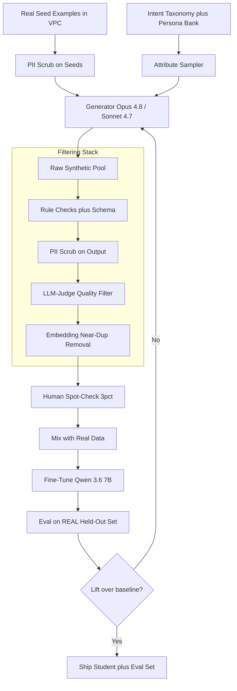
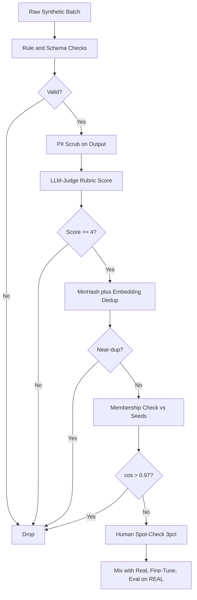

# Case Study: Synthetic Data Generation Pipeline

An AI team needs training and eval data for a domain where real labeled data is scarce, private, or expensive. They build a pipeline that generates synthetic examples with Opus 4.8 and Sonnet 4.7, then aggressively filter, dedup, and validate against real seeds, so a fine-tuned 7B classifier and a held-out eval set actually improve on the real task. This is the sibling of the [Customer Distillation Pipeline](19-customer-distillation-pipeline.md): there the teacher labels real traces, here the generator manufactures new inputs.

## The Business Problem

A fintech support team is building an intent classifier for a regulated product (loan servicing, dispute handling, hardship requests). Real labeled data is thin: roughly 40 intents, but 12 of them appear fewer than 30 times in six months of logs, and the most sensitive conversations cannot be exported to a labeling vendor. The team needs about 8K balanced examples per intent to fine-tune a Qwen 3.6 7B classifier and a 1,500-case eval set, and human-only labeling would cost more than $90K and take a quarter. Synthetic generation looks like the lever, but only if the synthetic distribution matches reality.

Constraints from the June 2026 reality:

- 12 of 40 intents have under 30 real examples; the long tail is the whole point of the project.
- The most sensitive transcripts (PII, account numbers, hardship disclosures) cannot leave the VPC, so the generator must run on real seeds without echoing them verbatim.
- Quality bar: the fine-tuned student must beat the few-shot Opus 4.8 baseline on a real held-out set, not on synthetic data.
- Budget: under $6K total for generation plus filtering, against the $90K human-labeling alternative.
- Compliance: an auditor must be able to confirm no real customer PII appears in any synthetic training row.
- Model-collapse risk: the team cannot recursively train on unfiltered AI output, which degrades over generations.

The approach is grounded in a decade of instruction-data synthesis: Self-Instruct ([Wang et al., 2022](https://arxiv.org/abs/2212.10560)), Alpaca ([Taori et al., 2023](https://github.com/tatsu-lab/stanford_alpaca)), and Evol-Instruct ([Xu et al., 2023](https://arxiv.org/abs/2304.12244)), plus the "Textbooks Are All You Need" result that curated synthetic data can punch above its weight ([Gunasekar et al., 2023](https://arxiv.org/abs/2306.11644)). The hard constraint is Shumailov et al.'s model-collapse finding ([Nature, 2024](https://www.nature.com/articles/s41586-024-07566-y)): train recursively on generated data and the tails vanish.

## Architecture

### Components

| Layer | Tech | Purpose |
|-------|------|---------|
| Seeds | Real transcripts, scrubbed, in-VPC | Anchor the distribution |
| Attribute sampler | Taxonomy plus persona bank (YAML) | Coverage and diversity |
| Generator | Opus 4.8 (hard intents), Sonnet 4.7 (bulk) | Produce candidate rows |
| Rule and schema filter | Pydantic plus regex | Reject malformed and off-label |
| PII scrub | Microsoft Presidio plus fine-tuned NER | No leaked identities |
| LLM-judge filter | Sonnet 4.7 rubric scorer | Reject low-quality and off-distribution |
| Dedup | `bge-large` embeddings plus MinHash | Kill near-duplicates |
| Trainer | LoRA on Qwen 3.6 7B, 1x H100 | Student classifier |
| Eval gate | Real held-out set, 1,500 cases | The only metric that counts |

### Data flow

1. The team pulls a stratified sample of real seeds per intent and runs a PII scrub on them before they touch the generator prompt.
2. The attribute sampler draws a persona (channel, sentiment, financial literacy, locale) and a taxonomy node, so each generation request is constrained to one intent and one persona combination.
3. The generator gets 3 to 5 scrubbed seed examples plus the sampled attributes and produces a structured batch (typically 20 candidates per call) at temperature 0.9 for diversity.
4. Rule checks enforce the schema, length bounds, language, and that the stated intent label is one of the 40 valid intents; malformed rows are dropped.
5. A second PII scrub runs on the generated output to catch any memorized or hallucinated real-looking identifiers.
6. An LLM-judge scores each candidate against a rubric (realism, label correctness, on-distribution) on a 1 to 5 scale; only 4 and 5 survive (rejection sampling).
7. Embedding near-dup removal drops candidates within cosine 0.92 of an existing kept row, enforcing diversity and a per-intent count cap.
8. A 3 percent human spot-check audits the survivors; the cleaned set is mixed with all available real data and used to fine-tune the student, which is then judged only on the real held-out eval set.

## Key Design Decisions

### 1. Anchor generation to real seed data so the distribution matches

Pure prompt-only synthesis drifts toward a clean, textbook register that real customers never use. Our first batch (no seeds) scored 91 percent on a synthetic eval but only 68 percent on real traffic, the same trap the distillation case study hit with synthetic prompts. We switched to seeded generation: every request carries 3 to 5 real (scrubbed) examples of the target intent, and the prompt instructs the model to match their tone, length, and messiness (typos, partial sentences, code-switching). Seeded generation closed the real-eval gap to 4 points. The seeds are the distribution anchor; without them you are sampling the model's prior, not the customer's reality.

### 2. Diversity and coverage controls to avoid same-y data

A naive loop produces thousands of near-identical "I want to dispute a charge" rows. We force diversity three ways. First, a taxonomy: 40 intents x sub-reasons, and the sampler tracks per-cell counts so under-filled cells get prioritized (active coverage, not random). Second, a persona bank: channel (chat, email, phone transcript), sentiment, financial literacy, and locale (en-US, es-US, Spanglish), sampled per request, the persona-conditioning idea from Persona-Hub ([Chan et al., 2024](https://arxiv.org/abs/2406.20094)). Third, temperature 0.9 with explicit "make this different from the seeds" instructions. Coverage is a tracked metric: we do not ship until every taxonomy cell has at least 200 surviving rows.

### 3. Quality filtering with rules, an LLM-judge, and human spot-check

Generation is cheap; bad data is expensive, so we over-generate and reject hard. Three gates in series. Rule checks (schema, length, valid label, language ID) are nearly free and catch 8 to 12 percent. The LLM-judge (Sonnet 4.7 against a 4-criterion rubric) is the workhorse: it scores realism, label correctness, policy compliance, and on-distribution fit, and we keep only 4-and-5 rows, which rejects another 20 to 30 percent. A 3 percent human spot-check on survivors validates that the judge is calibrated; when human-judge agreement drops below 90 percent we re-tune the rubric. Net yield from raw generation to shippable is about 55 to 65 percent. This rejection-sampling discipline is what separates useful synthetic data from noise ([Liu et al. data-quality survey, 2024](https://arxiv.org/abs/2406.15126)).

### 4. Avoiding model collapse

Model collapse is the failure mode that kills naive synthetic pipelines: train a model on its own (or another model's) unfiltered output, use that model to generate the next batch, and over generations the tails disappear and the distribution narrows to the mean ([Shumailov et al., 2024](https://www.nature.com/articles/s41586-024-07566-y)). We avoid it with three rules. We never feed the fine-tuned student's output back as training data. We keep every available real example in the training mix as a distribution anchor (real data does not collapse). And we re-seed every generation run from real transcripts, not from prior synthetic batches, so each generation is grounded in human data rather than the previous model's guesses. The filtering stack also helps: aggressive dedup and the on-distribution judge directly counter the variance loss that drives collapse. We treat "fraction of training tokens that are real" as a tracked guardrail and keep it above 15 percent.

### 5. Dedup via embeddings and MinHash

Even with diversity controls, generators repeat themselves. We embed every candidate with `bge-large` and drop any row within cosine 0.92 of a kept row using a FAISS index, plus a cheaper MinHash/LSH pass ([Broder, 1997](https://dl.acm.org/doi/10.5555/829502.830043)) to catch exact and near-exact lexical duplicates before the embedding step. Dedup is not optional polish: an undeduplicated set was 31 percent near-duplicates, which both wastes the diversity budget and inflates eval scores when a dup straddles train and eval. We tune the threshold per intent; rare intents tolerate 0.94, common ones use 0.90.

### 6. PII and safety scrubbing of generated data

Two scrub passes, because the generator can both echo a memorized seed identifier and hallucinate a real-looking one. Microsoft Presidio ([docs](https://microsoft.github.io/presidio/)) plus a fine-tuned NER model flag spans (names, account numbers, SSNs, emails, addresses) and replace them with category tokens (`[ACCOUNT]`, `[PERSON]`). The redaction model is held to precision over 98 percent and recall over 95 percent on a labeled sample. We also run a membership check: any synthetic row with cosine over 0.97 to a real seed is dropped as a likely near-copy, addressing the memorization risk that the privacy literature flags for generative models ([Carlini et al., 2021](https://arxiv.org/abs/2012.07805)). The auditor gets the scrub config, the NER eval numbers, and the membership-check log.

### 7. The downstream-eval loop is the only metric that matters

Synthetic data is worthless unless it lifts the real task. The eval set is built from real held-out transcripts, labeled by 3 domain experts with majority vote, and it is never generated and never seen by the generator or the judge. The loop: fine-tune on the current synthetic mix, evaluate on the real set, and only iterate the generation prompts if real F1 improves. We track macro-F1 (so rare intents count) against the few-shot Opus 4.8 baseline; the project ships only when the 7B student beats that baseline on real data. Intermediate synthetic-eval scores are diagnostics, not goals; optimizing them directly is how teams fool themselves.

### 8. Synthetic-to-real mixing ratio

We do not train on synthetic data alone. We sweep the mixing ratio and measure real-eval F1: all-synthetic underperforms, and the curve peaks around 70 percent synthetic / 30 percent real for common intents, while rare intents (almost no real data) lean closer to 90 percent synthetic with the few real examples heavily upsampled. Real data is the anchor that keeps the student on the true distribution; synthetic data provides the volume and tail coverage. The ratio is per-intent, not global, and it is itself a tuned hyperparameter validated on the real eval set.

### 9. When synthetic data is the wrong answer

Synthetic generation is not free and not always right. Signals against it. If you can get real data at reasonable cost, get it: real labeled examples beat synthetic on the same budget almost every time. If the domain is too nuanced to fake (specialist medical reasoning, adversarial fraud patterns that adapt to your defenses, anything where the model's prior is wrong in ways you cannot detect), the generator will confidently produce plausible-but-wrong data and you will not catch it without the very expertise you lack. If you need eval data specifically, lean toward real held-out data; a synthetic eval can be contaminated and can flatter a model that merely matches the generator's style. Our screen: synthetic helps when the task is well-specified, the failure is data scarcity rather than concept difficulty, and you have at least a few hundred real examples to seed and validate against. If those fail, spend on human labeling instead.

## Failure Modes and Mitigations

### F1: Distribution mismatch (great on synthetic, bad on real)

The student aces a synthetic eval and fails on real traffic because the synthetic register is too clean. Mitigation: seeded generation anchored to real transcripts (Decision 1), a "messiness" instruction in the prompt, and the rule that the only ship gate is real-eval F1 (Decision 7). We watch the synthetic-minus-real F1 gap and treat anything over 5 points as a distribution alarm.

### F2: Model collapse over generations

Recursive training on AI output narrows the distribution and erases the tails. Mitigation: never feed student output back as training data, always keep real data in the mix above 15 percent of tokens, and re-seed every run from real transcripts rather than prior synthetic batches (Decision 4). We monitor per-intent embedding variance across generations; a steady drop is the early signal.

### F3: Low diversity / near-duplicate flood

The generator repeats a handful of templates, inflating counts without information. Mitigation: taxonomy and persona sampling (Decision 2), temperature 0.9, and embedding plus MinHash dedup (Decision 5). We track effective sample size (unique embeddings after dedup divided by raw count) and alarm when yield drops below 60 percent.

### F4: Generator leaks PII or memorized data

The model echoes a memorized real identifier or reproduces a seed near-verbatim. Mitigation: dual PII scrub (on seeds and on output) with a redaction model at over 98 percent precision, plus a membership check dropping rows within cosine 0.97 of any seed (Decision 6). The auditor receives the scrub logs and the NER eval report.

### F5: Biased synthetic data amplifies bias

The generator over-represents a demographic register or skews sentiment, and the student inherits and amplifies it. Mitigation: persona sampling enforces balance across locale and channel; we run a slice analysis on the real eval set by locale and language and block ship if any slice underperforms the macro average by more than 4 points. Bias in synthetic data is a known and studied risk ([Wyllie et al. on bias amplification, 2024](https://arxiv.org/abs/2410.04840)).

### F6: Label noise from the generator

The generator assigns the wrong intent to a plausible-looking message. Mitigation: the LLM-judge scores label correctness explicitly, the human spot-check measures the residual label-error rate (target under 3 percent), and disputed rows are dropped rather than corrected. A noisy intent triggers a rubric tightening for that intent.

### F7: Eval-set contamination (synthetic eval overlaps training)

A synthetic row leaks into both train and eval, inflating the score. Mitigation: the eval set is 100 percent real and built before generation, and a contamination pass checks every eval case against the training pool by embedding and exact match, dropping any training row within cosine 0.95 of an eval case. We re-run the contamination check on every training-set rebuild.

### F8: Over-spend on generation that does not lift the metric

The team burns budget generating millions of rows that never move real F1. Mitigation: the downstream-eval loop gates spend (Decision 7); we generate in rounds of about 20K rows, measure real-eval lift, and stop a generation track that shows under 0.5 F1 points of marginal lift. A per-round budget alarm fires at $1.5K.

## Operational Considerations

### Monitoring

| SLO | Target |
|-----|--------|
| Real-eval macro-F1 vs Opus 4.8 few-shot baseline | beat baseline before ship |
| Synthetic-minus-real F1 gap | under 5 points |
| Filter yield (raw to shippable) | 55 to 65 percent |
| Near-dup rate after dedup | under 3 percent |
| Human-judge agreement on spot-check | over 90 percent |
| PII leak rate in shipped rows | 0 confirmed, audited per batch |
| Per-intent coverage (taxonomy cells filled) | 100 percent at over 200 rows |

### Cost model

For 320K raw candidates yielding about 200K shippable rows across 40 intents:

- Generation (Sonnet 4.7 bulk plus Opus 4.8 on the 12 hard intents): $2,600 one-time
- LLM-judge filtering (Sonnet 4.7): $900 one-time
- Embedding plus dedup (`bge-large`, in-house GPU): $150 one-time
- PII scrub compute (Presidio plus NER): $200 one-time
- Human spot-check (3 percent, domain experts): $1,400 one-time
- Fine-tune (LoRA on Qwen 3.6 7B, 1x H100, about 10 hours): $250 one-time
- Total: about $5,500 against a $90K human-labeling alternative

Per-batch pricing follows the current published rates: Sonnet 4.7 and Opus 4.8 on the [Anthropic pricing page](https://www.anthropic.com/pricing); we cut generation cost about 40 percent using the Batch API and prompt caching on the shared seed-and-instruction prefix.

### On-call playbook

- Real-eval regression on a new batch: freeze the batch, diff the generation prompt against the last good version, replay the real eval, and roll back the prompt if the gap exceeds 5 points.
- Diversity collapse: pull the effective-sample-size dashboard; if yield is below 60 percent, raise temperature, widen persona sampling, and refresh the seed pool from new real transcripts.
- PII leak found in audit: quarantine the batch immediately, re-run both scrub passes with a tightened config, and report the incident with the membership-check log.
- Judge miscalibration (human agreement under 90 percent): pause filtering, re-tune the rubric on a fresh human-labeled sample, and re-score the affected batch.
- Contamination hit: retire the leaked eval case, run the dedup-versus-eval pass over the whole training pool, and refresh the eval set within the quarter.

## What Strong Interview Candidates Cover

- They distinguish generating new inputs (this case) from labeling real traces (the distillation case study) and say when each fits.
- They anchor generation to real seeds and explain that pure synthetic data drifts off the real distribution, with the real-eval gap as evidence.
- They name model collapse by the Shumailov result and give the concrete defenses: no recursive training, keep real data in the mix, re-seed from real data.
- They treat filtering as a series of gates (rules, LLM-judge, dedup, human spot-check) and quote a realistic yield, not "the model generates clean data".
- They insist the only ship gate is a real held-out eval, and they call out eval contamination and synthetic-eval flattery explicitly.
- They handle PII with dual scrubbing and a membership check, and they can talk to an auditor about it.
- They say when synthetic data is the wrong answer (real data is available, the domain is too nuanced, or you need a trustworthy eval set).

## References

- Shumailov et al., [AI models collapse when trained on recursively generated data (Nature, 2024)](https://www.nature.com/articles/s41586-024-07566-y)
- Wang et al., [Self-Instruct: Aligning Language Models with Self-Generated Instructions](https://arxiv.org/abs/2212.10560)
- Taori et al., [Stanford Alpaca: An Instruction-following LLaMA model](https://github.com/tatsu-lab/stanford_alpaca)
- Xu et al., [WizardLM: Evol-Instruct for complex instruction synthesis](https://arxiv.org/abs/2304.12244)
- Gunasekar et al., [Textbooks Are All You Need (Phi)](https://arxiv.org/abs/2306.11644)
- Chan et al., [Scaling Synthetic Data Creation with 1B Personas (Persona-Hub)](https://arxiv.org/abs/2406.20094)
- Liu et al., [A survey on data quality for synthetic and curated training data](https://arxiv.org/abs/2406.15126)
- Carlini et al., [Extracting Training Data from Large Language Models](https://arxiv.org/abs/2012.07805)
- Broder, [On the resemblance and containment of documents (MinHash)](https://dl.acm.org/doi/10.5555/829502.830043)
- Wyllie et al., [Fairness Feedback Loops and bias amplification in synthetic data](https://arxiv.org/abs/2410.04840)
- Microsoft, [Presidio PII detection and anonymization](https://microsoft.github.io/presidio/)
- Anthropic, [Model pricing](https://www.anthropic.com/pricing)

Related chapters: [Knowledge Distillation](../03-training-and-adaptation/05-knowledge-distillation.md), [Data Engineering for AI](../06-retrieval-systems/15-data-engineering-for-ai.md), [Case Study: Customer Distillation Pipeline](19-customer-distillation-pipeline.md).
