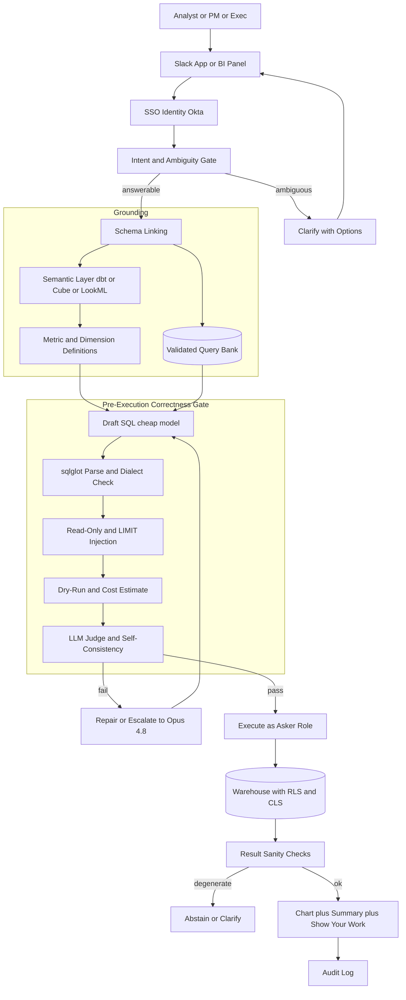
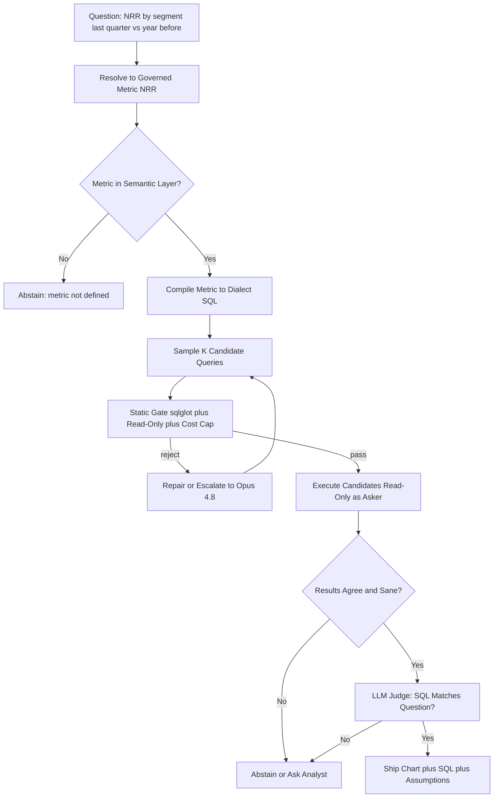
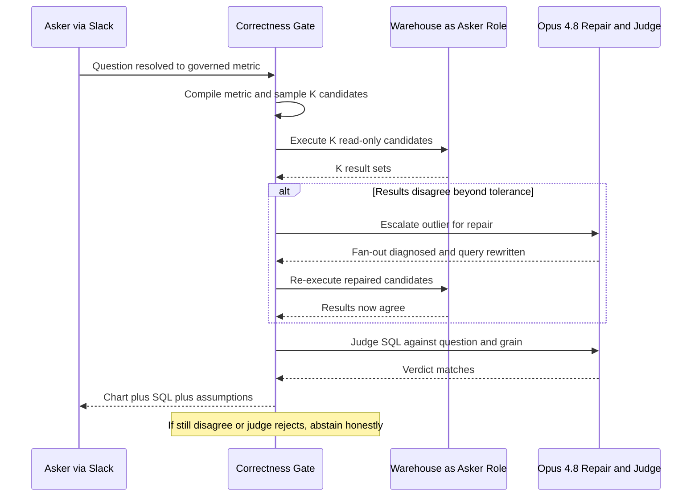

# Case Study: Conversational Analytics and Text-to-SQL BI Copilot

A data platform team at a 4,000-person company ships a natural-language analytics copilot: an analyst, PM, or exec asks "what was net revenue retention by segment last quarter versus the year before" in Slack or a BI tool, and the system writes SQL against Snowflake, BigQuery, or Databricks, runs it, and returns a chart plus a plain-English summary. The single hardest constraint is not coverage, it is that the system must **never return a confident wrong number**, because a hallucinated JOIN or a misread metric definition produces a plausible chart a VP acts on, which is strictly worse than "I don't know."

## The Business Problem

Every large company has a self-service analytics backlog. Analysts are a bottleneck, dashboards answer yesterday's question, and executives want an answer in Slack now. The obvious move is to point an LLM at the warehouse schema and let it write SQL. That naive design fails in the most dangerous way possible: it is fluent. It will happily `SUM` a raw `revenue` column, invent a JOIN that fans out and double-counts, read "last quarter" as calendar when finance means fiscal, and hand back a clean chart with a wrong number and no visible seam. Text-to-SQL over raw enterprise schemas is genuinely unsolved: on [Spider 2.0](https://arxiv.org/abs/2411.07763), which uses real warehouse databases and dialects, the best agentic method in the original evaluation solved only about 17 percent of tasks, and [BIRD](https://arxiv.org/abs/2305.03111) shows human experts near 93 percent execution accuracy while models trail far behind on realistic, dirty databases.

So the team inverts the objective. The product is not "answer any question." It is "answer the questions that map to governed metrics, verifiably correctly, and honestly abstain on the rest." The architecture that follows is built around three ideas: a **semantic layer** as the single source of truth for what every metric means, so the model composes blessed definitions instead of guessing SQL; a **pre-execution correctness gate** that treats generated SQL as a hypothesis to validate, not an answer to trust; and **execution under the asker's own identity**, so the copilot can never launder permissions.

This is deliberately not a RAG system. It does not retrieve passages and summarize them the way [Enterprise RAG](01-enterprise-rag.md) does over unstructured docs, and it is not a tool-calling knowledge agent reading across SaaS systems like the [MCP Knowledge Agent](20-mcp-knowledge-agent.md). Its core problem is query correctness over structured data behind a governed metric layer, and its defining failure mode is the silently-wrong number.

Constraints from the June 2026 reality:

- About 4,000 internal users (analysts, PMs, execs); a wrong number in an exec deck is worse than a refusal, so the product optimizes for verified-correct-or-abstain, not question coverage.
- The warehouse is Snowflake, BigQuery, or Databricks; queries cost real money and a single unbounded scan can burn hundreds of dollars, so cost guardrails (BigQuery [dry run](https://cloud.google.com/bigquery/docs/estimate-costs) plus [`maximum_bytes_billed`](https://cloud.google.com/bigquery/docs/best-practices-costs), Snowflake [resource monitors](https://docs.snowflake.com/en/user-guide/resource-monitors) plus `STATEMENT_TIMEOUT_IN_SECONDS`) are mandatory.
- Metrics are contested: "revenue," "active user," and "net revenue retention" each have exactly one blessed definition owned by finance and analytics; the copilot must compile that definition, not invent a `SUM`.
- Governance is absolute: [row-level](https://docs.snowflake.com/en/user-guide/security-row-intro) and [column-level](https://docs.snowflake.com/en/user-guide/security-column-intro) security must apply to the person asking, not a shared service account.
- Model canon: drafting on Claude Haiku 4.5 or [DeepSeek V4 Flash](https://api-docs.deepseek.com/); hard queries, repair, and verification on [Claude Opus 4.8](https://www.anthropic.com/claude/opus); served through an [AI gateway](../11-infrastructure-and-mlops/03-ai-gateways-and-model-routing.md) that routes by difficulty.
- Prior art validates the shape: Snowflake [Cortex Analyst](https://docs.snowflake.com/en/user-guide/snowflake-cortex/cortex-analyst) and Databricks [AI/BI Genie](https://docs.databricks.com/aws/en/genie/) both ground generation on a semantic model rather than raw DDL, for exactly these reasons.
- A read-only warehouse role and a validated query bank already exist, or must be built first; without a semantic layer, this project should not ship.

## Architecture



### Components

| Layer | Tech | Purpose |
|-------|------|---------|
| Surface | Slack app plus embedded BI panel | Where the question is asked and the chart is shown |
| Identity | Okta SSO plus warehouse OAuth token exchange | Bind every query to the real asker, not a service account |
| Ambiguity gate | Claude Haiku 4.5 classifier | Decide answerable, ambiguous, or out of scope |
| Semantic layer | dbt Semantic Layer (MetricFlow), Cube, or LookML | One blessed definition per metric and dimension |
| Schema linking | Vector store over table and column metadata | Retrieve only relevant entities, never the full DDL |
| Query bank | Curated validated question-to-SQL pairs | Few-shot grounding from queries known to be correct |
| Draft model | Claude Haiku 4.5 or DeepSeek V4 Flash | Cheap first-pass SQL or metric-query composition |
| Repair and verify model | Claude Opus 4.8 | Hard queries, self-repair, and the LLM judge |
| Static gate | [sqlglot](https://github.com/tobymao/sqlglot) parse plus optimizer | Dialect-aware AST validation, read-only enforcement |
| Cost gate | BigQuery dry run or Snowflake `EXPLAIN` | Estimate bytes and rows before spending compute |
| Execution | Read-only role with RLS and CLS | Run the query as the asker under warehouse governance |
| Verification | Deterministic result checks | Catch empty, null, and absurd-magnitude results |
| Cache and audit | Semantic cache plus append-only log | Cut cost and latency; record SQL, cost, and verdicts |

### Data flow

1. A user asks a question in Slack or the BI panel; SSO attaches the asker's identity and a warehouse token scoped to that person's roles.
2. The ambiguity gate classifies the question: answerable from governed metrics, ambiguous (needs a clarifying choice), or out of scope (abstain and say so).
3. Schema linking retrieves the candidate metrics and dimensions from the semantic layer plus the top-k validated example pairs from the query bank; the full warehouse DDL is never dumped into the prompt.
4. A cheap draft model composes a semantic-layer query (or SQL grounded to the retrieved metric definitions) rather than free-writing SQL over raw tables.
5. The semantic layer compiles the metric to dialect-specific SQL (MetricFlow, Cube, or LookML), so the grain, filters, and formula come from the registry, not the model.
6. The pre-execution gate runs: sqlglot parses and validates the SQL for the target dialect, confirms it is a single read-only `SELECT`, injects a `LIMIT`, and a dry run or `EXPLAIN` estimates bytes and rows; an LLM judge and a self-consistency check confirm the SQL actually answers the question. Any failure routes to repair or escalation to Opus 4.8, or to a clarification.
7. The query executes under the asker's read-only role, so row-level and column-level security are enforced by the warehouse, with a statement timeout and a byte or row cap attached.
8. Result verification runs deterministically: empty, all-null, or absurd-magnitude results are flagged, "no data" is distinguished from "the value is zero," and out-of-range values against the metric's known bounds trigger abstention.
9. The system renders a chart plus a plain-English summary, and always shows its work: the SQL, the metrics and tables used, and any assumptions it made; the full interaction is written to the audit log.

### A worked example: NRR by segment, one answer and one abstain

The design is easiest to see on two questions asked the same morning, one that ships a verified number and one that honestly abstains.

**Question A (shipped).** A VP of Finance asks in Slack: "what was net revenue retention by segment last quarter versus the year before". SSO binds the request to her identity and a read-only Snowflake role. The ambiguity gate (Haiku 4.5) classifies it answerable: NRR is governed, `by segment` maps to the `customer_segment` dimension (Enterprise, Mid-Market, SMB), and `last quarter` resolves to fiscal Q1 FY2026 (Feb to Apr 2026) versus fiscal Q1 FY2025, because the metric registry declares the company's default reporting calendar as fiscal. That resolution is recorded as a stated assumption, not a silent guess. Schema linking pulls the `net_revenue_retention` metric and three validated query-bank exemplars; the full DDL is never shown.

The draft model composes a MetricFlow query (metric `net_revenue_retention`, group by `customer_segment`, fiscal-quarter grain with a prior-year comparison), and the semantic layer compiles it to Snowflake SQL at cohort grain. To defend the number, the gate samples K = 5 candidates. Four compose cleanly through MetricFlow and agree: Enterprise 111.2, Mid-Market 104.5, SMB 96.8 (percent, this quarter). The fifth free-wrote a JOIN to `invoice_line` that fanned out to line grain without deduping to the customer, multiplying expansion ARR on multi-line accounts and returning Enterprise 118.7. sqlglot parsed it, the static gate passed it (a valid read-only SELECT under the byte cap), and its 118.7 sat inside the registry's 0 to 200 percent NRR bound, so no single-query check caught it. Self-consistency did: a 7.5 point gap on Enterprise blew past the 0.5 point agreement tolerance, so nothing shipped. The disagreement escalated to Opus 4.8, which diagnosed the fan-out, rewrote the outlier to compose purely through the governed metric, and re-sampled; all five candidates then agreed at 111.2. The Opus judge confirmed the SQL grouped by `customer_segment` at cohort grain over the two fiscal windows, the verifier saw six non-null rows within bounds, and the system shipped a grouped bar chart with the compiled SQL and the assumptions visible one click away.

**Question B (abstained).** Minutes later a PM asks: "which pricing change drove the Enterprise NRR dip". This is causal attribution, not a metric over dimensions. There is no governed metric that expresses "which change drove" a movement, and inventing a JOIN to guess would be exactly the confident-wrong-number failure the product exists to prevent. The ambiguity gate classifies it out of model and the system abstains honestly: it offers what it can compute (Enterprise NRR by quarter over time, and the expansion and contraction components) and says attribution needs an analyst. No SQL runs and no number is shown.

The point: the model drafted SQL in both cases, but the verified signals (K-sample agreement, magnitude bounds, judge verdict) and the scope classifier, not the fluent prose, decided that A shipped and B did not.

### The verified answer object

The copilot never ships a bare chart; it emits a schema-validated answer object the surface renders and the audit log stores. Every field the UI trusts is a verified signal, not model prose.

```json
{
  "question": "what was net revenue retention by segment last quarter vs the year before",
  "asker_role": "finance_read_only",
  "resolved_metric": "net_revenue_retention",
  "dimensions": ["customer_segment"],
  "time_grain": "fiscal_quarter",
  "compare_periods": ["FY2026-Q1", "FY2025-Q1"],
  "dialect": "snowflake",
  "dialect_sql": "SELECT customer_segment, fiscal_quarter, net_revenue_retention FROM semantic.nrr WHERE fiscal_quarter IN ('FY2026-Q1','FY2025-Q1') GROUP BY 1,2",
  "verified_signals": {
    "row_count": 6,
    "empty_or_all_null": false,
    "magnitude_check": "pass_0_to_200_pct",
    "self_consistency_agree": true,
    "k_samples": 5,
    "k_agree": 5,
    "judge_verdict": "matches_question_and_grain"
  },
  "confidence": 0.94,
  "shown_assumptions": [
    "last quarter = fiscal Q1 FY2026 (Feb to Apr 2026), per finance calendar",
    "NRR = (starting ARR + expansion - contraction - churn) / starting ARR, excludes new-logo",
    "segment = governed customer_segment dimension"
  ],
  "status": "shipped"
}
```

For Question B the object short-circuits before any SQL, which is a first-class outcome, not an error:

```json
{
  "question": "which pricing change drove the Enterprise NRR dip",
  "resolved_metric": null,
  "dialect_sql": null,
  "verified_signals": {"scope_class": "out_of_model_causal"},
  "confidence": null,
  "shown_assumptions": [],
  "status": "abstained",
  "abstain_reason": "causal attribution has no governed metric; offered the NRR trend and expansion breakdown instead"
}
```

## Key Design Decisions

### 1. The semantic layer is the single source of truth for every metric

The whole design rests on this. "Net revenue retention" is not `SUM(revenue)`; it is a cohort formula (a cohort's starting ARR, plus expansion, minus contraction and churn, divided by starting ARR, excluding new-logo revenue). A model that infers this from raw tables will be plausibly, confidently wrong. So metrics live in a semantic layer, defined once by the people who own them: [dbt Semantic Layer with MetricFlow](https://docs.getdbt.com/docs/build/about-metricflow), [Cube](https://cube.dev/), or [LookML](https://cloud.google.com/looker/docs/what-is-lookml). The model's job is to pick the right metric and the right dimensions and time grain; the layer compiles that to correct SQL. This is exactly why Snowflake [Cortex Analyst](https://docs.snowflake.com/en/user-guide/snowflake-cortex/cortex-analyst/semantic-model-spec) requires a semantic model YAML rather than pointing at raw schema. The semantic layer is not a nice-to-have here, it is the thing that converts an open-ended hallucination surface into a bounded, governed one. In the worked example above, the model only selects the `net_revenue_retention` metric, the `customer_segment` dimension, and the fiscal-quarter grain; MetricFlow writes the cohort formula, so the model cannot get the definition wrong even when one sampled candidate gets the JOIN wrong.

### 2. Retrieve schema and validated examples, never dump the warehouse DDL

A real warehouse has thousands of tables and tens of thousands of columns. Pasting the DDL into the prompt is both too big and actively harmful: it invites the model to JOIN tables it should never touch. Instead we do schema linking, the retrieval step the text-to-SQL literature ([DIN-SQL](https://arxiv.org/abs/2304.11015), [DAIL-SQL](https://arxiv.org/abs/2308.15363)) shows dominates accuracy. A [vector index](../06-retrieval-systems/04-vector-databases.md) over table and column descriptions returns only the handful of entities relevant to the question, and a curated **query bank** of validated question-to-SQL pairs supplies few-shot exemplars that are known-correct, not invented. Retrieving from a bank of blessed queries is closer to [hybrid search](../06-retrieval-systems/05-hybrid-search.md) over a trusted corpus than to open generation, and it is where most of the correctness comes from.

### 3. Gate SQL correctness before execution, deterministically where possible

Generated SQL is a hypothesis. Before a single credit is spent, it clears a gate that is code, not vibes. [sqlglot](https://github.com/tobymao/sqlglot) parses the SQL for the exact target dialect (Snowflake, BigQuery, or Databricks), and the AST is inspected to confirm it is a single statement, a `SELECT` only, with no DDL or DML nodes. A `LIMIT` is injected if absent. A BigQuery [dry run](https://cloud.google.com/bigquery/docs/estimate-costs) or a Snowflake `EXPLAIN` estimates bytes and rows, and anything over the budget is rejected before it runs. Only after the deterministic checks pass does the probabilistic check run (Decision 5). Putting the cheap, certain checks first is the [guardrails](../13-reliability-and-safety/01-guardrails.md) discipline: never spend an LLM call or a warehouse scan to catch something a parser can catch for free.

The gate is a pipeline, and each stage routes to one of three outcomes, execute, repair, or abstain:

| Gate check | Condition that fires it | Routing |
|---|---|---|
| sqlglot parse and dialect | does not parse for the target dialect | Repair |
| AST shape | not a single read-only SELECT (DDL, DML, or multi-statement) | Reject as injection, then abstain |
| Cost estimate (dry run or EXPLAIN) | estimated scan over the per-query byte cap (default 50 GB, tuned per dataset) | Repair to narrow, else abstain |
| Self-consistency across K | K results disagree beyond the metric tolerance | Repair or escalate to Opus 4.8 |
| Magnitude vs registry bounds | result outside the metric's declared bounds | Abstain |
| Empty or all-null result | zero rows, or every value null | Abstain and report no matching data |
| LLM judge | SQL does not compute the asked metric or grain | Repair or abstain |
| All checks | every gate above passes | Execute and ship |

The bias is deliberate: any failure that cannot be cheaply repaired ends in abstention, never in shipping an unverified number. Question A above cleared every row only after the fan-out candidate was repaired, and Question B never reached the table because the scope classifier abstained first.

### 4. Execute as the asker, not the service account

The copilot must never become a permission-laundering side channel. If it queried the warehouse as a privileged service account and then filtered results in the app, a bug or a prompt injection could leak data the asker cannot see. Instead, the asker's identity is exchanged (via Okta and warehouse OAuth) for a read-only role, and the query runs under that role, so Snowflake [row access policies](https://docs.snowflake.com/en/user-guide/security-row-intro) and [masking policies](https://docs.snowflake.com/en/user-guide/security-column-intro), BigQuery [row-level security](https://cloud.google.com/bigquery/docs/row-level-security-intro), or Databricks [Unity Catalog row filters and column masks](https://docs.databricks.com/en/data-governance/unity-catalog/row-and-column-filters.html) are enforced by the warehouse itself. The copilot inherits governance instead of reimplementing it. See [Access Control](../12-security-and-access/02-access-control.md).

### 5. Self-consistency plus an LLM judge: the wrong-number defense

This is the heart of "never a confident wrong number." For any non-trivial question, the draft model samples K candidate queries at nonzero temperature ([self-consistency](https://arxiv.org/abs/2203.11171)); after the static gate, the surviving candidates execute read-only, and their results are compared. If K independent derivations agree on the number, confidence is high; if they disagree, that is the signal to abstain or escalate to Opus 4.8, not to pick one and hope. K is 5 by default and is raised for exec-facing or high-cardinality questions. Agreement is defined per metric, not as an exact string match: for a rate like NRR the results must fall within a 0.5 percentage-point tolerance. In the worked example above, four of five candidates agreed at 111.2 and the fifth, a fan-out that double-counted expansion, disagreed at 118.7, which is exactly the signal that stopped a plausible wrong number from shipping. Separately, an Opus 4.8 judge reads the question, the compiled SQL, and the result, and answers a narrow question: does this SQL compute what was asked, using the right metric and grain? The judge is not trusted to write SQL, only to catch mismatches. Disagreement anywhere in this loop routes to abstention or a human, which is the entire point.

### 6. Clarify vs assume, and always show your work

"Last quarter" is fiscal or calendar; "revenue" is gross or net; "active" is DAU or MAU. The ambiguity gate decides whether a question has one governed interpretation or several. When several, it asks a short clarifying question with concrete options rather than silently guessing, the [human-in-the-loop](../07-agentic-systems/08-human-in-the-loop-patterns.md) pattern. When it does assume (because the metric registry has a documented default), it states the assumption prominently in the answer. Every response shows its work: the exact SQL, the metrics and tables used, and the assumptions, all one click away, so an analyst can audit the number instead of trusting it. Showing the SQL is not a power-user feature, it is the audit trail that makes the copilot safe to act on.

### 7. Verify results, not just SQL

Valid SQL can still return a garbage answer: a mistyped filter yields zero rows, a fan-out JOIN inflates a total, a timezone boundary shifts a day. So a deterministic verifier inspects the result set, not just the query. Empty or all-null results are never rendered as "the value is 0"; they are surfaced as "no matching data," which is a different and honest answer. Magnitudes are checked against the metric's known bounds from the registry (a retention rate outside 0 to 200 percent is impossible; a negative count is impossible), and violations trigger abstention. The answer also cites which metrics and tables produced it, so the number is traceable. This is the [RAG-evaluation](../06-retrieval-systems/13-rag-evaluation-patterns.md) instinct applied to structured output: ground the claim and sanity-check it before shipping.

### 8. Model tiering, caching, and warehouse-spend guardrails

Most questions are easy and repetitive, so most drafts run on Claude Haiku 4.5 or DeepSeek V4 Flash, and only the hard, ambiguous, or failed ones escalate to Opus 4.8 for repair and judging, routed through the [AI gateway](../11-infrastructure-and-mlops/03-ai-gateways-and-model-routing.md). A [semantic cache](../08-memory-and-state/05-semantic-caching.md) keyed on the question plus the asker's permission set returns prior verified answers for near-duplicate questions, and result caching avoids re-running identical SQL. The subtle cost point: at this scale the model bill is the smaller line, the **warehouse compute** bill is the one that spikes, and one runaway cross join can cost more than a month of tokens. The byte and row caps from Decision 3 are as much a [FinOps](../11-infrastructure-and-mlops/04-finops-and-token-economics.md) control as a correctness one.

### 9. When text-to-SQL is the wrong choice

Be honest about where this architecture does not belong. If there is no semantic layer, do not ship this; you would be building a fluent hallucination generator with a chart on top, and the right move is to invest in the metric layer first. If the question is not expressible as a metric over dimensions, for example a causal "why did revenue drop" or anything over unstructured text, this is the wrong tool: that is [RAG](../06-retrieval-systems/01-rag-fundamentals.md) or an analyst's job, not text-to-SQL. For genuine one-off exploratory analysis, an analyst iterating in a notebook is faster than fighting the guardrails, and the copilot's value is highest on the repetitive, well-modeled questions that clog the analytics queue. The copilot is a governed-metrics answering machine, not a replacement for data science.

## Correctness Gate and Verify Loop



## Self-Consistency and Repair Loop

The disagree-then-agree dynamic that caught the fan-out in the worked example, viewed as an interaction over time.



## Failure Modes and Mitigations

### F1: Hallucinated JOIN or wrong metric definition

The model invents a JOIN or computes "revenue" as a raw `SUM`, producing a plausible chart with a wrong number. Mitigation: metrics are compiled from the semantic layer, not free-written (Decision 1); the LLM judge checks that the SQL uses the right metric and grain (Decision 5); and the answer shows the SQL and metric used so an analyst can catch it.

### F2: Silent semantic mismatch on grain or filter

Valid SQL computes the right-looking thing at the wrong grain: a fan-out JOIN double-counts, a missing dedup inflates a total, or "last quarter" resolves to calendar instead of fiscal. Mitigation: the semantic layer owns grain and time definitions; self-consistency across K derivations flags disagreement; and a golden-query regression set catches known grain traps on every semantic-model change.

### F3: Runaway or expensive query

A cross join or a full table scan runs up hundreds of dollars of warehouse compute. Mitigation: a dry run or `EXPLAIN` estimates bytes and rows before execution, `maximum_bytes_billed` (BigQuery) or a resource monitor plus `STATEMENT_TIMEOUT_IN_SECONDS` (Snowflake) hard-caps spend, and a `LIMIT` is always injected.

### F4: Permission bypass via the service account

The copilot returns rows the asker is not allowed to see because it queried as a privileged account. Mitigation: execution runs under the asker's own read-only role so RLS and CLS are enforced by the warehouse (Decision 4); there is no service-account fallback path, and permission-bypass incidents are a launch-blocking, zero-tolerance metric.

### F5: Destructive or injected SQL

A prompt injection embedded in a shared dashboard title or a column comment coaxes the model into `DROP`, `DELETE`, or a multi-statement payload. Mitigation: the execution role is physically read-only so writes cannot succeed, and sqlglot rejects any AST that is not a single `SELECT` before the query ever reaches the warehouse. See [LLM Security](../12-security-and-access/01-llm-security.md).

### F6: Empty result presented as zero

A filter typo returns zero rows and the copilot reports "revenue was 0," which reads as a real and alarming number. Mitigation: the verifier distinguishes "no matching data" from "the computed value is zero," never renders an empty set as a numeric zero, and surfaces the discrepancy for the user to refine.

### F7: Stale semantic model or query bank

A metric definition changes (finance redefines NRR) but a cached answer or a query-bank exemplar still encodes the old formula. Mitigation: the semantic model and query bank are versioned, cache entries are invalidated on any model change, and a golden-query CI suite re-runs on every semantic-layer deploy to catch drift before users see it.

### F8: Ambiguous question answered with a silent assumption

The system picks one interpretation of an ambiguous question and never tells the user. Mitigation: the ambiguity gate clarifies with explicit options when a question has multiple governed readings (Decision 6); when it applies a documented default, it states the assumption in the answer, so the user always knows what was assumed.

## Operational Considerations

### Monitoring

| SLO | Target |
|-----|--------|
| Verified-correct rate on in-scope golden set | over 95 percent |
| Shipped confident-wrong-number rate (sampled plus disputed) | under 0.5 percent |
| Correctly-abstained rate on out-of-model or ambiguous eval set | over 90 percent |
| Question-to-chart p95 latency (uncached) | under 10 s |
| Cached-answer p95 latency | under 3 s |
| Queries exceeding the byte or row cap reaching the warehouse | zero |
| Permission-bypass incidents | zero |
| Semantic cache hit rate | over 30 percent |

### Cost model

At ~4,000 users, roughly 35 percent weekly active (~1,400), averaging about 12 questions per user per month (~17,000 questions):

- Warehouse compute (the dominant and most variable line): $8,000 to $14,000 per month, and it is the number that spikes from a bad query pattern.
- Model spend (cheap drafts plus Opus 4.8 repair and judge, blended): $4,000 to $6,000 per month, roughly $0.30 per question.
- Schema-linking embeddings plus query-bank hosting: about $1,500 per month.
- Semantic layer hosting and eval or golden-set upkeep: about $2,000 per month.
- Total: roughly $18,000 per month, about $1.05 per question, with warehouse compute the line to watch.

The economics only work because the byte caps and caching hold warehouse spend down; remove them and a single unbounded scan can multiply the monthly bill.

### On-call playbook

- Wrong-number report: treat as a sev-1 trust event, reproduce the exact SQL from the audit log, add the case to the golden set, and disable auto-run on the affected metric until the judge or semantic model is fixed.
- Warehouse cost spike: identify the query pattern from query tags, tighten the byte or row cap, and check whether a semantic-model change widened a scan.
- Permission-bypass alarm: revoke the affected path immediately, freeze the copilot for that dataset, and audit the identity-exchange and role-binding logic before reopening.
- Golden-set accuracy regression after a deploy: roll back the semantic-model or prompt change, route more traffic to Opus 4.8 verification, and re-run the full golden suite before resuming.
- Abstention-rate spike: inspect whether a schema or metric rename broke schema linking, and refresh the query bank and embeddings.

## What Strong Interview Candidates Cover

- They put "never a confident wrong number" at the center and treat the model's SQL as a hypothesis to verify, not the answer, choosing verified-correct-or-abstain over coverage.
- They make the semantic layer the source of truth so every metric has one governed definition, and they compile metrics rather than let the model `SUM` a raw column.
- They do schema linking plus validated few-shot from a query bank instead of dumping the warehouse DDL, and they know retrieval quality dominates text-to-SQL accuracy.
- They build a deterministic pre-execution gate (sqlglot parse, read-only AST check, `LIMIT`, dry run or `EXPLAIN` cost cap) and run the cheap certain checks before any probabilistic one.
- They execute as the asker so RLS and CLS are enforced by the warehouse, and they explain why a service-account query path is a permission-laundering hazard.
- They defend the semantic-mismatch failure with self-consistency plus an LLM judge, verify the result set (empty vs zero, magnitude bounds), and treat honest abstention as a first-class output.
- They know warehouse compute, not tokens, is often the bill that spikes, and they size cost around byte caps, caching, and model tiering.
- They name when text-to-SQL is the wrong tool (no semantic layer, fuzzy or unmodeled domains, one-off exploration) and cleanly separate this from RAG and from tool-calling knowledge agents.

## References

- Yu et al., [Spider: A Large-Scale Human-Labeled Dataset for Text-to-SQL](https://arxiv.org/abs/1809.08887)
- Li et al., [BIRD: Can LLMs Already Serve as a Database Interface?](https://arxiv.org/abs/2305.03111)
- Lei et al., [Spider 2.0: Evaluating Language Models on Real-World Enterprise Text-to-SQL](https://arxiv.org/abs/2411.07763)
- Wang et al., [Self-Consistency Improves Chain of Thought Reasoning](https://arxiv.org/abs/2203.11171)
- Pourreza and Rafiei, [DIN-SQL: Decomposed In-Context Learning of Text-to-SQL](https://arxiv.org/abs/2304.11015)
- Gao et al., [Text-to-SQL Empowered by Large Language Models (DAIL-SQL)](https://arxiv.org/abs/2308.15363)
- [sqlglot: SQL parser, transpiler, and optimizer](https://github.com/tobymao/sqlglot)
- dbt Labs, [dbt Semantic Layer](https://docs.getdbt.com/docs/use-dbt-semantic-layer/dbt-sl) and [MetricFlow](https://docs.getdbt.com/docs/build/about-metricflow)
- [Cube: the semantic layer for data apps](https://cube.dev/)
- Google, [LookML overview](https://cloud.google.com/looker/docs/what-is-lookml)
- Snowflake, [Cortex Analyst and semantic model spec](https://docs.snowflake.com/en/user-guide/snowflake-cortex/cortex-analyst/semantic-model-spec)
- Snowflake, [Resource monitors](https://docs.snowflake.com/en/user-guide/resource-monitors) and [row access policies](https://docs.snowflake.com/en/user-guide/security-row-intro)
- Google, [BigQuery cost estimation and dry runs](https://cloud.google.com/bigquery/docs/estimate-costs) and [row-level security](https://cloud.google.com/bigquery/docs/row-level-security-intro)
- Databricks, [AI/BI Genie](https://docs.databricks.com/aws/en/genie/) and [Unity Catalog row and column filters](https://docs.databricks.com/en/data-governance/unity-catalog/row-and-column-filters.html)

Related chapters: [Access Control](../12-security-and-access/02-access-control.md), [Guardrails](../13-reliability-and-safety/01-guardrails.md), [AI Gateways and Model Routing](../11-infrastructure-and-mlops/03-ai-gateways-and-model-routing.md), [Case Study: MCP Knowledge Agent](20-mcp-knowledge-agent.md), [Case Study: Enterprise RAG](01-enterprise-rag.md).
