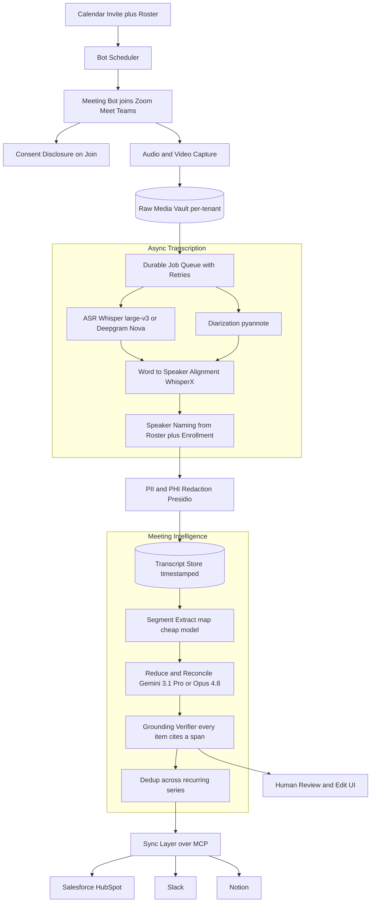
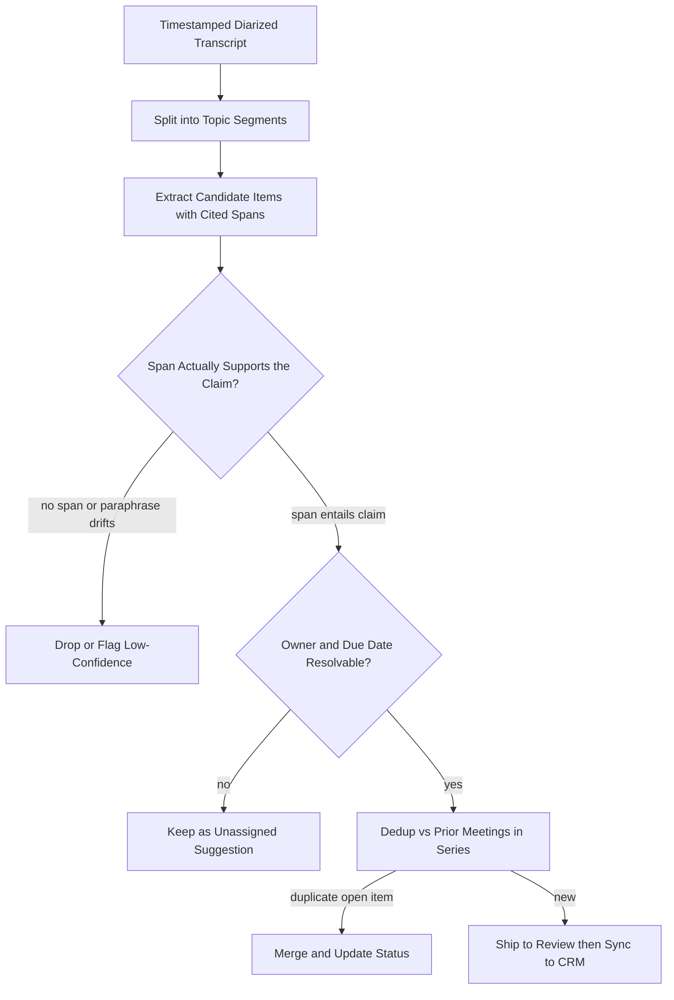

# Case Study: Async Meeting Intelligence Platform

A product in the Granola, Fireflies, Otter, and Gong class: a bot joins Zoom, Google Meet, and Teams calls, records and transcribes them, then produces a summary, the decisions, and action items with owners and due dates, and syncs them to Salesforce, Slack, and Notion. At roughly 200,000 meetings per day the dominant cost is ASR over hours of audio, but the constraint that decides whether the product is trusted is different: **a single hallucinated action item synced to a CRM ("John will send the contract by Friday" when John said no such thing) is a trust-killer**, so every extracted item must cite a real transcript span. Unlike a live voice agent, this is an async batch pipeline, so throughput and faithfulness dominate, not latency.

## The Business Problem

Every knowledge worker sits in meetings they cannot fully remember and half of which they should not have attended. The pitch is simple: let a bot attend, and get back a clean transcript, the decisions that were actually made, and a list of action items with the right owner and due date, wired into the tools where work happens. The naive design is a two-liner: point Whisper at the recording and ask an LLM to "summarize and list action items." It fails in four expensive ways. It has no idea *who* said what, so it cannot assign an owner. It cheerfully invents action items that no one committed to, because fluent summarization and faithful extraction are different tasks. It ignores that recording a call is legally regulated. And it does not survive contact with 200,000 meetings a day.

The team that gets this right inverts the usual voice-agent instinct. A live voice agent (see the [Multilingual Real-Time Voice Contact Center](30-multilingual-voice-contact-center.md) and [Real-Time Voice Agents](../18-voice-and-audio-agents/01-realtime-voice-agents.md)) is latency-bound: sub-800ms turns, barge-in, speech-to-speech shortcuts, one pass over the audio because there is no second chance. This product is the opposite. Nothing is live. The meeting is over before intelligence runs. That frees the architecture to be a **durable batch pipeline**: a job queue with retries, permission to run the biggest ASR model, to diarize and re-diarize, to summarize and then verify the summary, and to fail a job and rerun it without a human ever noticing. The whole design trades latency (which no longer matters) for throughput and faithfulness (which are everything).

So the architecture is built around three ideas. First, **separate transcription from intelligence**: get a timestamped, speaker-attributed transcript right before anyone asks an LLM to reason over it. Second, **ground every structured output in a transcript span**, so an action item, a decision, or a risk always points back to who said it and when, and anything that cannot be grounded is dropped rather than shipped. Third, **treat consent and retention as pipeline stages, not afterthoughts**, because the raw material is other people's recorded conversations.

Constraints from the June 2026 reality:

- About 200,000 meetings per day across all customers, averaging ~35 minutes, so roughly 3.5M hours of audio per month; ASR is the dominant cost line and the LLM is a minority of spend.
- Async, not real-time: there is no sub-800ms budget, so the pipeline can run `large-v3`-class ASR, diarize with overlap handling, and re-summarize on failure; the SLO is "transcript and summary within a few minutes of the meeting ending," not milliseconds.
- Diarization on real meeting audio is the hard part: crosstalk and overlapped speech, people joining and leaving mid-call, and unknown dial-in speakers with no roster entry all inflate diarization error rate (DER).
- A hallucinated action item synced to a CRM is worse than no summary at all, so every action item must cite a transcript span (speaker plus timestamp) and resolve to a real attendee.
- Two-party-consent jurisdictions require a spoken and visible "this meeting is being recorded" disclosure; transcripts carry PII and PHI, retention and data residency are per-customer, and customer audio must not be used to train models.
- A 60-minute transcript is only ~12,000 to 16,000 tokens and fits any modern context window (Gemini 3.1 Pro, Claude Opus 4.8), so the hard problem is faithfulness over the transcript, not fitting it in context.
- Sync is over MCP 2.0 connectors to Salesforce, HubSpot, Slack, and Notion, and action items must be deduplicated across recurring meetings so a weekly standup does not create the same open task 12 times.

## Architecture

### Components

| Layer | Tech | Purpose |
|-------|------|---------|
| Bot fleet | Self-hosted meeting bots (Recall.ai-style infra) | Join Zoom, Meet, Teams; capture audio and video; post consent disclosure |
| Scheduler | Calendar webhooks plus roster fetch | Know which meetings to join and who is invited |
| Media vault | Per-tenant object storage with residency pinning | Hold raw recordings under retention and data-residency policy |
| Job queue | Durable queue (Temporal or SQS plus workers) | Batch pipeline with retries, idempotency, backpressure |
| ASR | Whisper `large-v3` self-hosted, or Deepgram Nova / AssemblyAI Universal | Transcribe hours of audio; tiered by tier and language |
| Diarization | pyannote.audio (overlap-aware) | Segment audio by speaker turn, including overlap |
| Alignment | WhisperX word-level timestamps | Bind each word to a speaker and a time offset |
| Speaker naming | Roster match plus optional voice enrollment | Map diarized clusters to real attendee names |
| Redaction | Microsoft Presidio plus custom recognizers | Strip PII and PHI before storage and sync |
| Map extractor | Claude Haiku 4.5 or DeepSeek V4 Flash | Per-segment candidate decisions and action items with spans |
| Reduce and verify | Gemini 3.1 Pro or Claude Opus 4.8 | Reconcile, deduplicate, and ground the final structured output |
| Sync | MCP 2.0 connectors | Push structured items to Salesforce, HubSpot, Slack, Notion |

### Data flow

1. A calendar webhook fires; the scheduler checks tenant policy and dispatches a bot to the meeting, which posts the recording disclosure on join and starts capturing audio and video into the per-tenant media vault.
2. When the meeting ends, the recording is enqueued as a durable job; the queue owns retries, idempotency keys, and backpressure so a burst of 5pm meetings does not drop work.
3. ASR transcribes the full audio with a `large-v3`-class model, and pyannote diarizes the same audio into speaker turns, including overlapped-speech regions; the two run in parallel.
4. WhisperX aligns words to speaker turns and to millisecond time offsets, producing a transcript where every word carries a speaker label and a timestamp.
5. Diarized clusters are resolved to real names using the calendar roster and, where enrolled, voiceprints; unmatched speakers are labeled "Unknown speaker 2," never guessed.
6. A redaction pass (Presidio plus domain recognizers) masks PII and PHI per tenant policy before the transcript is persisted or leaves the tenant boundary.
7. The intelligence stage runs map-then-reduce: a cheap model extracts candidate decisions, action items, and risks per topic segment, each tagged with the transcript span that supports it, and a long-context model reconciles them into one structured output.
8. The grounding verifier checks that every action item, decision, and risk cites a real span whose text actually supports the claim; unsupported items are dropped or flagged low-confidence, and owners and due dates are resolved against the roster.
9. Surviving items are deduplicated against prior meetings in the same recurring series, then synced over MCP to the customer's CRM, Slack, and Notion, with a human review and edit UI available before or after sync per tenant preference.

## Key Design Decisions

### 1. Async batch pipeline, not a real-time voice stack

This is the decision that shapes everything else. A real-time voice agent spends its entire engineering budget on latency: streaming STT, learned endpointing, barge-in, speech-to-speech models, one irreversible pass over the audio. Here, the meeting is already over. That inversion is a gift. We can run the largest ASR model instead of a streaming one, diarize the whole recording with full-file context (streaming diarization is strictly harder and less accurate), summarize and then run a second model to verify the summary, and, when a job fails, simply retry it. The pipeline is a [durable job queue](../07-agentic-systems/11-durable-execution.md) with idempotency keys and backpressure, not a low-latency media loop. The only latency SLO is "delivered within a few minutes of the meeting ending," which is minutes of slack, not milliseconds. Everything that follows spends that slack on accuracy.

### 2. ASR choice and the accuracy-versus-cost tradeoff over hours of audio

ASR is the dominant cost line, so the choice is a real budget decision, not a default. The three serious options are self-hosted Whisper `large-v3` ([Radford et al.](https://arxiv.org/abs/2212.04356), [openai/whisper](https://github.com/openai/whisper)), Deepgram Nova, and AssemblyAI Universal. Because the workload is batch, self-hosted `large-v3` batched on owned or spot GPUs is the cheapest per minute at scale (roughly a tenth of a cent per minute effective) and keeps audio inside the tenant boundary, which matters for the no-train and residency constraints. The managed APIs (Deepgram, AssemblyAI) cost more per minute but ship built-in diarization, word timestamps, and language coverage, and are the right call for a new product or for long-tail languages where self-hosting a tuned model is not worth it. We tier: `large-v3` self-hosted for the bulk English and major-language traffic, a managed API for the long tail and for customers who demand a specific vendor. WER is tracked per language and per audio condition, because a model that averages 8 percent word error can sit at 20 percent on a noisy conference-room mic, and WER on names and numbers propagates directly into wrong owners and wrong due dates.

### 3. Speaker diarization is the feature, and the hard part

"Summarize this call" is commodity; "who committed to what" is the product, and that requires knowing who spoke each word. Diarization on real meetings is genuinely hard: two people talk over each other, a fourth person joins 20 minutes in, and a dial-in participant has no roster entry. We run pyannote.audio ([Bredin et al.](https://arxiv.org/abs/1911.01255), [pyannote-audio](https://github.com/pyannote/pyannote-audio)) in overlap-aware mode (the powerset formulation handles simultaneous speakers rather than forcing one label per frame, [Plaquet and Bredin](https://arxiv.org/abs/2310.13025)), then WhisperX ([Bain et al.](https://arxiv.org/abs/2303.00747)) to bind words to speaker turns and timestamps. Diarized clusters are mapped to names from the calendar roster, and for repeat participants an optional voiceprint enrollment tightens attribution. The rule that keeps trust intact: an unresolved cluster is labeled "Unknown speaker," never guessed into a real name, because a wrong name on an action item is a specific, memorable failure. DER, and especially DER on overlapped speech, is a first-class eval metric.

### 4. Meeting-bot infrastructure: buy to launch, build to scale

A bot that reliably joins Zoom, Meet, and Teams, survives waiting rooms, and captures clean per-participant audio is a surprising amount of undifferentiated infrastructure. Recall.ai and similar vendors sell exactly this as an API and are the correct choice to launch: they abstract three platforms' quirks and ship in weeks. But their pricing is roughly a dollar per bot-hour, and at 3.5M bot-hours per month that is a multi-million-dollar line that dwarfs the rest of the stack. So the platform starts on a bot vendor and migrates the highest-volume platforms (Zoom, Meet) to self-hosted bots once volume justifies the engineering, keeping the vendor for the long tail and for resilience. This is a classic build-versus-buy curve where the crossover is set by bot-hours, not by feature envy.

### 5. Long-context summarization into grounded structured outputs

The output is not a paragraph, it is structured: decisions, action items (owner, due date, source span), and risks. A 60-minute transcript fits easily in a modern context window, so the temptation is a single prompt over the whole thing. We mostly resist it. Faithfulness degrades over long inputs (the lost-in-the-middle effect), and a single pass gives you no per-item provenance. So the default is map-then-reduce ([LangChain summarization patterns](https://python.langchain.com/docs/tutorials/summarization/)): segment the transcript by topic or agenda item, extract candidate structured items per segment with their supporting spans on a cheap model, then reconcile on a long-context model (Gemini 3.1 Pro or [Claude Opus 4.8](https://www.anthropic.com/claude/opus)) that resolves contradictions ("we decided X" then "actually, let's hold X") and merges duplicates. For a short, single-topic meeting, one grounded pass is simpler and fine; hierarchical summarization earns its keep on multi-hour workshops and on cross-meeting rollups (a quarter of a recurring sync into one status). Prompt and context construction here is [context engineering](../05-prompting-and-context/05-context-engineering.md), not prose writing.

### 6. Every action item cites a transcript span, or it does not ship

This is the heart of the product's trustworthiness. Fluent summarizers hallucinate commitments that sound plausible and were never made, and abstractive summarization is known to drift from the source ([Maynez et al.](https://arxiv.org/abs/2005.00661)). The defense is extract-then-verify: extraction must emit, for every action item, decision, and risk, the exact transcript span (speaker plus timestamp) that supports it. A separate grounding verifier then checks that the cited span actually entails the claim, that the owner is a real attendee who accepted or was assigned the task, and that any due date was genuinely stated. Items that fail grounding are dropped or demoted to low-confidence suggestions, never silently shipped. In the UI, every item is click-through to the moment in the transcript, so a human can audit it in one click. This is the [guardrails](../13-reliability-and-safety/01-guardrails.md) and grounded-generation discipline from [RAG evaluation](../06-retrieval-systems/13-rag-evaluation-patterns.md) applied to meeting output: ground the claim, verify it, and prefer an honest gap over a confident fabrication.

### 7. Consent, retention, redaction, residency, and no-train

The raw material is other people's recorded conversations, so compliance is a pipeline stage, not a checkbox. On join, the bot posts an audible and visible "this meeting is being recorded" disclosure, because many jurisdictions require all-party or two-party consent ([Reporters Committee recording guide](https://www.rcfp.org/reporters-recording-guide/)); tenants in strict regions can require explicit opt-in or block recording entirely. Transcripts carry PII and PHI, so a redaction pass (Microsoft [Presidio](https://github.com/microsoft/presidio) plus domain recognizers) masks sensitive spans before storage or sync. Retention windows and data residency are per-customer: a healthcare customer's audio may be delete-after-30-days and pinned to one region, while another keeps a year. Customer audio is never used to train models, which is enforced by self-hosting ASR and by zero-retention agreements with any managed provider. All of this lives under formal [AI governance and compliance](../13-reliability-and-safety/04-ai-governance-and-compliance.md), because "we recorded and stored a conversation you did not consent to" is a regulatory and reputational event, not a bug.

### 8. CRM and tool sync over MCP, with dedup across recurring meetings

Action items are worthless if they die in a summary email, so the platform pushes structured items into the tools where work happens, over MCP 2.0 connectors ([spec 2026-03-26](https://modelcontextprotocol.io/specification/2026-03-26/)) to Salesforce, HubSpot, Slack, and Notion. Two things make this non-trivial. First, mapping: an "action item with owner and due date" has to become a Salesforce Task or a HubSpot Engagement with the right associations, and a decision becomes a note on the right opportunity, all under audience-scoped tokens so a connector cannot write outside its grant. Second, deduplication across a recurring series: a weekly standup that says "Priya will finalize the deck" three weeks running must not create three open tasks. We key dedup on the meeting series ID plus a semantic match on the item, and carry status forward (open, in progress, done) rather than re-creating, so recurring meetings update one task instead of spawning many. See [Tool Use and MCP](../07-agentic-systems/03-tool-use-and-mcp.md).

### 9. When a transcript-only tool beats the full intelligence pipeline

Be honest about where this architecture is overkill. For a solo user who just wants their own notes, the Granola-style model (a lightweight local transcript plus a three-bullet summary, no bot, no CRM sync) is often better: it is cheaper, it sidesteps the "a bot joined our call" consent friction, and it has no path to sync a wrong action item into a shared system of record. The full decisions-and-owners-and-CRM pipeline earns its complexity only when meetings are transactional and multi-party (sales calls, project standups, customer onboarding) and the output feeds a shared workflow. For a brainstorm, a 1:1, or a casual sync, the failure mode of the full pipeline (a confidently wrong action item assigned to a real colleague) can be worse than simply not having one. The strong version of this product knows which meetings deserve the full treatment and which just need a clean transcript.

## Grounding and Verify Loop

## Failure Modes and Mitigations

### F1: Diarization assigns words to the wrong speaker

Two people talk over each other and the action item "I'll own the migration" gets attributed to the wrong attendee, so the wrong person is assigned. Mitigation: overlap-aware diarization (pyannote powerset), attribution confidence carried per turn, an "Unknown speaker" label rather than a guessed name, and a human-editable speaker map surfaced in review.

### F2: Hallucinated action item

The model emits "John will send the contract by Friday" when John said no such thing, and it syncs to the CRM. Mitigation: extraction must cite a supporting transcript span, a grounding verifier confirms the span entails the claim and the owner is a real attendee, unsupported items are dropped, and action-item precision is a launch-gating eval metric.

### F3: ASR error on a name, number, or date

The transcript hears "Tuesday the 14th" as "the 4th" or mangles a surname, and the due date or owner is wrong. Mitigation: resolve owners against the calendar roster rather than raw ASR tokens, normalize dates with a confidence check, keyword-boost domain vocabulary, and always link the item to the audio moment so a human can catch it.

### F4: Bot fails to join or gets removed

The bot is stuck in a waiting room, denied by the host, or the meeting runs 40 minutes past its scheduled end and the bot leaves early. Mitigation: join health checks with retry and re-admit logic, a fallback to host-uploaded cloud recordings, graceful handling of partial recordings, and an alert when join success drops (often a platform API change).

### F5: Recording without valid consent

The bot records in a two-party-consent jurisdiction without the required disclosure, or a participant objected and was ignored. Mitigation: an automated audible and visible disclosure on join, per-region policy that can require opt-in or block recording, an in-meeting opt-out that stops capture, and consent state logged immutably with the recording.

### F6: PII or PHI leak into storage, sync, or training

A transcript containing a patient identifier or a card number is stored unredacted, synced to a CRM, or worse, used to train a model. Mitigation: a Presidio redaction stage before persistence and before any egress, per-tenant retention and residency enforcement, self-hosted ASR plus zero-retention provider agreements so audio never enters a training set, treated as a sev-1 if breached.

### F7: Duplicate action items flood the CRM

A weekly recurring meeting recreates the same open task every week, burying the real signal in duplicates. Mitigation: dedup keyed on the meeting series ID plus a semantic match on item text, status carry-forward (update the existing task rather than create a new one), and a per-series open-item ledger.

### F8: Silent partial-pipeline failure

ASR times out on a corrupt segment, the transcript is truncated, and a confident summary is generated from half a meeting. Mitigation: completeness checks comparing transcribed duration against meeting length, a per-transcript quality score (estimated WER, diarization confidence), fail-loud on degraded input, and no sync of low-confidence output without a review flag.

## Operational Considerations

### Monitoring

| SLO | Target |
|-----|--------|
| Summary and action items delivered after meeting end (p95) | under 5 minutes |
| Pipeline job completion (including retries) | over 99.5 percent |
| Bot join success rate | over 98 percent |
| Diarization error rate (DER) on the multi-speaker eval set | under 12 percent |
| Word error rate (WER) on the business-English eval set | under 8 percent |
| Action-item precision (shipped items actually committed) | over 95 percent |
| Action-item recall (real commitments captured) | over 85 percent |
| Ungrounded action items reaching sync | under 1 per 10,000 |
| Consent-disclosure delivery on recorded meetings | 100 percent |

### Cost model

At ~200,000 meetings per day (~6M per month), averaging ~35 minutes (~210M minutes, ~3.5M hours per month):

- ASR (the dominant line): self-hosted Whisper `large-v3` batched on GPUs at roughly $0.001 to $0.002 per minute, about $250k to $450k per month; a managed API would be 2 to 4 times that.
- Diarization (pyannote on GPU): roughly $0.0005 to $0.001 per minute, about $120k to $200k per month.
- Meeting-bot media capture: the other big line; a vendor at ~$1 per bot-hour would be multi-million per month, which is why the high-volume platforms move to self-hosted bots.
- LLM intelligence (cheap map plus long-context reduce and verify): roughly $0.005 to $0.02 per meeting, about $30k to $120k per month, a minority of total spend.
- Storage, retention, and residency egress: meaningful and recurring, dominated by raw audio, so tiered and auto-expiring per tenant policy.
- Fully loaded this lands well under a dollar per meeting, dominated by ASR and bot-hours, not by tokens; see the [cost optimization playbook](../04-inference-optimization/07-cost-optimization-playbook.md) and [batching strategies](../04-inference-optimization/04-batching-strategies.md).

### On-call playbook

- Bot join failures spike: check for a Zoom, Meet, or Teams API or auth change, fail over affected traffic to the bot vendor, and fall back to host cloud-recording ingestion.
- ASR quality regression after a model or infra change: pin the last-good ASR model, re-run the WER golden set, and reprocess affected meetings from the raw audio in the vault.
- Hallucinated action item reported: treat as a trust event, pull the transcript and the (missing) cited span from the audit log, tighten the grounding verifier, and add the case to the action-item eval set.
- Consent or redaction failure: quarantine affected recordings, halt sync for the tenant, notify the compliance owner, and treat as sev-1.
- Queue backlog growth (the 5pm surge): scale ASR and diarization workers, shed to a managed ASR API for burst, and protect the completion SLO with backpressure rather than dropping jobs.
- Duplicate-task complaints: inspect the series dedup key and semantic matcher, and reconcile the open-item ledger for the affected recurring series.

## What Strong Interview Candidates Cover

- They frame this as an async batch pipeline and contrast it sharply with real-time voice: no latency budget, so spend the freed compute on a bigger ASR model, overlap-aware diarization, and a verify pass, with retries instead of one irreversible live pass.
- They know ASR over hours of audio is the dominant cost, not the LLM, and they tier self-hosted `large-v3` against managed Deepgram or AssemblyAI on a cost, residency, and language-coverage basis.
- They treat diarization as the actual product surface, handle overlap, join and leave, and unknown speakers, refuse to guess a name, and make DER a first-class metric alongside WER.
- They separate transcription from intelligence and use map-then-reduce so summarization is faithful and every item has provenance, while noting a 60-minute transcript fits one context window and the hard part is faithfulness, not length.
- They make grounding non-negotiable: every action item cites a transcript span, an ungrounded item is dropped, and a fabricated commitment synced to a CRM is the failure that kills the product.
- They treat consent, redaction, retention, residency, and no-train as pipeline stages under formal governance, not afterthoughts.
- They design CRM sync with proper object mapping and dedup across recurring meetings, and they name when a transcript-only tool beats the full pipeline.

## References

- Radford et al., [Robust Speech Recognition via Large-Scale Weak Supervision (Whisper)](https://arxiv.org/abs/2212.04356) and [openai/whisper](https://github.com/openai/whisper)
- Bain et al., [WhisperX: Time-Accurate Speech Transcription of Long-Form Audio](https://arxiv.org/abs/2303.00747) and [m-bain/whisperX](https://github.com/m-bain/whisperX)
- Bredin et al., [pyannote.audio: neural building blocks for speaker diarization](https://arxiv.org/abs/1911.01255) and [pyannote/pyannote-audio](https://github.com/pyannote/pyannote-audio)
- Plaquet and Bredin, [Powerset multi-class cross-entropy loss for neural speaker diarization](https://arxiv.org/abs/2310.13025)
- Bredin, [pyannote.metrics and the definition of diarization error rate](https://github.com/pyannote/pyannote-metrics)
- [Deepgram Nova speech-to-text documentation](https://developers.deepgram.com/docs) and [AssemblyAI documentation](https://www.assemblyai.com/docs)
- [jiwer: word error rate computation](https://github.com/jitsi/jiwer)
- Maynez et al., [On Faithfulness and Factuality in Abstractive Summarization](https://arxiv.org/abs/2005.00661)
- Zhong et al., [QMSum: query-based meeting summarization benchmark](https://arxiv.org/abs/2104.05938) and Hu et al., [MeetingBank](https://arxiv.org/abs/2305.17529)
- [AMI Meeting Corpus](https://groups.inf.ed.ac.uk/ami/corpus/)
- LangChain, [summarization (map-reduce and refine) patterns](https://python.langchain.com/docs/tutorials/summarization/)
- Google, [Gemini long-context guide](https://ai.google.dev/gemini-api/docs/long-context) and Anthropic, [Claude Opus 4.8](https://www.anthropic.com/claude/opus)
- [Recall.ai meeting-bot API](https://www.recall.ai/) and [Microsoft Presidio PII redaction](https://github.com/microsoft/presidio)
- [Reporters Committee: recording guide and two-party-consent map](https://www.rcfp.org/reporters-recording-guide/)
- [Model Context Protocol specification 2026-03-26](https://modelcontextprotocol.io/specification/2026-03-26/)

Related chapters: [Real-Time Voice Agents](../18-voice-and-audio-agents/01-realtime-voice-agents.md), [Case Study: Multilingual Real-Time Voice Contact Center](30-multilingual-voice-contact-center.md), [AI Governance and Compliance](../13-reliability-and-safety/04-ai-governance-and-compliance.md), [Context Engineering](../05-prompting-and-context/05-context-engineering.md), [Tool Use and MCP](../07-agentic-systems/03-tool-use-and-mcp.md).
