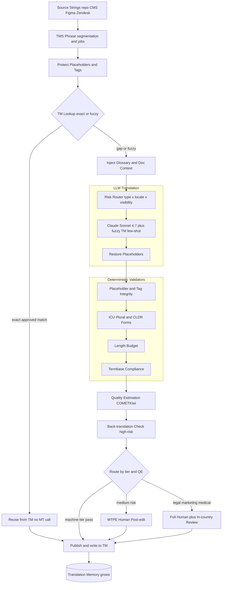
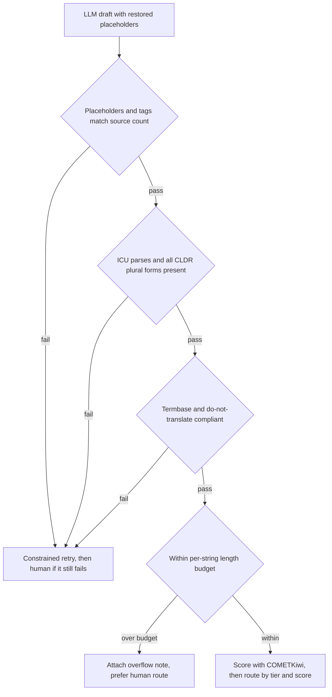
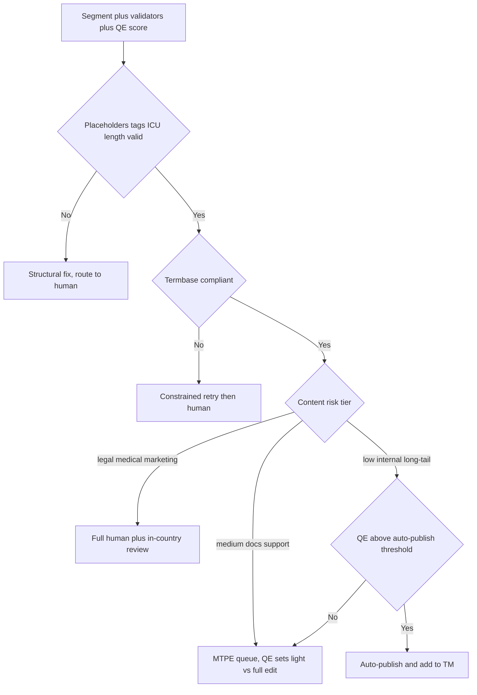

# Case Study: Enterprise Translation and Localization Pipeline

A global software company localizes its product UI, help center, docs, and marketing into 40-plus languages at several million words a month. It replaces most of a traditional TMS-plus-human-translation workflow with an LLM pipeline but keeps humans on the high-visibility surface. The single hardest constraint: quality and consistency at scale when no human reads every string, and never mistranslating a legal, medical, or brand-critical term.

## The Business Problem

The old pipeline is a Translation Management System (TMS) like [Phrase](https://phrase.com/) or [Smartling](https://www.smartling.com/) driving freelance and language-service-provider (LSP) human translators through CAT editors, backed by a Translation Memory (TM) of approved past segments and a termbase of approved terms. Human translation runs roughly $0.10 to $0.25 per word and takes days, so it does not scale to millions of words across 40 locales on a continuous release cadence. The team already pre-translates with neural MT (DeepL, Google Cloud Translation) and has humans post-edit, but generic NMT ignores the glossary and the surrounding context, so the post-edit load stays heavy.

The naive LLM replacement is to pipe every string through "translate this to French." It fails in five specific ways. It ignores the TM and re-translates already-approved strings, breaking consistency and paying for work already done. It does not enforce the termbase, so a drug name or the word "Account" comes out differently across strings. It silently corrupts `%1$s`, ICU plurals, and `<a>` tags, which breaks the build or crashes the UI. Nobody can read millions of strings, so bad translations ship unseen. And confidential unreleased strings leak to a public API.

So the team keeps TM and termbase as the ground truth and lets the LLM fill only the gaps, prompted with the closest fuzzy TM matches, the relevant glossary terms, and document-level context. Deterministic validators gate mechanical correctness (placeholders, tags, plural forms, length) because that is not something to trust a model with. A reference-free Quality Estimation (QE) model scores every segment and routes only the risky ones to humans, and a content-risk tier decides machine-only versus post-editing versus full human. This is the localization analog of the semantic layer in [text-to-SQL analytics](39-conversational-analytics-text-to-sql.md): a curated source of truth constrains the model instead of hoping the model gets it right.

Constraints from the June 2026 reality:

- Scale is several million words a month across 40-plus locales on a weekly release cadence, so no human can read every string and machine coverage is mandatory.
- Human translation costs roughly $0.10 to $0.25 per word and turns around in days, which does not fit the volume or the velocity.
- TM leverage is the biggest cost lever: exact matches are free reuse, and industry pricing zeroes 100% matches and discounts fuzzy bands, so a re-translate-everything design is pure waste.
- Terminology is non-negotiable: a drug name, a legal term, or "Account" must render identically everywhere, and brand names on a do-not-translate list must never be translated.
- Strings are code, not prose: `printf` args like `%1$s`, [ICU MessageFormat](https://unicode-org.github.io/icu/userguide/format_parse/messages/) plurals `{count, plural, one {# file} other {# files}}`, and inline HTML must survive intact.
- Plural and gender rules vary by locale: [CLDR](https://cldr.unicode.org/) defines up to six plural forms (Arabic), and German and Finnish expand text 30%-plus and overflow fixed-width UI.
- Confidentiality: unreleased UI strings reveal the roadmap and cannot reach a public MT API, and some markets impose data residency.
- QE is imperfect and weakest exactly where stakes are highest (low-resource languages, negation, named entities), so machine-only can never cover legal or medical content.

## Architecture



### Components

| Layer | Tech | Purpose |
|-------|------|---------|
| Source connectors | Git i18n files (JSON, PO, XLIFF, `strings.xml`), CMS, Figma, Zendesk | Ingest source strings with context |
| TMS orchestration | Phrase (or Smartling, Lokalise) | Segmentation, jobs, TM and termbase, workflow states |
| Translation Memory | TM store (exact and fuzzy), embedding index for semantic fuzzy match | Reuse approved past translations for free |
| Termbase | Glossary plus do-not-translate list | Enforce consistent, brand and legal-critical terms |
| Risk router | Classifier on content type, locale, visibility | Assign tier and translation path |
| LLM MT | Claude Sonnet 4.7 primary, Gemini 3.1 Pro alternate, Haiku 4.5 or Gemma 4 for bulk | Context-aware translation, terminology adherence |
| NMT fallback | DeepL, Google Cloud Translation | Cheap comparison and fallback for some pairs |
| Validators | Placeholder, tag, ICU, CLDR, length checks (code) | Hard gates on structural correctness |
| Quality Estimation | COMETKiwi, self-hosted, reference-free | Per-segment risk score for routing |
| Back-translation | Round-trip via a second model | Catch negation, number, and entity errors |
| Post-editing | CAT editor in the TMS | Humans fix flagged segments, edits feed the TM |
| In-country review | Locale reviewers, per-market style guides | Cultural and legal appropriateness |
| Eval and observability | COMET on sampled references, MQM LQA, dashboards | Calibrate QE, track compliance and escape |

### Data flow

1. A connector pulls changed source strings from the repo, CMS, or design tool as [XLIFF](https://docs.oasis-open.org/xliff/xliff-core/v2.1/xliff-core-v2.1.html); the TMS segments them and computes TM leverage against the existing memory.
2. Each segment has its placeholders and inline tags extracted to protected tokens; the TM is queried for exact and fuzzy matches, relevant glossary terms are pulled, and neighboring segments plus key or screenshot metadata are gathered as document context.
3. An exact, approved TM match above threshold is reused with no MT call at all; everything else continues into the model path.
4. The risk router assigns a content tier from content type times locale times visibility, which selects the path (machine-only, MT-plus-QE, MTPE, or full human).
5. The LLM translates with a prompt of source plus document context plus glossary terms plus the closest fuzzy TM matches as in-context examples plus the target locale, formality, and style guide; protected placeholders are restored into the output.
6. Deterministic validators run as hard gates: placeholder and tag integrity, ICU and CLDR plural-form completeness, length budget, number and date format, and termbase compliance.
7. The QE model scores the segment for risk, and a back-translation cross-check runs on high-risk or number-bearing segments to catch negation flips and dropped entities.
8. The routing gate publishes segments that pass every check and clear the tier's QE threshold and writes them to the TM; the rest go to the MTPE or full-human queue with the draft pre-filled.
9. Human edits are approved into the TM (growing the reusable asset) and logged as QE calibration and eval data, and approved targets are pushed back to the resource files and CMS.

### A worked example: one cart string into German

Follow one real UI string end to end, then contrast it with a low-risk string that ends up somewhere different.

**The string.** Segment `ui.cart.summary_line`, English source `You have {count, plural, one {# item} other {# items}} in your {cart_name} cart`, target `de-DE`. It carries an ICU plural driven by `{count}` and a second placeholder `{cart_name}`, and it renders in a fixed-width header, so it is customer-facing top-locale UI.

**TM lookup (85 percent fuzzy).** There is no exact match, but the TM holds a near-neighbor from a prior release, `You have {count, plural, one {# item} other {# items}} in your {cart_name} wishlist`, approved as `Sie haben {count, plural, one {# Artikel} other {# Artikel}} in Ihrer {cart_name}-Wunschliste`. The fuzzy score is 85 percent (the strings differ only by cart versus wishlist), too low to reuse verbatim but ideal as a few-shot example, so it seeds the prompt and anchors the formal register (Sie) and the placeholder layout.

**Glossary.** The termbase pins `cart -> Warenkorb` for de-DE and lists `Einkaufswagen` and `Korb` as do-not-use synonyms. That rule is injected into the prompt as a hard instruction.

**LLM draft, first attempt (rejected).** Claude Sonnet 4.7 returns `Sie haben {count, plural, one {# Artikel} other {# Artikel}} in Ihrem {cart_name}-Einkaufswagen`. Placeholders are intact and both plural forms are present, so QE would very likely have waved it through, but the deterministic termbase check fails because `Einkaufswagen` is the do-not-use synonym, not the approved `Warenkorb`. The segment bounces to a constrained retry with the violated term named. (Had the model instead dropped `{cart_name}`, the placeholder-integrity check would have caught it on the same gate; a code check, not the model, is the guarantee.)

**LLM draft, second attempt (into the gauntlet).** The retry returns `Sie haben {count, plural, one {# Artikel} other {# Artikel}} in Ihrem {cart_name}-Warenkorb`. Now the deterministic checks run: placeholder integrity passes (`{count}` and `{cart_name}` both present, none added), ICU parses, CLDR completeness passes (German needs exactly the `one` and `other` categories, both present), and the termbase check passes. The length check flags it: the German rendering is about 34 percent wider than the English, over the 30 percent budget for this fixed-width header, so a soft length-overflow flag is attached (a note for the human, not a hard block).

**QE and routing.** COMETKiwi scores the segment 0.82. Because it is customer-facing top-locale UI (medium-risk tier), the router sends it to MTPE regardless of the score: a post-editor opens it with the draft, the 85 percent TM match, the glossary, the QE score, and the length-overflow note pre-filled, then shortens or confirms it in seconds. The approved result is written back to the TM, so the next occurrence is a free exact match.

**The contrast.** The same batch carries an internal admin string, `log.sync.done`, source `Sync completed for {tenant}`, target `Synchronisierung für {tenant} abgeschlossen`. Placeholders and forms pass, there is no glossary term and no length pressure, and COMETKiwi scores it 0.94. It is low-risk internal content over the 0.85 auto-publish threshold for that tier, so it auto-publishes with no human and writes straight to the TM. Same pipeline, same checks, opposite destination: the tier plus the QE score, not the raw fluency, decided who a human ever saw.

### The segment record

Every segment carries a structured record that the checks and the router read, never the prose. Here is `ui.cart.summary_line` at the moment it is routed.

```json
{
  "segment_id": "ui.cart.summary_line",
  "locale": "de-DE",
  "source": "You have {count, plural, one {# item} other {# items}} in your {cart_name} cart",
  "target": "Sie haben {count, plural, one {# Artikel} other {# Artikel}} in Ihrem {cart_name}-Warenkorb",
  "tm_match": {"score": 0.85, "origin": "ui.wishlist.summary_line", "used": "few_shot_example"},
  "glossary": [{"term": "cart", "approved": "Warenkorb", "first_pass": "Einkaufswagen", "corrected": true}],
  "glossary_ok": true,
  "placeholders_ok": true,
  "icu_plural_ok": true,
  "cldr_forms_present": ["one", "other"],
  "length_ratio": 1.34,
  "length_flag": true,
  "qe_model": "cometkiwi",
  "qe_score": 0.82,
  "content_tier": "customer_facing_ui",
  "edit_depth": "full",
  "route": "mtpe",
  "route_reason": "medium-risk tier is always post-edited; QE 0.82 below light-edit cutoff; length overflow flagged"
}
```

## Key Design Decisions

### 1. TM plus termbase as the ground truth, the LLM only fills gaps

The TM and termbase are the semantic layer, not the model. Exact TM matches are reused verbatim (free, and perfectly consistent), fuzzy matches are fed to the LLM as in-context examples, and the glossary is injected into every relevant prompt. Feeding the closest fuzzy matches to the model measurably improves terminology and style adherence over cold translation ([Moslem et al., Adaptive MT with LLMs, arXiv:2301.13294](https://arxiv.org/abs/2301.13294)). Critically, we do not trust the prompt to enforce terms: a deterministic post-check compares every term instance against the termbase and its do-not-translate list, and a violation blocks publish. Prompt-level "please use this glossary" is a hint, the compliance check is the guarantee. The worked example shows both halves at once: an 85 percent fuzzy match on a wishlist string seeds the prompt, and the first-pass `Einkaufswagen` draft is caught by the termbase check, not by the prompt.

### 2. LLM MT over pure NMT, for context, tone, and terminology

Classic NMT (DeepL, Google) is fast and cheap per word but translates segment by segment with no document context, no brand voice, and weak glossary control, so it maximizes post-edit load. LLM MT is the opposite tradeoff: it reads the whole document, honors formality and style, and follows an injected glossary, which is exactly what drives quality on customer-facing content. We run Claude Sonnet 4.7 as the workhorse, Gemini 3.1 Pro as an alternate for pairs where it scores higher, and Haiku 4.5 or a self-hosted Gemma 4 for low-risk bulk. DeepL stays wired in as a cheap fallback and as a comparison baseline in eval. The LLM costs more per token than NMT, but the lever that matters is post-edit hours saved, and better raw MT cuts those directly.

### 3. Quality Estimation routes the humans, because you cannot review everything

The core scaling move is reference-free QE. You cannot produce a human reference for millions of strings, so a QE model (COMETKiwi, self-hosted) scores each translation's risk from the source and the hypothesis alone and routes only the low-confidence segments to people ([Rei et al., CometKiwi, arXiv:2209.06243](https://arxiv.org/abs/2209.06243)). Reference-based metrics like [COMET](https://arxiv.org/abs/2009.09025) are used in eval where we do have references, but production routing is QE. The auto-publish threshold is not a model default, it is calibrated against MTPE capacity and, more importantly, against the measured critical-error escape rate on the machine path: raise it and more work stays machine-only but more errors slip through, lower it and the human queue grows. That threshold is per-tier and per-locale. Concretely, the low-risk internal string in the worked example clears a 0.85 auto-publish threshold at QE 0.94 and ships untouched, while the customer-facing cart string at 0.82 never reaches that threshold because its tier routes it to a human first.

### 4. Mechanical correctness is deterministic code, never model trust

This is where naive LLM translation breaks. A model that drops a `%1$s`, reorders positional args, emits five plural forms for a language that needs six, or mangles an `<a href>` produces a string that crashes the app or corrupts the layout, and QE will not reliably catch it. So placeholder and tag integrity, ICU MessageFormat parseability, CLDR plural-form completeness, and length budget are validated in code as hard gates that the segment must pass before it is eligible for anything ([ICU MessageFormat](https://unicode-org.github.io/icu/userguide/format_parse/messages/), [CLDR plural rules](https://www.unicode.org/cldr/charts/latest/supplemental/language_plural_rules.html)). These are the same discipline as [guardrails](../13-reliability-and-safety/01-guardrails.md): structural constraints enforced outside the model. Constrained decoding and protect-then-restore reduce violations, but the check is what makes it safe. German is the everyday version of this: it needs exactly the CLDR `one` and `other` categories, so a draft that fills only the `other` branch fails the completeness gate, and the worked example's first-pass `Einkaufswagen` fails the termbase gate with placeholders and plurals perfectly intact, which is precisely the error class QE tends to miss.

### 5. Content-risk tiering drives the whole pipeline

The economics and the safety both come from tiering. Low-risk content (internal docs, the long tail of support KB, low-traffic locales) goes machine-only when it clears QE. Medium-risk content (product docs, help center, top-locale UI) always gets human post-editing, with QE ordering the queue and deciding light versus full edit. High-risk content (legal, marketing, medical) is full human translation plus review, no auto-publish regardless of QE. The split is deliberately asymmetric, like an insurance straight-through gate: a wrong internal-doc string is cheap, a wrong drug instruction or a botched brand tagline is not, so the machine path is capped to content where the tail cost is bounded.

The tier and the QE score together choose the route (thresholds are per-locale; these are typical top-locale shapes):

| Content-risk tier | Examples | QE at or above threshold | QE below threshold |
|---|---|---|---|
| Low | internal docs, long-tail KB, low-traffic locales | Machine-only, auto-publish, write to TM | MTPE, light edit |
| Medium | product docs, help center, top-locale customer UI | MTPE, light edit | MTPE, full edit |
| High | legal, medical, marketing and brand | Full human plus in-country review | Full human plus in-country review |

The `ui.cart.summary_line` string above is medium tier, so its 0.82 lands it in full-edit MTPE, while the internal `log.sync.done` string is low tier and its 0.94 clears auto-publish. High-risk content ignores the QE column entirely, which is the point: QE is least trustworthy on exactly the low-resource and named-entity cases that dominate legal and medical content, so the tier, not the score, decides there.

### 6. Human-in-the-loop is the design center for high-value content

Routing to a human is the intended outcome for most customer-facing surfaces, not a failure, so it is built to be fast ([Human-in-the-Loop Patterns](../07-agentic-systems/08-human-in-the-loop-patterns.md)). Post-editors open the flagged segment with the MT draft, the fuzzy TM matches, the glossary, and the QE reasons pre-filled, so they confirm or fix rather than translate from scratch. Every approved edit flows back into the TM, so the asset grows and the next occurrence is a free exact match, and the edit distance between MT draft and final is logged as ground truth to calibrate QE. Marketing gets transcreation (creative adaptation, not translation), which humans own end to end.

### 7. Cost engineering: free TM, batch APIs, model tiering, cached context

Localization is a batch problem, not a real-time one, so it is optimized as one ([Cost Optimization Playbook](../04-inference-optimization/07-cost-optimization-playbook.md)). TM exact matches never hit a model and are the single largest saving. New and fuzzy segments run through batch APIs at the discounted tier, tiered by risk to the cheapest adequate model. The glossary, style guide, and per-locale instructions are large and repeat across a whole job, so they are put behind context caching and reused across the batch rather than re-sent per segment, and the TM itself behaves like a [semantic cache](../08-memory-and-state/05-semantic-caching.md) for translations. The result is that model spend is a rounding error next to the human post-edit line, which is exactly why QE routing (keeping humans off the machine path) is the real cost lever.

### 8. Governance: confidential strings, residency, and cultural review

Unreleased product strings are roadmap-sensitive and cannot go to a public endpoint, so embargoed content is routed to zero-retention enterprise endpoints or to self-hosted models (Gemma 4, Llama 4) in the company's own tenancy, and data-residency rules pin certain locales to in-region processing ([AI Governance and Compliance](../13-reliability-and-safety/04-ai-governance-and-compliance.md)). Beyond data handling, market-facing content gets in-country review for cultural and legal fit: idioms, imagery, examples, currency and legal claims that are correct as translation but wrong for the market. No marketing or legal string auto-publishes without that review.

### 9. When full human translation is non-negotiable

Some content never goes machine-only regardless of QE score. Legal contracts and terms are binding and often need certified or sworn translation. Medical instructions for use and dosing are patient-safety and regulated (a mistranslation is a recall, or worse), so they get qualified medical translators and back-translation review as a matter of policy. High-stakes marketing and brand taglines need transcreation, where a literal-but-wrong rendering is a famous failure mode. And low-resource languages are where LLM quality drops sharply and, worse, where QE itself is least reliable, so the confidence signal you would route on is untrustworthy exactly where you most need it. For all of these, the honest answer is that the pipeline assists humans, it does not replace them.

## The Validation Gauntlet

Mechanical correctness is not scored, it is gated. Every draft runs an ordered sequence of deterministic checks before it is eligible for QE or routing, and any failure bounces to a constrained retry (and then to a human if the retry still fails). This is the gauntlet the worked example's first-pass `Einkaufswagen` draft failed on the termbase gate.



## Segment Routing Flow



## Failure Modes and Mitigations

### F1: Placeholder or tag corruption

The model drops a `%1$s`, reorders positional args, or breaks an `<a href>`, and the build fails or the UI crashes at runtime. Mitigation: protect-then-restore placeholders around the model call, a deterministic integrity check that counts and matches every placeholder and tag between source and target, and a hard block plus human route on any mismatch (never auto-publish).

### F2: Terminology drift or a translated brand name

The same term comes out differently across strings, or a brand name that must stay in English gets translated. Mitigation: glossary injection into the prompt, a deterministic termbase-compliance check against the approved term and the do-not-translate list, a constrained retry when it fails, and a human route if the retry still does not comply.

### F3: QE misses a confidently wrong translation

QE scores a segment high while the translation flips a negation or swaps a named entity, and it auto-publishes. Mitigation: a per-tier floor so legal and medical never auto-publish regardless of QE, a back-translation cross-check on high-risk and number-bearing segments, deterministic number and entity checks, and a continuous human LQA sample of the machine path measured as an escape rate.

### F4: Wrong or missing plural and gender forms

A locale needs six CLDR plural forms and gets three, or grammatical gender does not agree. Mitigation: ICU parse plus CLDR plural-completeness validation per target locale as a hard gate, gender-aware handling where the format supports it, and native-speaker review pinned on for the complex-plural locales (Arabic, Polish, Russian).

### F5: Length overflow and RTL breakage

German or Finnish expands past a fixed-width control, or a right-to-left locale renders bidi text incorrectly. Mitigation: a per-string length budget (max characters or expansion ratio) enforced as a check, pseudo-localization in CI to surface overflow before translation, an instruction to the model to stay within budget, and a human route for strings that cannot be shortened safely.

### F6: Leaking unreleased strings to a public API

Embargoed pre-release UI is sent to a third-party MT endpoint and the roadmap leaks. Mitigation: embargoed content routes only to zero-retention enterprise endpoints or self-hosted models in the company's tenancy, third-party NMT is disabled for pre-release namespaces, and data-residency routing pins regulated locales in-region.

### F7: TM poisoning from a bad past translation

A wrong translation already in the TM propagates through reuse and, worse, as a fuzzy in-context example that teaches the model the same error. Mitigation: only reviewed, approved segments enter the TM, periodic TM QA sweeps with QE scoring to quarantine low-quality entries, and TM versioning so a bad import can be rolled back.

### F8: Cultural or legal inappropriateness that passes MT and QE

A segment is a correct translation but wrong for the market (an idiom, an image reference, a claim that is illegal in that jurisdiction). Mitigation: mandatory in-country review for market-facing content, per-locale style guides encoding cultural and legal rules, and no auto-publish path for marketing or legal content.

## Operational Considerations

### Monitoring

| SLO | Target |
|-----|--------|
| Placeholder and tag integrity (machine path) | 100 percent (hard gate) |
| Termbase compliance rate | over 99.5 percent |
| Critical-error escape rate on auto-published segments (LQA sample) | under 0.5 percent |
| QE vs human MQM correlation (monthly sample, segment-level) | over 0.5 |
| TM leverage (share of words reused) | over 35 percent |
| MTPE turnaround p95 | under 24 hours |
| Blended cost per 1000 words | tracked, down vs all-human baseline |

### Cost model

At roughly 5 million words per month across 40-plus locales (figures are shapes at this scale, human rates are industry ranges):

- TM leverage around 40 percent reuses about 2 million words for free, no MT call, which is the largest single saving.
- Machine-only tier (about 55 percent of the 3 million new words) runs on a Haiku 4.5 and Sonnet 4.7 blend through batch APIs plus QE compute: low thousands of dollars per month, effectively a rounding error.
- MTPE tier (about 35 percent of new words) is dominated by human post-edit at roughly $0.04 to $0.06 per word: order $50,000 per month.
- Full-human tier (about 10 percent of new words) at roughly $0.15 to $0.22 per word: order $50,000 to $60,000 per month.
- QE, validators, and back-translation compute: modest, low thousands per month.
- Total lands around $110,000 to $120,000 per month, dominated by the human lines. All-human on the same 3 million new words at about $0.15 per word would be roughly $450,000, so the pipeline is a 3x to 4x reduction and the lever is QE routing keeping humans off the machine path.

### On-call playbook

- Placeholder-error spike after a model or prompt change: freeze auto-publish, roll back the prompt or model version, and re-run the affected batch through the validators.
- Termbase-compliance drop: check that the termbase synced to the prompt builder, re-inject, and sweep the affected segments for the offending term.
- QE calibration drift (escape rate rising in the LQA sample): lower the auto-publish threshold, widen the LQA sample, and recalibrate or retrain the QE model against recent post-edits.
- Suspected confidential leak: kill third-party MT routing for the affected namespace, switch embargoed content to self-hosted, and pull the request logs for the audit.
- Locale complaint (in-country reviewer flags a systemic error): pin that locale to MTPE or full human, fix the style guide and glossary, and re-translate the affected corpus.

## What Strong Interview Candidates Cover

- They put TM and termbase as the ground-truth semantic layer, with the LLM filling gaps, and they enforce terms with a deterministic compliance check, not a prompt hint.
- They make reference-free QE (COMETKiwi) the routing brain, calibrate the auto-publish threshold to MTPE capacity and measured escape rate, and know BLEU is weak while COMET tracks humans far better.
- They separate LLM MT's real edge (document context, tone, terminology) from mechanical correctness, which is deterministic code and where naive LLM translation breaks.
- They design content-risk tiering (machine-only, MTPE, full human) as an asymmetric gate, with legal, medical, and marketing never auto-published.
- They handle placeholders, ICU plurals, CLDR plural forms, and length overflow as hard validators, and know German expansion and RTL are real breakage.
- They name the governance surface: unreleased-string embargo, zero-retention or self-hosted endpoints, data residency, and mandatory in-country cultural and legal review.
- They identify the cost levers (free TM hits, batch APIs, model tiering, cached glossary context) and see that the human post-edit line is the cost, so QE routing is the ROI lever.
- They are honest that low-resource languages and legal, medical, and high-stakes brand content stay human, and that QE is least reliable exactly where the stakes are highest.

## References

- Rei et al., [COMET: A Neural Framework for MT Evaluation (arXiv:2009.09025)](https://arxiv.org/abs/2009.09025)
- Rei et al., [CometKiwi: IST-Unbabel 2022 Submission for the QE Shared Task (arXiv:2209.06243)](https://arxiv.org/abs/2209.06243)
- Moslem et al., [Adaptive Machine Translation with Large Language Models (arXiv:2301.13294)](https://arxiv.org/abs/2301.13294)
- Papineni et al., [BLEU: a Method for Automatic Evaluation of Machine Translation (ACL 2002)](https://aclanthology.org/P02-1040/)
- [Conference on Machine Translation (WMT) shared tasks](https://www2.statmt.org/wmt24/)
- [Multidimensional Quality Metrics (MQM)](https://themqm.org/)
- Unicode, [ICU MessageFormat](https://unicode-org.github.io/icu/userguide/format_parse/messages/) and [CLDR Language Plural Rules](https://www.unicode.org/cldr/charts/latest/supplemental/language_plural_rules.html)
- OASIS, [XLIFF 2.1 specification](https://docs.oasis-open.org/xliff/xliff-core/v2.1/xliff-core-v2.1.html)
- [Phrase TMS](https://phrase.com/), [Smartling](https://www.smartling.com/), [Lokalise](https://lokalise.com/)
- [DeepL API documentation](https://developers.deepl.com/docs)
- Anthropic, [Claude models overview](https://docs.anthropic.com/en/docs/about-claude/models/overview)
- Google, [Gemini API translation and multilingual](https://ai.google.dev/gemini-api/docs)

Related chapters: [Human-in-the-Loop Patterns](../07-agentic-systems/08-human-in-the-loop-patterns.md), [Cost Optimization Playbook](../04-inference-optimization/07-cost-optimization-playbook.md), [AI Governance and Compliance](../13-reliability-and-safety/04-ai-governance-and-compliance.md), [LLM Evaluation](../14-evaluation-and-observability/01-llm-evaluation.md), [Multilingual Real-Time Voice Contact Center](30-multilingual-voice-contact-center.md)
