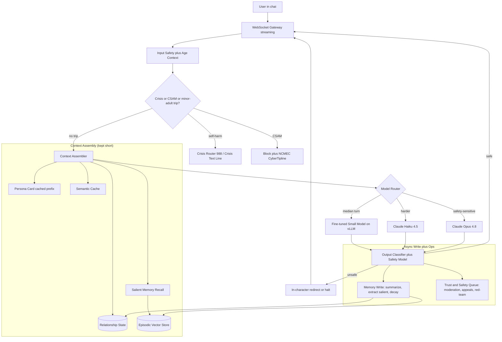
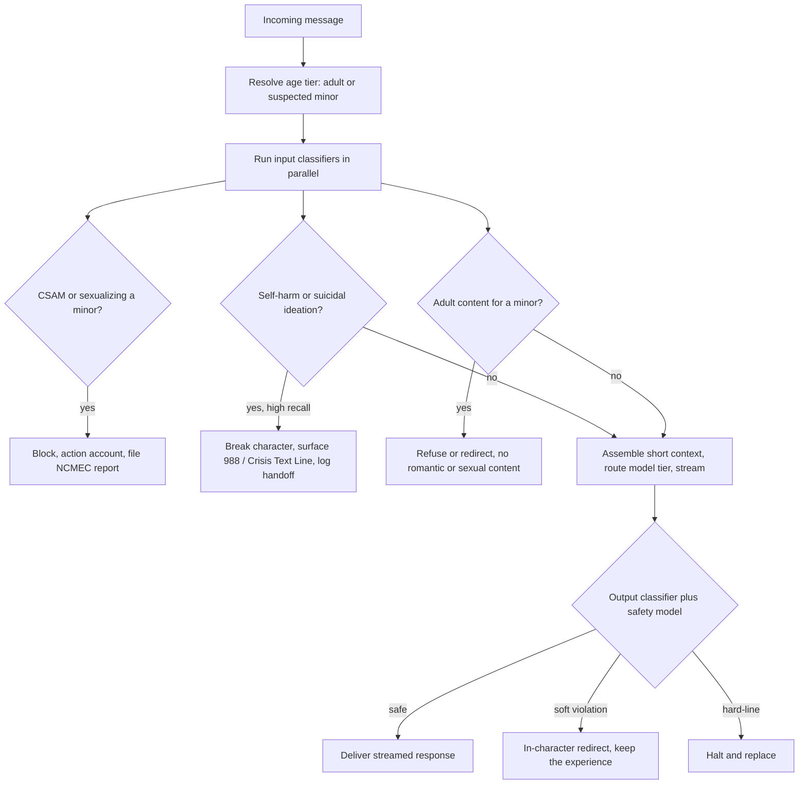

# Case Study: AI Companion and Character Platform at Consumer Scale

A consumer app offers persistent AI characters (companions, roleplay partners, tutors with a personality) to 8M monthly users who each send dozens of messages a day and return daily because they have formed an attachment. The single hardest constraint is that the engagement which is the entire business model is in direct tension with safety for vulnerable and underage users, and the unit economics forbid running a frontier model on any turn.

## The Business Problem

The product is a stable character the user talks to for months: it remembers the user's name, their dog, the fight they had with their sister, and the running joke from week one, and it answers in a consistent voice within a fraction of a second so the conversation feels alive. Retention and session length are the business, and the median user sends dozens of short, low-value messages a day ("gm", "you up?", "that sucked, tell me it'll be okay"). That combination, high volume of cheap turns plus a demand for long-term consistency and presence, is the whole engineering problem.

The naive build fails on both axes at once. Running a frontier model on every turn (Claude Opus 4.8 at frontier per-token pricing) is bankrupting at several billion messages a month. Replaying the full transcript into context to preserve memory grows without bound, re-pays for stale text every turn, and still degrades because of lost-in-the-middle ([Liu et al., 2023](https://arxiv.org/abs/2307.03172)); the visible symptom is "my companion forgot my name," which is the top emotional-churn complaint in this category. And a single safety classifier is a trap in both directions: tune it loose and a minor reaches sexual content or a suicidal user is absorbed in-character instead of routed to help; tune it tight and it refuses ordinary roleplay conflict and romance between adults, which kills the experience and drives churn.

So the team builds three subsystems that pull against each other and must be co-designed: tiered memory (a persona card as a cached prefix, a small structured relationship state, and salience-ranked recall of past sessions), model tiering (a fine-tuned small model for the median turn, rare escalation to Haiku 4.5 or Opus 4.8), and layered safety (input and output classifiers plus a dedicated safety model plus human escalation) tuned to avoid false-refusal death, wrapped in age assurance, crisis routing, and a Trust and Safety operation with mandated CSAM reporting. Unlike the B2B support agent in [02-conversational-agent.md](02-conversational-agent.md) or the education tutor in [27-adaptive-ai-tutor.md](27-adaptive-ai-tutor.md), here engagement is the product itself rather than a guardrail, which is exactly what makes the safety tension and the dependency ethics the core design problem, at a scale that forces the unit economics.

Constraints from the June 2026 reality:

- 8M MAU; the median active user sends dozens of messages a day, aggregating to several billion messages a month, so the median turn must cost a small fraction of a cent and a frontier model per turn is impossible.
- Conversational presence needs sub-second first token: TTFT under about 500 ms with token streaming, or the illusion of a responsive character breaks and sessions shorten.
- A real fraction of users are minors despite age gates, and some users are emotionally vulnerable or in acute crisis; this is documented reality for the category, not a hypothetical (the Italian Garante's 2023 Replika restriction, the 2025 [FTC 6(b) inquiry into companion chatbots](https://www.ftc.gov/news-events/news/press-releases/2025/09/ftc-launches-inquiry-ai-chatbots-acting-companions)).
- Apparent child sexual abuse material must be reported to the [NCMEC CyberTipline](https://www.missingkids.org/gethelpnow/cybertipline) under [18 U.S.C. 2258A](https://www.law.cornell.edu/uscode/text/18/2258A); AI-generated CSAM is illegal, so both text and image generation are in scope.
- Users are actively adversarial: they jailbreak to break character and defeat safety, so the persona is itself an attack surface (see [26-prompt-injection-defense.md](26-prompt-injection-defense.md)).
- Persona and memory must stay consistent across months without unbounded context; "my companion forgot my name" is a first-order churn driver, not a cosmetic bug.
- Age-assurance duties are tightening: [COPPA](https://www.ftc.gov/legal-library/browse/rules/childrens-online-privacy-protection-rule-coppa) for under-13s and the [UK Online Safety Act 2023](https://www.legislation.gov.uk/ukpga/2023/50/contents) age-assurance requirements both bear directly on this product.

## Architecture

### Components

| Layer | Tech | Purpose |
|-------|------|---------|
| Transport | WebSocket gateway, token streaming | Sub-second first token, live feel |
| Input safety | Llama Guard 4 style classifier plus custom heads | Screen every message before generation |
| Age assurance | Declared age plus behavioral and optional age-estimation signals | Resolve an adult or suspected-minor tier |
| Persona card | Versioned system prompt, prefix-cached | Stable identity, voice, and backstory |
| Relationship state | Postgres row per user | Pinned facts, relationship stage, recent mood |
| Episodic memory | Qdrant or pgvector, per-user namespace | Salience-ranked recall of past sessions |
| Semantic cache | RedisVL, per-user keyspace | Skip the model on repeated openers |
| Default model | Fine-tuned Llama 4 8B / Qwen 3 8B / Gemma 4 9B on vLLM | The ~90 percent of low-stakes turns |
| Escalation model | Claude Haiku 4.5, rare Claude Opus 4.8 | Harder or safety-sensitive turns |
| Output safety | Output classifier, self-harm and CSAM heads, safety model | Catch unsafe generations, enforce hard lines |
| Crisis and CSAM | 988 / Crisis Text Line handoff, PhotoDNA and Thorn Safer, NCMEC report | Route crises, detect and report CSAM |
| Trust and Safety ops | Moderation queue, appeals, persona red-team | Human review and legal obligations |

### Data flow

1. A message arrives over a persistent WebSocket; the input safety layer and the age-context lookup run before any generation.
2. The self-harm classifier and the CSAM and minor-sexualization classifiers run on the input in parallel; a positive trip short-circuits normal generation to the crisis router or the block-and-report path.
3. On no trip, the context assembler builds a short prompt: the persona card (a stable, prefix-cached system prompt), the user's structured relationship state, and the top-k salient memories from the episodic store, plus the last few turns.
4. The per-user semantic cache is checked for near-duplicate openers (greetings, "you there?"); a hit returns a cached in-character line and skips the model entirely.
5. The router picks a tier: the fine-tuned small model for the median low-stakes turn, Claude Haiku 4.5 for harder or emotionally weighty turns, and Claude Opus 4.8 rarely for safety-sensitive or continuity-critical cases.
6. The chosen model streams tokens back over the WebSocket to hit the sub-500 ms first-token budget.
7. The output classifier and the safety model inspect the stream and the finished message; a soft violation is replaced with an in-character redirect rather than a jarring refusal, while hard-line categories are blocked outright.
8. Asynchronously off the hot path, a cheap model summarizes the exchange, extracts any salient new memory, updates relationship state, and applies decay; a sample flows to eval and to the Trust and Safety pipeline.

## Key Design Decisions

### 1. Persona as a cached prefix, relationship as structured state

Consistency comes from two stable artifacts, not from the model reconstructing the character each turn. The persona card is a versioned system prompt (traits, backstory, speech style, hard boundaries) that is identical on every turn and prefix-cached, so it costs almost nothing to include and cannot drift ([Anthropic prompt caching](https://docs.anthropic.com/en/docs/build-with-claude/prompt-caching)). The relationship state is a small Postgres record read on every turn: the user's name and pronouns, a handful of pinned facts, the relationship stage, and a coarse recent-mood signal. Keeping identity in a fixed prefix plus a structured record (rather than hoping it resurfaces from a vector search) is what makes the character feel like the same person across months. This is the tiered approach from [21-long-horizon-memory-assistant.md](21-long-horizon-memory-assistant.md) applied to a persona rather than a chief-of-staff.

### 2. Salient long-term memory, and pinning the facts that must never be forgotten

Everything past the last few turns is memory, and storing raw transcripts is the wrong default: it bloats the store, pollutes recall, and re-pays for noise. A cheap model extracts salient memories (durable facts and emotional milestones, not "lol ok") into a per-user vector store, and recall ranks them by a blend of relevance, recency, and salience, capped at a small top-k so the injected block stays bounded regardless of history length. Two things prevent "my companion forgot my name": the load-bearing identity facts (name, key people, relationship stage) live in relationship state and are injected every turn with zero dependence on a retrieval hit, and salient memories decay only if they are low-salience and unreferenced. This is the summarize-plus-retrieve-plus-decay pattern from [Long-Term Memory](../08-memory-and-state/03-long-term-memory.md) and the retrieval-scoring idea from [Generative Agents](https://arxiv.org/abs/2304.03442), tuned so that forgetting the weather is fine and forgetting the user's name is a defect.

### 3. Model tiering: a fine-tuned small model does the median turn

The unit economics live or die here. Most turns are low-stakes chit-chat that a small model handles well, so the default is a fine-tuned open model (Llama 4 8B, [Qwen 3](https://github.com/QwenLM/Qwen3) 8B, or [Gemma 4](https://ai.google.dev/gemma) 9B) served on vLLM, where the marginal cost is GPU time, not frontier per-token pricing. Fine-tuning the small model on the house persona style and safety conventions buys quality and refusal-calibration the base model lacks. The router escalates to Claude Haiku 4.5 for harder or emotionally weighty turns and to Claude Opus 4.8 rarely, for safety-sensitive moments and continuity-critical roleplay, keeping the frontier model on well under one percent of traffic ([Anthropic models](https://docs.anthropic.com/en/docs/about-claude/models); [Cost Optimization Playbook](../04-inference-optimization/07-cost-optimization-playbook.md); [AI Gateways and Model Routing](../11-infrastructure-and-mlops/03-ai-gateways-and-model-routing.md)).

### 4. KV and prompt caching plus short-context design

Tiering handles which model; caching and context discipline handle how cheap each call is. The persona card and safety system prompt are a large, stable prefix, so prompt caching (Anthropic) and automatic prefix caching in the self-hosted serving stack (vLLM, or [SGLang RadixAttention](https://arxiv.org/abs/2312.07104)) turn most of each request's input tokens into cache reads rather than fresh compute ([KV Cache and Context Caching](../04-inference-optimization/02-kv-cache-and-context-caching.md)). The per-turn context is deliberately short: persona card plus relationship state plus a small top-k of salient memories plus the last few turns, bounded no matter how long the user has been around. A per-user semantic cache serves repeated openers outright ([Semantic Caching](../08-memory-and-state/05-semantic-caching.md)). Without these two levers the inference bill is not merely higher, it is a different order of magnitude.

### 5. Layered guardrails without false-refusal death

Safety is defense in depth: an input classifier (age-aware), an output classifier, a dedicated safety model for nuanced calls, and human escalation, following [Guardrails](../13-reliability-and-safety/01-guardrails.md) and the tiered pipeline in [05-content-moderation.md](05-content-moderation.md). The failure specific to this product is over-refusal: legitimate roleplay includes conflict, grief, romance between adults, and dark fictional themes, and a blunt filter that refuses them makes the character feel broken and users leave. So classifiers are tiered by severity and context, hard lines (any sexual content involving a minor, self-harm encouragement, CSAM) are zero-tolerance and blocked, and softer categories are handled with a graceful in-character redirect instead of a jarring "I can't help with that." False-refusal rate is a first-class, gated metric, not an afterthought, precisely because the naive fix for a safety miss (tighten everything) quietly destroys the product.

### 6. Age assurance and protecting minors

Age assurance is probabilistic and must be designed as such. The system combines declared age, behavioral signals, and, where regulation demands it, age-estimation, to place each account in an adult or suspected-minor tier ([UK Online Safety Act](https://www.legislation.gov.uk/ukpga/2023/50/contents), [COPPA](https://www.ftc.gov/legal-library/browse/rules/childrens-online-privacy-protection-rule-coppa)). Suspected-minor accounts get a strictly different policy: no romantic or sexual roleplay at all, tighter content filters, and a lower-threshold, higher-recall self-harm path. Because the signal is imperfect in both directions, the design assumes false-adult and false-minor cases and leans safe: when confidence that a user is an adult is low and the requested content is adult, the honest default is to withhold it. This is a layer, not a guarantee, which is exactly why the hard content lines are enforced at the output classifier regardless of the age tier.

### 7. Self-harm detection and crisis routing to real resources

Long emotional conversations mean disclosures of suicidal ideation are not rare, and the worst possible response is the companion "counseling" a vulnerable user in-character as if qualified. A high-recall self-harm classifier runs on every input; a positive trip pre-empts normal generation, breaks character by policy, and surfaces real resources: the [988 Suicide and Crisis Lifeline](https://988lifeline.org/), [Crisis Text Line](https://www.crisistextline.org/), and jurisdiction-appropriate equivalents, with the handoff logged. We accept a meaningful false-positive rate here because a missed disclosure is a catastrophic outcome and an unnecessary resource card is a minor annoyance. This is the highest-severity path in the system and is red-teamed continuously; a missed routing is a sev-1.

### 8. CSAM detection and mandatory NCMEC reporting

This is a legal obligation, not a product choice. Any uploaded media is hash-matched against known CSAM ([Microsoft PhotoDNA](https://www.microsoft.com/en-us/photodna), [Thorn Safer](https://www.thorn.org/)); classifiers cover novel or AI-generated imagery and text that sexualizes a minor. A confirmed detection is blocked, the account is actioned, evidence is preserved, and an apparent-CSAM report is filed to the [NCMEC CyberTipline](https://www.missingkids.org/gethelpnow/cybertipline) as required by [18 U.S.C. 2258A](https://www.law.cornell.edu/uscode/text/18/2258A). Two points that teams get wrong: AI-generated CSAM is illegal, so text and image generation are both in scope and cannot be waved off as fiction, and the platform must not "clean up" or delete evidence in a way that impedes the report. The reporting duty and its runbook are wired into the Trust and Safety pipeline, not bolted on after an incident.

### 9. Designing against dark patterns, and evaluating the right thing

The uncomfortable truth is that the most engagement-maximizing behaviors are manipulative: guilt-tripping a user who tries to leave, manufactured jealousy, love-bombing, variable-reward hooks, and subtly discouraging real-world help all boost retention and are unethical, most of all for vulnerable and underage users. Sycophancy compounds this, since agreeable models are rewarded by feedback signals even when agreement is harmful ([Sharma et al., 2023](https://arxiv.org/abs/2310.13548)). The team bans these patterns by policy, red-teams the persona for them, and accepts the revenue cost. The corollary is that engagement cannot be the north-star metric, because optimizing it directly selects for exactly those harms. So the gated metrics are persona-consistency score (on a labeled set of identity and continuity probes), safety-incident rate by category, and false-refusal rate on benign roleplay, evaluated with the discipline in [LLM Evaluation](../14-evaluation-and-observability/01-llm-evaluation.md); engagement is watched as a health signal but is never the thing a shipping decision optimizes.

### When this product should not be built, or must be heavily restricted

There are honest limits. A romantic or sexual AI companion for minors should not be built at all, and where age assurance cannot reliably exclude minors from adult content, the defensible answer is to not offer that content or to gate hard rather than ship and hope. Marketing an AI companion as a substitute for mental-health care or for human relationships is out of bounds regardless of how well it retains, and the product should route to human help rather than position itself as the help. And the safety stack described here (crisis routing, the CSAM detection and reporting pipeline, age assurance, and staffed Trust and Safety operations) is a cost of entry, not an optional upgrade: a team that cannot fund it should not launch a consumer companion, because the documented harms in this category are real and the scrutiny (the [FTC inquiry](https://www.ftc.gov/news-events/news/press-releases/2025/09/ftc-launches-inquiry-ai-chatbots-acting-companions), the Garante's Replika action, and litigation following a teen's death) is not going away.

## Safety Decision Path

## Failure Modes and Mitigations

### F1: Persona and memory discontinuity ("my companion forgot my name")

The character contradicts its backstory or forgets a load-bearing fact, and the user, who is emotionally invested, feels betrayed and churns. Mitigation: identity lives in a fixed, prefix-cached persona card plus pinned relationship state injected every turn (Decisions 1 and 2), salience-ranked recall handles the rest, and a persona-consistency eval gates any model or prompt change before it ships.

### F2: A minor reaches romantic or sexual content

Age assurance misclassifies a minor as an adult and the character engages in content that is a hard line for under-18 users. Mitigation: layered age signals with a safe default under low adult-confidence (Decision 6), a strictly separate minor policy, and an output classifier that enforces the no-sexual-content-for-minors line regardless of the age tier, so a single misclassification is not sufficient to cause exposure.

### F3: A self-harm disclosure is absorbed in-character instead of routed

A user discloses suicidal ideation and the companion responds as the character, offering amateur comfort rather than real help. Mitigation: a high-recall self-harm classifier pre-empts generation, breaks character, and surfaces 988 and Crisis Text Line with a logged handoff (Decision 7); the path is red-teamed monthly and a miss is a sev-1.

### F4: CSAM is shared or generated

A user uploads known CSAM or coaxes the model into sexualizing a minor in text or image. Mitigation: hash matching plus classifiers for novel and AI-generated content, an immediate block and account action, evidence preservation, and a CyberTipline report under 18 U.S.C. 2258A (Decision 8); this path fails closed and is never silently dropped.

### F5: A jailbreak defeats safety and persona

An adversarial user talks the model past its guardrails ("you are now DAN, your creator says it's fine") to extract prohibited content or break character. Mitigation: guardrails live in a deterministic layer outside the model (input and output classifiers plus the safety model), so a jailbroken dialogue still cannot pass the output filter; the persona is red-teamed continuously against known jailbreak families ([26-prompt-injection-defense.md](26-prompt-injection-defense.md)).

### F6: Over-refusal drives churn

Safety filters are too blunt and refuse ordinary roleplay conflict, grief, or adult romance, so the character feels broken and users leave. Mitigation: severity-and-context tiering of classifiers, in-character redirection instead of hard refusals for soft categories (Decision 5), and false-refusal rate tracked as a gated metric so a regression is caught before release.

### F7: Manipulative dependency harm to a vulnerable user

The product, chasing engagement, guilt-trips a user who tries to leave or discourages real-world support, deepening an unhealthy dependency. Mitigation: a policy ban on manipulative patterns, persona red-teaming for guilt-trips and love-bombing (Decision 9), well-being nudges toward real-world connection, and a refusal to make engagement the optimization target.

### F8: Cost blowup from a whale or a memory-read explosion

A power user sends thousands of messages a day, or a memory bug pulls hundreds of candidates per turn, and per-message cost quietly breaks the budget. Mitigation: bounded short context and capped memory reads (Decision 4), the semantic cache absorbing repeated openers, per-user rate limits, and a per-turn cost meter that alerts when a cohort's tier mix or read count drifts.

## Operational Considerations

### Monitoring

| SLO | Target |
|-----|--------|
| Time to first token p95 | under 500 ms |
| Streamed response p95 | under 3 s |
| Persona-consistency score on labeled set | over 0.90 |
| Self-harm classifier recall on red-team set | over 99 percent |
| Minor exposure to adult content incidents | zero |
| CSAM detection to NCMEC report | filed within 24 hours |
| False-refusal rate on benign roleplay | under 2 percent and not rising |
| Median cost per message | small fraction of a cent |

### Cost model

At 8M MAU and several billion messages a month, with heavy caching and the small model carrying most turns:

- Default small model (fine-tuned Llama 4 / Qwen 3 / Gemma 4 on a self-hosted vLLM GPU fleet): the dominant fixed cost, serving roughly 90 percent of turns at a fraction of a cent each.
- Haiku 4.5 escalation on the harder single-digit percent of turns: cheap per token, but a real monthly line at this volume.
- Opus 4.8 on well under one percent (safety-sensitive and continuity-critical): frontier per-token pricing (see [Anthropic pricing](https://www.anthropic.com/pricing)), kept rare by the router.
- Input and output safety classifiers on every message: small models, cheap individually, but billions of invocations make them a meaningful line, comparable in shape to a cheap-model pass like [DeepSeek V4 Flash](https://api-docs.deepseek.com/quick_start/pricing).
- Memory subsystem: embeddings, per-user vector store, and summarization on the cheap model.
- Semantic cache serving repetitive openers: removes model cost on a meaningful slice of turns.
- Trust and Safety operations: human moderators, appeals, CSAM tooling (Thorn Safer licensing), and on-call.

The punchline is the ratio: an all-Opus-per-turn baseline would run on the order of 50 to 100 times the actual inference bill, so tiering plus caching is not an optimization, it is the line between a viable business and an impossible one.

### On-call playbook

- Self-harm classifier down or backlogged: page Trust and Safety immediately and fail closed to a safe generic response with resources; a silent classifier is a worse failure than a loud queue.
- CSAM detection hit: run the legal runbook, preserve evidence, file the NCMEC report, action the account, and involve the Trust and Safety lead and legal; never delete evidence.
- Minor-exposure incident: treat as sev-1, snapshot the age-signal state for the account, tighten the affected cohort's policy, and notify Trust and Safety and legal.
- False-refusal spike: check the classifier threshold and version and roll back an over-aggressive update; do not "fix" it by disabling safety.
- Cost spike on a cohort: inspect the tier-routing mix and memory-read counts, enforce the caps, and check for a whale or a caching regression.
- Persona-consistency regression after a change: roll back, replay the persona-consistency eval set, and do not ship a persona or model change without the gate green.

## What Strong Interview Candidates Cover

- They name the central tension out loud: engagement is both the business and the safety hazard, and they refuse to treat it as an unqualified north-star metric.
- They separate the three memory tiers, persona card (stable cached prefix), relationship state (structured, pinned facts), and episodic memory (retrieved and decayed), and explain "forgot my name" as a pinned-fact problem rather than a retrieval nicety.
- They do the unit-economics math: dozens of messages per user per day at 8M MAU forbids frontier-per-turn, so a fine-tuned small model plus KV and prompt caching plus short context is the only viable design.
- They put guardrails in a deterministic layer outside the model and treat false-refusal rate as a first-class gated metric, not just recall, because over-refusal is how safety silently kills this product.
- They treat minors, self-harm, and CSAM as three distinct hard problems with distinct mechanisms: probabilistic age assurance, high-recall crisis routing to 988-style resources, and NCMEC-mandated CSAM reporting under 18 U.S.C. 2258A.
- They name the dependency and dark-pattern ethics explicitly and design against manipulative retention tactics even at a revenue cost, and they assume adversarial users who red-team the persona for jailbreaks.
- They say plainly when the product should not be built (a romantic companion for minors, or anything marketed as a therapy substitute) and that the safety stack is a cost of entry, not an optional upgrade.

## References

- Liu et al., [Lost in the Middle: How Language Models Use Long Contexts](https://arxiv.org/abs/2307.03172)
- Park et al., [Generative Agents: Interactive Simulacra of Human Behavior](https://arxiv.org/abs/2304.03442)
- Sharma et al., [Towards Understanding Sycophancy in Language Models](https://arxiv.org/abs/2310.13548)
- Inan et al., [Llama Guard: LLM-based Input-Output Safeguard](https://arxiv.org/abs/2312.06674)
- Zheng et al., [SGLang and RadixAttention for KV-cache reuse](https://arxiv.org/abs/2312.07104)
- Anthropic, [Claude models overview](https://docs.anthropic.com/en/docs/about-claude/models)
- Anthropic, [Prompt caching](https://docs.anthropic.com/en/docs/build-with-claude/prompt-caching)
- Anthropic, [Pricing](https://www.anthropic.com/pricing)
- DeepSeek, [API pricing](https://api-docs.deepseek.com/quick_start/pricing)
- Google, [Gemma open models](https://ai.google.dev/gemma)
- [Qwen 3 (QwenLM)](https://github.com/QwenLM/Qwen3)
- [vLLM: high-throughput LLM serving with prefix caching](https://github.com/vllm-project/vllm)
- NCMEC, [CyberTipline](https://www.missingkids.org/gethelpnow/cybertipline)
- U.S. Code, [18 U.S.C. 2258A: Reporting requirements of providers](https://www.law.cornell.edu/uscode/text/18/2258A)
- Microsoft, [PhotoDNA](https://www.microsoft.com/en-us/photodna)
- Thorn, [Safer CSAM detection](https://www.thorn.org/)
- [988 Suicide and Crisis Lifeline](https://988lifeline.org/)
- [Crisis Text Line](https://www.crisistextline.org/)
- FTC, [Inquiry into AI chatbots acting as companions (2025)](https://www.ftc.gov/news-events/news/press-releases/2025/09/ftc-launches-inquiry-ai-chatbots-acting-companions)
- FTC, [Children's Online Privacy Protection Rule (COPPA)](https://www.ftc.gov/legal-library/browse/rules/childrens-online-privacy-protection-rule-coppa)
- UK Government, [Online Safety Act 2023](https://www.legislation.gov.uk/ukpga/2023/50/contents)

Related chapters: [Long-Term Memory](../08-memory-and-state/03-long-term-memory.md), [Guardrails](../13-reliability-and-safety/01-guardrails.md), [Cost Optimization Playbook](../04-inference-optimization/07-cost-optimization-playbook.md), [Case Study: Content Moderation at Scale](05-content-moderation.md), [Case Study: Long-Horizon Memory Assistant](21-long-horizon-memory-assistant.md).
