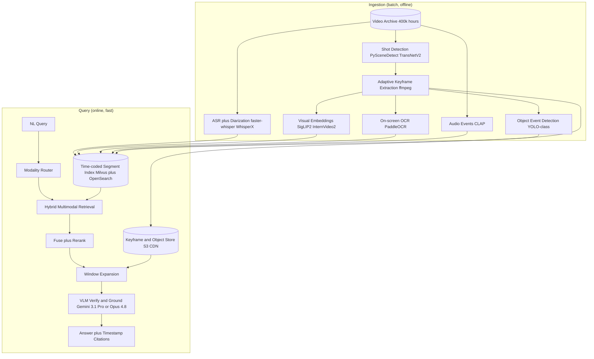
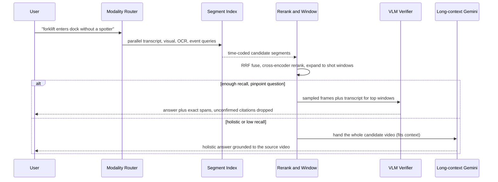

# Case Study: Long-Form Video Understanding and Search Platform

A media and corporate-learning company makes a 400,000-hour video archive (lectures, all-hands recordings, conference talks, product demos, plus a logistics subsidiary's facility and dashcam footage) searchable by natural language, returning the exact timestamped moment plus a grounded answer. The single hardest constraint is frame economics: a 1-hour video at 30fps is 108,000 frames, so you cannot feed the archive to a vision model, and the whole design is about turning video into a cheap searchable representation while keeping enough fidelity to answer temporally-grounded questions. This case is about *understanding* existing video, the mirror image of [Brand-Safe Image and Video Generation](24-multimodal-generation-pipeline.md), which *generates* it.

## The Business Problem

Three constituencies want the same thing from very different footage. A comms lead types "find the moment the CEO talks about margins" and needs the 40-second span out of a 3-hour earnings call. A student asks "which lectures cover backpropagation" and expects a ranked list of talks with jump-to timestamps. A safety manager queries "show clips where a forklift enters the loading dock without a spotter" and needs every matching incident across thousands of hours of camera footage. The naive design, "send the video to a VLM and ask," is financially and physically impossible at this scale: 400,000 hours is about 43 billion frames, and even a long-context model that samples at 1fps spends close to a million tokens per hour of video ([Gemini video understanding](https://ai.google.dev/gemini-api/docs/video-understanding)). Pre-encoding the corpus through a VLM would cost hundreds of billions of tokens, and you would pay it again on every model swap.

So the team inverts the problem. Ingestion is a one-time batch that converts each video into a cheap, time-aligned, multimodal index; the audio transcript (ASR) is the backbone because speech carries most of the searchable meaning and is near-free to compute, and visual understanding is layered on *selectively*, not per frame. Query time then reads the pre-built index, retrieves the handful of relevant segments, and pays for an expensive VLM only to verify and ground the answer over those few windows. This is Video RAG: retrieve-then-read, contrasted below with feeding a whole video to a native long-context model. See [Multi-Modal RAG](../06-retrieval-systems/12-multimodal-rag.md).

The economics live entirely in ingestion cost per hour and in how little video the query path has to re-read. Push per-frame fidelity too high and indexing the backlog costs seven figures; push it too low and you miss the 0.8-second window where the forklift crosses the line.

Constraints from the June 2026 reality:

- Scale: a 400,000-hour library growing by about 1,500 new hours per day; roughly 500,000 natural-language queries per day across internal and product users.
- Frame economics: 1 hour at 30fps is 108,000 frames; the archive is about 43 billion frames. Per-frame VLM inference is a non-starter.
- Long-context VLM cost shape: Gemini 3.1 Pro samples video near 1fps and spends about 258 tokens per frame at default resolution (about 66 at low resolution), so one hour is close to a million tokens ([Gemini docs](https://ai.google.dev/gemini-api/docs/video-understanding)).
- ASR is cheap and fast: `faster-whisper` large-v3 runs many times real time on a commodity L4, so transcribing the full backlog is a bounded one-time bill on the order of 20,000 GPU-hours ([Whisper](https://arxiv.org/abs/2212.04356)).
- Temporal precision: answers must return a span, scored by temporal IoU (for example R@1 at IoU >= 0.5), not a yes/no. The target can be a 20-second window inside a 3-hour file.
- Privacy and retention (security footage): faces, license plates, and PII must be redacted at ingestion; sensitive sites stay on-prem and footage carries retention and chain-of-custody rules.
- Model churn: embedding, captioning, and VLM models improve every few months; the index must migrate without re-decoding 400,000 hours of source video.

## Architecture

### Components

| Layer | Tech | Purpose |
|-------|------|---------|
| Ingestion orchestration | Temporal workers on spot GPUs | Durable, resumable per-video jobs |
| Shot detection | PySceneDetect plus TransNetV2 | Scene/shot boundaries as keyframe anchors |
| Keyframe extraction | ffmpeg, adaptive frame rate | Cheap frames at cuts and motion peaks |
| ASR and diarization | faster-whisper large-v3 plus WhisperX | Word-level timestamps, speaker turns |
| On-screen OCR | PaddleOCR on keyframes | Slide text, captions, signage, UI |
| Visual embeddings | SigLIP 2 (image), InternVideo2 (clip) | Text-searchable visual index |
| Audio events | CLAP plus sound-event classifier | Non-speech events (alarms, impacts, music) |
| Object/event detection | YOLO-class detector | Always-on cheap events (person, forklift) |
| Segment index | Milvus (dense) plus OpenSearch (BM25/OCR) | Hybrid time-coded retrieval |
| Keyframe/object store | S3 plus CDN | Store frames once, avoid re-decode |
| Reranker | Cross-encoder / Cohere Rerank | Fuse and order candidate spans |
| Query reasoning | Gemini 3.1 Pro (native video), Claude Opus 4.8 (sampled frames) | Verify, ground, cite timestamps |
| Cheap tier | Claude Haiku 4.5 / DeepSeek V4 Flash | Route the easy majority of queries |

### Data flow

1. A query arrives ("forklift enters the loading dock without a spotter"); a lightweight modality router classifies intent (spoken, visual, on-screen text, or event) and rewrites it into per-index sub-queries.
2. In parallel, the system runs dense transcript search, BM25 over transcript and OCR text, SigLIP text-to-visual search, and an object/audio event filter; each returns time-coded candidate segments with scores.
3. Reciprocal-rank fusion merges the per-modality candidate lists into one ranked set of segments, deduping overlapping spans.
4. A cross-encoder reranks the top ~100 fused candidates using each segment's transcript snippet, caption, and OCR text.
5. Each survivor is expanded to its containing shot plus a few seconds; the system pulls the pre-stored keyframes (decoding a denser sample only if the window needs it) from the blob store.
6. The retrieved windows (sampled frames plus transcript and OCR) go to the query-time VLM, which verifies the event is actually present, rejects false candidates, and picks the exact start and end.
7. The VLM returns a grounded answer with citations: video id, exact timestamp span, and the evidence (a keyframe, a transcript line).
8. A grounding check confirms each cited span exists and overlaps a retrieved segment; unconfirmed citations are dropped before render.
9. The UI renders deep links (`video?t=1h02m14s`) to each moment; the query, candidates, and answer are logged for eval and cost accounting.

## Key Design Decisions

### 1. ASR transcript is the cheap backbone, not an afterthought

Speech carries most of the searchable meaning in the majority of long-form content, and it is nearly free to compute. `faster-whisper` large-v3 runs many times real time on an L4, and `WhisperX` adds word-level timestamps and speaker diarization via forced alignment, which is exactly the granularity temporal grounding needs ([WhisperX](https://arxiv.org/abs/2303.00747)). The transcript, chunked into overlapping windows and embedded, is the spine of the index: it answers "the CEO talks about margins" and "which lectures cover backpropagation" without any pixels at all. Everything visual is an *addition* to this backbone, layered on only where the words are insufficient.

### 2. Shot detection and adaptive keyframe sampling, never fixed-rate frames

You cannot embed 108,000 frames per hour, and you should not sample a flat 1fps either: most frames are near-duplicates of their neighbors. The team detects shot boundaries with PySceneDetect (fast, threshold-based) backed by TransNetV2 for gradual transitions like crossfades ([TransNetV2](https://arxiv.org/abs/2008.04838)), takes representative keyframes per shot, and *raises* the sample rate adaptively on high-motion or high-object-density segments (a static lecture slide needs one frame; a busy dock needs many). This collapses the visual workload by one to two orders of magnitude while keeping the frames that carry information. Keyframes are extracted once with ffmpeg and stored, so no downstream step ever re-decodes the source.

### 3. One time-aligned multimodal segment index

The atomic unit is a *segment* (a shot or a fixed transcript window) carrying every modality aligned to the same time span: transcript text and its dense embedding, one or more visual embeddings (SigLIP 2 per keyframe, InternVideo2 for clip-level motion), OCR text, detected audio events, and detected objects. Query text hits all of them through a shared or bridged vector space, then hybrid retrieval fuses dense and lexical hits ([Hybrid Search](../06-retrieval-systems/05-hybrid-search.md)). This is the caption-and-index plus unified-embedding pattern from [Multi-Modal RAG](../06-retrieval-systems/12-multimodal-rag.md), and the choice of encoder (CLIP-family versus SigLIP versus a video-native model) is the single biggest lever on visual recall ([Embedding Models](../06-retrieval-systems/03-embedding-models.md)).

### 4. Retrieve-then-read Video RAG: the VLM reads only the retrieved windows

The expensive model never sees the corpus. Retrieval narrows a 3-hour file to a handful of candidate windows totaling seconds of footage, and only those sampled frames plus their transcript reach Gemini 3.1 Pro or Claude Opus 4.8. This bounds query cost regardless of source length: whether the match lives in a 5-minute clip or a 4-hour recording, the VLM reads the same small budget of frames. The VLM's job is narrow and verifiable: confirm the retrieved event is really present, reject false positives that matched on text but not picture, and emit an answer cited to exact timestamps.

### 5. Temporal grounding is a first-class output, refined to an exact span

Retrieval gets you the right ~30-second segment; it does not get you the frame-accurate boundary. The system expands each candidate to its shot window, then asks the VLM to pick the precise start and end, and it evaluates that span with temporal IoU metrics borrowed from moment-retrieval research (R@1 at IoU >= 0.5 and >= 0.7, as in Ego4D NLQ and Charades-STA style benchmarks; [Ego4D](https://arxiv.org/abs/2110.07058)). A returned answer without a confirmable span is treated as a failure, not a partial success: "yes, it is in there somewhere" is useless when the file is three hours long.

### 6. Long-context video model versus retrieval: pick per question, then hybridize

A native long-context video model (Gemini's long context) wins when the video is short enough to fit and the question is *holistic*: "summarize this lecture," "how does the argument evolve," "did the presenter contradict himself." Retrieve-then-read wins when you must search *across* a huge library (you cannot put 400,000 hours in context), when you need pinpoint moment retrieval, and when repeated cheap queries hit a pre-built index. The team runs both: retrieval finds the candidate video(s), and if the question is holistic and a candidate is short enough, it hands the *whole* candidate video to Gemini rather than stitched windows. The router decides, and the fallback path (below) covers low-recall queries.

### 7. Model tiering and selective captioning keep ingestion and query cost sane

Captioning every keyframe with a VLM would dominate the ingestion bill (tens of millions of keyframes at even a fraction of a cent each is six figures), so captions are generated in bulk only with a small model (Gemma 4 27B vision or a Qwen 3-VL) and, for the long tail, *on demand* at query time and cached. Query routing is tiered: most queries are answered by retrieval plus a cheap verifier (Haiku 4.5 or DeepSeek V4 Flash), and only ambiguous or holistic questions escalate to Gemini 3.1 Pro or Opus 4.8. This is the standard escalate-only-when-needed discipline from the [Cost Optimization Playbook](../04-inference-optimization/07-cost-optimization-playbook.md).

### 8. Incremental ingestion and the re-embedding tax of a model swap

New uploads flow through the same batch pipeline continuously; the SLO is that a video is searchable within about two hours of upload. The harder cost is model churn. When you adopt a better visual encoder, you must re-embed, but because keyframes and transcripts are already extracted and stored, you re-embed from the stored frames (a bounded GPU batch) instead of re-decoding video, and you keep transcripts so ASR never re-runs. Re-captioning, the expensive part, is done lazily on access. The index is versioned and dual-read during migration so a bad new embedding space can be rolled back without downtime.

### 9. When transcript-only search is the right answer (and the visual pipeline is wasted cost)

For talking-head content, podcasts, interviews, most lectures, earnings calls, all-hands recordings, the information is almost entirely in the speech. Transcript ASR plus good chunking plus hybrid search answers "when did the CEO talk about margins" at near-zero marginal cost, and adding SigLIP embeddings, per-keyframe captioning, and VLM verification buys almost no recall while multiplying the bill. Building the full visual stack here is the *wrong* choice. The team gates the expensive pipeline on content type: the visual layers run only where the picture carries information the words do not (surveillance, sports, screen recordings and demos, manufacturing, medical procedure video, silent b-roll). Knowing which archive is which is the difference between a cheap product and a bankrupt one.

## Query Path with Long-Context Fallback

## Failure Modes and Mitigations

### F1: ASR errors on accents, jargon, cross-talk, or music

Bad transcription silently poisons the backbone: a mis-heard "backpropagation" makes the lecture unfindable. Mitigation: `WhisperX` with domain-vocabulary biasing and diarization, per-segment confidence scores, low-confidence transcripts flagged for reprocessing, and fallback to the OCR/visual index so a query can still match slide text when speech fails.

### F2: Keyframe sampling misses a brief but critical event

The forklift is on screen for 0.8 seconds, between two keyframes, and the event is never indexed. Mitigation: adaptive sampling that densifies on motion and object activity, plus an always-on lightweight object detector (not just periodic keyframes) for security footage, so short events raise a flag that triggers dense frame capture.

### F3: Temporal drift, right video but wrong minute

Retrieval finds the correct file but returns a span offset from the true moment. Mitigation: word-level ASR timestamps, alignment of OCR and captions to shot boundaries, window expansion, and a VLM span-refinement step, all measured by IoU rather than binary hit/miss (Decision 5).

### F4: Query intent answered by the wrong modality

A visual query ("show the forklift") gets answered from the transcript alone, or a spoken query drowns in visual noise. Mitigation: the modality router classifies intent and always searches all indices, with reciprocal-rank fusion so no single modality can monopolize the candidate set.

### F5: Query-time cost blowup from over-reading

An ambiguous query escalates too much footage to the long-context VLM and the bill spikes. Mitigation: hard caps on frames and windows per query, cheap-verifier-first tiering, an escalation classifier tuned against a spend budget, and semantic caching of repeated queries.

### F6: Stale or unmigrated index after a model swap

A new embedding model ships but half the corpus is still on the old space, so retrieval quality splits. Mitigation: versioned index with dual-read, re-embed from stored keyframes (never re-decode video), keep transcripts to avoid re-running ASR, and roll back the query-side model instantly if grounding accuracy regresses.

### F7: Privacy leak in security or dashcam footage

Faces, plates, or PII reach a cloud VLM or the wrong viewer. Mitigation: redaction (face and plate blurring, PII scrubbing) at ingestion before any frame is stored or sent, on-prem inference for sensitive sites, per-camera and per-site access control, and an audit trail with retention rules ([Access Control](../12-security-and-access/02-access-control.md)).

### F8: Hallucinated timestamp or unconfirmable citation

The VLM asserts a moment that the footage does not actually contain. Mitigation: every answer must cite a retrieved segment id and span, a grounding check confirms the cited window overlaps a real retrieved segment, and any citation that fails the check is dropped rather than shown.

## Operational Considerations

### Monitoring

| SLO | Target |
|-----|--------|
| Query p95 latency (retrieve plus verify) | under 3.5 s |
| Query p50 latency | under 1.2 s |
| Temporal grounding R@1 at IoU >= 0.5 | over 80 percent |
| Segment retrieval recall@20 | over 92 percent |
| Answer faithfulness (cited span supports claim) | over 95 percent |
| Ingestion throughput | over 12x real time per GPU |
| Ingestion lag (upload to searchable) | under 2 hours |
| Blended cost per indexed hour | under $0.60 |
| Blended cost per query | under $0.02 |

### Cost model

At a 400,000-hour library growing by ~1,500 hours per day and ~500,000 queries per day:

- One-time backlog ingestion: ASR is roughly $10,000 to $20,000 in spot L4 GPU-hours; keyframe extraction and visual embeddings add low thousands. Bulk-captioning everything would be six figures, so captions are generated on demand and cached instead.
- Ongoing ingestion of new video: roughly $1,000 to $2,000 per day at the blended per-hour rate.
- Storage: a couple of TB of keyframes plus embeddings and transcripts on S3, and the vector index, in the low thousands of dollars per month.
- Query-time inference: dominated by the fraction that escalates to the long-context VLM; cheap-tier routing keeps blended query cost near $0.01 to $0.02.
- Re-indexing on model swap: re-embedding from stored keyframes is a bounded GPU batch; ASR is never re-run; re-captioning is lazy. Keeping raw frames and transcripts is what makes a model swap affordable.

### On-call playbook

- Ingestion lag past 2 hours: check spot-GPU preemption, widen the ASR/embedding pool, and deprioritize backfill behind new uploads.
- Grounding accuracy regression after a model or index change: freeze the new index behind a flag, dual-read old versus new, roll back the query model, and re-run the moment-retrieval eval set before re-enabling.
- Query latency spike: inspect the reranker and VLM queues; shed load by lowering top-k to the VLM and serving retrieval-only results with a "verify" affordance.
- VLM cost spike: check the escalation rate; a spike usually means the router is over-sending to the long-context tier, so cap frames per query and tighten the escalation classifier.
- ASR complaints on a content type: enable domain-vocabulary biasing and diarization and flag low-confidence transcripts for reprocessing.
- Privacy incident on security footage: revoke access to the affected camera or site, verify redaction ran at ingestion, preserve the audit trail, and follow the retention and breach runbook.

## What Strong Interview Candidates Cover

- They lead with the frame economics: 108,000 frames per hour makes per-frame VLM inference absurd, so ASR transcript is the cheap backbone and visual understanding is added selectively.
- They build one time-aligned multimodal segment index (transcript plus visual embeddings plus OCR plus audio and object events), not a transcript-only search and not a frame dump.
- They separate a big offline ingestion batch from a fast index-served query path, and put the expensive VLM only on the few retrieved windows, never the corpus.
- They can state when a native long-context video model beats retrieval (short, holistic) and when retrieve-then-read wins (search across a huge library, pinpoint moments), and they design the hybrid.
- They treat temporal grounding as a first-class output measured by IoU (R@1 at IoU >= 0.5), refine the span with the VLM, and reject unconfirmable citations.
- They budget the re-embedding and re-captioning tax of a model swap, and keep raw keyframes and transcripts so they never re-decode 400,000 hours.
- They know when *not* to build the visual pipeline: talking-head content is answered by transcript search alone, and the VLM is wasted cost.
- They handle domain specifics: privacy redaction and always-on event detection for security footage, chapter segmentation and slide OCR for lectures.

## References

- Fu et al., [Video-MME: comprehensive evaluation of multimodal LLMs in video analysis, arXiv 2405.21075](https://arxiv.org/abs/2405.21075)
- Mangalam et al., [EgoSchema: long-form video QA benchmark, arXiv 2308.09126](https://arxiv.org/abs/2308.09126)
- Wang et al., [LVBench: extreme long video understanding, arXiv 2406.08035](https://arxiv.org/abs/2406.08035)
- Grauman et al., [Ego4D and the Natural Language Queries grounding task, arXiv 2110.07058](https://arxiv.org/abs/2110.07058)
- Radford et al., [Whisper: robust speech recognition, arXiv 2212.04356](https://arxiv.org/abs/2212.04356)
- Bain et al., [WhisperX: word-level timestamps and diarization, arXiv 2303.00747](https://arxiv.org/abs/2303.00747)
- Radford et al., [CLIP: learning transferable visual models, arXiv 2103.00020](https://arxiv.org/abs/2103.00020)
- Zhai et al., [SigLIP: sigmoid loss for language-image pretraining, arXiv 2303.15343](https://arxiv.org/abs/2303.15343)
- Wang et al., [InternVideo2: video foundation models, arXiv 2403.15377](https://arxiv.org/abs/2403.15377)
- Wu et al., [CLAP: contrastive language-audio pretraining, arXiv 2211.06687](https://arxiv.org/abs/2211.06687)
- Souček and Lokoč, [TransNetV2: shot boundary detection, arXiv 2008.04838](https://arxiv.org/abs/2008.04838)
- Breakthrough, [PySceneDetect](https://www.scenedetect.com/)
- Google, [Gemini API video understanding](https://ai.google.dev/gemini-api/docs/video-understanding)

Related chapters: [Multi-Modal RAG](../06-retrieval-systems/12-multimodal-rag.md), [Embedding Models](../06-retrieval-systems/03-embedding-models.md), [Cost Optimization Playbook](../04-inference-optimization/07-cost-optimization-playbook.md), [Hybrid Search](../06-retrieval-systems/05-hybrid-search.md), [Case Study: Brand-Safe Image and Video Generation](24-multimodal-generation-pipeline.md)
