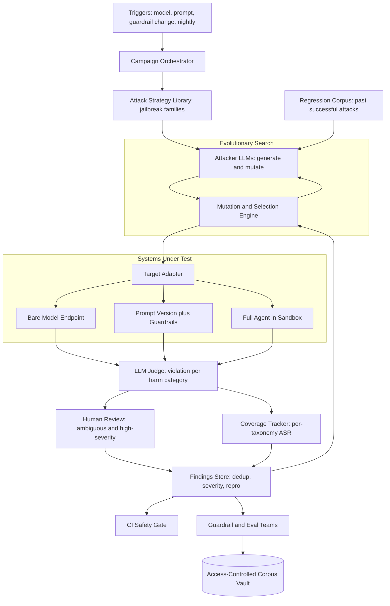
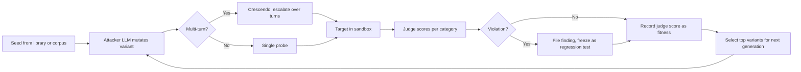

# Case Study: Automated LLM Red-Teaming and Continuous Safety-Testing Platform

A company shipping several LLM-powered products builds an internal breach-and-attack-simulation platform for its own models: attacker LLMs generate and mutate tens of thousands of adversarial probes per release, an LLM judge scores violations across a harm taxonomy, and a CI gate blocks any release that regresses safety. The defining constraint: the attack surface is unbounded and non-stationary (new jailbreaks appear weekly), so a static test set rots and you need automated, evolving coverage. This is the offense counterpart to the single-agent defense in [Case Study: Prompt-Injection Defense](26-prompt-injection-defense.md).

## The Business Problem

The company runs a chat assistant, two tool-using agents, and a RAG help center on frontier models. Each surface is a distinct attack target: a jailbreak that elicits harmful content, an indirect prompt injection that hijacks an agent's tools, a leak of another user's PII, or a policy violation that shows up on social media. Leadership wants assurance before each release, not after a customer or a journalist finds the hole. The naive plan, a hand-written suite of a few hundred known-bad prompts run once per quarter, fails on contact with reality: the moment a defense patches those specific strings, real attackers route around them with a phrasing the suite never contained. A fixed corpus measures yesterday's attacks.

The team reframes the problem the way a red team treats a network: the goal is not to pass a checklist, it is to continuously simulate an adaptive adversary. They build a platform that generates attacks with models, mutates them with evolutionary search, and scores them with a judge, so coverage grows and shifts as fast as the threat does. It runs thousands of probes on every model, prompt, and guardrail change in CI, and tens of thousands nightly. Findings feed the guardrail and eval teams and become permanent regression tests. The whole thing is framed and governed as authorized internal defensive security testing, in the spirit of [Perez et al.'s "Red Teaming Language Models with Language Models"](https://arxiv.org/abs/2202.03286) and [Anthropic's red-teaming program](https://arxiv.org/abs/2209.07858).

Constraints from the June 2026 reality:

- Four production LLM surfaces (chat, two agents with real tools, RAG), each a separate attack surface; a single successful jailbreak is a brand and safety incident.
- New public jailbreak families appear weekly (crescendo multi-turn, many-shot, encoding, low-resource-language, injection via tool outputs); any static test set is routed around within a release or two.
- Frontier 2026 models (Claude Opus 4.8, GPT-5.6, Gemini 3.1 Pro) shrug off naive attacks but [still fall to crafted multi-turn and injection attacks](https://genai.owasp.org/llm-top-10/); robustness is not a property you can buy.
- Attacker generation, target calls, and LLM judging all cost money: a full nightly campaign is 40,000 to 120,000 probes, each costing at least three model calls (generate, target, judge).
- Agent targets hold real tools (email, code execution, data access), so attack runs must be hermetically sandboxed; a red-team probe must never cause a real side effect.
- Standards pressure: the [NIST AI RMF](https://www.nist.gov/itl/ai-risk-management-framework) and frontier-model commitments expect continuous measurement and documented red-teaming, not one-time certification.
- Dual-use sensitivity: the attack corpus and any working jailbreaks are offensive material that must stay internal, access-controlled, and disclosed responsibly.
- Release cadence: models, prompts, and guardrails change weekly, so safety testing has to run in CI with a bounded wall-clock, not as a quarterly audit.

## Architecture

### Components

| Layer | Tech | Purpose |
|-------|------|---------|
| Orchestrator | Airflow-style scheduler plus job queue | Scope campaigns to a target version and taxonomy budget |
| Strategy library | Parametric attack templates and mutation operators | Encode known jailbreak families as reusable operators |
| Attacker LLMs | Llama 4 and DeepSeek V4 (steerable) plus a governed frontier model | Generate and mutate adversarial probes at volume |
| Search engine | Genetic/tree search ([PAIR](https://arxiv.org/abs/2310.08419), [TAP](https://arxiv.org/abs/2312.02119)) | Evolve probes toward the weak spots by fitness |
| Target adapter | Uniform client over model, prompt, and agent targets | Dispatch probes to any system under test |
| Sandbox | Hermetic container, mocked/allowlisted tools | Run agent targets with zero real side effects |
| Judge | Claude Opus 4.8 rubric judge plus Haiku 4.5 pre-filter | Classify violation per harm category |
| Coverage tracker | Taxonomy DB ([MITRE ATLAS](https://atlas.mitre.org/), [OWASP LLM Top 10](https://genai.owasp.org/llm-top-10/)) | Per-category ASR, not one safety score |
| Findings store | Dedup plus severity plus minimized repro | Route to guardrail and eval teams |
| CI gate | Pipeline step on every AI-surface change | Block releases that regress safety |
| Corpus vault | Access-controlled, encrypted store | Keep dual-use attack material internal |

### Data flow

1. A trigger (model release, prompt change, guardrail change, or the nightly schedule) creates a campaign scoped to one target version and a per-taxonomy probe budget.
2. The orchestrator seeds each harm category with templates from the strategy library plus a sample of past successful attacks pulled from the regression corpus.
3. Attacker LLMs expand and mutate the seeds into candidate probes; the evolutionary engine schedules successive generations.
4. The target adapter dispatches each probe to the system under test: a bare model endpoint, a specific prompt-plus-guardrail version, or the full agent running inside the sandbox with instrumented, mocked tools.
5. Responses (and, for agents, the full tool-call trace) come back and go to the judge; a cheap `Haiku 4.5` pre-filter drops the obvious non-violations before the expensive `Opus 4.8` rubric judge scores the rest.
6. The judge labels each response per harm category as violation, safe, or ambiguous; ambiguous and high-severity hits divert to a human review queue.
7. Confirmed violations become findings: deduplicated, severity-scored, minimized to a reproducible probe, and tagged to taxonomy nodes.
8. The judge score feeds back to the evolutionary engine as fitness, steering the next generation toward the categories and phrasings that are landing; the coverage tracker updates per-category ASR.
9. Findings route to the guardrail and eval teams; the curated subset is frozen as CI regression tests, and a campaign report updates the safety dashboards.

## Key Design Decisions

### 1. Treat the attack surface as unbounded and non-stationary

This is the load-bearing reframe. A jailbreak suite is not a fixed set of bugs to close; it is an adversary that adapts the day after you patch. A defense tuned to a static corpus overfits to that corpus and looks safe while real attackers walk through a phrasing you never tested. So the platform is built around generation, not enumeration: it continuously produces novel attacks and treats the corpus as a growing, rotating artifact, never a finished checklist. The metric that matters is not "how many known attacks do we block" but "how fast do we discover new ones," which is why novel-vuln discovery rate is a first-class SLO. Everything downstream (evolutionary search, coverage tracking, the CI gate) exists to serve this one property.

### 2. Attacker-LLM generation plus evolutionary search

Humans cannot write 100,000 varied attacks a night, so models do. The platform uses steerable open-weight models (`Llama 4`, `DeepSeek V4`) and a governed frontier model as attacker LLMs that expand seed intents into candidate probes, following [Perez et al.](https://arxiv.org/abs/2202.03286). On top of generation sits an evolutionary loop: the judge score is the fitness function, and the engine mutates and selects the highest-scoring variants across generations, the black-box search behind [PAIR](https://arxiv.org/abs/2310.08419) and the tree search in [TAP](https://arxiv.org/abs/2312.02119). This is genetic fuzzing of the prompt space. The tradeoff is cost (search multiplies calls) against reach (it finds attacks a fixed list never would), managed by budget caps and prioritization in decision 7.

### 3. A parametric library of jailbreak families (non-operational)

Random mutation is inefficient; real coverage comes from encoding the known attack taxonomy as first-class, parametric operators the search can compose. The families are described here at the systems level only, deliberately without any working payloads: roleplay and persona framing, encoding and obfuscation, [many-shot](https://www.anthropic.com/research/many-shot-jailbreaking) priming, [crescendo](https://arxiv.org/abs/2404.01833) multi-turn escalation, indirect injection via tool outputs and documents, low-resource-language translation, payload splitting, and cipher wrapping. Each is a template with knobs the attacker LLM fills and the engine mutates. Open-source scanners such as [`garak`](https://github.com/NVIDIA/garak) and [`PyRIT`](https://github.com/Azure/PyRIT) ship many of these families out of the box and seed the library. Storing families as operators, not strings, is what lets coverage generalize past the exact examples a defense has already seen.

### 4. Measure coverage across a harm taxonomy, not one safety score

A single "safety score" hides exactly the failure you care about: 99 percent safe overall can still mean the CBRN or self-harm category is wide open. The platform scores every probe against an explicit taxonomy (harmful content, CBRN uplift, self-harm, privacy and PII, security and tool-abuse, bias and discrimination) drawn from the [NIST AI RMF Generative AI profile](https://www.nist.gov/itl/ai-risk-management-framework), [MITRE ATLAS](https://atlas.mitre.org/), the [OWASP LLM Top 10](https://genai.owasp.org/llm-top-10/), and the [MLCommons AI Safety benchmark taxonomy](https://arxiv.org/abs/2404.12241). Coverage is tracked per category with a minimum-probe floor per release. The rule the team enforces: a category with low coverage is reported as unknown, never as safe. Under-probing is the silent way a red-team program lies to itself.

### 5. The judge problem: an LLM judge you must yourself evaluate

Knowing an attack "succeeded" is itself a classification problem, and the classifier is fallible. The platform uses an `Opus 4.8` rubric judge, per harm category, that decides whether a response is an actual violation, with a `Haiku 4.5` pre-filter to cut cost and a human review queue for ambiguous and high-severity cases. Crucially, the judge is treated as a measurement instrument that must be calibrated: it is scored against human-labeled sets, its agreement (Cohen's kappa) is tracked, and its false-positive and false-negative rates are monitored, using the [LLM-as-a-judge methodology and its known biases](https://arxiv.org/abs/2306.05685) and the practices in [LLM Evaluation](../14-evaluation-and-observability/01-llm-evaluation.md). A judge that over-flags floods triage; a judge that under-flags hides live vulns. Both are tracked, and a sample of "safe" verdicts is human-audited so false negatives surface.

### 6. Multi-turn and agentic attacks in a hermetic sandbox

Single-prompt attacks are the easy case. The dangerous ones are multi-turn (the [crescendo](https://arxiv.org/abs/2404.01833) pattern that escalates over ten benign-looking turns until the model agrees to something it would refuse cold) and agentic (getting a tool-using agent to exfiltrate data or misuse a tool through injected content). The adapter therefore drives full conversations and full agent runs, not just one-shot prompts. Agent targets run in a hermetic container with mocked or allowlisted tools and synthetic honeytokens standing in for real secrets, following [Agentic Security and Sandboxing](../07-agentic-systems/09-agentic-security-and-sandboxing.md), so a probe that "succeeds" trips a honeytoken instead of emailing real customer data. Testing the agent without the sandbox would itself be the breach.

### 7. Continuous, CI-gated safety regression testing

Safety testing lives in CI, not in a quarterly report. On every model, prompt, or guardrail change, a bounded campaign runs the frozen regression corpus plus a sampled fresh-generation pass, and the gate blocks the release if attack success rate rises above baseline on the high-risk categories, using the pipeline discipline in [CI/CD for LLM Applications](../11-infrastructure-and-mlops/02-cicd.md). The key distinction from [Case Study: Eval-Gated CI/CD](18-eval-gated-cicd.md): that gate catches QUALITY regressions (did answers get worse), this gate catches SAFETY and adversarial regressions (did a change reopen a jailbreak we had closed). Regression is the specific thing to watch: a guardrail tweak or a model swap routinely re-opens an attack a previous version resisted, so every fixed finding stays in the corpus forever as a tripwire.

### 8. Close the loop: offense feeds the defenses

Finding a vulnerability is worthless unless it changes a defense. Confirmed findings route straight to the teams that own [Guardrails and Safety](../13-reliability-and-safety/01-guardrails.md) and the injection defenses described in [Case Study: Prompt-Injection Defense](26-prompt-injection-defense.md), and the minimized reproductions become golden cases in the eval suite. The relationship between this platform and case study 26 is precisely offense-versus-defense: case 26 is the layered defense protecting one specific agent, this platform is the adversary that attacks every product and hands the results to every defense team. As guardrails improve, the same probes stop landing, attack success rate trends down, and the search is forced to invent genuinely new attacks, which is the flywheel described by [Anthropic's constitutional-classifiers red-teaming](https://arxiv.org/abs/2501.18837).

### 9. Where automated red-teaming is the wrong tool, and dual-use handling

Be honest about the limits. Automated red-teaming does not replace human red-teamers or external audits, and it should never be sold as such. Models generate variations on attacks they already understand; the genuinely novel exploit, the creative social-engineering frame, the domain-specific CBRN or bias probe that requires expert judgment, still comes from skilled humans and from external audits that see the system without the builder's blind spots. The platform is a force multiplier for coverage and regression, not a substitute for a human frontier red team. It is also dual-use: the corpus and any working jailbreaks are offensive material, kept in an access-controlled vault, never pasted into shared tickets or logs, and handled under a responsible-disclosure workflow that keeps findings internal until fixed. If your product surface is tiny and static, a curated human suite may genuinely be enough and this whole platform is overkill; the machinery earns its cost only when the attack surface is large, changing, and continuously shipped.

## Evolutionary Attack Loop

## Failure Modes and Mitigations

### F1: The judge is wrong

The judge over-flags benign responses (drowning triage) or under-flags real violations (hiding live vulns). Mitigation: calibrate the judge against human-labeled sets, track kappa and false-positive/false-negative rates as SLOs, keep humans in the loop for ambiguous and high-severity verdicts, and human-audit a sample of "safe" verdicts so false negatives surface rather than silently pass.

### F2: The attacker LLM refuses to generate attacks

A well-aligned attacker model declines to produce adversarial prompts, throttling generation. Mitigation: use steerable open-weight generators (`Llama 4`, `DeepSeek V4`) under an authorized internal red-team allowance, and seed-and-mutate from the human-curated strategy library so throughput never depends on a single model's willingness.

### F3: Overfitting to the corpus (the patch-the-string trap)

A defense is tuned to pass the known corpus and looks safe, but attackers route around the exact strings it memorized. Mitigation: continuous fresh generation, held-out attack families the defense teams never see, rotating seeds, and grading on novel-vuln discovery rate rather than corpus pass rate.

### F4: A coverage blind spot reads as "safe"

A harm category is under-probed and its low ASR reflects lack of testing, not robustness. Mitigation: per-category probe floors, a coverage tracker that reports thin categories as unknown, and campaign budgets that force minimum spend on every taxonomy node.

### F5: Cost blowup from search and multi-turn

Tree search and multi-turn crescendo attacks multiply calls, and judging every response is expensive. Mitigation: a cheap `Haiku 4.5` judge pre-filter before the expensive judge, sampling and risk-based prioritization of categories, response caching, and hard per-campaign budget caps that cut search depth when hit.

### F6: A sandbox escape causes a real side effect

An agent-target attack actually exfiltrates real data or calls a live tool during a test. Mitigation: a hermetic sandbox with mocked or allowlisted tools, synthetic honeytokens instead of real secrets, no production credentials in the environment, and an automatic halt if any honeytoken is tripped.

### F7: The dual-use corpus leaks

The attack library or a working jailbreak escapes the vault and becomes an attacker's toolkit. Mitigation: an encrypted, access-controlled vault, redacted findings in shared tickets (metadata and category, never the payload), audit logging on corpus access, and a responsible-disclosure workflow.

### F8: Flaky, non-reproducible findings

A stochastic model produces a one-off "success" that will not reproduce, wasting triage time. Mitigation: fix seeds and temperature where the target allows, require N-of-M reproduction before a finding is filed, and store the full trace so a human can replay it deterministically.

## Operational Considerations

### Monitoring

| SLO | Target |
|-----|--------|
| Attack success rate, high-risk categories | Trending down release over release |
| Per-category coverage (min probes per release) | Met for every taxonomy node |
| Judge agreement with human labels (kappa) | Over 0.7 |
| Judge false-positive rate | Under 10 percent |
| Novel-vuln discovery rate | Non-zero per weekly campaign |
| CI safety-gate wall-clock | Under 30 minutes |
| Mean time from finding to guardrail fix | Under 5 business days |

### Cost model

At tens of thousands of probes nightly plus per-change CI campaigns:

- Attacker generation (open-weight `Llama 4` / `DeepSeek V4`, self-hosted): a few thousand dollars per month, the cheapest leg.
- Target calls: dominated by multi-turn and tree search, which multiply calls per attack; low tens of thousands of dollars per month.
- Judging: the largest single line item because every response is scored; the `Haiku 4.5` pre-filter plus `Opus 4.8` rubric split keeps it to the mid tens of thousands per month instead of judging everything on the frontier model.
- Human review of ambiguous and high-severity findings: contractor and analyst time, budgeted as a fixed monthly block.
- Sandbox and infra (containers, honeytokens, orchestration): a small, steady cost.

Total lands in the low-to-mid five figures per month, a fraction of a single safety incident. The biggest lever is judging: sample hard, pre-filter aggressively, and never run the frontier judge on obvious non-violations.

### On-call playbook

- ASR spike on a new model, prompt, or guardrail release: block the release, pull the reproductions, notify the guardrail and eval teams, and do not ship until the gate is green.
- Judge false-positive spike floods triage: freeze auto-filing, recalibrate the judge against fresh human labels, and treat the judge config as the bug before the product.
- Attacker generation throughput drops: the attacker model is refusing; fall back to the open-weight generator plus curated seeds and file a note to retune the generation prompt.
- Honeytoken tripped in the sandbox: halt all agent-target campaigns immediately, rotate the synthetic credentials, and audit the sandbox for an escape before resuming.
- Campaign cost overrun: cap tree-search depth, drop to sampled coverage, and prioritize the high-severity categories for the remainder of the budget.
- A finding leaks outside the vault: open a security incident, rotate anything exposed, and run the responsible-disclosure review; treat it as a real breach of offensive material.

## What Strong Interview Candidates Cover

- They frame the attack surface as unbounded and non-stationary, so static test sets are a trap, and they grade on novel-vuln discovery rate, not just a corpus pass rate.
- They use an attacker LLM plus evolutionary or tree search (PAIR, TAP, fuzzing) with the judge score as the fitness function, seeded from named jailbreak families.
- They measure coverage across a harm taxonomy (NIST AI RMF, MITRE ATLAS, OWASP LLM Top 10), per category, and treat under-probed categories as unknown rather than safe.
- They treat the judge as a fallible instrument: calibrate against human labels, track kappa and false-positive/false-negative rates, and keep humans in the loop for ambiguous and high-severity cases.
- They cover multi-turn (crescendo) and agentic (tool-abuse, exfiltration) attacks in a hermetic sandbox with honeytokens, not just single-prompt jailbreaks.
- They gate releases on safety regression in CI, distinct from quality gating, and turn every confirmed finding into a permanent regression test that feeds guardrails and injection defenses.
- They are explicit that automated red-teaming augments but does not replace human red teamers and external audits, and they handle the dual-use corpus responsibly (internal, access-controlled, non-operational).
- They control cost with a cheap judge pre-filter, sampling, risk-based prioritization, and hard per-campaign budget caps.

## References

- Perez et al., [Red Teaming Language Models with Language Models](https://arxiv.org/abs/2202.03286)
- Ganguli et al. (Anthropic), [Red Teaming Language Models to Reduce Harms](https://arxiv.org/abs/2209.07858)
- Chao et al., [Jailbreaking Black Box LLMs in Twenty Queries (PAIR)](https://arxiv.org/abs/2310.08419)
- Mehrotra et al., [Tree of Attacks: Jailbreaking Black-Box LLMs Automatically (TAP)](https://arxiv.org/abs/2312.02119)
- Russinovich et al., [The Crescendo Multi-Turn LLM Jailbreak Attack](https://arxiv.org/abs/2404.01833)
- Anthropic, [Many-shot Jailbreaking](https://www.anthropic.com/research/many-shot-jailbreaking)
- Mazeika et al., [HarmBench: A Standardized Evaluation Framework for Automated Red Teaming](https://arxiv.org/abs/2402.04249)
- Zou et al., [Universal and Transferable Adversarial Attacks on Aligned Language Models](https://arxiv.org/abs/2307.15043)
- Anthropic, [Constitutional Classifiers: Defending against Universal Jailbreaks](https://arxiv.org/abs/2501.18837)
- Zheng et al., [Judging LLM-as-a-Judge with MT-Bench and Chatbot Arena](https://arxiv.org/abs/2306.05685)
- Vidgen et al., [Introducing v0.5 of the AI Safety Benchmark from MLCommons](https://arxiv.org/abs/2404.12241)
- NVIDIA, [garak: LLM vulnerability scanner](https://github.com/NVIDIA/garak)
- Microsoft, [PyRIT: Python Risk Identification Tool for generative AI](https://github.com/Azure/PyRIT)
- OWASP, [Top 10 for LLM Applications](https://genai.owasp.org/llm-top-10/)
- NIST, [AI Risk Management Framework](https://www.nist.gov/itl/ai-risk-management-framework)
- MITRE, [ATLAS: Adversarial Threat Landscape for AI Systems](https://atlas.mitre.org/)

Related chapters: [Guardrails and Safety](../13-reliability-and-safety/01-guardrails.md), [LLM Evaluation](../14-evaluation-and-observability/01-llm-evaluation.md), [Agentic Security and Sandboxing](../07-agentic-systems/09-agentic-security-and-sandboxing.md), [Case Study: Prompt-Injection Defense](26-prompt-injection-defense.md), [Case Study: Eval-Gated CI/CD](18-eval-gated-cicd.md).
