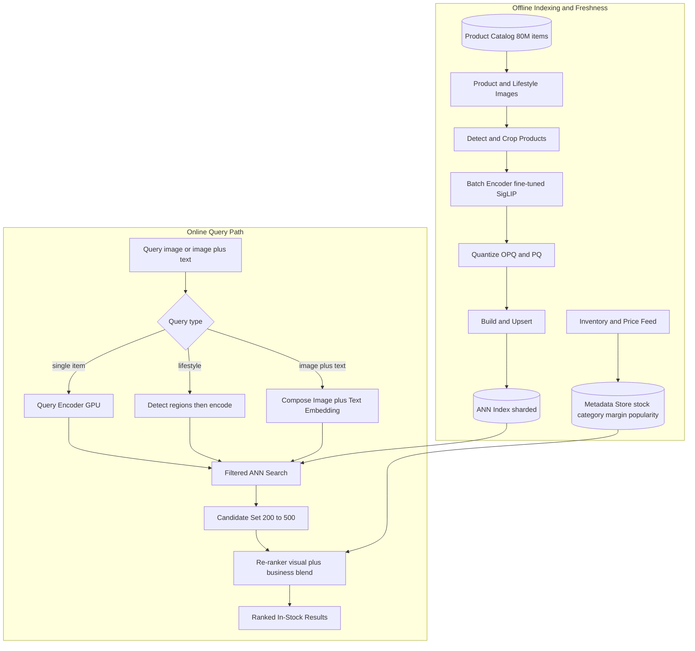
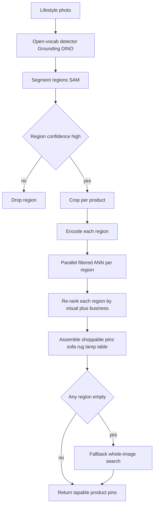

# Case Study: E-commerce Visual Search and Multimodal Product Discovery

A large marketplace with 80M products lets shoppers search by photo: snap a couch, dress, or sneaker and get visually similar in-stock items, shop the look from a lifestyle photo, and run text-plus-image queries like "this jacket but in green." At hundreds of millions of image embeddings and thousands of visual queries per second, the single hardest constraint is matching on visual similarity at massive scale with single-digit-millisecond ANN latency while keeping results commercially relevant (in stock, right category, not just pixel-similar) and the catalog fresh as inventory churns. Unlike the behavioral recommender in [11-recommendation-engine.md](11-recommendation-engine.md), the signal here is the image, not the click log.

## The Business Problem

Visual search matters most where words fail the shopper. Someone sees a couch at a friend's place, a dress on the street, or a sneaker in a photo, and cannot name the brand, the silhouette, or the exact color, but they can take a picture. The product has to turn that picture into a short row of buyable, in-stock look-alikes fast enough that it feels like search, not a science project. On top of single-item lookup sit two harder modes: shop the look, where a lifestyle photo contains a sofa and a rug and a lamp and the shopper wants all of them, and composed queries, where the shopper hands over an image plus a text edit ("this but cheaper," "in green," "more formal").

The naive build fails on three axes at once. First, off-the-shelf CLIP and SigLIP are trained on web alt-text: they nail coarse semantics ("a red dress") but miss the fine-grained attributes commerce is made of (midi versus maxi, ribbed versus cable knit, matte versus gloss finish), so generic embeddings return plausible-looking wrong products. Second, pure nearest-neighbor retrieval is not commercial relevance: the pixel-closest item is routinely out of stock, a different category (a phone case that looks like the handbag you photographed), or a low-margin drop-ship listing. Third, an 80M catalog churns every minute (new arrivals, sellouts, restocks, price and image changes), so an index built last night is already lying to shoppers.

So the team builds a content-retrieval system, not a recommender. A domain-fine-tuned multimodal encoder projects images and text into one shared space; a real vector engine holds hundreds of millions of quantized, sharded vectors and answers filtered ANN queries in single-digit milliseconds; a business-aware re-ranker blends visual similarity with availability, margin, and popularity; an object detector segments lifestyle photos so each product gets its own search; and an event-driven ingestion pipeline keeps embeddings fresh as inventory turns over. The distinction from [11-recommendation-engine.md](11-recommendation-engine.md) is the whole point: that system ranks from behavior and cannot see a brand-new SKU, while this one sees a product the moment its image is indexed, which is exactly why freshness is a first-order constraint here.

Constraints from the June 2026 reality:

- 80M products with several images each, plus lifestyle shots and per-region crops, push the index past 300M vectors; the catalog churns constantly, so a static nightly index is stale by morning.
- Thousands of visual queries per second at peak; the ANN step must stay single-digit milliseconds and end-to-end p99 under about 200 ms, or shoppers bounce.
- Off-the-shelf CLIP/SigLIP is trained on captions, not products: it confuses a midi with a maxi, misses knit patterns, and has no notion of in-stock versus discontinued.
- Frontier VLM APIs (Gemini 3.1 Pro, Claude Opus 4.8 vision) are too slow and too expensive to call on the per-query hot path at this QPS, so the query encoder must be self-hosted and cheap.
- Visual nearest neighbor is not commercial relevance: the closest match is often unavailable, off-category, or low-margin, so a business-aware re-rank is mandatory, not optional polish.
- A brand-new SKU has zero engagement, so behavioral recs cannot surface it, but its image embeds on day one; visual search is the cold-start discovery path, which raises the bar on freshness.
- Memory math forces the design: 300M 768-dim fp32 vectors are roughly 900 GB before graph overhead, so quantization and sharding are prerequisites, not tuning knobs.

## Architecture

### Components

| Layer | Tech | Purpose |
|-------|------|---------|
| Query encoder | Fine-tuned SigLIP 2 ViT, self-hosted on GPU | Encode the query image and text into the shared space |
| Embedding model | Domain-fine-tuned CLIP/SigLIP; Cohere Embed v4 or Voyage Multimodal as managed alt | One shared image-text vector space |
| Object detection | Grounding DINO plus SAM for open-vocab detect and segment | Find and crop products in lifestyle photos |
| ANN index | Vespa or Milvus, HNSW and IVF-PQ, sharded and replicated | Sub-10ms nearest neighbors over hundreds of millions of vectors |
| Quantization | OPQ plus PQ, full-precision rerank vectors on SSD | Fit the index in RAM without collapsing recall |
| Metadata store | Postgres or low-latency KV, streaming inventory feed | Stock, category, price, margin, popularity for filter and rerank |
| Re-ranker | LambdaMART or small neural ranker, or a Vespa ranking expression | Blend visual similarity with business signals |
| Composed query | Attribute parser plus embedding composition, Pic2Word-style | Resolve "this but in green" |
| Ingestion pipeline | Event-driven encoder, streaming upserts, tombstones | Keep embeddings fresh as the catalog churns |
| Eval and logging | Labeled match set, click and conversion logs | recall@k, category precision, online CTR and CVR |

### Data flow

1. A shopper uploads a photo; the app classifies the query type (single item, lifestyle, or image-plus-text) and, for lifestyle photos, runs detection first.
2. The self-hosted query encoder projects the image into the shared embedding space; for image-plus-text, the text modifier is fused into the query or turned into attribute filters.
3. The search layer issues a filtered ANN query: nearest neighbors constrained at traversal time to in-stock and, where known, the right category, so the candidate set is already commercially valid.
4. The index returns 200 to 500 candidates with approximate distances; full-precision vectors for those candidates are fetched from SSD for exact re-scoring.
5. The metadata store supplies availability, price, margin, popularity, and seller quality for each candidate.
6. The re-ranker blends exact visual similarity with the business features into a final score, learned from click and conversion logs.
7. Results are returned as ranked in-stock products, or, for shop the look, as tapable pins grouped by detected region.
8. The interaction (impression, click, add-to-cart, purchase) is logged and feeds both the re-ranker training set and the relevance eval.

## Key Design Decisions

### 1. A fine-tuned shared image-text embedding space

Off-the-shelf CLIP and SigLIP are strong at coarse semantics and weak on the attributes commerce lives on: sleeve length, neckline, heel type, wood finish, knit pattern. The fix is to fine-tune a SigLIP 2-class encoder on the catalog itself, using product titles, structured attributes, and category as the text side and hard-negative mining (a maxi dress as a negative for a midi) so the space actually separates look-alikes that matter to shoppers. One shared space is the whole point: image queries, text queries, and product images all land in the same index, so a photo and the phrase "ribbed green cardigan" retrieve from a single store. Managed multimodal embeddings (Cohere Embed v4, Voyage Multimodal 3.5, Gemini Embedding) are a fast start, but at this QPS a self-hosted fine-tuned encoder wins on both cost and domain precision. See [Embedding Models](../06-retrieval-systems/03-embedding-models.md) and [Multi-Modal RAG](../06-retrieval-systems/12-multimodal-rag.md).

### 2. ANN at scale: quantization, sharding, and the recall-latency-cost triangle

Hundreds of millions of vectors will not sit in RAM uncompressed: 300M 768-dim fp32 vectors are roughly 900 GB before the HNSW graph overhead. So the index compresses vectors to tens of bytes with OPQ plus product quantization, sharded across nodes and replicated for QPS, using HNSW or IVF-PQ as the graph and inverted structure ([HNSW](https://arxiv.org/abs/1603.09320), [FAISS](https://github.com/facebookresearch/faiss)). Quantization trades recall for memory, so the pattern is coarse-search-then-exact-rerank: ANN over compressed codes returns a few hundred candidates in single-digit milliseconds, then those candidates are re-scored against full-precision vectors on SSD. A real engine does the heavy lifting; Vespa and Milvus both scale here, and the choice turns on whether you want business ranking in the same query (Decision 3). See [Vector Databases](../06-retrieval-systems/04-vector-databases.md).

### 3. Visual similarity is not commercial relevance

The core mistake is shipping raw nearest-neighbor results. The pixel-closest item is frequently the wrong answer: out of stock, a different category, or a low-margin listing that hurts the marketplace. Commercial relevance is a re-ranking problem: over the ANN candidate set, a learned ranker (LambdaMART or a small neural model) blends visual similarity with availability, category match, price fit, margin, popularity, and seller quality, trained on click and conversion logs. This is why Vespa is attractive: it expresses the ANN closeness and the business features in one server-side ranking expression, so filtering and blending happen without a second hop. This layer, not the encoder, is what turns "looks similar" into "worth showing." See [Reranking Strategies](../06-retrieval-systems/06-reranking-strategies.md); contrast the behavioral collaborative ranking in [11-recommendation-engine.md](11-recommendation-engine.md).

### 4. Filter in the index, not after it

In-stock and category constraints have to be applied during ANN traversal, not as a post-filter on the top-k. Post-filtering is a trap at this scale: if 40 percent of the catalog is out of stock, a naive top-100 can leave a handful of showable items, or none. Modern vector engines support filtered ANN (constrained HNSW traversal, IVF list pruning) so availability and category are honored while the graph is walked. The metadata that drives the filter (stock, category, price) lives in a low-latency store updated by the same inventory feed that drives freshness, so a sold-out item stops appearing within minutes, not on the next full rebuild.

### 5. Shop the look: detect, then search each region

A lifestyle photo contains a sofa, a rug, a lamp, and a coffee table, and the shopper wants all of them. So shop the look is a two-stage path: an open-vocabulary detector (Grounding DINO) plus segmentation (SAM) finds and crops each product region, and each crop runs its own filtered ANN search, returning tapable pins per region ([Grounding DINO](https://arxiv.org/abs/2303.05499), [SAM](https://arxiv.org/abs/2304.02643)). This is the pattern Pinterest productized as Lens and Complete the Look ([unified embeddings](https://arxiv.org/abs/1908.01707), [Complete the Look](https://arxiv.org/abs/1812.01748)). Detection confidence gates the regions: a low-confidence box is dropped rather than shown as a bad match, and if detection finds nothing usable the system falls back to whole-image search.

### 6. Combined text-plus-image queries

"This jacket but in green" is a composed query, and there are two ways to serve it, used together. For well-defined attributes (color, size, price band, brand), the reliable move is to parse the text into structured facets and apply them as filters over visual similarity on shape and style, because a color facet is exact where embedding math is fuzzy. For open-ended style edits ("more formal," "vintage vibe"), a composed-image-retrieval model fuses the image and text into one query embedding ([Pic2Word](https://arxiv.org/abs/2302.03084)). Crude embedding arithmetic (image vector plus a text delta) works in a pinch but drifts off intent, so the production default is facet-filter-first, compose-for-the-rest.

### 7. Catalog freshness: incremental embedding and index updates

80M products churn constantly, and re-embedding and rebuilding nightly is too slow: a new SKU that is invisible for a day is lost GMV. So freshness is event-driven. A catalog change publishes an event, the new or changed image is encoded and upserted into the index within minutes, removed items get a tombstone so they drop out immediately, and pure availability flips are handled by the metadata filter with no re-encoding at all. HNSW degrades under heavy delete churn and IVF centroids drift over time, so a periodic full rebuild restores graph quality underneath the streaming layer. This is the ingestion discipline of [31-rag-data-ingestion-pipeline.md](31-rag-data-ingestion-pipeline.md) applied to image vectors instead of documents.

### 8. Cold-start and the long tail: where content retrieval wins and still struggles

This is the honest advantage over behavioral recommendation. A brand-new product has zero clicks, so the collaborative recommender in [11-recommendation-engine.md](11-recommendation-engine.md) cannot rank it, but its image embeds the moment it is listed, so visual search surfaces it on day one; that is exactly why freshness matters so much here. The long tail is harder in the other direction: rare items sit in sparse regions of the index where ANN recall drops, and a popularity-weighted re-ranker quietly buries them (rich get richer). The mitigation is diversity and exploration in the re-rank and treating popularity as a soft prior, not a hard gate, so the tail stays discoverable.

### 9. When visual search is the wrong tool

Visual search is a discovery entry point for visually-driven categories (fashion, furniture, decor), not a universal search replacement, and pretending otherwise degrades the experience. For commodity and spec-driven items (a named SKU, a laptop chosen by RAM, an iPhone charger), keyword and text search win outright because the shopper knows the exact term and pixels only add noise. For logged-in shoppers with rich history, behavioral recommendation often out-converts visual similarity because it captures taste and cross-category affinity that appearance cannot. And visual search underdelivers on intent mismatch: a photo of a couch might mean "this exact couch cheaper" (a product-match problem) or "things that go with this couch" (a recommendation problem), neither of which is nearest-neighbor similarity. The right posture is to route by category and query type and let text search and recs carry what they carry better. See [Hybrid Search](../06-retrieval-systems/05-hybrid-search.md).

## Shop the Look Flow

## Failure Modes and Mitigations

### F1: Out-of-stock or discontinued top results

The visual-closest item is unavailable, so the shopper taps into a dead end. Mitigation: in-stock filtering at ANN traversal time (Decision 4) plus an availability penalty in the re-rank, with the inventory feed flipping stock state within minutes.

### F2: Category drift, pixel-similar but commercially wrong

A lamp base retrieves for a handbag query, or a phone case for a shoe, because they share silhouette and color. Mitigation: a category classifier on the query, category-constrained retrieval, and category precision tracked as a gated metric so drift is caught before it ships.

### F3: Stale embeddings after catalog churn

New arrivals are missing and sold-out items still show because the index lags the catalog. Mitigation: event-driven incremental encode-and-upsert with tombstones (Decision 7), a freshness SLO on product-live-to-searchable lag, and periodic full rebuilds to restore graph quality.

### F4: Off-the-shelf encoder misses fine-grained attributes

A generic CLIP returns the right shape but the wrong pattern, sleeve, or material, which reads to shoppers as a broken search. Mitigation: domain fine-tuning with hard-negative mining on attributes (Decision 1), evaluated on a labeled fine-grained match set, not just coarse category.

### F5: Recall collapse under aggressive quantization

Over-compressed PQ codes drop the true match out of the candidate set entirely. Mitigation: coarse-search-then-exact-rerank against full-precision vectors, PQ parameters tuned against measured recall@k versus an exact baseline, and recall monitored as an index-health SLO separate from relevance.

### F6: Query-encoder GPU cost and latency spike at peak

A traffic surge on a viral item or a sale overloads the encoder fleet and p99 latency blows the budget. Mitigation: request batching on the encoder, a distilled smaller query model, autoscaling on the GPU fleet, and an embedding cache for popular or near-duplicate query images. See [Cost Optimization Playbook](../04-inference-optimization/07-cost-optimization-playbook.md).

### F7: Shop-the-look mis-detection

The detector segments a background object as a product or misses an item the shopper wanted. Mitigation: confidence-thresholded detection that drops weak regions, a whole-image fallback when nothing usable is found (Decision 5), and a human-labeled detection eval set.

### F8: Off-catalog or adversarial query images

The shopper photographs something the marketplace does not sell (a competitor SKU, a person, a meme), and the index returns a forced, irrelevant nearest neighbor. Mitigation: a low-similarity threshold that returns "no strong visual match" and falls back to text search, rather than showing a confidently wrong result.

## Operational Considerations

### Monitoring

| SLO | Target |
|-----|--------|
| ANN search latency p99 | single-digit ms |
| End-to-end visual query p99 | under 200 ms |
| recall@10 vs exact search | over 0.95 |
| Category precision@10 | over 0.90 |
| In-stock rate of top-10 | over 0.98 |
| Product-live to searchable, p95 | under 10 minutes |
| Visual-result click-through and add-to-cart | no regression on release |
| Full index rebuild | under a few hours |

### Cost model

Estimates at hundreds of millions of vectors and thousands of QPS:

- ANN index cluster (RAM-heavy, sharded and replicated, quantized): the dominant fixed cost, roughly tens of thousands of dollars a month.
- Query-encoder GPU fleet (L4/A10-class, autoscaled to thousands of QPS): a real monthly line, low tens of thousands.
- Initial catalog backfill: encoding hundreds of millions of images is a large one-time batch GPU spend; steady-state incremental re-embedding is a small fraction of it.
- Object detection for shop the look: GPU inference only on lifestyle queries, a smaller line that scales with that traffic slice.
- Re-ranker: a gradient-boosted or small neural model over a few hundred candidates, cheap relative to encode and index.
- Metadata store and streaming updates: modest, but the inventory feed must be reliable because it drives both filtering and freshness.

### On-call playbook

- ANN latency p99 breach: check shard hotspotting and replica health, shed load to a cached-result path for popular queries, and scale replicas before touching recall parameters.
- Freshness lag alarm: inspect the ingestion event backlog, confirm upserts and tombstones are draining, and trigger a targeted re-index of the affected catalog slice.
- Relevance drop in CTR or category precision: freeze re-ranker and encoder versions, diff against the last good release, and roll back; both go through shadow eval before traffic.
- Encoder fleet saturation: raise batching, autoscale GPUs, and serve popular query images from the embedding cache; if still saturated, degrade gracefully to text search.
- Index rebuild overrunning: run the rebuild on a replica and hot-swap, never rebuild a serving shard in place.

## What Strong Interview Candidates Cover

- They separate the two hard problems: a fine-tuned shared image-text embedding space for recall, and a business-aware re-rank for commercial relevance, and they insist raw nearest-neighbor is not shippable.
- They know off-the-shelf CLIP/SigLIP is weak on fine-grained product attributes and reach for domain fine-tuning with hard-negative mining, not a bigger generic model.
- They do the memory math (hundreds of millions of vectors do not fit uncompressed) and design coarse-quantized-search-then-exact-rerank with sharding, naming the recall-latency-cost triangle.
- They filter in the index for in-stock and category rather than post-filtering the top-k, and can explain why post-filtering collapses at high out-of-stock rates.
- They treat shop the look as detect-then-search-per-region with a whole-image fallback, and composed queries as facet-filter-first with embedding composition for fuzzy edits.
- They make freshness event-driven with incremental upserts, tombstones, and periodic rebuilds, and connect it to cold-start: visual search is the one path that surfaces a zero-engagement new SKU.
- They say plainly where visual search loses to keyword search and behavioral recs (commodity and spec items, logged-in taste, intent mismatch) and route by category and query type instead of over-claiming.

## References

- Radford et al., [Learning Transferable Visual Models From Natural Language Supervision (CLIP)](https://arxiv.org/abs/2103.00020)
- Zhai et al., [Sigmoid Loss for Language Image Pre-Training (SigLIP)](https://arxiv.org/abs/2303.15343)
- Tschannen et al., [SigLIP 2: Multilingual Vision-Language Encoders](https://arxiv.org/abs/2502.14786)
- Malkov and Yashunin, [Efficient and Robust ANN Search using HNSW Graphs](https://arxiv.org/abs/1603.09320)
- Jegou et al., [Product Quantization for Nearest Neighbor Search](https://inria.hal.science/inria-00514462)
- Facebook Research, [FAISS: a library for efficient similarity search](https://github.com/facebookresearch/faiss)
- [Vespa: ANN search plus business ranking in one query](https://vespa.ai/)
- [Milvus: open-source vector database](https://github.com/milvus-io/milvus)
- Jing et al., [Visual Search at Pinterest](https://arxiv.org/abs/1505.07647)
- Zhai et al., [Learning a Unified Embedding for Visual Search at Pinterest (Lens)](https://arxiv.org/abs/1908.01707)
- Kang et al., [Complete the Look: Scene-based Complementary Product Recommendation](https://arxiv.org/abs/1812.01748)
- Yang et al., [Visual Search at eBay](https://arxiv.org/abs/1706.03154)
- Liu et al., [Grounding DINO: Open-Set Object Detection](https://arxiv.org/abs/2303.05499)
- Kirillov et al., [Segment Anything (SAM)](https://arxiv.org/abs/2304.02643)
- Saito et al., [Pic2Word: Zero-Shot Composed Image Retrieval](https://arxiv.org/abs/2302.03084)
- Zhu et al., [Generalized Contrastive Learning for Multi-Modal Retrieval and Ranking (Marqo GCL)](https://arxiv.org/abs/2404.08535)

Related chapters: [Embedding Models](../06-retrieval-systems/03-embedding-models.md), [Vector Databases](../06-retrieval-systems/04-vector-databases.md), [Reranking Strategies](../06-retrieval-systems/06-reranking-strategies.md), [Multi-Modal RAG](../06-retrieval-systems/12-multimodal-rag.md), [Case Study: Recommendation Engine](11-recommendation-engine.md)
