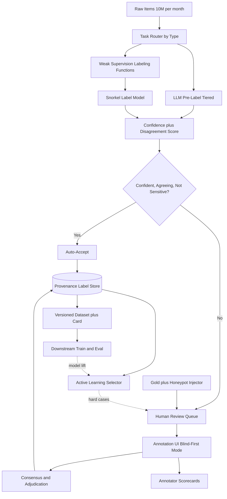
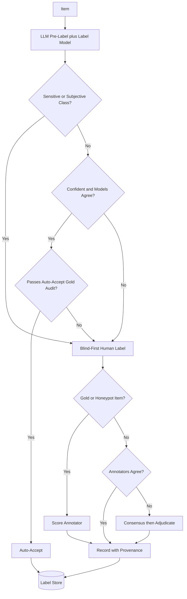

# Case Study: LLM-Assisted Data Annotation and Labeling Platform

A data-labeling platform (an in-house AI team or a labeling vendor) turns roughly 10M raw items a month into training and eval labels across classification, extraction, ranking, and RLHF-style preference comparisons: LLMs pre-label to cut cost, humans review and correct, and the corrected labels become the ground truth for the next model. The defining constraint is that label quality is the ceiling on every downstream model, and an LLM pre-labeler can silently inject correlated errors and bias at scale, so the whole job is to buy high-quality labels cheaply without letting the model's own mistakes become the ground truth. This is the labeling sibling of the [Synthetic Data Generation Pipeline](37-synthetic-data-generation.md), which manufactures new inputs rather than labeling real ones.

## The Business Problem

The platform serves several downstream teams who all need labeled data: an intent classifier, an extraction model for documents, a ranking model, and a reward model for RLHF. Historically this was all-human labeling, accurate but slow and expensive, with datasets measured in weeks and five to six figures each. Cheap LLMs changed the economics: a small model can pre-label most items correctly for a fraction of a cent, so paying a human to label from scratch is now waste on the easy majority. The platform's value is spending human effort only where it actually raises quality.

The naive designs all fail in instructive ways. Auto-accept every LLM label and you get cheap data with the model's blind spots baked in as ground truth, an error rate you cannot even see, and a next model that inherits and amplifies exactly those mistakes. Have humans label all 10M items and quality is high but cost and turnaround are back to the old world. Show the human the LLM's suggested label and let them "review" it, and automation bias means they rubber-stamp it: you pay the full human cost and get auto-accept quality, because the reviewer's judgment is now correlated with the model's error.

The architecture the team picks is confidence-routed human-in-the-loop with a quality-measurement spine. A cheap LLM pre-labels everything; a router auto-accepts the confident, agreeing majority and sends only low-confidence and disagreement items to humans; gold and honeypot items measure both human and model quality live; Snorkel-style weak supervision adds a cheap signal that fails differently from the LLM; active learning aims the human budget at the items that move the downstream model most; and every label carries full provenance. The north-star metric is downstream model lift, not internal agreement.

Constraints from the June 2026 reality:

- About 10M items a month across four task families (classification, extraction, pairwise preference, RLHF comparisons); the mix shifts week to week.
- LLM pre-label is cheap (Haiku 4.5, Gemma 4 27B, DeepSeek V4 Flash at fractions of a cent per short item); human review is the dominant cost at roughly $0.10 to $0.60 per reviewed item.
- Automation bias is real and measurable: showing a human the model's answer anchors them toward accepting it ([Parasuraman & Manzey, 2010](https://doi.org/10.1177/0018720810376055)).
- Label quality is the hard ceiling: a model trained on 88 percent-accurate labels rarely exceeds that accuracy on the same task.
- Agreement target: Cohen's or Fleiss' kappa above 0.75 on objective tasks before a dataset ships.
- Preference data must survive LLM-judge biases (position, length, sycophancy) and must not encode reward-hackable proxies.
- Full provenance per label for dataset cards and audit: who or what produced it, at what confidence, by what method, against which guideline version.
- Turnaround SLA measured in days, not the weeks all-human labeling took.

## Architecture

### Components

| Layer | Tech | Purpose |
|-------|------|---------|
| Ingestion and routing | Kafka plus task DB | Type items and order the queue |
| Pre-label models | Haiku 4.5, Gemma 4 27B, DeepSeek V4 Flash; Gemini 3.1 Pro or Opus 4.8 on hard items | Cheap first-pass labels |
| Weak supervision | Snorkel labeling functions plus label model | Independent cheap signal |
| Confidence and disagreement | Token logprobs, self-consistency samples, ensemble variance | Decide what humans see |
| Annotation UI | Label Studio or Argilla | Human review and correction |
| QA | Gold and honeypot injection, kappa engine | Catch bad humans and bad models |
| Consensus | Dawid-Skene or Bayesian aggregation | Fuse multi-annotator votes |
| Provenance and versioning | DVC or LakeFS plus per-label lineage | Reproducible, auditable datasets |
| Active learning | Uncertainty and disagreement sampler | Spend budget where it moves the model |

### Data flow

1. An item is ingested, typed (classification, extraction, preference, RLHF pair), and placed in its task pipeline.
2. A cheap LLM pre-labels it and returns a label, a rationale, and a confidence signal (token logprobs plus a few self-consistency samples); weak-supervision labeling functions vote in parallel.
3. A Snorkel label model turns the labeling-function votes into a probabilistic label; the platform now holds three cheap opinions (LLM, label model, any rules) plus their agreement.
4. A router scores confidence and disagreement. If the models are confident, agree, and the class is neither policy-sensitive nor subjective, the item is auto-accepted; otherwise it goes to the human queue, prioritized by active-learning value.
5. Gold items (known answers) and honeypots (items where the shown pre-label is deliberately wrong) are seeded into the human queue at 5 to 10 percent to score annotators live.
6. For sensitive or subjective classes the UI runs blind-first: the human commits a label before the LLM suggestion is revealed, then reconciles, so the model cannot anchor them.
7. Disagreements (human vs model, or annotator vs annotator) route to consensus and, if still split, to an adjudicator; the final label is written with full provenance: source, confidence, method, model version, reviewer.
8. Corrected labels update annotator scorecards and retrain the label model; uncertain and high-disagreement items feed the active-learning queue; a versioned dataset with a card exports to downstream training, whose model lift becomes the metric that re-prioritizes future labeling.

## Key Design Decisions

### 1. Route scarce human attention by confidence and disagreement, not uniformly

The core economic move. A cheap LLM pre-labels all 10M items; the router auto-accepts the confident, agreeing majority and sends only the uncertain and contested minority to humans. The auto-accept threshold trades cost against quality directly, so set it empirically: pick the highest threshold at which audited auto-accept accuracy against gold stays above the dataset's quality bar (say 98 percent), and route everything below it. In practice 55 to 75 percent auto-accept is typical, which is the difference between paying humans for 10M items and paying for 3M. This is textbook human-in-the-loop routing; see [Human-in-the-Loop Patterns](../07-agentic-systems/08-human-in-the-loop-patterns.md).

### 2. Measure label quality continuously with kappa, gold, and consensus

You cannot manage what you do not measure, and "the LLM seems good" is not a measurement. Three instruments. Inter-annotator agreement (Cohen's kappa for two raters, Fleiss' for many) tells you whether the task is even well-defined: kappa below about 0.6 means the guidelines are broken, not that the annotators are lazy ([Landis & Koch, 1977](https://www.jstor.org/stable/2529310) bands). Gold items with known answers, seeded blind into every queue, give a live per-annotator accuracy independent of agreement. Consensus fuses multiple passes with a Dawid-Skene model ([Dawid & Skene, 1979](https://www.jstor.org/stable/2346806)) rather than naive majority, so reliable annotators get more weight, producing the label of record on hard items plus an uncertainty estimate. These three are the backbone; everything else is plumbing.

### 3. Break the circularity so LLM and human errors stay independent

The trap that makes this whole domain dangerous. If the human just sees and confirms the LLM's label, their "review" is correlated with the model's error: any mistake the model makes confidently sails through, becomes the ground truth that trains the next model, and gets repeated with more confidence. This is not model collapse (recursive training on generated data, [Shumailov et al., 2024](https://www.nature.com/articles/s41586-024-07566-y), see [Synthetic Data Generation](37-synthetic-data-generation.md)); it is labeling real data where labeler and reviewer share a blind spot. Defenses: blind-first review for subjective and sensitive classes, honeypots that flip the pre-label to catch rubber-stamping, and a standing rule that a class where the pre-labeler shares the failure mode you are trying to measure is never auto-accepted. Note that a high LLM-human kappa is not reassurance here: if both share a cultural bias they agree for the wrong reason, and kappa looks great.

### 4. Weak supervision as a cheap independent third signal

Snorkel-style weak supervision ([Ratner et al., 2017](https://arxiv.org/abs/1711.10160)) is nearly free after setup and, crucially, fails differently than the LLM. Domain experts write labeling functions (regexes, lookups, heuristics, a small model), each noisy and partial; a label model estimates each function's accuracy and correlations and fuses them into a probabilistic label without ground truth. Because these functions encode explicit human domain rules rather than the LLM's learned priors, their errors are largely uncorrelated with the LLM's, so agreement between weak supervision and the LLM is real evidence and disagreement is a high-value routing signal to a human. It also gives coverage on the long tail where a general LLM is weakest.

### 5. Active learning: spend the labeling budget where it moves the model

Human labels are the scarce resource, so spend them where they change the downstream model most, not uniformly. Uncertainty sampling (label the items the model is least sure about) and query-by-committee (label where the LLM and the label model disagree) are the classic levers ([Settles, 2009](https://burrsettles.com/pub/settles.activelearning.pdf)). The flywheel: label a batch, train, run the new model over unlabeled data, find the hard and newly-uncertain cases, and route those to humans next. This is the same uncertainty signal the eval stack uses to find failure slices; see [LLM Evaluation](../14-evaluation-and-observability/01-llm-evaluation.md). Done well, active learning reaches a target accuracy with a fraction of the labels random sampling needs.

### 6. Preference and RLHF data: pairwise, calibrated judges, reward-hacking guards

Preference data has its own failure surface. Prefer pairwise comparisons (A vs B) over absolute 1 to 5 scores because humans are far more consistent at relative judgments, and fuse them with a Bradley-Terry model ([Bradley & Terry, 1952](https://www.jstor.org/stable/2334029)) into a reward signal. An LLM judge can pre-label preferences and agrees with humans about 80 percent of the time, comparable to human-human agreement ([Zheng et al., 2023](https://arxiv.org/abs/2306.05685)), but it carries position, verbosity, and self-enhancement bias ([Wang et al., 2023](https://arxiv.org/abs/2305.17926)) plus sycophancy ([Sharma et al., 2023](https://arxiv.org/abs/2310.13548)). Mitigate with position-swapped double-judging, length-controlled prompts, and a standing human anchor set. The deeper risk is reward hacking: if the labels reward length or a confident tone as a proxy for quality, the RLHF'd model games exactly that proxy and overoptimizes ([Gao et al., 2022](https://arxiv.org/abs/2210.10760)). Keep a held-out human preference set as the ground truth the judge is validated against, never the reverse.

### 7. Auditability and annotator management: provenance for every label

Every label carries immutable lineage: which model or human produced it, at what confidence, by what method (auto-accept, consensus, adjudication), against which guideline version, at what time. That is what lets you ship a dataset card, answer an auditor, and reproduce the exact dataset version a model trained on (DVC or LakeFS). On the human side, annotator scorecards track gold accuracy, kappa against the cohort, honeypot catch rate, and throughput; annotators below threshold are retrained or suspended and their recent labels re-adjudicated. The model is just another annotator on this ledger: it has a scorecard too, and it can be "suspended" (its class demoted to mandatory human review) when its gold accuracy slips.

### 8. Cost and latency: model tiering and the auto-accept lever

At 10M items a month the pre-label spend is small (fractions of a cent each on Haiku 4.5, Gemma 4 27B, or DeepSeek V4 Flash) and human review is the whole cost. Two levers. Tier the models: cheapest by default, escalate to Gemini 3.1 Pro or Opus 4.8 only on the items the cheap model is unsure about, a tiny fraction. And tune the auto-accept threshold, the single biggest cost driver: moving auto-accept from 60 to 75 percent cuts human volume by roughly 40 percent, but only do it while audited auto-accept precision holds. Batch pre-labeling and cache the shared instruction prefix; both cut pre-label cost materially. See [FinOps and Token Economics](../11-infrastructure-and-mlops/04-finops-and-token-economics.md).

### 9. When LLM pre-labeling is the wrong choice

Do not let an LLM pre-label where its suggestion would corrupt the very signal you need. Three no-go zones. Safety-critical ground truth (medical, legal, or trust-and-safety labels that become the reference other systems are measured against): the cost of a confident, correlated error is too high, so label these blind-first with humans and use the LLM only as a post-hoc disagreement flag. Subjective or cultural judgments (offensiveness, humor, political lean, aesthetic quality): the model's prior is one demographic's view dressed as objectivity, and showing it anchors annotators toward that view, so collect independent human labels and report the disagreement rather than resolving it away. And anything where the model shares the failure mode you are trying to measure: if you are building an eval to find where a model class hallucinates, a sibling model hallucinates in the same places and confidently labels them correct. The screen: LLM pre-labeling helps when the task is objective, the model's errors are independent of the human's and detectable against gold, and a wrong label is cheap to catch. When any of those fails, pay for humans.

## Per-Item Routing and QA Flow

## Failure Modes and Mitigations

### F1: Correlated LLM errors become ground truth

The pre-labeler is confidently wrong on a whole class, auto-accept passes it through, and the mistake trains the next model, which repeats it. Mitigation: cap the auto-accept rate and continuously audit the auto-accepted stream against fresh gold (Decision 1), never auto-accept classes where the model shares the failure mode (Decision 9), and alarm when auto-accept precision on gold drops below the bar.

### F2: Automation bias, humans rubber-stamp the model

Reviewers glance at the LLM suggestion and accept it, so you pay for human review and get auto-accept quality. Mitigation: blind-first review for the classes that matter, honeypots that flip the pre-label (a reviewer who accepts a honeypot is rubber-stamping), and a tracked human edit rate. If reviewers almost never change the label, the review is theater.

### F3: A bad annotator (human or model) silently poisons labels

One annotator or a drifted model version quietly injects wrong labels for weeks. Mitigation: gold items give live per-annotator accuracy, kappa flags an outlier against the cohort, and scorecards auto-suspend below threshold and trigger re-adjudication of recent work (Decision 7). The model sits on the same scorecard.

### F4: Preference labels are biased or reward-hackable

The LLM judge favors longer or first-listed answers, or the labels reward a proxy the RLHF model then games. Mitigation: position-swapped double-judging, length controls, a human anchor set as ground truth, and monitoring the accepted preferences for proxy correlations like length or confident tone (Decision 6). Overoptimization shows up as reward climbing while human-judged quality falls.

### F5: Confidence miscalibration

The LLM is confident and wrong, so raw logprobs over-route easy items to auto-accept and under-route the dangerous ones. Mitigation: calibrate confidence against gold with reliability curves and temperature scaling ([Guo et al., 2017](https://arxiv.org/abs/1706.04599)), and use disagreement with the label model as an independent second gate rather than trusting logprobs alone.

### F6: Distribution drift the pre-labeler has not seen

New item types arrive (a new product, a new language, a new abuse pattern) and the pre-labeler is silently out of distribution. Mitigation: drift detection on input embeddings, route novel clusters straight to humans, and let active learning surface the new region for a guideline update (Decision 5).

### F7: Eval contamination, machine labels leak into the gold eval

Auto-labeled items end up in both the training split and the trusted eval set, flattering the downstream model. Mitigation: the gold eval is 100 percent human-verified, built separately, and never auto-labeled; a dedup pass checks every eval case against the training pool by embedding and exact match. This mirrors the eval-gating discipline in [Eval-Gated CI/CD](18-eval-gated-cicd.md).

### F8: Provenance gaps break auditability

A dataset ships and no one can say how a disputed label was produced or reproduce the exact version a model trained on. Mitigation: immutable per-label lineage and dataset versioning (Decision 7), a dataset card on every export, and a rule that no batch ships without complete provenance.

## Operational Considerations

### Monitoring

| SLO | Target |
|-----|--------|
| Label accuracy vs trusted gold set | over 98 percent for shipped objective labels |
| Inter-annotator kappa (Fleiss) before ship | over 0.75 objective; reported as-is for subjective |
| Auto-accept precision on blind gold audit | at or above the dataset quality bar (e.g. 98 percent) |
| Human edit rate on shown pre-labels | over 8 percent (near-zero signals rubber-stamping) |
| Gold pass rate per active annotator | over 92 percent or suspend |
| Cost per verified label | within budget, tracked per task type |
| Preference judge vs human agreement | over 80 percent and position-swap consistent |
| Downstream model lift per labeled batch | positive, else re-prioritize |

### Cost model

At about 10M items a month:

- LLM pre-label on a cheap tier (Haiku 4.5, Gemma 4 27B, DeepSeek V4 Flash): fractions of a cent per short item, low five figures a month; escalation to Gemini 3.1 Pro or Opus 4.8 on the uncertain few percent adds a little.
- Human review is the dominant line: at $0.10 to $0.60 per reviewed item, routing 30 percent of 10M to humans is 3M reviews, the bulk of platform spend; the auto-accept fraction moves this line more than anything else.
- Weak supervision: near-zero marginal cost once labeling functions are written.
- QA overhead: 5 to 10 percent of human capacity spent on gold and honeypots, non-negotiable.
- Blended cost per verified label lands well below all-human labeling, and the gap widens as auto-accept precision improves. See [FinOps and Token Economics](../11-infrastructure-and-mlops/04-finops-and-token-economics.md) for the token math.

### On-call playbook

- Kappa drops on a task: pull annotator scorecards and the guideline version diff; a cohort-wide drop is usually a guideline or pre-labeler change, a single-annotator drop is a suspension.
- Auto-accept precision falls on the gold audit: lower the threshold immediately to route more to humans, then find the drifted class or model version.
- Gold pass rate collapses for one annotator: suspend, re-adjudicate their recent labels, backfill from the consensus pool.
- Judge vs human divergence on preference data: pause auto-preference labeling, re-run the human anchor set, recalibrate before resuming.
- Cost spike: check whether auto-accept fell (drift routed more to humans) or the human queue backed up (throughput or staffing).

## What Strong Interview Candidates Cover

- They open with "label quality is the ceiling" and frame the platform as buying quality cheaply without letting the model's mistakes become ground truth.
- They route human attention by confidence and disagreement, and set the auto-accept threshold from audited precision against gold, not a gut number.
- They insist LLM and human errors stay independent, and use blind-first review and honeypots against automation bias, naming it as a measured effect.
- They treat kappa, gold items, and Dawid-Skene consensus as the measurement backbone, and know kappa can look great when both raters share a bias.
- They add weak supervision (Snorkel) as a cheap signal that fails differently from the LLM, and use LLM-vs-label-model disagreement as a routing signal.
- They know preference data is pairwise, that LLM judges carry position and length bias, and that the labels themselves can be reward-hacked.
- They keep full provenance and a human-verified eval that is never auto-labeled, and can name the classes where LLMs must not pre-label at all.

## References

- Ratner et al., [Snorkel: Rapid Training Data Creation with Weak Supervision](https://arxiv.org/abs/1711.10160)
- Cohen, [A Coefficient of Agreement for Nominal Scales (1960)](https://doi.org/10.1177/001316446002000104)
- Fleiss, [Measuring Nominal Scale Agreement Among Many Raters (1971)](https://doi.org/10.1037/h0031619)
- Landis & Koch, [The Measurement of Observer Agreement for Categorical Data (1977)](https://www.jstor.org/stable/2529310)
- Dawid & Skene, [Maximum Likelihood Estimation of Observer Error-Rates Using the EM Algorithm (1979)](https://www.jstor.org/stable/2346806)
- Settles, [Active Learning Literature Survey (2009)](https://burrsettles.com/pub/settles.activelearning.pdf)
- Zheng et al., [Judging LLM-as-a-Judge with MT-Bench and Chatbot Arena](https://arxiv.org/abs/2306.05685)
- Wang et al., [Large Language Models are not Fair Evaluators](https://arxiv.org/abs/2305.17926)
- Sharma et al., [Towards Understanding Sycophancy in Language Models](https://arxiv.org/abs/2310.13548)
- Christiano et al., [Deep Reinforcement Learning from Human Preferences](https://arxiv.org/abs/1706.03741)
- Stiennon et al., [Learning to Summarize from Human Feedback](https://arxiv.org/abs/2009.01325)
- Gao et al., [Scaling Laws for Reward Model Overoptimization](https://arxiv.org/abs/2210.10760)
- Bradley & Terry, [Rank Analysis of Incomplete Block Designs (1952)](https://www.jstor.org/stable/2334029)
- Guo et al., [On Calibration of Modern Neural Networks](https://arxiv.org/abs/1706.04599)
- Parasuraman & Manzey, [Complacency and Bias in Human Use of Automation (2010)](https://doi.org/10.1177/0018720810376055)
- Shumailov et al., [AI Models Collapse When Trained on Recursively Generated Data (Nature, 2024)](https://www.nature.com/articles/s41586-024-07566-y)
- [Label Studio](https://labelstud.io/), [Argilla](https://argilla.io/), and [Snorkel](https://github.com/snorkel-team/snorkel) tooling

Related chapters: [Human-in-the-Loop Patterns](../07-agentic-systems/08-human-in-the-loop-patterns.md), [LLM Evaluation](../14-evaluation-and-observability/01-llm-evaluation.md), [Case Study: Synthetic Data Generation](37-synthetic-data-generation.md), [Case Study: Eval-Gated CI/CD](18-eval-gated-cicd.md).
