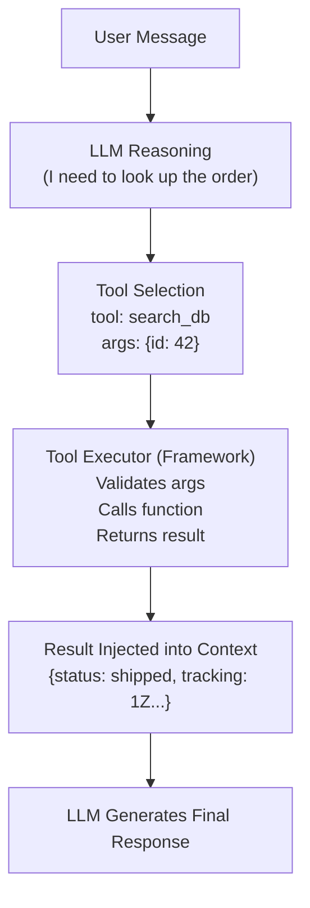
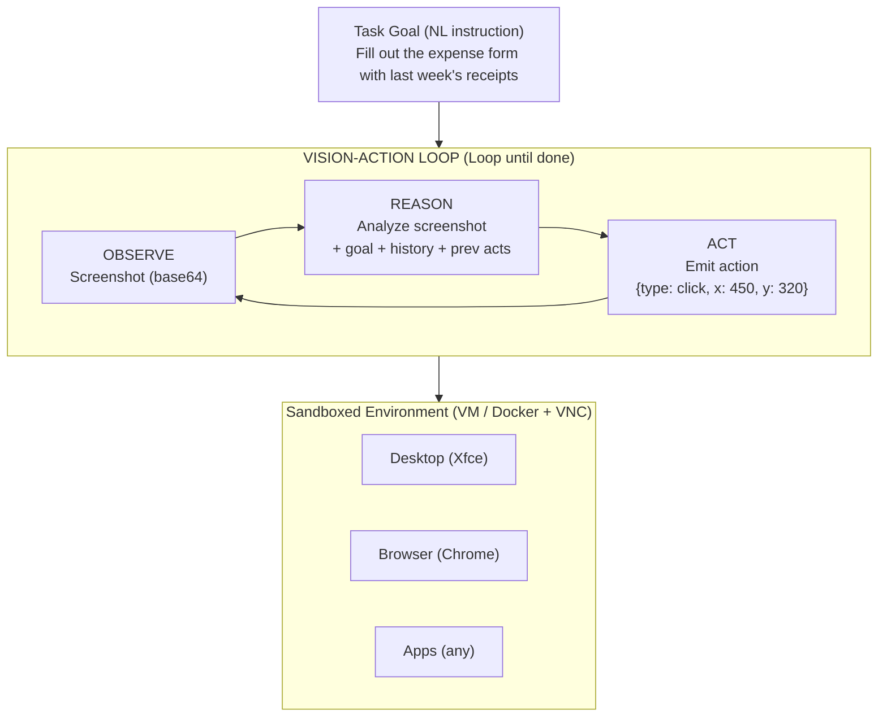
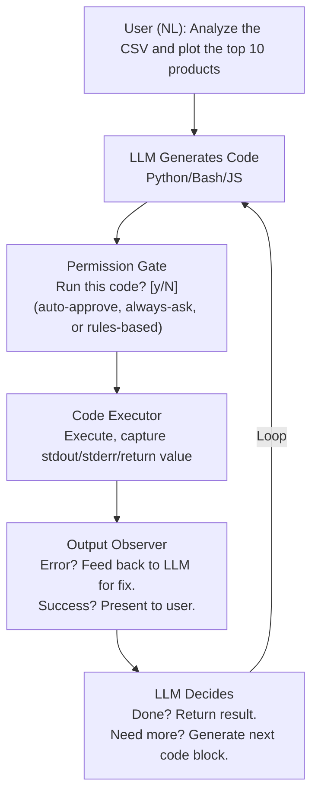
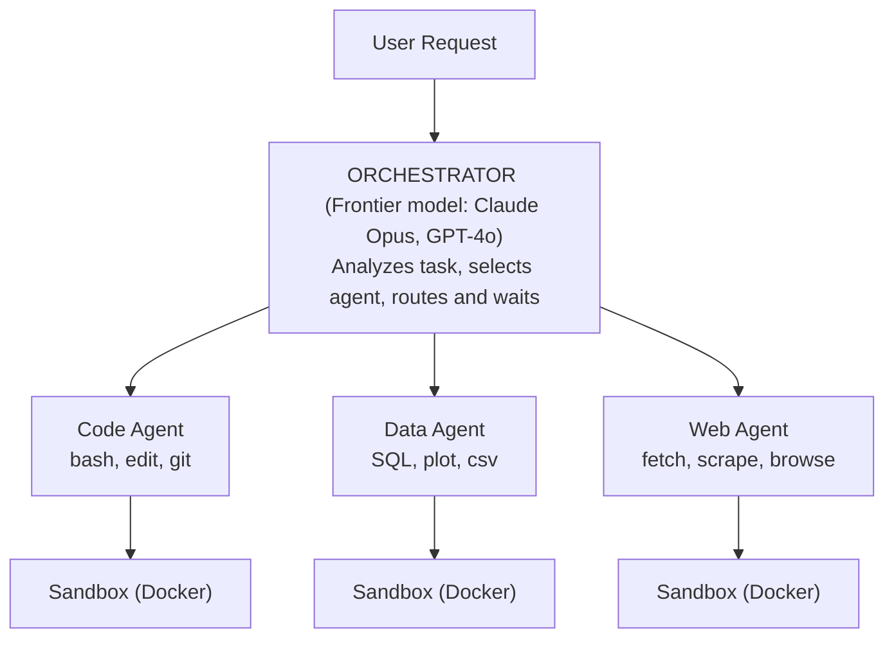
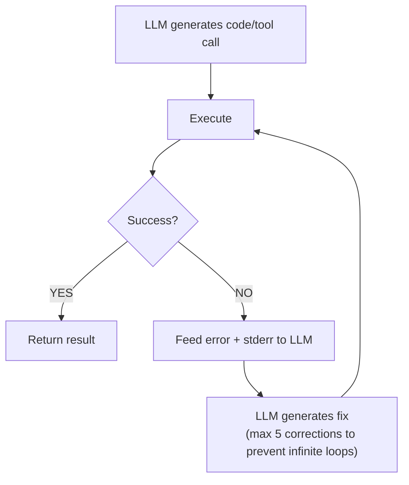
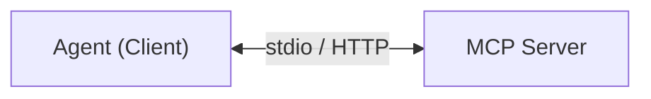
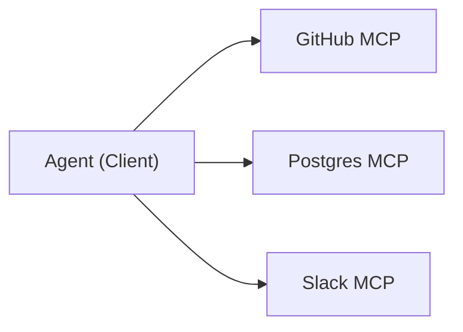
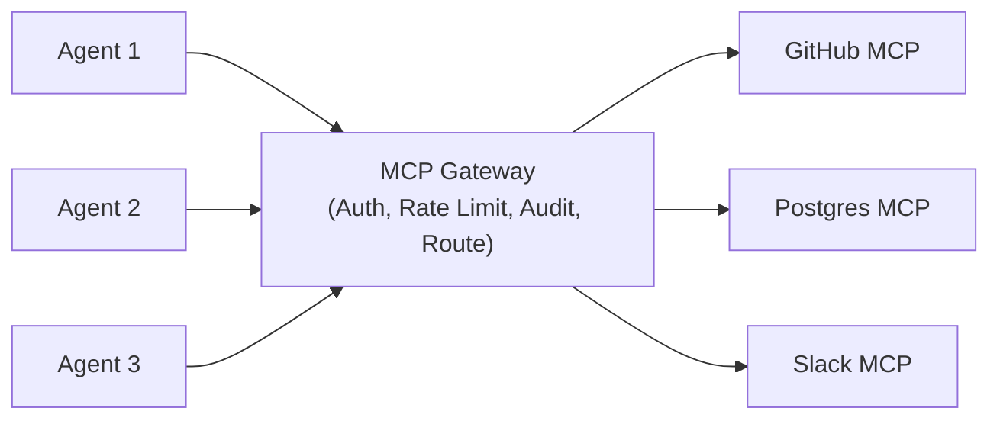
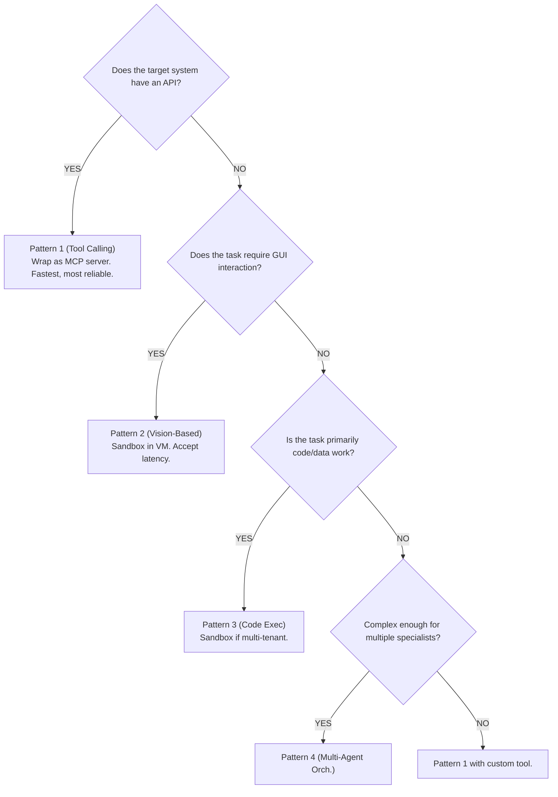

# Architecture Patterns for Tool-Use Agents

Every tool-use agent in 2026 -- from OpenClaw to Claude Code to Cursor's Background Agents -- is built on one of a handful of core architecture patterns. Understanding these patterns lets you design agents from first principles rather than copying specific tools. This chapter breaks down each pattern with detailed diagrams, code examples, trade-offs, and guidance on when to use which.

## Table of Contents

- [Pattern 1: Function/Tool Calling](#pattern-1-functiontool-calling)
- [Pattern 2: Vision-Based Automation](#pattern-2-vision-based-automation)
- [Pattern 3: Local Code Execution](#pattern-3-local-code-execution)
- [Pattern 4: Multi-Agent Tool Orchestration](#pattern-4-multi-agent-tool-orchestration)
- [Sandboxed vs. Unsandboxed Execution](#sandboxed-vs-unsandboxed-execution)
- [State Management Across Tool Calls](#state-management-across-tool-calls)
- [Error Handling and Retry Patterns](#error-handling-and-retry-patterns)
- [MCP Integration Patterns](#mcp-integration-patterns)
- [Architecture Decision Tree](#architecture-decision-tree)
- [System Design Interview Angle](#system-design-interview-angle)
- [Interview Questions](#interview-questions)
- [References](#references)

---

## Pattern 1: Function/Tool Calling {#pattern-1-functiontool-calling}

The most widely deployed pattern in production. The LLM decides which tool to call and with what arguments; a framework executes the call; results are fed back into the conversation for the next reasoning step.

### Architecture



### The Three Steps in Detail

**Step 1 -- Schema Presentation**: The model receives a JSON schema describing available tools. In 2026, best practice is to use Dynamic Manifests that fetch only relevant tools based on the user's intent, rather than loading all tool schemas upfront.

**Step 2 -- Intent and Extraction**: The model outputs a structured tool call. This is not free-form text; it is a JSON object with `tool_name` and `arguments` that the framework can parse deterministically.

**Step 3 -- Execution and Contextualization**: The framework validates arguments (using Pydantic, Zod, or similar), calls the function, and injects the result back into the conversation as a new message with role `tool`.

### Code Example: MCP Server + Client

```python
# MCP Server: defines a tool with strict schema
from mcp.server import Server
from pydantic import BaseModel, Field

server = Server("order-service")

class OrderLookup(BaseModel):
    """Look up an order by ID. DO NOT use for cancelled orders."""
    order_id: str = Field(..., description="The order UUID")

@server.tool()
async def lookup_order(args: OrderLookup) -> dict:
    order = await db.orders.find_one({"id": args.order_id})
    if not order:
        return {"error": "Order not found", "suggestion": "Check order ID format"}
    return {"status": order["status"], "tracking": order.get("tracking_number")}
```

```python
# MCP Client: agent discovers tools dynamically, calls them, feeds results back
tools = await mcp_client.list_tools()
response = client.messages.create(model="claude-sonnet-4-6", tools=tools,
    messages=[{"role": "user", "content": "Where is my order ORD-12345?"}])

if response.stop_reason == "tool_use":
    tool_call = response.content[0]
    result = await mcp_client.call_tool(tool_call.name, tool_call.input)
    # Feed result back as a tool_result message for the next LLM turn
```

### When to Use This Pattern

- API integrations (databases, SaaS tools, internal services)
- Structured data retrieval and mutation
- Any workflow where you can define the tool interface upfront
- Production systems where you need audit trails and input validation

### Trade-offs

| Advantage | Disadvantage |
|-----------|--------------|
| Deterministic execution | Requires tool schema upfront |
| Easy to audit and log | Cannot interact with arbitrary UIs |
| Fast (50-200ms per tool call) | Model may hallucinate tool names/args |
| Works with any LLM that supports tool use | Schema overload with many tools |

---

## Pattern 2: Vision-Based Automation {#pattern-2-vision-based-automation}

The model sees a screenshot of the screen, reasons about what to do, and emits a low-level action (click, type, scroll). The environment executes the action, takes a new screenshot, and the loop repeats. This is how Claude Computer Use and Open Interpreter's Computer API work.

### Architecture



### The Observe-Reason-Act Cycle

**Observe**: Capture a screenshot of the current screen state. In Claude Computer Use, this is a base64-encoded PNG sent as an image content block. The Zoom Action (new in 2026) allows capturing a high-resolution crop of a specific region for dense UIs.

**Reason**: The multimodal LLM analyzes the screenshot alongside the task goal and action history. It decides what the next action should be. This step consumes the most tokens.

**Act**: The model emits a structured action:
- `left_click(x, y)` -- click at coordinates
- `type(text)` -- type a string
- `key(key_combo)` -- press keyboard shortcut
- `scroll(direction, amount)` -- scroll the page
- `screenshot()` -- take a new screenshot without acting
- `zoom(x0, y0, x1, y1)` -- inspect a region at high resolution

### Code Example: Computer Use Loop

```python
tools = [
    {"type": "computer_20250124", "name": "computer",
     "display_width_px": 1280, "display_height_px": 800},
    {"type": "bash_20250124", "name": "bash"},
    {"type": "text_editor_20250124", "name": "str_replace_based_edit_tool"}
]
messages = [{"role": "user", "content": "Open the browser and go to GitHub."}]

while True:  # The vision-action loop
    response = client.messages.create(
        model="claude-sonnet-4-6", max_tokens=4096, tools=tools, messages=messages)
    if response.stop_reason == "end_turn":
        break
    for block in response.content:
        if block.type == "tool_use":
            result = sandbox.execute_action(block.name, block.input)
            messages.append({"role": "assistant", "content": response.content})
            messages.append({"role": "user", "content": [
                {"type": "tool_result", "tool_use_id": block.id, "content": result}]})
```

### When to Use This Pattern

- Automating legacy applications with no API
- End-to-end testing of graphical interfaces
- Tasks that require interaction with multiple applications
- Non-developer users who describe tasks in natural language

### Trade-offs

| Advantage | Disadvantage |
|-----------|--------------|
| Works with any GUI application | Slow (1-3 sec per action step) |
| No API or integration needed | High token cost (screenshots are large) |
| Handles dynamic UIs | Misclick risk on dense interfaces |
| Accessible to non-technical users | Requires sandboxed VM for safety |

---

## Pattern 3: Local Code Execution {#pattern-3-local-code-execution}

The user describes a task in natural language. The LLM generates code. The code runs on the local machine (or in a sandbox). The output is observed, and the LLM either generates more code or provides the final answer. This is how Open Interpreter and parts of Claude Code work.

### Architecture



### The NL-Code-Execute-Observe Cycle

**1. Natural Language to Code**: The LLM translates the user's intent into executable code. The code language depends on the task -- Python for data analysis, bash for system operations, JavaScript for web tasks.

**2. Permission Gate**: Before execution, the user is asked to approve. This is the critical safety mechanism for unsandboxed environments. Implementations vary:
- **Always ask** (Open Interpreter default): Every code block requires explicit approval
- **Auto-approve** (trusted mode): Dangerous but fast
- **Rules-based** (Claude Code model): Allow/deny patterns in configuration. For example: allow `git` commands, deny `rm -rf`

**3. Execute and Capture**: The code runs in a runtime with full (or restricted) system access. Stdout, stderr, return values, and any generated files are captured.

**4. Observe and Iterate**: The LLM sees the execution output. If there is an error, it generates a fix. If the output is partial, it generates the next step. This creates a self-correcting loop.

### Code Example: Code Execution Agent

```python
class CodeExecutionAgent:
    def __init__(self, llm_client, sandbox=None):
        self.llm = llm_client
        self.sandbox = sandbox  # None = unsandboxed (host)
        self.history = []

    async def run(self, task: str) -> str:
        self.history.append({"role": "user", "content": task})
        for iteration in range(10):  # Max 10 code-execute cycles
            response = await self.llm.generate(messages=self.history)
            code = extract_code_block(response)
            if not code:
                return response  # No code = final answer
            if not self.sandbox and not await user_approves(code):
                return "Execution cancelled by user."
            result = await (self.sandbox or LocalExecutor()).run(code, timeout=30)
            self.history.append({"role": "assistant", "content": response})
            self.history.append({"role": "user",
                "content": f"stdout: {result.stdout}\nstderr: {result.stderr}"})
        return "Max iterations reached."
```

### When to Use This Pattern

- Data analysis and visualization tasks
- System administration and DevOps automation
- File processing and transformation
- Any task where the user describes "what" and the agent figures out "how"

### Trade-offs

| Advantage | Disadvantage |
|-----------|--------------|
| Extremely flexible | Security risk if unsandboxed |
| Self-correcting via observe loop | Model may generate dangerous code |
| Works offline with local models | Requires user to evaluate code (or trust) |
| Full system access when needed | Non-deterministic (same prompt, different code) |

---

## Pattern 4: Multi-Agent Tool Orchestration {#pattern-4-multi-agent-tool-orchestration}

Instead of one agent with many tools, you have multiple specialized agents that each own a subset of tools. An orchestrator routes tasks to the right agent. This is the "microservices revolution" for agents.

### Architecture



### Orchestration Strategies

**1. Router-Based (Simplest)**: The orchestrator is a classifier. It looks at the user's message, picks the right specialist agent, and forwards the entire task. No inter-agent communication.

**2. Plan-and-Execute**: A planning model (frontier-class) breaks the task into subtasks and assigns each to the appropriate specialist. Subtask results are aggregated by the planner. Benchmarks show 92% task completion with 3.6x speedup over sequential ReAct.

**3. Hierarchical**: High-level agents assign work to lower-level agents, which may further delegate. This mirrors organizational structures and works well for complex projects.

**4. Collaborative (Peer-to-Peer)**: Agents can communicate with each other directly, sharing observations and requesting help. This is the most complex pattern but handles emergent tasks well.

### Cost Optimization: The Plan-and-Execute Advantage

| Approach | Step | Cost |
|----------|------|------|
| Traditional | Frontier Model handles all steps | $1.00/task |
| Plan-and-Execute | Frontier Model plans (1 call) | $0.05 |
| Plan-and-Execute | Small Model executes steps 1-3 | $0.03 |
| Plan-and-Execute | Frontier Model aggregates (1 call) | $0.05 |
| Plan-and-Execute | **Total** | **$0.13/task (Savings: ~87%)** |

The 2026 trend is treating agent cost optimization as a first-class concern, similar to how cloud cost optimization became essential in the microservices era.

---

## Sandboxed vs. Unsandboxed Execution {#sandboxed-vs-unsandboxed-execution}

This is the most consequential architecture decision for any tool-use agent.

### Comparison

| Aspect | UNSANDBOXED (Host Access) | SANDBOXED (Isolated) |
|--------|---------------------------|----------------------|
| Execution | LLM output executes directly on host OS | LLM output executes inside Docker/VM/E2B |
| Risk profile | Risk: `rm -rf /`, data exfiltration | Isolated filesystem, network, processes |
| Used by | OpenClaw, Open Interpreter, Claude Code (default) | OpenHands, OpenAI Codex, Jules, Cursor Background Agents |

### Sandbox Implementation Options

| Technology | Isolation Level | Startup Time | Use Case |
|------------|----------------|-------------|----------|
| Docker | Process + FS | 1-5 sec | Most agent sandboxes (OpenHands) |
| Firecracker | Full VM (microVM) | ~125ms | High-security, multi-tenant |
| gVisor | Kernel-level | ~200ms | Google Cloud Run |
| E2B | Cloud sandbox | 2-3 sec | Remote agent execution |
| WebAssembly | Language-level | <50ms | Browser-based execution |

### The 2026 Consensus

Sandboxed-by-default with escape hatches. The OpenClaw security crisis (135,000 exposed instances on the public internet) has made the industry take this seriously. New production agents are expected to sandbox by default. Unsandboxed execution is reserved for single-user, supervised environments.

---

## State Management Across Tool Calls {#state-management-across-tool-calls}

Agents need to maintain state between tool calls. The strategy depends on the agent's lifecycle and use case.

### State Management Patterns

| Pattern | Lifecycle | Storage | Used By |
|---------|-----------|---------|---------|
| **Conversation State** | Ephemeral (single conversation) | Message array | Most API-based agents |
| **Session State** | Per-session (working dir, open files) | Docker container / temp dir | OpenHands, Claude Code |
| **Persistent State** | Cross-session (days, weeks) | DB, files, Markdown | OpenClaw (Memories/), CLAUDE.md |
| **Environment State** | External (source of truth) | Git repo, database, FS | Claude Code (git status), CI/CD |

### Implementation: Session State

```python
class AgentSession:
    """Manages state across tool calls within a single session."""
    def __init__(self):
        self.conversation: list[dict] = []
        self.working_dir: str = tempfile.mkdtemp()
        self.open_files: dict[str, str] = {}  # path -> content cache
        self.tool_call_count: int = 0

    def add_tool_result(self, tool_name: str, args: dict, result: dict):
        self.tool_call_count += 1
        self.conversation.append({"role": "tool", "tool_name": tool_name,
            "args": args, "result": result, "timestamp": time.time()})
        # Update derived state from side effects
        if tool_name == "write_file":
            self.open_files[args["path"]] = args["content"]

    def get_context_for_llm(self, max_tokens: int = 100_000) -> list[dict]:
        """Return conversation history, compressed if over budget."""
        if estimate_tokens(self.conversation) < max_tokens:
            return self.conversation
        return self._compress_history(max_tokens)  # Summarize old results
```

---

## Error Handling and Retry Patterns {#error-handling-and-retry-patterns}

Tool calls fail. Networks time out. APIs return errors. Code throws exceptions. A production agent needs systematic error handling.

### Error Taxonomy

| Error Type | Examples | Strategy |
|-----------|----------|----------|
| **Transient** | Network timeout, rate limit, 503 | Exponential backoff retry (max 3) |
| **Input** | Invalid args, wrong format | Feed error to LLM, let it fix args |
| **Permission** | Auth failure, access denied | Report to user, do NOT retry |
| **Logic** | Wrong tool, impossible op | Feed error to LLM, let it re-plan |
| **Catastrophic** | OOM, sandbox crash, infinite loop | Abort, report, clean up resources |

### Retry Pattern Implementation

```python
class ToolExecutor:
    MAX_RETRIES = 3

    async def execute_with_retry(self, tool_name: str, args: dict) -> dict:
        for attempt in range(self.MAX_RETRIES):
            try:
                result = await self.call_tool(tool_name, args)
                if not result.get("error"):
                    return result  # Success
                error_type = classify_error(result["error"])
                if error_type == "transient":
                    await asyncio.sleep(2 ** attempt)  # Exponential backoff
                    continue
                elif error_type == "input":
                    return {"error": result["error"], "fix_hint": "Adjust args"}
                elif error_type == "permission":
                    return {"error": result["error"], "action": "Report to user"}
                else:  # catastrophic
                    await self.cleanup_sandbox()
                    return {"error": "Fatal error. Task aborted."}
            except TimeoutError:
                if attempt < self.MAX_RETRIES - 1:
                    await asyncio.sleep(2 ** attempt)
                    continue
        return {"error": f"Failed after {self.MAX_RETRIES} retries"}
```

### The Self-Correction Loop

The most powerful error handling pattern in 2026. The agent observes its own failures and autonomously fixes them:



This is how Claude Code, OpenHands, and Cline handle test failures: run tests, see failures, edit code, re-run tests, repeat until green.

---

## MCP Integration Patterns {#mcp-integration-patterns}

MCP has become the standard protocol for tool integration in 2026. Here are the key patterns for integrating MCP into agent architectures.

### Pattern A: Direct MCP Connection


Simplest pattern. One agent, one server. Used for single-purpose tools (database, file system).

### Pattern B: Multi-Server Fan-Out


Agent connects to multiple MCP servers simultaneously. Tool schemas are merged into one manifest. Used by Claude Code and multi-tool assistants.

### Pattern C: MCP Gateway (Enterprise)


Central gateway handles auth, rate limiting, and audit logging. Agents authenticate only with the gateway. Used for enterprise and multi-tenant deployments.

### MCP Roadmap Gaps

The current MCP specification (as of May 2026) is missing three critical production primitives:

1. **Identity Propagation**: No standardized way to pass user identity from client through to server. The gateway pattern is a workaround.
2. **Adaptive Tool Budgeting**: No protocol-level support for limiting token/cost consumption per tool call.
3. **Structured Error Semantics**: No standard error codes or error categories. Each server defines its own error format.

These are on the 2026 roadmap but not yet ratified.

---

## Architecture Decision Tree {#architecture-decision-tree}

Use this decision tree to select the right pattern for your use case:



### Hybrid Architectures

In practice, production systems combine patterns. Claude Code uses:
- Pattern 1 (tool calling) for file operations and git
- Pattern 2 (vision-based) for computer use features
- Pattern 3 (code execution) for bash and test running
- Pattern 4 (multi-agent) for subagent spawning

The key is to default to the simplest pattern (function calling) and only add complexity when the use case demands it.

---

## System Design Interview Angle {#system-design-interview-angle}

When discussing tool-use architecture in interviews, structure your answer around these five dimensions:

### 1. Pattern Selection

Start by identifying which pattern fits: "The target system has a REST API, so I would use the function/tool calling pattern with an MCP server wrapping the API." This shows you understand the decision tree.

### 2. Sandbox Boundary

Always address security: "For a multi-tenant deployment, I would sandbox each user's agent session in a Docker container with no network access to internal services. The MCP server runs outside the sandbox and mediates all external calls."

### 3. State Strategy

Explain how state is managed: "I would use session state within the Docker container for working files, and environment state (the git repo) as the source of truth. No persistent agent memory needed for this use case."

### 4. Error Budget

Discuss failure modes: "Tool calls can fail due to transient errors (retry with backoff), input errors (let the LLM self-correct), or permission errors (surface to user). I would set a max of 5 self-correction attempts before escalating."

### 5. Cost Model

Address economics: "For the orchestrator, I would use the Plan-and-Execute pattern: Opus plans the task, Haiku executes each step. This reduces cost by roughly 87% compared to using Opus for everything."

---

## Interview Questions {#interview-questions}

### Q: Design a system that lets a customer support agent answer questions using data from Zendesk, Salesforce, and an internal knowledge base.

**Strong answer:**
Pattern 1 (function/tool calling) with three MCP servers, one per data source. Use the Multi-Server Fan-Out pattern with dynamic manifests so only relevant tools load per query. For production, add an MCP Gateway to handle OAuth per data source, rate limiting (critical for Salesforce API limits), and audit logging. State is ephemeral -- customer support does not need cross-session memory.

### Q: How would you prevent an AI agent from causing damage through tool calls?

**Strong answer:**
Defense in depth across five layers: (1) Schema constraints with deny-patterns (regex rejecting `DROP TABLE`, etc.). (2) Permission gate for destructive operations -- Claude Code's allow/deny rules are a good model. (3) Sandbox isolation (Docker with read-only mounts, no outbound network). (4) Token and cost caps to prevent runaway loops. (5) Audit trail via the MCP Gateway pattern. No single layer is sufficient -- the model can hallucinate args that pass validation (need sandbox), the sandbox cannot prevent exfiltration through allowed paths (need audit logging).

### Q: Explain the trade-offs between vision-based computer use and API-based tool calling.

**Strong answer:**
API-based is faster (50-200ms vs. 1-3s per step), cheaper (text vs. image tokens), more reliable (deterministic vs. coordinate-clicking), and easier to test. Always prefer it when an API exists. Vision-based is the fallback for applications without APIs, legacy systems, or multi-app workflows. The 2026 Zoom Action mitigates misclicks on dense UIs. Best practice: API calls for the 80% of tasks with API support, vision-based for the remaining 20%.

---

## References {#references}

- Anthropic. "Computer Use Tool Documentation" (2024-2026)
- Anthropic. "Model Context Protocol Specification" (2025-2026)
- MCP 2026 Roadmap. "Transport Evolution, Agent Communication, Governance" (2026)
- IBM Developer. "MCP Architecture Patterns for Multi-Agent AI Systems" (2026)
- Google Cloud. "Choose a Design Pattern for Your Agentic AI System" (2025-2026)
- Microsoft Azure. "AI Agent Orchestration Patterns" (2025-2026)
- OpenHands Documentation. "Runtime Architecture" (2025-2026)
- OpenClaw Documentation. "Architecture and SOUL.md Guide" (2025-2026)
- Open Interpreter GitHub Repository (2024-2026)
- ArXiv 2603.13417. "Design Patterns for Deploying AI Agents with MCP" (2026)

---

*Previous: [Tool-Use and Computer Agent Landscape](01-tool-use-landscape.md)*
*Next Chapter: [Case Studies](../16-case-studies/)*
