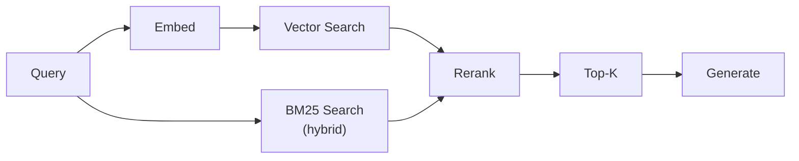
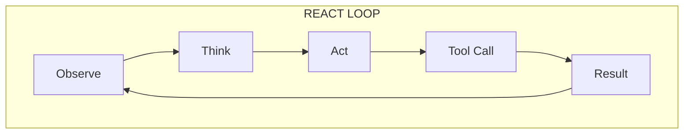
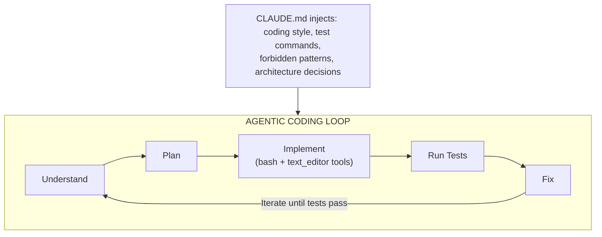
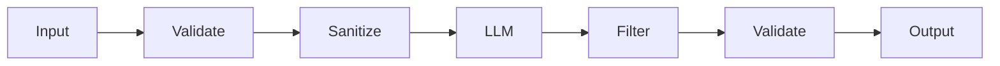
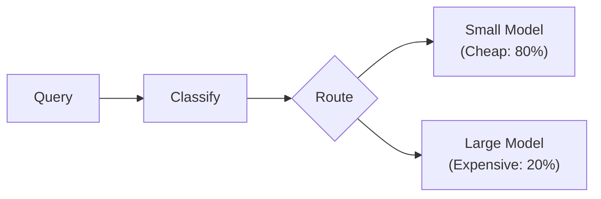

# AI Design Patterns Quick Reference

Quick lookup for common patterns. See individual chapters for detailed implementation.

---

## Retrieval Patterns

| Pattern | Use Case | Key Tradeoff |
|---------|----------|--------------|
| **Basic RAG** | Simple Q&A over documents | Easy to implement, limited accuracy |
| **Hybrid Search** | Combining semantic + keyword | Better recall, more complexity |
| **Reranking** | High-precision retrieval | Accuracy vs latency |
| **Query Expansion** | Ambiguous queries | Better recall, more tokens |
| **HyDE** | No direct matches expected | Creative, but can hallucinate |
| **Parent-Child Chunking** | Need surrounding context | Memory overhead |



---

## Generation Patterns

| Pattern | Use Case | Key Tradeoff |
|---------|----------|--------------|
| **Zero-Shot** | Simple tasks | Fast, less reliable |
| **Few-Shot** | Need format control | Token cost |
| **Chain-of-Thought** | Reasoning tasks | Latency, shows work |
| **Self-Consistency** | High-stakes answers | 3-5x cost |
| **Structured Output** | API responses | Constrained creativity |

---

## Agent Patterns

| Pattern | Use Case | Complexity |
|---------|----------|------------|
| **ReAct** | Tool-using agents | Medium |
| **Plan-and-Execute** | Multi-step tasks | High |
| **Multi-Agent Debate** | Verification | High |
| **Human-in-the-Loop** | High-stakes actions | Medium |
| **Swarm / Handoff** | Specialised sub-agents | High |



---

## Agentic Coding Patterns (2026)

| Pattern | Use Case | Key Tool |
|---------|----------|----------|
| **Scaffold → Implement → Verify** | Full feature development | Claude Code / OpenHands |
| **Read-Plan-Edit** | Refactoring existing code | Claude Code text_editor |
| **Test-Driven Agent** | High reliability code | Agent writes tests first |
| **Shadow Review** | PR quality gate | Agent reviews diff before merge |
| **CLAUDE.md Manifest** | Project context injection | Claude Code CLAUDE.md file |
| **Sub-Agent Parallelism** | Large codebase changes | Multiple agents per module |



**When to use which tool:**

| Need | Tool |
|------|------|
| Full autonomy + CLI | Claude Code |
| Open-source + any LLM | OpenHands / Cline |
| Tight IDE integration | Cursor / Windsurf |
| Reproducible pipelines | OpenHands in Docker CI |

---

## Reliability Patterns

| Pattern | Problem Solved | Implementation |
|---------|----------------|----------------|
| **Retry with Backoff** | Transient failures | Exponential backoff |
| **Circuit Breaker** | Cascading failures | Fail-fast after threshold |
| **Fallback Model** | Primary unavailable | Secondary model |
| **Timeout** | Slow responses | Cancel + fallback |
| **Bulkhead** | Resource isolation | Separate pools |

```python
# Reliability stack
@circuit_breaker(failure_threshold=5)
@retry(max_attempts=3, backoff=exponential)
@timeout(seconds=30)
@fallback(model="gpt-4o-mini")
async def generate(prompt):
    return await primary_model.generate(prompt)
```

---

## Caching Patterns

| Pattern | Hit Rate | Use Case |
|---------|----------|----------|
| **Exact Match** | Low | Identical queries |
| **Semantic Cache** | Medium | Similar queries |
| **KV Cache** | High | Same prefix |
| **Response Cache** | Varies | Deterministic outputs |

---

## Security Patterns

| Pattern | Threat | Implementation |
|---------|--------|----------------|
| **Input Validation** | Prompt injection | Sanitize, detect |
| **Output Filtering** | Data leakage | PII detection, blocklists |
| **Tenant Isolation** | Cross-tenant access | Filter at query time |
| **Rate Limiting** | Abuse | Per-user/tenant limits |



---

## Evaluation Patterns

| Pattern | Use Case | Metrics |
|---------|----------|---------|
| **Golden Set** | Regression testing | Pass rate |
| **LLM-as-Judge** | Quality scoring | 1-5 scale |
| **Human Eval** | Ground truth | Agreement rate |
| **A/B Testing** | Production comparison | User metrics |

---

## Cost Optimization Patterns

| Pattern | Savings | Tradeoff |
|---------|---------|----------|
| **Model Routing** | 50-70% | Complexity |
| **Caching** | 20-40% | Staleness |
| **Prompt Compression** | 10-30% | Quality risk |
| **Batch Processing** | 30-50% | Latency |



---

## Anti-Patterns to Avoid

| Anti-Pattern | Problem | Better Approach |
|--------------|---------|-----------------|
| **Context Stuffing** | Token waste | Retrieve relevant only |
| **Retry Forever** | Resource exhaustion | Circuit breaker |
| **Trust All Output** | Hallucination | Verify, ground |
| **Single Model** | Single point of failure | Multi-provider |
| **No Observability** | Blind debugging | Trace everything |
| **Infinite Agentic Loop** | Agent spins without progress | Max turns + Critic agent |
| **Over-trusting Computer-Use** | Agent clicks wrong UI elements | Screenshot validation + HITL |
| **No CLAUDE.md / Manifest** | Agent lacks project context | Always provide coding manifest |
| **Thinking Mode Always On** | 3-10x cost with no benefit | Gate on complexity classifier |

---

## Pattern Selection Guide

**Starting a new project?**
1. Begin with Basic RAG
2. Add reranking when precision matters
3. Add hybrid search for keyword-heavy content

**Need reliability?**
1. Start with retry + timeout
2. Add circuit breaker for external calls
3. Add fallback models for critical paths

**Cost concerns?**
1. Implement semantic caching first
2. Add model routing for query complexity
3. Batch where latency allows

---

*See [15-ai-design-patterns/](15-ai-design-patterns/) for detailed implementations*
