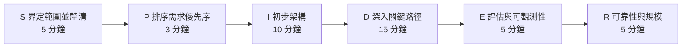
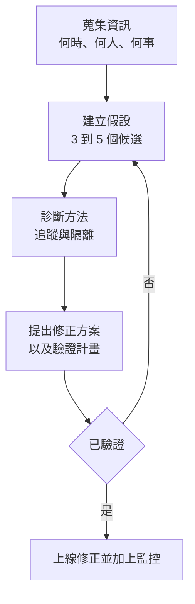

# AI 系統設計面試的答題框架

五個結構化的 AI 系統設計面試框架：用於設計題的 SPIDER、用於概念題的 ETA、權衡分析、除錯，以及用於行為題的 STAR-L。

優秀的面試答案都遵循一致的結構。本章提供了適用於不同題型的框架，並附上範例與反面模式。請將這些框架與[題庫](01-question-bank.md)中的實作範例搭配使用，並透過[白板練習](04-whiteboard-exercises.md)反覆演練。

## 目錄

- [系統設計框架（SPIDER）](#system-design-framework-spider)
- [實作範例：在 45 分鐘場次中運用 SPIDER](#worked-example-spider-in-a-45-minute-session) ⭐ *NEW*
- [概念解說框架（ETA）](#concept-explanation-framework-eta)
- [權衡分析框架](#tradeoff-analysis-framework)
- [除錯與疑難排解框架](#debugging-and-troubleshooting-framework)
- [行為題框架（STAR-L）](#behavioral-questions-framework-star-l)
- [處理不熟悉的主題](#handling-unknown-topics)
- [常見錯誤以及如何避免](#common-mistakes-and-how-to-avoid-them)

---

## 系統設計框架（SPIDER）

任何涉及 AI 元件的系統設計題都可以使用這個框架。以下是完整流程，並附上各階段的概略時間預算：



### S - 界定範圍並釐清（Scope and Clarify）

**目的：** 縮小問題範圍，並展現你在動手之前會先思考。

**該問的問題：**
- 規模有多大？（使用者、請求量、資料量）
- 延遲需求是什麼？
- 必須達到的準確度或品質門檻是什麼？
- 是否有合規或安全方面的需求？
- 現有的基礎設施是什麼？
- 預算上的限制是什麼？

**範例：**
```
面試官：設計一個客戶支援聊天機器人。

你：在深入之前，我想先釐清幾件事：
- 我們預期的量體有多大？每天數千還是數百萬次對話？
- 這是面向客戶，還是內部支援？
- 需要支援哪些語言？
- 我們需要與既有的工單系統整合嗎？
- 我們對「已解決 vs 升級轉介」的準確度目標是多少？
```

**反面模式：** 在還沒理解需求之前，就直接跳進架構。

---

### P - 排序需求優先序（Prioritize Requirements）

**目的：** 找出最重要的部分，並朝它設計。

**建立一個優先序矩陣：**

| 需求 | 優先序 | 影響 |
|-------------|----------|-------------|
| 低延遲 | 高 | 可能限制模型大小 |
| 高準確度 | 高 | 需要良好的檢索 + 評估 |
| 成本效益 | 中 | 用快取最佳化 |
| 多語言 | 中 | 影響嵌入的選擇 |

**明確說出你的優先序：**
```
「鑒於這些需求，我會優先處理延遲與準確度。
成本最佳化會是次要考量，等基本系統先運作起來再說。」
```

---

### I - 初步架構（Initial Architecture）

**目的：** 在深入細節之前，先畫出高層級的系統。

**AI 系統的標準元件：**
```
┌──────────┐     ┌──────────┐     ┌──────────┐     ┌──────────┐
│  Client  │────▶│  API GW  │────▶│ AI Layer │────▶│  LLM(s)  │
└──────────┘     └──────────┘     └──────────┘     └──────────┘
                                        │
                                        ▼
                                  ┌──────────┐
                                  │ Data/RAG │
                                  └──────────┘
```

**簡短說明每個元件：**
- 它做什麼
- 為什麼需要它
- 有哪些替代方案

---

### D - 深入關鍵路徑（Deep Dive into Critical Paths）

**目的：** 在最重要的部分展現深度。

**根據以下因素選擇 2 到 3 個區域深入：**
- 面試官似乎最感興趣的部分
- 這個系統中新穎或複雜的部分
- 最大風險所在之處

**深入範例：**
- RAG 管線：分塊、嵌入、檢索、重排序
- 代理迴圈：工具選擇、錯誤處理、終止
- 資料管線：擷取、處理、索引
- 安全：隔離、權限、稽核

**表明你的意圖：**
```
「接下來我會深入 RAG 管線，因為檢索品質對這個系統至關重要。」
```

---

### E - 評估與可觀測性（Evaluation and Observability）

**目的：** 展現你會思考生產環境的維運。

**涵蓋：**
1. **指標：** 你要量測什麼？
2. **評估：** 你怎麼知道它有效？
3. **監控：** 你怎麼偵測問題？
4. **告警：** 什麼時候需要呼叫工程師？

**AI 系統的標準指標：**
- 延遲（p50、p95、p99）
- Token 用量 / 成本
- 品質分數（離線，以及線上抽樣）
- 各類型的錯誤率
- 快取命中率

---

### R - 可靠性與規模（Reliability and Scale）

**目的：** 處理故障模式與成長。

**該討論的故障模式：**
- LLM 供應商中斷
- 速率限制
- 不良的模型輸出
- 資料管線故障
- 快取失效

**擴展方面的考量：**
- 瓶頸在哪裡？
- 什麼東西可以水平擴展、什麼只能垂直擴展？
- 哪些成本會隨用量增加？

---

## 實作範例：在 45 分鐘場次中運用 SPIDER

以下是一段濃縮的對話逐字稿，展示這個框架在真實場次中聽起來是什麼樣子。題目是：「為一家有 10,000 名員工的公司設計一套文件問答系統。」方括號中的註記標示了框架的步驟與時間。

```
[0:00 - S：界定範圍]
你：「在我畫任何東西之前，先讓我界定一下範圍。文件大概有多少份、
是哪些類型，答案需要多新的資料？」
面試官：「大約 200 萬份文件，主要是 PDF 和 wiki。
每天更新就可以了。」
你：「再兩個問題：我們的準確度門檻目標是多少，以及這是純內部使用
還是會對客戶開放？」
面試官：「內部使用。答錯會很尷尬，但不至於災難性。p95 在 3 秒以內。」
你：「所以是：200 萬份混合文件、每日更新、內部使用者、
寬鬆的準確度門檻、p95 在 3 秒以內。我會以 10,000 名員工
為前提來設計，假設每天約有 5% 活躍。那大概是尖峰時段
每小時 500 到 2,000 次查詢。對嗎？」
面試官：「可以。」

[0:05 - P：把架構規劃講出來]
你：「我會先把完整的管線畫出來，再依你想要的地方深入。
左側是擷取：連接器、解析、分塊、嵌入、向量儲存。
右側是服務：查詢、混合檢索、重排序、帶引用的生成、回應。
評估與監控放在底下，作為橫切的一層。」

[0:08 - I：辨識元件、邊畫邊講]
你：「擷取：連接器每晚從 SharePoint 和 Confluence 拉取資料。
解析先用一層 document-AI 處理 PDF，對複雜版面則用 vision-LLM
作為後備。分塊是結構感知的，每塊 300 到 500 個 token，並把標題前置。
嵌入連同中繼資料一起進向量資料庫：來源、團隊、日期、存取標籤。」
面試官：「為什麼用混合檢索，而不是純向量？」
你：「內部語料裡充滿專案代號與縮寫。嵌入會漏掉精確匹配的 token；
BM25 能抓到它們。用 RRF 來融合，再對前 50 名做 cross-encoder 重排序。
在這裡，這個組合就是檢索命中率 70% 與 90% 以上的差別。」

[0:18 - D：依面試官引導的方向深入]
面試官：「在存取控制上深入一點。」
你：「權限是在檢索時評估，而不是建索引時。每個區塊都帶有來自
來源系統的 ACL 標籤。檢索查詢會在相似度評分之前，先依呼叫者的
群組做過濾，所以使用者無權閱讀的結果根本不會進入候選集。
建索引時過濾在權限一變動的當下就失效了；檢索時過濾則會跟隨
事實來源。快取鍵包含權限集合，因此快取的答案絕不會跨群組外洩。」

[0:30 - E：評估你自己的設計]
你：「我會在自己的設計裡點出幾個弱點：每晚同步意味著最多
24 小時的資料陳舊，依需求來說沒問題，但我之後會為 wiki 加上
基於 webhook 的失效機制。重排序器在 p95 增加約 150 毫秒，
為了品質是值得的。故障模式：供應商中斷時會後備到第二個模型，
並使用該供應商專屬的提示；檢索沒有回傳任何結果時，會回覆
『在我們的文件中找不到』，而不是讓模型自行編造。」

[0:38 - R：需求檢查與評估的說明]
你：「回到需求：3 秒的 p95 給我的預算大約是檢索 400 毫秒、
重排序 150 毫秒、生成 2 秒，並用串流讓感知延遲在一秒以內。
品質方面，我會用真實員工問題建立一個 200 案例的黃金集，
用每月對照人工審查校準的 LLM 評審來評分忠實度與引用準確度，
並抽樣 2% 的生產流量。還有什麼你想要我深入的嗎？」
```

**這段逐字稿展現了什麼：**
- 界定範圍花了五分鐘，產出了整個設計都會引用的數字。
- 應試者邊畫邊講，並在每個階段邀請對方引導方向。
- 深入的回答先講決策，再講原因，最後講故障模式。
- 應試者在面試官出手之前，就先批判了自己的設計。
- 評估是設計的一部分，而不是事後補上的。

---

## 概念解說框架（ETA）

對於像「解釋 RAG」或「什麼是推測解碼？」這類概念題，使用這個框架。

### E - 簡單解釋（Explain Simply）

從一句任何人都能聽懂的定義開始。

**KV cache 的範例：**
```
「KV cache 在 LLM 生成過程中儲存中間計算結果，這樣在生成每個新 token 時，
我們就不必為先前的 token 重做計算。」
```

---

### T - 技術細節（Technical Details）

依面試官的程度補上適當的技術深度。

**KV cache 的範例：**
```
「具體來說，對於 transformer 中的每一層，我們會快取所有位置的 Key 和
Value 張量。每出現一個新 token，我們只計算新位置的 K 和 V，
再與快取串接。

記憶體的成長方式為：2 × layers × heads × head_dim × sequence_length × batch_size

對一個 8K 上下文的 70B 模型來說，每個請求大約是 10GB。」
```

---

### A - 應用與權衡（Applications and Tradeoffs）

連結到實際用法，並討論權衡。

**KV cache 的範例：**
```
「這對生產環境的服務至關重要。沒有它，生成的複雜度會是序列長度的平方。

代價是記憶體用量。這正是 PagedAttention 與 Grouped Query Attention
這類技術存在的原因：在保留好處的同時，降低 KV cache 的記憶體。

OpenAI 與 Anthropic 的上下文快取功能，本質上就是針對共用前綴的
伺服器端 KV cache 持久化。」
```

---

## 權衡分析框架

當被要求比較選項或為某個決策辯護時，使用這個結構。

### 步驟 1：清楚陳述各個選項

```
「對於嵌入模型，我們有三個主要選項：
1. OpenAI text-embedding-3-large：品質最高，但有 API 成本
2. Cohere embed-v3：品質不錯，定價較好
3. 自建 BGE：完全掌控，但有維運負擔」
```

### 步驟 2：定義評估標準

挑選對這個特定決策重要的標準：

| 標準 | 權重 | 理由 |
|----------|--------|-----------|
| 品質 | 高 | 搜尋準確度是核心功能 |
| 規模化下的成本 | 高 | 每月 1 億次嵌入 |
| 延遲 | 中 | 批次建索引，非即時 |
| 維運負擔 | 中 | 小型團隊 |

### 步驟 3：分析每個選項

建立一個比較矩陣：

| 選項 | 品質 | 成本 | 延遲 | 維運 | 分數 |
|--------|---------|------|---------|-----|-------|
| OpenAI | ★★★★★ | ★★ | ★★★★ | ★★★★★ | 4.2 |
| Cohere | ★★★★ | ★★★★ | ★★★★ | ★★★★★ | 4.2 |
| BGE | ★★★★ | ★★★★★ | ★★★ | ★★ | 3.6 |

### 步驟 4：提出建議並附上理由

```
「對於這個使用情境，我會推薦 Cohere，因為：
1. 根據 MTEB 分數，品質與 OpenAI 相當接近
2. 在我們的量體（每月 1 億次嵌入）下定價較好
3. 相較於自建，沒有維運負擔
4. 如果成本日後變得難以承受，我們可以再切換到自建

風險在於對供應商的依賴，我們透過抽象化嵌入介面來降低這個風險。」
```

---

## 除錯與疑難排解框架

當被問到「你會怎麼除錯 X？」或「系統正在做 Y，你會怎麼修？」時，採用以下 4 步驟的診斷流程：



### 步驟 1：蒐集資訊

```
「首先，我會問：
- 這是什麼時候開始的？有什麼變動？
- 是所有請求，還是其中一部分？
- 錯誤具體長什麼樣子？
- 有沒有規律可循（一天中的時段、使用者區隔、查詢類型）？」
```

### 步驟 2：建立假設

```
「根據這些症狀，我最主要的假設是：
1. 檢索品質下降了（最近的資料變動？）
2. 模型輸出品質掉了（提示變了？換了不同模型？）
3. 上下文長度超出（文件變長了？）
4. 速率限制導致逾時」
```

### 步驟 3：描述診斷方法

```
「為了隔離成因：
1. 檢查失敗請求的追蹤，看它們在哪裡開始分歧
2. 將檢索結果與一個已知良好的基準做比較
3. 檢查部署中的模型版本與提示版本
4. 檢視指標，看是否有任何相關連的變化」
```

### 步驟 4：提出修正方案與驗證

```
「如果是檢索品質的問題，我會：
1. 用已驗證的分塊方式重新建索引
2. 在部署前於測試集上驗證
3. 搭配 A/B 比較逐步推出
4. 在檢索品質指標上設定告警，以便及早抓到未來的問題」
```

---

## 行為題框架（STAR-L）

對於 AI 職位的行為題，使用 STAR-L（STAR + Learnings，即加上「學到的事」）。

### S - 情境（Situation）

簡短交代背景。

```
「我們剛推出由 RAG 驅動的搜尋功能，當時不斷收到關於技術類查詢
答案不正確的客訴。」
```

### T - 任務（Task）

你具體的職責是什麼？

```
「身為技術主管，我需要診斷問題並迅速上線修正，
同時維持使用者的信任。」
```

### A - 行動（Action）

是「你」做了什麼？用「我」而不是「我們」。

```
「我首先建置了詳細的追蹤，以了解失敗發生在哪裡。
我發現我們的分塊策略會把程式碼區塊從函式中間切開。
我設計了一套程式碼感知的分塊方法，保留了語意單元。
我還加上了信心分數的顯示，讓使用者能校準信任程度。」
```

### R - 結果（Result）

盡可能量化。

```
「在我們的評估套件中，技術類查詢的答案品質從 65% 提升到 89%。
兩週內客訴下降了 70%。」
```

### L - 學到的事（Learnings）

你會有哪些不同的做法？

```
「我學到分塊策略從一開始就必須是內容感知的。
現在我在推出之前，一定會用實際的文件分布來測試分塊。
我也會在流程更早的階段就建立評估套件。」
```

---

## 處理不熟悉的主題

不知道每一件事是可以接受的。請以專業的方式處理不熟悉的部分。

### 如果你完全不知道

```
「我對 [X] 不熟悉。從名稱來看，我猜它和 [Y] 有關。
你能多告訴我一些它的功能嗎？這樣我可以討論我會如何
著手處理它所解決的問題。」
```

### 如果你只知道一部分

```
「我讀過關於 [X] 的資料，但還沒在生產環境用過。我的理解是
它會 [描述]。實務上，我會需要先讀文件，並且很可能在做出
架構決策之前先做原型。」
```

### 如果你懂概念但不懂細節

```
「我了解 [X] 的大致做法，[簡短說明]。我沒有把具體的參數或
基準測試背下來，但我知道去哪裡找，也知道在評估它時該問哪些問題。」
```

---

## 常見錯誤以及如何避免

### 錯誤 1：直接跳到解決方案

**錯誤做法：**
```
面試官：「你會怎麼設計一套文件問答系統？」
你：「我會用 LangChain 搭配 Pinecone 和 GPT-5.5。」
```

**正確做法：**
```
「在定義解決方案之前，我想先理解需求。
是哪些類型的文件？量體多大？需要多高的準確度？」
```

---

### 錯誤 2：忽略成本

**錯誤做法：**
```
「為了最好的品質，我永遠會用最大的前沿模型。」
```

**正確做法：**
```
「模型選擇取決於品質門檻與量體。對於高量、低風險的查詢，
我可能會用 Claude Haiku 4.5、GPT-5.5-mini 或 DeepSeek V4 Flash，
而把 Claude Sonnet 4.6 或 GPT-5.5 保留給複雜的情況。
在每天 100 萬次查詢下，這可能每月省下 5 萬美元，
而品質沒有實質損失。」
```

---

### 錯誤 3：沒有討論故障模式

**錯誤做法：**
```
「系統檢索文件、把它們送給 LLM，然後回傳答案。」
```

**正確做法：**
```
「順利路徑很單純。但讓我來討論故障模式：
- 如果檢索沒有回傳任何相關文件怎麼辦？
- 如果就算有良好的上下文，LLM 還是出現幻覺怎麼辦？
- 如果供應商被速率限制或當機了怎麼辦？

針對每一種，我們都需要偵測與後備策略。」
```

---

### 錯誤 4：過度複雜化

**錯誤做法：**
```
「我們需要一個獨立的分塊服務、另一個做嵌入的服務、
兩者之間一個訊息佇列、一個做即時處理的串流處理器、
三個不同的向量資料庫做冗餘備援……」
```

**正確做法：**
```
「讓我從可行的最簡單架構開始，
只在需求有充分理由的地方才加上複雜度。

以這個規模來說，單一服務搭配非同步處理或許就足夠了。
如果需要更高的吞吐量，我們再到那時候加上訊息佇列。」
```

---

### 錯誤 5：不徵詢回饋

**錯誤做法：**
```
*連續講了 10 分鐘，都沒有確認對方*
```

**正確做法：**
```
「我已經講完高層級的架構了。你想要我深入某個特定元件，
還是該繼續往評估的部分前進？」
```

---

## 快速參考：優秀答案的訊號

| 訊號 | 範例 |
|--------|---------|
| 提出釐清性的問題 | 「延遲需求是什麼？」 |
| 使用具體的數字 | 「這會增加約 50 毫秒的延遲」 |
| 討論權衡 | 「我們得到 X 但失去 Y」 |
| 提到故障模式 | 「如果這個失敗了，我們需要……」 |
| 引用真實系統 | 「類似 Notion 的做法……」 |
| 承認不確定性 | 「我會需要對這個做基準測試」 |
| 與面試官確認 | 「我該在這裡深入嗎？」 |
| 連結到經驗 | 「就我在 X 上的經驗……」 |

---

## 應避免的反面模式

| 反面模式 | 更好的做法 |
|--------------|-----------------|
| 拋出流行術語 | 解釋你的意思 |
| 報名號卻沒有深度 | 只提你能討論的東西 |
| 只說「看情況」卻不展開 | 解釋它取決於什麼 |
| 絕對化的陳述 | 適當時使用保留的語氣 |
| 否定掉有效的選項 | 承認其中的權衡 |
| 不知道該何時收尾 | 解讀面試官的暗示 |

---

## 重點整理

- 框架是鷹架，不是腳本；面試官分得出應試者是在背誦還是在思考，所以要把結構內化，再讓它變得對話化。
- SPIDER 適用於任何 45 分鐘的系統設計場次；就算面試官打斷你，你也已經命中了訊號最高的幾個階段。
- 「看情況」只有在接著說「它取決於 X、Y、Z，而以下是每一項如何改變答案」時才是好的；否則聽起來就像在打太極。
- 深入講解結束時，務必用一句話講可觀測性、一句話講故障模式；這是資深與 staff 級答案之間最大的單一落差。
- 沒有量化結果（STAR-L 中的 R）的行為題答案會被評為只是軼事；就算是約略的數字也要帶上。

---

*另見：[題庫](01-question-bank.md) | [常見陷阱](03-common-pitfalls.md) | [白板練習](04-whiteboard-exercises.md)*
