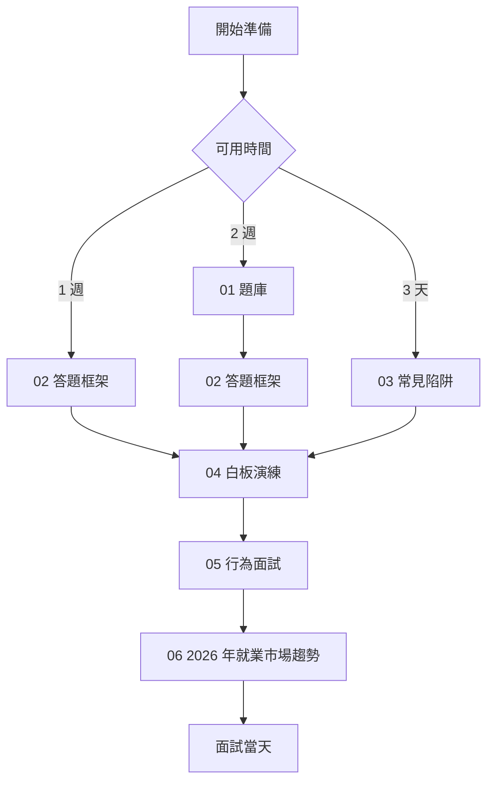
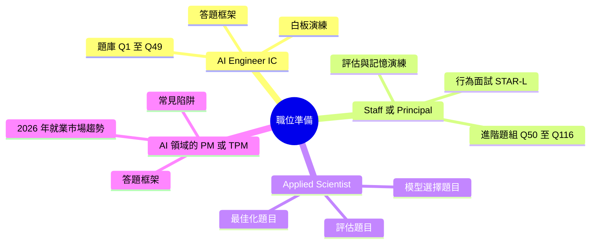

# AI 系統設計面試準備

針對資深與 staff 級 AI 工程職位的面試準備：116 道系統設計題目、附帶實作演練模擬面試逐字稿的答題框架、常見陷阱、九道白板演練、行為面試準備、快速問答 FAQ，以及 2026 年 6 月的招聘趨勢。

> **最新內容（2026 年 6 月）：** 題庫新增了一個工具與生命週期（Tooling and Lifecycle）章節，外加六道 2026 年 6 月的題目（Fable 5 分層路由、代理式上下文工程、computer-use 可靠度、Agent Skills、評估作弊、成本感知的多供應商路由），現在連續編號為 Q1 至 Q116。白板演練組新增了兩道演練（評估管線設計、代理記憶與狀態）。框架新增了一份實作演練的 45 分鐘 SPIDER 逐字稿。行為面試新增了兩個難度更高的 STAR-L 範例、一組薪酬問題，以及一份出聲練習指南。

## 開始之前

本資料夾假設你已經會寫生產環境程式碼，並且了解 LLM 基礎（tokens、上下文視窗、嵌入、RAG 是什麼）。如果這些還不夠扎實，請先花一週時間研讀 [01-foundations](../01-foundations/) 與 [課程指南](../COURSES.md)；在缺乏基礎的情況下做面試準備，只會產出聽起來流暢卻錯誤的答案，而這在資深職位的面試流程中是最糟糕的結果。

本資料夾中的檔案設計成依序閱讀。每一份都建立在前一份之上：題目教你了解涵蓋範圍，框架教你如何組織答案，陷阱教你什麼會讓你拿不到 offer，演練讓你預演實際動作，行為面試涵蓋 staff 級的訊號，而就業市場趨勢則涵蓋當前的招聘樣貌。

## 依序閱讀

## 依職位區分的準備路徑

## 本資料夾中的檔案

| 檔案 | 用途 |
|------|---------|
| [01-question-bank.md](01-question-bank.md) | 116 道真實面試題目（Q1-Q116，連續編號），依主題分組，附帶模型答案與追問（涵蓋至 2026 年 6 月）。 |
| [02-answer-frameworks.md](02-answer-frameworks.md) | 五個結構化答題框架（SPIDER、ETA、權衡取捨、除錯、STAR-L），外加一份實作演練的 45 分鐘 SPIDER 模擬面試逐字稿。 |
| [03-common-pitfalls.md](03-common-pitfalls.md) | 會讓 staff 級 offer 泡湯的模式：在權衡取捨上含糊其辭、缺乏可觀測性、忽略失敗模式。 |
| [04-whiteboard-exercises.md](04-whiteboard-exercises.md) | 九道系統設計演練，附帶實作解答，包含評估管線設計與代理記憶。最接近真實面試流程的模擬。 |
| [05-behavioral-for-ai-roles.md](05-behavioral-for-ai-roles.md) | 針對 AI 特定情境的行為面試準備，附帶六個實作演練的 STAR-L 範例、薪酬與職級問題，以及一份出聲練習指南。 |
| [06-job-market-trends-2026.md](06-job-market-trends-2026.md) | 職位分類、薪酬範圍、面試流程模式，以及新興職稱（FDE、AI Eval Engineer、AI Reliability Engineer、MCP Engineer）。 |
| [07-faq.md](07-faq.md) | 針對最常被問到的 AI 工程、RAG、代理、模型、評估、推論、記憶與安全問題，提供簡短直接的答案。適合快速查閱，也適合該領域的新手。 |

## 配套資源

- [職位轉換指南](../TRANSITION_GUIDE.md)，適合從後端、前端、QA、PM 或 EM 轉入 AI 領域的準備。
- [推薦課程](../COURSES.md)，適合在面試準備之前先打好基礎。
- [詞彙表](../GLOSSARY.md)，適合準備期間快速查詢術語定義。
- [案例研究](../16-case-studies/)，提供可直接對應白板題目的生產環境架構。

## 重點摘要

- 這些檔案設計成依序閱讀；不吸收答題框架就直接跳到題目，會讓答案缺乏結構。
- 白板演練（檔案 04）是最接近真實面試的模擬；在任何面試流程之前至少做三道。
- 行為面試準備（檔案 05）是區分 staff 級候選人與資深候選人的關鍵；不要跳過。
- 2026 年 6 月就業市場章節（檔案 06）是一道護城河：了解招聘樣貌的候選人能問出更好的問題，並量身打造自己的故事。
- 每月重新檢視本資料夾；隨著招聘趨勢變化，會持續加入新的題目批次。
