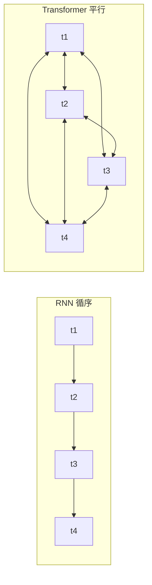
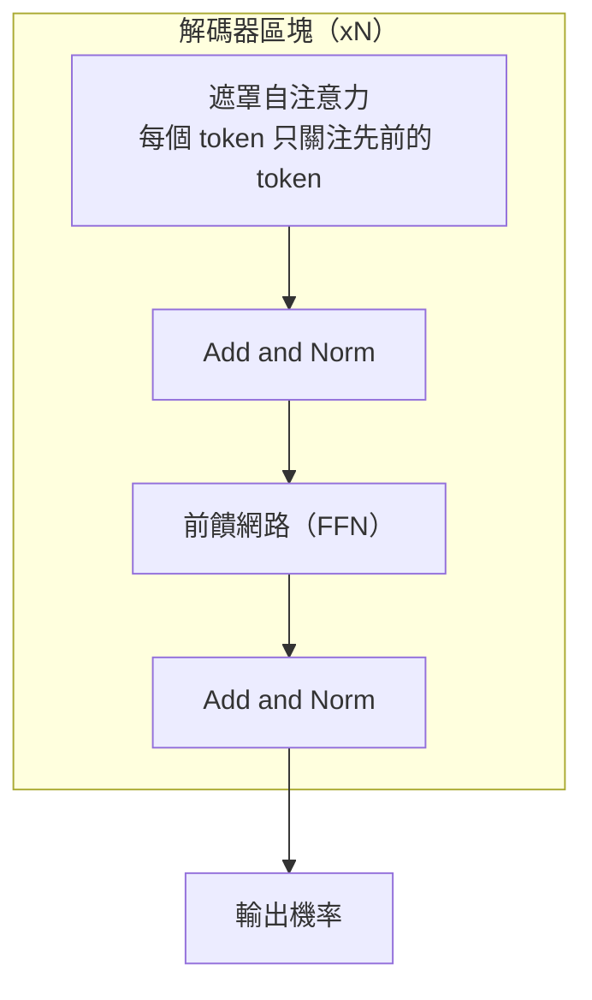
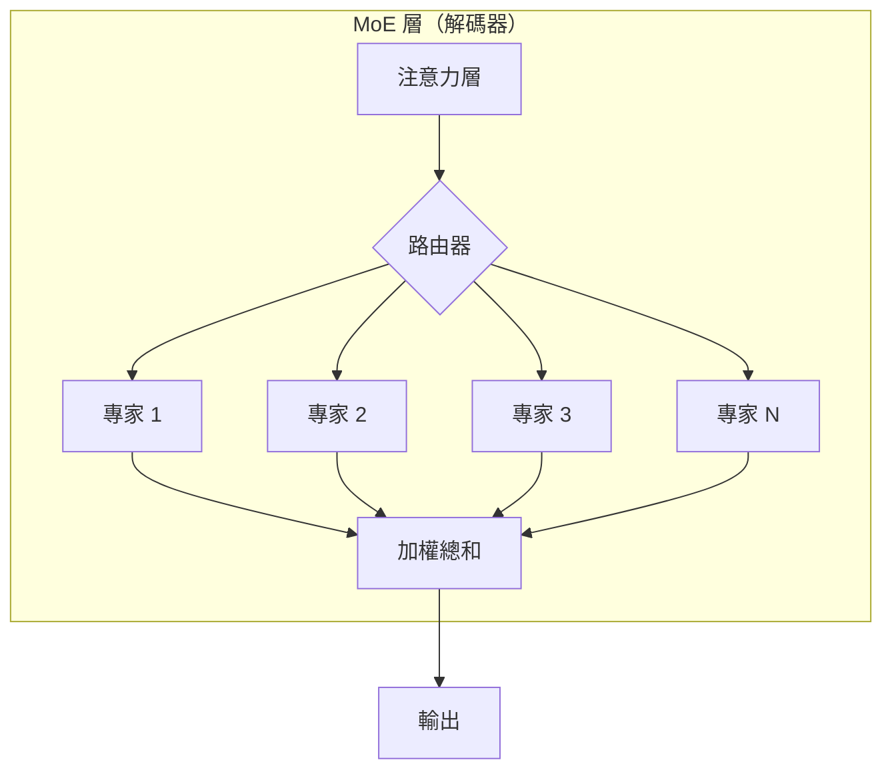
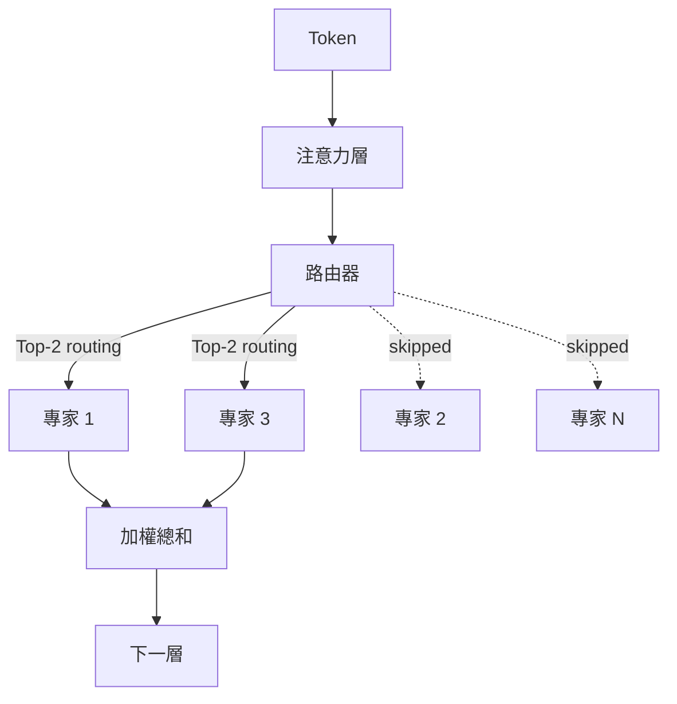

# LLM 內部原理

現代 LLM 的架構核心：transformer、MoE、注意力數學、RoPE、GQA、KV cache，以及推動 2026 年模型設計的推論最佳化擴展轉變。

本章涵蓋大型語言模型背後的核心概念。理解這些內部原理對於為 AI 系統做出明智的架構決策至關重要。關於這些架構選擇的實務影響，請參閱 [推論最佳化](../04-inference-optimization/)（KV cache、PagedAttention）、[模型分類](../02-model-landscape/01-model-taxonomy.md)（生產環境中的 MoE 模型），以及 [詞彙表](../GLOSSARY.md) 中對 MoE、RoPE、ALiBi、GQA、MLA 的定義。

## 目錄

- [Transformer 革命](#the-transformer-revolution)
- [架構變體](#architecture-variants)
- [專家混合（MoE）](#mixture-of-experts-moe)
- [擴展定律：訓練最佳 vs. 推論最佳](#scaling-laws-training-vs-inference-optimal)
- [原生多模態](#native-multimodality)
- [自注意力機制](#self-attention-mechanism)
- [多頭注意力](#multi-head-attention)
- [位置編碼](#position-encodings)
- [前饋網路](#feed-forward-networks)
- [層正規化](#layer-normalization)
- [整合所有組件](#putting-it-all-together)
- [必須掌握的關鍵數字](#key-numbers-to-know)
- [面試問題](#interview-questions)
- [參考資料](#references)

---

## Transformer 革命

在 2017 年之前，序列建模仰賴遞迴架構（RNN、LSTM），這些架構以循序方式處理 token。這帶來了兩個問題：

1. **訓練速度慢**：循序處理無法平行化
2. **長距離依賴關係難以建立**：資訊必須流經許多隱藏狀態

Transformer 架構於「Attention Is All You Need」（Vaswani et al., 2017）中提出，藉由以自注意力取代遞迴，同時解決了這兩個問題。

**給分散式系統工程師的心智模型：**
可以把遞迴想像成單執行緒的請求管線，每一步都依賴前一步。自注意力則像一個全連接圖，每個節點都能平行查詢其他每個節點。



---

## 架構變體

依據使用了原始 Transformer 的哪些部分，出現了三種主要變體：

| 架構 | 注意力類型 | 範例 | 最適用途 |
|--------------|---------------|----------|----------|
| 僅編碼器（Encoder-only） | 雙向 | BERT、RoBERTa | 分類、NER、嵌入 |
| 僅解碼器（Decoder-only） | 因果（由左至右） | GPT-4、Claude、Llama | 文字生成、聊天 |
| 編碼器-解碼器（Encoder-Decoder） | 交叉注意力 | T5、BART | 翻譯、摘要 |

### 僅解碼器（當今多數 LLM）



**為何僅解碼器架構佔據主導地位：**
- 架構最為簡單
- 預訓練目標（下一個 token 預測）與生成任務一致
- 隨運算量良好擴展

### 僅編碼器（BERT 風格）

使用雙向注意力。每個 token 都能看到其他所有 token。無法自迴歸地生成文字，但在理解類任務上表現出色。

**實務相關性：**
- 微調用於分類（意圖偵測、情感分析）
- 作為嵌入模型的骨幹
- 針對特定任務更小、更快

### 編碼器-解碼器（編碼器的回歸）

雖然僅解碼器架構多年來佔據主導地位，但在特化的**推理**與**驗證**任務上，已出現對編碼器-解碼器架構的部分回歸（例如 o 系列與 Claude 推理模型內部的驗證器）。

---

## 專家混合（MoE）

**前沿模型中最重大的架構轉變（GPT-5.5、Claude Opus 4.7、Gemini 3.1 Pro、DeepSeek V4、Llama 4 Maverick、Mixtral）。**

MoE 以多個「專家」加上一個「路由器」取代密集的前饋網路（FFN），由路由器選擇哪些專家來處理給定的 token。



### 系統設計需注意的 MoE 關鍵細節：
1. **總參數 vs. 啟用參數**：一個 1.6T 參數的 MoE 模型（例如 DeepSeek V4 Pro）每個 token 可能只使用 49B 參數。Llama 4 Maverick 是橫跨 128 個專家的 17B 啟用參數。Kimi K2.6 是 1T 總量 / 32B 啟用。
    - **記憶體限制**：你必須儲存全部 1.2T 參數（高 VRAM）。
    - **運算限制**：你只需為 100B 參數的 FLOPs 付出代價（延遲更低）。
2. **路由崩潰（Routing Collapse）**：如果路由器只挑選一個專家，其他專家就學不到東西。現代模型使用**負載平衡損失（load balancing loss）**與**輔助損失（auxiliary losses）**，以確保所有專家都被善加利用。
3. **DeepSeek-V3 改良**：引入了**多頭潛在注意力（Multi-head Latent Attention, MLA）**與**無輔助損失的負載平衡**，這些成為 MoE 效率的事實標準。DeepSeek V4（2026 年 4 月）將這兩項技術擴展到 1M token 的上下文視窗。

每個 token 的路由決策，以流程圖表示：



---

## 擴展定律：訓練最佳 vs. 推論最佳

原始的 Chinchilla 定律（2022）著重於**訓練最佳（Training-Optimal）**：為給定的訓練預算找出最佳的模型大小。

業界現已轉向**推論最佳（Inference-Optimal）**的擴展：
- **過度訓練（Over-training）**：在海量資料（15T+ tokens）上訓練較小的模型（例如 Llama 3 8B），遠遠超過 Chinchilla 點。
- **為什麼？**：服務數百萬使用者的推論成本，遠遠超過一次性的訓練成本。一個訓練時間長 10 倍的 7B 模型，比在 Chinchilla 點訓練的 70B 模型更便宜。

---

## 原生多模態

較舊的模型使用**視覺轉接器（Vision Adapters）**（將一個凍結的 CLIP 風格視覺編碼器接到 LLM 上）。前沿模型（GPT-5.2、Gemini 3）則是**原生多模態（Native Multimodal）**。

- **共享詞彙**：視覺 token 與文字 token 存在於同一個潛在空間中。
- **統一的 Transformer**：同樣的區塊同時處理像素與文字。
- **好處**：相較於以轉接器為基礎的做法，具有好得多的空間推理與「世界模型」理解能力。

---

## 自注意力機制

自注意力是核心創新。它讓每個 token 都能「注意到」（從中收集資訊）序列裡所有其他的 token。

### 直覺理解

考慮這個句子：「The animal didn't cross the street because it was too tired.」（這隻動物沒有過馬路，因為牠太累了。）

「it」指的是什麼？要理解就需要把「it」與「animal」連結起來。自注意力透過計算所有 token 配對之間的相關性分數來學習這些連結。

### 數學原理

對於由 n 個 token 組成、維度為 d 的輸入序列 X：

```
Q = XW_Q   (Query: What am I looking for?)
K = XW_K   (Key: What do I contain?)
V = XW_V   (Value: What do I contribute?)

Attention(Q, K, V) = softmax(QK^T / √d_k) × V
```

**逐步說明：**
1. **QK^T**：點積衡量查詢（query）與鍵（key）之間的相似度（n × n 矩陣）
2. **/ √d_k**：縮放以避免在大維度下 softmax 飽和
3. **softmax**：轉換為機率（每一列總和為 1）
4. **× V**：依注意力權重對值（value）做加權總和

### 為何要除以 √d_k 縮放？

**面試愛考題**：這題經常被問到，因為它能揭示對數值穩定性的理解。

若不縮放，當維度 d 增大時，點積會等比例增大。過大的點積會把 softmax 推入飽和區，使梯度消失。

```python
# Without scaling (problematic for large d)
d = 512
q = np.random.randn(d)
k = np.random.randn(d)
dot = np.dot(q, k)  # Expected magnitude: ~√d ≈ 22.6

# With scaling
scaled_dot = dot / np.sqrt(d)  # Expected magnitude: ~1
```

### 注意力的複雜度

| 運算 | 時間複雜度 | 空間複雜度 |
|-----------|-----------------|------------------|
| QK^T 計算 | O(n²d) | O(n²) |
| Softmax | O(n²) | O(n²) |
| 與 V 的加權總和 | O(n²d) | O(nd) |

O(n²) 的複雜度限制了上下文長度。100K 的上下文視窗代表每層要進行 100 億次注意力計算。

---

## 多頭注意力

現代 transformer 不採用單一注意力，而是使用多個「頭（head）」平行地關注不同面向。

```
┌─────────────────────────────────────────────────────────────┐
│                    Multi-Head Attention                      │
│                                                              │
│   ┌─────────┐  ┌─────────┐  ┌─────────┐       ┌─────────┐   │
│   │ Head 1  │  │ Head 2  │  │ Head 3  │  ...  │ Head h  │   │
│   │ d_k=64  │  │ d_k=64  │  │ d_k=64  │       │ d_k=64  │   │
│   └────┬────┘  └────┬────┘  └────┬────┘       └────┬────┘   │
│        │            │            │                  │        │
│        └────────────┴────────────┴──────────────────┘        │
│                              │                               │
│                         Concatenate                          │
│                              │                               │
│                         W_O (project)                        │
└─────────────────────────────────────────────────────────────┘
```

**為什麼要用多個頭？**
- 不同的頭學到不同的模式（語法、語意、共指）
- 類似集成方法：多重視角提升穩健性
- 讓多個頭之間能平行處理

**典型配置：**
- GPT-3 175B：96 個頭 × 128 維 = 12,288 總維度
- Llama 2 70B：64 個頭 × 128 維 = 8,192 總維度

### 分組查詢注意力（GQA）

**對生產系統至關重要**：標準的多頭注意力需要在 KV cache 中為每個頭儲存各自的 K 與 V。GQA 讓 K 與 V 在多組頭之間共享。

| 注意力類型 | 每個 Query 的 K,V | KV Cache 縮減 | 範例 |
|----------------|---------------|-------------------|----------|
| 多頭（MHA） | 1:1 | 基準 | GPT-3 |
| 分組查詢（GQA） | 典型 8:1 | 約 8 倍 | Llama 2、Mistral |
| 多查詢（MQA） | 全部:1 | 約 n_heads 倍 | PaLM、Falcon |

**實務影響：**
以 Llama 2 70B 在 8K 上下文為例：
- MHA KV cache：每個請求約 10 GB
- GQA KV cache：每個請求約 1.3 GB

這直接影響批次大小，進而影響吞吐量。

---

## 位置編碼

自注意力具有排列不變性（permutation-invariant）。若沒有位置資訊，「dog bites man」與「man bites dog」將會完全相同。位置編碼注入序列順序。

### 正弦（原始 Transformer）

使用不同頻率的正弦與餘弦函數：

```
PE(pos, 2i) = sin(pos / 10000^(2i/d))
PE(pos, 2i+1) = cos(pos / 10000^(2i/d))
```

**特性：**
- 確定性，沒有學習參數
- 理論上可外推到更長的序列
- 實務上外推效果並不好

### 學習式絕對位置

為每個位置學習一個獨立的嵌入：

```python
position_embeddings = nn.Embedding(max_length, d_model)
```

**特性：**
- 簡單且有效
- 無法外推超過訓練長度
- 多數早期模型（GPT-2、BERT）

### 旋轉位置嵌入（RoPE）

藉由旋轉查詢與鍵向量來編碼位置：

```
RoPE(x, pos) = x × cos(pos × θ) + rotate(x) × sin(pos × θ)
```

**特性：**
- 相對式：注意力取決於 (pos_q - pos_k)
- 比絕對位置外推得更好
- 用於：Llama、Mistral、PaLM

### ALiBi（具線性偏置的注意力）

直接在注意力分數上加入與位置相關的偏置：

```
Attention = softmax(QK^T / √d_k - m × distance)
```

其中 m 是各頭專屬的斜率，distance 為 |pos_q - pos_k|。

**特性：**
- 不修改嵌入
- 外推能力極佳
- 用於：BLOOM、MPT

### 位置編碼比較

| 方法 | 外推能力 | 運算開銷 | 現代使用情況 |
|--------|---------------|------------------|--------------|
| 正弦 | 差 | 無 | 罕見 |
| 學習式 | 無 | 極小 | 舊式 |
| RoPE | 良好 | 約 5% | 多數 LLM |
| ALiBi | 極佳 | 約 2% | 部分 LLM |

---

## 前饋網路

每個 transformer 層都有一個前饋網路（FFN），會獨立處理每個位置：

```python
def feed_forward(x):
    hidden = activation(x @ W1 + b1)  # Expand: d → 4d
    output = hidden @ W2 + b2         # Contract: 4d → d
    return output
```

**關鍵特性：**
- 逐位置（Position-wise）：對每個位置套用相同的權重
- 擴張比率：通常為 4 倍（例如 4096 → 16384 → 4096）
- 參數所在之處：FFN 佔該層約 2/3 的參數

### 激活函數

| 激活函數 | 公式 | 特性 | 使用情況 |
|------------|---------|------------|-------|
| ReLU | max(0, x) | 簡單、稀疏 | 原始 |
| GELU | x × Φ(x) | 平滑，用於 BERT | GPT-2、BERT |
| SwiGLU | Swish(xW) × xV | 業界頂尖 | Llama、PaLM |

SwiGLU 加入了一個門控機制，以 FFN 中約 50% 更多的參數為代價來提升效能。

### GLU 變體

```python
# Standard FFN
hidden = gelu(x @ W1)
output = hidden @ W2

# SwiGLU FFN
gate = silu(x @ W_gate)
hidden = x @ W_up
output = (gate * hidden) @ W_down
```

---

## 層正規化

層正規化（Layer normalization）藉由正規化激活值來穩定訓練：

```python
def layer_norm(x, gamma, beta):
    mean = x.mean(dim=-1, keepdim=True)
    var = x.var(dim=-1, keepdim=True)
    normalized = (x - mean) / sqrt(var + eps)
    return gamma * normalized + beta
```

### Pre-LN vs Post-LN

**Post-LN（原始 Transformer）：**
```
x = x + Attention(LayerNorm(x))  # Wrong - this is Pre-LN
x = LayerNorm(x + Attention(x))  # Post-LN: normalize after residual
```

**Pre-LN（現代 LLM）：**
```
x = x + Attention(LayerNorm(x))  # Pre-LN: normalize before sublayer
```

| 變體 | 訓練穩定性 | 最終效能 | 使用情況 |
|---------|-------------------|-------------------|-------|
| Post-LN | 較難 | 略好 | 原始論文 |
| Pre-LN | 容易得多 | 良好 | 多數現代 LLM |

Pre-LN 是標準做法，因為它讓你不必仔細調整學習率就能訓練深層模型。

### RMSNorm

省略均值置中的簡化做法：

```python
def rms_norm(x, gamma):
    rms = sqrt(mean(x^2) + eps)
    return gamma * (x / rms)
```

比 LayerNorm 快約 10-15%，效能相近。用於 Llama、Mistral。

---

## 整合所有組件

一個完整的 transformer 層：

```python
class TransformerLayer:
    def __init__(self, d_model, n_heads, d_ff):
        self.attn_norm = RMSNorm(d_model)
        self.attn = MultiHeadAttention(d_model, n_heads)
        self.ff_norm = RMSNorm(d_model)
        self.ff = SwiGLU_FFN(d_model, d_ff)
    
    def forward(self, x, mask=None):
        # Pre-norm attention with residual
        h = x + self.attn(self.attn_norm(x), mask)
        # Pre-norm FFN with residual
        out = h + self.ff(self.ff_norm(h))
        return out
```

**完整模型：**
```
Token IDs → Embedding → [Transformer Layer × N] → Output Norm → LM Head → Logits
```

---

## 必須掌握的關鍵數字

### 模型大小

| 模型 | 參數量 | 層數 | 頭數 | 維度 | FFN 維度 |
|-------|------------|--------|-------|-----------|---------|
| GPT-3 | 175B | 96 | 96 | 12,288 | 49,152 |
| Llama 2 70B | 70B | 80 | 64 | 8,192 | 28,672 |
| Llama 2 7B | 7B | 32 | 32 | 4,096 | 11,008 |
| Mistral 7B | 7B | 32 | 32 | 4,096 | 14,336 |

### 記憶體需求

```
Model weights (FP16) ≈ 2 bytes × parameters
- 70B model: ~140 GB
- 7B model: ~14 GB

KV Cache per token (FP16):
= 2 × layers × heads × head_dim × 2 bytes
- Llama 70B: 2 × 80 × 64 × 128 × 2 = 2.6 MB per token
- At 8K context: 21 GB per request
```

### 運算需求

```
FLOPs per token forward pass ≈ 2 × parameters
- 70B model: ~140 TFLOPs per token
- Generate 100 tokens: 14 PFLOPs

H100 at 990 TFLOPS (FP16):
- Single token: 140ms theoretical (actual: ~20-50ms with batching)
```

---

## 重點摘要

- 從 RNN 轉向 Transformer 的關鍵在於平行化，而不只是品質；這正是 GPU 擴展定律隨之而來的原因。
- MoE 將總參數（記憶體成本）與啟用參數（運算成本）分離：一個 1.2T 的 MoE 模型能以 100B 密集模型的延遲提供服務。
- 在生產環境中，推論最佳的擴展勝過 Chinchilla：過度訓練小型模型，因為在模型的生命週期中推論成本主導了訓練成本。
- GQA 是目前模型中影響力最大的單一 KV cache 最佳化；在討論服務成本之前，要先理解 N:G 比率。
- 搭配 RMSNorm 的 Pre-LN 是現代的預設做法；如果你在面試回答中聽到 Post-LN，那位應試者引用的是 2018 年的論文。

---

## 面試問題

### Q：請解釋為何 transformer 注意力是 O(n²)，以及有哪些替代方案。

**強力回答：**
注意力會計算所有 token 之間的兩兩相似度。對於序列長度 n：
- QK^T 是 [n, d] × [d, n] = 每個頭 n² 次乘法
- 注意力權重的儲存：n² 個浮點數

替代方案：
- 稀疏注意力（Longformer）：以局部 + 全域模式達到 O(n)
- 線性注意力（Performer）：使用隨機特徵近似達到 O(n)
- Flash Attention：運算仍是 O(n²)，但透過核心融合（kernel fusion）達到 O(n) 記憶體
- 狀態空間模型（Mamba）：完全線性的 O(n)

權衡取捨：要建立完整的長距離依賴關係，n² 是必要的，但多數任務並不需要所有的兩兩互動。

### Q：什麼是 KV cache，以及它為何對服務很重要？

**強力回答：**
在自迴歸生成過程中，我們一次生成一個 token。若不快取，每一步都得為先前所有的 token 重新計算 K 與 V。

KV cache 儲存先前位置的 K 與 V。每產生一個新 token 時：
1. 只為新位置計算 Q、K、V
2. 將新的 K、V 串接到已快取的 K、V
3. 用完整的 K、V 計算注意力

這把 K 與 V 計算的每 token 複雜度從 O(n) 降至 O(1)。

**代價：** 記憶體隨序列長度線性成長。以 Llama 70B 在 8K 上下文為例，KV cache 為每個請求約 21 GB。這限制了批次大小，並需要 PagedAttention 之類的技術。

### Q：為何現代 LLM 使用 Pre-LN 而非 Post-LN？

**強力回答：**
Pre-LN 將正規化放在每個子層之前，而不是之後。這為梯度建立了一條穿過殘差連接的更直接路徑。

採用 Post-LN 時，梯度必須通過正規化，這可能在訓練初期造成不穩定。Post-LN 需要學習率暖身（warmup）與謹慎的初始化。

Pre-LN 讓你不需特殊初始化就能訓練非常深的模型（100 層以上）。權衡取捨是最終效能略低，但實務上，這份訓練穩定性是值得的。

### Q：MHA、MQA 與 GQA 之間有什麼差別？

**強力回答：**
這三者都是多頭注意力的變體，差別在於 K 與 V 頭如何共享：

- **MHA（多頭注意力）**：每個 query 頭都有自己的 K 與 V 頭。N:N 比率。
- **MQA（多查詢注意力）**：所有 query 頭共享單一個 K 與 V 頭。N:1 比率。
- **GQA（分組查詢注意力）**：多組 query 頭共享 K 與 V 頭。N:G 比率（典型 G=8）。

對 KV cache 的記憶體影響：
- MHA：完整大小
- MQA：1/N 大小（但品質下降）
- GQA：1/G 大小（最佳權衡）

Llama 2 70B 使用 GQA，以 8 個 KV 頭對應 64 個 query 頭，將 KV cache 縮減 8 倍，且品質損失極小。

---

## 參考資料

- Vaswani et al. "Attention Is All You Need" (2017)
- Su et al. "RoFormer: Enhanced Transformer with Rotary Position Embedding" (2021)
- Press et al. "Train Short, Test Long: Attention with Linear Biases" (ALiBi, 2022)
- Shazeer "GLU Variants Improve Transformer" (2020)
- Ainslie et al. "GQA: Training Generalized Multi-Query Transformer Models" (2023)
- [圖解 Transformer](https://jalammar.github.io/illustrated-transformer/)
- [註解版 Transformer](https://nlp.seas.harvard.edu/2018/04/03/attention.html)

---

*下一篇：[Tokenization 深入探討](02-tokenization-deep-dive.md)*
