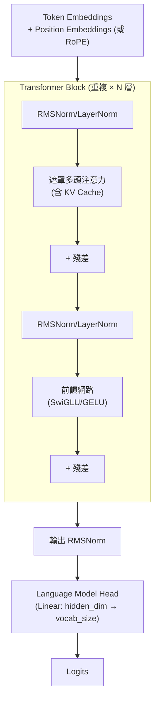

# Transformer 架構

本章提供 Transformer 完整架構的全面視角，將先前各章的元件整合成統一的理解。

## 目錄

- [架構總覽](#architecture-overview)
- [輸入處理](#input-processing)
- [Transformer 區塊](#the-transformer-block)
- [輸出處理](#output-processing)
- [現代架構變體（Hybrid MoE、MLA）](#mixture-of-experts-moe--hybrid-architectures)
- [非綁定嵌入與綁定嵌入的比較](#untied-vs-tied-embeddings)
- [擴展特性](#scaling-properties)
- [架構比較表](#architecture-comparison-table)
- [面試問題](#interview-questions)
- [參考資料](#references)

---

## 架構總覽 {#architecture-overview}

純解碼器（decoder-only）的 Transformer（GPT、Claude、Llama 採用的架構）由以下部分組成：



---

## 輸入處理 {#input-processing}

### Token 嵌入

將 token ID 轉換為密集向量：

```python
class TokenEmbedding(nn.Module):
    def __init__(self, vocab_size, d_model):
        super().__init__()
        self.embedding = nn.Embedding(vocab_size, d_model)
    
    def forward(self, token_ids):
        return self.embedding(token_ids)
```

**維度：**
- 輸入：[batch_size, seq_len] token ID
- 輸出：[batch_size, seq_len, d_model] 嵌入

### 位置資訊

位置資訊透過以下其中一種方式納入：

**1. 旋轉位置嵌入（RoPE）：**
在注意力機制內部套用，而非加到嵌入上：
```python
def apply_rope(q, k, positions):
    # Rotate q and k vectors based on position
    freqs = compute_frequencies(positions)
    q_rotated = rotate_embeddings(q, freqs)
    k_rotated = rotate_embeddings(k, freqs)
    return q_rotated, k_rotated
```

**2. 學習式位置嵌入：**
直接加到 token 嵌入上：
```python
position_embeddings = nn.Embedding(max_seq_len, d_model)
x = token_embeddings + position_embeddings(positions)
```

**現代模型（Llama、Mistral、GPT-4）採用 RoPE**，以獲得更好的長度泛化能力。

---

## Transformer 區塊 {#the-transformer-block}

### 前置正規化（Pre-Norm）結構

現代 Transformer 採用前置正規化：

```python
class TransformerBlock(nn.Module):
    def __init__(self, config):
        super().__init__()
        self.attn_norm = RMSNorm(config.d_model)
        self.attn = GroupedQueryAttention(
            d_model=config.d_model,
            n_heads=config.n_heads,
            n_kv_heads=config.n_kv_heads
        )
        self.ff_norm = RMSNorm(config.d_model)
        self.ff = SwiGLUFFN(
            d_model=config.d_model,
            d_ff=config.d_ff
        )
    
    def forward(self, x, mask=None, kv_cache=None):
        # Attention with residual
        h = x + self.attn(self.attn_norm(x), mask, kv_cache)
        
        # FFN with residual
        out = h + self.ff(self.ff_norm(h))
        
        return out
```

### 注意力元件

```python
class GroupedQueryAttention(nn.Module):
    def __init__(self, d_model, n_heads, n_kv_heads):
        super().__init__()
        self.n_heads = n_heads
        self.n_kv_heads = n_kv_heads
        self.head_dim = d_model // n_heads
        
        self.q_proj = nn.Linear(d_model, n_heads * self.head_dim)
        self.k_proj = nn.Linear(d_model, n_kv_heads * self.head_dim)
        self.v_proj = nn.Linear(d_model, n_kv_heads * self.head_dim)
        self.o_proj = nn.Linear(n_heads * self.head_dim, d_model)
    
    def forward(self, x, mask, kv_cache):
        B, T, D = x.shape
        
        # Project
        q = self.q_proj(x).view(B, T, self.n_heads, self.head_dim)
        k = self.k_proj(x).view(B, T, self.n_kv_heads, self.head_dim)
        v = self.v_proj(x).view(B, T, self.n_kv_heads, self.head_dim)
        
        # Apply RoPE
        q, k = apply_rope(q, k, positions)
        
        # Update KV cache
        if kv_cache is not None:
            k = torch.cat([kv_cache.k, k], dim=1)
            v = torch.cat([kv_cache.v, v], dim=1)
            kv_cache.update(k, v)
        
        # Repeat KV heads for GQA
        k = k.repeat_interleave(self.n_heads // self.n_kv_heads, dim=2)
        v = v.repeat_interleave(self.n_heads // self.n_kv_heads, dim=2)
        
        # Attention (using Flash Attention in practice)
        attn_out = flash_attention(q, k, v, mask)
        
        # Output projection
        out = self.o_proj(attn_out.view(B, T, -1))
        return out
```

### 前饋網路（Feed-Forward Network）

```python
class SwiGLUFFN(nn.Module):
    def __init__(self, d_model, d_ff):
        super().__init__()
        # SwiGLU has 3 projections instead of 2
        self.gate_proj = nn.Linear(d_model, d_ff, bias=False)
        self.up_proj = nn.Linear(d_model, d_ff, bias=False)
        self.down_proj = nn.Linear(d_ff, d_model, bias=False)
    
    def forward(self, x):
        gate = F.silu(self.gate_proj(x))  # SiLU = Swish
        up = self.up_proj(x)
        return self.down_proj(gate * up)
```

**FFN 隱藏維度**對 SwiGLU 而言通常是模型維度的 2.7 倍（相較於使用 GELU 的標準 FFN 為 4 倍）。

### RMSNorm

```python
class RMSNorm(nn.Module):
    def __init__(self, d_model, eps=1e-6):
        super().__init__()
        self.weight = nn.Parameter(torch.ones(d_model))
        self.eps = eps
    
    def forward(self, x):
        rms = torch.sqrt(torch.mean(x ** 2, dim=-1, keepdim=True) + self.eps)
        return self.weight * (x / rms)
```

由於省略了均值置中（mean centering），比 LayerNorm 更簡單也更快。

---

## 輸出處理 {#output-processing}

### 最終正規化

在最後一個 Transformer 區塊之後套用 RMSNorm：

```python
hidden_states = self.output_norm(hidden_states)
```

### 語言模型頭（Language Model Head）

投影到詞彙表大小：

```python
class LMHead(nn.Module):
    def __init__(self, d_model, vocab_size):
        super().__init__()
        self.linear = nn.Linear(d_model, vocab_size, bias=False)
    
    def forward(self, x):
        return self.linear(x)  # Returns logits
```

## 非綁定嵌入與綁定嵌入的比較 {#untied-vs-tied-embeddings}

**標準模式（GPT-3、Llama 2）：** 權重綁定（Weight Tying）
- 輸出頭與輸入嵌入共用權重。
- **優點**：節省記憶體（vocab_size * hidden_dim）。
- **缺點**：強制輸入與輸出的潛在空間完全相同，這可能並非最佳解。

**2025 前沿模式（Llama 3/4、GPT-5.2）：** 非綁定嵌入（Untied Embeddings）
- 輸出頭擁有自己的權重。
- **為什麼？**：更大的詞彙表（128k 以上）使得嵌入表佔模型相當大的比例。非綁定讓輸出頭能專注於「預測邏輯」，而輸入嵌入則專注於「語意理解」。
- **系統影響**：增加參數量，但通常能改善多語言與程式碼任務的困惑度（perplexity）。

### 取得預測

```python
# During generation
logits = lm_head(hidden_states[:, -1, :])  # Last position only
next_token = sample(logits)

# During training
logits = lm_head(hidden_states)  # All positions
loss = cross_entropy(logits, targets)
```

---

## 現代架構變體

### Llama 2/3 架構

| 元件 | 實作方式 |
|-----------|----------------|
| 注意力 | 分組查詢注意力（Grouped Query Attention, GQA） |
| 位置 | 旋轉位置嵌入（Rotary Position Embedding, RoPE） |
| 正規化 | RMSNorm（前置正規化） |
| 激活函數 | SwiGLU |
| 偏置 | 線性層中不使用偏置 |

### Mistral 架構

與 Llama 相同，但增加了：
- **滑動視窗注意力（Sliding Window Attention）：** 每一層只關注 4K 個 token
- 仍透過堆疊達成有效的 32K 以上上下文視窗

### 混合專家（Mixture of Experts, MoE）與混合式架構

最先進的模型通常採用 **Hybrid MoE/Dense** 區塊：
- **週期性密集層（Periodic Dense Layers）**：每隔幾個 MoE 層便加入一個密集層，以確保「全域」知識在所有專家之間共享。
- **專家平行（Expert Parallelism）**：將不同的專家分散到不同的 GPU 上。這使得**節點間頻寬**（NVLink/InfiniBand）成為主要的架構瓶頸。

### 多頭潛在注意力（Multi-head Latent Attention, MLA）整合
[DeepSeek-V3 / V4](03-attention-mechanisms.md#multi-head-latent-attention-mla) 與同等的現代架構中，標準注意力區塊將原本的 Q/K/V 投影替換為低秩潛在壓縮（low-rank latent compressions）。
- **架構轉變**：「KV cache」如今成為一種壓縮後的潛在表示，改變了整個 Transformer 區塊的記憶體/運算比例。

### 各種選擇的比較

| 選擇 | 舊方法 | 現代方法 | 效益 |
|--------|--------------|-----------------|---------|
| 正規化 | Post-LN | Pre-LN / RMSNorm | 訓練穩定性、速度 |
| 位置 | 正弦式/學習式 | RoPE | 更好的外推能力 |
| 激活函數 | GELU | SwiGLU | 品質（基準測試上 +1%） |
| 注意力 | MHA | GQA | KV cache 縮小 8 倍 |
| 偏置 | 使用偏置 | 不使用偏置 | 參數更少，品質相近 |

---

## 擴展特性 {#scaling-properties}

### 參數量

| 元件 | 參數量 |
|-----------|------------|
| Token 嵌入 | vocab_size * d_model |
| 每層 Q/K/V | 3 * d_model * d_model（MHA 情況） |
| 每層 O 投影 | d_model * d_model |
| 每層 FFN | 3 * d_model * d_ff（SwiGLU 情況） |
| LM head | d_model * vocab_size（通常綁定） |

**純解碼器的近似估算：**
```
Total ≈ 12 * n_layers * d_model^2 (for d_ff = 4 * d_model, MHA)
```

### 運算需求

**訓練：** 每個 token 的 FLOPs ≈ 6 * 參數量（前向 + 反向）

**推論：** 每個 token 的 FLOPs ≈ 2 * 參數量（僅前向）

### 擴展法則（Scaling Laws）

Chinchilla 擴展法則建議的最佳配置：

```
D (data tokens) ≈ 20 * N (parameters)
```

對於一個 70B 模型，以約 1.4T 個 token 進行訓練，可達到運算最佳化的訓練。

**但是：** 許多現代模型相對於 Chinchilla 進行了過度訓練（overtrain），以換取更好的推論效率。Llama 便是以超過 2T 個 token 訓練而成。

---

## 架構比較表 {#architecture-comparison-table}

| 模型 | 參數量 | 層數 | d_model | 頭數 | KV 頭數 | FFN | 上下文視窗 |
|-------|--------|--------|---------|-------|----------|-----|---------|
| GPT-3 | 175B | 96 | 12288 | 96 | 96 | GELU | 2K |
| Llama 2 70B | 70B | 80 | 8192 | 64 | 8 | SwiGLU | 4K |
| Llama 3 405B| 405B | 126 | 16384 | 128 | 16 | SwiGLU | 128K |
| DeepSeek V3 | 671B | 128 | 7168 | 128 | MLA | MoE | 128K |
| Llama 4 (spec)| 1T+ | 140+ | 18432 | 192 | 24 | MoE/H | 1M+ |

*Mistral 採用滑動視窗注意力以達成有效的長上下文。

---

## 面試問題 {#interview-questions}

### Q：帶我走一遍 Transformer 的前向傳播流程。

**優秀的回答：**
以一個生成文字的純解碼器模型為例：

1. **分詞（Tokenization）：** 將輸入文字轉換為 token ID

2. **嵌入（Embedding）：** 從嵌入表中查找 token 嵌入

3. **對於每一個 Transformer 層：**
   - 對輸入套用 RMSNorm
   - 計算 Q、K、V 投影
   - 對 Q 和 K 套用 RoPE 以加入位置資訊
   - 生成時：將新的 K、V 附加到 KV cache
   - 計算注意力（帶遮罩，因此每個位置只看得到先前的位置）
   - 投影注意力輸出並加上殘差
   - 套用 RMSNorm
   - 通過 SwiGLU 前饋網路
   - 加上殘差

4. **輸出正規化：** 套用最終的 RMSNorm

5. **LM head：** 投影到詞彙表大小以取得 logits

6. **取樣（Sample）：** 使用 temperature/top-p 從 logits 中選出下一個 token

生成時，針對每一個新 token 重複步驟 3 到 6，並重複使用先前位置的 KV cache。

### Q：前置正規化（pre-norm）與後置正規化（post-norm）有什麼差別？

**優秀的回答：**
差別在於層正規化相對於子層（注意力、FFN）套用的位置：

**後置正規化（原始 Transformer）：**
```
x = LayerNorm(x + Sublayer(x))
```
在加上殘差之後才正規化。

**前置正規化（現代 Transformer）：**
```
x = x + Sublayer(LayerNorm(x))
```
在進入子層之前先正規化。

偏好前置正規化的原因：
1. 梯度能更直接地通過殘差連接流動
2. 訓練更穩定，對深層模型尤其如此
3. 對初始化與學習率較不敏感
4. 不需要學習率暖身（warmup）

代價是在某些基準測試上最終效能略低，但對大型模型而言，訓練穩定性值得這個取捨。

### Q：解釋 GQA，以及它為何對服務（serving）很重要。

**優秀的回答：**
分組查詢注意力（GQA）讓多組查詢（Query）頭共用 Key 和 Value 頭。

標準多頭注意力（Multi-Head Attention）：64 個查詢頭、64 個 KV 頭（1:1）
GQA：64 個查詢頭、8 個 KV 頭（8:1）

實作方式：每個 KV 頭透過重複的方式被 8 個查詢頭共用。

**為何重要：**
KV cache 在生成過程中為所有位置儲存 K 和 V。以 Llama 70B 在 8K 上下文視窗下為例：
- MHA：2.6 MB/token * 8K = 每個請求 21 GB
- GQA（8:1）：每個請求約 2.6 GB

縮小 8 倍帶來以下好處：
- 更大的批次大小（更多同時連線的使用者）
- 更長的上下文視窗
- 更低的 GPU 記憶體需求

品質影響：極小。研究顯示 GQA 可達到 MHA 品質的 99% 以上。

### Q：GPT-2 與 Llama 2 之間有什麼改變？

**優秀的回答：**
關鍵的架構改進：

| 元件 | GPT-2 | Llama 2 |
|-----------|-------|---------|
| 正規化 | Post-LayerNorm | Pre-RMSNorm |
| 位置 | 學習式絕對位置 | RoPE（旋轉） |
| 激活函數 | GELU | SwiGLU |
| 注意力 | MHA | GQA（用於 70B） |
| 偏置 | 有 | 移除 |

影響：
- RMSNorm：更快，且效果相當
- RoPE：更好的長度外推能力
- SwiGLU：約 1% 的品質提升
- GQA：服務時 KV cache 縮小 8 倍
- 不使用偏置：參數更少，且品質無損失

這些改變讓訓練更大的模型更穩定，並能更有效率地提供服務。

---

## 參考資料 {#references}

- Vaswani et al. "Attention Is All You Need" (2017)
- Touvron et al. "Llama: Open and Efficient Foundation Language Models" (2023)
- Touvron et al. "Llama 2: Open Foundation and Fine-Tuned Chat Models" (2023)
- Zhang and Sennrich. "Root Mean Square Layer Normalization" (2019)
- Shazeer. "GLU Variants Improve Transformer" (2020)
- Su et al. "RoFormer: Enhanced Transformer with Rotary Position Embedding" (2021)
- Jiang et al. "Mistral 7B" (2023)

---

*上一篇：[注意力機制](03-attention-mechanisms.md) | 下一篇：[嵌入與向量空間](05-embeddings-and-vector-spaces.md)*
