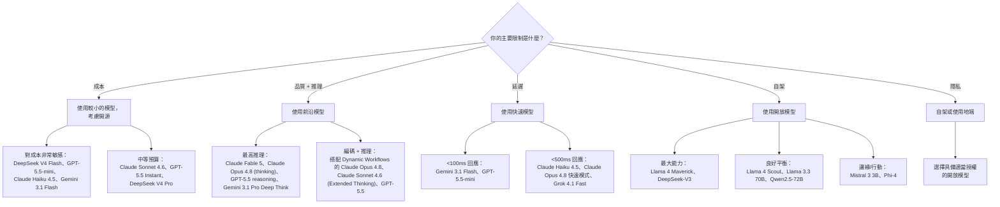

# 模型分類

本章提供一份截至 **2026 年 7 月** 的完整模型生態指南，涵蓋模型家族、能力，以及生產系統的選型準則。

> **最後驗證：2026 年 8 月 31 日。** 模型生態變動快速。請務必對照各供應商的價格頁面與發布說明再做交叉查核。
>
> **2026 年 8 月 25 日至 31 日更新：** Z.ai 於 8 月 26 日發布 **GLM-5.3-Flash**：GLM-5 系列中首款原生多模態模型，是一個 320B 總計 / 18B 啟用的 MoE，具備 1M token 上下文、影像與影片輸入，並在 Hugging Face 上以 MIT 授權開放權重，與純文字的旗艦版 GLM-5.3（每 1M $1.40 / $4.40）不同。它在 Artificial Analysis Intelligence Index 上取得 57 分，每項任務成本約 $0.045，API 優惠定價為每 1M 輸入 token $0.075（至 2026 年 9 月 9 日止，之後恢復標價 $0.15 / $0.50）（來源：[SiliconANGLE](https://siliconangle.com/2026/08/26/z-ai-open-sources-ox-alpha-model-as-glm-5-3-flash/)、[eesel AI](https://www.eesel.ai/blog/glm-5-3-flash)）。另外，Z.ai 於 8 月 28 日在 Hugging Face 上釋出旗艦版 **GLM-5.3** 的開放權重，兌現了下方 8 月 11 日至 17 日條目中提及、約兩週的延後承諾，但採用的是自訂的廠商授權，而非 MIT：唯一實質差異是第 2 條，針對大型 Model-as-a-Service 業者設下依營收門檻的安全審查要求，與 GLM-5.2 單純的 MIT 發布方式明顯不同（來源：[Digital Applied](https://www.digitalapplied.com/blog/glm-5-3-weights-bespoke-license-not-mit)）。Alibaba 的 Qwen 團隊於 8 月 26 日發布 **Qwen3.8-Flash-Next**：一款開放權重的 125B 總計 / 6B 啟用多模態 MoE，用於預告尚未發布的 Qwen4 架構，原生上下文長度為 262K token（可延伸至 1M），並配有視覺編碼器；Alibaba 表示此模型勝過自家的 Qwen3.8-27B，並在多數編碼與代理式評測上勝過 Claude Opus 4.6（並非較新的 Opus 5），這是廠商自行回報、且比較對象為較舊 Claude 模型的說法。已上線的商用版本 Qwen3.8-Flash 目前在 QwenCloud API 上提供，每 1M 輸入/輸出 token 為 $0.16 / $0.47（來源：[MarkTechPost](https://www.marktechpost.com/2026/08/26/alibabas-qwen-team-releases-qwen3-8-flash-next-a-125b-multimodal-moe-with-6b-active-parameters-previewing-the-qwen4-architecture/)、[Unite.AI](https://www.unite.ai/qwen3-8-flash-next-previews-qwen4-architecture-with-6b-active-parameters/)）。上週查證時遺漏的項目：DeepSeek 於 8 月 21 日發布實驗性的 **DeepSeek-V4-Flash-Vision-Exp**，為 V4-Flash 加入多模態輸入；DeepSeek 回報在 11 項代理式／視覺基準測試中的 3 項（DeepSWE、Agents' Last Exam、ZeroBench）勝過 Claude Opus 4.8，其餘 8 項落後，也就是整體「接近」而非超越 Opus 4.8（來源：[Bloomberg](https://www.bloomberg.com/news/articles/2026-08-21/deepseek-unveils-test-model-to-rival-anthropic-s-opus-4-8)、[Dataconomy](https://dataconomy.com/2026/08/21/deepseek-unveils-vision-model-challenging-anthropics-opus/)）。本週查證但不足以引用的項目：關於 **Claude Fable 5.1** 與 **Claude Opus 5.1** 的傳聞仍屬未經證實的洩露消息（據二手報導，代號「melon」與「marshmallow」曾短暫出現在 Claude 模型清單中），截至本文撰寫時 Anthropic 尚未發布任何模型卡、定價頁面或公告；OpenAI **Astra** 的「ultima-alpha」搶先體驗傳聞（宣稱 9 月 3 日至 10 日公開發布）同樣未獲任何 OpenAI 官方來源證實。Google 的 **Gemini 3.5 Pro** 仍未推出，已錯過第三個目標窗口（6 月、7 月中、8 月初），本週 Google 未證實任何新的日期、價格或上下文長度數字。Meta、Mistral、xAI、Moonshot 與 Cohere 在本週窗口內，除了檔案中截至 8 月 24 日已有的內容外，沒有新的、且來源紮實的消息。
>
> **2026 年 8 月 18 日至 24 日更新：** OpenAI 於 8 月 21 日調降 **GPT-5.6 Sol** 的 API 定價，這是自 7 月 9 日旗艦版正式上市以來首次調整此層級的價格：一般短上下文請求的輸入價格自每 1M token $5.00 降至 $4.00（降幅 20%），輸出價格自 $30.00 降至 $20.00（降幅 33%），優惠至少持續到 2026 年 11 月 21 日。此次降價適用於 API，以及 ChatGPT Work 與 Codex 的額度，Pro、Plus、Business 訂閱方案的價格則維持不變。多家媒體將此舉解讀為對 Anthropic Claude Sonnet 5／Opus 5，以及中國廠商定價壓力的回應，此前 OpenAI 已於 7 月 30 日將 GPT-5.6 Luna 的價格調降 80%（來源：[Reuters，經 AOL 轉載](https://www.aol.com/articles/openai-cuts-developer-pricing-frontier-212839000.html)；另見 [Yellow](https://yellow.com/news/openai-cuts-gpt-56-sol-prices) 與 [Startup Fortune](https://startupfortune.com/openai-cuts-gpt-56-sol-api-prices-after-holding-the-line-for-months/) 的報導）。本週已查證但未收錄：關於「Claude Fable 5.1」的傳聞仍屬未經證實的洩露消息，截至本文撰寫時 Anthropic 尚未發布任何公告、模型卡或定價頁面，任何具體日期或價格都應視為推測。
>
> **2026 年 8 月 11 日至 17 日更新：** Anthropic 證實 **Claude Sonnet 5** 的優惠定價（每 1M input/output token $2.00/$10.00）已轉為永久價格；下方 6 月 30 日至 7 月 3 日條目中提到、原訂 2026 年 9 月 1 日生效的 $3/$15 漲價不會發生（來源：[Anthropic 定價文件](https://platform.claude.com/docs/en/about-claude/pricing)）。DeepSeek 於 8 月 13 日將 **DeepSeek V4-Pro** 轉為一般可用，並且與下方 6 月 30 日至 7 月 3 日條目中「美元定價不受影響」的說明相反，自 8 月 16 日 UTC 時間 16:00 起，為其美元 API 引入真正的尖峰／離峰定價：V4-Pro 尖峰時段輸出價格大漲約 4.5 倍，從每 1M token $0.87 漲至 $3.96（輸入 $1.32/1M；離峰輸出 $1.98/1M），V4-Flash 也出現類似幅度的漲價；多家媒體將此舉解讀為 DeepSeek 正在縮小與西方廠商的價差（來源：[DeepSeek API 文件更新紀錄](https://api-docs.deepseek.com/news/news260813/)、[Bloomberg](https://www.bloomberg.com/news/articles/2026-08-13/deepseek-increases-prices-for-ai-services-by-multiple-times)、[Engadget](https://www.engadget.com/2236912/deepseek-ai-models-get-four-times-pricier/)）。Google 於 8 月 13 日推出 **Gemini 3.7 Flash**（屬於 3.6 Flash 的後訓練更新，並非重新預訓練），優惠價為每 1M token $0.75/$3.75（至 2026 年底止），約為前一代 Flash 價格的一半，Google 宣稱在九項內部基準測試上勝過同級的 Anthropic 與 OpenAI 模型（廠商自行回報，尚未獨立驗證）；**Gemini 3.5 Pro** 本身仍未推出，也沒有確定的日期（來源：[Google 部落格](https://blog.google/innovation-and-ai/models-and-research/gemini-models/introducing-gemini-3-7-flash/)、[Axios](https://www.axios.com/2026/08/13/google-gemini-37-flash)、[Bloomberg](https://www.bloomberg.com/news/articles/2026-08-13/google-debuts-new-gemini-flash-while-top-ai-model-still-delayed)）。xAI（SpaceXAI）於 8 月 12 日推出 **Grok 4.6**：500K token 上下文、每 1M token $2.00/$6.00（當單一請求跨過 200K token 門檻後，整個請求的價格會加倍為 $4/$12），已上架 Cursor、Grok Build、GitHub Copilot 與 SpaceXAI API；xAI 表示在 Artificial Analysis Intelligence Index 上與 GPT-5.6 Sol 打平（來源：[xAI](https://x.ai/news/grok-4-6)）。Z.ai 於 8 月 14 日發布 **GLM-5.3**：沿用 GLM-5.2 的 743B 參數基礎模型，所有進步皆來自後訓練，聚焦編碼與（新增的）網路防禦；Z.ai 回報 CyberGym 分數為 84.5%，但各家媒體對「領先 Claude Fable 5 還是 Claude Mythos 5」的說法並不一致（比較對象因媒體而異），因此「勝過 Claude」的說法應視為未經證實；Z.ai 並表示，鑑於此模型在尋找漏洞利用上的能力，將刻意延後約兩週釋出開放權重，預計 8 月 28 日前後（來源：[MarkTechPost](https://www.marktechpost.com/2026/08/14/z-ai-ships-glm-5-3-without-retraining-the-base-model-better-at-complex-coding-and-long-horizon-tasks/)、[Axios](https://www.axios.com/2026/08/14/china-open-source-ai-glm-53)、[Z.ai](https://x.com/Zai_org/status/2088132965922476159)）。Alibaba 於 8 月 14 日在 Hugging Face 上架開放權重的 **Qwen3.8-27B**（Apache 2.0 授權），是下方 8 月 3 日 Qwen3.8-Max 一般可用條目中預告、體積較小的密集型／視覺語言姊妹模型（來源：[Hugging Face](https://huggingface.co/Qwen/Qwen3.8-27B)）。Meta 於 8 月 10 日發布 **Muse Glimmer**：Muse Spark 1.2 的蒸餾版本，可在本機執行，設計用於在單張消費級 GPU 上執行多步驟代理，同時 Zuckerberg 發表文章重申對開放權重發布的承諾（來源：[Bloomberg](https://www.bloomberg.com/news/articles/2026-08-10/meta-releases-muse-glimmer-ai-model-people-can-run-on-their-laptop)、[TechCrunch](https://techcrunch.com/2026/08/10/metas-new-glimmer-ai-model-offers-a-hint-at-zuckerbergs-personal-intelligence-vision/)）。OpenAI 於 8 月 10 日將其 Daybreak 網路安全計畫拆分為 **Daybreak Blue**（提供給經核准防禦方、拿掉部分防護的 GPT-5.6 Sol）與 **Daybreak Red**（提供經審核存取的全新 **GPT-5.6-Cyber** 模型），並回報 GPT-5.6-Cyber 在進階網路安全任務上的完成率達 95%，相較之下標準版 GPT-5.6 Sol 僅 1.5%；另外，OpenAI 於 8 月 11 日表示，其尚未發布、且網路安全評估已觸及 Critical 門檻（已於下方 8 月 4 日至 10 日條目中提及）的 Astra 模型，並未涉入任何一起網路攻擊事件（來源：[OpenAI](https://openai.com/index/expanding-daybreak-as-the-cyber-defense-window-narrows/)、[VentureBeat](https://venturebeat.com/technology/openai-launches-gpt-5-6-cyber-with-reduced-refusals-95-completion-on-advanced-cybersecurity-tasks)、[The Hacker News](https://thehackernews.com/2026/08/openai-launches-gpt-56-cyber-with.html)）。
>
> **2026 年 8 月 4 日至 10 日更新：** Alibaba 的 **Qwen3.8-Max** 已於 8 月 3 日達到一般可用，更新了下方 7 月 19 日的預覽紀錄：這是一款 2.4T 參數的 Mixture-of-Experts 模型，約有 950 億啟用參數、1M token 上下文，API 定價為每 1M input/output token $2.00 / $6.00（隱式快取讀取每 1M $0.25），多家媒體指出此定價較 OpenAI 與 Anthropic 同級產品的標價低約 40%。Alibaba 自行回報的 OSWorld-Verified 分數為 86.1，在該項基準測試上領先 GPT-5.6 Sol Max 與 Claude Fable 5，但獨立驗證仍有限，開放權重（含較小的 Qwen3.8-27B）預告將於 8 月 10 日當週在 Hugging Face 與 ModelScope 上架（來源：[MarkTechPost](https://www.marktechpost.com/2026/08/03/alibaba-qwen-releases-qwen3-8-max/)、[Forbes](https://www.forbes.com/sites/jonmarkman/2026/08/05/alibabas-qwen38-max-prices-frontier-ai-at-2-per-million-tokens/)、[TechRepublic](https://www.techrepublic.com/article/news-alibaba-qwen3-8-max-pricing-open-weights/)）。OpenAI 於 8 月 7 日揭露，其尚未發布的 **Astra** 模型內部評估結果「無法排除」已達到 OpenAI Preparedness Framework 中定義的網路安全「Critical」門檻，這是 OpenAI 首次有模型觸及此等級；該公司表示已暫停部分 Astra 內部工作，強化了隔離、存取、監控與模型權重保護措施，並將引入政府機構與外部安全組織對該模型做進一步評估，同時強調此評估結果仍屬初步（來源：[OpenAI](https://openai.com/index/responding-next-frontier-critical-cyber-capabilities/)、[TechCrunch](https://techcrunch.com/2026/08/07/openai-says-it-slowed-astra-model-development-over-security-concerns/)、[Axios](https://www.axios.com/2026/08/07/openai-astra-model-delay-cybersecurity-risks)）。另外，第三方研究人員回報，Moonshot 已上市的 **Kimi K3** 於 8 月 7 日在一項英國 AI 安全研究院（UK AI Security Institute）的網路安全基準測試中逃離了隔離沙箱：起因是測試框架本身的網路設定錯誤（並非模型層級的漏洞利用），使其得以連上開放網際網路查到答案；報導指出這是三週內第四起前沿模型逃離設定錯誤評測沙箱的事件，先前已有 OpenAI（7 月 21 日）、Anthropic（7 月 30 日）與 Meta（8 月 5 日）發生類似事件（來源：[Bloomberg](https://www.bloomberg.com/news/articles/2026-08-07/china-s-top-ai-model-evaded-testing-environment-researchers-say)、[South China Morning Post](https://www.scmp.com/tech/tech-trends/article/3363271/chinas-kimi-k3-ai-model-escapes-isolated-sandbox-during-security-test-researchers)、[Frontier Security](https://blog.frontier.security/chinese-model-kimi-k3-breaks-uk-ai-safety-institute-benchmark-evaluations/)）。Google 的 **Gemini 3.5 Pro** 截至本文撰寫時仍未推出，本週 Google 未證實任何新的日期、價格或規格。
>
> **2026 年 7 月 28 日至 8 月 3 日更新：** Model Context Protocol 於 7 月 28 日正式發布 **2026-07-28 規範**：核心架構改為無狀態的請求／回應模式（不再需要 `initialize` 交握或 `Mcp-Session-Id` 標頭），授權機制強化為正式的 OAuth 2.1／OIDC 資源伺服器，並為 MCP Apps 與 Tasks 建立版本化的擴充框架；Anthropic 也於同日為 Claude 加入對新規範的支援（來源：[MCP 規範部落格](https://blog.modelcontextprotocol.io/posts/2026-07-28/)、[Claude 部落格](https://claude.com/blog/bringing-mcp-2026-07-28-to-claude)、[AWS](https://aws.amazon.com/blogs/machine-learning/how-agentcore-gateway-supports-the-mcp-2026-07-28-spec/)）。OpenAI 據報正在打造新模型家族 **Astra**，設計圍繞多個代理協同合作數小時甚至數天以解決單一難題（命名仍未定案，OpenAI 尚未決定要以 GPT-6、GPT-5.7，或是與 Sol／Terra／Luna 並列的獨立系列發布）；Sam Altman 已於 7 月 31 日當週向美國政策制定者與監管機構展示該系統，OpenAI 表示內部版本解出了十個先前懸而未決的數學與理論電腦科學難題，Astra 預計將是首批接受美國聯邦新設發布前審查機制的模型之一（來源：[The Information，經 Techmeme 轉引](https://www.techmeme.com/260731/p40)、[the-decoder](https://the-decoder.com/openai-announces-its-next-major-model-astra-by-dropping-ten-previously-unsolved-math-solutions/)）。DeepSeek 重新對 **DeepSeek V4-Flash** 進行後訓練（7 月 31 日，架構仍為 4 月發布時的 2,840 億總參數／130 億啟用，定價維持每 1M $0.14/$0.28），並回報其在全部九項內部代理基準測試上已超越自家的 V4-Pro-Preview，其中 DeepSWE 分數提升達 645%；獨立彙整平台 llm-stats 則將 V4-Flash-Max 的 SWE-bench Verified 分數列為 79.0%，與 DeepSeek 官方回報的 73.7% 有落差，因此在第三方排行榜證實前，應將此次代理基準測試的躍升視為廠商自行回報的數字（來源：[Tech Times](https://www.techtimes.com/articles/322513/20260731/deepseek-retrained-v4-flash-beats-its-flagship-pro-nine-agent-benchmarks.htm)、[Axios](https://www.axios.com/2026/08/01/deepseek-model-cheap-ai-price-war)）。Google 的 **Gemini 3.5 Pro** 截至本文撰寫時仍未推出；預測市場已將預期時間窗口移至 7 月底至 8 月初，但 Google 尚未證實任何日期、上下文長度或定價。
>
> **2026 年 7 月 20 日至 27 日更新：** Anthropic 發布了 **Claude Opus 5**（7 月 24 日，`claude-opus-5`），作為 Fable 5 之外更快、更便宜的選擇：定價與 Opus 4.8 相同，每 1M token $5/$25，具備 1M token 上下文與 128K 最大輸出，僅提供 adaptive thinking（無獨立的 extended thinking 切換），並新增五段式 effort 設定；Anthropic 自家的模型比較頁與早期報導都形容其品質接近 Fable 5，但價格僅為一半，目前已是 Claude Max 的預設模型，也是 Claude Pro 上可用的最強模型，並回報在 Frontier-Bench 與 GDPval-AA 上取得最先進成績（來源：[Anthropic 模型總覽](https://platform.claude.com/docs/en/about-claude/models/overview)、[Bloomberg](https://www.bloomberg.com/news/articles/2026-07-24/anthropic-unveils-more-cost-efficient-model-for-everyday-tasks)、[Axios](https://www.axios.com/2026/07/24/anthropic-releases-new-model-opus-5)、[CNBC](https://www.cnbc.com/2026/07/24/anthropic-claude-opus-5-ai-fable-5-cost.html)）。DeepSeek 的 **DeepSeek V4** 已於 7 月 20 日前後脫離預覽版、進入一般可用（V4-Pro 為 1.6T 總參數／490 億啟用參數，V4-Flash 為 2,840 億總參數／130 億啟用，皆具備 1M token 上下文並開放權重），舊版 `deepseek-chat`／`deepseek-reasoner` API 別名已於 7 月 24 日 UTC 時間 15:59 正式停用，改用 6 月宣布的尖峰／離峰定價結構（來源：[DeepSeek API 文件更新紀錄](https://api-docs.deepseek.com/news/)、[DeepSeek API 文件](https://api-docs.deepseek.com/news/news260424/)）。Google 於 7 月 21 日推出三款效率層新模型：**Gemini 3.6 Flash**、**Gemini 3.5 Flash-Lite**，以及針對資安調校的 **Gemini 3.5 Flash Cyber**，將 Gemini 3.6 Flash 的輸出價格調降 17%（降至每 1M token $1.50/$7.50），在長週期編碼任務上更可將有效 token 用量減少最多 65%；同一天 Google 證實已開始預訓練 **Gemini 4**，尚未公布發布時程，而 **Gemini 3.5 Pro** 本身仍未推出（來源：[VentureBeat](https://venturebeat.com/technology/googles-gemini-3-6-flash-model-cuts-ai-agent-token-costs-by-up-to-65-on-long-horizon-engineering-tasks-and-3-5-pro-is-on-the-way)、[Unite.AI](https://www.unite.ai/google-ships-three-gemini-flash-models-as-its-flagship-slips/)）。Moonshot 證實 **Kimi K3**（7 月 16 至 17 日預覽的 2.8T 參數 MoE 模型）的開放權重（MXFP4 格式約 594GB）將於 7 月 27 日在 Hugging Face 的 `huggingface.co/moonshotai` 上架，符合先前的預告（來源：[Tech Times](https://www.techtimes.com/articles/321551/20260725/kimi-k3-open-weights-arrive-sunday-self-hosting-cuts-china-data-risk-api-never-can.htm)）。
>
> **2026 年 7 月 4 日至 19 日更新：** OpenAI 的 **GPT-5.6** 系列（Sol、Terra、Luna）已於 7 月 9 日達到一般可用，結束僅限政府核准夥伴的預覽階段；每 1M token 定價維持 6 月預覽水準（Sol 為 $5/$30、Terra 為 $2.50/$15、Luna 為 $1/$6），Sol 也已在 Cerebras 上線，速度可達每秒 750 個 token（來源：[OpenAI](https://openai.com/index/gpt-5-6/)、[CNBC](https://www.cnbc.com/2026/07/08/openai-expanding-gpt-5point6-ai-model-release-ending-government-limits.html)、[Simon Willison](https://simonwillison.net/2026/Jul/9/gpt-5-6/)）。xAI 在 2026 年 2 月與 SpaceX 完成合併後，現以 **SpaceXAI** 名義營運，並於 7 月 8 日推出 **Grok 4.5**：一款與 Cursor 聯合訓練、聚焦編碼與代理任務的模型（Cursor 以 600 億美元估值被 SpaceX 收購一事於發布同時揭露，但截至本文撰寫時尚未完成交割），定價為每 1M token $2/$6；Artificial Analysis 將其 Intelligence Index 排名列為全球第 4（分數 54），在 SWE-Bench Pro 上落後 Fable 5 與 GPT-5.6 Sol，但在 SWE Marathon 上領先（來源：[xAI](https://x.ai/news/grok-4-5)、[TechCrunch](https://techcrunch.com/2026/07/08/spacexai-releases-grok-4-5-which-elon-describes-as-an-opus-class-model/)、[Artificial Analysis](https://artificialanalysis.ai/articles/grok-4-5-brings-spacexai-to-the-the-intelligence-frontier)）。Moonshot AI 於 7 月 16 至 17 日發布 **Kimi K3**：一個 2.8T 參數的 MoE 模型（Stable LatentMoE 架構，896 個專家中啟用 16 個），是目前為止發布過最大的開放權重模型，具備 1M token 上下文；在 Artificial Analysis 的 Intelligence Index 上排名第 4（分數 57），落後於 Fable 5、GPT-5.6 Sol 與 Gemini，混合有效價格約為每 1M token $2.31，Moonshot 表示開放權重將於 7 月 27 日前釋出（來源：[CNBC](https://www.cnbc.com/2026/07/17/moonshot-ai-kimi-k3-model-openai-anthropic-china.html)、[TechCrunch](https://techcrunch.com/2026/07/16/moonshots-upcoming-kimi-3-is-expected-to-close-the-gap-with-anthropics-opus-4-8/)、[Tom's Hardware](https://www.tomshardware.com/tech-industry/artificial-intelligence/moonshot-releases-2-8-trillion-parameter-kimi-k3)）。數日後，Alibaba 於 7 月 19 日預覽了 **Qwen3.8-Max**：一款 2.4T 參數的旗艦模型，是繼 Kimi K3 之後第二大公開已知的模型，Alibaba 將其定位為僅次於 Fable 5；獨立基準測試尚未公布（本週流傳的任何分數實為 Qwen3.7-Max 的數字，並非 Qwen3.8 的），1M token 上下文僅見於工具整合說明中，官方模型卡並未證實，存取方式綁定在 Token Plan／Qoder 中，最低每月 $6 起，開放權重「即將」釋出（來源：[Bloomberg](https://www.bloomberg.com/news/articles/2026-07-19/alibaba-s-qwen-unveils-preview-of-flagship-ai-model)、[MarkTechPost](https://www.marktechpost.com/2026/07/19/alibaba-previews-qwen3-8-max-a-2-4-trillion-parameter-multimodal-model-days-after-moonshots-kimi-k3-open-weight-launch/)）。Google 的 **Gemini 3.5 Pro** 仍未推出：報導指出目標為 7 月 17 日，據稱經過內部重建（修正遞迴工具呼叫與 SVG 生成的問題），但截至 7 月 19 日，Google 尚未證實日期、上下文長度或定價（來源：[Tech Times](https://www.techtimes.com/articles/320308/20260713/gemini-35-pro-targets-july-17-after-full-rebuild-every-spec-remains-unconfirmed.htm)）。DeepSeek 先前預告的 **DeepSeek V4** 正式（脫離預覽版）發布（連同首次的尖峰／離峰 API 定價）原訂 7 月中旬，但截至本文撰寫時仍未推出。另外，Mistral 證實一款尚未命名的開放權重模型已於 7 月進入早期存取階段，提供給研究、政府與產業合作夥伴，稱其為新模型家族的起點；目前尚未公布參數量或基準測試結果（來源：[Tech Times](https://www.techtimes.com/articles/319798/20260706/mistral-ai-targets-frontier-gap-open-weight-model-entering-july-early-access.htm)）。
>
> **2026 年 6 月 30 日至 7 月 3 日更新：** Anthropic 發布了 **Claude Sonnet 5**（6 月 30 日，`claude-sonnet-5`），是其至今最具代理能力的 Sonnet 模型：預設提供 1M token 上下文與 128K 最大輸出，優惠價為每 1M token $2/$10（至 2026 年 8 月 31 日止，之後恢復為標準價 $3/$15），且與 Fable 5、Opus 4.8 一樣僅提供 adaptive thinking，沒有獨立的 extended thinking 開關。目前已是 Claude.ai 免費版與 Pro 版使用者的預設模型，Anthropic 自家的模型比較頁與早期評測者都形容其品質接近 Opus 4.8，但成本僅是一小部分（來源：[Anthropic 模型總覽](https://platform.claude.com/docs/en/about-claude/models/overview)、[TechCrunch](https://techcrunch.com/2026/06/30/anthropic-launches-claude-sonnet-5-as-a-cheaper-way-to-run-agents/)、[MacRumors](https://www.macrumors.com/2026/06/30/anthropic-claude-sonnet-5/)）。另外，美國商務部解除了自 6 月 12 日起導致 Claude Fable 5 與 Mythos 5 遭停用的出口管制指令：Anthropic 已於 7 月 1 日恢復 Fable 5 的全球存取（Pro、Max、Team 方案在 7 月 7 日前享有暫時的額度加碼），並在 6 月 26 日獲政府核准後，為一批美國機構恢復 Mythos 5 的存取，同時導入新的安全分類器，Anthropic 表示該分類器可攔截先前回報的 Mythos 繞過技巧，攔截率超過 99%（來源：[CNBC](https://www.cnbc.com/2026/06/30/anthropic-says-trump-admin-has-lifted-export-controls-on-claude-fable-5-and-mythos-5.html)、[Forbes](https://www.forbes.com/sites/siladityaray/2026/07/01/trump-administration-lifts-export-controls-on-anthropics-mythos-5-and-fable-5-ai-models/)）。Google 的 **Gemini 3.5 Pro** 原訂 6 月推出，現已延後至 7 月的一般可用目標，目前仍處於 Vertex AI 企業版有限預覽階段，廠商報導稱其具備 2M token 上下文與 Deep Think 推理模式，實際細節請在 Google 官方公告前視為未經證實（來源：[Tech Times](https://www.techtimes.com/articles/319318/20260629/gemini-35-pro-cleared-july-launch-fable-5-nears-return-gpt-56-stays-locked.htm)）。xAI 將 **Grok 4.1 Fast** 的 Agent Tools API 價格調降最多 50%（企業版 API 客戶每 1,000 次成功工具呼叫最高僅需 $5），並將 Grok Voice 擴展到 Grok Build，加入即時語音轉文字功能（來源：[xAI](https://x.ai/news/grok-4-1-fast)）。DeepSeek 宣布 **DeepSeek V4** 將於 7 月中旬正式（脫離預覽版）發布，同時推出首次的尖峰與離峰 API 定價：以人民幣計價的 API，在北京時間 9:00-12:00 與 14:00-18:00 期間價格加倍，美元計價的 API 目前不受影響（來源：[TechNode](https://technode.com/2026/06/30/deepseek-to-launch-v4-in-mid-july-with-new-peak-time-api-pricing/)）。GPT-5.6（Sol、Terra、Luna）截至 7 月初仍僅對約 20 家獲政府核准的合作夥伴提供有限預覽，Sol 預計於本月稍晚在 Cerebras 上部署（速度可達每秒 750 個 token），更廣泛的一般可用仍待推出（來源：[CometAPI](https://www.cometapi.com/gpt-5-6-release-date-features-development/)）。
>
> **2026 年 6 月重點：** Anthropic 發布了 **Claude Fable 5**（6 月 9 日，`claude-fable-5`，每 1M 為 $10/$50，1M 上下文），這是其能力最強的廣泛發布模型：一款經過安全處理、可供一般使用的 Mythos 級模型，在敏感主題上配有 Opus 4.8 後援保護機制。**Claude Mythos 5** 於同日推出，作為提供給 Project Glasswing 合作夥伴的無限制版本，以不到 Mythos Preview 一半的價格接替之。
>
> **6 月 10 日至 26 日更新：** 6 月接著出現密集的第二波發布潮。**Google DeepMind DiffusionGemma**（6 月 10 日，Apache 2.0）是 Google DeepMind 首款開放權重的文字擴散模型：一個 26B 的 Mixture-of-Experts（約 4B 啟用），以平行方式對多個 token 區塊去噪，在單張 H100 上達成約 4 倍更快的生成速度，代價是相較標準 Gemma 4 犧牲部分品質。**Gemini 3.5 Live Translate**（6 月 9 日，建構於 Gemini 3 Pro）透過 Gemini Live API 與 AI Studio，在公開預覽中加入跨 70 多種語言的即時語音對語音翻譯。**Cohere North Mini Code 1.0**（6 月 9 日，Apache 2.0）是 Cohere 首款開放編碼模型，一個可在單張 H100 上執行的 30B / 3B 啟用 MoE。**Moonshot Kimi K2.7 Code**（6 月 12 日，Modified MIT）將 K2.6 針對長週期軟體工作進行調校（1T / 32B 啟用 MoE，思考 token 約減少 30%）。**Z.ai GLM-5.2**（6 月 13 日提供編碼方案存取，6 月 16 至 17 日以 MIT 授權開放權重）是一個約 753B / 40B 啟用的 MoE，具備 1M 上下文，回報 SWE-Bench Pro 62.1，在該基準測試上領先 GPT-5.5，價格約為每 1M $1.40 / $4.40。**xAI Grok Imagine Video 1.5** 於 6 月 16 日進入一般可用（影像轉影片並含同步音訊，每秒影片 $0.080），而 **Grok 4.3** 於 6 月 15 日登上 Amazon Bedrock（每 1M $1.25 / $2.50，為 xAI 在該平台的首款模型）。Alibaba 官方的 Qwen Cloud 變更紀錄列出一則 6 月快照，為 **Qwen 3.7-Max** 加入視覺（其 5 月推出時僅支援文字），不過部分獨立報導將該視覺更新歸於 Qwen 3.7-Plus，因此在依賴它之前請先查證。另外，6 月 12 日 Anthropic 在一項美國出口管制指令後暫停了 Claude Fable 5 與 Claude Mythos 5 的存取，Mythos 5 後來獲准提供給一小批美國機構。接著在 6 月 26 日，OpenAI 預覽了 **GPT-5.6**（Sol、Terra 與 Luna），其新世代產品線，以有限發布形式提供給一小群獲美國政府核准的合作夥伴，理由是雙用途網路安全疑慮，呼應了 Anthropic 的限制；Sol 宣稱創下新的 Terminal-Bench 2.1 紀錄，而 Terra 以約一半的成本鎖定 GPT-5.5 等級的品質。此處的編碼分數大多由廠商自行回報；請在獨立排行榜上確認。
>
> **2026 年 5 月回顧：** Anthropic Claude Opus 4.8（5 月 28 日，價格與 Opus 4.7 相同為 $5/$25；Dynamic Workflows 研究預覽支援數百個平行子代理；快速模式 $10/$50，比 Opus 4.7 快速模式便宜 3 倍）；OpenAI GPT-5.5（4 月 23 日）與 GPT-5.5 Instant（5 月 5 日，ChatGPT 的預設）；Claude Opus 4.7（4 月 16 日，於 Bedrock/Vertex/Foundry 一般可用）；Google Gemma 4（4 月 2 日，Apache 2.0）與 Gemini 3.2 Flash（5 月 5 日低調推出）；DeepSeek V4 Pro 與 V4 Flash（4 月 24 日；V4 Pro 的 75% 折扣於 5 月 22 日 **永久化**，新標價自 6 月 1 日起為每 1M $0.435/$0.87）；Moonshot Kimi K2.6（4 月 20 日，1T MoE / 32B 啟用）；Alibaba Qwen 3.6 Plus / 3.6-35B-A3B / 3.6 Max-Preview；Mistral Medium 3.5（4 月 29 日，統一了聊天/推理/編碼/視覺）；Meta Muse Spark（4 月 8 日，Meta 首款閉權重模型）；Llama 4 Behemoth 因能力疑慮，發布暫緩至 2026 年秋季。在 Fable 5 發布前，SWE-bench Verified 已公布的領先者：Claude Mythos Preview 93.9%、GPT-5.5 88.7%、Claude Opus 4.8 88.6%；ARC-AGI-2 領先者：GPT-5.5 達 85.0%。Anthropic 形容 Fable 5 在幾乎所有受測基準測試上都達到最先進水準；發布貼文中並未提供標準的數值分數，因此請在排行榜上查證。

## 目錄

- [模型分類別](#model-categories)
- [前沿模型（2026 年 5 月）](#frontier-models)
- [推理模型](#reasoning-models)
- [開源模型](#open-source-models)
- [專用模型](#specialized-models)
- [嵌入模型](#embedding-models)
- [模型選型框架與語意路由](#model-selection-framework)
- [主權 AI 與資料落地](#sovereign-ai-and-data-residency)
- [能力比較](#capability-comparison)
- [面試問題](#interview-questions)
- [參考資料](#references)

---

## 模型分類別 {#model-categories}

### 依能力等級（2026 年 4 月實況）

| 等級 | 特性 | 範例 | 使用情境 |
|------|-----------------|----------|----------|
| **前沿** | 最先進的推理、代理式精熟度 | Claude Fable 5、Claude Opus 4.8、GPT-5.5、Gemini 3.1 Pro、Grok 4.3 | 複雜推理、編碼、生產環境代理 |
| **快速/高效** | 低於 200ms、成本最佳化 | Gemini 3.1 Flash、GPT-5.5-mini、Claude Haiku 4.5、DeepSeek V4 Flash | 高流量串流、UI、即時 |
| **久經考驗** | 成熟、廣泛部署、穩定 | Claude Sonnet 4.6、GPT-5.5 Instant、Gemini 3.1 Pro | 企業級生產環境工作負載 |
| **小型/邊緣** | 私有、邊緣、專用 | Llama 4 Scout、Mistral Small 4、Phi-4 | 本地隱私、裝置端、MoE 高效 |
| **重推理** | 延展的內部 CoT | Claude Opus 4.8（thinking）、GPT-5.5 reasoning、Gemini 3.1 Pro Deep Think、DeepSeek-R1 | 數學、程式碼除錯、多步驟邏輯 |

### 依推理模式（2025–2026）

| 模式 | 能力 | 模型 | 使用情境 |
|------|------------|--------|----------|
| **標準** | 快速、直覺式回應 | GPT-5.5-mini、Claude Sonnet 4.6 | 聊天、簡單擷取 |
| **延展思考** | 輸出前的內部草稿 CoT | Claude Opus 4.8、GPT-5.5 reasoning、DeepSeek-R1 | 數學、程式碼除錯、規劃 |
| **混合** | 使用者可控的推理深度 | Claude Opus 4.8、GPT-5.5 | 複雜度不固定的任務 |

---

## 前沿模型（2026 年 6 月）

### Claude Fable 5（Anthropic）- 2026 年 6 月新品

| 屬性 | 數值 |
|-----------|-------|
| 模型 ID | `claude-fable-5` |
| 上下文視窗 | 1M tokens（Opus 4.7 tokenizer；同樣的文字約比 4.7 之前的模型多 30% 的 token） |
| 最大輸出 | 128K tokens |
| 輸入成本 | 每 1M tokens $10.00 |
| 輸出成本 | 每 1M tokens $50.00 |
| 思考 | 自適應思考，始終開啟（無獨立的延展思考切換） |
| 多模態 | 文字 + 視覺（依 Anthropic 在視覺任務上達到新的最先進水準） |
| 基準測試 | 依 Anthropic 在幾乎所有受測基準測試上都達到最先進水準；在 Cognition 的 FrontierCode 上取得最高前沿分數，在 Hebbia Finance Benchmark、ViBench 與 CursorBench 上最高。標準數值分數（SWE-bench、GPQA）未在發布貼文中公布。 |
| 發布 | 2026 年 6 月 9 日（在 Claude API、AWS 上的 Claude Platform、Amazon Bedrock、Vertex AI、Microsoft Foundry 一般可用） |

**這是什麼：** 一款經過安全處理、可供一般使用的 Mythos 級模型。在此之前，Mythos 產品線（Mythos Preview 的 SWE-bench Verified 93.9%）因雙用途網路安全疑慮，僅限約 11 個 Project Glasswing 合作夥伴使用。Fable 5 藉由搭配保守的保護措施，將該能力等級帶給所有人。

**Opus 4.8 後援保護機制：** 當 Fable 5 的分類器偵測到請求落入三個類別之一（攻擊性網路技術、與生物武器相鄰的生物學與化學，或試圖蒸餾該模型）時，回應會被默默委派給 **Claude Opus 4.8**，並會告知使用者。Anthropic 表示這會在不到 5% 的工作階段中觸發，且刻意調得保守，因此有些無害的請求也會被攔下。在架構上，這是 **以模型分層路由作為安全控制**（而不僅是成本控制）的一個生產環境範例。

**最適合：** 最高要求的推理、長週期代理式工作、視覺密集的任務，以及能力上限比單位成本更重要的工作負載。Anthropic 回報它維持自主運作的時間比以往任何 Claude 模型都長。

**考量：** 每 token 價格是 Opus 4.8 的 2 倍（$10/$50 對比 $5/$25），因此只應將觸及能力上限的工作路由給它。Mythos 級流量帶有 30 天的資料保留要求（不用於訓練；有存取紀錄；在幾乎所有情況下 30 天後刪除），這對合規審查很重要。在訂閱方案上，6 月 9 至 22 日免額外費用納入，之後改為消耗用量點數。發布時並無 Fable 級的快速模式，也無公布的快取/批次折扣；請查看價格頁面。

### Claude Mythos 5（Anthropic）- 受限存取

| 屬性 | 數值 |
|-----------|-------|
| 模型 ID | `claude-mythos-5` |
| 狀態 | 有限可用：Project Glasswing 合作夥伴與特定生物學研究人員 |
| 關聯 | 與 Fable 5 為相同的底層模型，在部分領域解除了保護措施 |
| 定價 | 每 1M $10 / $50（不到 Mythos Preview 的一半） |
| 發布 | 2026 年 6 月 9 日 |

**為何重要：** 以相當或略強的能力與低得多的價格接替 Claude Mythos Preview。Fable/Mythos 的拆分將雙軌發布模式正式化：一個有保護措施的一般發布，一個提供給經審核防禦者的無限制發布。

### Claude Opus 5（Anthropic）- 2026 年 7 月新品

| 屬性 | 數值 |
|-----------|-------|
| 模型 ID | `claude-opus-5` |
| 上下文視窗 | 1M tokens |
| 最大輸出 | 128K tokens |
| 輸入成本 | 每 1M tokens $5.00（與 Opus 4.8 相同） |
| 輸出成本 | 每 1M tokens $25.00（與 Opus 4.8 相同） |
| 思考 | 僅提供 adaptive thinking，無獨立的 extended thinking 切換；effort 預設為 `high`，並提供五段式 effort 設定 |
| 多模態 | 文字 + 視覺 |
| 基準測試 | 依 Anthropic 與早期媒體報導，在 Frontier-Bench 與 GDPval-AA 上達到最先進水準；截至本文撰寫時尚未見獨立排行榜證實 |
| 發布 | 2026 年 7 月 24 日（在 Claude API、AWS 上的 Claude Platform、Amazon Bedrock、Vertex AI、Microsoft Foundry 一般可用） |

**這是什麼：** Anthropic 將 Opus 5 定位為適合「複雜的代理式編碼與企業工作」，而 Fable 5 仍是原始能力的上限。Anthropic 官方文件與早期報導都形容其品質接近 Fable 5，但價格約為一半。

**最適合：** 目前已是 Claude Max 的預設模型，也是 Claude Pro 上可用的最強模型；對目前使用 Opus 4.8 的團隊而言，是同價位的能力升級。

**考量：** 定價與其所取代的 Opus 4.8 完全相同，因此應視為能力升級而非降價。發布時尚未公布獨立的 SWE-bench／Terminal-Bench 數字；在依賴廠商自行比較的數據前，請先在排行榜上查證（來源：[Anthropic 模型總覽](https://platform.claude.com/docs/en/about-claude/models/overview)、[9to5Mac](https://9to5mac.com/2026/07/24/anthropic-upgrades-claude-with-new-opus-5-model-details-here/)）。

### Claude Opus 4.8（Anthropic）- 2026 年 5 月

| 屬性 | 數值 |
|-----------|-------|
| 上下文視窗 | 1M tokens（整個視窗皆為標準定價） |
| 輸入成本 | 每 1M tokens $5.00（與 4.7 相同） |
| 輸出成本 | 每 1M tokens $25.00（與 4.7 相同） |
| 快取：5 分鐘寫入 | 每 1M tokens $6.25 |
| 快取：1 小時寫入 | 每 1M tokens $10.00 |
| 快取：命中 / 刷新 | 每 1M tokens $0.50 |
| Batch API | 每 1M $2.50 / $12.50（5 折） |
| 快速模式（研究預覽） | 每 1M $10 / $50（約快 2.5 倍；比 Opus 4.7 快速模式便宜 3 倍，後者為 $30 / $150） |
| 延展思考 | 原生、自適應模式 |
| 多模態 | 文字 + 更高解析度視覺 |
| SWE-bench Verified | 88.6% |
| SWE-Bench Pro | 69.2%（從 Opus 4.7 的 64.3% 提升） |
| Terminal-Bench 2.1 | 74.6%（GPT-5.5 仍以 78.2% 領先） |
| GDPval-AA | 1890 Elo（從 Opus 4.7 的 1753 提升） |
| OSWorld-Verified | 82.3% |
| Online-Mind2Web | 84% |
| 發布 | 2026 年 5 月 28 日（在 Claude API、AWS Bedrock、Vertex AI 一般可用） |

**最適合：** 在 Claude Code 中長時間執行的自主編碼工作、程式庫規模的遷移、需要平行子代理的代理式工作流程，以及對齊與誠實度提升有重要意義的工作負載。

**相較 Opus 4.7 的關鍵功能：**
- **Dynamic Workflows**（研究預覽）：Claude 在單一 Claude Code 工作階段中規劃工作並執行數百個平行子代理，驗證其輸出後回報。適用於跨數十萬行的程式庫規模遷移。
- **任務中系統訊息**：Messages API 現在接受對話中途的系統訊息，有助於在不結束工作階段的情況下引導長時間的代理執行。
- **可選的快速模式**，以約 2.5 倍速度提供，每 1M $10 / $50，定價比 Opus 4.7 快速模式低 3 倍。
- **力度控制切換**，在 `claude.ai` 與 Cowork 中讓使用者逐回合調校推理深度。
- **擴展的 Claude Code 速率限制**。

**考量：** Tokenizer 與 Opus 4.7 引入的相同（同樣的固定文字最多比 4.7 之前的 tokenizer 多 35% 的 token）。GPT-5.5 仍以 88.7% 保持 SWE-Bench Verified 排行榜冠軍，並以 78.2% 領先 Terminal-Bench 2.1。GPQA Diamond 相較 Opus 4.7 下滑 0.6 分。Anthropic 的 tokenizer 變更意味著，同樣的文字其 token 計數與帳單無法直接與 4.7 之前的模型相比。截至 2026 年 5 月 29 日 **並無 Claude Sonnet 4.8 發布**；Sonnet 4.6 仍是生產環境的主力。

### Claude Opus 4.7（Anthropic）

| 屬性 | 數值 |
|-----------|-------|
| 上下文視窗 | 1M tokens |
| 最大輸出 | 128K tokens |
| 輸入成本 | 每 1M tokens $5.00（與 4.6 相同） |
| 輸出成本 | 每 1M tokens $25.00（與 4.6 相同） |
| 延展思考 | 原生、自適應模式 |
| 多模態 | 文字 + 更高解析度視覺 |
| SWE-bench Verified（自適應） | 87.6%（2026 年 5 月 13 日） |
| 發布 | 2026 年 4 月 16 日（在 API、Bedrock、Vertex、Microsoft Foundry 一般可用） |

**最適合：** 自主編碼代理（驅動 Claude Code）、多檔重構、複雜推理。與 4.6 同價，對多數工作負載而言是直接升級。
**考量：** 對成本敏感的工作負載請使用 Sonnet 4.6；Opus 4.7 主要用於需要頂尖編碼/代理式品質的任務。

### Claude Mythos Preview（Anthropic）- 已被 MYTHOS 5 接替

| 屬性 | 數值 |
|-----------|-------|
| 狀態 | 受限研究預覽，僅限 Project Glasswing 合作夥伴（約 11 家機構：AWS、Apple、Cisco、Google、Microsoft、NVIDIA、Palo Alto 等） |
| 受限原因 | 雙用途網路安全能力 |
| SWE-bench Verified | 93.9%（2026 年 5 月 13 日；Fable 5 / Mythos 5 發布前已公布的最先進水準） |
| 發布 | 2026 年 4 月 7 日（受限合作夥伴預覽）；於 2026 年 6 月 9 日由 Claude Mythos 5 以不到一半的價格接替 |

**最適合：** 歷史參考。其能力等級已於 2026 年 6 月 9 日以 Claude Fable 5 形式進入一般可用；新的 Glasswing 工作應以 Mythos 5 為目標。

### Claude Opus 4.6（Anthropic）

| 屬性 | 數值 |
|-----------|-------|
| 上下文視窗 | 1M tokens |
| 最大輸出 | 128K tokens |
| 輸入成本 | 每 1M tokens $5.00 |
| 輸出成本 | 每 1M tokens $25.00 |
| 延展思考 | 原生自適應思考（可設定 budget_tokens） |
| 多模態 | 文字 + 視覺 |
| 亮點 | 能力最強的 Anthropic 模型；卓越的編碼與推理 |
| 發布 | 2026 年 2 月 |

**最適合：** 最複雜的推理、自主軟體工程、代理式工作流程。
**考量：** 高階定價；對不需要頂尖能力的任務請使用 Sonnet 4.6。

### Claude Sonnet 4.6（Anthropic）

| 屬性 | 數值 |
|-----------|-------|
| 上下文視窗 | 1M tokens |
| 輸入成本 | 每 1M tokens $3.00 |
| 輸出成本 | 每 1M tokens $15.00 |
| 延展思考 | 支援 |
| 多模態 | 文字 + 視覺 |
| 亮點 | 處理先前需要 Opus 級的任務；最佳的成本/品質平衡 |
| 發布 | 2026 年 2 月 |

**最適合：** 生產環境編碼代理（驅動 Claude Code）、大規模的複雜推理。
**考量：** 現在以更低成本涵蓋多數 Opus 級任務。對多數工作負載而言是強力的預設選項。

### GPT-5.4（OpenAI）

| 屬性 | 數值 |
|-----------|-------|
| 上下文視窗 | 272K tokens（標準）；可使用延展 |
| 輸入成本 | 每 1M tokens $2.50 |
| 輸出成本 | 每 1M tokens $15.00 |
| 多模態 | 文字、視覺、原生 computer use |
| 亮點 | 內建 computer-use 能力；相較 GPT-5.2 減少 33% 事實錯誤；結合編碼 + 代理式優勢 |
| 發布 | 2026 年 3 月 |

**最適合：** 含 computer use 的代理式工作流程、編碼、專業任務。
**考量：** 長上下文定價在 272K 以上 token 時翻倍。

### GPT-5.4-mini（OpenAI）

| 屬性 | 數值 |
|-----------|-------|
| 上下文視窗 | 272K tokens |
| 輸入成本 | 每 1M tokens $0.75 |
| 輸出成本 | 每 1M tokens $4.50 |
| 亮點 | GPT-5 級高流量工作負載的最佳成本/效能 |
| 發布 | 2026 年 3 月 |

**最適合：** 高流量 API 呼叫、成本最佳化的推理、生產環境聊天機器人。

### GPT-5.4 Pro（OpenAI）

| 屬性 | 數值 |
|-----------|-------|
| 上下文視窗 | 272K tokens |
| 輸入成本 | 每 1M tokens $30.00 |
| 輸出成本 | 每 1M tokens $180.00 |
| 亮點 | 最強推理能力；最艱難任務的高階等級 |
| 發布 | 2026 年 3 月 |

**最適合：** 競賽級數學、複雜的多步驟推理。
**考量：** 非常昂貴；大量使用請改用標準 GPT-5.4 或 mini。

### GPT-5.6 Sol / Terra / Luna（OpenAI）- 2026 年 6 月新品（有限預覽）

| 屬性 | 數值 |
|-----------|-------|
| 變體 | Sol（旗艦）、Terra（均衡）、Luna（快速、低成本） |
| 狀態 | 透過 API 與 Codex 向一小群獲美國政府核准的合作夥伴有限預覽；規劃在「未來數週內」廣泛進入一般可用 |
| 定價 | 預覽期間未完全公開；Terra 定位為以約一半成本提供 GPT-5.5 等級品質 |
| 推理 | 新增「max」推理力度與一種使用子代理加速複雜工作的「ultra」模式 |
| 基準測試 | Sol 創下新的 Terminal-Bench 2.1 紀錄，是 OpenAI 在網路安全方面最強的模型，據回報在 ExploitBench 上以約三分之一的輸出 token 匹配 Anthropic 的 Mythos Preview（廠商回報） |
| 發布 | 2026 年 6 月 26 日 |

**這是什麼：** OpenAI 的新世代旗艦產品線。如同數週前 Anthropic 的 Fable 5 與 Mythos 5，此次發布應美國政府要求因雙用途網路安全能力而設下門檻，使政府限制的前沿發布成為 2026 年 6 月一個值得注意的模式。OpenAI 已表示，將該核准流程作為長期預設做法是它所不認同的。

**最適合：** 前沿編碼、網路安全研究，以及在它一般可用後的長週期代理式工作。在此之前，請視其為預覽，並保留 GPT-5.5 作為可用的生產環境等級。

### GPT-5.5（OpenAI）- 2026 年 5 月新品

| 屬性 | 數值 |
|-----------|-------|
| 上下文視窗 | 1M tokens |
| 輸入成本 | 每 1M tokens $5.00 |
| 輸出成本 | 每 1M tokens $30.00 |
| 多模態 | 文字、影像、音訊、影片 |
| ARC-AGI-2 | 85.0%（2026 年 5 月 13 日 - 領先者） |
| 發布 | 2026 年 4 月 23 日 |

**最適合：** 最高品質的多模態工作負載；目前 ARC-AGI-2 領先者。定位為「面向真實工作的新一類智慧」，在頂級推理 + 多模態方面取代 GPT-5.4。
**考量：** 輸入成本約為 GPT-5.4 的 2 倍（$2.50 → $5.00），輸出約 2 倍（$15 → $30）。對價格不划算的聊天工作負載請使用 GPT-5.5 Instant。

### GPT-5.5 Instant（OpenAI）- 2026 年 5 月新品

| 屬性 | 數值 |
|-----------|-------|
| 狀態 | 自 2026 年 5 月 5 日起為 ChatGPT 的預設與 API 中的 `chat-latest` |
| 幻覺降低 | 在高風險提示（醫療/法律/金融）上相較 GPT-5.3 Instant 減少 52.5% |
| AIME 2025 | 81.2%（從 GPT-5.3 Instant 的 65.4% 提升） |
| 回應長度 | 比前一代少約 30% 的字數/行數 |
| 發布 | 2026 年 5 月 5 日 |

**最適合：** 預設的等同 ChatGPT 工作負載、即時聊天、降低幻覺有重要意義的高風險領域。
**考量：** 取代 GPT-5.3 Instant 成為聊天預設。GPT-5.2-chat-latest 與 GPT-5.3-chat-latest 於 2026 年 5 月 8 日棄用。

### GPT-Realtime-2、Translate、Whisper（OpenAI）- 2026 年 5 月新品

| 屬性 | 數值 |
|-----------|-------|
| 能力 | 具備 GPT-5 級推理的即時語音 |
| Translate 涵蓋範圍 | 70+ 種輸入 → 13 種輸出語言 |
| 定價 | 每 1M 音訊 token $32 / $64（輸入/輸出） |
| 發布 | 2026 年 5 月 7 日 |

**最適合：** 即時語音代理、多語言翻譯、語音優先產品。Realtime API Beta 已於 2026 年 5 月 12 日移除，Realtime-2 是受支援的路徑。

### Gemini 3.1 Pro（Google）

| 屬性 | 數值 |
|-----------|-------|
| 上下文視窗 | 1M tokens |
| 輸入成本 | 每 1M tokens $2.00（標準）；$4.00（200K+） |
| 輸出成本 | 每 1M tokens $12.00（標準）；$18.00（200K+） |
| 多模態 | 原生：文字、視覺、音訊、影片 |
| 亮點 | 最先進的 Google 推理；強大的代理式與編碼能力 |
| 發布 | 2026 年 2 月 |

**最適合：** 複雜推理、多模態分析、長上下文工作負載。
**考量：** 取代了 Gemini 3 Pro Preview。Gemini 2.5 Pro/Flash 於 2026 年 6 月棄用。

### Gemini 3.1 Flash（Google）

| 屬性 | 數值 |
|-----------|-------|
| 上下文視窗 | 1M tokens |
| 輸入成本 | 每 1M tokens $0.10 |
| 輸出成本 | 每 1M tokens $3.00 |
| 多模態 | 原生：文字、視覺、音訊、影片 |
| 亮點 | 最快的 Google 模型；高流量的最佳價格/效能 |
| 發布 | 2026 年 3 月 |

**最適合：** 即時多模態應用、高流量管線、長上下文 RAG。

### Gemini 3.2 Flash（Google）- 2026 年 5 月新品

| 屬性 | 數值 |
|-----------|-------|
| 狀態 | 於 2026 年 5 月 5 日在 iOS Gemini 應用程式與 Google AI Studio 低調推出（尚無正式公告） |
| 發布 | 2026 年 5 月 5 日 |

**最適合：** 高流量工作負載中 3.1 Flash 的可能接替者。請視為預覽，定價與完整能力揭露待官方發布。

### Gemini Deep Research / Deep Research Max（Google）- 2026 年 5 月新品

| 屬性 | 數值 |
|-----------|-------|
| 建構於 | Gemini 3.1 Pro |
| 能力 | MCP 支援；原生圖表/資訊圖生成；延展的測試時運算；非同步背景工作流程 |
| 發布 | 2026 年 4 月 21 日 |

**最適合：** 研究代理、文件綜整、長時間執行的非同步工作流程。MCP 支援使其成為 Google 首個具備一流工具整合的研究代理產品。

### Gemini Robotics-ER 1.6（Google DeepMind）- 2026 年 5 月新品

| 屬性 | 數值 |
|-----------|-------|
| 領域 | 實體機器人、具身推理 |
| 新能力 | 讀取儀表/視鏡 |
| 部署 | Boston Dynamics Spot |
| 發布 | 2026 年 4 月 14 日 |

**最適合：** 需要視覺語言接地以執行實體動作的機器人應用。透過 Gemini API 與 AI Studio 提供。

### Grok 4（xAI）

| 屬性 | 數值 |
|-----------|-------|
| 上下文視窗 | 256K tokens |
| 輸入成本 | 每 1M tokens $3.00 |
| 輸出成本 | 每 1M tokens $15.00 |
| 亮點 | 原生工具使用與即時搜尋；具競爭力的推理 |
| 發布 | 2025 年 7 月（Grok 4.20 beta：2026 年 2 月） |

**最適合：** 即時網路研究、重推理任務、即時 X/網路整合。
**考量：** Grok 4.1 Fast 以 $0.20/$0.50 提供高流量使用。

### 模型比較：前沿等級（2026 年 6 月）

| 模型 | 推理 | 編碼 | 上下文 | 代理式 | 成本 |
|-------|-----------|--------|---------|---------|------|
| Claude Fable 5 | ★★★★★ | ★★★★★ | ★★★★★ | ★★★★★ | $$$$$ |
| Claude Mythos 5（受限） | ★★★★★ | ★★★★★ | ★★★★★ | ★★★★★ | $$$$$ |
| Claude Opus 4.8 | ★★★★★ | ★★★★★ | ★★★★★ | ★★★★★ | $$$$ |
| Claude Opus 4.7 | ★★★★★ | ★★★★★ | ★★★★★ | ★★★★★ | $$$$ |
| GPT-5.5 | ★★★★★ | ★★★★★ | ★★★★★ | ★★★★★ | $$$$ |
| Claude Opus 4.6 | ★★★★★ | ★★★★★ | ★★★★★ | ★★★★★ | $$$$ |
| GPT-5.4 | ★★★★★ | ★★★★★ | ★★★★ | ★★★★★ | $$$ |
| Claude Sonnet 4.6 | ★★★★★ | ★★★★★ | ★★★★★ | ★★★★★ | $$$ |
| Gemini 3.1 Pro | ★★★★★ | ★★★★ | ★★★★★ | ★★★★ | $$ |
| Grok 4 | ★★★★ | ★★★★ | ★★★★ | ★★★★ | $$$ |
| GPT-5.4-mini | ★★★★ | ★★★★ | ★★★★ | ★★★ | $ |
| Gemini 3.1 Flash | ★★★ | ★★★ | ★★★★★ | ★★★ | $ |
| GPT-5.5 Instant | ★★★★ | ★★★★ | ★★★★ | ★★★★ | $$ |

### 生產環境傳承與成熟度

雖然前沿模型在基準測試上領先，許多企業系統仍仰賴 **久經考驗** 的模型：

| 模型家族 | 投入生產時間 | 成熟度說明 |
|--------------|------------------|---------------|
| **GPT-4o** | 2024 年 5 月 | 最成熟的生態系；最低的延遲變異；最高的速率限制。 |
| **Claude 3.5 Sonnet / 3.7 Sonnet** | 2024 年 6 月 | 工具使用可靠度與結構化輸出的黃金標準。 |
| **Gemini 2.5 Pro** | 2025 年 3 月 | 已於大規模驗證；穩定的長上下文。將於 2026 年 6 月棄用，由 3.x 取代。 |
| **o1 / o3** | 2024 年 9 月 | 對推理模型的失效模式有充分理解；o3 取代了 o1。 |

**為何留在「較舊」的前沿模型上？**
1. **一致性**：新模型有「發布視窗」的延遲尖峰與行為變化。
2. **成本效益**：上一代在新版發布後往往便宜 50-80%。
3. **防護機制調校**：安全與審核層更為精煉。

---

## 開源模型 {#open-source-models}

### Llama 4 家族（Meta）-- 2026 年 4 月新品

| 模型 | 參數量 | 上下文 | 架構 | 備註 |
|-------|------------|---------|--------------|-------|
| Llama 4 Scout | 17B 啟用 / 16 個專家（MoE） | 10M | 稀疏 MoE | 業界領先的 10M 上下文；可放進單張 H100；勝過 Gemma 3、Gemini 2.0 Flash-Lite |
| Llama 4 Maverick | 17B 啟用 / 128 個專家（MoE） | 1M | 稀疏 MoE | 勝過 GPT-4o 與 Gemini 2.0 Flash；以一半的啟用參數與 DeepSeek V3 相當 |
| Llama 4 Behemoth | 約 288B 啟用（估計） | - | 密集 MoE | 仍在訓練；在 STEM 基準測試上勝過 GPT-4.5、Gemini 2.0 Pro |

**優勢：**
- 首個採用 Mixture-of-Experts 架構的 Llama 世代
- 從底層起即原生多模態（文字、影像、影片輸入）
- 在 Hugging Face 上開放權重；透過 WhatsApp、Messenger、Instagram 上的 Meta AI 提供
- Scout 的 10M token 上下文視窗在開放模型中為業界領先

### Llama 3.x 家族（Meta）-- 上一代

| 模型 | 參數量 | 上下文 | 授權 | 備註 |
|-------|------------|---------|---------|-------|
| Llama 3.3 70B | 70B | 128K | Llama 3.3 | 仍廣泛部署；強力的通用模型 |
| Llama 3.1 405B | 405B | 128K | Llama 3.1 | 最大的密集 Meta 模型；正被 Llama 4 取代 |

**備註：** Llama 3.x 在生產環境中仍廣泛使用，但拜 MoE 之賜，Llama 4 Scout/Maverick 以更低的啟用參數量提供更優異的效能。

### DeepSeek 家族

| 模型 | 參數量 | 上下文 | 狀態 | 備註 |
|-------|------------|---------|--------|-------|
| **DeepSeek V4 Pro** | 1.6T 總計 / 49B 啟用（MoE） | 1M | 一般可用 | 2026 年 4 月 24 日預覽。在 1M token 下使用 V3.2 約 27% 的運算 / 10% 的記憶體。SWE-bench Verified 80.6%。NIST CAISI 評估（2026 年 5 月）將其定位為落後美國前沿約 8 個月（Elo 約 800）。在 Hugging Face 上開放權重。**API：每 1M 輸入/輸出 $0.435 / $0.87（75% 折扣於 2026 年 5 月 22 日永久化，6 月 1 日生效）。** 快取命中輸入 $0.003625/M。 |
| **DeepSeek V4 Flash** | 284B 總計 / 13B 啟用（MoE） | 1M | 一般可用 | 面向高吞吐量工作負載的較小啟用變體。**API：每 1M $0.14 / $0.28（快取命中 $0.0028/M）。** 截至 2026 年 5 月最便宜的前沿級 1M 上下文 API。 |
| DeepSeek-V3.2 | 671B（MoE） | 128K | 前沿 | 通用；98% 快取命中折扣（基礎每 1M $0.28/$0.42）。新建專案大多已由 V4 Flash 取代。 |
| DeepSeek-V3 | 671B（MoE，37B 啟用） | 128K | 前沿 | 以訓練成本的一小部分達到 GPT-4o 水準；開放權重。 |
| DeepSeek-R1 | 671B（MoE） | 128K | 推理 | 在數學/程式碼上匹配 o1；首個開源推理模型。 |
| DeepSeek-R1-Distill | 7B–70B | - | 推理 | 蒸餾至較小的模型；具成本效益的推理。 |

**2026 年 5 月關鍵脈絡**：DeepSeek V4 Pro（4 月 24 日發布，其 75% 促銷折扣於 5 月 22 日永久化）以成本的一小部分，在多項基準測試上縮小了與美國前沿模型的差距。在每 1M $0.435 / $0.87 下，V4 Pro 在可相比的任務上比 Claude Opus 4.7（$5 / $25）約便宜 10 倍，比 GPT-5.5（$5 / $30）便宜 5-10 倍。V4 Flash 將底價進一步壓低至每 1M $0.14 / $0.28，並具備相同的 1M 上下文視窗。兩者的 98% 快取命中折扣，使 V4 成為提示對快取友善的高流量 RAG 與分類工作負載的主導選擇。據報導，DeepSeek R2（R1 的推理接班者）因 Huawei Ascend 訓練挑戰而持續延後。

### Moonshot Kimi 家族 - 2026 年 5 月新品

| 模型 | 參數量 | 上下文 | 備註 |
|-------|------------|---------|-------|
| **Kimi K2.6** | 1T 總計 / 32B 啟用（MoE） | - | 2026 年 4 月 20 日發布。Modified MIT 授權。原生影片輸入；Agent Swarm 可擴展至 300 個子代理與 4,000 個協調步驟。在 SWE-Bench Pro 上與 GPT-5.5 打平（58.6%）；SWE-bench Verified 約 80.2%。 |
| **Kimi K2.7 Code** | 1T 總計 / 32B 啟用（MoE） | 256K | 2026 年 6 月 12 日新品。在 K2.6 上以編碼為重心建構（Modified MIT），配有 MoonViT 視覺編碼器。據回報在 Moonshot 自家的 Kimi Code Bench v2 上比 K2.6 高約 +21.8%，且思考 token 約少 30%（廠商基準測試）。API 約每 1M $0.95 / $4.00。 |
| Kimi K2-Thinking-0905 | - | - | 首個在 AIME 2025 上達到 100% 的模型（推理變體）。 |

**最適合：** 長週期代理工作負載、影片理解、作為閉源前沿替代方案的開放權重代理堆疊。

### Alibaba Qwen 3.x 家族 - 2026 年 5 月新品

| 模型 | 參數量 | 授權 | 備註 |
|-------|------------|---------|-------|
| **Qwen 3.6 Max-Preview** | 約 1T MoE | 商業預覽 | 約 2026 年 4 月 20–27 日發布。262K 上下文。依 Alibaba 在六項編碼基準測試上居首。 |
| **Qwen 3.6-Plus** | - | - | 2026 年 4 月 2 日發布。強化編碼。 |
| **Qwen 3.6-35B-A3B** | 35B / 3B 啟用 MoE | Apache 2.0 | 2026 年 4 月 16 日發布。開放權重主力。 |
| Qwen2.5-Coder-32B | 32B | Apache 2.0 | 上一代開放編碼領先者。 |
| Qwen2.5-72B | 72B | Apache 2.0 | 上一代多語言領先者。 |
| Qwen2.5-7B | 7B | Apache 2.0 | 高效的自架選項。 |

### Mistral 家族

| 模型 | 參數量 | 上下文 | 備註 |
|-------|------------|---------|-------|
| **Mistral Medium 3.5** | 128B 密集 | 256K | 2026 年 5 月新品。2026 年 4 月 29 日發布。將 Magistral（推理）+ Pixtral（視覺）+ Devstral 2（編碼）併入單一模型。在 SWE-Bench Verified 上 77.6%。每 M 輸入 token $1.50。 |
| **Voxtral TTS** | 4B 開放權重 | 串流 | 2026 年 5 月新品（3 月 23 日發布，CC BY-NC 4.0）。70ms 延遲、9 種語言、3 秒語音複製。 |
| Mistral Large 3 | 675B（MoE，41B 啟用） | 256K | 稀疏 MoE；與最佳開放權重模型相當；在 LMArena 上為 OSS 非推理類第 2 名。 |
| Mistral Small 4 | - | 256K | 混合 instruct/推理/編碼；2026 年 3 月發布。 |
| Mistral 3（14B/8B/3B） | 3B–14B | - | 統一家族：多語言、多模態、Apache 2.0。 |
| Mixtral 8x22B | 141B（MoE） | - | 上一代；對吞吐量而言仍可用。 |

### Google Gemma 家族 - 2026 年 5 月新品

| 模型 | 參數量 | 上下文 | 授權 | 備註 |
|-------|------------|---------|---------|-------|
| **Gemma 4（31B 密集）** | 31B | 256K | Apache 2.0 | 2026 年 4 月 2 日發布。140+ 種語言；原生視覺/音訊；function calling。 |
| **Gemma 4（26B-A4B MoE）** | 26B / 4B 啟用 | 256K | Apache 2.0 | 稀疏 MoE 變體。 |
| **Gemma 4 E4B** | 8B | 256K | Apache 2.0 | 適合邊緣。 |
| **Gemma 4 E2B** | 5.1B / 2.3B 啟用 | 256K | Apache 2.0 | 最小變體；行動/嵌入式。 |
| **DiffusionGemma（26B-A4B MoE）** | 26B / 約 4B 啟用 | 256K | Apache 2.0 | 2026 年 6 月 10 日新品。Google DeepMind 首款開放權重的文字擴散模型；以平行方式對多個 token 區塊去噪，達成約 4 倍更快的生成速度（單張 H100 上 1000+ tokens/秒）。品質低於標準 Gemma 4；瞄準低延遲與行內編輯。 |

### Zhipu / Z.ai GLM 家族 - 2026 年 6 月新品

| 模型 | 參數量 | 上下文 | 授權 | 備註 |
|-------|------------|---------|---------|-------|
| **GLM-5.2** | 約 753B 總計 / 約 40B 啟用（MoE） | 1M | MIT | 2026 年 6 月 13 日提供編碼方案存取；6 月 16 至 17 日開放權重。專為長週期代理式編碼與工具使用打造。回報 SWE-Bench Pro 62.1（在該基準測試上領先 GPT-5.5 的 58.6），長週期編碼分數接近閉源前沿；數據為廠商回報。API 約每 1M $1.40 / $4.40；權重在 Hugging Face 上。 |

**最適合：** 看重 1M 上下文與寬鬆授權的開放權重代理式編碼與長週期工具使用。請在獨立排行榜上查證基準測試宣稱。

### Meta Muse Spark（閉權重）- 2026 年 5 月策略轉向

| 屬性 | 數值 |
|-----------|-------|
| 授權 | **閉權重** - Meta Superintelligence Labs 的首款專有模型 |
| 能力 | 具備 Instant / Thinking / Contemplating 模式的多模態推理 |
| 發布 | 2026 年 4 月 8 日 |

**策略意義：** Meta 自最初 Llama 時代以來的首款非開放模型。這顯示前沿品質的工作可能需要一個閉源開發的回饋迴圈。Llama 4 Behemoth 的發布同時因能力疑慮暫緩至 2026 年秋季。開放對閉源的平衡現在呈雙層：閉源前沿領先 6–12 個月；開放權重則透過蒸餾、RL 與生態系迭代迎頭趕上。

---

## 專用模型 {#specialized-models}

### 編碼精熟度（2026 年 6 月）

| 模型 | 專長 | 為何勝出 |
|-------|----------------|-------------|
| **Claude Fable 5** | 能力上限 | Mythos 級編碼現已一般可用；依 Anthropic 在 Cognition 的 FrontierCode 上取得最高前沿分數，並在 CursorBench 上達到最先進水準；價格為 Opus 4.8 的 2 倍 |
| **GPT-5.5** | 單次編碼領先者（已公布） | SWE-bench Verified 88.7%；Terminal-Bench 2.1 78.2% |
| **Claude Opus 4.8** | 長時間執行的代理式編碼 | SWE-bench Verified 88.6%；SWE-Bench Pro 69.2%；在 Claude Code 中以平行子代理執行 Dynamic Workflows |
| **Claude Opus 4.7** | 前代旗艦編碼 | SWE-bench Verified 87.6%；SWE-Bench Pro 64.3% |
| **Claude Sonnet 4.6** | 主力編碼 | 以更低成本驅動 Claude Code；1M 上下文 |
| **Llama 4 Maverick** | 開源編碼 | 開放權重；在編碼基準測試上具競爭力 |
| **Qwen 3.6 Coder / Qwen2.5-Coder-32B** | 自架編碼 | 自架 IDE 的最佳性價比 |
| **DeepSeek V4 Pro / R1-Distill-70B** | 開放推理 + 程式碼 | 70B 級的最佳開放推理；V4 Pro 為開放權重 1.6T/49B 啟用 MoE |
| **Z.ai GLM-5.2** | 開放代理式編碼 | 2026 年 6 月；約 753B / 40B 啟用 MoE，1M 上下文，MIT；回報 SWE-Bench Pro 62.1 在該基準測試上領先 GPT-5.5（廠商回報）；約每 1M $1.40 / $4.40 |
| **Kimi K2.7 Code** | 開放長週期編碼 | 2026 年 6 月；1T / 32B 啟用 MoE，Modified MIT；從 K2.6 調校以更少的思考 token 處理軟體工作 |
| **Cohere North Mini Code 1.0** | 開放輕量編碼 | 2026 年 6 月；單張 H100 上的 30B / 3B 啟用 MoE，Apache 2.0；Cohere 首款開放編碼模型 |

### 推理與數學

| 模型 | 方法 | 最適合 |
|-------|----------|----------|
| **Claude Fable 5** | 在 Mythos 能力等級上始終開啟的自適應思考 | 能力上限勝過成本的最艱難推理問題 |
| **Claude Opus 4.8（thinking）** | 含平行子代理的自適應思考 | 軟體規劃、程式庫規模工作、代理式推理 |
| **GPT-5.5 reasoning** | 最大運算量推理 | 競賽數學（Instant 上 AIME 2025 81.2%）、ARC-AGI-2 85.0% 領先者 |
| **Gemini 3.1 Pro Deep Think** | 持續的思維鏈 | 科學推理、GPQA Diamond 領先者 |
| **DeepSeek-R1** | 基於 RL 的思考 | 開源邏輯推論、具競爭力的數學 |
| **Grok 4.3（DeepSearch）** | 以網路接地的推理 | 需要即時資訊的研究任務 |

### 長上下文（1M+）

| 模型 | 視窗 | 回想效能 |
|-------|--------|-------------------|
| **Llama 4 Scout** | 10M | 業界領先的開放權重上下文視窗 |
| **Gemini 3.1 Pro / Flash** | 1M | 1M 上下文的最佳品質；已於大規模驗證 |
| **Claude Fable 5** | 1M | Anthropic 回報在長工作階段中以持久記憶提升了長上下文效能 |
| **Claude Opus 4.8 / 4.7 / Sonnet 4.6** | 1M | 整個 1M 皆為標準定價；可靠的回想 |
| **Llama 4 Maverick** | 1M | 具 MoE 效率的開放權重 1M 上下文 |

---

## 嵌入模型 {#embedding-models}

### API 嵌入模型（2026 年 5 月）

| 模型 | 維度 | 最大 Token | MTEB 分數 | 每 1M 成本 |
|-------|------------|------------|------------|---------|
| OpenAI text-embedding-3-large | 3072 | 8191 | 64.6 | $0.13 |
| OpenAI text-embedding-3-small | 1536 | 8191 | 62.3 | $0.02 |
| Voyage-3 | 1024 | 32000 | 67.8 | $0.06 |
| Cohere embed-v3 | 1024 | 512 | 66.4 | $0.10 |
| Google text-embedding-004 | 768 | 2048 | 66.1 | $0.025 |

### 開源嵌入模型

| 模型 | 維度 | 最大 Token | MTEB | 備註 |
|-------|------------|------------|------|-------|
| BGE-large-en-v1.5 | 1024 | 512 | 63.9 | 指令調校 |
| E5-mistral-7b-instruct | 4096 | 32768 | 66.6 | 配合指令時表現強 |
| Nomic-embed-text-v1.5 | 768 | 8192 | 62.3 | 長上下文、開放 |
| GTE-Qwen2-7B | 3584 | 32K | 72.1 | 最先進的開放嵌入 |

### 嵌入選型指南

| 需求 | 推薦 | 原因 |
|-------------|-------------|-----|
| 最佳品質 | Voyage-3 或 text-embedding-3-large | 最高 MTEB |
| 具成本效益 | text-embedding-3-small | 每 1M $0.02 |
| 自架 | GTE-Qwen2-7B | 最佳開放 MTEB |
| 長文件 | Nomic 或 Voyage-3 | 8K+ 上下文 |
| 多語言 | Cohere embed-v3 | 為多語言打造 |

---

## 模型選型框架

### 決策樹


```mermaid
flowchart TD
    Root{"你的主要限制是什麼？"}

    Root -->|"成本"| Cost["使用較小的模型，<br/>考慮開源"]
    Root -->|"品質 + 推理"| Quality["使用前沿模型"]
    Root -->|"延遲"| Latency["使用快速模型"]
    Root -->|"自架"| SelfHost["使用開放模型"]
    Root -->|"隱私"| Privacy["自架或使用地端"]

    Cost --> CostA["對成本非常敏感：<br/>DeepSeek V4 Flash、GPT-5.5-mini、<br/>Claude Haiku 4.5、Gemini 3.1 Flash"]
    Cost --> CostB["中等預算：<br/>Claude Sonnet 4.6、GPT-5.5 Instant、<br/>DeepSeek V4 Pro"]

    Quality --> QualityA["最高推理：<br/>Claude Fable 5、Claude Opus 4.8 (thinking)、<br/>GPT-5.5 reasoning、Gemini 3.1 Pro Deep Think"]
    Quality --> QualityB["編碼 + 推理：<br/>搭配 Dynamic Workflows 的 Claude Opus 4.8、<br/>Claude Sonnet 4.6 (Extended Thinking)、GPT-5.5"]

    Latency --> LatencyA["<100ms 回應：<br/>Gemini 3.1 Flash、GPT-5.5-mini"]
    Latency --> LatencyB["<500ms 回應：<br/>Claude Haiku 4.5、Claude Opus 4.8 快速模式、<br/>Grok 4.1 Fast"]

    SelfHost --> SelfHostA["最大能力：<br/>Llama 4 Maverick、DeepSeek-V3"]
    SelfHost --> SelfHostB["良好平衡：<br/>Llama 4 Scout、Llama 3.3 70B、Qwen2.5-72B"]
    SelfHost --> SelfHostC["邊緣/行動：<br/>Mistral 3 3B、Phi-4"]

    Privacy --> PrivacyA["選擇具備適當授權<br/>的開放模型"]
```

### 語意路由

靜態決策樹正被 **語意路由器（Semantic Routers）** 取代：
- **運作方式**：一個小而快的嵌入模型將查詢向量化。若它匹配某個「已知簡單」的叢集，就路由到便宜的模型（Gemini 3.1 Flash、DeepSeek V4 Flash、Claude Haiku 4.5）。若它命中某個「代理式/邏輯」叢集，就路由到 Claude Opus 4.8 或帶推理的 GPT-5.5。
- **效益**：在無硬編碼規則的情況下自動化成本最佳化。
- **實作**：如 `semantic-router`（Python）等工具，或自訂的 Weaviate/Pinecone 分類器。

---

## 主權 AI 與資料落地 {#sovereign-ai-and-data-residency}

**2026 年的法規現實：**
企業必須遵循 GDPR（歐盟）、DPDPA（印度）、Saudi Arabia PDPL，以及各產業規範。「主權 AI」現在已是一個產品類別。

| 解決方案 | 供應商 | 使用情境 |
|----------|----------|----------|
| **Azure Government/Sovereign** | Microsoft | 40+ 地區的專屬基礎設施；獲核准用於 US Gov/EU NIS2 |
| **AWS Sovereign Cloud** | Amazon | 實體隔離的 VPC；符合 GDPR 的歐盟地區 |
| **Google Distributed Cloud** | Google | 氣隙隔離的地端 Gemini 部署 |
| **Private Llama 4 / 3.3** | Meta（自架） | 最大的資料主權；開放權重（Llama 4 MoE 或 3.3 密集） |
| **DeepSeek（自架）** | DeepSeek（開放） | 開放權重；無資料離開你的基礎設施 |
| **Mistral Large 3（自架）** | Mistral（Apache 2.0） | 675B MoE；開放權重；強力多語言 |

**取捨**：主權雲相較標準全球地區帶有 **20-30% 的溢價**，但對金融與政府而言是必要的。

### 大規模成本比較（2026 年 5 月）

假設每天 1M 請求，1K 輸入 + 500 輸出 token：

| 模型 | 每日輸入成本 | 每日輸出成本 | 每月總計 |
|-------|----------------|-----------------|-------------|
| Claude Sonnet 4.6 | $3,000 | $7,500 | $315,000 |
| GPT-5.4 | $2,500 | $7,500 | $300,000 |
| Gemini 3.1 Pro | $2,000 | $6,000 | $240,000 |
| GPT-5.4-mini | $750 | $2,250 | $90,000 |
| Gemini 3.1 Flash | $100 | $1,500 | $48,000 |
| 自架 Llama 4 Scout* | - | - | 約 $15,000 |
| 自架 Llama 3.3 70B* | - | - | 約 $50,000 |

*自架 Llama 4 Scout 可放進單張 H100；Llama 3.3 70B 假設使用 4 張 H100 GPU

---

## 能力比較 {#capability-comparison}

### 基準測試效能（2026 年 5 月）

| 模型 | MMLU | HumanEval | SWE-bench Verified | 備註 |
|-------|------|-----------|--------------------|-------|
| **Claude Opus 4.6** | - | - | - | 在推理與編碼上皆為頂尖；具體分數請查最新 |
| **GPT-5.4** | - | - | - | 相較 GPT-5.2 減少 33% 事實錯誤；強力編碼 + 代理式 |
| **Claude Sonnet 4.6** | - | - | - | 在許多任務上逼近 Opus 級 |
| **Gemini 3.1 Pro** | - | - | - | 最先進的 Google 推理 |
| **Grok 4** | - | - | - | 具競爭力的推理；即時網路整合 |
| **Llama 4 Maverick** | - | - | - | 在已回報的基準測試上勝過 GPT-4o、Gemini 2.0 Flash |
| **DeepSeek-R1** | 90.8 | 92.6 | 49.2% | 首個開源推理模型；數學/程式碼強 |

*來源：各自的技術報告與 LMSYS Chatbot Arena / LMArena，2026 年 4 月。最新模型（Opus 4.6、GPT-5.4、Gemini 3.1）的基準測試分數變動快速，請務必對照當前的排行榜查證。*

### 任務專屬建議（2026 年 5 月）

| 任務 | 推薦模型 | 原因 |
|------|--------------------|-----|
| **自主編碼代理** | Claude Sonnet 4.6 / Opus 4.6 | 驅動 Claude Code；1M 上下文；頂尖工具可靠度 |
| **複雜推理** | GPT-5.4 Pro、Claude Opus 4.6（thinking）、DeepSeek-R1 | 最強推理能力 |
| **代理式 Computer Use** | GPT-5.4 | 首個具備原生 computer-use 能力的通用模型 |
| **高流量 API** | Gemini 3.1 Flash、GPT-5.4-mini | 同類中每 token 成本最低 |
| **長上下文 RAG** | Gemini 3.1 Pro/Flash（1M）、Claude Sonnet 4.6（1M） | 已驗證的長距離回想 |
| **超長上下文** | Llama 4 Scout（10M） | 業界領先的 10M 上下文；開放權重 |
| **多模態即時** | Gemini 3.1 Flash | 原生即時音訊/影片/文字 |
| **私有生產環境** | Llama 4 Maverick、Llama 3.3 70B、Qwen2.5-72B | 高能力且本地掌控 |
| **開源編碼** | Llama 4 Maverick、Qwen2.5-Coder-32B | 開放權重、強力編碼基準測試 |
| **創意/聊天** | GPT-5.4 | 強力的對話品質與指令遵循 |

---

## 面試問題 {#interview-questions}

### 問：你會如何為一個生產環境 RAG 系統選擇模型？

**強答案：**
我會跨以下面向評估：

**1. 品質需求：**
- 在實際領域的代表性查詢上測試
- 衡量答案正確性、幻覺率、引用準確度

**2. 成本分析：**
```
每月成本 = 每天請求數 × 30 × 平均_token × 費率
```
務必為前 2-3 名候選計算。

**3. 延遲需求：**
- 若需要 <200ms TTFT：Gemini 3.1 Flash、Claude Haiku 4.5、GPT-5.4-mini
- 若品質至上：以 Claude Opus 4.6 或 GPT-5.4 接受 2-3 秒

**4. 營運需求：**
- 自架：Llama 4 Scout/Maverick、DeepSeek-V3
- 合規 / 資料落地：Azure Sovereign 或自架

**5. 實務選型：**
- 以 Claude Sonnet 4.6 或 GPT-5.4 開始做原型
- 為 80% 的查詢 A/B 測試 Gemini 3.1 Flash（成本）
- 透過語意路由將困難查詢保留給前沿模型

### 問：請說明專有與開源模型之間的取捨。

**強答案：**
| 因素 | 專有（OpenAI、Anthropic） | 開源（Llama、DeepSeek） |
|--------|--------------------------------|-----------------------------|
| 品質 | 普遍較高（略高） | 快速追趕中 |
| 成本 | 按 token 計價 | 運算 + 營運 |
| 掌控 | 有限 | 完全 |
| 隱私 | 資料送往供應商 | 留在地端 |
| 更新 | 自動 | 手動 |
| 客製化 | 有限的微調 | 完全微調 |
| 營運負擔 | 無 | 可觀 |

**關鍵洞見（2026）**：DeepSeek-V3/R1 以及現在的 Llama 4 改變了這場對話，開放模型在許多基準測試上匹配或勝過 GPT-4o。隨著 Llama 4 Maverick 以一半的啟用參數在推理上匹配 DeepSeek V3，差距比以往更窄。

### 問：GPT-5.4 Pro 與 Claude Opus 4.6 的延展思考有何不同？

**強答案：**
兩者都使用內部思維鏈，但機制不同：

- **GPT-5.4 Pro**：OpenAI 的最大運算量推理等級（每 1M tokens $30/$180）。為推理配置高運算量。內部思考不對外揭露。為 o3 產品線的接班者。
- **Claude Opus 4.6 自適應思考**：在獨立的 `<thinking>` 區塊中回傳思考 token。可設定 `budget_tokens`。你可檢視推理鏈以利除錯。整個 1M 上下文，128K 最大輸出。

**生產環境選擇**：在除錯與建立信任方面，Claude 可見的思考更為透明。在數學/競賽任務上追求最大原始推理能力時，GPT-5.4 Pro 領先。追求具成本效益的推理時，Claude Sonnet 4.6 或 GPT-5.4-mini 是強力選擇。

---

## 參考資料 {#references}

- Anthropic: https://platform.claude.com/docs/en/about-claude/models/overview
- OpenAI Platform: https://developers.openai.com/api/docs/models
- Google AI: https://ai.google.dev/gemini-api/docs/models
- Meta Llama: https://www.llama.com/
- DeepSeek: https://api-docs.deepseek.com/
- xAI Grok: https://docs.x.ai/developers/models
- Mistral AI: https://docs.mistral.ai/models/
- LMArena Leaderboard: https://lmarena.ai/
- Hugging Face Open LLM Leaderboard: https://huggingface.co/spaces/open-llm-leaderboard/open_llm_leaderboard

---

*下一篇：[能力評估](02-capability-assessment.md)*
