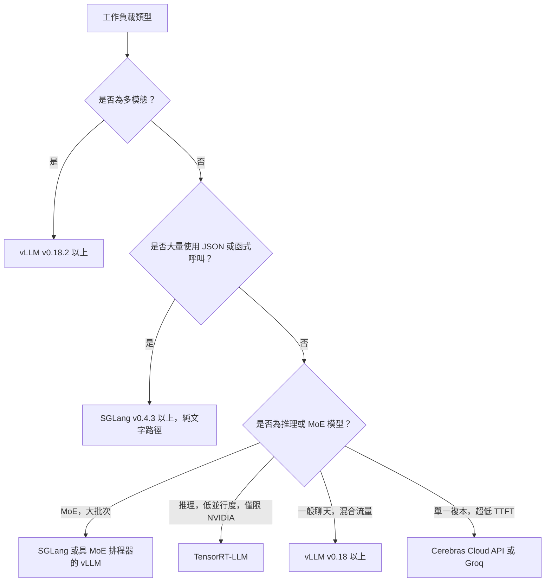

# 服務基礎設施

要大規模部署 LLM，需要一個健全的基礎設施層來處理負載平衡、模型平行化與多租戶隔離。焦點已經從「服務單一模型」轉移到「編排一支推論機隊」。

## 目錄

- [推論閘道](#inference-gateway)
- [模型平行化（張量 vs. 管線）](#parallelism)
- [多 GPU 編排](#multi-gpu)
- [串流與長連線](#streaming)
- [2026 年 5 月推論引擎全景](#may-2026-inference-engine-landscape)
- [面試問題](#interview-questions)
- [參考資料](#references)

---

## 推論閘道

閘道是你 AI 工作負載的「交通管制員」。

| 元件 | 職責 |
|-----------|---------------------------|
| **驗證與速率限制** | 以 token 為基礎的配額以及租戶隔離。 |
| **模型路由器** | 將請求導向特定模型版本（Canary / A-B）。 |
| **上下文追蹤器** | 確保使用者的提示快取被送往同一個 GPU 節點（黏性工作階段）。 |
| **輸出過濾器** | 對串流回應進行即時安全檢查與 PII 清除。 |

---

## 模型平行化

對於無法放進單一 GPU 的模型（例如 Llama 4 405B 需要約 800GB VRAM），我們必須將其切分。

### 1. 張量平行化（Tensor Parallelism, TP）
將單一層／張量切分到多個 GPU 上。
- **延遲**：低（最快）。
- **通訊**：高（需要 NVLink）。
- **標準**：用於單一節點內（8x GPU）90% 的生產環境服務。

### 2. 管線平行化（Pipeline Parallelism, PP）
將不同的層切分（例如第 1-40 層放在 GPU 1，第 41-80 層放在 GPU 2）。
- **延遲**：高（微批次處理的額外開銷）。
- **效率**：使用率較低（氣泡時間）。
- **標準**：僅用於跨多個節點的超大型模型。

---

## 多 GPU 編排

Kubernetes operator（例如 **Kube-Ray** 或 **Gloo**）在生產環境中管理「GPU 資源池」。

- **異質叢集**：在同一個叢集中混用 H100（用於前沿模型）與 L4（用於小型模型）。
- **自動擴展**：根據 **KV cache 使用率**來擴展，而非根據 CPU 或標準記憶體用量。
- **冷啟動**：使用**未量化的基礎映像檔**，並從高速的 Lustre／掛載點載入權重，將啟動時間從數分鐘縮短到 15-20 秒。

---

## 串流與長連線

LLM 幾乎總是透過 **Server-Sent Events（SSE）** 或 **WebSockets** 來提供服務。

**基礎設施挑戰**：標準的負載平衡器（第 4 層）難以應付長時間存在的 AI 連線。
- **解法**：使用能理解「序列結束」token 的**第 7 層負載平衡器**（Envoy／Istio），它可以在使用者的*多次對話輪次之間*重新平衡流量，而不只是在連線層級進行平衡。

---

## 2026 年 5 月推論引擎全景

到了 2026 年 5 月，引擎的選擇不再是「哪一個最快」的問題。每個領先的引擎都贏下了某個特定的工作負載類別，正確的做法是「依工作負載選引擎」，而非統一採用單一的自家引擎。下面這張地圖是各團隊實際在用的實務版本。

### vLLM v0.18+：預設的開源引擎

[vLLM](https://docs.vllm.ai/) 在 2026 年第一季達到 **v0.18**，並一路發布修訂版本到 5 月。這段期間落地的功能：

- 樹內（in tree）支援 **Blackwell Ultra（B300）**，包含 FP4 與動態稀疏性（[vLLM v0.18 發行說明](https://github.com/vllm-project/vllm/releases)）。
- **PagedAttention v3** 搭配 NUMA 感知的記憶體配置；在多插槽（multi-socket）主機上帶來顯著的尾端延遲改善。
- **解耦的 prefill / decode**（藏在一個設定旗標後面），主要用於超長上下文的工作負載。
- 針對 Llama 4 Maverick、DeepSeek V4 Pro、Mixtral 8x22B 的 **MoE 排程器**，具備專家駐留感知（expert-residency-aware）的批次處理能力。

**重要安全提醒**：vLLM 修補了一個高嚴重性的**多模態 RCE**（[GHSA 於 2026 年 2 月發布](https://github.com/vllm-project/vllm/security/advisories)），該漏洞影響 v0.18.2 之前版本的多模態前處理器。**所有多模態 vLLM 部署都必須執行 v0.18.2 或更新版本。** 修補本身只是一行程式碼，但這個 CVE 是真實存在且可透過精心製作的影像輸入加以利用的。請升級。

當工作負載屬於「在連續批次處理之下執行 Llama / Mistral / Qwen / DeepSeek」時，vLLM 仍是預設的開源引擎。它不一定是最快的，但它最容易維運、測試最完整，也最有可能在新漏洞出現的同一週就收到修補。

### SGLang v0.4.3+：吞吐量領先者，但有重要的注意事項

[SGLang](https://github.com/sgl-project/sglang) v0.4.3（2026 年 4 月）在數種工作負載上是吞吐量的領先者：

- 在已發布的基準測試中，於結構化輸出／函式呼叫（function-calling）工作負載上，**吞吐量比 vLLM 高出約 29%**（[SGLang 部落格，2026 年 4 月](https://lmsys.org/blog/2024-12-04-sglang-v0-4/)）。這個優勢來自**非同步受限解碼（async constrained decoding）**，其中約束條件的編譯與 LLM 的前向傳遞並行執行。
- 同類最佳的 **RadixAttention** 前綴快取重用，適用於聊天類工作負載。
- 一流的 **MoE 服務**，具備專家路由感知（expert-routing-aware）的批次處理能力。

**截至 2026 年 5 月的關鍵安全注意事項**：SGLang 在**多模態與解耦 prefill 的程式碼路徑中存在尚未修補的 RCE**（[SGLang 安全公告，2026 年 3 月](https://github.com/sgl-project/sglang/security/advisories)）。純文字路徑是安全的，也是每一份公開基準測試所使用的路徑。在修補程式落地之前，多模態路徑應被視為**尚未達到生產環境就緒狀態**。已有數個大型部署將其多模態流量從 SGLang 移回 vLLM v0.18.2，並保留 SGLang 來處理純文字的函式呼叫工作負載。

2026 年 5 月的正確姿態：在吞吐量優勢有意義的**純文字函式呼叫與結構化輸出工作負載**上使用 SGLang；在 CVE 修補之前，不要將 SGLang 用於**多模態或解耦 prefill 的生產環境流量**。

### TensorRT-LLM：NVIDIA 巔峰吞吐量，代價是維運成本

[TensorRT-LLM](https://github.com/NVIDIA/TensorRT-LLM) 在純 NVIDIA 硬體上仍是吞吐量的領先者：

- 對於手動調校過的模型，在 H200、B200 與 B300 上有**最高的每秒每美元 token 數（tokens/sec/$）**。
- 與 **NVIDIA Triton**（用於服務）以及 **NVIDIA NIM**（用於受管部署）緊密整合。
- 針對 **Blackwell Ultra 上的 FP4 / FP8** 提供自訂核心（kernel），通常領先開源引擎數個月。

代價在於維運：

- 每個新模型都需要一次**引擎建置**（一個耗時數小時的編譯步驟，且與特定模型和 GPU 綁定）。
- 必須鎖定（pin）特定的 TensorRT 與 CUDA 版本；升級通常很痛苦。
- **僅限 NVIDIA**。若不進行完整的重新平台化，就沒有脫離 CUDA 的路徑。

這個決策是二元的：如果你接下來兩年都打算投入 NVIDIA，而且有一兩個旗艦模型需要榨出每一分的 token/sec，那麼 TensorRT-LLM 是划算的。如果你需要引擎彈性、供應商獨立性，或快速的模型迭代，那麼 vLLM 或 SGLang 會是更好的選擇。

### MoE 感知的服務（Llama 4 Maverick、DeepSeek V4 Pro）

MoE 模型打破了「服務成本隨批次大小平滑擴展」這個假設。在 2026 年 5 月，對一個 MoE 服務引擎而言重要的特性包括：

- **專家權重駐留**：一個 4000 億參數的 MoE，每個 token 只有 170 億參數啟用，卻把大部分 VRAM 浪費在讓未使用的專家保持熱狀態。引擎必須察覺專家對 token 的路由關係，並且要嘛固定（pin）熱門專家，要嘛串流載入冷門專家。
- **專家路由延遲**：路由器的決策是**逐 token**發生的，並且增加了一筆可量測的成本。引擎現在會跨批次維度（batch dimension）將路由決策一起批次處理。
- **非單調的批次處理曲線**：將請求加入批次反而可能*降低*吞吐量，如果這迫使一組更冷門的專家被啟用的話。最佳批次大小取決於批次中**路由模式的分布**，而非只是批次的數量。
- **管線感知排程**：最好的引擎會把新請求排入與進行中批次共享專家啟用狀態的批次裡。

| 引擎 | Llama 4 Maverick（2026 年 5 月） | DeepSeek V4 Pro（2026 年 5 月） |
|--------|-----------------------------|-----------------------------|
| vLLM v0.18+ | 穩定，MoE 排程器已在樹內 | 穩定 |
| SGLang v0.4.3+ | 穩定，批次 >32 時的吞吐量領先者 | 穩定 |
| TensorRT-LLM | 穩定，低並行度下的吞吐量領先者 | 穩定 |

可用於面試的洞見：**MoE 服務已經不再是「裝著更大權重的 vLLM」。** 它是一個不同的排程問題，而各家引擎都在過去 12 個月內發展出專屬的 MoE 路徑。

### 決策框架：依工作負載選引擎

針對各團隊實際部署的工作負載，這裡有一份更明確的對照：

| 工作負載 | 引擎選擇（2026 年 5 月） | 原因 |
|----------|---------------------------|-----|
| 公開聊天機器人（混合流量，必須能快速修補） | **vLLM v0.18.2+** | 最容易維運，安全更新節奏最佳 |
| JSON 函式呼叫後端 | **SGLang v0.4.3+**（純文字路徑） | 結構化輸出吞吐量提升約 29% |
| 對延遲極度敏感的單一模型（一個模型、一個團隊） | B300 上的 **TensorRT-LLM** | NVIDIA 巔峰吞吐量，在單一模型情境下值得付出維運成本 |
| 多模態（輸入影像、音訊、影片） | **vLLM v0.18.2+** | SGLang 多模態尚未修補 |
| 推理模型（長思維鏈、低並行度） | 具解耦 prefill 的 **TensorRT-LLM** 或 **vLLM** | 受限於 decode，可從自訂核心獲益 |
| MoE 模型（Llama 4 Maverick、DeepSeek V4 Pro） | 具 MoE 排程器的 **vLLM v0.18+** 或 **SGLang v0.4.3+** | 兩者現在都有一流的 MoE 路徑 |
| 單一複本、低於 50ms 的 TTFT | **Cerebras Cloud API** 或 **Groq LPU** | 在 70B+ 模型上，GPU 無法達到這個水準 |

### 2026 年 5 月的維運姿態

- **永遠保持在已修補的版本上。** 推論引擎現在的 CVE 更新節奏已可與網頁伺服器相提並論。多模態 RCE 並非理論上的威脅。
- **在第二個引擎上跑一個 canary。** 生產流量跑在 vLLM 上，1-5% 的 canary 流量跑在 SGLang 或 TensorRT-LLM 上，並對品質或延遲的偏離發出警報。這能抓到引擎特有的錯誤，並提供更快的遷移路徑。
- **把引擎當成部署清單（deployment manifest）的一部分。** 一個模型不是「Llama 4 Maverick」，而是「在這個硬體上、用這套批次設定、跑在 vLLM v0.18.3 上的 Llama 4 Maverick」。這四項全都要鎖定。
- **關注安全公告的訊息來源**，而不只是發行說明：[vLLM 公告](https://github.com/vllm-project/vllm/security/advisories)、[SGLang 公告](https://github.com/sgl-project/sglang/security/advisories)、[TensorRT-LLM CVE 清單](https://nvd.nist.gov/vuln/search/results?form_type=Basic&search_type=all&query=tensorrt-llm)。

---

## 面試問題

### 問：為何在低延遲服務中，張量平行化比管線平行化更受青睞？

**有力的回答：**
張量平行化（TP）會將單一層的矩陣乘法同時分散到多個 GPU 上執行。這代表該層的延遲會被 GPU 的數量除以。相對地，管線平行化（PP）則是依序處理不同的層。當 GPU 2 在處理第 40-80 層時，GPU 1 是閒置的，除非你有一條由多個請求組成的深層管線（批次處理）。對於單一使用者的請求，PP 會把所有 GPU 的延遲相加起來，而 TP 則是把延遲分攤到所有 GPU 上。

### 問：在多租戶的 LLM 叢集中，你如何處理「吵鬧的鄰居（Noisy Neighbors）」？

**有力的回答：**
我們透過**分層的迭代層級排程（Tiered Iteration-Level Scheduling）**來處理吵鬧的鄰居。每個租戶被分配到總 GPU 週期中的一份「額度」。在連續批次處理的迴圈中，排程器會確保單一租戶不會佔用 100% 的 KV cache 槽位。如果租戶 A 正在壓垮系統，排程器會優先處理租戶 B 與 C 的「Prefill」步驟，或在每個週期中只處理租戶 A 的一部分 decode 迭代。這在閘道層透過 token 桶（token-bucket）速率限制來強制執行，並在服務引擎層透過特定的排程政策來落實。

---

## 參考資料
- Narayanan et al. "Efficient Large-Scale Language Model Training on GPU Clusters Using Pipedream" (2019/2021)
- NVIDIA. "Megatron-LM: Training Multi-Billion Parameter Models on GPU Clusters" (2021)

---

*下一篇：[成本優化實戰手冊](07-cost-optimization-playbook.md)*
