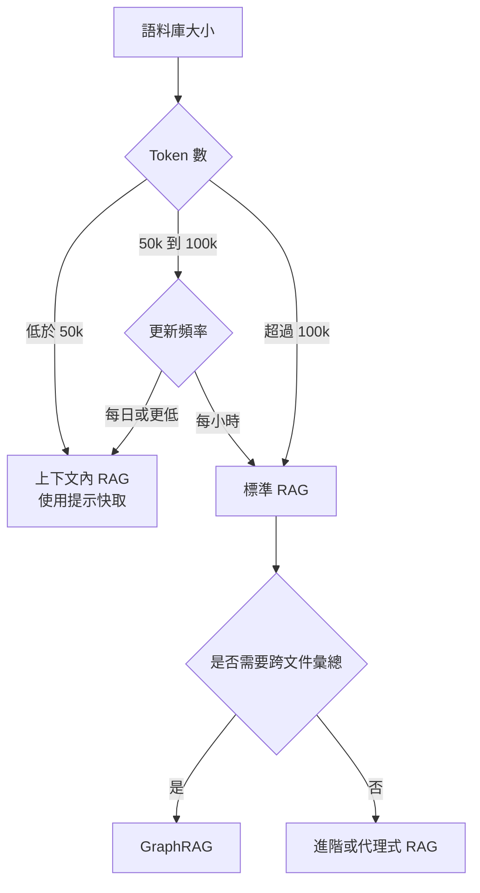

# RAG 基礎

RAG 如何從單純的向量搜尋演進到代理式與基於圖的檢索。何時該選擇 RAG 而非長上下文，以及造成生產環境失敗的三個檢索缺口。

檢索增強生成（Retrieval-Augmented Generation, RAG）是一種架構模式，為 LLM 提供外部、可驗證的上下文，以接地（grounding）其回應。它已從「簡單的向量搜尋」演進為多階段推理管線：混合檢索、重排序、上下文分塊與代理式迴圈，如今都已是生產環境的基本配備。更深入的內容請見 [分塊策略](02-chunking-strategies.md)、[向量資料庫](04-vector-databases.md)、[重排序](06-reranking-strategies.md)、[上下文檢索](10-contextual-retrieval.md)、[ColBERT 後期互動](11-late-interaction-colbert.md)，以及 [GraphRAG 重新框定](07-graph-rag.md)。

## 目錄

- [核心理念：接地 vs. 訓練](#philosophy)
- [RAG 分類](#taxonomy)
- [RAG vs. 2M 上下文（混合時代）](#rag-vs-long-context)
- [檢索品質缺口](#quality-gap)
- [面試問題](#interview-questions)
- [參考資料](#references)

---

## 核心理念：接地 vs. 訓練

| 面向 | 微調 | RAG |
|--------|-------------|-----|
| **知識類型** | 內化（權重） | 外化（上下文） |
| **更新週期** | 高成本（重新訓練） | 零成本（更新資料庫） |
| **歸因** | 無（黑箱） | 明確（引用） |
| **隱私** | 難以「遺忘」 | 易於過濾／刪除 |

**經驗法則**：微調是為了**形式**（風格、語氣、語法）；RAG 是為了**事實**（知識、資料、接地）。

---

## RAG 分類

生產環境的 RAG 系統依其「代理深度」分類：

### 1. 單純 RAG（先檢索再生成）
- **流程**：使用者查詢 -> 向量搜尋 -> Top-K -> LLM。
- **狀態**：因「檢索缺口」與低精確度，已不建議用於生產環境。

### 2. 進階 RAG（多階段）
- **流程**：查詢轉換 -> 混合搜尋 -> 重排序 -> LLM。
- **關鍵細節**：使用 **RRF（Reciprocal Rank Fusion，倒數排名融合）** 來結合關鍵字與語意結果。

### 3. 代理式 RAG（基於迴圈）
- **流程**：代理分析查詢 -> 決定要搜尋哪些工具／索引 -> 評估結果 -> 若資訊缺失則重新檢索。
- **技術**：Self-RAG、Corrective RAG（CRAG）。

### 4. GraphRAG（結構化上下文）
- **流程**：抽取實體／關係 -> 建立知識圖 -> 遍歷圖以找出「相連的知識」。
- **優勢**：解決「彙總型問題」（例如「彙總 50 份文件中所有的法律風險」）。

依代理深度區分的四種變體：

```mermaid
flowchart TD
    A[使用者查詢] --> B{RAG 變體}
    B -->|單純| C[向量搜尋]
    C --> CG[LLM 生成]
    B -->|進階| D[查詢改寫]
    D --> E[混合搜尋]
    E --> F[重排序]
    F --> FG[LLM 生成]
    B -->|代理式| G[代理分析查詢]
    G --> H[挑選索引或工具]
    H --> I[檢索]
    I --> J{是否足夠}
    J -->|否| G
    J -->|是| JG[LLM 生成]
    B -->|GraphRAG| K[抽取實體]
    K --> L[遍歷知識圖]
    L --> LG[LLM 生成]
```

---

## RAG vs. 2M 上下文（「混合時代」）

隨著上下文視窗的出現，例如 Gemini 1.5 Pro（2M+）與 Claude Sonnet 4.6（1M+），RAG 正在改變。

- **上下文內 RAG（In-Context RAG, ICR）**：對於小於 50k token 的資料集，我們跳過向量資料庫，把所有內容都放進提示裡。
- **提示快取（Prompt Caching）**：透過在 GPU 上快取「背景知識」，讓長上下文 RAG 便宜 90%。

**架構決策**：
- 如果你的語料庫大於 100k token 且是動態的：使用**標準 RAG**。
- 如果你的語料庫小於 100k token：使用**上下文內 RAG**。

在標準 RAG 與上下文內 RAG 之間做選擇的決策樹：

---

## 檢索品質缺口

「檢索缺口」是 RAG 失敗的頭號原因。
- **缺口 1：語意不匹配**：查詢說「快車」，資料庫裡是「Porsche 911」。由**嵌入重排序器**解決。
- **缺口 2：缺少上下文**：相關資訊就在資料庫裡，但檢索器漏掉了。由**混合搜尋**解決。
- **缺口 3：迷失在中間（Lost-in-the-Middle）**：資訊在提示裡，但 LLM 漏看了。由**上下文壓縮**解決。

---

## 面試問題

### Q：既然前沿模型已推出 1M 至 2M token 的上下文，為什麼還要使用 RAG？

**有力的回答：**
理由分為三個層次：
1. **成本與延遲**：即使有提示快取，為每個新的使用者查詢重新讀取 2M token，仍然遠比檢索 5 個相關區塊（約 2k token）昂貴許多，且 TTFT（Time to First Token，首個 token 時間）更高。
2. **時效性**：RAG 能存取即時 API（股價、新聞），這些無法被靜態地嵌入到上下文視窗中。
3. **規模**：企業資料集（SharePoint、TB 級日誌）甚至超過 2M token。RAG 扮演「過濾器」的角色，找出*應該*進入這個高價值上下文視窗的那 0.01% 相關資料。

### Q：什麼是「代理式 RAG」，它和「進階 RAG」有何不同？

**有力的回答：**
進階 RAG 是一條**確定性管線**（線性：改寫 -> 搜尋 -> 重排序）。代理式 RAG 則是一個**隨機迴圈**。在代理式 RAG 中，模型被賦予工具來決定*如何*檢索。舉例來說，如果代理發現檢索到的文件不相關，它可以決定改用「搜尋 Google」或「查詢 SQL 資料庫」。它本質上在檢索前後各加入一個「推理步驟」，以確保上下文足以回答提示。

---

## 重點整理

- 單純 RAG（向量搜尋 + top-K + LLM）已不建議用於生產環境；請把進階 RAG（混合 + RRF + 重排序）作為新的基準線來上線。
- 長上下文視窗並未終結 RAG：成本、延遲、時效性與語料庫規模，都會把你推回檢索，即使在 2M 上下文之下也是如此。
- 依語料庫大小選擇：低於 50k token 就用上下文內並搭配提示快取；超過 100k 就用標準 RAG；彙總型問題就用 GraphRAG。
- 多數 RAG 失敗是檢索失敗，而非生成失敗；在調整提示之前，先診斷這三個缺口（語意、缺少上下文、迷失在中間）。
- 代理式 RAG vs. 進階 RAG 是隨機迴圈與確定性管線之間的選擇；只有在查詢模式過於多變、固定管線無法應付時，才採用代理式。

---

## 參考資料
- Gao et al. "Retrieval-Augmented Generation for LLMs: A Survey"（2024 更新版）
- Microsoft. "From RAG to GraphRAG"（2024）
- Google. "Long-context LLMs as Retrievers"（2025）
- [Anthropic. "Introducing Contextual Retrieval"（2024 年 9 月）](https://www.anthropic.com/news/contextual-retrieval)

---

*下一篇：[分塊策略](02-chunking-strategies.md)*
