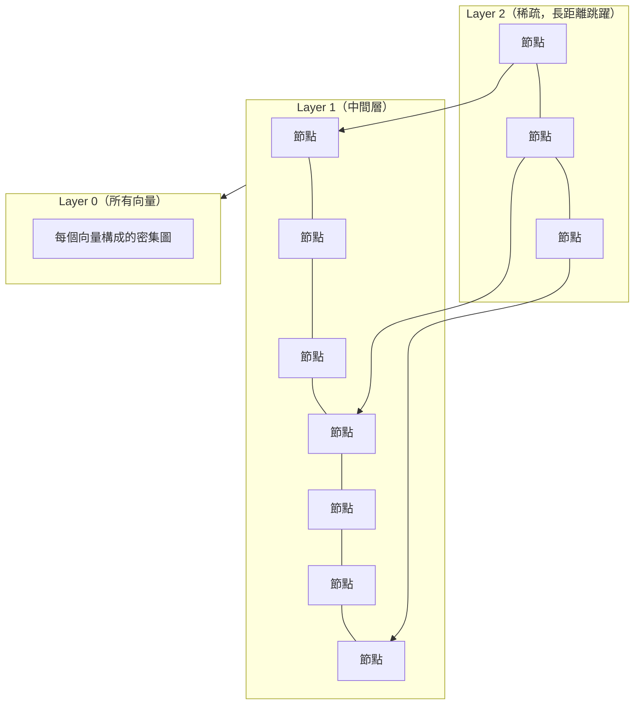
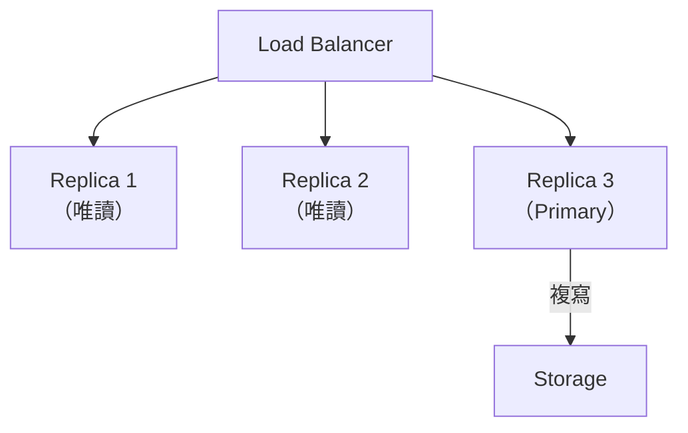
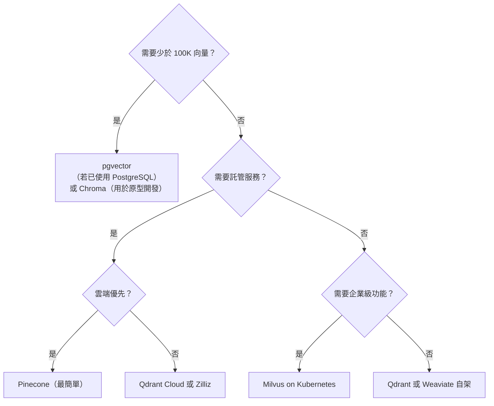

# 向量資料庫

向量資料庫是專為儲存、索引與搜尋高維度嵌入而打造的系統。市場已分裂為**託管無伺服器（Managed Serverless）**與**專用高效能（Specialized High-Performance）**兩類引擎。我們不再問「它支援向量搜尋嗎？」（Postgres、Redis 與 Mongo 全都支援）。我們問的是**「它能否擴展到 1 億以上的向量，並維持低於 100ms 的 P99 與完整的元資料過濾？」**

## 目錄

- [什麼是向量資料庫](#what-is-a-vector-database)
- [向量搜尋基礎](#vector-search-fundamentals)
- [索引演算法](#indexing-algorithms)
- [競爭格局](#competitive-landscape)
- [資料庫詳細比較](#detailed-database-comparison)
- [元資料過濾](#metadata-filtering)
- [查詢模式](#query-patterns)
- [生產環境營運](#production-operations)
- [託管 vs 自架（TCO 分析）](#managed-vs-self-hosted-tco-analysis)
- [選型框架](#selection-framework)
- [面試問題](#interview-questions)
- [參考資料](#references)

---

## 什麼是向量資料庫

向量資料庫儲存嵌入（密集向量），並能對其進行快速的相似度搜尋。

```
Traditional DB:      SELECT * FROM docs WHERE category = 'tech'
Vector DB:           SELECT * FROM docs ORDER BY similarity(embedding, query_embedding) LIMIT 10
```

### 核心能力

| 能力 | 用途 |
|------------|---------|
| 向量儲存 | 持久化保存高維度嵌入 |
| 相似度搜尋 | 快速找出最近鄰 |
| 元資料過濾 | 結合向量搜尋與屬性過濾 |
| CRUD 操作 | 隨資料變化更新嵌入 |
| 擴展 | 處理數百萬到數十億的向量 |

### 為什麼不用通用資料庫？

傳統資料庫雖能儲存向量，但缺乏最佳化的搜尋：

| 做法 | 搜尋複雜度 | 規模實用性 |
|----------|-------------------|-------------------|
| 暴力法（PostgreSQL pgvector） | O(n * d) | 在約 100 萬向量內可行 |
| ANN 索引（專用向量資料庫） | O(log n) 或 O(1) | 可行，數十億 |

---

## 向量搜尋基礎

### 精確搜尋 vs 近似搜尋

**精確（暴力法）：**
- 將查詢與每個已儲存的向量比較
- 每次查詢 O(n * d)
- 完美的準確度

**近似最近鄰（ANN）：**
- 使用索引結構來剪枝搜尋空間
- 次線性複雜度
- 召回率略低（通常為 95-99%）

### 距離度量

| 度量 | 公式 | 範圍 | 最適用於 |
|--------|---------|-------|----------|
| 餘弦（Cosine） | 1 - (a . b) / (norm(a) * norm(b)) | [0, 2] | 文字嵌入 |
| 歐幾里得（L2） | sqrt(sum((a - b)^2)) | [0, inf) | 影像嵌入 |
| 點積（Dot product） | a . b | (-inf, inf) | 已正規化 |

**對於文字嵌入：**使用餘弦相似度（若已預先正規化則用點積）。

### 召回率 vs 延遲的權衡

```scatter
{
  "xLabel": "延遲（ms，對數）", "yLabel": "召回率（%）", "xScale": "log", "yDomain": [90, 101],
  "note": "近似最近鄰以召回率換取延遲。",
  "points": [
    {"x": 1, "y": 95, "label": "Fast ANN"},
    {"x": 5, "y": 99, "label": "Well-tuned ANN"},
    {"x": 50, "y": 100, "label": "Brute force"}
  ]
}
```

ANN 索引以部分準確度換取速度。請依你的需求進行調校。

---

## 索引演算法

### HNSW（Hierarchical Navigable Small World，階層式可導航小世界）

生產環境**記憶體內**向量搜尋最熱門的演算法。

**運作方式：**
1. 建立一個以向量為節點的圖
2. 連接到鄰近的最近鄰
3. 多層抽象（階層式）
4. 搜尋：從頂層往下導航，貪婪式最近鄰



**優點：**
- 出色的召回率/延遲權衡
- 不需要訓練
- 原生支援更新

**缺點：**
- 記憶體密集（圖結構）
- 索引大小：約為向量資料的 1.5-2 倍
- 1000 萬個 1536 維的向量需要約 80GB 的 RAM

**關鍵參數：**
- `M`：每個節點的最大連接數（16-64）
- `ef_construction`：建構時的探索程度（100-500）
- `ef_search`：查詢時的探索程度（50-200）

### DiskANN（以 SSD 為基礎）

**PB 級（petabyte-scale）**搜尋的業界標準。

**運作方式：**
- 將圖保存在 SSD（NVMe）上，RAM 中只保留極小的索引
- 使用 Vamana 演算法進行高效的磁碟式圖遍歷

**優點：**
- 在數十億規模的資料集上，比 HNSW 便宜 10 倍，且延遲懲罰低於 5ms
- 相較於 HNSW，RAM 需求降低 90-95%

**缺點：**
- 延遲略高於純記憶體內的 HNSW
- 最適合非即時的搜尋應用

**範例：**一個 1 億向量、1536 維的索引，用 HNSW 將需要近 1TB 的 RAM。改用 DiskANN，RAM 需求可降低 90-95%，同時維持低於 10ms 的查詢時間。

### IVF（Inverted File Index，倒排檔索引）

將向量分割成多個叢集，只搜尋相關的叢集。

**運作方式：**
1. 使用 k-means 建立質心
2. 將每個向量指派到最近的質心
3. 查詢時：找出最近的質心，搜尋那些叢集

**優點：**
- 記憶體用量低於 HNSW
- 可使用量化（IVF-PQ）

**缺點：**
- 需要訓練
- 更新需要重新分群或採用混合做法

**關鍵參數：**
- `nlist`：叢集數量（經驗法則為 sqrt(n)）
- `nprobe`：查詢時要搜尋的叢集數

### 乘積量化（Product Quantization，PQ）

壓縮向量以降低記憶體用量並加速比較。

**運作方式：**
1. 將向量切分為子向量
2. 將每個子向量量化到一個碼本（codebook）
3. 儲存碼（codes）而非完整向量

**記憶體降幅：**通常為 4-32 倍

**權衡：**因量化損失而導致準確度較低

### Flat 索引（暴力法）

不做近似，精確搜尋。

**適用時機：**
- 少於 10 萬個向量
- 準確度至關重要
- 延遲預算寬裕

### 演算法比較

| 演算法 | 記憶體 | 建構時間 | 查詢速度 | 召回率 | 更新 |
|-----------|--------|------------|-------------|--------|---------|
| HNSW | 高 | 中 | 非常快 | 95-99% | 良好 |
| DiskANN | 低（SSD） | 中 | 快 | 95-99% | 尚可 |
| IVF | 中 | 快 | 快 | 90-98% | 尚可 |
| IVF-PQ | 低 | 快 | 快 | 85-95% | 尚可 |
| Flat | 低 | 無 | 慢 | 100% | 即時 |

---

## 競爭格局

### 向量原生（專用）

| 資料庫 | 類型 | 最適用於 | 定價模式 |
|----------|------|----------|---------------|
| **Pinecone** | 託管雲端（無伺服器標準） | 易於起步、擴展、託管 SLA | 每向量小時 |
| **Qdrant** | 開源 / 雲端（Rust，高效能） | 自架控制權、在常見工作負載上是最快的開源方案（1000 萬向量下約 12ms p99） | 每 GB（雲端）或免費 |
| **Weaviate** | 開源 / 雲端 | 單一查詢中的原生混合搜尋（BM25 + 密集 + 元資料）、多模態 | 每維度小時 |
| **Milvus** | 開源 / 雲端（Zilliz） | 分散式規模（5000 萬以上向量）、異質節點類型、分層儲存 | 免費（自架）或 Zilliz Cloud |
| **Chroma** | 開源 | 原型開發、本地開發、嵌入式使用 | 免費 |

### 通用型（外掛/擴充）

| 資料庫 | 類型 | 最適用於 | 定價模式 |
|----------|------|----------|---------------|
| **pgvector（v0.8+）** | PostgreSQL 擴充 | 小規模、既有的 PG（現已支援 HNSW + IVFFlat） | 僅運算 |
| **Elasticsearch（v9.0）** | 搜尋引擎 | 採用交叉熵融合的混合搜尋 | 以授權為基礎 |

---

## 資料庫詳細比較

### 功能矩陣

| 功能 | Pinecone | Qdrant | Weaviate | Milvus | pgvector |
|---------|----------|--------|----------|--------|----------|
| **語言** | 專有 | Rust | Go | Go/C++ | C |
| 託管選項 | 是 | 是 | 是 | 是（Zilliz） | 透過雲端 PG |
| 自架 | 否 | 是 | 是 | 是 | 是 |
| **無伺服器** | 是（最佳） | 是 | 是 | 是（Zilliz） | 否 |
| **雲端原生** | 任意 | 任意 | 任意 | 僅 K8s | 任意 |
| 元資料過濾 | 良好 | 出色 | 良好 | 良好 | 透過 SQL |
| **混合搜尋** | 原生 | 原生 | 原生 | 原生 | 多階段（有限） |
| 最大向量數 | 數十億 | 數十億 | 數十億 | 數十億 | 約 1000 萬 |
| HNSW 索引 | 是 | 是 | 是 | 是 | 是 |

---

## 元資料過濾

對於多租戶與過濾用例至關重要。

```python
# Pinecone
results = index.query(
    vector=query_embedding,
    top_k=10,
    filter={"tenant_id": "123", "category": {"$in": ["tech", "science"]}}
)

# Qdrant
results = client.search(
    collection_name="documents",
    query_vector=query_embedding,
    limit=10,
    query_filter=Filter(
        must=[
            FieldCondition(key="tenant_id", match=MatchValue(value="123")),
            FieldCondition(key="category", match=MatchAny(any=["tech", "science"]))
        ]
    )
)
```

**效能影響：**過濾發生在搜尋過程中，而非搜尋之後。預先過濾的索引較快，但較不靈活。

**為何元資料過濾常成為瓶頸：**在原始的向量搜尋中，我們先找出「Top K」最近鄰，然後才依元資料過濾。如果過濾條件非常嚴格，過濾後可能會得到 0 筆結果。專用資料庫現在採用**搭配 HNSW 的預先過濾（Pre-Filtering）**，在遍歷圖時只考慮滿足布林元資料約束的節點。這需要專用的位元遮罩（bitmask）或硬體加速（SIMD）來維持低延遲。

**磁碟原生元資料：**像 **Qdrant** 這樣的現代資料庫會將元資料卸載到磁碟映射的區段，使得複雜的過濾（例如全文 + 地理位置 + 向量）得以進行，而不會耗盡 RAM。

---

## 查詢模式

### 模式 1：簡單語意搜尋

```python
def semantic_search(query: str, top_k: int = 5) -> list[Document]:
    query_embedding = embed(query)
    results = vector_db.search(query_embedding, top_k=top_k)
    return [Document(id=r.id, text=r.payload["text"], score=r.score) for r in results]
```

### 模式 2：過濾搜尋

```python
def filtered_search(query: str, filters: dict, top_k: int = 5) -> list[Document]:
    query_embedding = embed(query)
    results = vector_db.search(
        query_embedding,
        top_k=top_k,
        filter=filters  # {"tenant_id": "abc", "created_after": "2025-01-01"}
    )
    return results
```

### 模式 3：混合搜尋（密集 + 稀疏）

```python
def hybrid_search(query: str, alpha: float = 0.5, top_k: int = 5) -> list[Document]:
    # Dense (semantic)
    dense_embedding = embed(query)
    dense_results = vector_db.search(dense_embedding, top_k=top_k * 2)

    # Sparse (keyword)
    sparse_results = bm25_search(query, top_k=top_k * 2)

    # Combine with reciprocal rank fusion
    combined = reciprocal_rank_fusion(
        [dense_results, sparse_results],
        weights=[alpha, 1 - alpha]
    )

    return combined[:top_k]
```

部分資料庫（Weaviate、Qdrant、Pinecone）原生支援混合搜尋：

```python
# Weaviate native hybrid
results = client.query.get("Document", ["text"]).with_hybrid(
    query=query,
    alpha=0.5  # 0 = BM25 only, 1 = vector only
).with_limit(5).do()
```

### 模式 4：多向量查詢

用於父子或多面向的檢索：

```python
def multi_vector_search(queries: list[str], top_k: int = 5) -> list[Document]:
    all_results = []

    for query in queries:
        embedding = embed(query)
        results = vector_db.search(embedding, top_k=top_k)
        all_results.extend(results)

    # Dedupe and rerank
    unique = dedupe_by_id(all_results)
    reranked = rerank(queries[0], unique)  # Use primary query for reranking

    return reranked[:top_k]
```

---

## 生產環境營運

### 容量規劃

```python
def estimate_resources(
    num_vectors: int,
    dimensions: int,
    metadata_size_bytes: int = 500
) -> dict:
    # Vector storage
    vector_size = dimensions * 4  # float32
    total_vector_storage = num_vectors * vector_size

    # Index overhead (HNSW ~1.5x)
    index_overhead = total_vector_storage * 1.5

    # Metadata
    metadata_storage = num_vectors * metadata_size_bytes

    # Total
    total_gb = (total_vector_storage + index_overhead + metadata_storage) / 1e9

    # QPS estimate (rough)
    qps_per_gb = 50  # depends heavily on config
    estimated_qps = total_gb * qps_per_gb

    return {
        "storage_gb": total_gb,
        "estimated_qps": estimated_qps,
        "recommended_replicas": max(1, int(total_gb / 50))  # ~50GB per replica
    }
```

### 索引維護

```python
class VectorDBMaintenance:
    def __init__(self, client):
        self.client = client

    def add_documents(self, documents: list[Document]):
        """Upsert documents with batching."""
        batch_size = 100
        for i in range(0, len(documents), batch_size):
            batch = documents[i:i + batch_size]
            embeddings = embed_batch([d.text for d in batch])

            self.client.upsert([
                {
                    "id": doc.id,
                    "vector": embedding,
                    "payload": doc.metadata
                }
                for doc, embedding in zip(batch, embeddings)
            ])

    def delete_documents(self, doc_ids: list[str]):
        """Delete by document ID."""
        self.client.delete(ids=doc_ids)

    def update_metadata(self, doc_id: str, metadata: dict):
        """Update metadata without re-embedding."""
        self.client.set_payload(
            collection_name="documents",
            payload=metadata,
            points=[doc_id]
        )
```

### 高可用性



**關鍵模式：**
- 寫入採用領導者-跟隨者（leader-follower）
- 唯讀副本用於查詢擴展
- 非同步複寫以達成高可用性（HA）

### 監控

```python
VECTOR_DB_METRICS = [
    "query_latency_p50",
    "query_latency_p99",
    "queries_per_second",
    "index_size_gb",
    "vector_count",
    "filter_latency",
    "upsert_latency",
    "cache_hit_rate"
]

def alert_rules():
    return {
        "query_latency_p99_high": {
            "condition": "query_latency_p99 > 500ms",
            "severity": "warning"
        },
        "query_latency_p99_critical": {
            "condition": "query_latency_p99 > 2000ms",
            "severity": "critical"
        },
        "low_recall": {
            "condition": "bench_recall < 0.90",
            "severity": "warning"
        }
    }
```

---

## 託管 vs 自架（TCO 分析）

### 成本比較

| 面向 | Pinecone（無伺服器） | 自架（Qdrant/Milvus） |
|--------|-----------------------|-----------------------------|
| **營運負擔** | 零 | 高（需要 K8s + SRE） |
| **擴展** | 即時（可縮至零） | 手動（節點佈建） |
| **成本（小規模）** | $0 - $100/月 | $50/月（最低實例） |
| **成本（大規模）** | 每 token/向量成本高 | 單位成本低 |

### 託管服務定價（僅供參考，請務必在供應商頁面上確認）

| 供應商 | 模式 | 範例：1000 萬向量、1536 維 |
|----------|-------|--------------------------------|
| Pinecone | 基於 Pod 或無伺服器 | 無伺服器約 $70-150/月 |
| Qdrant Cloud | 每 GB | 約 $50/月（20GB） |
| Weaviate Cloud | 每維度 | 約 $100/月 |
| Zilliz（Milvus） | 每 CU | 約 $75/月 |

### 自架成本

```python
def estimate_self_hosted_cost(
    vectors: int,
    dimensions: int,
    cloud: str = "aws"
) -> dict:
    storage_gb = (vectors * dimensions * 4 * 2.5) / 1e9  # 2.5x for index

    # Instance sizing
    if storage_gb < 50:
        instance = "r6g.large"  # 16 GB RAM, ~$60/month
    elif storage_gb < 200:
        instance = "r6g.xlarge"  # 32 GB RAM, ~$120/month
    else:
        instance = "r6g.2xlarge"  # 64 GB RAM, ~$240/month

    return {
        "storage_gb": storage_gb,
        "instance": instance,
        "monthly_compute": instance_pricing[instance],
        "monthly_storage": storage_gb * 0.10,  # EBS
        "total_monthly": instance_pricing[instance] + storage_gb * 0.10
    }
```

### 決策：託管 vs 自架

| 因素 | 託管 | 自架 |
|--------|---------|-------------|
| 營運負擔 | 低 | 高 |
| 小規模成本 | 較高 | 較低 |
| 大規模成本 | 不定 | 通常較低 |
| 控制權 | 較少 | 完整 |
| 合規性 | 視情況而定 | 完全掌控 |
| 供應商鎖定 | 是 | 否（若為開源） |

**結論**：從無伺服器開始。只有在你擁有超過 5 億向量，或有嚴格的**地端/GPU 本地（On-Prem/GPU-Local）**需求時，才自架。

---

## 選型框架

### 決策樹



### 評估準則

| 準則 | 權重 | 該問的問題 |
|-----------|--------|------------------|
| 規模 | 高 | 現在有多少向量？一年後呢？ |
| 延遲 | 高 | p99 需求是多少？ |
| 營運能量 | 高 | 我們能營運這個系統嗎？ |
| 成本 | 中 | 預算限制？ |
| 功能 | 中 | 混合搜尋？多模態？ |
| 鎖定風險 | 低-中 | 是否偏好開源？ |

### 概念驗證檢查清單

在決定採用某個向量資料庫之前：

- [ ] 載入具代表性的資料量
- [ ] 在目標 QPS 下對查詢延遲做基準測試
- [ ] 測試元資料過濾的效能
- [ ] 驗證更新/刪除的效能
- [ ] 測試故障復原
- [ ] 評估監控與可觀測性
- [ ] 計算總體擁有成本

---

## 面試問題

### Q：你會如何在 Pinecone 與自架方案之間做選擇？

**有力的回答：**
決策取決於數個因素：

**選擇 Pinecone 的時機：**
- 團隊缺乏營運有狀態基礎設施的能量
- 需要快速推進（以天計而非以週計）
- 規模適中（低於 1 億向量）
- 預算允許託管服務的溢價
- 合規性允許依賴雲端供應商

**選擇自架（Qdrant、Milvus）的時機：**
- 擁有 Kubernetes 與營運專業
- 在規模上對成本敏感
- 需要對資料完全掌控
- 有特定的合規需求
- 想避免供應商鎖定

對於多數新創公司，我會先採用 Pinecone 或 Qdrant Cloud 以求速度，之後若成本在規模上變得難以負擔，再評估遷移。由於向量資料庫的 API 相似，切換成本適中。

### Q：請說明 HNSW 如何運作，以及你在什麼情況下不會使用它。

**有力的回答：**
HNSW 建立一個階層式的向量圖：

**運作方式：**
1. 將向量作為節點插入多層圖中
2. 較高的層節點較少、跳躍較大
3. 搜尋：從頂層開始，貪婪地導航至最近鄰
4. 逐層下降直到最底層（所有向量）

**為何它很好：**
- O(log n) 查詢複雜度
- 不需要訓練
- 支援即時更新
- 出色的召回率/延遲權衡

**不該使用的時機：**
- 非常小的資料集（少於 1 萬）：暴力法即可
- 記憶體極度受限：HNSW 為圖使用 1.5-2 倍的向量大小
- 需要精確搜尋：HNSW 是近似的
- 在延遲要求嚴格下有大量更新工作負載：更新可能造成暫時性的效能退化

替代方案：
- IVF-PQ 用於記憶體受限的情況
- DiskANN 用於兼具成本效益的數十億規模
- Flat 索引用於精確搜尋
- LSH 用於非常高維度的稀疏向量

### Q：在什麼情況下，你會選用磁碟式索引（如 DiskANN）而非記憶體式索引（HNSW）？

**有力的回答：**
當索引的記憶體成本超出預算，或超出單一高記憶體節點的容量時，我會選用磁碟式索引。舉例來說，一個 1 億向量、1536 維的索引，用 HNSW 將需要近 1TB 的 RAM。改用 DiskANN，我可以把那 1TB 中的絕大部分儲存在 NVMe SSD 上，將 RAM 需求降低 90-95%，同時維持低於 10ms 的查詢時間。對於非即時的搜尋應用，這代表了巨大的 TCO（總體擁有成本）降幅。

### Q：為什麼元資料過濾常常是向量資料庫的瓶頸？

**有力的回答：**
在原始的向量搜尋中，我們先找出「Top K」最近鄰，然後才依元資料過濾它們（例如「只要 2024 年的文件」）。如果過濾條件非常嚴格，過濾後可能會得到 0 筆結果。專用資料庫現在採用**搭配 HNSW 的預先過濾（Pre-Filtering）**，在遍歷圖時只考慮滿足布林元資料約束的節點。這在計算上很昂貴，因為它破壞了 HNSW 的「短路（short-circuit）」邏輯，需要專用的位元遮罩（bitmask）或硬體加速（SIMD）來維持低延遲。

### Q：你如何在向量資料庫中處理多租戶？

**有力的回答：**
三種主要做法：

**1. 元資料過濾（最常見）：**
```python
results = db.search(
    vector=query,
    filter={"tenant_id": current_tenant}
)
```
- 優點：簡單、單一索引
- 缺點：所有租戶共用資源，可能因錯誤而洩漏資料

**2. 每租戶一個集合（collection）：**
```python
results = db.collection(f"tenant_{tenant_id}").search(vector=query)
```
- 優點：強隔離、可依租戶擴展
- 缺點：集合眾多、營運負擔大

**3. 每租戶一個命名空間（namespace，Pinecone）：**
```python
results = index.query(vector=query, namespace=tenant_id)
```
- 優點：在單一索引內達成隔離
- 缺點：供應商專屬

**我會選擇：**
- 多數情況採用元資料過濾（簡單、具成本效益）
- 高安全需求時採用獨立集合
- 因有洩漏風險，絕不採用後過濾（取回全部，之後再過濾）

---

## 參考資料

- Malkov and Yashunin. "Efficient and robust approximate nearest neighbor search using Hierarchical Navigable Small World graphs" (HNSW, 2018)
- Microsoft Research. "Vamana/DiskANN: A Disk-based Index for ANN Search" (2019/2023)
- Pinecone Documentation: https://docs.pinecone.io/
- Pinecone. "The Managed Architecture of Serverless Vector DBs" (2024)
- Qdrant Documentation: https://qdrant.tech/documentation/
- Weaviate Documentation: https://weaviate.io/developers/weaviate
- Milvus Documentation: https://milvus.io/docs
- pgvector: https://github.com/pgvector/pgvector

---

*上一篇：[嵌入模型](03-embedding-models.md) | 下一篇：[混合搜尋](05-hybrid-search.md)*
