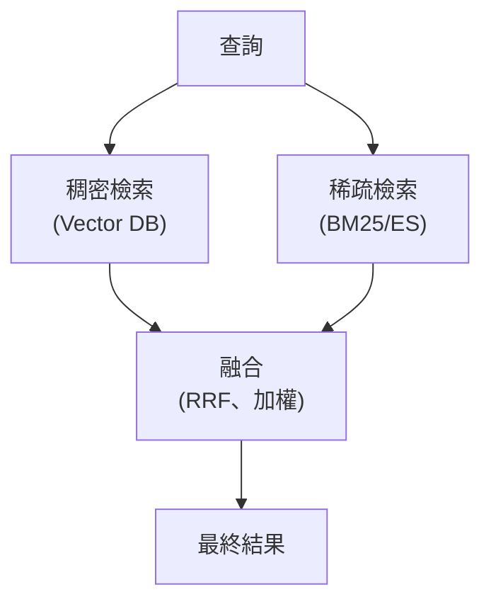
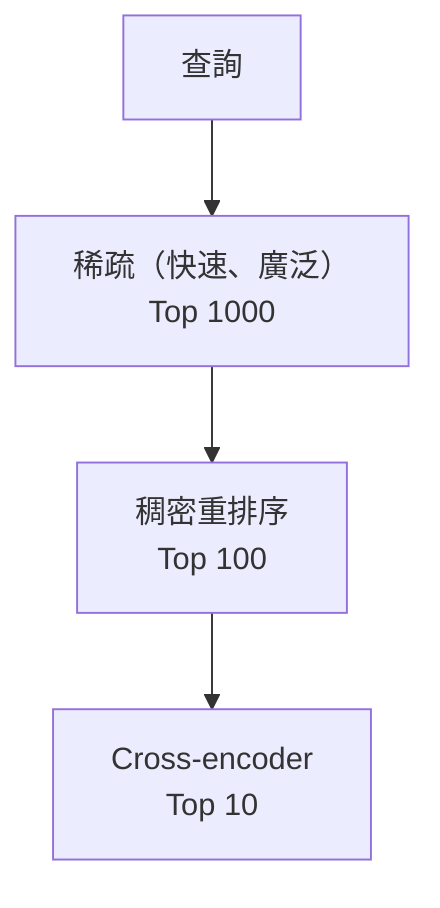

# 混合搜尋

混合搜尋結合了稠密（語意）與稀疏（關鍵字）檢索，以同時獲得兩者的優點。它是生產環境 RAG 的基準做法：Elasticsearch 的 `rrf` retriever、OpenSearch 混合搜尋、Weaviate、Qdrant 與 Azure AI Search 全都內建原生的混合管線，開箱即用。

## 目錄

- [為什麼要用混合搜尋](#why-hybrid-search)
- [稠密 vs 稀疏檢索](#dense-vs-sparse-retrieval)
- [混合搜尋架構](#hybrid-search-architectures)
- [融合方法](#fusion-methods)
- [學習式稀疏嵌入（SPLADE）](#learned-sparse-embeddings-splade)
- [實作模式](#implementation-patterns)
- [調校與最佳化](#tuning-and-optimization)
- [生產環境考量](#production-considerations)
- [面試問題](#interview-questions)
- [參考資料](#references)

---

## 為什麼要用混合搜尋

稠密檢索與稀疏檢索沒有哪一種是全面勝出的。各自在不同的查詢類型上表現出色。

### 查詢類型分析

| 查詢類型 | 範例 | 較佳的檢索方式 |
|------------|---------|------------------|
| 概念性 | 「transformer 是怎麼學習的？」 | 稠密 |
| 特定關鍵字 | 「GPT-4 API rate limits」 | 稀疏 |
| 具名實體 | 「John Smith 關於 BERT 的研究」 | 稀疏 |
| 縮寫／代碼 | 「HTTP 429 是什麼意思？」 | 稀疏 |
| 改寫過的句子 | 「如何讓 AI 更快」 vs 「LLM optimization」 | 稠密 |
| 混合 | 「GPT-4o API 的費用是多少？」 | 混合 |

**細微之處**：在技術文件這類場景中，特定的版本號與函式名稱承載了 90% 的資訊價值，這時純稠密檢索就會失敗。

### 落差問題

稠密檢索可能會漏掉完全相符的內容：

```
Query: "Configure NVIDIA_VISIBLE_DEVICES"
Document: "Set the NVIDIA_VISIBLE_DEVICES environment variable..."

Dense search may miss this because:
- "NVIDIA_VISIBLE_DEVICES" might tokenize poorly
- Semantic embedding does not capture exact string matching
- Training data may not have this specific term
```

稀疏搜尋（BM25）因為有完全符合的 token，能立刻找到這筆內容。

---

## 稠密 vs 稀疏檢索

### 稠密（語意）檢索

使用神經嵌入來比對語意。

```python
def dense_search(query: str, top_k: int = 10) -> list[Result]:
    query_embedding = embedding_model.encode(query)
    results = vector_db.search(query_embedding, top_k=top_k)
    return results
```

**強項：**
- 理解改寫與同義詞
- 捕捉概念上的相似性
- 跨語言可用（搭配多語模型）

**弱項：**
- 可能漏掉完全相符的關鍵字
- 對實體、代碼、縮寫處理得不好
- 需要嵌入模型

### 稀疏（關鍵字）檢索

使用詞頻與統計量（BM25、TF-IDF）。

```python
def sparse_search(query: str, top_k: int = 10) -> list[Result]:
    tokens = tokenize(query)
    results = bm25_index.search(tokens, top_k=top_k)
    return results
```

**強項：**
- 對完全相符的內容表現極佳
- 能處理罕見詞、代碼、實體
- 快速且可解釋
- 不需要訓練

**弱項：**
- 漏掉語意上的相似性
- 不理解同義詞
- 對詞彙不一致的情況很敏感

### 正面對決比較

| 面向 | 稠密 | 稀疏 | 混合 |
|--------|-------|--------|--------|
| 語意比對 | 最佳 | 差 | 最佳 |
| 完全比對 | 差 | 最佳 | 最佳 |
| 罕見詞 | 差 | 最佳 | 很好 |
| 零樣本領域 | 很好 | 最佳 | 最佳 |
| 延遲 | 中等 | 快 | 中等 |
| 實作 | 中等 | 簡單 | 複雜 |

---

## 混合搜尋架構

### 架構 1：平行檢索搭配融合



**優點：** 分工清楚、每一端都能採用同類最佳的方案（例如 Pinecone + Algolia）、可獨立調校
**缺點：** 需要維護兩套獨立系統、延遲較高（必須等較慢的引擎）

### 架構 2：原生混合（單一系統）

有些向量資料庫原生支援混合：

```python
# Weaviate
results = client.query.get("Document", ["text"]).with_hybrid(
    query="Configure NVIDIA_VISIBLE_DEVICES",
    alpha=0.5  # 0 = sparse only, 1 = dense only
).do()

# Qdrant (with sparse vectors)
results = client.search(
    collection_name="docs",
    query_vector=NamedVector(name="dense", vector=dense_embedding),
    query_sparse_vector=NamedSparseVector(name="sparse", vector=sparse_vector),
)
```

**優點：** 單一系統、維運較單純、延遲較低
**缺點：** 融合的客製化有限、在分別擴展關鍵字與向量基礎設施上的彈性較低

### 架構 3：分階段檢索



**優點：** 有效率，每一階段都進一步精煉
**缺點：** 較為複雜，且有早期階段出錯的風險

---

## 融合方法

### 倒數排名融合（RRF）

RRF 是結合兩個不同搜尋引擎結果的黃金標準。它不看*分數*（分數在不同引擎之間無法相互比較），而是看**排名**。

```python
def reciprocal_rank_fusion(
    rankings: list[list[str]],  # List of doc_id lists
    k: int = 60
) -> list[tuple[str, float]]:
    scores = defaultdict(float)

    for ranking in rankings:
        for rank, doc_id in enumerate(ranking):
            scores[doc_id] += 1 / (k + rank + 1)

    sorted_docs = sorted(scores.items(), key=lambda x: x[1], reverse=True)
    return sorted_docs
```

**特性：**
- 以位置為依據，忽略原始分數
- 對分數尺度差異具有韌性，可避免某個引擎只因為數值分數高就「壓過一切」
- k 參數控制排名敏感度（k 越高，對位置越不敏感）
- 實作簡單，除了 k 之外不需要調校

**常見的 k 值：** 60（原始論文），實務上 10 到 100

### 加權分數融合

結合正規化後的分數：

```python
def weighted_fusion(
    dense_results: list[Result],
    sparse_results: list[Result],
    alpha: float = 0.5  # Weight for dense
) -> list[Result]:
    # Normalize scores to [0, 1]
    dense_normalized = normalize_scores(dense_results)
    sparse_normalized = normalize_scores(sparse_results)

    # Combine
    combined = {}
    for r in dense_normalized:
        combined[r.id] = alpha * r.score
    for r in sparse_normalized:
        combined[r.id] = combined.get(r.id, 0) + (1 - alpha) * r.score

    sorted_docs = sorted(combined.items(), key=lambda x: x[1], reverse=True)
    return sorted_docs

def normalize_scores(results: list[Result]) -> list[Result]:
    if not results:
        return []
    min_score = min(r.score for r in results)
    max_score = max(r.score for r in results)
    range_score = max_score - min_score + 1e-6

    return [
        Result(id=r.id, score=(r.score - min_score) / range_score)
        for r in results
    ]
```

**特性：**
- 使用實際分數（資訊量比排名多）
- 需要對分數做正規化
- Alpha 控制稠密與稀疏的平衡

### 相對分數融合

把分數的分佈納入考量：

```python
def relative_score_fusion(
    dense_results: list[Result],
    sparse_results: list[Result]
) -> list[Result]:
    # Use z-score normalization
    dense_normalized = z_score_normalize(dense_results)
    sparse_normalized = z_score_normalize(sparse_results)

    # Combine
    combined = {}
    for r in dense_normalized:
        combined[r.id] = r.score
    for r in sparse_normalized:
        combined[r.id] = combined.get(r.id, 0) + r.score

    return sorted(combined.items(), key=lambda x: x[1], reverse=True)

def z_score_normalize(results: list[Result]) -> list[Result]:
    scores = [r.score for r in results]
    mean = sum(scores) / len(scores)
    std = (sum((s - mean) ** 2 for s in scores) / len(scores)) ** 0.5 + 1e-6

    return [Result(id=r.id, score=(r.score - mean) / std) for r in results]
```

### 融合方法比較

| 方法 | 是否使用分數 | 是否依查詢自適應 | 複雜度 |
|--------|-------------|----------------|------------|
| RRF | 否（只用排名） | 否 | 低 |
| 加權 | 是 | 否 | 低 |
| 相對分數 | 是 | 部分 | 中 |
| 學習式 | 是 | 是 | 高 |

---

## 學習式稀疏嵌入（SPLADE）

在混合搜尋的稀疏這一端，生產環境的技術堆疊已經從 BM25（單純的詞頻）邁向**學習式稀疏嵌入**。

**技術**：像 **SPLADE v3** 這類模型會為字典中的每個詞預測「重要性權重」。

**為什麼？**：SPLADE 能「擴展」查詢。如果你搜尋「CPU」，即使「processor」並不在你的查詢裡，它也可能自動為「processor」這個詞加上一個小權重。它在單一儲存格式中，結合了稀疏搜尋的完全比對能力與稠密搜尋的概念理解能力。

### SPLADE 實作

```python
from transformers import AutoModelForMaskedLM, AutoTokenizer

class SpladeEncoder:
    def __init__(self, model_name="naver/splade-cocondenser-ensembledistil"):
        self.tokenizer = AutoTokenizer.from_pretrained(model_name)
        self.model = AutoModelForMaskedLM.from_pretrained(model_name)

    def encode(self, text: str) -> dict[str, float]:
        inputs = self.tokenizer(text, return_tensors="pt", truncation=True)
        outputs = self.model(**inputs)

        # Get sparse weights
        weights = torch.max(
            torch.log(1 + torch.relu(outputs.logits)) * inputs["attention_mask"].unsqueeze(-1),
            dim=1
        ).values.squeeze()

        # Convert to sparse dict
        non_zero = weights.nonzero().squeeze().tolist()
        sparse_vec = {
            self.tokenizer.decode([idx]): weights[idx].item()
            for idx in non_zero
            if weights[idx] > 0
        }

        return sparse_vec
```

**何時該用 SPLADE 而非 BM25 + 稠密的混合做法：** SPLADE 產生的稀疏向量，可以和稠密向量一起儲存在現代向量資料庫（如 Milvus 或 Qdrant）中，讓混合搜尋在單次查詢內完成，而不需要另外維護一套 Elasticsearch 或 BM25 索引。如果你的資料集中有極為罕見、非語言性的 token（例如獨一無二的序號），而神經模型在訓練時可能沒見過，那就維持使用 BM25。

---

## 實作模式

### 模式 1：Elasticsearch + 向量資料庫

```python
class HybridSearcher:
    def __init__(self, es_client, vector_db, embedding_model):
        self.es = es_client
        self.vector_db = vector_db
        self.embedding_model = embedding_model

    def search(self, query: str, top_k: int = 10, alpha: float = 0.5) -> list[Result]:
        # Parallel retrieval
        dense_future = self.dense_search(query, top_k * 3)
        sparse_future = self.sparse_search(query, top_k * 3)

        dense_results = dense_future.result()
        sparse_results = sparse_future.result()

        # Fusion
        combined = reciprocal_rank_fusion([
            [r.id for r in dense_results],
            [r.id for r in sparse_results]
        ])

        return combined[:top_k]

    async def dense_search(self, query: str, top_k: int) -> list[Result]:
        embedding = self.embedding_model.encode(query)
        return self.vector_db.search(embedding, top_k=top_k)

    async def sparse_search(self, query: str, top_k: int) -> list[Result]:
        response = self.es.search(
            index="documents",
            body={
                "query": {"match": {"content": query}},
                "size": top_k
            }
        )
        return [
            Result(id=hit["_id"], score=hit["_score"])
            for hit in response["hits"]["hits"]
        ]
```

### 模式 2：使用 Weaviate 的原生混合

```python
import weaviate

def hybrid_search_weaviate(
    client: weaviate.Client,
    query: str,
    alpha: float = 0.5,
    top_k: int = 10
) -> list[dict]:
    result = client.query.get(
        "Document",
        ["text", "title", "source"]
    ).with_hybrid(
        query=query,
        alpha=alpha,  # 0 = BM25 only, 1 = vector only
        fusion_type=weaviate.HybridFusion.RELATIVE_SCORE
    ).with_limit(top_k).do()

    return result["data"]["Get"]["Document"]
```

---

## 調校與最佳化

### Alpha 調校

alpha 參數用來平衡稠密與稀疏：

```python
def find_optimal_alpha(
    test_queries: list[tuple[str, list[str]]],  # (query, relevant_doc_ids)
    alpha_range: list[float] = [0.0, 0.3, 0.5, 0.7, 1.0]
) -> float:
    best_alpha = 0.5
    best_ndcg = 0

    for alpha in alpha_range:
        ndcg_scores = []
        for query, relevant in test_queries:
            results = hybrid_search(query, alpha=alpha)
            ndcg = compute_ndcg(results, relevant)
            ndcg_scores.append(ndcg)

        avg_ndcg = sum(ndcg_scores) / len(ndcg_scores)
        if avg_ndcg > best_ndcg:
            best_ndcg = avg_ndcg
            best_alpha = alpha

    return best_alpha
```

**最佳實務／常見發現：**
- 技術文件與程式碼：alpha 0.3 到 0.4（偏重關鍵字）
- 一般文字：alpha 0.5（平衡）
- 聊天與創意探索：alpha 0.7 到 0.9（偏重語意）

### 依查詢自適應的 Alpha

針對每個查詢預測最佳 alpha：

```python
def predict_alpha(query: str) -> float:
    # Heuristics-based
    has_quotes = '"' in query
    has_code = any(c in query for c in ['_', '()', '{}', '[]'])
    has_numbers = any(c.isdigit() for c in query)

    # More sparse for exact match queries
    if has_quotes or has_code:
        return 0.3
    if has_numbers:
        return 0.4

    # More semantic for natural language
    if len(query.split()) > 5:
        return 0.7

    return 0.5  # Default balanced
```

### 檢索深度

在融合之前要抓取多少筆結果：

```python
# Rule of thumb: fetch 3-5x more from each source
def hybrid_search(query: str, final_k: int = 10):
    fetch_k = final_k * 4

    dense_results = dense_search(query, top_k=fetch_k)
    sparse_results = sparse_search(query, top_k=fetch_k)

    fused = rrf([dense_results, sparse_results])
    return fused[:final_k]
```

---

## 生產環境考量

### 延遲預算

典型的混合搜尋延遲分解：

| 階段 | 延遲 | 備註 |
|-------|---------|-------|
| 稠密嵌入 | 30-50ms | |
| 稠密檢索 | 30-50ms | |
| 稀疏檢索 | 20-40ms | 與稠密平行 |
| 融合 | 1-5ms | |
| 總計 | 60-100ms | |

**最佳化做法：**
- 讓稠密與稀疏平行執行
- 為常見查詢預先計算嵌入
- 兩端都採用近似搜尋
- 對重複的查詢快取融合結果

### 快取策略

```python
class HybridSearchCache:
    def __init__(self, ttl_seconds: int = 300):
        self.cache = TTLCache(ttl=ttl_seconds)

    def search(self, query: str, **kwargs) -> list[Result]:
        cache_key = self._make_key(query, kwargs)

        if cache_key in self.cache:
            return self.cache[cache_key]

        results = self._do_search(query, **kwargs)
        self.cache[cache_key] = results
        return results

    def _make_key(self, query: str, kwargs: dict) -> str:
        return hashlib.sha256(
            f"{query}:{sorted(kwargs.items())}".encode()
        ).hexdigest()
```

### 退場策略

```python
def hybrid_search_with_fallback(query: str, top_k: int = 10) -> list[Result]:
    try:
        return hybrid_search(query, top_k=top_k)
    except DenseSearchError:
        # Fallback to sparse only
        return sparse_search(query, top_k=top_k)
    except SparseSearchError:
        # Fallback to dense only
        return dense_search(query, top_k=top_k)
```

---

## 面試問題

### 問：什麼情況下你會選擇混合搜尋，而不是純稠密搜尋？

**有力的回答：**
我會在下列情況使用混合搜尋：

1. **查詢包含特定詞彙：** 產品代碼、API 名稱、錯誤碼。稠密搜尋可能漏掉完全相符的內容。

2. **領域有專業詞彙：** 技術文件、法律、醫療。稀疏能捕捉特定詞彙。

3. **零樣本檢索：** 在沒有經過微調嵌入的新領域。稀疏提供穩健的基準。

4. **品質至關重要：** 混合很少會比單獨任一種更差，代價是複雜度提高。

**我會在下列情況維持使用純稠密：**
- 查詢純屬概念性／語意性
- 延遲預算非常吃緊
- 以較簡單的架構為優先
- 嵌入模型已針對該領域充分調校

這個決定要靠實證。我會針對自己實際的查詢分佈，對混合與稠密做 A/B 測試。

### 問：為什麼倒數排名融合（RRF）比「單純分數相加」更安全？

**有力的回答：**
單純把分數相加很危險，因為向量分數（例如 Cosine Similarity：0.0 到 1.0）和關鍵字分數（例如 BM25：0 到無窮大）使用的尺度完全不同。某個僥倖命中的關鍵字所得到的極高 BM25 分數，可能會「淹沒」掉 10 筆高度相關的語意比對結果。RRF 忽略絕對分數，只在意相對順序（排名）。這讓它在面對不同檢索引擎的離群值與「分數漂移」時，在數學上具有韌性。

### 問：什麼情況下你會選擇 SPLADE，而不是標準的 BM25 + 稠密混合做法？

**有力的回答：**
當我想要簡化基礎設施時，我會選擇 SPLADE。SPLADE 產生的稀疏向量，可以和稠密向量一起儲存在許多現代向量資料庫（如 Milvus 或 Qdrant）中。這讓資料庫能在單次查詢內完成「混合搜尋」，而不需要另外維護一套 Elasticsearch 或 BM25 索引。不過，如果我的資料集中有極為罕見、非語言性的 token（例如獨一無二的序號），而神經模型在訓練時可能沒見過，那我就會維持使用 BM25。

### 問：在混合搜尋中，你如何平衡稠密與稀疏？

**有力的回答：**
alpha 參數控制兩者的平衡（通常 alpha 代表稠密的權重）：

**調校做法：**
1. 從 alpha=0.5 開始（權重相等）
2. 建立含有查詢與相關性標註的評估集
3. 在 [0.1, 0.3, 0.5, 0.7, 0.9] 之間做網格搜尋 alpha
4. 在每個設定下量測 NDCG 或 MRR
5. 選出讓評估指標最大化的 alpha

**依查詢自適應的調校：**
- 偵測查詢類型（偏重關鍵字、概念性、混合）
- 針對每個查詢調整 alpha
- 可使用簡單的啟發式規則或學習式分類器

**經驗法則：**
- 技術／程式碼查詢：alpha 0.3 到 0.4
- 一般文字：alpha 0.5
- 對話式：alpha 0.7 到 0.8

---

## 參考資料

- Cormack et al. "Reciprocal Rank Fusion outperforms Condorcet and individual Rank Learning Methods" (2009)
- Formal et al. "SPLADE: Sparse Lexical and Expansion Model for First Stage Ranking" (2021/2025)
- Weaviate Hybrid Search: https://weaviate.io/developers/weaviate/search/hybrid
- Qdrant Hybrid Search: https://qdrant.tech/documentation/concepts/hybrid-queries/

---

*上一篇：[向量資料庫](04-vector-databases.md) | 下一篇：[重排序策略](06-reranking-strategies.md)*
