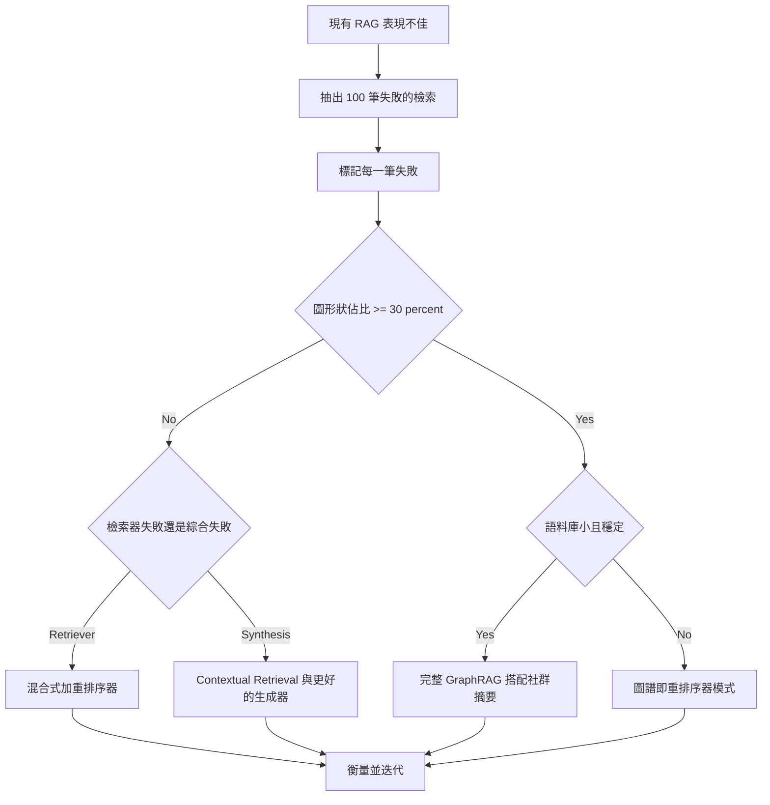
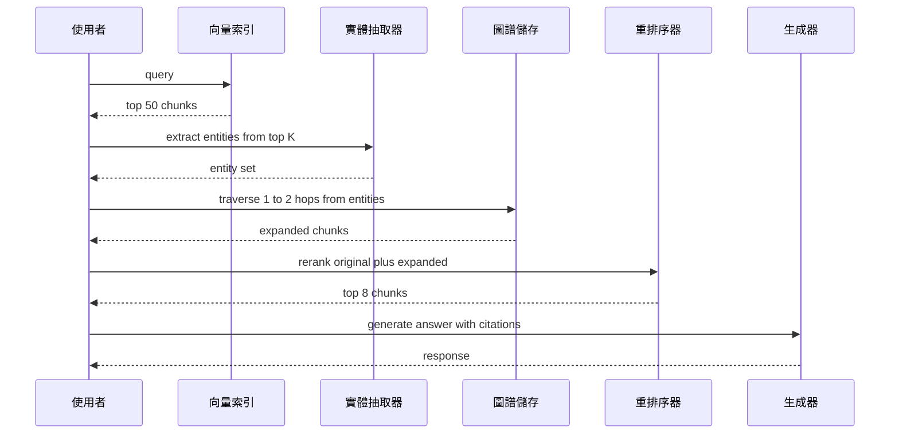

# GraphRAG

GraphRAG 是**知識圖譜（Knowledge Graphs, KG）**與**檢索增強生成（Retrieval-Augmented Generation）**的結合。向量 RAG 擅長「找到某個特定區塊」，而 GraphRAG 的設計目標則是針對整個資料集進行**全域推理（Global Reasoning）**。

## 目錄

- [GraphRAG 真正勝出的時機（以及不適用的時機）](#when-graphrag-actually-wins-and-when-it-doesnt)
- [圖譜即重排序器模式（2026 年 5 月）](#graph-as-reranker-pattern-may-2026)
- [向量 RAG 的限制](#limitations)
- [GraphRAG 架構（抽取-建構-查詢）](#architecture)
- [社群摘要（Microsoft 模式）](#communities)
- [實體關係檢索](#retrieval)
- [何時使用 GraphRAG](#when)
- [面試問題](#interview-questions)
- [參考資料](#references)

---

## GraphRAG 真正勝出的時機（以及不適用的時機） {#when-graphrag-actually-wins-and-when-it-doesnt}

GraphRAG 是針對圖形狀問題的專用工具，並不是向量 RAG 的預設升級版本。對於大約 80% 的生產環境檢索工作負載來說，採用混合式 BM25 加密集檢索器、再接上一個 cross-encoder 重排序器的做法，建構成本更低、運作成本更低，而且在答案品質上具有競爭力。只有當問題真正需要向量相似度無法還原的多跳（multi-hop）遍歷時，建構圖譜才有價值。

這個決策應該由資料驅動，而不是出於美感。從你現有的 RAG 系統中抽出 100 筆失敗的檢索，把每一筆失敗標記到下列三個分類之一，再讓分布結果來決定：

1. **詞彙或分塊失敗**：答案就在語料庫裡，但檢索器沒有把它呈現出來。請修正檢索器（更好的嵌入、混合評分、更大的 top-k、一個重排序器，或是 Contextual Retrieval）。
2. **綜合失敗**：檢索器呈現了正確的區塊，但生成器把它們組合得很差。請修正提示、重排序器，或是模型。
3. **圖形狀失敗**：答案需要跨多份文件追蹤一連串關係，而這些文件之間並沒有共同的表面文字。這就是 GraphRAG 的分類。

如果第三個分類佔失敗的比例低於 30%，就不要建構圖譜。建構與維護的成本不會回本。如果它佔了 30% 或更多，那麼 GraphRAG（或是下文會介紹的「圖譜即重排序器」混合做法）就是接下來正確的投資方向。

### GraphRAG 是正確工具的工作負載

這些情境的共同模式是一樣的：問題需要連接那些不會出現在任何單一區塊中的實體，而且這些關係本身帶有表面嵌入無法捕捉的語意份量。

- **藥物探索與生醫研究**：跨越基因、蛋白質、化合物與疾病追蹤路徑。像 GraLC-RAG 這類以 UMLS 接地的變體就是針對此領域調校的。
- **金融詐欺集團**：在彼此從不指名對方的文件之間，連接帳戶、裝置、地點與交易。
- **法律判例鏈**：跨越多個司法管轄層級追蹤案件引用，其中每個案件只會引用其直接的上一層。
- **企業組織圖與政策歸屬**：像「誰核准在 Y 地區對政策 X 的例外申請」這類問題，需要遍歷匯報關係與政策歸屬的邊。
- **儲存庫規模的程式碼智慧**：呼叫圖、型別階層與相依關係本質上就是圖形狀的；在原始碼區塊上做向量相似度會遺失那些讓答案得以被找到的結構。

### 決策流程

### 維護的長尾

GraphRAG 隱藏的成本不在於抽取，而在於維護。語料庫會漂移：新文件不斷進來、實體會更名、關係會被改寫。一月建好的圖譜，到了四月就會出現實質性的錯誤。請規劃每季一次的重新整理，針對變動過的文件重新執行抽取，並在差異之間調和實體身分。請預先把這次重新整理的 LLM 成本與工程時間都編列進預算，否則就不要建構圖譜。略過這個步驟的團隊，最後會得到一個帶著自信卻檢索出錯誤結果的圖譜，這比完全沒有圖譜還糟糕。

---

## 圖譜即重排序器模式（2026 年 5 月） {#graph-as-reranker-pattern-may-2026}

2026 年生產環境中的主流模式並不是完整的 GraphRAG，而是「圖譜即重排序器」，它以建構成本的一小部分，交付了大部分的多跳效益。其直覺是：你並不需要在整個語料庫上建立圖譜索引；你需要的是一個涵蓋了出現在 top-k 向量結果中那些實體的圖譜，並且只擴展到剛好足以找到相連證據的程度。

流程如下：

1. 向量針對使用者查詢檢索出 top-50 的區塊，使用你既有的任何混合評分。
2. 一個實體抽取器（一個小型微調模型，或是一次結構化輸出的 LLM 呼叫）從那 50 個區塊中抽出具名實體。
3. 從那些實體出發進行一到兩跳深度的圖譜遍歷，回傳相連的實體以及它們出現的區塊。
4. 擴展後的候選集合（原本的 50 個加上圖譜擴展的區塊）送進一個 cross-encoder 重排序器。
5. 重排序後的 top-k 區塊餵給生成器。

你只會延遲地（lazily）建構查詢所觸及的那一小片圖譜，而不是一個全域的圖譜索引。建構成本因此下降一個數量級。維護的長尾也會縮短，因為你不會去重新索引未被觸及的區域。根據經驗，團隊回報在約 20% 的前期成本下，就能取得完整 GraphRAG 品質提升的 70-80%。

### 模式流程

### 近期變體（2024 至 2026）

以下是值得認識的變體簡短巡禮：

- **HippoRAG 與 HippoRAG 2**（Princeton，2024 與 2025）：把檢索當成在記憶圖譜上的 Personalized PageRank 問題，在多跳基準測試上有亮眼成績，且索引成本低於 Microsoft GraphRAG。
- **LightRAG**（HKU，2024）：以實體為中心的檢索，搭配更簡單的索引管線；在全域問題上犧牲了一些召回率，換取大幅更快的建構與更新。
- **GraLC-RAG**（2026 年 3 月）：圖譜感知的後期分塊（late chunking），搭配 UMLS 接地以應對生醫使用情境，在多跳生醫問答上有亮眼的公開成績。
- **Microsoft GraphRAG 索引管線 v2**（2025）：原始的社群摘要做法，重新架構以支援增量更新並大幅降低抽取成本；如果你真的需要全域摘要而非局部多跳，這就是該採用的方案。

這四個變體的整體方向是一致的：減少單體式索引，更多增量與延遲的圖譜建構，並且在「全域摘要」工作負載（Microsoft 式的社群仍然勝出之處）與「局部多跳」工作負載（HippoRAG 式的遍歷更便宜且具競爭力之處）之間做出更清楚的區隔。

**來源：**
- [Microsoft GraphRAG](https://microsoft.github.io/graphrag)
- [HippoRAG: Neurobiologically Inspired Long-Term Memory](https://arxiv.org/abs/2405.14831)
- [Edge et al., From Local to Global: A GraphRAG Approach](https://arxiv.org/abs/2404.16130)
- [Graph-aware late chunking (arXiv 2603.22633)](https://arxiv.org/html/2603.22633v1)
- [Anthropic Contextual Retrieval (Sep 2024)](https://www.anthropic.com/news/contextual-retrieval)

---

## 向量 RAG 的限制 {#limitations}

向量 RAG 是在空間中的「點」上運作。這對於以下這類問題會失敗：
- *「全部 500 份員工評論中的主要主題有哪些？」*
- *「把 Project Alpha 與第三季預算刪減之間的所有關聯都展示出來。」*

**問題所在**：向量搜尋會找到「相似的文字」，但它並不理解「相連的實體」。

---

## GraphRAG 架構

一條現代的 GraphRAG 管線由三個階段組成：

1. **抽取（VLB）**：由一個 LLM 掃描文字並抽出**實體**（人物、專案、日期）與**關係**（例如「人物 A *參與* 專案 B」）。
2. **圖譜建構**：實體以節點的形式儲存、關係以邊的形式儲存，存放在一個圖形資料庫（Neo4j、Memgraph）中。
3. **查詢**：
   - **局部搜尋（Local Search）**：找到一個節點及其鄰居。
   - **全域搜尋（Global Search）**：使用**社群摘要（Community Summaries）**來回答高層次的問題。

---

## 社群摘要

這項由 Microsoft 推廣的技術涉及：
1. 使用圖演算法（例如 Leiden）辨識出相關節點的叢集（社群）。
2. 為*每一個*社群生成一段自然語言摘要。
3. 在查詢時，搜尋**摘要**而非原始區塊。

**勝出之處**：這讓模型不必讀取 100 萬個 token，就能回答「大局觀」的問題。

---

## 實體關係檢索 {#retrieval}

生產環境的技術堆疊使用**混合式圖譜-向量搜尋（Hybrid Graph-Vector Search）**。
- **密集階段（Dense Pass）**：透過嵌入找到最相似的節點。
- **圖譜階段（Graph Pass）**：遍歷那些節點的邊，找出相關的「支持性」資訊，這些資訊在語意上可能與查詢並不相似，但在邏輯上是相連的。

---

## 何時使用 GraphRAG {#when}

| 特性 | 向量 RAG | GraphRAG |
|---------|------------|----------|
| **資料類型** | 非結構化文字 | 高度相連的資料 |
| **查詢類型**| 「找出 X」 | 「解釋 X 與 Y 之間的關係」 |
| **規模** | 數 PB（petabytes） | 數百萬個實體 |
| **成本** | 低 | 高（抽取很昂貴） |

**2025 年建議**：在**內部知識庫**（Wiki、程式碼庫、法律儲存庫）中使用 GraphRAG，因為在這些情境裡，文件之間的關聯與內容本身一樣重要。

---

## 面試問題 {#interview-questions}

### Q：為什麼「抽取」階段是 GraphRAG 的瓶頸？

**強答案：**
知識圖譜抽取極度耗費 token。要建構一個高品質的圖譜，你必須用一個「前沿（Frontier）」模型處理每一份文件，以確保你不會遺漏細微的實體連結。對於一個 10,000 頁的資料集而言，這可能會在 LLM API 呼叫上花費數千美元。標準的緩解做法是用**以 SLM 為基礎的抽取**（小型語言模型，Small Language Models）來做初次處理，並保留巨型模型來處理重疊實體之間的「衝突解析」。Microsoft 的 LazyGraphRAG 更進一步，藉由把社群摘要的成本延後到查詢時才產生，來延遲這部分成本。

### Q：GraphRAG 如何解決聚合型問題的「上下文視窗」限制？

**強答案：**
對於聚合型問題（例如「摘要 1,000 份文件的情緒傾向」），標準的 RAG 系統將不得不把 1,000 個區塊餵進上下文視窗，而這是不可能做到、或是成本高得令人卻步的。GraphRAG 透過**預先摘要（Pre-Summarization）**來解決這個問題。它會階層式地摘要圖譜中的資訊叢集（社群）。當使用者提出一個全域問題時，系統只會檢索高層次的社群摘要，這些摘要既精簡又資訊豐富，讓模型得以透過一個濃縮過的鏡頭「看見」整個資料集。

---

## 參考資料 {#references}
- Edge et al. "From Local to Global: A GraphRAG Approach" (Microsoft Research, 2024)
- Neo4j. "Generative AI and Graph Databases" (2025)
- WhyHow AI. "Deterministic RAG with Knowledge Graphs" (2024)

---

*下一篇：[Agentic RAG](08-agentic-rag.md)*
