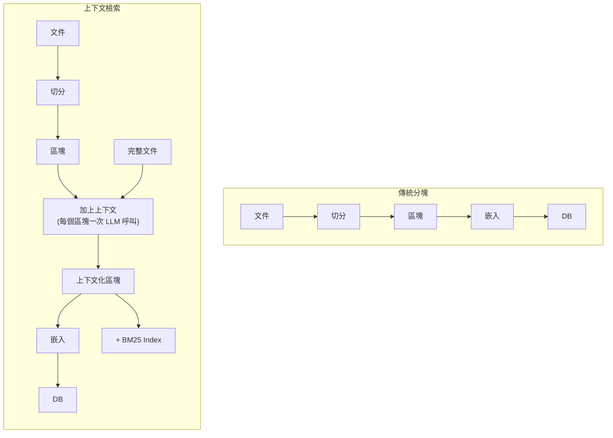
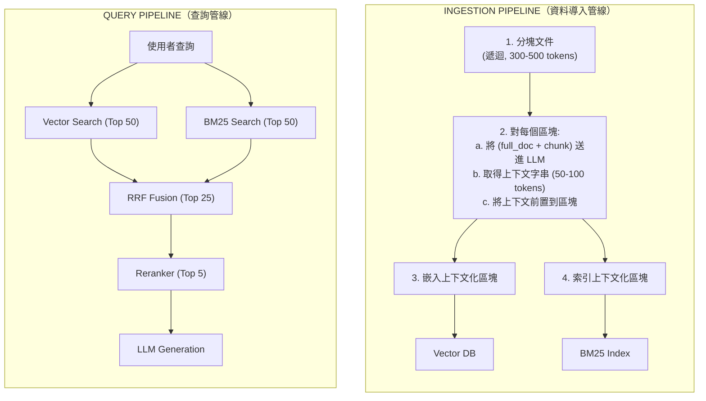
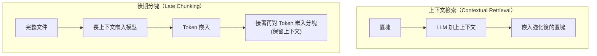
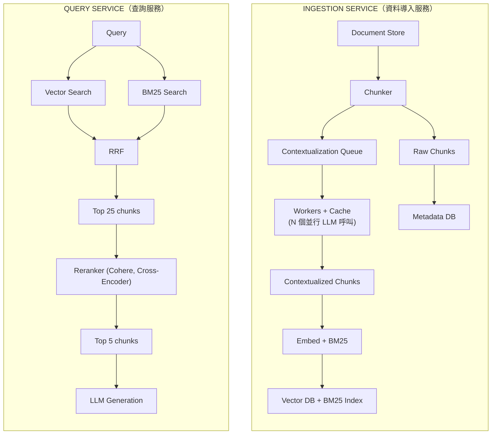

# 上下文檢索（Contextual Retrieval）

上下文檢索是一種在資料導入（ingestion）階段使用的技術，用來解決 RAG 失敗的頭號成因：**區塊一旦與來源文件分離就會喪失語意**。這項技術由 Anthropic 在 2024 年底首創，如今已是高精度檢索的生產環境標準做法。Anthropic 自家的量測顯示，光是搭配混合搜尋就能讓檢索失敗減少 49%，再結合重排序更可減少 67%。

## 目錄

- [問題所在：上下文稀釋](#context-dilution)
- [上下文檢索的運作方式](#how-it-works)
- [上下文嵌入（Contextual Embeddings）](#contextual-embeddings)
- [上下文 BM25](#contextual-bm25)
- [完整管線：混合搜尋 + 重排序](#full-pipeline)
- [實作模式](#implementation)
- [成本考量](#cost)
- [上下文檢索與其他做法的比較](#comparison)
- [生產環境架構](#production)
- [面試問題](#interview-questions)
- [參考資料](#references)

---

## 問題所在：上下文稀釋

當我們為了 RAG 而把文件分塊時，個別區塊會喪失賦予它意義的周邊上下文。

**上下文稀釋的範例：**

```
Original Document: "Acme Corp Q3 2025 Financial Report"
  Section 4: Product Pricing

  "The Standard plan costs $200/month. The Enterprise
   plan includes SSO and audit logs for $800/month."

-------- After Chunking --------

Chunk 17: "It costs $200/month."
Chunk 18: "The Enterprise plan includes SSO and audit
           logs for $800/month."
```

**Chunk 17 的問題**：當使用者搜尋「Acme Standard 方案要多少錢？」時，很可能會錯過這個區塊，因為內容中完全沒有提到「Acme」、「Standard」或「方案」。「It costs $200/month」這段文字的嵌入，在語意上與查詢相距甚遠。

**洞察**：Anthropic 的研究顯示，傳統分塊在前 20 名檢索結果上造成 **5.7% 的檢索失敗率**。這代表大約每 18 次查詢就有 1 次無法檢索到相關資訊，即使該資訊確實存在於知識庫中也一樣。

---

## 上下文檢索的運作方式

核心概念很簡單：**在嵌入一個區塊之前，先在前面加上一段簡短的上下文字串，說明這個區塊在整份文件中是在講什麼**。



**這個加上上下文的步驟**會把完整文件加上個別區塊一起送進 LLM，並使用以下提示：

```
<document>
{{WHOLE_DOCUMENT}}
</document>

Here is the chunk we want to situate within the whole document:
<chunk>
{{CHUNK_CONTENT}}
</chunk>

Please give a short succinct context to situate this chunk
within the overall document for the purposes of improving
search retrieval of the chunk. Answer only with the succinct
context and nothing else.
```

**Chunk 17 的結果**：

```
Before: "It costs $200/month."

After:  "This chunk is from the Acme Corp Q3 2025 Financial
         Report, Section 4 on Product Pricing. It describes
         the cost of the Standard plan.
         It costs $200/month."
```

現在這個區塊的嵌入就包含了「Acme」、「Standard plan」與「Product Pricing」，這些全都是使用者會自然而然去搜尋的詞彙。

---

## 上下文嵌入（Contextual Embeddings）

上下文嵌入是第一個子技術：嵌入「加上上下文後的區塊」而非原始區塊。

### 它如何改善檢索

| 情境 | 原始區塊嵌入 | 上下文嵌入 |
|----------|--------------------|-----------------------|
| 使用者詢問「Acme pricing」 | 錯過「It costs $200」 | 命中「Acme...Standard plan...costs $200」 |
| 使用者詢問「SSO features」 | 命中「SSO and audit logs」 | 命中時還帶有「Enterprise plan」的額外上下文 |
| 使用者詢問「Q3 financials」 | 無法命中（沒有提到 Q3） | 透過前置的「Q3 2025 Financial Report」命中 |

**效能**：光是上下文嵌入就能將前 20 名檢索失敗率從 **5.7% 降到 3.7%**，也就是檢索失敗減少了 **35%**。

### 向量空間的位移

```
                    ▲ Dimension 2
                    │
                    │    ● "Acme pricing" (query)
                    │         \
                    │          \  close (contextual)
                    │           \
                    │            ● Contextualized chunk
                    │
                    │                          ● Raw chunk "It costs $200"
                    │                            (far from query)
                    │
                    └─────────────────────────────► Dimension 1
```

---

## 上下文 BM25

第二個子技術是把同樣的上下文化做法套用上去，針對強化過的區塊建立一個 **BM25 關鍵字索引**。

### 為什麼 BM25 依然重要

密集嵌入（dense embeddings）擅長語意相似度，但在以下情況會失靈：
- **精確詞彙**：產品 ID、版本號、縮寫
- **罕見 token**：嵌入模型表徵不足的領域專有術語
- **專有名詞**：公司名、人名、地名

**範例**：使用者搜尋「Widget-X pricing」時，在原始區塊「It costs $200/month」上會得到零個 BM25 命中，因為「Widget-X」根本沒出現過。改用上下文 BM25 後，前置的上下文就會把「Widget-X」當成關鍵字納入，使 BM25 得以命中。

### 效能提升（累積）

| 設定 | 失敗率 | 相對基準的降幅 |
|---------------|-------------|----------------------|
| 傳統嵌入（基準） | 5.7% | -- |
| 僅上下文嵌入 | 3.7% | 35% |
| 上下文嵌入 + 上下文 BM25 | 2.9% | **49%** |
| 上下文嵌入 + 上下文 BM25 + 重排序 | 1.9% | **67%** |

**重點**：上下文嵌入加上上下文 BM25 的組合，是你能對 RAG 管線做出的單一槓桿效益最高的改動。再疊上一個重排序器，就能把失敗率降低 67%。

---

## 完整管線：混合搜尋 + 重排序

生產等級的上下文檢索管線分為四個階段：



### 用倒數排名融合（RRF）合併結果

標準混合搜尋所用的同一套 RRF 技術也適用於此：

```
RRF_Score(doc) = sum( 1 / (k + rank_in_list) )
                 for each list where doc appears

k = 60 (standard smoothing constant)
```

---

## 實作模式

### 模式 1：基本上下文檢索（Python）

```python
import anthropic
from typing import List

client = anthropic.Anthropic()

CONTEXT_PROMPT = """<document>
{document}
</document>

Here is the chunk we want to situate within the whole document:
<chunk>
{chunk}
</chunk>

Please give a short succinct context to situate this chunk
within the overall document for the purposes of improving
search retrieval of the chunk. Answer only with the succinct
context and nothing else."""


def contextualize_chunk(
    full_document: str,
    chunk: str,
    model: str = "claude-sonnet-4-20250514"
) -> str:
    """Generate context for a single chunk."""
    response = client.messages.create(
        model=model,
        max_tokens=200,
        messages=[{
            "role": "user",
            "content": CONTEXT_PROMPT.format(
                document=full_document,
                chunk=chunk
            )
        }]
    )
    context = response.content[0].text
    return f"{context}\n\n{chunk}"


def process_document(document: str, chunks: List[str]) -> List[str]:
    """Contextualize all chunks in a document."""
    contextualized = []
    for chunk in chunks:
        ctx_chunk = contextualize_chunk(document, chunk)
        contextualized.append(ctx_chunk)
    return contextualized
```

### 模式 2：以提示快取（Prompt Caching）做成本最佳化

最大的成本來源是「每處理一個區塊就要送一次完整文件」。**提示快取**能解決這個問題：

```python
def contextualize_with_caching(
    full_document: str,
    chunks: List[str],
    model: str = "claude-sonnet-4-20250514"
) -> List[str]:
    """
    Use prompt caching so the full document is only
    processed once across all chunks.
    """
    results = []

    for chunk in chunks:
        response = client.messages.create(
            model=model,
            max_tokens=200,
            messages=[{
                "role": "user",
                "content": [
                    {
                        "type": "text",
                        "text": f"<document>\n{full_document}\n</document>",
                        "cache_control": {"type": "ephemeral"}
                    },
                    {
                        "type": "text",
                        "text": (
                            f"<chunk>\n{chunk}\n</chunk>\n\n"
                            "Please give a short succinct context to "
                            "situate this chunk within the overall "
                            "document for the purposes of improving "
                            "search retrieval of the chunk. Answer "
                            "only with the succinct context and "
                            "nothing else."
                        )
                    }
                ]
            }]
        )
        context = response.content[0].text
        results.append(f"{context}\n\n{chunk}")

    return results
```

**提示快取對成本的影響**：以一份 10,000 token、切成 30 個區塊的文件來說，提示快取可將上下文化成本最多降低 **90%**，因為文件前綴在第一次呼叫後就會被快取起來。

### 模式 3：上下文區塊標頭（輕量替代方案）

如果以 LLM 為基礎的上下文化太昂貴，可改用 **上下文區塊標頭（Contextual Chunk Headers，CCH）** 作為確定性的替代方案：

```python
def add_chunk_headers(
    document_title: str,
    section_hierarchy: List[str],
    chunk: str
) -> str:
    """
    Prepend document and section metadata to the chunk.
    No LLM call required -- purely structural.
    """
    header_parts = [f"Document: {document_title}"]

    for i, section in enumerate(section_hierarchy):
        prefix = "  " * i
        header_parts.append(f"{prefix}Section: {section}")

    header = "\n".join(header_parts)
    return f"{header}\n\n{chunk}"


# Example usage:
contextualized = add_chunk_headers(
    document_title="Acme Corp Q3 2025 Financial Report",
    section_hierarchy=["Finance", "Product Pricing", "Standard Plan"],
    chunk="It costs $200/month."
)

# Result:
# Document: Acme Corp Q3 2025 Financial Report
#   Section: Finance
#     Section: Product Pricing
#       Section: Standard Plan
#
# It costs $200/month.
```

**何時該用 CCH，何時該用 LLM 上下文化：**

| 因素 | 區塊標頭（CCH） | LLM 上下文化 |
|--------|--------------------|-----------------------|
| **成本** | 免費（無 LLM 呼叫） | 每 1M token $1-5 |
| **品質** | 適合結構化文件 | 對所有文件都很出色 |
| **速度** | 即時 | 每個區塊 50-200ms |
| **最適用於** | Markdown、HTML、標頭清晰的 PDF | 非結構化文字、法律、醫療 |

---

## 成本考量

### 上下文化成本

以一個包含 10,000 個區塊（平均每個 400 token）的知識庫為例：

| 模型 | 每區塊成本 | 總成本 | 品質 |
|-------|---------------|------------|---------|
| Claude Haiku（快速、便宜） | ~$0.0003 | ~$3 | 良好 |
| Claude Sonnet（均衡） | ~$0.002 | ~$20 | 非常好 |
| Claude Opus（最高品質） | ~$0.01 | ~$100 | 出色 |

**最佳實務**：上下文化請使用 Haiku（或其他快速、便宜的模型）。這些上下文字串既短又偏事實性，因此你不需要動用前沿模型。再搭配提示快取，就能讓反覆傳入的文件本體成本降低約 90%。

### 何時該用上下文檢索

**在以下情況使用：**
- 你的語料庫裡有零碎的文件，區塊一旦孤立就會喪失意義
- 你有嵌入模型難以處理的領域專有術語
- 你的檢索失敗率超過 3-5%
- 你能負擔一次性的導入成本

**在以下情況略過：**
- 你的區塊本身已經自成一體（例如 FAQ 問答對、產品描述）
- 你的語料庫非常小（< 100 個區塊），這時直接用長上下文就好
- 你需要即時導入（每份文件 < 1 秒）且無法批次處理

---

## 上下文檢索與其他做法的比較

| 做法 | 運作方式 | 檢索改善幅度 | 成本 | 複雜度 |
|----------|-------------|----------------------|------|------------|
| **樸素分塊（Naive Chunking）** | 固定大小切分、嵌入原始內容 | 基準 | 無 | 低 |
| **區塊標頭（CCH）** | 前置文件／章節標題 | 10-20% | 無 | 低 |
| **上下文檢索** | 由 LLM 為每個區塊產生上下文 | 35-49% | 每 1 萬區塊 $3-20 | 中 |
| **上下文檢索 + 重排序** | 上者再加上 cross-encoder 重排序 | 67% | 每 1 萬區塊 $5-30 | 中至高 |
| **HyDE** | 在查詢時產生假設性文件 | 20-40% | 每次查詢的 LLM 成本 | 中 |
| **父子分塊（Parent-Child Chunking）** | 嵌入子區塊、檢索父區塊 | 15-30% | 無 | 中 |

**關鍵區別**：上下文檢索是一種**導入階段**的技術（一次付清），而 HyDE 則是**查詢階段**的技術（按查詢次數付費）。對於高流量系統，上下文檢索的成本攤提效果好得多。

### 上下文檢索與後期分塊（Late Chunking）

**後期分塊（Late Chunking）**（Jina，2024）是一種相關但不同的做法：



後期分塊需要一個長上下文的嵌入模型（例如 Jina v3），並可完全避免 LLM 呼叫。它是透過嵌入模型的注意力機制來保留上下文，而不是明確地在文字前面加上前綴。其取捨在於，後期分塊對 BM25 搜尋沒有幫助，只對密集檢索有用。

---

## 生產環境架構

### 參考架構：大規模的上下文 RAG



### 擴展考量

| 顧慮 | 解決方案 |
|---------|----------|
| **導入吞吐量** | 以非同步 worker 並行化 LLM 呼叫（50-100 個並行） |
| **文件更新** | 只對變動過的區塊重新上下文化；將原始內容與上下文分開儲存 |
| **大規模下的成本** | 使用 Haiku + 提示快取；依大小批次處理文件 |
| **品質監控** | 抽樣 1% 的區塊並由人工評估其上下文品質 |
| **索引一致性** | 以每份文件為單位，原子化地同步更新向量資料庫 + BM25 索引 |

---

## 面試問題

### 問：請說明 Anthropic 的上下文檢索。你會在什麼情況下使用它，又會在什麼情況下略過它？

**強答案：**
上下文檢索解決的是 RAG 中的「上下文稀釋」問題。當文件被分塊後，個別區塊會喪失賦予它意義的周邊上下文，一個寫著「It costs $200」的區塊，在不知道*是什麼*要 $200 的情況下毫無用處。這項技術在導入階段使用 LLM，為每個區塊產生一段簡短的上下文字串（50-100 token），說明該區塊在文件中是在講什麼。這段上下文會在嵌入與 BM25 索引之前被加到區塊前面。

關鍵結果：光是上下文嵌入就能讓檢索失敗減少 35%。加上上下文 BM25 可達到 49% 的降幅。再加上一個重排序器則達到 67% 的降幅。

當區塊經常在孤立狀態下喪失意義時，我會使用它，例如法律合約、財務報告、技術手冊。而當區塊本身已經自成一體（FAQ、產品卡片），或語料庫小到足以使用長上下文 RAG 時，我就會略過它。

### 問：一個有 50,000 份文件的知識庫需要做上下文檢索。你要如何管控導入成本？

**強答案：**
三種策略：
1. **模型選擇**：上下文化請使用小型、快速的模型（Claude Haiku 等級）。其輸出是簡短的事實性文字，而非創意寫作，前沿模型只會增加成本卻不會提升品質。
2. **提示快取**：在所有區塊的上下文化呼叫之間快取完整文件文字。以一份 10,000 token、含 30 個區塊的文件來說，這能讓輸入 token 成本降低約 90%。
3. **分層做法**：並非每份文件都需要 LLM 上下文化。對於結構良好的文件（Markdown、帶標頭的 HTML），可使用確定性的上下文區塊標頭（前置文件標題 + 章節階層），這是免費的。把 LLM 上下文化保留給非結構化或語意模糊的文件。

### 問：在提升檢索品質方面，上下文檢索與 HyDE 相比如何？

**強答案：**
它們解決的是同一個問題的不同面向。上下文檢索是在導入階段強化**文件**（一次付清），而 HyDE 是在搜尋階段強化**查詢**（按查詢次數付費）。對於一個每天要對 50,000 個區塊的語料庫處理 10,000 次查詢的系統來說，上下文檢索便宜得多，因為導入成本被攤提掉了。HyDE 還有幻覺風險，那份假設性文件可能會帶入錯誤的資料。實務上，最強的系統會兩者並用：以上下文檢索做導入階段的強化，並用 HyDE（或多查詢擴展）來協助那些需要查詢端支援的複雜查詢。

---

## 參考資料
- Anthropic. "Contextual Retrieval"（2024 年 9 月）
- Jina AI. "Late Chunking: Contextual Chunk Embeddings Using Long-Context Embedding Models"（2024）
- Voyage AI. "voyage-context-3: Contextualized Chunk Embeddings"（2025）
- NirDiamant. "RAG Techniques: Contextual Chunk Headers"（GitHub，2024）

---

*上一篇：[進階檢索模式](09-advanced-retrieval-patterns.md) | 下一篇：[後期互動與 ColBERT](11-late-interaction-colbert.md)*
