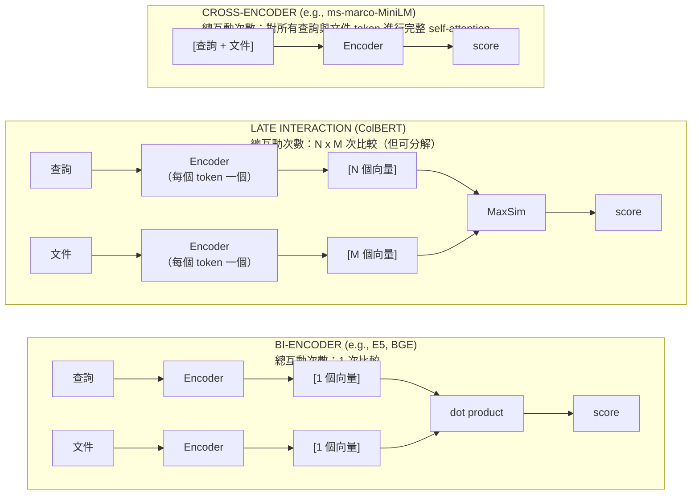
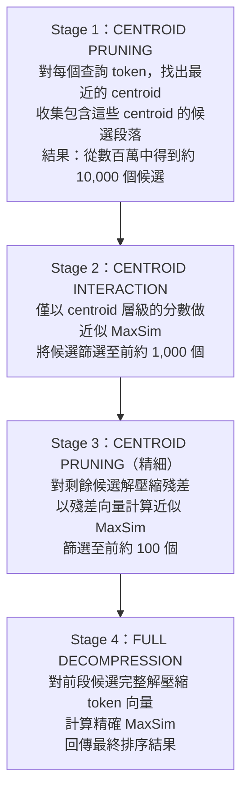
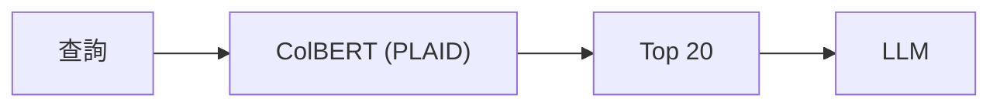
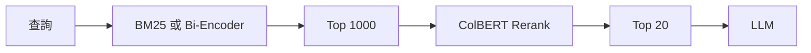
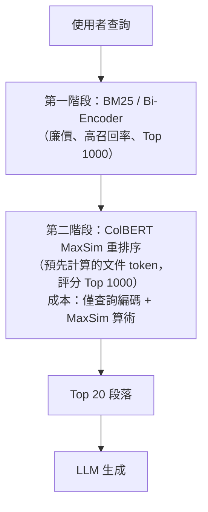
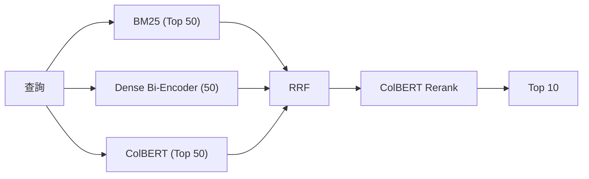
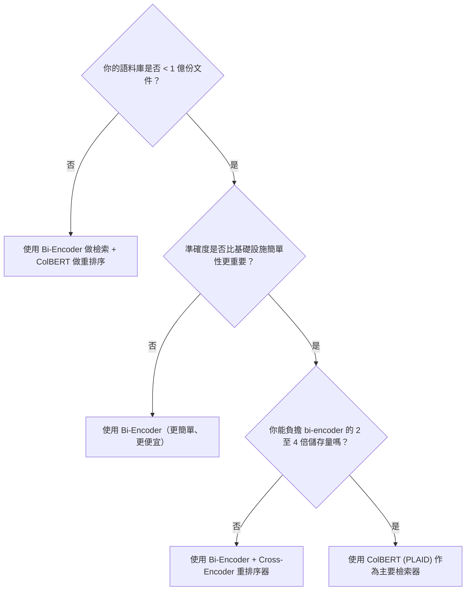

# Late Interaction 與 ColBERT

Late Interaction（後期互動）是一種檢索範式，位於「快速但不精準」的 **bi-encoder** 與「精準但緩慢」的 **cross-encoder** 之間。ColBERT（Contextualized Late Interaction over BERT）是這個領域的代表性模型，能以 bi-encoder 等級的速度提供 cross-encoder 等級的準確度。late-interaction 家族已經成熟為高精度搜尋的生產環境可用選項，並具備多模態延伸（ColPali、ColQwen2.5、ColNomic，以及像 Wholembed v3 這類統一檢索器），如今都納入同一套工具箱。

## 目錄

- [檢索架構光譜](#spectrum)
- [ColBERT 架構](#colbert-architecture)
- [MaxSim：核心評分機制](#maxsim)
- [ColBERTv2 與 PLAID 索引](#colbertv2)
- [Late Interaction 與其他方案的比較](#comparison)
- [使用 RAGatouille 實作](#ragatouille)
- [生產環境部署模式](#production)
- [何時該選擇 ColBERT](#when-to-choose)
- [面試問題](#interview-questions)
- [參考資料](#references)

---

## 檢索架構光譜 {#spectrum}

神經檢索有三種基本架構。理解 late interaction 落在哪個位置，是掌握整章內容的關鍵。

這個光譜從速度（左）延伸到準確度（右）：

| 架構 | Bi-Encoder | Late Interaction | Cross-Encoder |
|---|---|---|---|
| 表示方式 | 單一向量 | 多向量 | 完整 attention |
| 延遲 | 快速（< 10ms） | 平衡（10-50ms） | 緩慢（100ms 以上） |
| 準確度 | 低準確度 | 高準確度 | 最高準確度 |
| 可擴展性 | 可擴展至 10 億以上 | 可擴展至 1 億以上 | 可擴展至 1 萬 |

### 每種架構如何處理「查詢, 文件」配對



**洞察**：關鍵差異在於查詢與文件「何時」互動。bi-encoder 從不互動（各自獨立編碼）。cross-encoder 完全互動（聯合編碼）。late interaction 是折衷地帶：先獨立編碼，再以低成本在 token 層級互動。

---

## ColBERT 架構 {#colbert-architecture}

ColBERT 把查詢與文件編碼成 **token 層級嵌入的矩陣**（而非單一向量），並透過細緻的 token 互動來評分。

### 編碼階段

```
Query: "What is the price of Widget-X?"

Token Embeddings (each 128-dim):
  q1 = Embed("What")     = [0.12, -0.34, ..., 0.08]
  q2 = Embed("is")       = [0.05, -0.11, ..., 0.22]
  q3 = Embed("the")      = [0.01, -0.02, ..., 0.15]
  q4 = Embed("price")    = [0.45,  0.67, ..., 0.91]  ◄── high signal
  q5 = Embed("of")       = [0.03, -0.05, ..., 0.11]
  q6 = Embed("Widget-X") = [0.88,  0.21, ..., 0.73]  ◄── high signal

Document: "Widget-X costs $200 per month for the Standard plan"

Token Embeddings:
  d1 = Embed("Widget-X")  = [0.85,  0.19, ..., 0.71]
  d2 = Embed("costs")     = [0.42,  0.63, ..., 0.88]
  d3 = Embed("$200")      = [0.31,  0.55, ..., 0.79]
  d4 = Embed("per")       = [0.02, -0.01, ..., 0.09]
  d5 = Embed("month")     = [0.11,  0.08, ..., 0.14]
  d6 = Embed("Standard")  = [0.38,  0.44, ..., 0.62]
  d7 = Embed("plan")      = [0.29,  0.37, ..., 0.51]
```

**關鍵設計選擇**：ColBERT 使用 **128 維** token 嵌入（相對於標準 bi-encoder 的 768 至 1024 維）。這個較小的維度對儲存效率至關重要，因為我們對每份文件儲存的是 N 個向量，而非 1 個。

### 離線 vs. 線上運算

| 元件 | 何時執行 | 成本 |
|-----------|------|------|
| 文件編碼 | 離線（建立索引時） | 一次性、可平行化 |
| 查詢編碼 | 線上（每次查詢） | 快速（GPU 上約 5 至 10ms） |
| MaxSim 評分 | 線上（每次查詢） | token 層級運算，由 PLAID 最佳化 |

**這種拆解正是 ColBERT 快速的原因**：文件只需預先編碼一次。在查詢時，只有查詢需要編碼，而評分只是對預先計算好的向量做簡單算術。

---

## MaxSim：核心評分機制 {#maxsim}

MaxSim（Maximum Similarity，最大相似度）是讓 late interaction 得以運作的運算子。它在概念上很簡單，卻出奇地強大。

### MaxSim 如何運作

```
For each query token qi:
  1. Compute dot product with EVERY document token dj
  2. Keep only the MAXIMUM score

Score(Q, D) = SUM over all qi of MAX over all dj of (qi . dj)
```

### 實例演算

每個查詢 token（列）與文件 token（欄）之間的點積分數。`*` 標示該查詢 token 的最大值：

| 查詢 token | d1: Widget-X | d2: costs | d3: $200 | d4: per | d5: month |
|---|---|---|---|---|---|
| q4: price | 0.41 | 0.89* | 0.73 | 0.01 | 0.05 |
| q6: Widget-X | 0.95* | 0.38 | 0.27 | 0.01 | 0.03 |

- q4（"price"）的 MaxSim 貢獻：0.89（匹配到 "costs"）
- q6（"Widget-X"）的 MaxSim 貢獻：0.95（匹配到 "Widget-X"）
- 總分 = 所有查詢 token 的最大值總和

### 為什麼 MaxSim 勝過單一向量相似度

| 屬性 | 單一向量（點積） | MaxSim（Late Interaction） |
|----------|----------------------------|--------------------------|
| **粒度** | 文件層級 | token 層級 |
| **部分匹配** | 全有或全無 | 各 token 獨立匹配 |
| **詞彙重要性** | 壓縮進 1 個向量 | 每個 token 各自貢獻 |
| **罕見詞彙** | 因平均而被稀釋 | 以獨立向量保留 |

**直覺解釋**：在 bi-encoder 中，「Widget-X」的意義會與「costs」、「$200」以及其他每個 token 一起被平均進單一向量。如果「Widget-X」很罕見，它的訊號就會被稀釋。在 ColBERT 中，「Widget-X」保有自己專屬的向量，因此 MaxSim 運算子可以獨立地為它找到強匹配。

---

## ColBERTv2 與 PLAID 索引 {#colbertv2}

最初的 ColBERT（2020）有一個關鍵限制：**儲存**。為每份文件中的每個 token 儲存 128 維向量代價高昂。一個含 1000 萬份文件、每份各 200 個 token 的語料庫，會需要約 256 GB 的向量儲存空間。

### ColBERTv2 的改進（2021）

ColBERTv2 引入了兩項關鍵創新：

**1. Residual Compression（殘差壓縮）**：

```
Original ColBERT:
  Each token vector: 128 dims x 32-bit float = 512 bytes

ColBERTv2 Residual Compression:
  1. Cluster all token vectors into centroids (k-means)
  2. Store only the centroid ID + residual (difference)
  3. Quantize the residual to 1-2 bits per dimension

  Each token vector: ~16-32 bytes (16-32x compression)
```

**2. Denoised Supervision（去噪監督）**：
- 在來自 cross-encoder 教師模型所挖掘的 hard negatives 上訓練
- cross-encoder 標籤會「清理」帶雜訊的訓練資料
- 結果：儘管做了壓縮，仍能得到品質更好的嵌入

**ColBERTv2 儲存比較**：

| 系統 | 每個 Token 的儲存量 | 1000 萬份文件（每份 200 個 token） |
|--------|------------------|---------------------------|
| ColBERT v1 | 512 bytes | 約 1 TB |
| ColBERTv2（已壓縮） | 32 bytes | 約 64 GB |
| Bi-encoder（每份文件 1 個向量） | 3 KB | 約 30 GB |

### PLAID：索引引擎

PLAID（Performance-optimized Late Interaction Driver）是讓 ColBERT 能在大規模下實際可用的索引與檢索引擎。



**關鍵洞察**：PLAID 避免對所有文件的所有向量進行解壓縮。每個階段都以低成本篩選候選集合，使得昂貴的精確評分只發生在語料庫中極小的一部分上。

**PLAID 效能**：
- 在單一 GPU 上於 **50 至 100ms** 內從 1000 萬份以上的文件中完成檢索
- 維持 **精確的 MaxSim** 準確度（而非近似值）
- 使用 centroid pruning，在完整評分前略過 99% 以上的語料庫

---

## Late Interaction 與其他方案的比較 {#comparison}

### 全面比較

| 面向 | BM25 | Bi-Encoder | ColBERT（Late） | Cross-Encoder |
|-----------|------|-----------|----------------|---------------|
| **編碼** | 詞頻 | 每份文件 1 個向量 | 每份文件 N 個向量 | 聯合編碼（無法預先計算） |
| **查詢延遲** | 約 5ms | 約 10ms | 約 30 至 50ms | 每對約 500ms 以上 |
| **可擴展性** | 數十億 | 數十億 | 1 億以上 | 約 1 萬（僅限重排序） |
| **儲存（100 萬份文件）** | 約 2 GB | 約 3 GB | 約 6 至 12 GB | 0（無索引） |
| **準確度（NDCG@10）** | 0.30-0.35 | 0.35-0.40 | 0.39-0.44 | 0.42-0.46 |
| **領域遷移** | 強（詞彙式） | 弱（需要微調） | 強（token 層級） | 最強 |
| **設定複雜度** | 低 | 中 | 高 | 低（無索引） |

### ColBERT 何時勝出

```scatter
{
  "xLabel": "吞吐量（QPS，對數）", "yLabel": "準確度", "xScale": "log", "yDomain": [0.25, 0.5],
  "note": "準確度越高，吞吐量越低，兩者需權衡。",
  "points": [
    {"x": 100000, "y": 0.30, "label": "BM25"},
    {"x": 10000, "y": 0.35, "label": "Bi-Encoder"},
    {"x": 1000, "y": 0.40, "label": "ColBERT"},
    {"x": 100, "y": 0.45, "label": "Cross-Encoder"}
  ]
}
```

**ColBERT 佔據了甜蜜點**：在領域特定基準測試上，它比 bi-encoder 準確 3 至 5 倍（在專業資料集上 mAP 最高可提升 +13.8%），同時又比 cross-encoder 快 10 至 50 倍。

---

## 使用 RAGatouille 實作 {#ragatouille}

RAGatouille（由 Answer.AI 開發）是在 RAG 管線中使用 ColBERT 的標準 Python 函式庫。它以一套簡單、高階的 API 封裝了 Stanford ColBERT 程式碼庫。

### 基本用法

```python
from ragatouille import RAGPretrainedModel

# Load a pretrained ColBERT model
RAG = RAGPretrainedModel.from_pretrained("colbert-ir/colbertv2.0")

# Index documents (one-time, creates PLAID index on disk)
documents = [
    "Widget-X costs $200 per month for the Standard plan.",
    "The Enterprise plan includes SSO and audit logs for $800/month.",
    "All plans include 99.9% uptime SLA and 24/7 email support.",
    "Widget-X was launched in 2023 and serves 10,000+ customers.",
]

index_path = RAG.index(
    index_name="products",
    collection=documents,
    split_documents=True  # auto-chunk long docs
)

# Search the index
results = RAG.search(
    query="How much does Widget-X cost?",
    k=3
)

for result in results:
    print(f"Score: {result['score']:.4f}")
    print(f"Text:  {result['content']}\n")
```

### 與 LangChain 整合

```python
from ragatouille import RAGPretrainedModel
from langchain_core.runnables import RunnablePassthrough
from langchain_openai import ChatOpenAI
from langchain_core.prompts import ChatPromptTemplate

# Create ColBERT retriever
RAG = RAGPretrainedModel.from_pretrained("colbert-ir/colbertv2.0")
retriever = RAG.as_langchain_retriever(k=5)

# Build RAG chain
template = """Answer based on the following context:
{context}

Question: {question}"""

prompt = ChatPromptTemplate.from_template(template)
llm = ChatOpenAI(model="gpt-4o")

chain = (
    {"context": retriever, "question": RunnablePassthrough()}
    | prompt
    | llm
)

response = chain.invoke("What features does the Enterprise plan include?")
```

### 其他 ColBERT 函式庫與整合

| 函式庫 | 使用情境 | 備註 |
|---------|----------|-------|
| **RAGatouille** | Python 優先、API 簡單 | 最適合原型開發與中小規模 |
| **colbert-ai**（Stanford） | 研究、完全掌控 | 較低階、設定選項更多 |
| **Vespa** | 生產規模部署 | 受管基礎設施，原生支援 ColBERT |
| **PyLate** | 彈性訓練/微調 | 建構於 Sentence Transformers 之上，適合自訂模型 |
| **Jina ColBERT v2** | 多語言（89 種語言） | 輸出維度可彈性調整、生產環境可用 |

---

## 生產環境部署模式 {#production}

### 模式 1：ColBERT 作為主要檢索器



最適合：中等規模語料庫（100 萬至 5000 萬份文件），準確度為首要考量，且你能負擔額外的儲存開銷。

### 模式 2：ColBERT 作為重排序器（最常見）



最適合：大規模系統，第一階段檢索必須廉價，但你需要高品質的重排序，又不想付出 cross-encoder 的成本。



### 模式 3：混合式（ColBERT + BM25 + Dense）



最適合：在中等規模下追求最高準確度。成本較高，但涵蓋所有檢索模態。

### 儲存與基礎設施考量

| 語料庫規模 | Bi-Encoder 儲存 | ColBERT 儲存 | GPU 需求 |
|------------|-------------------|-----------------|-----------------|
| 10 萬份文件 | 約 300 MB | 約 600 MB 至 1.2 GB | 純 CPU 即可 |
| 100 萬份文件 | 約 3 GB | 約 6 至 12 GB | 建議 1 張 GPU |
| 1000 萬份文件 | 約 30 GB | 約 60 至 120 GB | 需 1 至 2 張 GPU |
| 1 億份文件 | 約 300 GB | 約 600 GB 至 1.2 TB | 多 GPU / 分散式 |

**現實檢核**：ColBERT 的儲存量是 bi-encoder 的 2 至 4 倍。對多數 RAG 使用情境（1000 萬份文件以下）而言，這是可管理的。對於網路規模的搜尋（數十億頁面），bi-encoder 或學習式稀疏方法在第一階段檢索上仍然更實際。

---

## 何時該選擇 ColBERT {#when-to-choose}

### 決策框架



### ColBERT vs. Dense 檢索 vs. 混合搜尋

| 情境 | 最佳選擇 | 原因 |
|----------|-------------|-----|
| 通用型 RAG（100 萬份文件以下） | 混合式（Dense + BM25） | 最簡單，準確度也夠用 |
| 領域特定搜尋（法律、醫療） | ColBERT | token 層級匹配能保留專業術語 |
| 多語言語料庫 | Jina ColBERT v2 | 原生支援 89 種語言 |
| 成本敏感、高流量 | Bi-Encoder + BM25 | 儲存與運算成本最低 |
| 追求最高準確度、中等規模 | ColBERT + 重排序器 | 在不付出 cross-encoder 延遲下取得最佳品質 |
| 網路規模（10 億份文件以上） | Bi-Encoder 第一階段 + ColBERT 重排序 | ColBERT 索引對主要檢索而言太大 |

---

## 面試問題 {#interview-questions}

### 問：說明 bi-encoder、cross-encoder 與 late interaction 模型之間的差異。你會在什麼情況下選擇各自？

**優秀回答：**
這三種架構的差異在於查詢與文件「何時」互動：

**Bi-encoder** 將查詢與文件各自獨立編碼成單一向量。互動只在最後透過點積發生。這很快（預先計算所有文件向量，毫秒內即可搜尋），但會失去細緻的匹配能力，因為整份文件的意義都被壓縮成向量空間中的一個點。

**Cross-encoder** 把串接後的「查詢 + 文件」一起送進單一 transformer。完整的 self-attention 意味著每個查詢 token 都會關注每個文件 token。這帶來最高的準確度，但無法預先計算任何東西，每一對「查詢, 文件」都需要一次完整的前向傳遞，使其不適用於第一階段檢索。cross-encoder 用於對前 10 至 100 名候選做重排序。

**Late interaction（ColBERT）** 像 bi-encoder 一樣獨立編碼查詢與文件，但編碼成「每個 token 一個向量」的向量矩陣，而非單一向量。評分使用 MaxSim，為每個查詢 token 找出其最佳匹配的文件 token。這在保留 token 層級粒度的同時，仍允許文件預先計算。結果是以接近 bi-encoder 的速度，達到接近 cross-encoder 的準確度。

當簡單性重要、需要大規模第一階段檢索時，我會選擇 bi-encoder；當需要對小型候選集做高風險重排序時，我會選擇 cross-encoder；而當我需要 cross-encoder 等級的準確度卻無法負擔其延遲時，我會選擇 ColBERT，特別是在詞彙層級匹配很重要的領域特定搜尋（法律、醫療、技術文件）。

### 問：ColBERT 為每個 token 儲存一個向量。它如何擴展？儲存上有哪些取捨？

**優秀回答：**
ColBERT 天真的儲存成本很可觀。一份 200 個 token 的文件需要 200 個各 128 維的向量，相對於 bi-encoder 只需 1 個 768 至 1024 維的向量。這意味著每份文件大約是 3 至 5 倍的儲存量。

ColBERTv2 以 **residual compression（殘差壓縮）** 解決此問題：token 向量被分群成 centroid，只儲存 centroid ID 加上一個量化後的殘差。這達到每個 token 向量 16 至 32 倍的壓縮率，把實際儲存量降到約為 bi-encoder 的 2 至 4 倍。

PLAID 索引引擎在查詢時透過多階段管線進一步提升效率。它從 centroid pruning（快速、粗略）開始，先淘汰 99% 的候選，再僅針對有希望的候選逐步解壓縮殘差。最終的精確 MaxSim 只在不到 100 份文件上計算，即使在 1000 萬份以上的語料庫上，也能把延遲維持在 50 至 100ms。

對於超過 1 億份文件的規模，我會把 ColBERT 當作重排序器而非主要檢索器，讓 bi-encoder 或 BM25 負責第一階段檢索，把候選集縮小到 1000 份文件，再套用 ColBERT 的 MaxSim 進行高品質重排序。

### 問：你正在設計一個含 500 萬份文件的法律文件搜尋系統。團隊在「dense bi-encoder 搜尋搭配 cross-encoder 重排序器」與「ColBERT」之間爭論不休。你會建議哪一個？

**優秀回答：**
基於三個理由，我會在此使用情境推薦 ColBERT：

第一，**法律文本對詞彙敏感**。合約條款會引用特定的章節編號、定義詞彙（例如「Force Majeure，不可抗力」）以及精確的措辭。ColBERT 的 token 層級 MaxSim 匹配能保留這些罕見卻關鍵的詞彙，而它們在單一向量 bi-encoder 嵌入中會被稀釋。

第二，**500 萬份文件正好落在 ColBERT 的甜蜜點**。搭配 ColBERTv2 壓縮，索引大約是 30 至 60 GB，可以輕鬆放進單一 GPU。這對主要檢索而言夠小，免去了另設第一階段檢索器的需要。

第三，**cross-encoder 重排序會增加延遲**。每一對「查詢, 文件」都需要一次完整的 transformer 前向傳遞。用 cross-encoder 對 100 個候選做重排序可能要 500ms 至 2s。ColBERT 在達到相當準確度的同時，把總延遲維持在 100ms 以內，因為文件 token 是預先計算好的。

我唯一會用來補強 ColBERT 的，是一個平行的 BM25 索引，用於關鍵字精準度很重要的精確匹配查詢（法規編號、案例引用）。在送進 LLM 之前，我會用 RRF 來合併 ColBERT 與 BM25 的結果。

---

## 參考資料 {#references}
- Khattab & Zaharia. "ColBERT: Efficient and Effective Passage Search" (SIGIR 2020)
- Santhanam et al. "ColBERTv2: Effective and Efficient Retrieval via Lightweight Late Interaction" (NAACL 2022)
- Santhanam et al. "PLAID: An Efficient Engine for Late Interaction Retrieval" (CIKM 2022)
- Answer.AI. "RAGatouille: State-of-the-art Late Interaction Retrieval" (GitHub, 2024)
- Jina AI. "Jina-ColBERT-v2: General-Purpose Multilingual Late Interaction Retriever" (2024)
- Weaviate. "An Overview of Late Interaction Retrieval Models" (2025)
- ECIR 2026. "Late Interaction Workshop" (2026)

---

*上一篇：[Contextual Retrieval](10-contextual-retrieval.md)*
