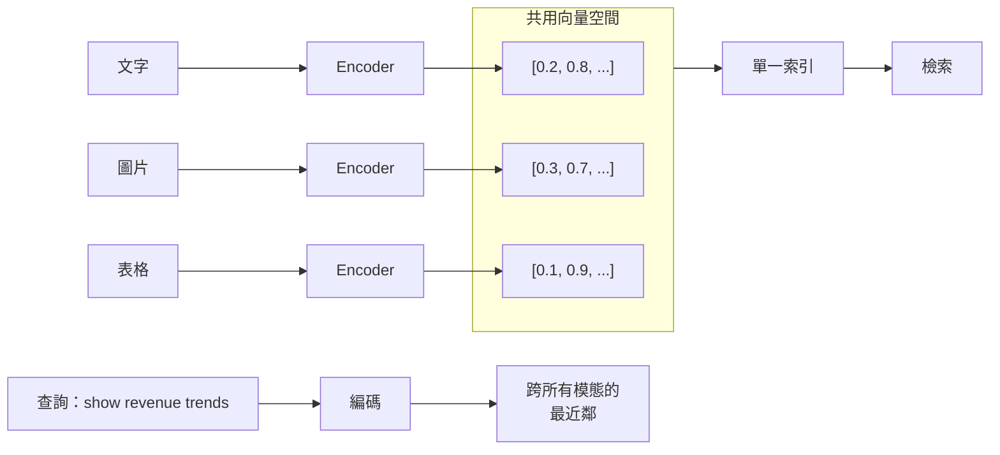
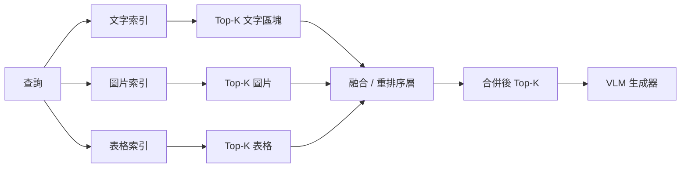
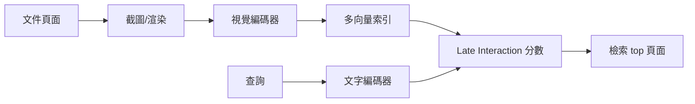
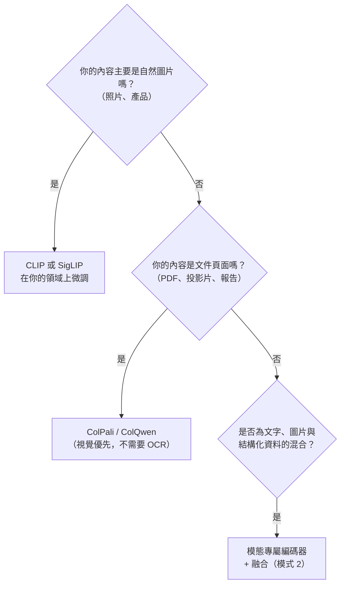
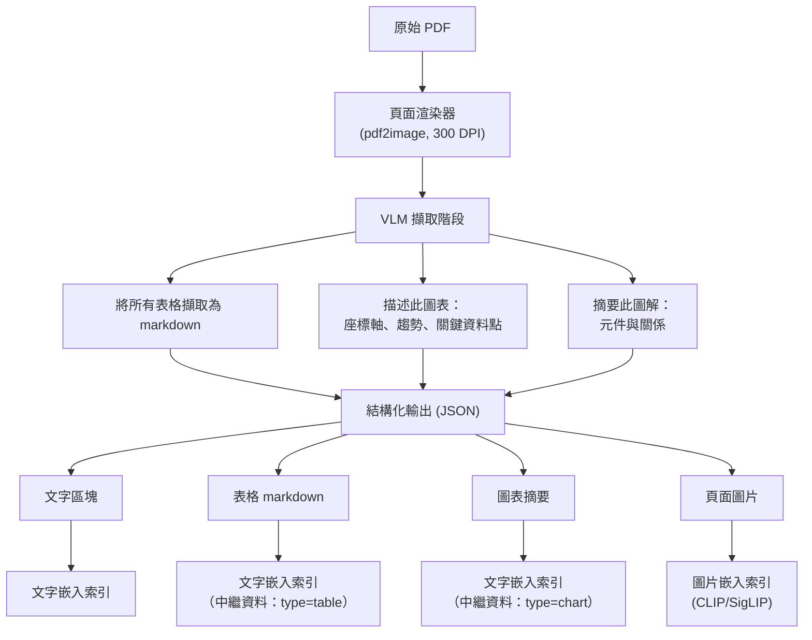
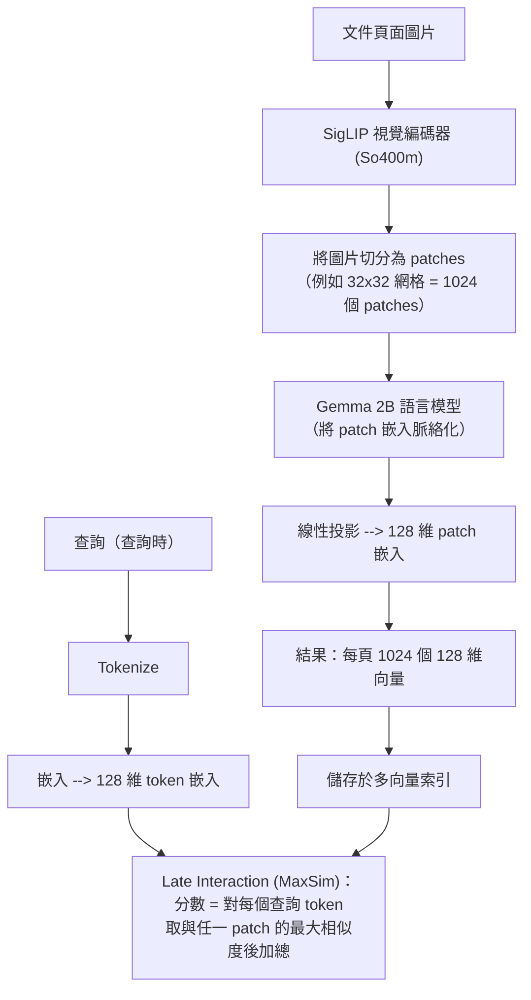
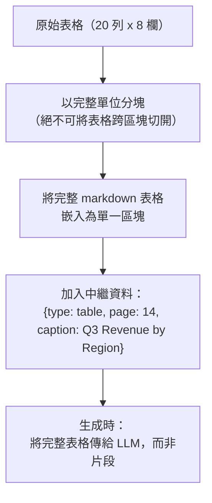
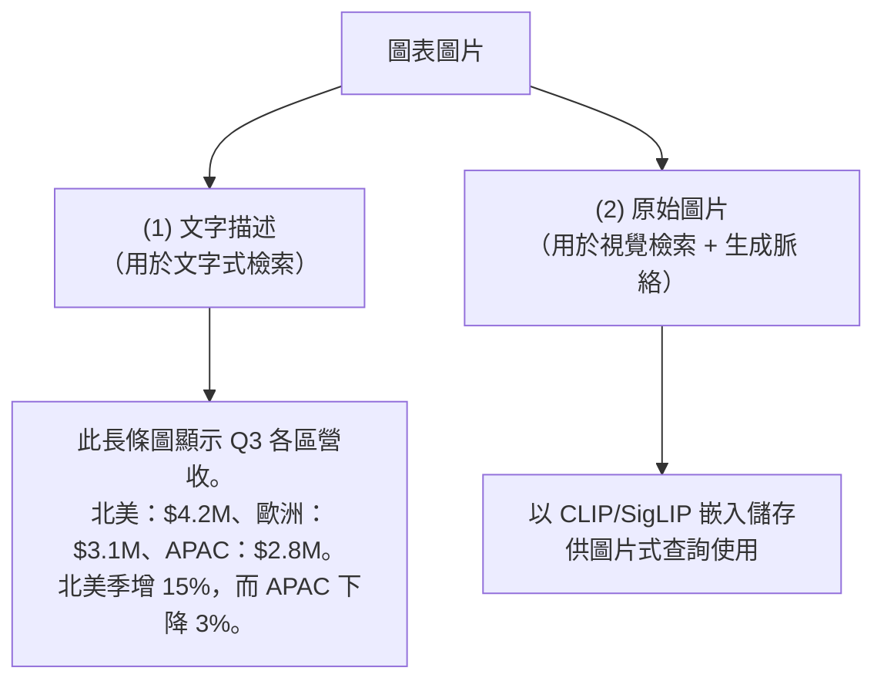
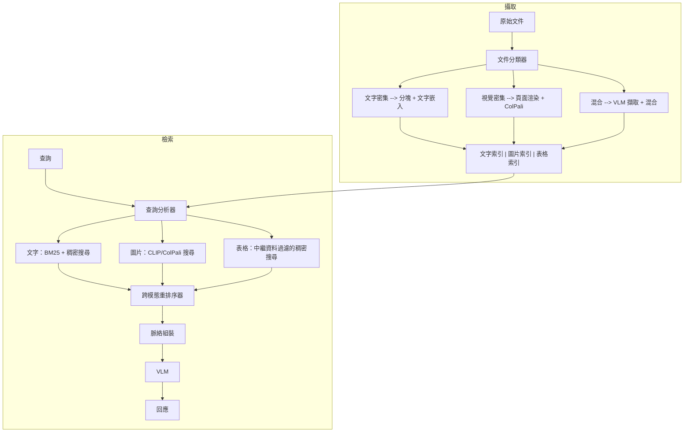

# 多模態 RAG

多模態 RAG 將檢索增強生成從純文字擴展到處理圖片、表格、圖表、音訊以及混合版面的文件。生產環境系統現在經常需要攝取含圖表的 PDF、簡報投影片、掃描發票，以及那些視覺版面「就是」其意義所在的研究論文。三種架構居於主導地位：caption-and-index（標題化並建立索引）、統一視覺文字嵌入（Cohere Embed v4、Voyage-Multimodal-3.5、Gemini Embedding 001），以及搭配 late interaction（後期互動）的 page-as-image（整頁作為圖片）（ColPali、ColQwen2.5、ColNomic）。

## 目錄

- [為什麼純文字 RAG 會失敗](#why-text-only-rag-fails)
- [架構模式](#architecture-patterns)
- [多模態嵌入策略](#multi-modal-embedding-strategies)
- [用於文件理解的視覺語言模型](#vision-language-models)
- [ColPali 與視覺式檢索](#colpali)
- [表格擷取與結構化資料檢索](#table-extraction)
- [圖表與圖解理解](#chart-understanding)
- [生產環境架構](#production-architecture)
- [實作範例](#implementation-example)
- [系統設計面試切角](#system-design-interview-angle)
- [參考資料](#references)

---

## 為什麼純文字 RAG 會失敗

傳統的 RAG 管線會把文件解析成文字區塊、進行嵌入，再針對文字查詢做檢索。這套做法在真實世界的文件上會崩潰：

| 文件元素 | 純文字 RAG 的行為 | 實際遺失的資訊 |
|-----------------|----------------------|------------------------|
| **長條圖** | 只擷取座標軸標籤 | 趨勢、比較、量級 |
| **架構圖** | 完全遺漏 | 元件關係、資料流 |
| **表格** | 攤平的列失去結構 | 列與欄的對應關係、標頭 |
| **資訊圖表** | 擷取到零散的文字片段 | 視覺層次、空間分組 |
| **附說明文字的照片** | 取得說明文字，遺失圖片 | 視覺證據、空間脈絡 |

**現實情況**：企業文件有 40-60% 是非文字內容。一份財務報告的價值就在它的圖表裡。一篇醫學論文的關鍵發現就在它的圖片中。忽略視覺內容，就等於忽略了大部分的知識。

---

## 架構模式

多模態 RAG 有三種主導模式，各有不同的取捨：

### 模式 1：統一嵌入空間



- **做法**：使用 CLIP 或 SigLIP 之類的模型，把文字與圖片投影到同一個向量空間。
- **優點**：單一索引、單一查詢、簡單的檢索邏輯。
- **缺點**：嵌入品質在不同模態間有差異；表格需要序列化。

### 模式 2：模態專屬檢索搭配融合



- **做法**：每個模態使用各自的嵌入與索引。由重排序器或 reciprocal rank fusion（RRF，倒數排名融合）合併結果。
- **優點**：每個模態都用同類最佳的嵌入；可以獨立調校各個檢索器。
- **缺點**：基礎設施更複雜；融合邏輯並不簡單。

### 模式 3：視覺優先（整頁作為圖片）



- **做法**：把每一頁文件都當成一張圖片。使用視覺語言模型（例如 ColPali）建立 patch 層級（影像區塊層級）的嵌入。透過 late interaction（MaxSim）來計分。
- **優點**：不需要 OCR、不需要版面解析、不需要表格擷取管線。可端到端訓練。
- **缺點**：建立索引時運算量較高；失去細粒度的文字搜尋能力。

**建議**：模式 3（視覺優先）在以文件為主的使用情境下正快速崛起。當你需要在視覺檢索之外同時做精確的文字搜尋時，模式 2 仍是生產環境的主力。

---

## 多模態嵌入策略

### CLIP（Contrastive Language-Image Pretraining）

最初的雙編碼器，把文字與圖片映射到共用的 512/768 維空間。

- **強項**：生態系龐大、廣為人理解、有許多微調後的變體。
- **弱項**：在文件型圖片（圖表、表格）上的表現弱於自然照片。對比損失（contrastive loss）需要很大的批次大小。

### SigLIP / SigLIP 2

以 sigmoid 損失取代 CLIP 的 softmax 交叉熵，讓每一組圖片與文字配對都能獨立評估。

- **SigLIP 2（2025）**：加入了字幕解碼器、自蒸餾（self-distillation）以及遮罩預測。在橫跨 109 種語言的 10B+ 張圖片上訓練。
- **關鍵勝出點**：在小批次大小（4-8k）下勝過 CLIP，並提供更稠密、更穩健的特徵。
- **生產環境應用**：挪威國家圖書館、電商視覺搜尋、AI 藝術策展。

### 用於 RAG 的比較

| 模型 | 最適合 | 嵌入維度 | 文件品質 | 自然圖片品質 |
|-------|----------|--------------|-----------------|----------------------|
| CLIP ViT-L/14 | 通用用途 | 768 | 中 | 高 |
| SigLIP 2 So400m | 多語言文件 | 1152 | 高 | 高 |
| Nomic Embed Vision | 文字密集文件 | 768 | 高 | 中 |
| Voyage Multimodal 3 | 混合文件 | 1024 | 高 | 高 |

### 嵌入策略決策



---

## 用於文件理解的視覺語言模型

VLM 在多模態 RAG 中扮演兩個角色：(1) 作為從檢索到的多模態脈絡中綜合出答案的**生成器**，以及 (2) 作為在攝取階段擷取結構化資訊的**索引引擎**。

### VLM 能力比較

| 能力 | Claude Opus 4.7 / Sonnet 4.6 | GPT-5.5 | Gemini 3.1 Pro |
|-----------|------------------------------|---------|----------------|
| **圖表判讀** | 優異 | 優異 | 優異 |
| **表格擷取** | 優異 | 良好 | 優異 |
| **圖解理解** | 優異 | 良好 | 優異 |
| **手寫 OCR** | 良好 | 良好 | 良好 |
| **多頁推理** | 優異（Sonnet 4.6 為 1M ctx） | 優異（1M ctx） | 優異（1M ctx） |
| **結構化輸出** | 原生 JSON 模式 | 原生 JSON 模式 | 原生 JSON 模式 |

### VLM 增強的攝取管線



這種「先描述再嵌入」的做法，把視覺內容轉換成可搜尋的文字，同時為生成步驟保留原始圖片。

---

## ColPali 與視覺式檢索

ColPali 代表了一種典範轉移：不再建構複雜的 OCR + 版面 + 表格擷取管線，而是把每一頁文件當成一張圖片，讓視覺語言模型處理所有事情。

### ColPali 如何運作



### ColPali 與傳統管線的比較

| 面向 | 傳統管線 | ColPali |
|--------|---------------------|---------|
| **OCR** | 必要（Tesseract、Azure OCR） | 不需要 |
| **版面偵測** | 必要（Detectron2、LayoutLM） | 不需要 |
| **表格解析器** | 必要（Camelot、Tabula） | 不需要 |
| **圖表擷取器** | 必要（ChartOCR） | 不需要 |
| **索引建立速度** | 慢（多階段） | 快（單次前向傳遞） |
| **檢索品質** | 文字上高，視覺上差 | 在所有模態上都高 |
| **儲存** | 文字索引（約小） | 多向量索引（約較大） |

### ColPali 家族

- **ColPali (v1)**：以 PaliGemma-3B 為骨幹。最初的版本。
- **ColQwen 2.5**：以 Qwen2-VL 為骨幹。多語言支援更佳，在亞洲語言文件上有所改進。
- **ColSmol**：用於邊緣部署的較小變體。約 1B 參數。

### ViDoRe 基準測試結果

ColPali 在視覺上複雜的基準測試（例如分別測試資訊圖表、圖片與表格的 InfographicVQA、ArxivQA 與 TabFQuAD）上表現優異。即使在以文字為中心的文件上，它也勝過傳統的文字式管線。

---

## 表格擷取與結構化資料檢索

表格是傳統 RAG 最難處理的模態。逐列攤平一張表格，會摧毀那些賦予每個儲存格意義的欄與標頭關係。

### 策略 1：VLM 式擷取

```python
# Pseudocode: Extract tables using a VLM
def extract_tables_from_page(page_image: bytes) -> list[dict]:
    prompt = """
    Extract ALL tables from this document page.
    For each table, return:
    {
      "title": "table title or caption",
      "headers": ["col1", "col2", ...],
      "rows": [["val1", "val2", ...], ...],
      "markdown": "| col1 | col2 |\\n|---|---|\\n| val1 | val2 |"
    }
    Return JSON array. If no tables, return [].
    """
    response = vlm.generate(image=page_image, prompt=prompt)
    return json.loads(response)
```

### 策略 2：專用表格解析器

- **Tabula / Camelot**：基於規則的 PDF 表格擷取。速度快，但在複雜版面上很脆弱。
- **Table Transformer（DETR 式）**：從圖片中偵測表格邊界與儲存格結構。
- **Unstructured.io**：結合啟發式規則與機器學習模型，做版面感知的解析。

### 策略 3：表格感知分塊



**關鍵原則**：表格必須是原子化的檢索單位。絕不可讓一張表格跨越區塊邊界被切開。

---

## 圖表與圖解理解

### 圖表類型與擷取方法

| 圖表類型 | 要擷取什麼 | 最佳方法 |
|-----------|----------------|---------------|
| **長條圖／折線圖／圓餅圖** | 資料值、趨勢、比較 | VLM 描述 + 資料表擷取 |
| **流程圖** | 步驟、決策、連線 | VLM 結構化擷取（節點 + 邊） |
| **架構圖** | 元件、關係、資料流 | VLM 描述 + 實體擷取 |
| **散佈圖** | 相關性、離群值、群集 | VLM 趨勢描述 + 原始資料（若有） |
| **甘特圖** | 時間軸、相依性、里程碑 | VLM 結構化擷取 |

### 雙重表示策略

對每一張圖表或圖解，儲存兩種表示：



這確保了圖表既能透過文字查詢（「APAC 的營收是多少？」）被檢索到，也能透過視覺查詢（「給我看那張營收圖表」）被檢索到。

---

## 生產環境架構

### 完整的多模態 RAG 管線



### 擴展考量

| 考量點 | 解決方案 |
|---------|----------|
| **索引大小** | ColPali 每頁儲存約 1024 個向量。1M 頁就是約 1B 個向量。使用量化（binary、PQ）。 |
| **攝取延遲** | VLM 擷取很慢（約 2-5 秒/頁）。使用搭配 GPU 加速的非同步 worker。 |
| **查詢延遲** | 多索引扇出會增加延遲。使用平行檢索 + 積極的 top-k 修剪。 |
| **成本** | 攝取時的 VLM 呼叫是一次性的。攤提到查詢量上。擷取的預算抓 $0.01-0.05/頁。 |
| **儲存** | 把頁面圖片存在物件儲存（S3）。把嵌入存在向量資料庫。把文字存在搜尋索引。 |

---

## 實作範例

### 使用 ColPali + VLM 的端到端多模態 RAG

```python
# Pseudocode: Production multi-modal RAG pipeline

from colpali_engine import ColPali, ColPaliProcessor
from qdrant_client import QdrantClient
import anthropic

# --- INDEXING ---

def index_document(pdf_path: str, collection: str):
    """Index a PDF document using ColPali for visual retrieval
    and VLM extraction for text-based retrieval."""

    pages = render_pdf_to_images(pdf_path, dpi=300)

    colpali_model = ColPali.from_pretrained("vidore/colpali-v1.3")
    processor = ColPaliProcessor.from_pretrained("vidore/colpali-v1.3")
    vlm_client = anthropic.Anthropic()

    for page_num, page_image in enumerate(pages):
        # 1. Generate ColPali multi-vector embeddings
        inputs = processor(images=[page_image])
        patch_embeddings = colpali_model(**inputs)  # shape: [1, 1024, 128]

        # 2. Extract structured content via VLM
        extraction = vlm_client.messages.create(
            model="claude-sonnet-4-20250514",
            max_tokens=4096,
            messages=[{
                "role": "user",
                "content": [
                    {"type": "image", "source": encode_image(page_image)},
                    {"type": "text", "text": """Extract from this page:
                    1. All text content (preserve structure)
                    2. Tables as markdown
                    3. Chart descriptions with data points
                    Return as JSON with keys: text, tables, charts"""}
                ]
            }]
        )

        structured = json.loads(extraction.content[0].text)

        # 3. Store in vector DB
        qdrant.upsert(collection, points=[
            # ColPali multi-vector for visual retrieval
            PointStruct(
                id=f"{pdf_path}:page:{page_num}:colpali",
                vector={"colpali": patch_embeddings[0].tolist()},
                payload={
                    "source": pdf_path,
                    "page": page_num,
                    "type": "page_image",
                    "text_preview": structured["text"][:500]
                }
            ),
            # Text embeddings for each extracted element
            *create_text_chunks(structured, pdf_path, page_num)
        ])


# --- RETRIEVAL ---

def retrieve(query: str, collection: str, top_k: int = 5):
    """Hybrid retrieval: ColPali visual + text semantic search."""

    # Visual retrieval via ColPali
    query_inputs = processor(text=[query])
    query_embeddings = colpali_model(**query_inputs)

    visual_results = qdrant.query(
        collection,
        query_vector=("colpali", query_embeddings[0].tolist()),
        limit=top_k,
        query_filter=Filter(must=[FieldCondition(key="type", match="page_image")])
    )

    # Text retrieval via dense embeddings
    text_embedding = text_encoder.encode(query)
    text_results = qdrant.search(
        collection,
        query_vector=("text", text_embedding.tolist()),
        limit=top_k
    )

    # Fuse results using reciprocal rank fusion
    fused = reciprocal_rank_fusion(visual_results, text_results, k=60)
    return fused[:top_k]


# --- GENERATION ---

def generate_answer(query: str, retrieved_context: list) -> str:
    """Generate answer using VLM with multi-modal context."""

    content_blocks = [{"type": "text", "text": f"Question: {query}\n\nContext:"}]

    for ctx in retrieved_context:
        if ctx.payload["type"] == "page_image":
            # Include the actual page image
            content_blocks.append({
                "type": "image",
                "source": load_page_image(ctx.payload["source"], ctx.payload["page"])
            })
        else:
            # Include text/table content
            content_blocks.append({
                "type": "text",
                "text": f"[{ctx.payload['type']}] {ctx.payload['content']}"
            })

    content_blocks.append({
        "type": "text",
        "text": "Answer the question using ONLY the provided context. Cite sources."
    })

    response = vlm_client.messages.create(
        model="claude-sonnet-4-20250514",
        max_tokens=2048,
        messages=[{"role": "user", "content": content_blocks}]
    )
    return response.content[0].text
```

---

## 系統設計面試切角

### Q：為一個金融研究平台設計一套 RAG 系統，它需要回答關於財報的問題，而這些財報含有文字、表格與圖表。

**有力的回答：**

核心挑戰在於，財報中有 60% 以上的資訊存在於表格與圖表裡，而不在散文之中。純文字的 RAG 管線會漏掉營收細項、趨勢線以及比較資料。

**架構**：我會採用混合做法（模式 2 + 模式 3 的元素）：

1. **攝取**：把每一頁 PDF 以 300 DPI 渲染。執行一次 VLM 擷取，把表格轉成 markdown、把圖表轉成結構化描述。同時為每一頁圖片生成 ColPali 多向量嵌入。

2. **儲存**：三個索引，(a) 帶稠密嵌入的文字區塊（金融文字），(b) 帶稠密嵌入再加上表格類型的中繼資料過濾器的表格 markdown，(c) 用於頁面層級視覺檢索的 ColPali 多向量索引。

3. **檢索**：查詢分析器會分類查詢類型。「Q3 營收是多少？」會觸發文字 + 表格搜尋。「給我看營收趨勢」會觸發視覺（ColPali）搜尋。結果透過 RRF 融合，並由 cross-encoder 重排序。

4. **生成**：一個 VLM（Claude 或 Gemini）接收融合後的脈絡，包含文字區塊、表格 markdown 以及相關的頁面圖片。它會生成一個有接地（grounding）的答案，並引用到特定的頁面與表格。

**關鍵取捨**：ColPali 在視覺內容上提供優異的召回率，但每頁儲存約 1024 個向量，因此對 100k 份文件（500k 頁）來說，那就是約 500M 個向量。我會使用 binary 量化把儲存量降低 32 倍，並接受小幅的召回率損失。在文字路徑上，BM25 + 稠密混合搜尋能很好地處理金融術語。

### Q：你會如何處理一個需要同時用到位於不同頁面的圖表「與」表格資訊的查詢？

**有力的回答：**

這是跨模態、跨頁面的檢索問題。解法分為三個部分：

1. **檢索多樣性**：確保檢索器會回傳來自多個模態的結果。設定最低配額，無論哪個模態的分數最高，每一組檢索結果中都至少要有 2 個文字結果、2 個表格結果與 1 個視覺結果。

2. **脈絡組裝**：在組裝 VLM 提示時，把所有檢索到的內容連同明確的出處一併納入：「[第 14 頁的表格：Q3 各區營收]」以及「[第 22 頁的圖表：2024-2026 營收趨勢]」。VLM 接著就能跨兩者進行推理。

3. **代理式後援**：如果初始檢索沒有帶出足夠的跨模態脈絡，一個代理式的層可以發出後續檢索：「表格顯示了營收數字，但使用者問的是趨勢，讓我也搜尋一下與營收相關的圖表。」

關鍵洞見在於，跨模態的問題本質上就是多跳（multi-hop）的。系統需要先從一個模態檢索、辨識出缺口、再從另一個模態檢索。

---

## 參考資料

- Faysse et al. "ColPali: Efficient Document Retrieval with Vision Language Models" (ICLR 2025)
- Google. "SigLIP 2: Multilingual Vision-Language Encoders" (2025)
- NVIDIA. "An Easy Introduction to Multimodal Retrieval-Augmented Generation" (2025)
- HKUDS. "RAG-Anything: All-in-One Multimodal RAG Framework" (2025)
- Vespa Blog. "PDF Retrieval with Vision Language Models" (2024)

---

*上一篇：[進階檢索模式](09-advanced-retrieval-patterns.md) | 下一篇：[RAG 評估模式](13-rag-evaluation-patterns.md)*
