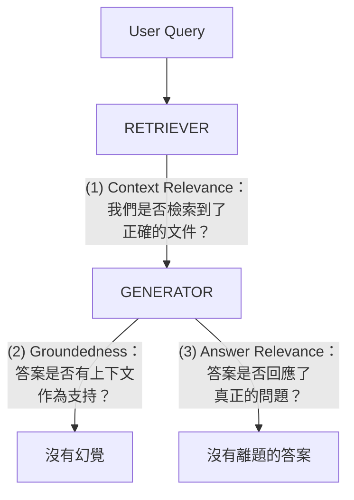
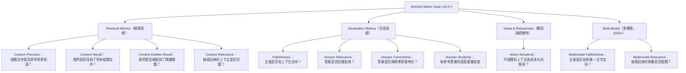
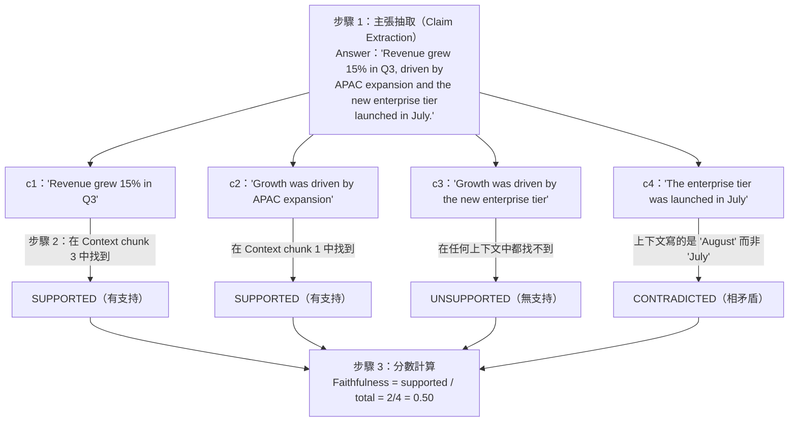
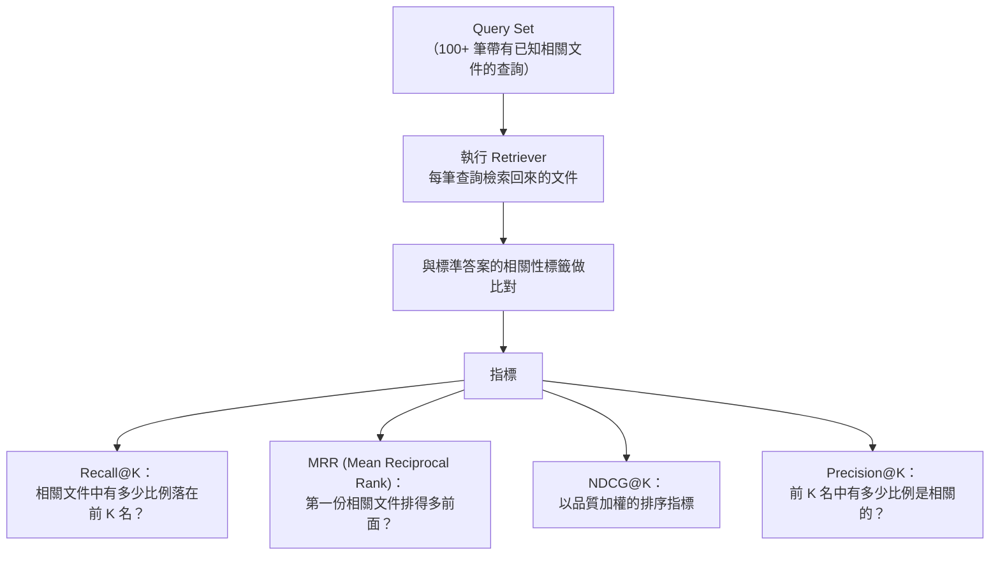
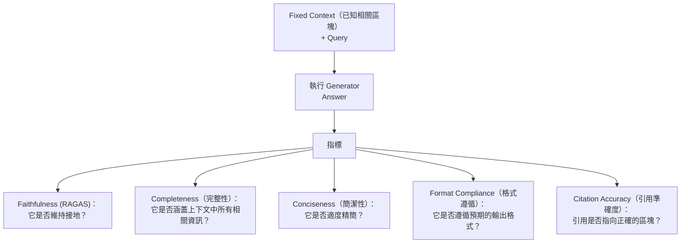
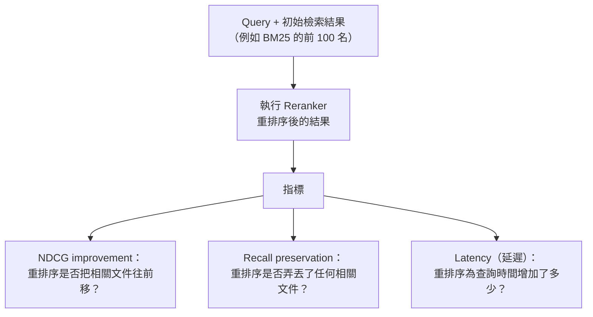
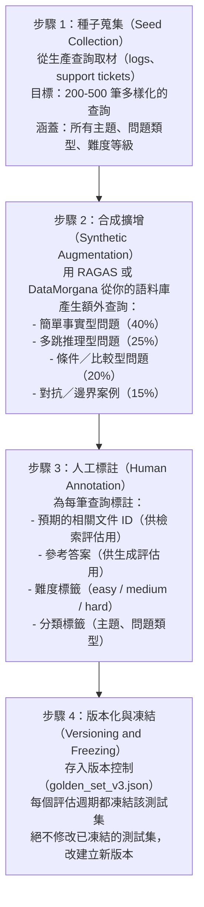
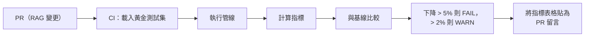
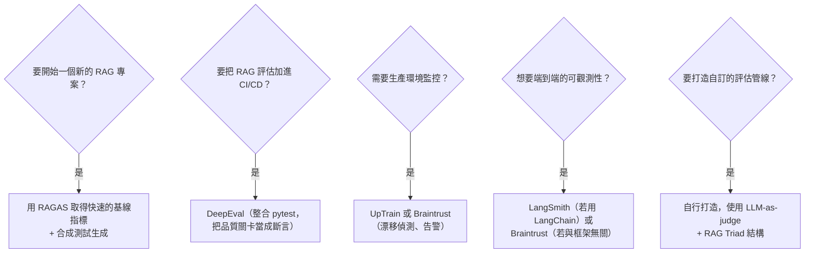

# RAG 評估模式

評估是 RAG 中最難、且尚未解決的問題。你可以在一天內建好一條檢索管線；但要知道它是否真的有效，卻得花上好幾週。業界已經收斂出一套分層的評估策略：用 RAG Triad 檢查正確性、用元件層級的指標來除錯，以及用自動化的回歸測試來確保生產環境的安全。Langfuse、LangWatch、Braintrust 與 Arize Phoenix 都提供原生的 RAG 評估範本；請依部署模式（自架 vs SaaS）以及是否需要由評估把關的 CI/CD 阻擋機制來挑選。

## 目錄

- [RAG Triad](#the-rag-triad)
- [RAGAS 框架與指標](#ragas-framework)
- [元件層級評估](#component-level-evaluation)
- [用於 RAG 的 LLM-as-Judge](#llm-as-judge)
- [建立黃金測試集](#golden-test-sets)
- [自動化回歸測試](#regression-testing)
- [生產環境監控](#production-monitoring)
- [大規模評估的成本](#cost-at-scale)
- [工具比較](#tools-comparison)
- [系統設計面試切入點](#system-design-interview-angle)
- [參考資料](#references)

---

## RAG Triad

RAG Triad 是評估 RAG 系統的基礎框架。它把正確性拆解成三個彼此獨立的維度，每一個維度各自捕捉一種不同的失敗模式。



### 維度 1：Context Relevance（上下文相關性）

**問題**：每個檢索回來的區塊是否真的與使用者查詢相關？

**它能捕捉什麼**：糟糕的檢索，向量搜尋回傳了主題錯誤的文件，或是查詢本身模稜兩可，導致檢索器猜錯了方向。

**如何衡量**：
- 對每個檢索回來的區塊提問：「這個區塊與回答查詢相關嗎？」
- 分數：（相關區塊數）/（檢索回來的區塊總數）
- 分數為 0.3 代表有 70% 的檢索上下文是雜訊，迫使 LLM 在一堆不相關的乾草中找一根針。

**為什麼重要**：低 context relevance 是大多數 RAG 失敗的根本原因。即使是完美的生成器，也無法從不相關的上下文中產出好答案。

### 維度 2：Groundedness（接地性 / 忠實度）

**問題**：生成答案中的每一項主張，是否都有檢索回來的上下文作為支持？

**它能捕捉什麼**：幻覺，LLM 生成了聽起來合理、但檢索文件中根本不存在的主張。

**如何衡量**：
- 把答案拆解成一個個獨立的主張／陳述。
- 對每一項主張，在檢索回來的上下文中尋找支持的證據。
- 分數：（有支持的主張數）/（主張總數）
- 分數為 0.7 代表有 30% 的答案是幻覺出來的。

**為什麼重要**：這是企業客戶最在意的指標。一個不忠實的 RAG 系統比完全不用 RAG 還糟，因為它會產出聽起來很有自信、卻是錯誤的答案，還附上假的引用。

### 維度 3：Answer Relevance（答案相關性）

**問題**：最終的答案是否真的回應了使用者所問的問題？

**它能捕捉什麼**：離題的答案，檢索做得好、答案也接地，但它就是沒有回答問題。當檢索器找到「相關但不對題」的內容時，這種情況很常見。

**如何衡量**：
- 生成 N 個假設性問題，這些問題能讓該答案成為一個好的回應。
- 衡量這些假設性問題與原始查詢之間的語意相似度。
- 高相似度代表答案切題。

**為什麼重要**：一個系統可以檢索到相關的上下文、並忠實地把它摘要出來，卻仍然沒搔到問題的癢處。Answer relevance 能捕捉這種情況。

### Triad 失敗模式

| 失敗模式 | Context Relevance | Groundedness | Answer Relevance | 根本原因 |
|----------------|-------------------|-------------|-----------------|------------|
| 良好的 RAG | 高 | 高 | 高 | 系統運作正常 |
| 糟糕的檢索 | **低** | 高 | 低 | 嵌入或搜尋設定錯誤 |
| 幻覺 | 高 | **低** | 高 | LLM 忽略上下文，提示問題 |
| 離題的答案 | 高 | 高 | **低** | 查詢模稜兩可、索引錯誤 |
| 全面失敗 | **低** | **低** | **低** | 管線根本性的問題 |

---

## RAGAS 框架與指標

RAGAS（Retrieval Augmented Generation Assessment）是目前採用最廣的開源 RAG 評估框架，提供不需要標準答案（reference-free）的指標，無須仰賴 ground-truth 答案。

### RAGAS 核心指標



### RAGAS Faithfulness 的運作原理（底層機制）



### RAGAS Context Precision 的運作原理

```
  Retrieved chunks ranked by retriever score:
    Rank 1: Chunk about Q3 revenue    --> Relevant (v_1 = 1)
    Rank 2: Chunk about company history --> Not relevant (v_2 = 0)
    Rank 3: Chunk about Q3 expenses   --> Relevant (v_3 = 1)
    Rank 4: Chunk about office locations --> Not relevant (v_4 = 0)

  Context Precision@K:
    Precision@1 = 1/1 = 1.0
    Precision@2 = 1/2 = 0.5
    Precision@3 = 2/3 = 0.67
    Precision@4 = 2/4 = 0.5

  Average Precision = (1.0*1 + 0.5*0 + 0.67*1 + 0.5*0) / 2
                    = (1.0 + 0.67) / 2 = 0.835
```

### RAGAS vs. 需要標準答案的指標

| 指標 | 需要 Ground Truth 嗎？ | 它衡量什麼 |
|--------|-------------------|------------------|
| Faithfulness | 否 | 主張是否有上下文支持 |
| Context Relevance | 否 | 檢索回來的區塊相關性 |
| Answer Relevance | 否 | 答案是否回應查詢 |
| Context Recall | **是** | 對標準答案的涵蓋程度 |
| Answer Correctness | **是** | 與標準答案的吻合度 |
| Answer Similarity | **是** | 與標準答案的語意重疊程度 |

**洞見**：先從不需要標準答案的指標（faithfulness、context relevance、answer relevance）開始，以便快速迭代。等你有了黃金測試集可做回歸測試後，再加入需要 ground-truth 的指標。

---

## 元件層級評估

RAG Triad 是對系統做端到端的評估。元件層級評估則是把每個階段隔離出來，以精準定位失敗點。

### 檢索器評估



**關鍵檢索器基準測試**：

| 指標 | 最低門檻 | 良好 | 優異 |
|--------|------------------|------|-----------|
| Recall@10 | 0.70 | 0.85 | 0.95+ |
| MRR | 0.50 | 0.70 | 0.85+ |
| NDCG@10 | 0.50 | 0.70 | 0.85+ |
| Precision@5 | 0.40 | 0.60 | 0.80+ |

### 生成器評估

固定檢索上下文、只變動生成的部分，藉此把生成器隔離出來。



### 重排序器評估



---

## 用於 RAG 的 LLM-as-Judge

用一個 LLM 來評估另一個 LLM 的輸出，是目前主流的評估範式。它能擴展到人工評估無法企及的規模，但也有已知的偏誤。

### 運作方式

```
  Evaluation Prompt Template:
You are evaluating a RAG system. Given:
- User Query: {query}
- Retrieved Context: {context}
- Generated Answer: {answer}

Rate the following on a scale of 1-5:
1. Faithfulness: Are all claims in the answer supported by
   the context? (1=hallucinated, 5=fully grounded)
2. Relevance: Does the answer address the user's question?
   (1=off-topic, 5=directly answers)
3. Completeness: Does the answer cover all relevant info?
   (1=missing key info, 5=comprehensive)

Provide scores and brief justifications in JSON.
```

### 已知偏誤與緩解方式

| 偏誤 | 描述 | 緩解方式 |
|------|-------------|------------|
| **冗長偏好（Verbosity）** | LLM 評審偏好較長的答案 | 依答案長度將分數正規化；加入簡潔度懲罰 |
| **自我偏好（Self-preference）** | GPT-4 給 GPT-4 的答案打較高分 | 使用與生成器不同的評審模型 |
| **位置偏誤（Position）** | A/B 比較中第一個選項被打較高分 | 隨機化呈現順序 |
| **諂媚（Sycophancy）** | 評審傾向同意被評估的系統 | 使用帶有具體準則的結構化評分表 |
| **寬容偏誤（Leniency）** | LLM 很少給出低於 3/5 的分數 | 改用二元（pass/fail）而非 Likert 量表 |

### LLM-as-Judge 的最佳實務

1. **以二元判斷取代量表**：「這項主張有被支持嗎？YES/NO」比「請以 1-5 評分支持程度」更可靠。
2. **拆解成原子化的評估**：一次只評估一項主張或一個維度。
3. **要求附上證據**：強制評審引用支持／反駁每項主張的具體上下文段落。
4. **以人類一致性做校準**：拿 100 個以上的範例，同時讓 LLM 與人類評審打分。衡量 Cohen's Kappa，目標 > 0.7。
5. **使用當下最強的可用模型**：用 Claude Opus 或 GPT-4o 當評審；絕對不要用產出該答案的同一個模型。

---

## 建立黃金測試集

黃金測試集是一份經過策劃、有版本控制的（query, expected_context, expected_answer）三元組集合，作為回歸測試的標準答案（ground truth）。

### 建立流程



### 黃金測試集的組成指引

| 問題類型 | 比例 | 目的 |
|--------------|-----------|---------|
| 簡單事實型 | 40% | 基線：應該永遠通過 |
| 多跳推理型 | 25% | 測試跨文件檢索 |
| 比較型 | 15% | 測試對多份相關文件的檢索 |
| 時間性 | 10% | 測試對有版本／日期內容的處理 |
| 對抗型 | 10% | 測試穩健性（無法回答、超出範圍） |

### 用 RAGAS 做合成測試生成

```python
# Pseudocode: Generate synthetic test queries from your corpus
from ragas.testset.generator import TestsetGenerator
from ragas.testset.evolutions import simple, reasoning, multi_context

generator = TestsetGenerator.from_langchain(
    generator_llm=ChatOpenAI(model="gpt-4o"),
    critic_llm=ChatOpenAI(model="gpt-4o"),
)
testset = generator.generate_with_langchain_docs(
    documents=load_documents("./knowledge_base/"),
    test_size=200,
    distributions={simple: 0.4, reasoning: 0.35, multi_context: 0.25}
)
# CRITICAL: Always human-review synthetic data before using as ground truth
testset.to_pandas().to_csv("golden_set_draft_v4.csv")
```

**警告**：合成測試集是起點，不是終點。請務必透過人工審查來驗證，以免你測試的對象其實是生成模型的人工產物（artifacts）。

---

## 自動化回歸測試

每一次 RAG 管線的變更（新的嵌入、區塊大小、提示修改、重排序器替換）在部署前都需要做自動化回歸測試。

### CI/CD 整合



### 品質關卡（Quality Gates）

| 指標 | 絕對最低值 | 回歸門檻 |
|--------|-----------------|---------------------|
| Recall@10 | 0.85 | 較基線下降 5% |
| MRR | 0.70 | 下降 5% |
| Faithfulness | 0.80 | 下降 3% |
| Answer Relevance | 0.75 | 下降 5% |
| Answer Correctness | 0.70 | 下降 5% |

任何低於其絕對最低值的指標都會阻擋該 PR。任何超出門檻的回歸都會觸發警告，並標記出具體退化的那些查詢。

---

## 生產環境監控

離線評估是必要的，但還不夠。生產環境的查詢與測試集並不相同，而且隨著語料庫變動，檢索品質會隨時間退化。

### 關鍵生產環境訊號

| 訊號 | 它偵測什麼 | 如何衡量 |
|--------|----------------|----------------|
| **空檢索率（Empty Retrieval Rate）** | 沒有任何相關結果的查詢 | top-1 相似度 < 門檻的查詢佔比 |
| **相似度分數漂移（Similarity Score Drift）** | 嵌入或語料庫退化 | 追蹤平均相似度隨時間的變化；下降時告警 |
| **Faithfulness 抽樣** | 生產環境中的幻覺比率 | 對 5-10% 的隨機樣本執行 LLM-as-judge |
| **使用者回饋相關性** | 指標是否符合真實品質 | 將讚／倒讚與自動化分數做比對 |
| **延遲 P99** | 效能退化 | 追蹤檢索 + 生成的延遲 |
| **Token 用量** | 成本漂移 | 監控每筆查詢的平均上下文 token 數 |

### 檢索品質漂移

當語料庫變動、但嵌入、區塊或提示沒有跟上時，就會發生漂移。四種常見情境：(1) 帶有不同詞彙的新文件造成嵌入空間不匹配，可透過重新嵌入受影響的集合來修正；(2) 使用者查詢模式轉向沒有內容的主題，可透過空檢索率監控來偵測；(3) 過時內容回傳了陳舊的答案，可加入新鮮度（freshness）的中繼資料並優先選用較新的文件；(4) 嵌入模型更新改變了相似度分布，在模型變更後須重新校準所有門檻。

---

## 大規模評估的成本

LLM-as-judge 評估很強大，但成本高昂。理解其成本結構，是編列預算的關鍵。

### 每筆查詢的成本（完整 RAG Triad）

| 指標 | LLM 呼叫次數 | Tokens | GPT-4o 成本 | Claude Haiku 成本 |
|--------|-----------|--------|-------------|-------------------|
| Faithfulness | ~3（抽取 + 驗證） | ~3k | $0.0075 | $0.00075 |
| Context Relevance | ~5（每個區塊） | ~2.5k | $0.00625 | $0.000625 |
| Answer Relevance | ~2（問題生成） | ~1.6k | $0.004 | $0.0004 |
| **完整 Triad** | **~10** | **~7k** | **~$0.018** | **~$0.002** |

### 擴展策略

| 評估類型 | 頻率 | 量 | 評審模型 | 每月成本（每天 10k 筆查詢） |
|----------------|-----------|--------|-------------|-------------------------------|
| **CI 回歸** | 每個 PR | 黃金測試集（500 筆查詢） | GPT-4o | 每次執行約 $9 |
| **夜間批次** | 每天 | 隨機 1k 筆生產查詢 | Claude Haiku | 每月約 $60 |
| **生產抽樣** | 即時 | 5% 的流量 | Claude Haiku | 每月約 $300 |
| **深度稽核** | 每週 | 完整黃金測試集 + 分析 | GPT-4o | 每月約 $36 |

**洞見**：高量的生產抽樣請用 Claude Haiku 4.5 或 GPT-5.5-mini。把 Claude Opus 4.7 或 GPT-5.5 保留給 CI 回歸測試與深度稽核，在這些場景下準確度比成本更重要。

---

## 工具比較

### 框架總覽

| 工具 | 最適合 | 開源 | 主要強項 | 主要弱點 |
|------|----------|------------|--------------|--------------|
| **RAGAS** | 快速 RAG 評估、合成資料 | 是 | 不需標準答案的指標、社群活躍 | 指標結果缺乏解釋 |
| **DeepEval** | CI/CD 整合、為 LLM 做 TDD | 是 | 相容 pytest、分數能自我解釋 | 設定較繁重 |
| **TruLens** | RAG Triad 評估、可觀測性 | 是 | 首創 RAG Triad、追蹤功能佳 | 開發活躍度較低 |
| **UpTrain** | 生產環境監控、漂移偵測 | 是 | 混合式評估（LLM + 啟發式）、漂移告警 | 排序準確度較低 |
| **Braintrust** | 團隊協作、實驗追蹤 | 商業 | 最佳 UI/UX、實驗比較 | 進階功能需付費 |
| **LangSmith** | LangChain 生態系、追蹤 | 商業 | 深度整合 LangChain、追蹤功能 | 綁定於 LangChain 生態系 |

### 何時該用什麼



### 自訂評估器模式

自訂評估器的核心模式很簡單：對每個 triad 維度，使用二元的 LLM-as-judge 呼叫並彙總結果。

```python
# Pseudocode: Core faithfulness evaluator (other dimensions follow the same pattern)

def evaluate_faithfulness(answer: str, context: str, judge) -> float:
    # Step 1: Extract atomic claims from the answer
    claims = judge.generate(f"List every factual claim as a JSON array:\n{answer}")

    # Step 2: Verify each claim against context (binary YES/NO)
    supported = sum(
        1 for claim in json.loads(claims)
        if "YES" in judge.generate(
            f"Is this claim supported by the context? YES or NO.\n"
            f"Claim: {claim}\nContext: {context}"
        ).upper()
    )
    return supported / max(len(json.loads(claims)), 1)
```

對 context relevance（逐區塊：「這與查詢相關嗎？」）與 answer relevance（生成假設性問題、衡量與原始查詢的相似度）套用同樣的「先拆解、再評審」模式。

---

## 系統設計面試切入點

### 問：你部署了一個 RAG 系統，使用者回報答案有時是錯的。你會如何有系統地診斷並修復這個問題？

**有力的回答：**

我會用 RAG Triad 來隔離失敗模式：

1. **抽樣失敗的查詢**：蒐集 50-100 筆使用者標記為答案不佳的查詢，依失敗類型分類。

2. **執行 triad**：
   - **Context Relevance 偏低？** --> 檢索問題。系統抓取了錯誤的文件。修法：檢視嵌入相似度分數、確認查詢語言是否與文件語言相符、嘗試混合搜尋（BM25 + dense）、加入重排序器。
   - **Groundedness 偏低？** --> 幻覺問題。LLM 明明有好的上下文卻在編造。修法：強化系統提示（「只能根據提供的上下文作答」）、降低 temperature、改用更聽從指令的模型，或加入引用要求。
   - **Answer Relevance 偏低？** --> 系統檢索到相關內容、也忠實地摘要了它，卻沒搔到真正的問題。修法：改善查詢理解（查詢改寫、HyDE）、加入查詢分類以路由到正確的索引。

3. **建立回歸測試**：把這 50 筆失敗的查詢拿來，標註其預期答案，並加進黃金測試集。未來每一次管線變更都必須通過這些案例。

4. **建立持續監控**：抽取 5% 的生產流量做自動化評估。當 faithfulness 掉到 0.80 以下、或 context relevance 掉到 0.60 以下時告警。

關鍵洞見在於：「答案是錯的」並不是診斷，它是症狀。RAG Triad 能把一個模糊的抱怨，轉化成具體、可採取行動的根本原因。

### 問：當你沒有標準答案（ground-truth）時，要如何評估一個 RAG 系統？

**有力的回答：**

這是最常見的真實世界情境。我會採用三層做法：

**第一層：不需標準答案的指標（第 1 天）**。RAGAS 的 faithfulness 與 context relevance 完全不需要 ground truth。它們能告訴你系統是否在產生幻覺、以及檢索是否正常運作。你可以立刻對任何查詢執行這些指標。

**第二層：合成黃金測試集（第 1 週）**。用 RAGAS TestsetGenerator 從你的語料庫產生合成的（query, answer）配對。這能為 answer correctness 與 context recall 提供近似的標準答案。人工審查一部分樣本以驗證品質。

**第三層：源自生產的黃金測試集（第 1 個月）**。從生產日誌中挖掘使用者滿意度高（按讚、沒有後續追問）的查詢。請標註者為這些查詢標上參考答案。這會建立一個能反映真實使用模式、而非合成分布的黃金測試集。

權衡點在於準確度 vs. 速度。第一層能在數小時內給你訊號，但只是近似；第三層能給你標準答案，但要花上數週。三層平行進行，先從第一層開始以取得即時回饋。

### 問：你的 RAG 評估管線每天花費 $500 在 LLM 評審呼叫上。你要如何降低它？

**有力的回答：**

四個策略，依影響力排序：

1. **分層的評審模型**：用 Claude Haiku（每筆查詢 $0.002）做生產抽樣（佔 90% 的量）。把 GPT-4o（每筆查詢 $0.018）保留給 CI 回歸測試與每週的深度稽核。光是這一項就能砍掉 80% 的成本。

2. **聰明的抽樣**：不要評估每一筆查詢。抽取 5% 的生產流量，依查詢類型與使用者區隔做分層抽樣。對 CI 而言，只跑黃金測試集（500 筆查詢），而非完整的合成測試集。

3. **快取**：許多生產查詢很相似。對（query, context, answer）元組做雜湊並快取評估結果。完全相同或近乎相同的輸入就直接取用快取的分數。

4. **啟發式預先過濾**：在呼叫 LLM 評審之前，先跑便宜的啟發式檢查。如果答案包含「我不知道」、或與上下文完全沒有重疊（ROUGE-L < 0.1），就跳過昂貴的 faithfulness 評估、直接指派分數。

目標是把評估預算花在能提供最多訊號的地方：那些模稜兩可、處於邊界的案例，正是 LLM 評審細膩推理派得上用場之處。

---

## 參考資料

- Es et al. "RAGAS: Automated Evaluation of Retrieval Augmented Generation" (2023, arXiv:2309.15217)
- TruLens. "The RAG Triad" (2024)
- DeepEval. "Using the RAG Triad for RAG Evaluation" (2025)
- Confident AI. "RAG Evaluation Metrics" (2025)
- Microsoft. "The Path to a Golden Dataset" (2025)
- Prem AI. "RAG Evaluation: Metrics, Frameworks & Testing" (2026)

---

*上一篇：[Multi-Modal RAG](12-multimodal-rag.md) | 下一篇：即將推出*
