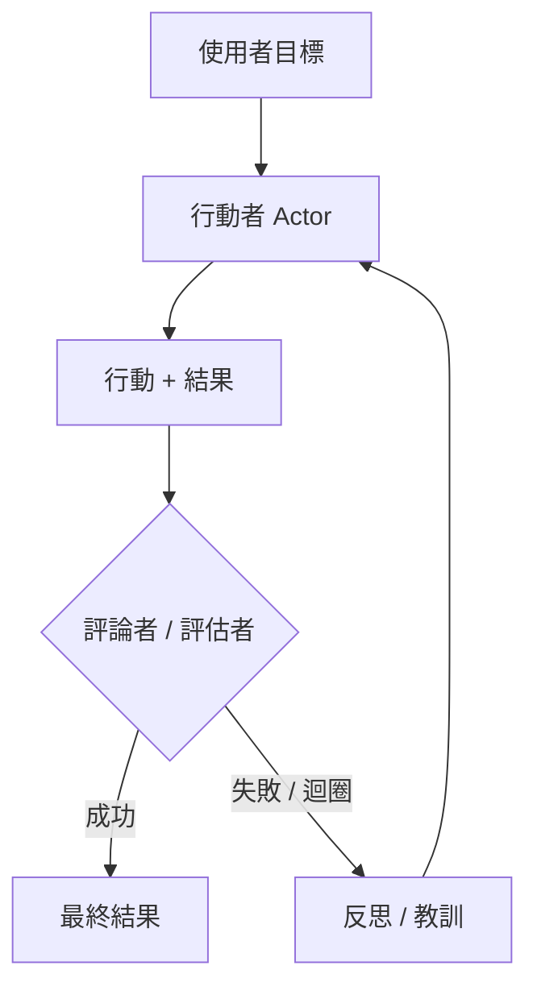

# 推理迴圈：ReAct 與其後續發展

推理迴圈定義了代理的控制流程。雖然 **ReAct** 是 2023 年的基準作法，但現今的系統會在原生支援推理的模型之上，採用更精密的模式，例如 **Plan-and-Solve**、**Self-Reflexion** 以及 **Inference-Time Scaling**。

## 目錄

- [迴圈的演進](#evolution)
- [ReAct：經典模式](#react)
- [Self-Reflexion 迴圈](#reflexion)
- [Plan-and-Solve（Soto）](#plan-and-solve)
- [Flow Engineering（LangGraph 模式）](#flow-engineering)
- [面試問題](#interview-questions)
- [參考資料](#references)

---

## 迴圈的演進

| 年代 | 模式 | 核心理念 |
|-----|---------|-----------------|
| **2023** | ReAct | 交錯進行思考與行動。 |
| **2024** | Reflexion | 評估錯誤並重新嘗試。 |
| **現今** | System 2 迴圈 | 運用隱藏的 CoT 來實現穩健的多步驟邏輯。 |

---

## ReAct：推理 + 行動

適用於 90% 代理的基本迴圈：
1. **思考（Thought）**：「我需要找到 X。」
2. **行動（Action）**：`search_engine("X")`
3. **觀察（Observation）**：「X 位於 Y。」
4. **重複（Repeat）**。

**評析**：ReAct 很脆弱。如果搜尋回傳「No results」，一個天真的 ReAct 代理往往會再次嘗試相同的搜尋。現代的迴圈會注入**「負面約束（Negative Constraints）」**（例如：「不要嘗試我們已經看過的搜尋結果」）。

---

## Self-Reflexion 迴圈

Reflexion 在迴圈中加入了一個**「評論者（Critic）」**步驟。

**好處**：透過將這些「反思」儲存在短期記憶中，代理便能在當前工作階段中，建立一張記錄「哪些方法行不通」的「心智地圖（Mental Map）」。

---

## Plan-and-Solve

代理不再是一次決定一個步驟（貪婪式作法），而是先建立一份**靜態計畫（Static Plan）**，然後再執行它。

1. **規劃者（Planner）**：「我會先做 A，然後 B，再來 C。」
2. **執行者（Executor）**：實際執行這些步驟。
3. **重新規劃者（Re-planner）**：如果步驟 B 失敗，就觸發一次完整的重新規劃，而不是進行局部修補。

**為什麼？**：規劃能減少「隨機性錯誤（Stochastic Errors）」。藉由鎖定一條路徑，模型比較不容易被吵雜的工具結果分散注意力。

---

## Flow Engineering（LangGraph）

現代的代理式系統已經從「聊天介面」轉變為**「狀態機（State Machines）」**。

- **循環圖（Cyclic Graphs）**：我們不再採用線性序列，而是定義一張圖，讓模型可以多次循環回到「清理（Cleaning）」節點或「驗證（Validation）」節點。
- **微代理（Micro-Agents）**：圖中的每個節點都是一個專門的「提示」或「工具」。

**關鍵細節**：「代理」不再只是 LLM；代理是**圖執行引擎（Graph Execution Engine）**。

---

## 面試問題

### Q：你會在什麼情況下使用「推理迴圈」（ReAct），又會在什麼情況下使用「Plan-and-Solve」架構？

**強力回答：**
對於**探索性（Exploratory）**任務，當環境難以預測時（例如：瀏覽一個你還不清楚其 URL 結構的全新網站），我會選擇 **ReAct**。代理需要對每一次觀察做出反應。對於**可預測**但複雜的工作流程（例如：從 5 個已知的 API 產生財務報告），我會選擇 **Plan-and-Solve**。規劃可以防止模型「漫無目的地遊走」，並且讓彼此互不相依的步驟能夠更好地平行化處理。

### Q：什麼是「Inference-Time Scaling」？它與代理式迴圈有何關聯？

**強力回答：**
Inference-Time Scaling（通常與 OpenAI 的 o1 相關聯）指的是在*回應產生期間*投入更多運算資源，而不只是在訓練期間。在代理的情境中，這代表模型不會只是輸出第一個看起來合理的行動。它會運用一棵**搜尋樹（Search Tree）**（類似蒙地卡羅樹搜尋，Monte Carlo Tree Search），在內部模擬不同的行動路徑，然後才鎖定最有可能成功的那一條。這能減少所需的「真實世界」工具呼叫次數，節省外部 API 成本並降低失敗率。

---

## 參考資料
- Yao et al. "ReAct: Synergizing Reasoning and Acting" (2022/2025 update)
- Shinn et al. "Reflexion: Language Agents with Iterative Homeostatic Learning" (2024)
- Wang et al. "Plan-and-Solve Prompting" (2023)

---

*下一篇：[工具使用與 Model Context Protocol（MCP）](03-tool-use-and-mcp.md)*
