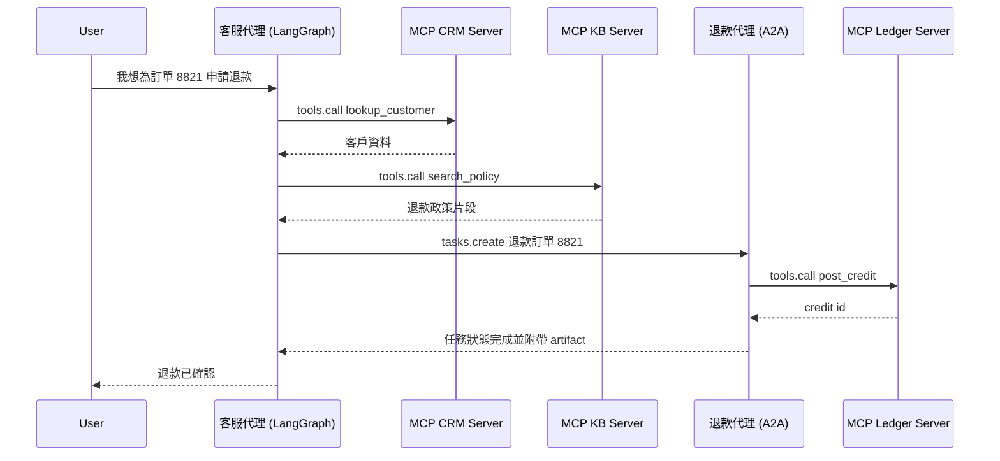
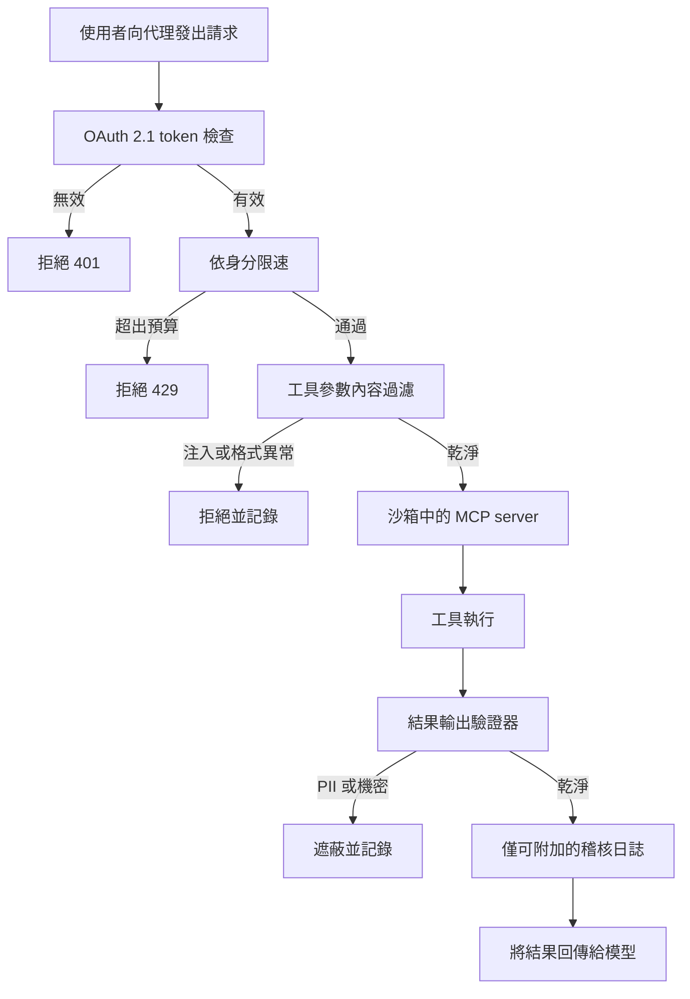

# 工具使用與 MCP

工具是代理的「雙手」。業界已標準化在 **Model Context Protocol (MCP)** 上，它以統一、本地優先的通訊層取代了零散的自訂工具定義。MCP 已迅速成熟：Streamable HTTP 傳輸、OAuth 2.1 認證，以及原生 computer-use 工具都在 MCP 2.0（2026 年 3 月批准）中登場。同時，**Agent-to-Agent (A2A)** 與其他互通協定也已出現，以代理協調能力來補強 MCP 的工具存取層。

## 目錄

- [工具使用機制](#mechanism)
- [Model Context Protocol (MCP)](#mcp)
- [MCP 2.0：Streamable HTTP 與認證](#mcp-updates)
- [MCP 藍圖與生態系](#mcp-roadmap)
- [Agent-to-Agent 協定 (A2A)](#a2a)
- [協定全景：MCP + A2A + ACP](#protocol-landscape)
- [Computer-Use 工具 (Anthropic)](#computer-use)
- [定義高精度工具](#precision)
- [MCP 與 OpenAI Function Calling 的比較](#mcp-vs-openai)
- [Context7：即時文件 MCP](#context7)
- [串流工具呼叫](#streaming)
- [面試問題](#interview-questions)
- [參考資料](#references)

---

## 工具使用機制

工具使用發生在一個 3 步驟的循環中：
1. **Schema 呈現**：把工具的 JSON schema 提供給模型。
2. **意圖與擷取**：模型輸出一個「呼叫」（例如 `{"tool": "get_weather", "args": {"city": "Tokyo"}}`）。
3. **執行與情境化**：系統執行該函式，並把結果餵回提示中。

**細微之處**：生產環境的技術堆疊不再把工具定義「寫死」在系統提示裡。它們改用 **動態清單（Dynamic Manifests）**，依使用者意圖只擷取必要的工具。

---

## Model Context Protocol (MCP)

MCP 由 Anthropic 開發（2024 年 11 月發布），如今已成為橫跨 Anthropic、OpenAI、Google、Microsoft 與 AWS 的通用工具整合標準，讓模型不論資料與工具位於何處都能與之互動。治理權已於 2025 年 12 月移交給 Linux Foundation 的 Agentic AI Foundation。

- **MCP Client**：AI 應用程式（例如你的代理程式碼）。
- **MCP Server**：一個獨立行程，對外暴露 Tools（函式）、Resources（資料）與 Prompts（範本）。
- **通訊**：使用 JSON-RPC，透過 stdio 或 HTTP 進行。

### 為什麼要用 MCP？
- **安全性**：工具在自己的行程中執行，而非在模型邏輯內。
- **可攜性**：寫一次「Postgres 工具」，就能在 Claude、GPT 或 Llama 中使用。
- **可發現性**：標準化的 `list_tools` 與 `get_resource` 指令。

---

## 定義高精度工具

一個生產品質的工具必須包含：

1. **嚴格型別驗證**：使用 Pydantic 或 Zod，在模型看到呼叫之前就強制套用 schema。
2. **詳盡的 docstring**：描述「何時不該」使用該工具。
3. **信心門檻**：要求模型為該工具呼叫輸出一個 `confidence` 分數。

```python
# MCP Server Example (Conceptual)
@server.tool()
class ExecuteSQL(PydanticModel):
    """Executes a Read-Only SQL query. DO NOT use for DROP/DELETE."""
    query: str = Field(..., description="The SELECT query to run.")

    async def run(self):
        # Implementation here...
        pass
```

---

## MCP 與 OpenAI Function Calling 的比較

| 特性 | OpenAI 原生 | MCP |
|---------|---------------|-----|
| **耦合度** | 高（OpenAI 專屬） | 低（與廠商無關） |
| **傳輸** | API body 中的 JSON | JSON-RPC（本地／遠端） |
| **資料存取**| 無原生資料「Resource」 | 原生支援 `Resources` |
| **最適合** | 原型開發 | 企業級編排 |

---

## 串流工具呼叫

前沿模型支援 **部分工具推測（Partial Tool Speculation）**。
系統不再等待完整的 JSON 生成完畢，而是一旦在串流中看到工具名稱與關鍵 ID，就開始「預先擷取」工具結果。這可將感知延遲降低 **400-800ms**。

---

## MCP 2.0：Streamable HTTP 與認證

MCP 2.0 規格（2026 年 3 月批准）帶來兩項重大變更：

### 1. Streamable HTTP 傳輸
先前的 MCP 使用 `stdio` 或搭配 SSE 的基本 HTTP。MCP 2.0 新增了 **Streamable HTTP**，這是一條長期存活、處理雙向串流的單一 HTTP 連線：

```
[MCP Client] ←── Streamable HTTP POST /mcp ──→ [MCP Server]
                  (with SSE response stream)
```

- 讓 MCP server 能以雲端微服務形式部署（不再只是本地行程）
- 允許在單一連線上同時進行多個工具呼叫
- 與 stdio 傳輸向後相容

### 2. OAuth 2.1 授權
遠端 MCP server 現在可以要求適當的認證：

```json
{
  "type": "oauth2",
  "grant_type": "client_credentials",
  "scopes": ["tools:read", "resources:documents"]
}
```

這讓企業級 MCP server 能對每個租戶提供細粒度的存取控制。

---

## MCP 藍圖與生態系

截至 2026 年 5 月，已有超過 2,300 個公開 MCP server，且主要 AI 工具（Claude、Cursor、Windsurf）皆原生支援。MCP 已從開發者工具跨入消費級硬體（例如 Elgato Stream Deck 7.4 於 2026 年 3 月出貨時即內建 MCP 支援）。Microsoft 已採用 MCP 作為 Windows AI Foundry 與 Microsoft 365 Copilot 的主要整合標準。

MCP 藍圖聚焦於以下幾根支柱：

1. **傳輸可擴展性**：將 Streamable HTTP 朝向一個 **無狀態核心** 演進，使其能在一般 HTTP 基礎設施上水平擴展，並在負載平衡器與代理伺服器後方維持正確行為。**MCP Server Cards** 提供一個 `.well-known` URL，用於結構化的 server 中繼資料發現。
2. **MCP Apps（server 端算繪的 UI）**：一項擴充，讓 MCP server 能在其工具之外附帶一個互動式 UI，使工具結果可在 client 內算繪成元件，而非純文字。這是把 OpenAI 以 [Apps SDK](../09-frameworks-and-tools/07-autogen-crewai.md) 形式推出的模式進行規格層級的標準化。它讓 MCP server 從無介面的工具端點，轉變為互動式的呈現面。
3. **Tasks 擴充（長時間執行的工作）**：一種標準方式，用來建模那些無法在單次請求／回應內完成的工作，讓 client 能啟動一個長時間任務、輪詢或訂閱進度，並於稍後收取結果。這正是讓 MCP 能勝任以分鐘或小時計（而非以秒計）之代理式工作負載的關鍵。
4. **Agent 通訊**：在 MCP 既有的工具層之上，啟用代理對代理的模式。
5. **企業認證（2026 年第二季）**：為瀏覽器型代理提供搭配 PKCE 的 OAuth 2.1，再加上與企業身分提供者整合的 SAML/OIDC，解鎖受監管產業的部署。
6. **MCP Registry（2026 年第四季）**：一個經過策展與驗證的 server 目錄，附帶安全稽核、使用統計與 SLA 承諾。

**治理**：MCP 治理工作小組導入了貢獻者階梯（Contributor Ladder）與一套委派模型，讓特定領域的工作小組可在無需完整核心維護者審查的情況下，接受 SEP（Specification Enhancement Proposals，規格強化提案）。

> *2026 年 5 月驗證。來源：modelcontextprotocol.io/development/roadmap*

---

## Agent-to-Agent 協定 (A2A)

Google 於 2025 年 4 月推出 **Agent2Agent (A2A)** 協定，以解決一個 MCP 並未處理的問題：來自**不同廠商的代理**該如何彼此通訊（而不只是與工具通訊）？

### A2A 解決了什麼

MCP 定義了代理如何連接到**工具與資料**。A2A 則定義了一個**編排代理如何把任務委派給來自不同廠商或框架的專家代理**，即使它們並不共享記憶體、工具或上下文。

### 技術基礎

- 建構於 **HTTP、SSE 與 JSON-RPC** 之上（與 MCP 相同的基礎，便於整合）
- 支援企業級認證，與 OpenAPI 的認證方案對等
- **Agent Cards**：描述代理之能力、技能與端點的 JSON 中繼資料文件，類比於 MCP Server Cards，但針對的是代理

### A2A 任務生命週期

```
[Client Agent] ── POST /tasks ──→ [Remote Agent]
                                     │
                  ← SSE stream ──────┘  (status updates, artifacts)
                                     │
                  ← Task Complete ───┘  (final result)
```

A2A 任務支援長時間執行的操作，並提供串流式的狀態更新，使其適用於橫跨數分鐘或數小時的企業工作流程。

### 業界採用

- 獲 50 多家技術夥伴支持，包括 Atlassian、Salesforce、SAP、LangChain 與 PayPal
- 2025 年 6 月捐贈給 **Linux Foundation**，成為一個開放治理專案
- **0.3 版**（截至 2026 年 5 月為最新版）新增了 gRPC 支援、簽署式安全卡片，以及擴充的 Python SDK 支援
- NIST 於 2026 年 2 月啟動「AI Agent Standards Initiative」，部分是為了回應 A2A/MCP 的動能

> *2026 年 5 月驗證。來源：developers.googleblog.com, a2a-protocol.org*

---

## 協定全景：MCP + A2A + ACP

在生產環境的企業系統中，多個協定會同時運作於不同層級：

| 協定 | 層級 | 目的 | 治理者 |
|----------|-------|---------|-------------|
| **MCP** | 代理對工具 | 通用工具與資料存取 | Anthropic（開放規格） |
| **A2A** | 代理對代理 | 跨廠商代理委派 | Linux Foundation |
| **ACP** | 代理通訊 | 輕量級非同步代理訊息傳遞（REST） | IBM / Linux Foundation |

### 它們如何彼此互補

```
┌──────────────────────────────────────────┐
│            Enterprise System             │
│                                          │
│  ┌─────────┐  A2A   ┌─────────┐         │
│  │ Agent A  │◄──────►│ Agent B │         │
│  │(Vendor X)│        │(Vendor Y)│        │
│  └────┬─────┘        └────┬─────┘        │
│       │ MCP                │ MCP          │
│  ┌────▼─────┐        ┌────▼─────┐        │
│  │ DB Tool  │        │ API Tool │        │
│  │ Server   │        │ Server   │        │
│  └──────────┘        └──────────┘        │
└──────────────────────────────────────────┘
```

**關鍵洞見**：MCP 與 A2A 是互補關係，而非競爭關係。MCP 處理代理對工具的連接；A2A 處理代理對代理的協調。生產環境的系統兩者都會使用。

**ACP 補充說明**：源自 IBM 的 Agent Communication Protocol (ACP) 團隊已於 2025 年 9 月與 Google A2A 團隊合併努力，共同開發一套統一的代理通訊標準。新專案應以 A2A 作為主要的代理對代理協定。

---

## A2A v1.0 GA 與 2026 年 5 月的 MCP 生產實況

A2A v1.0 已於 Google Cloud Next 2026（4 月）達到正式可用（general availability），並獲得 150 多家組織的公開承諾，包括 AWS、Microsoft、Salesforce、SAP、ServiceNow、Workday 與 IBM。該專案已移交至 Linux Foundation 的 Agentic AI Foundation 之下，後者現在與合併後的 ACP 工作一起治理 A2A。一個小版本（v1.2）新增了以密碼學簽署的 Agent Cards：卡片是綁定到代理運營者公鑰的簽署式 JWS 文件，因此 client 代理可在發出任務之前，驗證位於 `https://refunds.acme.com/.well-known/agent.json` 的遠端代理確實屬於 ACME。原生 A2A client/server 支援已隨 Google ADK 1.0、LangGraph、CrewAI、LlamaIndex、Semantic Kernel 與 AutoGen 一同出貨。

### 組合模式：客服代理委派退款

一個 LangGraph 客服代理擁有對話狀態與一組 MCP 工具（CRM、工單搜尋、知識庫）。當使用者要求退款時，這項工作屬於另一個團隊的 Finance 退款代理，後者位於一個 A2A 端點之後，並執行自己的政策、稽核日誌與 SOX 控制。客服代理不會直接呼叫退款資料庫；它發出一個 A2A 任務，並讓 Finance 代理來決定。



客服代理完全看不到帳本（ledger）。退款代理透過自己的 MCP server 擁有帳本存取權，並執行一套不同的政策。A2A 任務是非同步的：客服代理可以在退款處理期間以一則等待訊息把控制權交還給使用者，並在 artifact 抵達時重新接上。

### MCP 2026 藍圖重點

2026 年餘下時間的 MCP 藍圖聚焦於兩個領域。**傳輸可擴展性** 鎖定多實例與負載平衡的部署：Streamable HTTP 將獲得工作階段續傳（session resumption）與黏性工作階段提示（sticky-session hints），使 MCP server 能以水平擴展的 Kubernetes Deployment 形式執行，而不會破壞長期存活的工具工作階段。**企業託管認證** 則將 OAuth Resource Server 的姿態予以形式化：MCP server 現在被歸類為 RFC 8707 之下的 Resource Server，這表示 token 會以 audience 綁定到特定的 server URI，且無法跨 server 重放。

### MCP 生產加固（2026 年 5 月後）

2026 年 5 月浮現了一類存在於 MCP STDIO 傳輸的弱點：STDIO MCP server 一直隱含地假設行程邊界就是信任邊界，但來自上游模型的一個精心構造的工具參數，可能誘騙一個寫得不夠周延的 STDIO server，以主機使用者的權限去呼叫主機指令。其架構性修復分兩步：

1. **盡可能將 STDIO MCP server 遷移到搭配 TLS 的 HTTP 傳輸**。HTTP 傳輸會強制建立一個明確的信任邊界（網路），並啟用 OAuth 2.1 Resource Server 的執行，而這是 STDIO 無法提供的。
2. **對於無法遷移的 STDIO server**，將每個 server 執行於一個專屬容器中，不掛載任何主機檔案系統、不允許任何網路出口、設定嚴格的 CPU 與記憶體預算，並使用唯讀映像。把容器視為信任邊界；遭入侵時的影響範圍就僅限於該容器。

**生產環境 MCP 的縱深防禦檢查清單：**

- 所有遠端 MCP server 都運行於搭配 PKCE 與 audience 綁定 token（RFC 8707）的 OAuth 2.1 之後。
- STDIO server 運行於一個設定了 `network: none`、唯讀根檔案系統、無主機磁碟區掛載，以及 `nproc` 與 `memory` 上限的容器中。
- 每一次工具呼叫都會記錄使用者身分、綁定的 token audience、工具名稱、參數雜湊與結果雜湊。日誌送往一個僅可附加（append-only）的儲存庫。
- 每個 MCP server 前方都坐鎮一個限速器，並以使用者身分劃分範圍。對於具寫入能力的工具，突發預算（burst budgets）設得很緊。
- 工具參數在抵達 server 之前會通過一道內容過濾器：對字串欄位進行基於模式的提示注入偵測、對結構化欄位進行 schema 驗證，並對不需要 shell metacharacter 的工具一律硬性拒絕含有這類字元的輸入。
- 工具結果在被餵回模型之前會通過一道輸出驗證器：PII 偵測、機密偵測、大小上限，以及針對已知外洩標記的內容過濾。
- 危險工具（檔案寫入、shell 執行、對外 HTTP）需要一個人工核准步驟或一個簽署式能力 token，而非倚賴模型自行安全地呼叫它們。

套用所有防禦層的請求流程：



這條管線刻意保守。每一層都可以拒絕；只有通過全部五道關卡而存活下來的結果，才會抵達模型。

**本節來源：**
- [Google Cloud A2A v1.0 GA at Cloud Next 2026](https://cloud.google.com/blog/products/ai-machine-learning/agent2agent-protocol-is-getting-an-upgrade)
- [MCP 2026 Roadmap (The New Stack)](https://thenewstack.io/model-context-protocol-roadmap-2026/)
- [RFC 8707: Resource Indicators for OAuth 2.0](https://www.rfc-editor.org/rfc/rfc8707)
- [Adversa AI: Top MCP Security Resources May 2026](https://adversa.ai/blog/top-mcp-security-resources-may-2026/)
- [Anthropic Constitutional Classifiers](https://www.anthropic.com/research/constitutional-classifiers)

---

## Computer-Use 工具 (Anthropic)

Claude 3.5+ 導入了原生的 **computer-use** 工具，模型可以直接控制桌面或網頁瀏覽器。這些工具可透過 Anthropic API 取得：

| 工具 | 能力 | 備註 |
|------|------------|-------|
| `bash` | 執行 shell 指令 | 跨輪次持續的工作階段 |
| `text_editor` | 讀取／寫入／編輯檔案 | 支援 view、create、str_replace 指令 |
| `computer` | 滑鼠、鍵盤、螢幕截圖 | 完整的桌面 GUI 控制 |

```python
import anthropic

client = anthropic.Anthropic()

response = client.beta.messages.create(
    model="claude-3-7-sonnet-20250219",
    max_tokens=4096,
    tools=[
        {"type": "bash_20250124", "name": "bash"},
        {"type": "text_editor_20250124", "name": "str_replace_based_edit_tool"},
        {"type": "computer_20251022", "name": "computer",
         "display_width_px": 1280, "display_height_px": 800}
    ],
    messages=[{"role": "user", "content": "Open Firefox, go to GitHub, and clone my repo."}],
    betas=["computer-use-2024-10-22", "interleaved-thinking-2025-05-14"]
)
```

**computer-use 的生產安全規則：**
1. 一律在沙箱化的 VM 中執行（Docker + VNC，或 E2B 雲端）
2. 在執行破壞性動作之前，以螢幕截圖驗證關鍵狀態
3. 對不可逆的動作（刪除檔案、提交表單）採用 HITL（Human-in-the-Loop，人工介入）
4. 設定 `ANTHROPIC_MAX_COMPUTER_TOKENS` 以對失控的迴圈設上限

---

## Context7：即時文件 MCP

2026 年最實用的 MCP server 之一是 **Context7**，它解決了編碼代理的「訓練資料過時」問題：

```
# Without Context7:
Agent: "I'll use langchain's `create_openai_tools_agent` function..."
(This function was deprecated 6 months ago)

# With Context7 MCP:
Agent → MCP: list_resources("langchain")
MCP → Agent: Returns current v0.3.x docs
Agent: "I'll use the new `create_react_agent` interface..."
```

**在 Claude Desktop / Claude Code 中的設定：**
```json
{
  "mcpServers": {
    "context7": {
      "command": "npx",
      "args": ["-y", "@upstash/context7-mcp"]
    }
  }
}
```

Claude 會在撰寫使用該函式庫的程式碼之前，自動呼叫 `resolve-library-id` 與 `get-library-docs`。

---

## 面試問題

### Q：MCP 如何解決「工具太多」的問題（Schema 過載）？

**強而有力的回答：**
在 2023 年，給模型 50 個工具會降低效能，因為提示變得太長。MCP 透過 **動態資源發現（Dynamic Resource Discovery）** 來解決這個問題。代理不再把 50 個工具的 schema 全部載入提示，而是向 MCP server 發送一個 `list_resources` 呼叫。接著它只「附加」與當前 `Resource` 情境相關的特定工具。這讓提示保持精簡，並使上下文視窗聚焦於推理，而非解析用不到的 schema。

### Q：為什麼用 MCP server 把「工具邏輯」與「代理應用」分離很重要？

**強而有力的回答：**
關注點分離。如果工具邏輯（例如一個 Python 爬蟲）位於一個獨立的 MCP server，我就能獨立於 LLM 編排器去擴展爬蟲基礎設施。更重要的是，它提供了一個 **安全沙箱**。如果模型試圖透過工具參數進行注入攻擊，那也只會影響 MCP server 行程，而該行程可被容器化、對核心代理狀態具有零網路存取權。

### Q：MCP 與 A2A 在生產環境的多代理系統中如何協同運作？

**強而有力的回答：**
它們處理的是 **不同的通訊層**。MCP 是代理對工具的協定，它讓任何代理都能透過 MCP server 對資料庫、API 與檔案取得標準化存取。A2A 是代理對代理的協定，它讓一個編排代理（來自 Vendor X）能把任務委派給一個專家代理（來自 Vendor Y），而無須共享記憶體或上下文。在生產環境中，我對每一個工具連接都使用 MCP，並在需要跨廠商代理協調時使用 A2A。舉例來說，一個建構於 LangGraph 之上的採購編排器，會使用 MCP 來查詢庫存資料庫，再使用 A2A 把合規檢查委派給另一個團隊託管的專門代理。其關鍵設計原則是：在代理自有的工具堆疊內用 MCP，跨組織或廠商邊界時用 A2A。

---

## 參考資料
- Anthropic. "The Model Context Protocol Specification" (2025)
- Google. "Agent2Agent Protocol Specification v0.3" (2026)
- Linux Foundation. "Agent2Agent Protocol Project" (2025)
- NIST. "AI Agent Standards Initiative" (Feb 2026)
- JSON-RPC 2.0 Specification.
- Pydantic v3.0 Documentation.

---

*下一篇：[多代理編排](04-multi-agent-orchestration.md)*
