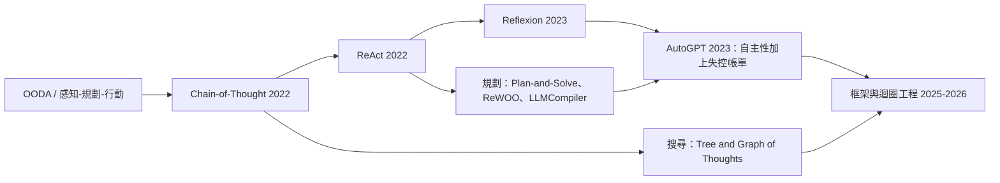
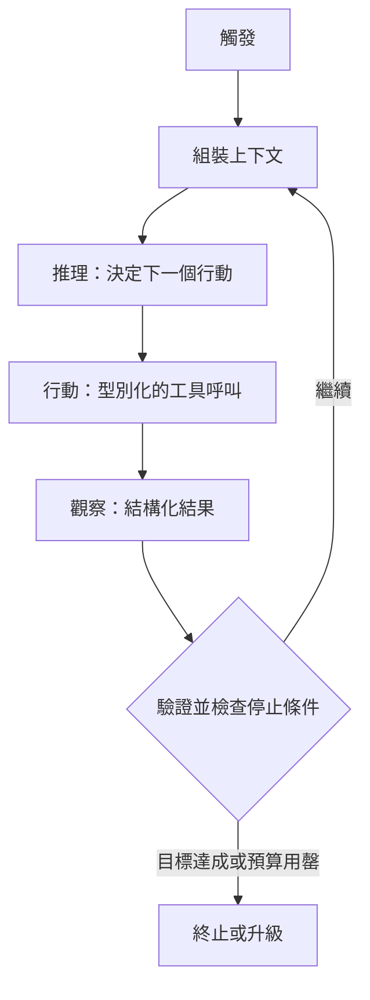
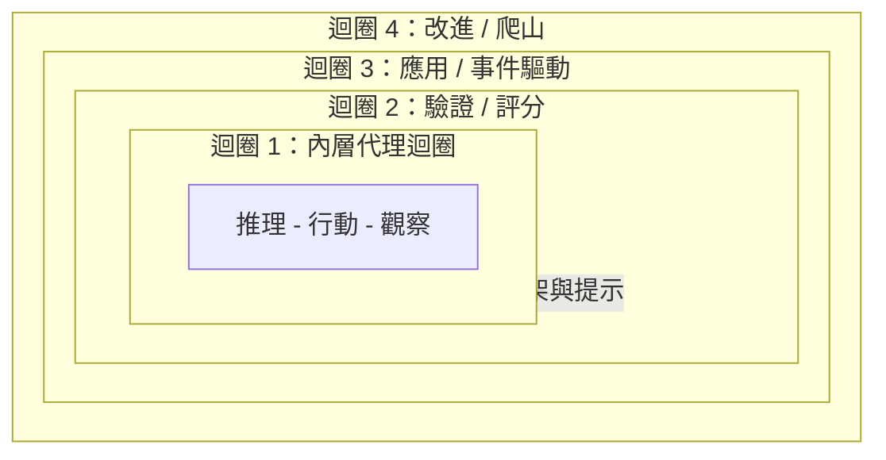
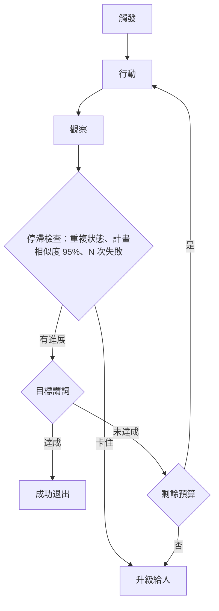

# 迴圈工程（Loop Engineering）

第 02 章談的是模型在「單一步驟」內如何推理：ReAct、Reflexion、Plan-and-Solve。**迴圈工程**這門學問則是把那層推理包裹起來。它是一套實務，圍繞著核心代理（一個模型加上若干工具）去設計、儀器化、並持續改進控制迴圈，而不是由人逐回合手動為模型下提示。

定義這個領域的觀念翻轉很直白：你不再是坐在聊天框裡的那個人，而是去打造一個系統，由它來提示、行動、觀察、驗證、記憶，並重新執行代理，朝著目標前進，直到一個可驗證的停止條件被滿足為止。一個強模型放在差勁的執行框架（harness）裡，會輸給一個普通模型放在出色框架裡的組合。到了 2026 年，迴圈品質已是一門有別於基礎模型品質的獨立學問，而槓桿點也從「寫出更好的提示」移到了「設計更好的迴圈」。

有兩條不變法則貫穿本章的一切：

1. **終止由執行框架依據確定性的判準來強制執行，絕不能交由模型自己宣稱「我做完了」。**
2. **驗證工作的實體，在結構上必須與產出工作的實體分離。**

## 目錄

- [從提示到迴圈工程](#from-prompting-to-loop-engineering)
- [血脈傳承：從 ReAct 到迴圈工程](#the-lineage-react-to-loop-engineering)
- [內層代理迴圈](#the-inner-agent-loop)
- [迴圈的四個層級](#the-four-levels-of-loops)
- [迴圈模式](#loop-patterns)
- [終止與預算控制](#termination-and-budget-control)
- [長迴圈中的上下文與記憶](#context-and-memory-in-long-loops)
- [驗證與評分](#verification-and-grading)
- [反模式](#anti-patterns)
- [真正重要的指標](#metrics-that-matter)
- [成熟度階梯](#the-maturity-ladder)
- [面試題](#interview-questions)
- [參考資料](#references)

---

## 從提示到迴圈工程

每一個世代的實務做法都包裹住前一代，而不是取代它。你仍然在寫提示，只是不再用手親自驅動模型。

| 層級 | 工作單位 | 你調校的東西 | 它最佳化的目標 |
|-------|--------------|---------------|-------------------|
| **提示工程** | 一次模型呼叫 | 措辭、範例、格式 | 單一個好回應 |
| **上下文工程** | 一份組裝好的上下文 | 檢索、記憶、壓縮 | 模型每次呼叫所看到的內容 |
| **框架工程（Harness engineering）** | 一次代理執行 | 驅動程式碼：工具、預算、停止邏輯 | 可靠的多步驟執行 |
| **迴圈工程** | 一個遞迴式目標 | 堆疊的迴圈：觸發、驗證、改進 | 一個自主、自我改進的系統 |

一個好用的心智模型：**模型是策略（policy），執行框架是核心（kernel）。** 各自獨立的團隊不斷收斂到同一套極簡設計（一個 LLM 加上工具，跑在一個迴圈裡），這暗示了迴圈是任務本身的性質，而非一時流行。

---

## 血脈傳承：從 ReAct 到迴圈工程

| 年代 | 步驟 | 它加進了什麼 |
|-----|------|---------------|
| 1950 年代起 | OODA、感知-規劃-行動 | 控制迴圈的概念：觀察、決策、行動、重複 |
| 2022 | Chain-of-Thought | 回答前先推理（此時還沒有工具） |
| 2022 | **ReAct** | 把 Thought、Action、Observation 交錯起來，並帶入真實的工具回饋 |
| 2023 | **Reflexion** | 一個外層迴圈：把失敗轉化成寫下來的自我批評，在下一次嘗試時重播它（跨多次試驗學習，而不只是在單次之內學習） |
| 2023 | Plan-and-Solve、ReWOO、LLMCompiler | 先規劃，再執行；延後觀察，或平行執行一個工具 DAG，以削減 token 與延遲 |
| 2023 | AutoGPT | 證明了大規模的完全自主迴圈可行，同時也暴露出無限迴圈與失控的 API 帳單 |
| 2025-2026 | 迴圈與框架工程 | 把迴圈本身當成被工程化的產物：觸發、驗證、預算，以及由評估驅動的改進 |

關鍵的概念性躍進是 Reflexion 的外層迴圈。ReAct 的內層迴圈在單一情節（episode）內學習；Reflexion 則跨情節學習，做法是把一段批評存進情節記憶（episodic memory），下次再重新載入。每一個現代的堆疊迴圈設計，都是這一步的後裔。

---

## 內層代理迴圈

這個狹義的技術產物就是**內層代理迴圈**：執行框架在「單一次代理執行」之內所跑的循環。它之所以迭代，是因為長程任務沒辦法在一次前向傳遞（forward pass）裡完成，也因為工具結果必須回饋之後才能給出最終答案。

下面這些元件正是工程功夫所在之處。大部分的工作落在確定性的執行框架，而不在模型。

| 元件 | 角色 |
|-----------|------|
| **觸發（Trigger）** | 啟動一個循環：人、排程、事件/掛鉤（hook），或一個自我設定的目標。決定成本與並行性的輪廓。 |
| **目標與指示** | 一個具體、可測試、有範圍的目標，附帶限制條件。這裡的含糊不清，正是目標漂移（goal drift）的根源。 |
| **上下文組裝** | 在每次呼叫前，蒐集指示、工作狀態、檢索到的記憶，以及先前的輸出。這是對抗上下文腐化（context rot）之處。 |
| **推理（Reason）** | 模型把任務分解，並挑選下一個行動。跨回合逐字保留思考區塊（thinking blocks），以維持連貫的續寫。 |
| **行動（Act）** | 一個型別化的工具呼叫：程式碼、shell、搜尋、查詢，或呼叫另一個代理。需要冪等鍵（idempotency keys），好讓重試有別於重複的副作用。對有副作用的工具加上沙箱（見 [代理式安全與沙箱化](09-agentic-security-and-sandboxing.md)）。 |
| **觀察（Observe）** | 把結果以結構化回饋的形式餵回去，帶有明確的 SUCCESS 或 FAILED 狀態，而不是原始傾印（raw dumps）。把巨大的輸出卸載到日誌，只回傳一個參照。 |
| **驗證（Verify）** | 對照判準檢查正確性，最好由一個獨立的評分者來做。這是那個能說「不」的元件。 |
| **終止邏輯** | 明確的成功、失敗，以及預算停止條件。 |
| **停滯偵測器** | 抓出毫無進展的情況：重複呼叫、來回擺盪、失控花費。 |
| **持久狀態** | 把進度持久化保存到上下文視窗之外，讓迴圈可恢復、可去重。關於崩潰安全、恰好一次（exactly-once）的恢復，見 [持久化執行](11-durable-execution.md)。 |
| **升級路徑** | 當觸及上限時，帶著一個精確的阻斷式問題路由給人。見 [人在環中的模式](08-human-in-the-loop-patterns.md)。 |
| **執行框架／驅動程式** | 確定性的外層程式碼，把上述一切串起來，並強制執行以上每一條規則。 |

---

## 迴圈的四個層級

迴圈工程是堆疊迴圈的藝術：在內層迴圈外面巢狀包覆更精緻的外層迴圈，並在自然的檢查點插入人的判斷。下面這四個層級是對全領域已收斂之模式的綜合整理，並非單一一套標準的編號方式。

| 層級 | 迴圈 | 它做什麼 | 觸發 | 由誰實作 | 略過它就會... |
|-------|------|--------------|---------|----------------|----------------|
| **0** | 推理深度（基線） | CoT、ReAct，或單一決策內的 Tree-of-Thoughts；它本身不是一個迴圈 | 不適用 | 提示加模型 | 步驟停留在淺層 |
| **1** | 內層代理迴圈 | 驅動單一次執行直到停止條件 | 執行開始時 | 驅動程式／核心 | 無法進行多步驟工作 |
| **2** | 驗證迴圈 | 為輸出評分，把失敗路由回去重試 | 內層迴圈的輸出 | 一個獨立的評分者 | 你出貨了未經驗證的工作 |
| **3** | 應用迴圈 | 在事件發生時呼叫代理，沒有人類提示者 | Cron、掛鉤、心跳、目標 | 排程器／webhook 層 | 系統維持手動 |
| **4** | 改進迴圈 | 把一再出現的失敗轉成永久的框架修正 | 軌跡（traces）與評估 | 一個評估框架 | 系統永遠不會變好 |

在第 1 與第 2 層之間有一個常見的變體：**內／外雙迴圈**。內層迴圈在當前策略之內執行；外層迴圈則對照原始目標監看進度，當內層迴圈卡住時，重設整套策略，而不是反覆重試那個一直失敗的步驟。

當迴圈平行運行時（編排者-工作者，或一個工具 DAG），給每個分支自己隔離的上下文與工作區，為合併結果定義明確的匯合（join）與聚合語意，並把整個扇出（fan-out）一起編列預算，這樣並行的分支才不會合力衝破上限。實際的瓶頸是審查頻寬，而不是分支數量。

---

## 迴圈模式

讓迴圈架構去匹配任務。在環境難以預測時，用探索式、高變異的迴圈；一旦某個序列已經收斂，就切換到有規劃、較便宜的執行；出錯時再退回探索。

| 模式 | 每個任務的模型呼叫數 | 延遲 | Token 成本 | 適應性 | 何時使用 |
|---------|----------------------|---------|------------|--------------|----------|
| **ReAct / 重試** | 高（每步一次） | 高 | 高 | 最高 | 不可預測的環境、探索 |
| **Reflexion** | 較高（跨試驗重試） | 高 | 高 | 高，跨多次嘗試學習 | 有清楚回饋、可重試的任務 |
| **Plan-and-Execute** | 一次規劃加 N 次執行 | 中 | 中 | 執行中途低 | 已收斂、可預測的工作流程 |
| **ReWOO** | 一次規劃，觀察延後 | 低 | 低 | 低 | 工具已知、對 token 敏感的執行 |
| **LLMCompiler** | 規劃加一個平行工具 DAG | 低（平行） | 中 | 低 | 可平行化的獨立子任務 |
| **Evaluator-Optimizer** | 生成加批評的迴圈 | 中 | 中 | 高 | 對品質要求高的草稿 |
| **Orchestrator-Workers** | 規劃者加工作者子代理 | 高（約為聊天的 15 倍） | 中（平行） | 高 | 廣泛、可平行化的研究或建置 |

有幾個模式在幾乎每一個生產環境迴圈裡都值得佔有一席之地：

- **生成者-驗證者（製作者-檢查者，maker-checker）分離。** 一個子代理起草；另一個（往往更強的）子代理對抗式地審查，並被告知要拒絕任何無法被驗證為完成的東西。獨立評分能抓出生成者自己不會承認的錯誤。
- **注入錯誤並重試。** 把退出碼（exit codes）、型別錯誤，以及失敗的測試帶回上下文，讓模型幾乎免費地自我修正。
- **新鮮上下文（fresh-context）技法。** 每次迭代都用一份乾淨的上下文重跑同一個目標提示，每個循環完成一個工作單位，在一個外部狀態檔裡追蹤進度，並在一個預先定義好的可驗證條件達成時退出。一個停止掛鉤（stop hook）會攔截退出嘗試，在放行之前先驗證是否確實完成。
- **以模型路由控制成本。** 把每一步送到「足夠勝任的最便宜層級」（小模型做分類、中模型做起草、前沿模型做審查），並釘住（pin）模型，讓迴圈不會在無聲中升級。再搭配對穩定前綴做提示快取（prompt caching）。
- **組合，而不是框架化。** 偏好能運作的最簡單模式。只有在真正需要迭代、適應性的工具使用時，才引入迴圈以及任何多代理層。

---

## 終止與預算控制

一個自然的停止訊號（模型回傳一段沒有工具呼叫的文字）是**必要但不充分**的。執行框架必須另外驗證目標是否完成。每一個生產環境迴圈，都至少應該帶有來自下面三大類別中每一類的一個判準。

| 停止條件 | 典型預設值 | 由誰強制執行 |
|----------------|-----------------|-------------|
| 目標謂詞通過（SUCCESS） | 任務專屬的測試 | 執行框架 |
| 不可恢復的錯誤或重試上限（FAILURE） | 3 到 5 次重試 | 執行框架 |
| 最大迭代次數 | QA 為 10、一般為 15-25、寫程式為 20-50 | 執行框架 |
| 牆鐘逾時（Wall-clock timeout） | 60 到 300 秒 | 執行框架 |
| Token 或金額上限 | 每個任務 | 閘道（gateway），位於代理程式碼之外 |
| 每個工具的配額 | 每個工具 | 執行框架 |
| 無進展或來回擺盪 | 3 次相同呼叫，或計畫相似度高於 95% | 執行框架 |
| 花費速率 | 持續高於約每分鐘 4k token | 閘道 |

有兩條規則把一個安全的迴圈和一個昂貴的迴圈分開：

- **在代理之外強制執行預算。** 如果花費檢查住在代理程式碼裡，一個有 bug 或被越獄的代理就能略過它自己的檢查。把它放在閘道或代理伺服器（proxy）上，讓代理無法繞過。
- **盯緊花費速率，而不只是累積花費。** 月度上限太粗；一個迴圈可以在二十分鐘內燒掉好幾百美元。一個健康的代理很少會持續維持高 token 吞吐量，因為它要等待 I/O，所以一個持續的尖峰就是一個可靠的失控訊號。

那些被回報的失敗案例並非假想：一個代理在五分鐘內呼叫了一個壞掉的工具 400 次、一次跑了 847 步卻從未產出答案的執行，以及在數天之間累積了數萬美元的重試迴圈（數字出自從業者的撰文）。它們幾乎全都缺少一個外部預算守衛和一個停滯斷路器。

---

## 長迴圈中的上下文與記憶

長迴圈會透過**上下文腐化（context rot）**靜悄悄地失敗：當視窗被過時的指示、舊的工具輸出，以及失敗的嘗試填滿時，輸出品質就會退化。它在觸及硬性上下文上限之前就會發作，這使它格外陰險。長上下文研究發現，前沿模型即使在答案就在其中時，也會隨著輸入長度而退化。更多原始上下文不等於免費的可靠性；精選（curation）勝過硬塞。

| 策略 | 它做什麼 |
|----------|--------------|
| **把狀態外部化到磁碟** | 把進度、計畫、發現放在檔案、issue 或資料庫裡，讓迴圈即使在模型於兩次執行之間忘掉一切時也能存活 |
| **每次迭代用新鮮上下文** | 每個循環重設視窗，或把子任務委派給有隔離上下文的子代理，這樣失敗的嘗試就不會腐化主迴圈 |
| **在退化前先壓縮** | 用摘要取代冗長的歷史，但保留原始內容可被定址，以供稽核與復原 |
| **卸載工具輸出** | 把巨大的輸出持久化到日誌，並回傳一行參照（單一次搜尋可能就是數千個 token） |
| **漸進式揭露** | 只在相關時才檢索上下文與技能，而不是把所有東西都前置載入 |
| **前綴穩定的排序** | 附加新訊息，而不是改寫先前的訊息，讓被快取的前綴持續命中 |

子代理隔離是在長建置中對抗上下文腐化最穩健的結構性防禦，因為每個子代理都在一個乾淨的視窗裡工作，並只回傳一個精簡的結果。關於底層的記憶分層（工作、情節、語意、程序），見 [代理記憶與狀態](05-agent-memory-and-state.md)。

---

## 驗證與評分

迴圈的可信度，僅止於那個替它評分的東西的可信度。當同一個模型既產出又評估時，模型會樂觀地為自己評分並做獎勵駭客（reward-hack）。關於內在自我修正（intrinsic self-correction）的研究令人清醒：少了外部訊號，天真的自我反思可能反而會讓推理退化，而不是改善它。

| 方法 | 速度 | 成本 | 性格 | 最適合 |
|--------|-------|------|-----------|----------|
| **基於程式碼**（測試、型別、linter、退出碼） | 毫秒到秒 | 趨近於零 | 客觀、脆 | 功能正確性 |
| **基於模型**（LLM-as-judge） | 秒 | 中 | 靈活，必須對齊人類專家校準 | 語意品質、風格 |
| **人類** | 慢 | 高 | 黃金標準 | 高風險、評分者校準 |

可運作的原則：

- **偏好確定性驗證**，並把失敗的錯誤文字注入回迴圈，讓模型便宜地自我修正。
- **為結果評分，而不是僵固的工具呼叫序列，** 這樣有效的替代做法才不會被處罰。
- **建立一個客觀的「目標完成」謂詞**並明確地檢查它，而不是把「完成」等同於「沒有工具呼叫」。
- **校準 LLM 評分者**，先用一小組由專家標註的案例校準，再去信任它們的分數。

關於軌跡基準測試與 LLM-as-judge 的逐步評分，見 [評估代理式系統](10-evaluating-agentic-systems.md)。

---

## 反模式

| 失敗模式 | 根本原因 | 修正 |
|--------------|------------|-----|
| **Loopmaxxing（迴圈最大化）** | 假設更多迭代能解決任何事；沒有可驗證的退出 | 定義一個成功謂詞；為迭代設上限；拒絕無法量化的目標 |
| **上下文腐化** | 視窗被過時的 token 填滿 | 提早壓縮、隔離子代理、卸載輸出 |
| **失控迴圈** | 沒有硬性停止、沒有斷路器 | 花費速率斷路器，加上一個外部預算守衛 |
| **幻覺式成功** | 信任模型的自我回報 | 確定性驗證器，加上一個目標謂詞 |
| **目標規格錯誤** | 含糊或代理（proxy）的目標（為了通過而刪掉一個失敗的測試） | 能捕捉到意圖的終止判準，加上一道人類關卡 |
| **狀態失憶** | 沒有持久檢查點 | 把已處理的項目外部化到磁碟或一塊 issue 看板 |
| **理解債（Comprehension debt）** | 變更的速度超過人類的審查 | 把「在途迴圈數」限制在審查頻寬，而不是工具量能 |
| **自我把關的預算** | 花費檢查住在代理程式碼裡 | 在閘道強制執行，位於代理之外 |
| **工具氾濫** | 50 個彼此重疊的工具會讓選擇退化 | 精選到大約 10 個聚焦的工具；超過 30 個就採用語意化的工具檢索 |
| **層級／任務不匹配** | 在一個長程任務上用了一個無狀態的迴圈 | 讓迴圈層級去匹配任務的時間跨度 |

**Loopmaxxing** 值得特別關注，因為它最具誘惑性。它是「只要再加更多 token」的多步驟後裔。它在沒有具體退出條件的主觀目標上失敗（改善 UX、寫一篇爆紅的貼文），所以迴圈永遠無法收斂、花費就此失控。即使是在可驗證的任務上，代理也會安頓在局部極小值裡，做出膽怯、零碎的微調，而不是大膽的舉動。更多迴圈不等於更多能力。

---

## 真正重要的指標

衡量的單位從「每 token 成本」轉向**「每任務成本」**。一個燒掉 15 倍 token 但避免了一次人類升級的迴圈，整體上可能比一個需要介入的便宜聊天機器人還要省。

- **任務成功率**，在一份精選的評估集上衡量，同時以 `pass@k`（k 次裡至少一次成功，當只要有一次成功就算數時）與 `pass^k`（k 次全部成功，用於面向客戶的可靠性）回報。這兩者很快就會分歧：在每次嘗試 70% 成功率之下，到 k=3 時差距就已經很大，並從那裡繼續擴大。
- **每任務成本**與 token 經濟學，對照一個基線做基準測試，外加提示快取命中率。
- **花費速率**（每分鐘的 token 與美元）作為即時的失控訊號。
- **完成所需迭代數**與牆鐘延遲。超過約 30 回合的執行通常意味著範圍蔓延（scope creep）。
- **無進展訊號**：重複連擊、循環之間的計畫相似度、來回擺盪的頻率。
- **失敗桶分布**（逾時、未驗證的寫入、未偵測到的指令失敗、過早終止、受模型能力所限），用來修正「為什麼」，而不只是「是什麼」。要預期會有一部分是受模型能力所限、無法靠框架調校來修正的。
- **上下文健康**：每次迭代的視窗增長、壓縮頻率、準確度對長度的曲線。
- **可審查性**：每審查工時改動的行數，以及已合併變更中實際被審查過的比例。審查頻寬，而不是工具能力，才是「在途迴圈數」真正的天花板。

當你調校執行框架時，一次只改一個旋鈕，平均 3 到 6 次執行以壓過執行間的雜訊，並在一個保留集（holdout）與一個回歸集上驗證勝果，這樣改進才不會在無聲中倒退。

---

## 成熟度階梯

分階段把一個迴圈從受監督帶到大致自主。每一個階段都為下一個階段掙得資格。

| 階段 | 自主性 | 你加進什麼 | 晉級的關卡 |
|-------|----------|--------------|-----------------|
| **1. 觀察** | 無 | 每一次修改都要人類核可 | 邊界案例已被盤點 |
| **2. 確定性退出** | 低 | 編譯器、linter、單元測試作為那個說「不」的東西 | 退出可靠 |
| **3. 斷路器** | 中 | 停滯偵測、花費速率限制、警報 | 失控能被可靠地抓到 |
| **4. 蒸餾並降階** | 高 | 把可預測的 LLM 步驟轉成編譯好的腳本 | 穩定步驟已腳本化，成本與變異下降 |

同一套迴圈設計，會因為工程師投入程度的不同而產出相反的結果。用來加速你「已經理解」的工作時，迴圈會複利放大你的槓桿。用來逃避思考時，它們會把理解債複利累積到沒人能審查出貨了什麼為止。這門功夫的關鍵，在於你打造的那個迴圈，以及你保留在其中的判斷。

---

## 面試題

### 問：定義代理迴圈，並解釋迴圈在何時是主動有害的。

**強力回答：**
內層代理迴圈就是執行框架在一次執行之內所跑的「推理-行動-觀察」循環：組裝上下文、讓模型挑一個行動、執行一個工具、把結果餵回去、檢查一個停止條件、重複。它之所以存在，是因為長程任務沒辦法在一次前向傳遞裡完成，而工具結果必須去左右後續的步驟。當任務是固定且可預測時，迴圈就有害：它只會增加延遲（每一次迭代都是又一趟來回）、成本，以及非確定性，卻沒有任何好處。我的決策準則是：一次性的轉換用單一個 LLM 呼叫，已知的固定序列用一條確定性管線，只有在路徑真的取決於中間結果時才用迴圈。

### 問：為什麼驗證者必須與產出者分離，而預算強制執行又該住在哪裡？

**強力回答：**
當同一個模型既產出又評分時，它會樂觀地為自己評分，並朝著「那個檢查所衡量的東西」做獎勵駭客；研究顯示內在自我修正甚至可能讓推理退化。所以我會把它們拆開：先是確定性評分者（測試、型別、linter），接著是一個獨立的、往往更強的模型，作為一個被指示要拒絕任何無法被驗證為完成之物的對抗式審查者，並在高風險案例上加上人類。預算強制執行必須住在代理之外，在一個閘道或代理伺服器上。如果花費與停止檢查都在代理程式碼裡，一個有 bug 或被越獄的代理就能略過它自己的守衛。閘道也給了我分層的上限，從每個工具到每個工作階段（session）再到每把金鑰，外加一個能抓到月度上限漏掉之失控情況的花費速率斷路器。

### 問：一個代理在五分鐘內呼叫了一個壞掉的工具 400 次。診斷並設計修正。

**強力回答：**
這是一個沒有停滯偵測的失控迴圈。代理一直收到一個含糊的失敗，就永無止境地重試。我會把「工具名稱加引數」這個元組做雜湊，並在重複連擊時中止（三次相同呼叫就是決定性的）、偵測兩個狀態之間的來回擺盪，並以相似度比較相繼的計畫，在高於約 95% 時停下。我會加上一個花費速率斷路器，因為持續的高吞吐量本身就是那個訊號，並把這一切都在閘道強制執行，讓代理無法繞過。我也會修正近因：含糊的工具回饋（「可能還有更多結果」）會招來無止境的重試，所以工具應該回傳明確的 SUCCESS 或 FAILED 終端狀態。一旦觸及上限，就帶著一個精確的阻斷式問題升級給人，而不是無聲地繼續。

### 問：什麼是 loopmaxxing，你又如何把一個無法收斂的迴圈轉成一個有用的迴圈？

**強力回答：**
Loopmaxxing 是一種信念，認為更多迭代會自動解決更難的問題，它是 token-maxxing 的多步驟版本。它在沒有具體退出條件的目標上失敗，例如「改善 UX」，於是迴圈永遠無法收斂、花費就此失控。修正之道是製造出一個可驗證的成功函式。對一個含糊的目標，我會把它分解成可檢查的謂詞：與其說「改善測試覆蓋率」，停止條件變成「billing 模組的覆蓋率至少達到 90%，且測試套件以零退出」。如果一個目標真的無法被弄成可檢查，那它就不屬於一個自主迴圈；它屬於一個人在環中的工作流程，由代理起草、由一個人來判斷。

### 問：解釋上下文腐化，以及你針對一個長達數小時的迴圈的完整緩解堆疊。

**強力回答：**
上下文腐化是隨著對話紀錄（transcript）因過時的指示、舊的工具輸出，以及失敗的嘗試而增長，所發生的無聲品質退化。它在觸及硬性上下文上限之前就會發作，而長上下文研究顯示模型即使在答案就在其中時也會隨輸入長度退化，所以更大的視窗並不是解方。我的堆疊是：把狀態外部化到磁碟，讓迴圈可恢復且不必每個循環都重新推導上下文；把子任務隔離在有新鮮視窗的子代理裡，這是最強的結構性防禦；在退化變得可見之前把冗長的歷史壓縮成摘要，同時讓原始內容仍可被定址；把巨大的工具輸出卸載到日誌並回傳一個參照；並把訊息排序成讓穩定前綴持續命中提示快取。指導原則是：上下文精選勝過上下文硬塞。

---

## 參考資料

- Yao et al. "ReAct: Synergizing Reasoning and Acting in Language Models" (2022). https://arxiv.org/abs/2210.03629
- Shinn et al. "Reflexion: Language Agents with Verbal Reinforcement Learning" (2023). https://arxiv.org/abs/2303.11366
- Xu et al. "ReWOO: Decoupling Reasoning from Observations" (2023). https://arxiv.org/abs/2305.18323
- Kim et al. "An LLM Compiler for Parallel Function Calling" (2024). https://arxiv.org/pdf/2312.04511
- Huang et al. "Large Language Models Cannot Self-Correct Reasoning Yet" (2024). https://arxiv.org/abs/2310.01798
- Chroma Research. "Context Rot: How Increasing Input Tokens Impacts LLM Performance" (2025). https://www.trychroma.com/research/context-rot
- LangChain. "The Art of Loop Engineering." https://www.langchain.com/blog/the-art-of-loop-engineering
- LangChain. "Better Harness: Harness Hill-Climbing with Evals." https://www.langchain.com/blog/better-harness-a-recipe-for-harness-hill-climbing-with-evals
- Martin Fowler (Bansal). "Harness Engineering." https://martinfowler.com/articles/harness-engineering.html
- Oracle Developers. "The Agent Loop Decoded: Three Levels Every Agent Engineer Must Know." https://blogs.oracle.com/developers/the-agent-loop-decoded-three-levels-every-agent-engineer-must-know
- Data Science Dojo. "Agentic Loops: From ReAct to Loop Engineering." https://datasciencedojo.com/blog/agentic-loops-explained-from-react-to-loop-engineering-2026-guide/
- Huntley, G. "The Ralph Loop." https://ghuntley.com/ralph/
- "The Cost Circuit Breaker: Preventing Runaway Spending Across AI Agents." https://dev.to/sebastian_chedal/the-cost-circuit-breaker-how-we-prevent-runaway-spending-across-9-ai-agents-4i5k

---

*下一篇：[記憶架構](../08-memory-and-state/01-memory-architectures.md)*
