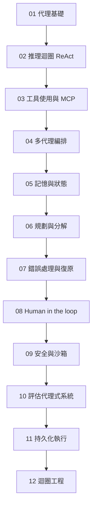
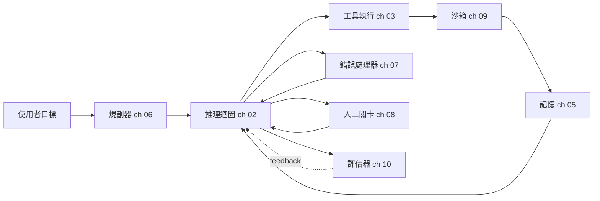

# 代理式系統

在 2026 年打造生產環境的 AI 代理：推理迴圈、MCP 工具使用、多代理編排、記憶、規劃、錯誤復原、human-in-the-loop，以及評估。

代理並不是單一的技術。它們是推理迴圈、工具層、記憶、規劃器、錯誤處理器與評估器的組合。本資料夾中的 12 個章節深入探討每一層，並依序排列，讓較前面的章節建立起後面章節會用到的詞彙。

## 章節順序

## 參考架構

每個章節的概念都對應到已部署代理的某一個元件。下圖顯示每個章節的內容在生產環境系統中所處的位置：

## 本資料夾中的檔案

| 檔案 | 內容涵蓋 |
|------|----------------|
| [01-agent-fundamentals.md](01-agent-fundamentals.md) | 是什麼讓一個系統成為「代理」；代理與工作流程的區別；何時該選擇哪一種。 |
| [02-reasoning-loops-react-and-beyond.md](02-reasoning-loops-react-and-beyond.md) | ReAct、Plan-and-Execute、Reflexion、Tree-of-Thought；迴圈設計模式。 |
| [03-tool-use-and-mcp.md](03-tool-use-and-mcp.md) | 函式呼叫、Model Context Protocol (MCP)、A2A v1.0、MCP 生產環境強化。 |
| [04-multi-agent-orchestration.md](04-multi-agent-orchestration.md) | 多代理何時有幫助、何時有害；編排與編舞 (choreography) 的對比。 |
| [05-agent-memory-and-state.md](05-agent-memory-and-state.md) | L1-L4 記憶階層（工作、情節、語意、程序）及其取捨。 |
| [06-planning-and-decomposition.md](06-planning-and-decomposition.md) | 任務分解、計畫修訂、長視野規劃。 |
| [07-error-handling-and-recovery.md](07-error-handling-and-recovery.md) | 工具失敗、重試、迴圈防護、「第 100 次工具呼叫」問題。 |
| [08-human-in-the-loop-patterns.md](08-human-in-the-loop-patterns.md) | 確認關卡、升級處理、受監督的自主性。 |
| [09-agentic-security-and-sandboxing.md](09-agentic-security-and-sandboxing.md) | 程式碼執行沙箱、能力閘控、代理中的提示注入。 |
| [10-evaluating-agentic-systems.md](10-evaluating-agentic-systems.md) | 軌跡評估、Agent-as-judge、Process Reward Models、代理基準測試。 |
| [11-durable-execution.md](11-durable-execution.md) | 在長時間執行的代理中熬過當機：事件歷史、重播、exactly-once 副作用、Temporal。 |
| [12-loop-engineering.md](12-loop-engineering.md) | 設計代理周圍的迴圈：四個迴圈層級、終止與預算控制、上下文腐化 (context rot)、驗證，以及像 loopmaxxing 這類的反模式，還有成熟度階梯。 |

## 配套章節

- [工具使用與電腦代理](../17-tool-use-and-computer-agents/) 以 OpenClaw、Computer Use 與工具代理生態延伸本節內容。
- [LangGraph 編排](../09-frameworks-and-tools/02-langgraph-orchestration.md) 是實作本節各種模式最常見的框架。
- [Agentic RAG](../06-retrieval-systems/08-agentic-rag.md) 是代理與檢索的交集。
- [可靠性與安全](../13-reliability-and-safety/) 把代理式安全延伸到第 09 章沙箱之外。

## 重點摘要

- 代理並不是單一的技術；它們是推理迴圈、工具層、記憶、規劃器與評估器的組合。請先閱讀第 01 章。
- MCP 是 2026 年標準的工具互通協定；除非你有充分的理由，否則不要自建客製化的工具協定。
- 多代理編排（第 04 章）被過度套用；對於大多數使用情境，搭配良好工具的單一代理表現勝過多代理。
- 記憶（第 05 章）與錯誤復原（第 07 章）是大多數生產環境代理 bug 所在之處；請在這些地方多投入評估心力。
- Human-in-the-loop（第 08 章）不是備援機制；要為高風險的動作刻意設計關卡。
- 迴圈工程（第 12 章）如今自成一門學問：強模型放在弱的執行框架 (harness) 中，會輸給放在優秀框架中的尚可模型。在框架中強制執行終止與預算，並讓驗證器與生產者保持分離。
