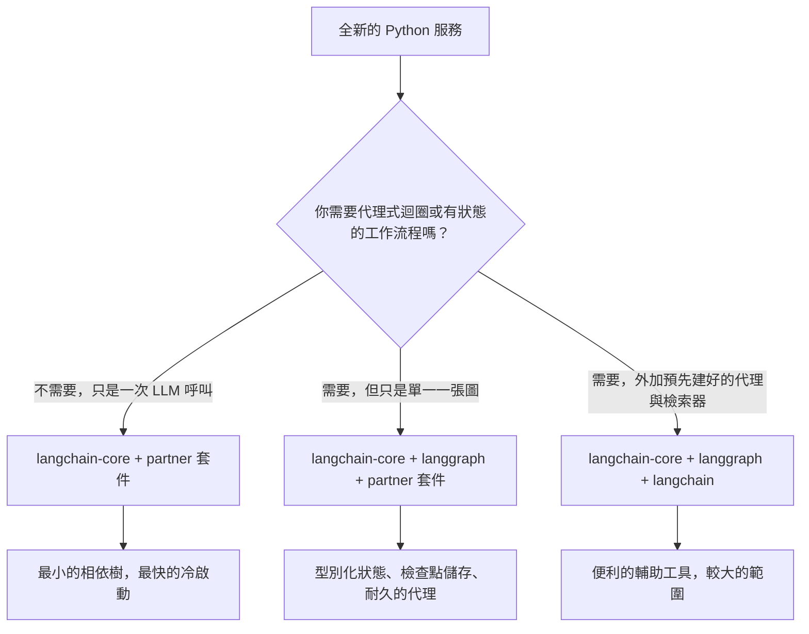

# LangChain 深入剖析

LangChain 已經不再只是一套「提示用的函式庫」。它已經成熟為一個用來打造生產級 LLM 應用的**模組化生態系（Modular Ecosystem）**。LangGraph（已於 2025 年底升級到 v1.0，並成為所有 LangChain 代理的預設執行環境）負責有狀態的編排。**LCEL（LangChain Expression Language）**則仍然是建構可組合鏈（composable chains）最快的方式。

## 目錄

- [LangChain 技術堆疊](#stack)
- [LCEL：用管線（Pipes）來寫程式](#lcel)
- [標準抽象層（Core）](#core)
- [管理複雜度（Community 與 Partner 套件之比較）](#complexity)
- [LangChain 模組化推進](#langchain-modularity-push)
- [面試問題](#interview-questions)
- [參考資料](#references)

---

## LangChain 技術堆疊

這個生態系現在分成三個獨立的層次：
1. **LangChain Core**：針對 Prompts、Output Parsers 與 Runnables 的最小化抽象。（相依套件的佔用空間很小。）
2. **LangChain Community/Partner**：對 500 多種資料庫、模型與工具的整合。
3. **LangGraph**：有狀態的編排層（在下一章說明）。

---

## LCEL：用管線（Pipes）來寫程式

LangChain Expression Language（LCEL）使用 `|` 運算子來建立一個執行用的**有向無環圖（Directed Acyclic Graph, DAG）**。

```python
# Standard RAG chain
chain = (
    {"context": retriever, "question": RunnablePassthrough()}
    | prompt
    | model.with_structured_output(Schema) 
)
```

**為什麼要用 LCEL？**
- **預設非同步（Async by Default）**：每一條鏈都支援 `.ainvoke()` 與 `.astream()`。
- **平行處理（Parallelism）**：多個分支會自動平行執行。
- **可觀測性（Observability）**：自動與 **LangSmith** 整合，提供完整追蹤（full-trace）的視覺化。

---

## 標準抽象層

### 1. Runnables
LangChain 中所有東西的「基礎類別（Base Class）」。Runnables 為 `.invoke`、`.batch` 與 `.stream` 提供一致的介面。

### 2. 工具與工具呼叫（Tools & Tool-Calling）
LangChain 對 **MCP（Model Context Protocol）**提供第一級（first-class）的支援。
- 你可以把任何一個 MCP 伺服器轉換成一個 LangChain 的 `BaseTool`。

### 3. Output Parsers
早期的系統使用正規表示式（regex），而現代的程式碼則使用 `.with_structured_output()`，它會運用模型原生的 JSON 能力（OpenAI 的 `.json_mode` 或 Anthropic 的 `tools`）。

---

## 管理複雜度

> [!TIP]
> **生產環境最佳實務**：在關鍵路徑上避免使用 `langchain-community`。改用 **Partner 套件**（例如 `langchain-openai`、`langchain-pinecone`），以減少相依套件的地獄（dependency hell），並提升穩定度。

---

## LangChain 模組化推進

到了 2026 年 5 月，這個生態系已經完成了它漫長的遷移過程，從單體式（monolithic）的 `langchain` import 轉變為一個具有清晰相依邊界的分層結構。會做這樣的拆分，是為了讓各團隊能精準挑選自己所需的範圍（surface area），而不必把 500 多種整合一併拖進來。

### 出貨時的套件分層

| 套件 | 用途 | 直接相依套件 |
|---------|---------|---------------------|
| `langchain-core` | Runnables、prompts、output parsers、工具抽象 | Pydantic、`tenacity`，幾乎沒有別的 |
| `langchain` | 純 Python 的參考用鏈（chains）、檢索器（retrievers）、代理 | `langchain-core` |
| `langgraph` | 有狀態的圖形編排、檢查點（checkpointing）、時光回溯（time-travel） | `langchain-core` |
| `langchain-openai`、`langchain-anthropic`、`langchain-google-vertexai` 等 | 各供應商的 Partner 套件 | `langchain-core` 加上該供應商的 SDK |
| `langchain-community` | 長尾的各種整合（仍保留可用，但在生產路徑上已不再建議使用） | 很多 |
| `langchain-classic` | 舊版 v0 的鏈，為了遷移而保留 | `langchain-core` |

依照 v1 釋出版本的訊息，`langchain-core` 是唯一一個以穩定範圍出貨、並提供向後相容性（backwards-compatibility）保證的套件（[LangChain 部落格，Building with LangChain 1.0](https://blog.langchain.com/langchain-1-0/)）。

### 跨驗證函式庫的標準 JSON Schema

對應用程式碼來說最大的單一變化是：`with_structured_output()`、`bind_tools()` 與 `@tool` 現在都接受任何相容於 [JSON Schema](https://json-schema.org/) 的物件。這包括：

- **Pydantic v2**（過去的預設值）
- **[Zod 4](https://zod.dev/v4)**，透過 `zod-to-json-schema`，供 JavaScript / TypeScript 版的 LangChain 使用
- **[Valibot](https://valibot.dev/)**（函數式、可做 tree-shaking 的 TS 驗證）
- **[ArkType](https://arktype.io/)**（把 TypeScript 型別當成執行期 schema 使用）
- Python 中單純的 dict / TypedDict
- 手工撰寫的 JSON Schema 文件

這份內容記載於 [LangChain v1 結構化輸出指南](https://docs.langchain.com/oss/python/langchain/structured-output)以及 [JS 結構化輸出指南](https://js.langchain.com/docs/how_to/structured_output)。實際的效果是：框架的選擇不再決定驗證器（validator）的選擇，而那些已經在自己的 HTTP 層標準化採用 Valibot 或 ArkType 的團隊，可以把那些 schema 直接重複用來當作 LangChain 的工具定義。

```python
# Python: TypedDict tool schema, no Pydantic in the path
from typing import TypedDict, Annotated
from langchain_anthropic import ChatAnthropic

class CreateInvoice(TypedDict):
    """Create an invoice for a customer."""
    customer_id: Annotated[str, ..., "Stripe customer id"]
    amount_cents: Annotated[int, ..., "Amount in cents, > 0"]

llm = ChatAnthropic(model="claude-opus-4-7")
structured = llm.with_structured_output(CreateInvoice)
```

```typescript
// TypeScript: Valibot schema reused for both HTTP and tool calling
import * as v from "valibot";
import { ChatAnthropic } from "@langchain/anthropic";
import { toJsonSchema } from "@valibot/to-json-schema";

const CreateInvoice = v.object({
  customer_id: v.pipe(v.string(), v.description("Stripe customer id")),
  amount_cents: v.pipe(v.number(), v.minValue(1)),
});

const llm = new ChatAnthropic({ model: "claude-opus-4-7" });
const structured = llm.withStructuredOutput(toJsonSchema(CreateInvoice));
```

### 什麼時候只用 `langchain-core`，什麼時候用完整的 LangChain



2026 年 5 月建議採取的立場：

- **函式庫 / SDK 程式碼**：只相依於 `langchain-core`。可重複使用的建構元件（向量資料庫、分塊器、自訂工具）的生產者，絕對不應該把 `langchain` 或 partner 套件當成直接相依套件拉進來。[LangChain 整合指南](https://docs.langchain.com/oss/python/integrations/providers)把這一點描述為 `langchain-community` 貢獻者必須遵守的硬性規則。
- **應用服務**：`langchain-core` 加上你實際會呼叫的 partner 套件，若你有多步驟的工作流程則再加上 `langgraph`。除非你明確會用到內建的檢索器或舊版的鏈，否則跳過 `langchain`（這裡指的是套件，而非品牌）。
- **筆記本與原型**：用 `langchain` 圖個方便就好。

版本鎖定（version pin）很重要。`langchain-core >= 1.0` 是新程式碼受支援的下限；0.3.x 這條線仍會收到關鍵修補，但依照 [LangChain v1 釋出公告](https://blog.langchain.com/langchain-1-0/)，它會在 2026 年第三季前停止維護（EOL）。

### 既有程式碼的遷移注意事項

- `LLMChain`、`RetrievalQA`、`ConversationalRetrievalChain` 與 `AgentExecutor` 都位於 `langchain-classic` 中，並已凍結。替代方案是一條 LCEL 管線，或者更常見的是一張 `langgraph` 圖（[LangChain 遷移指南](https://python.langchain.com/docs/versions/v0_3/)）。
- 工具裝飾器（tool decorators）要從 `langchain_core.tools` 匯入，而非 `langchain.tools`。
- 相依於 Pydantic v1 的 output parsers 必須移植。`langchain-core` v1.0 已移除 v1 的相容墊片（shim）（[釋出說明](https://github.com/langchain-ai/langchain/releases/tag/langchain-core%3D%3D1.0.0)）。

---

## 面試問題

### Q：相較於傳統的 Python「鏈（Chains）」（一連串的函式呼叫），LCEL 的主要好處是什麼？

**強答案：**
LCEL 提供**自動串流與平行化（Automatic Streaming and Parallelization）**。在傳統的 Python 鏈裡，我必須為平行步驟手動處理 `asyncio.gather`，並為串流寫自訂的產生器（generators）。LCEL 的 `Runnable` 架構在底層幫你處理好這些。如果我定義一個 `RunnableParallel` 區塊，LangChain 就會同時執行它們。更重要的是，LCEL 透過 `RunnableBranch` 提供**動態路由（Dynamic Routing）**，讓你不必寫層層巢狀的 if/else 敘述，就能輕鬆建立複雜的邏輯。

### Q：LangChain 常被批評「太臃腫（too bloated）」。你會如何用它來架構一套精簡的生產系統？

**強答案：**
關鍵在於**只匯入 Core**。我會用 `langchain-core` 來取得抽象層，並用特定的 **Partner 套件**（例如 `langchain-anthropic`）來取得模型。我會避開 `langchain-community` 以及舊版的 `Chain` 類別（像是 `LLMChain` 或 `RetrievalQA`），那些實際上都已被棄用。我會用 **Runnable** 這些基本元件來建構我的邏輯，這能讓相依樹維持小巧，並讓執行路徑保持透明。

---

## 參考資料
- LangChain. 〈The LangChain Expression Language Specification〉(2025)
- Anthropic. 〈Partner Integration Guide for LangChain〉(2025)
- Harrison Chase. 〈The Future of AI Orchestration〉(2024 podcast/post)

---

*下一篇：[LangGraph 編排](02-langgraph-orchestration.md)*
